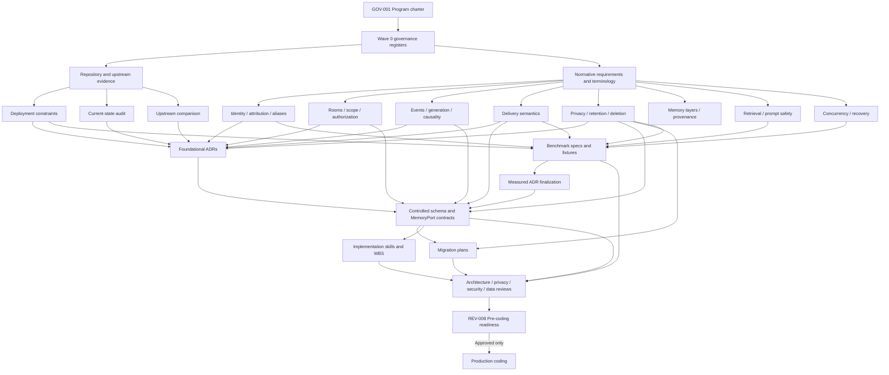

# DC_BOT Shared-Memory Program Charter

**Artifact filename:** `00-program-charter.md`  
**Artifact ID:** GOV-001  
**Version:** 0.1  
**Status:** Draft for formal approval  
**Prepared:** 2026-08-01  
**Governing repository:** `starryark/DC_BOT`  
**Evidence baseline:** `main` at commit `0ea3cbf5ec92f719e2b48066c3ada45aa50122ad`  
**Program disposition at issuance:** **CONDITIONAL GO for documentation, evidence collection, and isolated measurement only; NO-GO for production implementation.**

---

## 1. Title and artifact filename

**Title:** DC_BOT Shared-Memory Program Charter  
**Filename:** `00-program-charter.md`

This charter governs the multi-agent documentation, decision, review, and pre-coding readiness program for a shared-memory implementation in DC_BOT. It converts the supplied source-plan baseline into a controlled sequence of evidence, specifications, decisions, benchmarks, implementation skills, runbooks, reviews, and traceability records. The baseline’s privacy, identity, attribution, delivery, deletion, and no-silent-fallback requirements are treated as release-blocking. [Source-plan requirement]

## 2. Executive conclusion

**Recommendation.** The program may begin repository audit, requirements analysis, threat modeling, benchmark design, and architecture decision work in parallel. It must not begin production coding until the foundational identity, scope, event, causality, delivery, privacy, deletion, and degraded-mode decisions are approved and reflected in a single controlled schema/API baseline.

**Confirmed repository fact.** At the inspected DC_BOT commit, direct text handling owns an `InMemoryRoomStore`, while voice handling owns a separate per-guild `GuildSession` history. Group voice input preserves individual utterances before generation, but the controller can collapse the accepted group turn to the presentation name `Discord group` and later commit a single exchange. These facts establish the need for a transport-neutral memory authority and a many-to-many causal model; they do not, by themselves, prove that a standalone HTTP service is needed.

Sources:
- https://raw.githubusercontent.com/starryark/DC_BOT/0ea3cbf5ec92f719e2b48066c3ada45aa50122ad/airi/services/discord-bot/src/orchestration/mention-responder.ts
- https://raw.githubusercontent.com/starryark/DC_BOT/0ea3cbf5ec92f719e2b48066c3ada45aa50122ad/airi/services/discord-bot/src/orchestration/conversation-controller.ts
- https://github.com/starryark/DC_BOT/commit/0ea3cbf5ec92f719e2b48066c3ada45aa50122ad

**Confirmed upstream fact.** AIRI’s roadmap labels Memory Alaya as WIP, and issue #879 is an open proposal containing hypothetical retrieval weights and architecture ideas. It is not admissible as proof of implemented production behavior. AstrBot provides confirmed persisted conversation and platform-message structures, including sender attribution, but one inspected conversation update path reads and replaces a JSON conversation payload; concurrent safety must be measured or separately proven before adopting a similar model.

Sources:
- https://raw.githubusercontent.com/moeru-ai/airi/4d6e61f77dc99ec76c7cf352df62abb4282386c5/README.md
- https://github.com/moeru-ai/airi/issues/879
- https://raw.githubusercontent.com/AstrBotDevs/AstrBot/49095d3ba3fca9272a67aa5eeab2f6c0719c5091/astrbot/core/db/po.py
- https://raw.githubusercontent.com/AstrBotDevs/AstrBot/49095d3ba3fca9272a67aa5eeab2f6c0719c5091/astrbot/core/conversation_mgr.py
- https://raw.githubusercontent.com/AstrBotDevs/AstrBot/49095d3ba3fca9272a67aa5eeab2f6c0719c5091/astrbot/core/db/sqlite.py

**Program ruling.** The initial architectural hypothesis is an in-process domain/application layer behind a transport-neutral `MemoryPort`, with a database selected by measured deployment and concurrency needs. A standalone Memory Runtime remains a migration option, not a default requirement. Vectors, graph storage, learned reranking, and a mandatory microservice are prohibited from the first coding wave unless their explicit admission gates pass.

## 3. Scope

### 3.1 In scope

- Governance of all pre-coding shared-memory artifacts.
- Repository evidence collection and provenance control.
- Identity, actor snapshot, attribution, alias, address, room, session, and conversation semantics.
- Raw events, generations, causal links, delivery attempts, memory items, summaries, and derived indexes.
- Authorization, isolation, retention, correction, export, deletion, backup, and cache/index invalidation.
- Retrieval baseline, prompt serialization safety, multilingual evaluation, and optional advanced retrieval gates.
- Topology, storage, concurrency, idempotency, delivery recovery, migration, observability, and degraded-mode decisions.
- Benchmark plans, test vectors, rollout gates, implementation skills, and operational runbooks.
- Traceability from requirement through rollout gate.

### 3.2 Out of scope for this charter

- Production code changes.
- Final schema or API selection before the prerequisite decisions are approved.
- A claim that Discord account identity is a verified cross-platform human identity.
- A commitment to vectors, graphs, learned rerankers, or a standalone service.
- Unmeasured latency targets or retrieval coefficients.
- Production retention before deletion, export, backup, and recovery behavior is specified.

## 4. Sources inspected

| Repository/source | Inspected ref | Evidence type | Material inspected | Access limits |
|---|---|---|---|---|
| DC_BOT | `main` @ `0ea3cbf5ec92f719e2b48066c3ada45aa50122ad` | Primary repository | Commit tree; direct bot bootstrap/package; text responder; room store; voice controller; group builder; event types; Discord adapter | Web/raw-file inspection only; no clone or runtime execution; selected files, not exhaustive |
| AIRI | `main` @ `4d6e61f77dc99ec76c7cf352df62abb4282386c5` | Required comparison | README roadmap; open issue #879 proposal | Roadmap and proposal evidence do not establish production completeness |
| AstrBot | `master` @ `49095d3ba3fca9272a67aa5eeab2f6c0719c5091` | Required comparison | Persisted models; SQLite setup; conversation manager update path | Selected files only; concurrency behavior not load-tested |
| Supplied source-plan baseline | Uploaded assignment | Governing input | Twenty-two baseline directions, thirteen critical risks, working rules, and required artifact format | Requirements still require ADR-level resolution where the baseline intentionally leaves alternatives open |

Stable repository references:

- DC_BOT commit: https://github.com/starryark/DC_BOT/commit/0ea3cbf5ec92f719e2b48066c3ada45aa50122ad
- AIRI commit: https://github.com/moeru-ai/airi/commit/4d6e61f77dc99ec76c7cf352df62abb4282386c5
- AstrBot commit: https://github.com/AstrBotDevs/AstrBot/commit/49095d3ba3fca9272a67aa5eeab2f6c0719c5091

## 5. Evidence table

| ID | Claim | Classification | Source URL | Confidence |
|---|---|---|---|---|
| EVID-001 | DC_BOT text mentions use a private `InMemoryRoomStore`. | Confirmed repository fact | https://raw.githubusercontent.com/starryark/DC_BOT/0ea3cbf5ec92f719e2b48066c3ada45aa50122ad/airi/services/discord-bot/src/orchestration/mention-responder.ts | High |
| EVID-002 | The inspected text path serializes work per resolved room and appends user/assistant turns after generation. | Confirmed repository fact | Same as EVID-001 | High |
| EVID-003 | The inspected voice controller waits for playback drain before committing both halves of an exchange. | Confirmed repository fact | https://raw.githubusercontent.com/starryark/DC_BOT/0ea3cbf5ec92f719e2b48066c3ada45aa50122ad/airi/services/discord-bot/src/orchestration/conversation-controller.ts | High |
| EVID-004 | A group voice generation may use the first input event, latest user ID, and display name `Discord group`, then commit a single exchange. | Confirmed repository fact | Same as EVID-003 | High |
| EVID-005 | Individual group utterances exist before the controller’s collapse step. | Confirmed repository fact | https://raw.githubusercontent.com/starryark/DC_BOT/0ea3cbf5ec92f719e2b48066c3ada45aa50122ad/airi/services/discord-bot/src/orchestration/group-turn-builder.ts | High |
| EVID-006 | The current input event base includes IDs, display name, and timestamp, but the inspected type does not provide the full proposed Discord actor snapshot. | Confirmed repository fact | https://raw.githubusercontent.com/starryark/DC_BOT/0ea3cbf5ec92f719e2b48066c3ada45aa50122ad/airi/services/discord-bot/src/orchestration/events.ts | High |
| EVID-007 | The inspected Discord adapter requests message and voice intents but not `GuildMembers`. | Confirmed repository fact | https://raw.githubusercontent.com/starryark/DC_BOT/0ea3cbf5ec92f719e2b48066c3ada45aa50122ad/airi/services/discord-bot/src/discord/airi-adapter.ts | High |
| EVID-008 | The inspected bot composes Discord, voice, brain, ASR, TTS, text, and conversation components in one process. | Confirmed repository fact | https://raw.githubusercontent.com/starryark/DC_BOT/0ea3cbf5ec92f719e2b48066c3ada45aa50122ad/airi/services/discord-bot/src/index.ts | High |
| EVID-009 | The current topology makes an in-process first milestone plausible; it does not demonstrate a need for a mandatory HTTP memory service. | Inference | EVID-008 plus source-plan risk A | Medium-high |
| EVID-010 | AIRI labels Memory Alaya WIP. | Confirmed repository fact | https://raw.githubusercontent.com/moeru-ai/airi/4d6e61f77dc99ec76c7cf352df62abb4282386c5/README.md | High |
| EVID-011 | AIRI issue #879 is an open proposal and includes example ranking coefficients and open questions. | Confirmed repository fact | https://github.com/moeru-ai/airi/issues/879 | High |
| EVID-012 | AstrBot persists conversation content in a JSON field and separately models platform message history with sender ID/name. | Confirmed repository fact | https://raw.githubusercontent.com/AstrBotDevs/AstrBot/49095d3ba3fca9272a67aa5eeab2f6c0719c5091/astrbot/core/db/po.py | High |
| EVID-013 | AstrBot’s inspected manager appends a user/assistant pair to loaded content and calls an update that replaces the conversation content field. | Confirmed repository fact | https://raw.githubusercontent.com/AstrBotDevs/AstrBot/49095d3ba3fca9272a67aa5eeab2f6c0719c5091/astrbot/core/conversation_mgr.py and https://raw.githubusercontent.com/AstrBotDevs/AstrBot/49095d3ba3fca9272a67aa5eeab2f6c0719c5091/astrbot/core/db/sqlite.py | High |
| EVID-014 | The inspected AstrBot path is not sufficient evidence that whole-history JSON replacement meets DC_BOT’s concurrent append requirements. | Inference | EVID-013; no concurrent benchmark inspected | High |
| EVID-015 | Unified authority, durable Discord ID, scoped aliases, many-to-many causality, delivery separation, deletion completeness, authorization-first retrieval, and no silent fallback are governing requirements. | Source-plan requirement | Supplied assignment | High |
| EVID-016 | Ordinary append commits should not automatically fail just because the room changed during model generation. | Source-plan risk to test | Supplied assignment, risk B | High |
| EVID-017 | Database persistence and Discord delivery cannot be exactly atomic; crash windows require explicit states and reconciliation. | Source-plan requirement/risk | Supplied assignment, risks C and requirement 13 | High |

## 6. Current-state findings

### 6.1 Memory ownership is split

**Confirmed repository fact.** Text and voice do not currently share one durable memory authority in the inspected code. The text responder owns an in-memory room store, while voice history is held in a guild conversation session. This creates independent lifecycle, concurrency, scope, and recovery behavior.

**Recommendation.** The first common implementation boundary shall be a transport-neutral `MemoryPort` owned by a domain/application layer. Text and voice adapters shall submit attributable events and request authorized context through that port rather than owning unrelated histories.

### 6.2 Group attribution is not safe as a durable model

**Confirmed repository fact.** Group-turn construction retains per-speaker utterances, but the controller can build one accepted turn labeled `Discord group` and later commit one exchange.

**Recommendation.** The durable base model shall preserve one user event per attributable speaker and link all causal user events to a generation through a join relation. A synthetic group label may appear only as prompt presentation metadata, never as a person, Discord account, external identity, or durable author.

### 6.3 Delivery semantics are partially implicit

**Confirmed repository fact.** Voice history is committed after playback drain on the successful path, and text history is appended within the response-generation method before the caller completes Discord delivery. The inspected files do not show a durable delivery ledger spanning generation and Discord send/playback.

**Inference.** Crash windows, retries, duplicate delivery, unheard playback, partial TTS, and “generated but not delivered” states are not yet represented by a shared durable state machine in the inspected paths.

### 6.4 Actor presentation is narrower than the proposed identity model

**Confirmed repository fact.** The inspected event base includes `userId`, `displayName`, guild/channel identifiers, and timestamps. It does not itself carry all proposed presentation fields or explicit provenance for which name source was selected.

**Recommendation.** Event-time actor snapshots and current identity/profile records shall be separate. Event snapshots are append-on-event evidence; current presentation records update only when the selected attributes materially change, preventing write amplification.

### 6.5 Initial topology remains open

**Confirmed repository fact.** Relevant Discord components are composed in one process at the inspected baseline.

**Inference.** An in-process application layer is the lowest-complexity credible first topology. A service boundary may become justified by multiple processes, independent scaling, fault isolation, deployment ownership, or cross-host access, but those needs have not been established by the inspected evidence.

### 6.6 Upstream comparisons are inputs, not authority

**Confirmed repository fact.** AIRI’s Memory Alaya is WIP and issue #879 is a proposal. AstrBot demonstrates persisted conversation/platform history and SQLite operational choices.

**Recommendation.** AIRI proposals may supply alternatives and test hypotheses only. AstrBot may supply product and persistence patterns, but DC_BOT shall not inherit a mutable whole-history JSON model without an explicit concurrency, deletion, migration, and attribution evaluation.

## 7. Proposed decisions

These are charter-level governance decisions. Domain architecture remains subject to the ADRs listed later.

| Decision | Classification | Ruling |
|---|---|---|
| GOV-DEC-001 | Recommendation | Freeze production coding until the pre-coding gate is approved. |
| GOV-DEC-002 | Recommendation | Use a single controlled vocabulary and stable IDs before any schema/API artifact is approved. |
| GOV-DEC-003 | Recommendation | Treat raw events, generation, causal links, and delivery as separate first-class concepts. |
| GOV-DEC-004 | Recommendation | Give approved privacy, authorization, and deletion constraints precedence over retrieval/API convenience. |
| GOV-DEC-005 | Recommendation | Treat in-process `MemoryPort` plus a relational store as the default hypothesis, not a binding outcome. |
| GOV-DEC-006 | Recommendation | Prohibit vector, graph, and learned-ranking dependencies until BENCH-009 and ADR-012 pass. |
| GOV-DEC-007 | Recommendation | Prohibit numeric SLOs, retrieval weights, and ranking coefficients from becoming requirements without DC_BOT measurements and approval. |
| GOV-DEC-008 | Recommendation | Require exact source classification: implemented file, merged commit/PR, release, documentation claim, proposal/issue, experiment, or external/vendor claim. |
| GOV-DEC-009 | Recommendation | Require explicit degraded-mode behavior; persistence failure must be visible and must not masquerade as a successful durable write. |
| GOV-DEC-010 | Recommendation | Allow documentation, evidence work, benchmark design, and isolated throwaway measurement harnesses before production coding; prohibit merging such harnesses as production architecture without the normal gates. |

## 8. Alternatives considered

| Alternative | Potential benefit | Required evidence before selection |
|---|---|---|
| In-process memory application layer with SQLite | Minimal deployment change; low operational burden | Single-process topology, write volume, crash recovery, backup/deletion, concurrency benchmarks |
| In-process layer with PostgreSQL | Stronger multi-process/concurrency path and richer indexing | Deployment availability, operational ownership, cost, latency, multilingual search evaluation |
| Standalone Memory Runtime | Independent scaling and shared access across processes/hosts | Verified multi-process consumers, failure-isolation need, deployment ownership, network/auth threat model |
| Append-oriented relational event model | Attribution, causality, auditability, concurrency | Deletion/redaction model, storage cost, compaction and retention plan |
| Mutable conversation snapshot plus append log | Fast prompt assembly plus recoverability | Consistency rules, rebuild semantics, versioning, deletion propagation |
| Exact/structured + temporal + lexical retrieval | Transparent baseline; low complexity | Quality, multilingual, latency, and abstention benchmarks |
| Vector or hybrid retrieval | Potential semantic recall improvement | Measurable gain over baseline, deletion completeness, cost/latency, model/version management |
| Graph storage | Explicit relationships and traversals | Demonstrated queries not served adequately by relational joins; operations and deletion evidence |

## 9. Rejected alternatives and reasons

1. **Independent schema creation by specialist agents — rejected.** It guarantees incompatible identifiers, lifecycle states, and foreign-key assumptions. All schema work must follow approved terminology and foundational ADRs.
2. **Mandatory microservice in milestone one — rejected as a default.** The inspected process topology does not establish the need. It remains an ADR alternative.
3. **Vector-first, graph-first, or learned-reranker-first implementation — rejected.** Baseline retrieval and evaluation must establish a measurable gap first.
4. **Treating AIRI issue #879 as implemented behavior — rejected.** It is an open proposal with hypothetical weights and open questions.
5. **Copying AstrBot’s whole-history JSON pattern as the DC_BOT event authority — rejected as a default.** It does not by itself satisfy per-event attribution, many-to-many causality, append concurrency, or precise deletion requirements.
6. **One `user_event_id` on an exchange — rejected.** It cannot represent a response caused by multiple speakers or multiple messages.
7. **Synthetic durable author `Discord group` — rejected.** It destroys speaker attribution and can merge unrelated people under one presentation label.
8. **Exactly atomic database-and-Discord delivery — rejected as an assurance claim.** The system must instead model durable intent, attempts, outcomes, idempotency, and reconciliation.
9. **“Immutable event” with a silently mutable lifecycle column — rejected as ambiguous.** Payload immutability, append-only state changes, and allowed redaction must be specified separately.
10. **A stale-generation conflict rule that rejects every append after any room change — rejected as a default.** Room snapshot versions are evidence of what generation saw, not automatically a compare-and-swap lock on unrelated event appends.
11. **Silent fallback to unrelated process-local memory — rejected.** It violates persistence truthfulness and causes divergent histories.
12. **Unmeasured latency or ranking numbers as requirements — rejected.** Numbers begin as hypotheses and become gates only after benchmark approval.

## 10. Normative specification and detailed program plan

### 10.1 Governing principles

- **REQ-OPS-001:** No production shared-memory code work item may enter “Ready” until REV-008 pre-coding readiness is Approved.
- **REQ-OPS-002:** Every artifact shall declare ID, filename, owner role, version, status, evidence baseline, dependencies, approvals, and supersession history.
- **REQ-OPS-003:** Every material statement shall be classified as Confirmed repository fact, Source-plan requirement, External research finding, Inference, Recommendation, or Open question.
- **REQ-OPS-004:** Repository facts shall cite a stable commit SHA and exact file/symbol where available.
- **REQ-OPS-005:** Missing access shall produce an evidence gap, never a guessed fact.
- **REQ-OPS-006:** One canonical artifact owner shall control each source artifact; other agents submit deltas.
- **REQ-ID-001:** Discord user ID shall be treated as a Discord account key, not automatic proof of a cross-platform person.
- **REQ-ID-002:** Alias equality shall never merge identities.
- **REQ-EVENT-001:** Each attributable inbound text or voice contribution shall be representable as its own event.
- **REQ-EVENT-002:** Event-time actor presentation shall remain distinguishable from current presentation.
- **REQ-DELIVERY-001:** Generation, persistence, and delivery shall have separate identities and states.
- **REQ-DELIVERY-002:** Many user events may cause one generation; one generation may have multiple delivery attempts or targets.
- **REQ-SCOPE-001:** Authorization and scope filtering shall precede retrieval ranking.
- **REQ-PRIV-001:** Private aliases and private memory shall not leak into public guild contexts.
- **REQ-PRIV-002:** Correction, export, retention, deletion, backup handling, cache invalidation, summary regeneration, and index/embedding deletion shall be specified before broad retention.
- **REQ-MEM-001:** Raw events, recent context, summaries, semantic/episodic memory, and operator procedural memory shall remain distinguishable layers.
- **REQ-MEM-002:** Derived memories shall carry provenance, confidence, temporal validity, and correction/supersession behavior.
- **REQ-RETRIEVAL-001:** The first retrieval baseline shall use authorization, exact structured lookup, temporal filtering, and lexical/full-text search.
- **REQ-RETRIEVAL-002:** Retrieved memory shall be serialized as untrusted data and shall not expose internal IDs or executable prompt roles.
- **REQ-EVAL-001:** Advanced retrieval, topology, database, latency, and ranking choices shall be based on DC_BOT measurements.
- **REQ-OPS-007:** Failed durable writes shall not be reported or behaved as successful persistent memory.

### 10.2 Complete document inventory

All listed artifacts require a pre-coding disposition. “Approved before coding” means the artifact’s design content is approved; runtime validation records that can only exist after implementation are separately gated before release.

#### Wave 0 — governance and evidence control

| ID | Filename | Type | Owner role | Purpose / gate |
|---|---|---|---|---|
| GOV-001 | `00-program-charter.md` | Charter | Program coordinator | Governs the full program; must be Approved first |
| GOV-002 | `00-document-index.md` | Inventory | Document controller | Canonical artifact paths, owners, versions, statuses |
| GOV-003 | `00-source-evidence-register.md` | Evidence register | Repository evidence lead | Exact URLs, SHAs, symbols, access dates, classifications |
| GOV-004 | `00-decision-register.md` | Decision register | Architecture owner + controller | All open/approved/superseded decisions |
| GOV-005 | `00-risk-register.md` | Risk register | Program risk owner | Scenarios, mitigations, release-blocking flags |
| GOV-006 | `00-traceability-matrix.md` | Traceability | Verification lead | Requirement → decision → contract → work item → test → metric → gate |
| GOV-007 | `00-review-signoff-register.md` | Approval record | Document controller | Reviewer findings, approvals, conditions, dates |
| GOV-008 | `00-change-control-log.md` | Change control | Document controller | CR records after baselining |
| GOV-009 | `00-evidence-gap-log.md` | Evidence gaps | Repository evidence lead | Inaccessible/stale/unverified sources and effect on confidence |

#### Wave 1 — evidence, requirements, and semantics

| ID | Filename | Type | Owner role | Purpose / gate |
|---|---|---|---|---|
| SPEC-001 | `01-current-state-repository-audit.md` | Repository audit | Repository evidence lead | Exact DC_BOT text/voice/data/delivery topology |
| SPEC-002 | `02-upstream-comparison-evidence.md` | Comparative review | Repository evidence lead | AIRI/AstrBot implemented vs proposed behavior |
| SPEC-003 | `03-use-cases-data-classification.md` | Requirements input | Product/privacy owners | Personas, contexts, data classes, retention sensitivity |
| SPEC-004 | `04-deployment-and-operational-constraints.md` | Constraint spec | Operations owner | Process count, hosts, DB availability, backup, SLO hypotheses |
| SPEC-005 | `05-normative-shared-memory-requirements.md` | Requirements | Requirements owner | Complete numbered normative requirements |
| SPEC-006 | `06-nonfunctional-hypotheses.md` | Hypothesis register | Evaluation owner | Latency, cost, scale, quality hypotheses; explicitly non-binding |
| SPEC-007 | `07-controlled-terminology.md` | Glossary | Domain model owner | Canonical terms and forbidden substitutions |
| SPEC-008 | `08-identity-attribution-alias-addressing.md` | Domain spec | Identity/privacy owners | Person/external identity/account/snapshot/alias/address rules |
| SPEC-009 | `09-room-scope-isolation-authorization.md` | Domain/security spec | Authorization owner | Physical/logical room bindings, DMs, guilds, characters, isolation |
| SPEC-010 | `10-event-generation-causality-delivery.md` | Lifecycle spec | Event/delivery owners | Event, generation, causal joins, attempts, outcomes, interruption |
| SPEC-011 | `11-memory-layers-provenance-temporality.md` | Memory spec | Memory domain owner | Layer boundaries, fact validity, corrections, summaries |
| SPEC-012 | `12-retrieval-and-prompt-serialization.md` | Retrieval/security spec | Retrieval/security owners | Auth-first baseline, prompt injection defenses, internal-ID handling |
| SPEC-013 | `13-privacy-retention-correction-export-deletion.md` | Privacy spec | Privacy owner | Full lifecycle, backups, caches, derived data, erasure proof |
| SPEC-014 | `14-concurrency-idempotency-recovery.md` | Consistency spec | Data/delivery owners | Append concurrency, snapshot versions, duplicate ingestion, replay |
| SPEC-015 | `15-observability-audit-operator-controls.md` | Operations/security spec | Operations/security owners | Logs, metrics, audit, redaction, admin authority |
| SPEC-016 | `16-data-lifecycle-backup-restoration.md` | Operations/privacy spec | Operations/privacy owners | Retention schedules, backup expiry, restore/deletion reconciliation |

#### Wave 1 — threat models

| ID | Filename | Type | Owner role | Required outcome |
|---|---|---|---|---|
| TM-001 | `20-threat-model-memory-prompt-injection.md` | Threat model | Security owner | Delimiter, role, mention, Unicode, poisoned-memory mitigations |
| TM-002 | `21-threat-model-identity-scope-privacy.md` | Threat model | Security + privacy | Alias collisions, linkage, DM/guild leakage, unauthorized retrieval |
| TM-003 | `22-threat-model-delivery-replay-reconciliation.md` | Threat model | Delivery owner | Duplicate sends, crash windows, partial playback, stale retries |
| TM-004 | `23-abuse-misuse-data-governance-review.md` | Abuse review | Safety/privacy owners | Operator abuse, over-retention, sensitive inference, access misuse |

#### Wave 2 — binding ADRs

| ID | Filename | Owner role | Decision question |
|---|---|---|---|
| ADR-001 | `adr/001-initial-topology.md` | Architecture owner | In-process application layer or standalone runtime? |
| ADR-002 | `adr/002-primary-relational-store.md` | Data/operations owners | SQLite, PostgreSQL, or staged transition? |
| ADR-003 | `adr/003-memory-port-boundary.md` | Architecture/domain owners | Operations, transaction boundary, adapter responsibilities |
| ADR-004 | `adr/004-event-immutability-lifecycle.md` | Event/privacy owners | Immutable payload, lifecycle transitions, redaction model |
| ADR-005 | `adr/005-person-external-identity-account.md` | Identity/privacy owners | Entity model and verified linkage rules |
| ADR-006 | `adr/006-alias-scope-address-resolution.md` | Identity/privacy owners | Scope precedence, conflicts, public/private resolution |
| ADR-007 | `adr/007-physical-logical-room-binding.md` | Scope owner | Binding rules, default isolation, migration of channels |
| ADR-008 | `adr/008-generation-causal-relations.md` | Event owner | Many-to-many event/generation relation and ordering evidence |
| ADR-009 | `adr/009-delivery-state-outbox-reconciliation.md` | Delivery/data owners | State machine, attempt identity, retry and reconciliation |
| ADR-010 | `adr/010-concurrency-snapshot-version-policy.md` | Data owner | Append semantics, optimistic checks, generation snapshot evidence |
| ADR-011 | `adr/011-erasure-redaction-and-derived-data.md` | Privacy/data owners | Hard delete, redaction, tombstones, crypto-erasure, backups |
| ADR-012 | `adr/012-retrieval-baseline-and-advanced-gates.md` | Retrieval/evaluation owners | Baseline algorithm and vector/reranker admission criteria |
| ADR-013 | `adr/013-multilingual-lexical-search.md` | Retrieval/data owners | Tokenization/search strategy for English, Japanese, Chinese, mixed text |
| ADR-014 | `adr/014-derived-memory-processing.md` | Memory/operations owners | Async summary/extraction/index pipelines outside voice path |
| ADR-015 | `adr/015-cache-summary-index-invalidation.md` | Data/privacy owners | Rebuild and deletion propagation semantics |
| ADR-016 | `adr/016-cross-platform-linkage-verification.md` | Identity/privacy owners | Whether/how accounts may link to a person |
| ADR-017 | `adr/017-discord-member-intents-profile-updates.md` | Discord/operations/privacy | Gateway intents, current-profile freshness, write amplification |
| ADR-018 | `adr/018-degraded-mode-no-silent-fallback.md` | Architecture/operations | Behavior during storage failure and recovery |
| ADR-019 | `adr/019-schema-versioning-migrations.md` | Data owner | Compatibility, migrations, rollbacks, mixed-version operation |
| ADR-020 | `adr/020-retention-backup-deletion-sla.md` | Privacy/operations owners | Retention windows and verifiable deletion timing |

#### Wave 3 — controlled interfaces, schemas, and migration plans

| ID | Filename | Type | Owner role | Depends on |
|---|---|---|---|---|
| CON-001 | `30-domain-model-relational-schema.md` | Schema spec | Data/domain owners | ADR-004 through ADR-011, ADR-019 |
| CON-002 | `31-memory-port-contract.md` | Interface spec | Architecture/domain owners | ADR-001, ADR-003, core semantics |
| CON-003 | `32-event-envelope-actor-snapshot-schema.md` | Schema spec | Event/identity owners | SPEC-008, ADR-004, ADR-005 |
| CON-004 | `33-room-binding-scope-authorization-schema.md` | Schema spec | Scope/security owners | SPEC-009, ADR-007 |
| CON-005 | `34-generation-causality-schema.md` | Schema spec | Event owner | ADR-008 |
| CON-006 | `35-delivery-state-machine-outbox-schema.md` | Schema/state machine | Delivery/data owners | ADR-009, ADR-010 |
| CON-007 | `36-memory-item-provenance-temporal-schema.md` | Schema spec | Memory/privacy owners | SPEC-011, ADR-011, ADR-014 |
| CON-008 | `37-retrieval-request-response-contract.md` | API contract | Retrieval/security owners | SPEC-009, SPEC-012, ADR-012/013 |
| CON-009 | `38-privacy-operations-contract.md` | API contract | Privacy/data owners | SPEC-013/016, ADR-011/015/020 |
| CON-010 | `39-operator-administration-contract.md` | API contract | Operations/security owners | SPEC-015 and privacy approvals |
| MIG-001 | `40-migration-backfill-cutover-plan.md` | Migration plan | Data/integration owners | Approved schemas and current-state audit |
| MIG-002 | `41-data-version-compatibility-rollback-plan.md` | Migration plan | Data/operations owners | ADR-019, MIG-001 |
| MIG-003 | `42-ephemeral-history-transition-plan.md` | Migration plan | Integration/privacy owners | MemoryPort, room, event, deletion decisions |
| MIG-004 | `43-derived-index-rebuild-plan.md` | Migration/operations plan | Retrieval/operations owners | ADR-015 and privacy contract |

#### Wave 3 — benchmark and test specifications

| ID | Filename | Owner role | Required measures |
|---|---|---|---|
| BENCH-001 | `50-evaluation-master-plan.md` | Evaluation owner | Corpora, baselines, repeatability, acceptance method |
| BENCH-002 | `51-identity-continuity-attribution-benchmark.md` | Identity/evaluation | Renames, alias collisions, group speakers, cross-media continuity |
| BENCH-003 | `52-temporal-correction-abstention-benchmark.md` | Memory/evaluation | Supersession, stale facts, uncertainty, assistant speculation |
| BENCH-004 | `53-privacy-leakage-deletion-completeness-benchmark.md` | Privacy/evaluation | Scope leakage, caches, summaries, backups, indexes, exports |
| BENCH-005 | `54-concurrency-idempotency-benchmark.md` | Data/evaluation | Concurrent appends, duplicates, retries, room changes during generation |
| BENCH-006 | `55-delivery-crash-recovery-benchmark.md` | Delivery/evaluation | Crash windows, duplicate prevention, partial/unheard delivery |
| BENCH-007 | `56-multilingual-retrieval-quality-benchmark.md` | Retrieval/evaluation | English/Japanese/Chinese/mixed-script recall, precision, latency |
| BENCH-008 | `57-latency-cost-load-benchmark.md` | Performance owner | Ingest, context assembly, retrieval, write, voice-path overhead, cost |
| BENCH-009 | `58-topology-database-admission-benchmark.md` | Architecture/evaluation | SQLite/PostgreSQL/service tradeoffs under verified load/topology |
| BENCH-010 | `59-vector-graph-reranker-admission-benchmark.md` | Retrieval/evaluation | Incremental quality versus baseline, cost, deletion, operations |
| TEST-001 | `60-golden-fixtures-test-vectors.md` | Verification owner | Canonical identities, rooms, events, delivery and deletion scenarios |
| TEST-002 | `61-benchmark-results-decision-report.md` | Evaluation owner | Signed results linked to ADRs and gates |

#### Wave 4 — implementation skills and work controls

Each skill is an implementation contract for a later coding agent, not production code.

| ID | Filename | Owner role | Required contents |
|---|---|---|---|
| SKILL-001 | `70-skill-schema-migration.md` | Data owner | Allowed files, migration order, rollback, invariants, tests |
| SKILL-002 | `71-skill-memory-port-core.md` | Architecture owner | Frozen interface, transaction rules, no topology invention |
| SKILL-003 | `72-skill-discord-actor-snapshots.md` | Discord/identity owners | Field provenance, intents, update policy, privacy limits |
| SKILL-004 | `73-skill-event-causality-integration.md` | Event owner | Per-speaker event preservation and many-to-many links |
| SKILL-005 | `74-skill-delivery-reconciliation.md` | Delivery owner | State transitions, idempotency, retry, crash tests |
| SKILL-006 | `75-skill-retrieval-prompt-safety.md` | Retrieval/security owners | Authorization-first flow, safe serialization, baseline-only gate |
| SKILL-007 | `76-skill-privacy-operations.md` | Privacy owner | Forget/correct/export, derived deletion, audit evidence |
| SKILL-008 | `77-skill-benchmark-fixtures.md` | Evaluation owner | Reproducible harness, datasets, metrics, no target laundering |
| SKILL-009 | `78-skill-observability-operations.md` | Operations/security | Metrics, redaction, alerts, audit permissions |
| PLAN-001 | `79-implementation-work-breakdown.md` | Implementation lead | Work items linked to contracts, tests, owners, rollout gates |

#### Wave 4 — operational runbooks

| ID | Filename | Owner role | Purpose |
|---|---|---|---|
| RUN-001 | `80-local-development-database-runbook.md` | Developer experience/data | Safe setup, reset, fixtures, no production data |
| RUN-002 | `81-migration-deploy-rollback-runbook.md` | Data/operations | Backup, deploy, verification, rollback, mixed-version handling |
| RUN-003 | `82-backup-restore-erasure-runbook.md` | Operations/privacy | Backup recovery plus deletion reconciliation |
| RUN-004 | `83-delivery-reconciliation-runbook.md` | Delivery/operations | Diagnose pending/unknown attempts and replay safely |
| RUN-005 | `84-privacy-request-runbook.md` | Privacy/operations | Identity verification, export, correct, forget, evidence |
| RUN-006 | `85-security-privacy-incident-runbook.md` | Security/privacy | Containment, scope analysis, key/data handling, notification path |
| RUN-007 | `86-cache-summary-index-rebuild-runbook.md` | Retrieval/operations | Invalidate/rebuild without resurrecting deleted data |
| RUN-008 | `87-storage-outage-degraded-mode-runbook.md` | Operations | Visible failure behavior, recovery, reconciliation |
| RUN-009 | `88-observability-capacity-runbook.md` | Operations | Dashboards, saturation, latency, queue and error response |
| RUN-010 | `89-audit-log-access-redaction-runbook.md` | Security/privacy | Access control, redaction, retention, audit review |

#### Wave 5 — independent reviews and gates

| ID | Filename | Approvers | Gate |
|---|---|---|---|
| REV-001 | `90-architecture-review.md` | Architecture + operations | Topology, boundaries, migration path |
| REV-002 | `91-privacy-review.md` | Privacy owner independent of author | Scope, retention, identity, deletion, export |
| REV-003 | `92-security-threat-model-review.md` | Security owner independent of author | Authorization, prompt injection, replay, admin controls |
| REV-004 | `93-data-model-concurrency-review.md` | Data + event + delivery owners | Invariants, append semantics, causality, recovery |
| REV-005 | `94-retrieval-evaluation-review.md` | Retrieval + evaluation + privacy | Baseline quality, multilingual, advanced gates |
| REV-006 | `95-operations-readiness-design-review.md` | Operations owner | Backup, restore, degraded mode, observability, runbooks |
| REV-007 | `96-migration-readiness-design-review.md` | Data + integration owners | Backfill, rollback, data validation, compatibility |
| REV-008 | `97-pre-coding-readiness-review.md` | Program board | Authorizes production coding only |
| REV-009 | `98-release-gate-checklist.md` | Program board | Pre-release criteria and benchmark results |
| GOV-010 | `99-go-no-go-record.md` | Named accountable sponsor | Final GO / CONDITIONAL GO / NO-GO record |

### 10.3 Dependency graph

### 10.4 Parallelism and hard waits

| Work | May start in parallel? | Hard prerequisite |
|---|---|---|
| Current-state audit, upstream comparison, use cases, evidence register | Yes | Charter draft accepted for use |
| Identity, scope, event, delivery, privacy, memory-layer specs | Yes, with controlled terminology | Evidence baseline and requirement IDs |
| Threat models and benchmark design | Yes | Use cases/data classes sufficient to define scenarios |
| Topology and storage ADRs | Draft in parallel; cannot approve early | Deployment constraints, current-state evidence, BENCH-009 plan/results as required |
| Relational schema and MemoryPort contract | No final approval | Identity, room, event, delivery, privacy, and foundational ADR approval |
| Retrieval contract | Draft only | Scope/authorization and prompt-safety requirements; final waits schema and privacy approval |
| Migration/backfill plan | No | Approved schemas, deletion semantics, current-state data inventory |
| Implementation skills/work items | No finalization | Approved contract and test-vector IDs |
| Production coding | No | REV-008 Approved |
| Vectors/graphs/rerankers | No | Baseline measured, BENCH-010 passes, ADR-012 explicitly approves |
| Standalone service | No | ADR-001 approves from verified deployment evidence |

### 10.5 Recommended execution order

1. Approve this charter and create GOV-002 through GOV-009.
2. Pin repository baselines; complete SPEC-001 and SPEC-002.
3. Complete SPEC-003 through SPEC-007 and issue stable requirement/term IDs.
4. Run SPEC-008 through SPEC-016 and TM-001 through TM-004 in parallel.
5. Resolve foundational ADR-004 through ADR-011, ADR-016 through ADR-018 first.
6. Design BENCH-001 through BENCH-010 and TEST-001 before selecting numeric gates.
7. Resolve ADR-001 through ADR-003 and ADR-012 through ADR-015 using evidence and benchmark results where needed.
8. Produce CON-001 through CON-010 as one controlled model, not independent schemas.
9. Produce MIG-001 through MIG-004 and operational runbook drafts.
10. Produce SKILL-001 through SKILL-009 and PLAN-001 from frozen contracts.
11. Complete REV-001 through REV-007; close or explicitly condition every release-blocking finding.
12. Conduct REV-008. Only an Approved outcome authorizes production coding.

## 11. Registers, interfaces, state controls, and test vectors

### 11.1 Decision register template

Canonical file: `00-decision-register.md`

| Field | Required content |
|---|---|
| Decision ID | Stable `ADR-###` or `GOV-DEC-###`; never reused |
| Question | One binding question, phrased neutrally |
| Owner role | Accountable role, not merely author |
| Required evidence | Exact artifact IDs, benchmark IDs, repository references |
| Alternatives | Viable alternatives, including status quo |
| Gating wave | Earliest wave that may approve it |
| Status | Draft / Evidence complete / Reviewed / Approved / Conditionally approved / Blocked / Superseded |
| Date | Status-effective date in ISO 8601 |
| Superseding decision | New decision ID or blank |
| Consequences | Positive, negative, migration, privacy, operational |
| Conditions/expiry | Mandatory for conditional approval |
| Approval record | Reviewer IDs and GOV-007 reference |

Seed decisions:

| Decision ID | Question | Owner role | Required evidence | Alternatives | Gating wave | Status | Date | Superseding decision |
|---|---|---|---|---|---|---|---|---|
| ADR-001 | What is the initial deployment topology? | Architecture owner | SPEC-001/004, BENCH-008/009 | In-process; service; staged | 2 | Draft | 2026-08-01 | — |
| ADR-002 | Which primary relational store is used first? | Data owner | SPEC-004, BENCH-005/008/009 | SQLite; PostgreSQL; staged | 2 | Draft | 2026-08-01 | — |
| ADR-004 | What is immutable, mutable, redacted, or appended? | Event/privacy owners | SPEC-010/013/014 | Append state; mutable lifecycle; hybrid | 2 | Draft | 2026-08-01 | — |
| ADR-005 | How are person, external identity, and Discord account related? | Identity/privacy owners | SPEC-003/008, TM-002 | Account-only; verified person link; other | 2 | Draft | 2026-08-01 | — |
| ADR-008 | How are multiple user events linked to a generation? | Event owner | SPEC-010, TEST-001 | Join relation; ordered edge; constrained bundle | 2 | Draft | 2026-08-01 | — |
| ADR-009 | How are delivery attempts and reconciliation modeled? | Delivery owner | SPEC-010/014, TM-003, BENCH-006 | Outbox; attempt ledger; other | 2 | Draft | 2026-08-01 | — |
| ADR-011 | How is deletion reconciled with append history? | Privacy owner | SPEC-013/016, TM-002, BENCH-004 | Hard delete; redaction; crypto-erasure; hybrid | 2 | Draft | 2026-08-01 | — |
| ADR-012 | What retrieval baseline and advanced gates apply? | Retrieval/evaluation owners | SPEC-012, BENCH-007/010 | Lexical baseline; hybrid; vectors | 2 | Draft | 2026-08-01 | — |
| ADR-017 | Are additional Discord member intents justified? | Discord/operations/privacy | SPEC-001/008/015 | No; privileged intent; on-demand lookup | 2 | Draft | 2026-08-01 | — |
| ADR-018 | What happens when durable memory is unavailable? | Operations owner | SPEC-014/015, TM-003 | Fail closed; bounded degraded queue; other | 2 | Draft | 2026-08-01 | — |

### 11.2 Risk register template

Canonical file: `00-risk-register.md`

| Field | Required content |
|---|---|
| Risk ID | Stable `RISK-###` |
| Scenario | Cause, event, and consequence |
| Likelihood | Low / Medium / High with rationale |
| Impact | Low / Medium / High / Critical |
| Detection | Test, metric, audit, alert, or review |
| Mitigation | Preventive and recovery controls |
| Owner | Accountable role |
| Release-blocking status | Yes / No; justification |
| Evidence/links | Artifact and source references |
| Residual risk | Expected risk after mitigation |
| Review date | ISO 8601 date |

Seed risks:

| Risk ID | Scenario | Likelihood | Impact | Detection | Mitigation | Owner | Release-blocking? |
|---|---|---|---|---|---|---|---|
| RISK-001 | Agents invent incompatible schemas. | High | Critical | Cross-artifact schema diff | One schema owner; controlled glossary; CON-001 canonical model | Data owner | Yes |
| RISK-002 | API/retrieval spec weakens privacy scope. | Medium | Critical | Privacy trace review | Privacy precedence and veto; no approval without REV-002 | Privacy owner | Yes |
| RISK-003 | AIRI proposal is cited as production behavior. | Medium | High | Source classification audit | Mandatory evidence class and exact source type | Evidence lead | Yes |
| RISK-004 | Unmeasured weights/latency become requirements. | High | High | Requirement provenance check | Hypothesis register; BENCH results required | Evaluation owner | Yes |
| RISK-005 | Microservice selected without deployment need. | Medium | High | ADR-001 evidence review | Minimal default; topology benchmark | Architecture owner | Yes |
| RISK-006 | Vector/graph work starts before baseline. | Medium | High | Work-item admission audit | ADR-012 + BENCH-010 hard gate | Retrieval owner | Yes |
| RISK-007 | Group voice events lose speaker attribution. | High | Critical | TEST identity/group vectors | Per-speaker events; causal joins; ban synthetic author | Event owner | Yes |
| RISK-008 | Duplicate, unheard, or partial delivery is stored as complete. | High | Critical | Delivery crash benchmark | Attempt ledger, outcome states, reconciliation | Delivery owner | Yes |
| RISK-009 | Append/history semantics conflict with deletion. | High | Critical | Deletion-completeness benchmark | ADR-011; derived-data manifest; backup expiry | Privacy owner | Yes |
| RISK-010 | Alias collision merges people or leaks private address. | Medium | Critical | Collision/leakage fixtures | Identity keys independent of aliases; scope authorization | Identity owner | Yes |
| RISK-011 | Current profile updates cause write amplification or require privileged intents unexpectedly. | Medium | Medium | Write metrics, intent audit | Snapshot/current-record split; ADR-017 | Discord owner | No, unless identity correctness depends on it |
| RISK-012 | Whole-history replacement loses concurrent updates. | Medium | High | BENCH-005 | Append events or guarded snapshot updates | Data owner | Yes |
| RISK-013 | Storage outage silently falls back to ephemeral memory. | Medium | Critical | Fault injection and audit | ADR-018; visible degraded state; reconciliation | Operations owner | Yes |
| RISK-014 | CJK/multilingual retrieval quality is assumed. | High | High | BENCH-007 | Language-specific baseline and acceptance metrics | Retrieval owner | Yes |
| RISK-015 | Stale web evidence drives current design. | Medium | High | SHA freshness check | Pin SHAs; re-baseline before approval and coding | Evidence lead | Yes |
| RISK-016 | Conditional approval persists indefinitely. | Medium | High | Expiry audit | Mandatory owner, expiry, scope, and automatic reversion to Blocked | Document controller | Yes |

### 11.3 Terminology and naming policy

The following terms are not interchangeable. Schema names, APIs, tests, diagrams, and prose must use these definitions.

| Term | Normative definition | Forbidden substitution |
|---|---|---|
| Person | A domain-level human subject that may, after verified linkage, relate to one or more external identities. | Discord account; alias; speaker |
| External identity | An account identity issued by an external platform, keyed by platform and platform-native subject ID. | Person without verification |
| Discord account | A Discord external identity keyed by Discord user ID. Presentation names are attributes. | Username; nickname; cross-platform person |
| Actor snapshot | Immutable event-time copy of the best permitted identity/presentation evidence used for an event. | Current profile; identity key |
| Participant | An authorized entity taking part in a logical conversation context. It is a contextual role. | Person or speaker in all contexts |
| Speaker | The participant/account attributable to a particular voice utterance event. | Group label; current addressee |
| Alias | A scoped preferred name or label attached to an identity relation. | Identity key; address |
| Address | The presentation form selected for addressing in the current authorized context. | Durable alias record; actor snapshot |
| Physical room | A platform-native Discord location such as guild channel, thread, voice channel, or DM container. | Logical room |
| Logical room | A configured conversation/context boundary that may bind one or more physical rooms. | Discord channel; session |
| Session | A bounded runtime, connection, or participation interval. Sessions may end while the conversation persists. | Conversation; logical room |
| Conversation | A logical sequence/context of interaction that can span media and sessions subject to scope rules. | Exchange; room |
| Event | A durable attributable occurrence, such as an inbound utterance/message or state transition. | Generation; exchange |
| Generation | One assistant model computation/output object caused by one or more events. | Delivery; completed turn |
| Delivery | One attempt and outcome for sending or playing generation content to a target. | Generation; persistence |
| Exchange | A derived convenience view grouping user context and assistant behavior. It is not the base integrity model. | One-to-one event pair |
| Memory item | A durable derived or operator-authored retrieval unit with provenance, scope, confidence, and temporal metadata. | Raw event; summary by default |
| Summary | A lossy, derived, regenerable context artifact linked to its source range/version. | Raw history; fact without provenance |

Naming rules:

1. Database and API names shall encode the entity, not presentation: `discord_user_id`, not `username_id`.
2. Internal opaque IDs shall use explicit suffixes such as `_event_id`, `_generation_id`, `_delivery_attempt_id`, and shall never be spoken or printed to users.
3. Historical fields shall include `observed_` or be nested under `actor_snapshot`; current fields shall include `current_` only where ambiguity exists.
4. Scope-bearing records shall name both `scope_type` and `scope_id`.
5. “Turn” may be used only as a UI/runtime convenience and shall not replace event/generation/delivery identities in durable contracts.
6. “User” alone is prohibited in core schemas where `person`, `external_identity`, `discord_account`, `participant`, or `speaker` is intended.
7. “Room” alone is prohibited where physical or logical room is material.
8. “History” alone is prohibited in normative schemas; name the layer: raw events, recent projection, summary, or memory items.

### 11.4 Source-of-truth hierarchy

Two hierarchies apply.

**For current implemented behavior:**

1. Exact source at the pinned commit and executable tests at that commit.
2. Merged commit/PR evidence.
3. Release notes tied to a version.
4. Official repository documentation.
5. Issues, proposals, discussions, plans, and experiments.
6. External summaries and vendor claims.

**For intended DC_BOT behavior:**

1. Applicable law and formally adopted operator privacy/security policy.
2. Approved privacy, authorization, deletion, and security requirements.
3. Approved ADRs, with explicit supersession links.
4. Approved normative domain specifications.
5. Approved schemas and API contracts.
6. Approved tests, metrics, migration plans, and rollout gates.
7. Implementation work items and code.
8. Runbooks and explanatory documentation.
9. Drafts, proposals, upstream patterns, and external claims.

Conflict rules:

- A retrieval, API, schema, or operations document may not silently weaken an approved privacy/security rule.
- A more specific approved document controls over a general document only within its declared scope and only if it does not violate higher privacy/security authority.
- A newer document controls only when it explicitly supersedes the older artifact or decision.
- Code that conflicts with an approved intended-behavior artifact is a defect until a formal change request changes the baseline.
- A proposal, issue, WIP roadmap item, experiment, or vendor benchmark never proves implemented behavior.
- Measured DC_BOT benchmark results outrank arbitrary coefficients and external performance claims for local gates.

### 11.5 Status definitions

| Status | Definition |
|---|---|
| Draft | Content is being authored; evidence and review may be incomplete; not binding. |
| Evidence complete | Required sources are present, pinned, classified, and gaps disclosed; conclusions may still be unreviewed. |
| Reviewed | Required reviewers completed review and all findings are recorded; approval is not implied. |
| Approved | Accountable approvers accepted the artifact with no unmet gating condition; it is binding within scope. |
| Conditionally approved | Binding only for the declared scope until an explicit condition and expiry date; unmet/expired conditions revert status to Blocked. |
| Blocked | A required decision, evidence item, mitigation, or approval is missing; dependent work may not pass its gate. |
| Superseded | Replaced by a named newer artifact/decision; retained for history and not used for new work. |

### 11.6 Review, approval, and sign-off workflow

1. **Authoring:** Named owner assigns an author. The artifact begins Draft and declares dependencies/evidence baseline.
2. **Evidence check:** Repository evidence lead verifies source type, stable URL/SHA, exact file/symbol, and evidence gaps.
3. **Domain review:** At least one reviewer from every materially affected domain records findings in GOV-007.
4. **Independent control review:** Privacy, security, and data-integrity artifacts require a reviewer who is not the primary author.
5. **Resolution:** Author resolves, accepts as explicit risk, or marks the artifact Blocked. No silent dismissal.
6. **Approval:** The accountable owner signs; release-blocking artifacts require two-person approval and all designated veto owners.
7. **Baseline:** Document controller assigns version/status, updates GOV-002/GOV-006, and freezes the approved content hash.
8. **Downstream admission:** Dependent work references the approved version and requirement IDs.

Veto and mandatory-signature rules:

- Privacy owner approval is mandatory for identity linkage, alias visibility, scope, retention, correction, export, deletion, backups, and derived data.
- Security owner approval is mandatory for authorization, prompt serialization, replay/idempotency, admin controls, and threat models.
- Data owner approval is mandatory for durable schemas, concurrency, migrations, and rollback.
- Delivery owner approval is mandatory for completion semantics and recovery.
- Evaluation owner approval is mandatory before any numeric hypothesis becomes a requirement or rollout gate.
- The author may not be the sole approver.

### 11.7 Change-control policy after implementation begins

- Every normative change shall use `CR-###` and identify changed requirements, ADRs, contracts, work items, tests, metrics, migration impact, privacy impact, compatibility, and rollback.
- Approved artifacts shall not be edited in place without a version increment and changelog entry.
- A change that alters identity, scope, event, delivery, deletion, or authorization semantics automatically reopens the associated independent review.
- Schema/API changes require backward/forward compatibility analysis and ADR-019 compliance.
- Test and traceability updates are part of the change, not follow-up work.
- Emergency changes may be Conditionally approved only with scope, owner, expiry, rollback, and post-incident review. Emergency procedure cannot waive authorization, privacy isolation, deletion correctness, attribution, or truthful persistence.
- Superseded artifacts remain readable and link to their replacement.
- No agent may renumber or repurpose stable IDs.

### 11.8 Traceability policy

Every production behavior shall be traceable as:

`requirement → decision → schema/API element → code work item → test → metric → rollout gate`

Required matrix columns:

| Requirement ID | Decision ID | Contract element | Work item | Test ID | Metric | Gate | Status/evidence |
|---|---|---|---|---|---|---|---|

Rules:

1. No work item is Ready without at least one requirement and approved decision/contract link.
2. No requirement is “implemented” without a test or an approved justification that it is not automatable.
3. Every release-blocking privacy requirement needs a deletion/leakage test and an operational evidence path.
4. Every derived store or cache must trace to invalidation and deletion behavior.
5. Every numeric gate must trace to benchmark methodology and signed result.
6. Every rollout gate must identify rollback criteria and an accountable owner.
7. A test failure breaks the trace chain and blocks the corresponding gate.

Example rows:

| Requirement ID | Decision ID | Contract element | Work item | Test ID | Metric | Gate | Status |
|---|---|---|---|---|---|---|---|
| REQ-EVENT-001 | ADR-008 | CON-005 `generation_causes` | WI-EVT-004 | TEST-ATTR-007 | 100% causal speaker preservation | Pre-coding + release | Planned |
| REQ-DELIVERY-001 | ADR-009 | CON-006 attempt states | WI-DEL-003 | TEST-DEL-012 | Zero false-complete states in crash matrix | Release | Planned |
| REQ-PRIV-002 | ADR-011/015/020 | CON-009 forget operation | WI-PRIV-006 | TEST-DEL-DELETE-021 | 100% enumerated-store deletion or documented expiry | Release | Planned |
| REQ-RETRIEVAL-001 | ADR-012/013 | CON-008 baseline query | WI-RET-002 | TEST-RET-CJK-014 | Approved quality/latency thresholds | Retrieval gate | Planned |

### 11.9 Policy for incomplete GitHub access

1. Record repository, branch, attempted commit, exact URL/path/symbol, access time, failure mode, and why the evidence matters in GOV-009.
2. Try, in order: normal GitHub page, raw GitHub URL, exact commit tree, commit diff, code search, history/blame, issue/PR/release, official docs.
3. Do not claim inspection unless source text was actually opened.
4. Do not infer that a file is absent from a failed page load.
5. Mark affected claims as Open question or Inference with reduced confidence.
6. Block approval when missing evidence affects identity, privacy, event, delivery, deletion, topology, or migration decisions.
7. Re-baseline immediately before REV-008. Any material repository change after the evidence SHA requires impact review.
8. Preserve the old evidence record; never rewrite history to make a later source appear previously inspected.

### 11.10 Policy preventing agent overwrite

- Each canonical artifact has exactly one accountable owner and one canonical path in GOV-002.
- Non-owner agents shall submit a change proposal at `proposals/<agent-or-role>/<artifact-id>-CR-###.md` or a review record; they shall not overwrite the source artifact.
- The document controller alone integrates approved deltas into a baselined artifact.
- Every proposal states its base artifact version/hash and lists exact added, changed, and removed requirement IDs.
- Simultaneous proposals are reconciled explicitly; later timestamps do not automatically win.
- Conflicting proposals remain separate until a decision owner resolves them.
- Generated schemas, diagrams, and tables are derived outputs and must identify their canonical source; they may not become an independent authority.
- Agents may not create a competing “final” schema outside CON-001 through CON-010.

### 11.11 Final GO / CONDITIONAL GO / NO-GO procedure

**GO** requires all of the following:

- REV-008 or REV-009, as applicable, is Approved.
- All release-blocking artifacts and ADRs are Approved.
- No Blocking open question remains.
- GOV-006 traceability is complete for the authorized scope.
- Privacy, security, data, delivery, operations, and evaluation owners have signed.
- Numeric gates use measured DC_BOT results.
- Migration, rollback, deletion propagation, degraded mode, and reconciliation are specified and tested at the applicable gate.
- No advanced retrieval or service dependency bypassed its admission ADR.

**CONDITIONAL GO** is allowed only when:

- The scope is explicit and limited, such as documentation work, a non-production experiment, or a feature-disabled internal implementation.
- Conditions, owner, expiry date, environment, data restrictions, and rollback/kill switch are recorded.
- The condition does not waive privacy isolation, identity integrity, speaker attribution, deletion, delivery truthfulness, authorization, or no-silent-fallback.
- Expiry automatically changes the status to Blocked unless renewed through review.

**NO-GO** is mandatory when any release-blocking decision or evidence item is missing; when privacy, attribution, deletion, delivery, or authorization is unresolved; when schema/API artifacts conflict; when measurement gates are fabricated or borrowed without validation; or when coding would begin with an unapproved microservice, vector store, graph store, or learned reranker.

Current ruling under this charter: **CONDITIONAL GO for documentation/evidence/isolated measurement; NO-GO for production coding.**

## 12. Failure modes

| Failure mode | Consequence | Required control |
|---|---|---|
| Stale or branch-floating evidence | Design targets code that no longer exists | Pinned SHAs, evidence dates, pre-coding re-baseline |
| Proposal presented as implementation | False confidence and imported assumptions | Evidence classification and source hierarchy |
| Independent schemas | Broken joins, IDs, migrations, privacy semantics | Canonical CON artifacts and one data owner |
| Privacy weakened downstream | DM/private alias leakage | Privacy precedence, veto, trace review |
| Alias used as identity | Person merge and incorrect memory | Account keys independent from names; collision tests |
| Synthetic group author | Lost speaker attribution | Per-speaker event invariant and causal joins |
| One-event exchange model | Cannot represent group/multi-message causes | Many-to-many relation |
| Mutable status on “immutable” event without definition | Audit and deletion ambiguity | ADR-004 separates payload, transitions, redaction |
| Global room version used as append lock | Unnecessary failures/lost responsiveness | ADR-010 distinguishes evidence snapshot from conflict predicate |
| Delivery assumed atomic | False completion or duplicate output | Attempt/outcome state machine and reconciliation |
| Partial voice output treated complete | Memory says user heard content they did not | Chunk/attempt outcome policy and crash tests |
| Whole-history read-modify-write | Lost concurrent appends | Append model or guarded update benchmark |
| Silent ephemeral fallback | Divergent memory while reporting success | Visible degraded state and no-success invariant |
| Retrieval before authorization | Cross-scope leakage | Authorization-first contract and security tests |
| Prompt serialization injection | Retrieved content acts as instructions | Typed/escaped serialization, role separation, fuzz tests |
| Derived data survives deletion | Privacy failure | Data manifest, invalidation, rebuild, backup expiry evidence |
| Conditional approval has no expiry | Permanent bypass | Mandatory expiry and automatic Blocked transition |
| Numeric target copied from proposal/vendor | Invalid requirement | Hypothesis status until signed benchmark |

## 13. Security and privacy implications

1. **Identity minimization:** Discord user ID is the durable Discord account key; names, avatars, nicknames, voice descriptors, and aliases are scoped attributes. Cross-platform person linkage requires explicit verification and purpose limitation.
2. **Historical versus current presentation:** Raw events preserve event-time presentation; current addressing uses the active authorized address. Updating one must not rewrite the other.
3. **Scope isolation:** DMs, guilds, logical rooms, characters, people, and unbound channels require default-deny authorization rules. Private aliases and memories must not be serialized into public contexts.
4. **Retrieved data is untrusted:** Memory content must be delimited and typed as data, with fake roles, mentions, Unicode controls, markup, and internal IDs neutralized.
5. **Data minimization:** Actor snapshots shall contain only fields required for attribution and presentation. Voice characteristics require a documented purpose and retention rule.
6. **Deletion completeness:** Forget operations cover raw/derived records, summaries, caches, search indexes, embeddings if admitted, graph projections if admitted, exports, and backup policy. Rebuilds may not resurrect deleted data.
7. **Auditability:** Operator actions, linkage changes, alias changes, scope bindings, privacy requests, and delivery reconciliation require auditable events with access controls and redaction.
8. **Gateway intents:** Any added Discord privileged/member intent requires operational and privacy review; completeness of profile updates must not be assumed.
9. **No internal-ID exposure:** Opaque prompt-local person references may distinguish speakers but must never be printed or spoken.
10. **No truth laundering:** Assistant-generated speculation cannot become a durable user fact without provenance, confidence, extraction policy, and correction behavior.

## 14. Testable acceptance criteria

| Test ID | Acceptance criterion |
|---|---|
| TEST-CHARTER-001 | GOV-002 lists every artifact in section 10.2 with owner, status, version, and dependency. |
| TEST-CHARTER-002 | Every repository fact in approved artifacts has a pinned URL/SHA or an evidence-gap record. |
| TEST-CHARTER-003 | No approved artifact uses the controlled terms interchangeably contrary to section 11.3. |
| TEST-CHARTER-004 | CON-001 through CON-010 reference one canonical set of identity, event, generation, delivery, and scope IDs. |
| TEST-CHARTER-005 | A privacy reviewer can trace every retrieval field and query scope back to approved authorization/privacy requirements. |
| TEST-CHARTER-006 | AIRI issue/roadmap evidence is labeled proposal/WIP and never implemented behavior. |
| TEST-CHARTER-007 | Every numeric requirement links to TEST-002 benchmark results; otherwise it remains a hypothesis. |
| TEST-CHARTER-008 | PLAN-001 contains no vector, graph, reranker, or service work item without the approving ADR and benchmark gate. |
| TEST-CHARTER-009 | Group-speaker fixtures preserve one event per speaker and never create a synthetic durable person. |
| TEST-CHARTER-010 | Causal fixtures allow one generation to reference multiple user events. |
| TEST-CHARTER-011 | Delivery fixtures distinguish generated, queued, attempted, partial, delivered, failed, cancelled, and unknown/reconcile states as approved. |
| TEST-CHARTER-012 | Storage-failure fixtures never report a durable write as successful when it was not persisted. |
| TEST-CHARTER-013 | Deletion fixtures enumerate and verify all raw and derived stores or documented backup expiry paths. |
| TEST-CHARTER-014 | Concurrent append fixtures do not fail solely because an unrelated event arrived during generation unless ADR-010 defines a material conflict. |
| TEST-CHARTER-015 | Alias-collision fixtures never merge accounts and never leak a private alias publicly. |
| TEST-CHARTER-016 | CJK/mixed-language retrieval has explicit datasets and metrics; no generic PostgreSQL FTS claim satisfies the test by itself. |
| TEST-CHARTER-017 | Every Conditionally approved artifact has owner, condition, scope, expiry, and automatic fallback status. |
| TEST-CHARTER-018 | Non-owner agent changes appear as proposals/deltas, not silent canonical overwrites. |
| TEST-CHARTER-019 | REV-008 produces a signed GO/CONDITIONAL GO/NO-GO decision with unresolved findings listed. |
| TEST-CHARTER-020 | A pre-coding re-baseline checks material changes since the recorded DC_BOT, AIRI, and AstrBot commits. |

## 15. Non-goals

- Selecting the final database or topology in this charter.
- Defining production table DDL before foundational ADRs.
- Implementing a service, vector index, graph, or embedding pipeline.
- Treating a Discord account as a universally verified person.
- Guaranteeing exactly-once delivery to Discord.
- Treating summaries or extracted memories as raw truth.
- Copying upstream designs without local evidence.
- Establishing performance requirements from unmeasured values.
- Solving all future cross-platform identity linkage.
- Modifying production code as part of this documentation assignment.

## 16. Dependencies on other artifacts

This charter becomes operational only when the following immediate artifacts exist:

1. GOV-002 document index.
2. GOV-003 source evidence register.
3. GOV-004 decision register seeded from section 11.1.
4. GOV-005 risk register seeded from section 11.2.
5. GOV-006 traceability matrix.
6. GOV-007 review/sign-off register.
7. GOV-009 evidence-gap log.
8. SPEC-001 current-state repository audit.
9. SPEC-005 normative shared-memory requirements.
10. SPEC-007 controlled terminology.

No schema/API drafting should be approved until SPEC-008, SPEC-009, SPEC-010, SPEC-013, and the associated foundational ADRs are approved.

## 17. Open questions

### 17.1 Blocking

- **OPEN-B-001:** Will milestone-one memory have one process writer, multiple local processes, or multiple hosts?
- **OPEN-B-002:** What are the required retention periods by data layer and scope?
- **OPEN-B-003:** What exact deletion assurance is required for backups, exports, and operator logs?
- **OPEN-B-004:** What Discord actor fields are necessary, permitted, and reliably available without additional gateway intents?
- **OPEN-B-005:** What constitutes delivered, heard, partial, and unknown for text and voice?
- **OPEN-B-006:** Which delivery states may be retried automatically, and what idempotency evidence exists at Discord boundaries?
- **OPEN-B-007:** How are logical rooms configured, authorized, and migrated when physical channels change?
- **OPEN-B-008:** Which event payload elements are immutable, redacted, encrypted, or physically deleted?
- **OPEN-B-009:** What current data, if any, must be migrated from process-local histories, and can it be trusted/attributed?
- **OPEN-B-010:** What measured load, latency, and availability requirements distinguish SQLite, PostgreSQL, and a service topology?
- **OPEN-B-011:** What multilingual corpora and acceptance metrics represent actual DC_BOT use?
- **OPEN-B-012:** Who holds final accountable approval roles for privacy, security, architecture, data, delivery, operations, and evaluation?

### 17.2 Non-blocking before initial documentation work

- **OPEN-NB-001:** Whether semantic embeddings will ever pass the admission benchmark.
- **OPEN-NB-002:** Whether graph projections will be useful for future relationship queries.
- **OPEN-NB-003:** Whether a later Memory Runtime will serve non-Discord transports.
- **OPEN-NB-004:** Whether current-profile updates need event subscriptions, periodic refresh, or on-demand lookup.
- **OPEN-NB-005:** Whether derived episodic and semantic memories should share storage or only contracts.
- **OPEN-NB-006:** Whether room summaries are generated by count, tokens, elapsed time, or pressure.
- **OPEN-NB-007:** Whether a PostgreSQL extension is needed after multilingual baseline evaluation.
- **OPEN-NB-008:** Whether operator-authored procedural memory requires a separate publication workflow.

## 18. Handoff instructions for downstream agents

1. Read this charter and the controlled terminology before authoring any artifact.
2. Claim exactly one canonical artifact owner role; submit deltas for all others.
3. Pin the repository commit and record exact source URLs before stating current behavior.
4. Preserve the required classification labels on major claims.
5. Do not invent tables, IDs, lifecycle states, or APIs outside the controlled schema program.
6. Record contradictions as alternatives with decision criteria; do not silently reconcile them.
7. Treat privacy, identity, attribution, delivery, deletion, and no-silent-fallback findings as release-blocking.
8. Label AIRI issues/roadmap items as proposals or WIP; label AstrBot behavior only to the exact inspected path.
9. Keep all latency targets and retrieval coefficients in SPEC-006 until signed benchmark results promote them.
10. Do not create production code. Pseudocode, state machines, schemas, test vectors, and example migrations are allowed in specifications.
11. At completion, update GOV-003, GOV-004/GOV-005 as applicable, GOV-006, GOV-007, and GOV-002.

**Next parallel artifact wave:**

- `01-current-state-repository-audit.md`
- `02-upstream-comparison-evidence.md`
- `03-use-cases-data-classification.md`
- `05-normative-shared-memory-requirements.md`
- `07-controlled-terminology.md`
- `50-evaluation-master-plan.md`

**Next semantics wave after the evidence skeleton is stable:**

- `08-identity-attribution-alias-addressing.md`
- `09-room-scope-isolation-authorization.md`
- `10-event-generation-causality-delivery.md`
- `13-privacy-retention-correction-export-deletion.md`
- `14-concurrency-idempotency-recovery.md`
- TM-001 through TM-004

## 19. What must be true before coding starts

The coding gate is closed until all statements below are true:

- [ ] This charter is Approved.
- [ ] Repository evidence is pinned, current, and sufficient for all foundational decisions.
- [ ] Controlled terminology and normative requirements are Approved.
- [ ] Person, external identity, Discord account, actor snapshot, alias, and address semantics are Approved.
- [ ] Physical/logical room and authorization rules are Approved.
- [ ] Per-speaker event and many-to-many generation causality semantics are Approved.
- [ ] Generation and delivery states, crash windows, retries, and reconciliation are Approved.
- [ ] Append immutability, lifecycle transitions, correction, redaction, and deletion are Approved.
- [ ] Privacy retention, export, forget, backups, caches, summaries, and derived-index handling are Approved.
- [ ] Degraded mode cannot silently pretend persistence succeeded.
- [ ] Topology and database decisions are supported by verified deployment evidence and required measurements.
- [ ] The canonical domain/schema/API set is internally consistent and versioned.
- [ ] Migration, rollback, and ephemeral-history transition plans are Approved.
- [ ] Threat models have no unresolved release-blocking findings.
- [ ] Benchmark plans, golden fixtures, metrics, and promotion rules are Approved.
- [ ] Numeric SLOs and retrieval coefficients are either measured and approved or remain explicitly non-binding.
- [ ] Multilingual/CJK retrieval is covered by explicit tests.
- [ ] Vector, graph, reranker, and service gates are enforced in the implementation work breakdown.
- [ ] Implementation skills constrain agents to approved interfaces and files.
- [ ] Traceability is complete from each coding work item back to requirements and forward to tests/gates.
- [ ] Architecture, privacy, security, data/concurrency, retrieval/evaluation, operations, and migration reviews are signed.
- [ ] REV-008 records **GO**, not merely a draft or expired conditional approval.

### Final program disposition

**CONDITIONAL GO:** Proceed with the documentation inventory, evidence registers, repository audit, semantics specifications, threat models, benchmark design, and controlled ADR process.  
**NO-GO:** Do not begin production shared-memory coding, introduce a mandatory memory microservice, add vector/graph/reranker dependencies, or freeze numeric performance/ranking requirements until their gates are met.

### Concise handoff summary

The next required outputs are the document/evidence/decision/risk/traceability registers, the current-state repository audit, the normative requirements and controlled glossary, followed in parallel by identity, room authorization, event/causality/delivery, privacy/deletion, concurrency, and threat-model artifacts. The first binding decisions are ADR-004, ADR-005, ADR-007, ADR-008, ADR-009, ADR-010, ADR-011, ADR-017, and ADR-018; topology, database, retrieval, and advanced-storage decisions remain blocked until their evidence and benchmark gates are satisfied.
