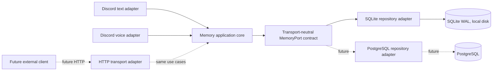
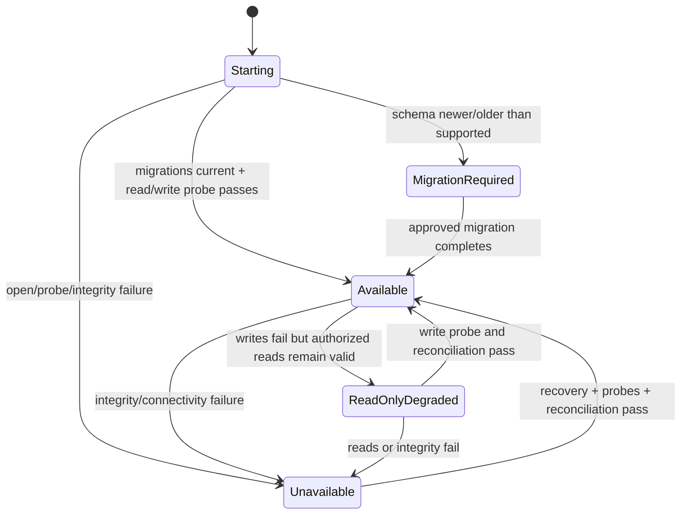

# ADR-003: Initial Memory Topology and Storage for DC_BOT

**Artifact filename:** `03-topology-storage-adr.md`  
**Status:** Accepted — binding for the first memory implementation milestone  
**Decision date:** 2026-08-01  
**Decision owner:** DC_BOT architecture  
**Supersedes:** No prior topology/storage ADR  
**Review condition:** Re-open only when a migration trigger in Section 10.7 is met, or when verified deployment evidence invalidates a premise in this ADR.

## 1. Executive conclusion

**Recommendation — ADR-003:** DC_BOT SHALL adopt **Option D**, a layered hybrid architecture: the memory domain and application core run **in the existing Discord bot process initially**; Discord text and voice call one transport-neutral `MemoryPort`; persistence is supplied through repository adapters; and an HTTP transport may be added later without changing domain contracts.

**Recommendation — initial production storage:** The supported first production topology SHALL use **SQLite in WAL mode on a local, non-network filesystem**. It is authorized only while one DC_BOT operating-system process owns the authoritative database and all writes are serialized through that process.

**Recommendation — local development storage:** Local development SHALL use a normal file-backed SQLite database with the same migrations and WAL configuration as production. In-memory SQLite is allowed only for isolated unit tests that are also covered by file-backed integration tests.

**Recommendation — first milestone transport:** The first coding milestone SHALL NOT add a Memory Runtime HTTP service. HTTP is not currently justified by the verified DC_BOT launch topology. The domain/application boundary is the memory authority; a standalone process is a replaceable deployment and transport choice, not the domain boundary itself.

**Recommendation — failure behavior:** Production SHALL NOT silently substitute process-local or ephemeral memory when the authoritative store is unavailable. Callers SHALL receive typed availability/failure results, and user-facing adapters SHALL make degraded operation explicit. A write-required conversational flow SHALL not claim persistence when its write failed.

**Recommendation — migration:** PostgreSQL becomes the preferred storage adapter when the authoritative store must serve multiple writer processes or hosts, or when measured SQLite limits exceed approved service-level objectives. A standalone Memory Runtime with PostgreSQL becomes the default target when separately deployed text/voice writers, AIRI or another external client, independent scaling, or a security/fault-isolation boundary requires one remotely accessible authority.

## 2. Scope

This ADR decides:

1. The initial memory runtime topology.
2. Initial production storage.
3. Local-development storage.
4. The supported SQLite writer model.
5. Whether HTTP is present in the first coding milestone.
6. Whether `MemoryPort` is transport-neutral.
7. Whether a standalone service is a domain boundary or deployment detail.
8. How memory unavailability is exposed.
9. Whether silent ephemeral fallback is allowed.
10. Objective triggers for topology or storage migration.

**Non-scope notice:** This ADR does not define the complete identity, event, memory, retrieval, delivery, retention, or deletion schema. It constrains those later artifacts so they can be implemented in-process first and transported out-of-process later without changing domain semantics.

**Source-plan requirement:** The assignment baseline requires minimal architecture with a clean migration path, treats privacy/identity/attribution/delivery/deletion as release-blocking, and forbids pretending that failed durable writes succeeded. That baseline is treated as a binding program requirement, not as repository evidence.

## 3. Sources inspected

### 3.1 DC_BOT

**Confirmed repository fact:** Branch `main` was inspected at commit `0ea3cbf5ec92f719e2b48066c3ada45aa50122ad` (`added reference audio profile`, 2026-08-01).

- Commit: https://github.com/starryark/DC_BOT/commit/0ea3cbf5ec92f719e2b48066c3ada45aa50122ad
- README: https://raw.githubusercontent.com/starryark/DC_BOT/0ea3cbf5ec92f719e2b48066c3ada45aa50122ad/README.md
- Launcher: https://raw.githubusercontent.com/starryark/DC_BOT/0ea3cbf5ec92f719e2b48066c3ada45aa50122ad/start-bot.ps1
- Bot package: https://raw.githubusercontent.com/starryark/DC_BOT/0ea3cbf5ec92f719e2b48066c3ada45aa50122ad/airi/services/discord-bot/package.json
- Composition root: https://raw.githubusercontent.com/starryark/DC_BOT/0ea3cbf5ec92f719e2b48066c3ada45aa50122ad/airi/services/discord-bot/src/index.ts
- Text responder: https://raw.githubusercontent.com/starryark/DC_BOT/0ea3cbf5ec92f719e2b48066c3ada45aa50122ad/airi/services/discord-bot/src/orchestration/mention-responder.ts
- Voice state: https://raw.githubusercontent.com/starryark/DC_BOT/0ea3cbf5ec92f719e2b48066c3ada45aa50122ad/airi/services/discord-bot/src/orchestration/conversation-state.ts
- Voice controller: https://raw.githubusercontent.com/starryark/DC_BOT/0ea3cbf5ec92f719e2b48066c3ada45aa50122ad/airi/services/discord-bot/src/orchestration/conversation-controller.ts

### 3.2 AIRI

**Confirmed repository fact:** Branch `main` was inspected at commit `4d6e61f77dc99ec76c7cf352df62abb4282386c5` (`docs(server): cleanup ai context`, 2026-08-01).

- Commit: https://github.com/moeru-ai/airi/commit/4d6e61f77dc99ec76c7cf352df62abb4282386c5
- README/roadmap: https://raw.githubusercontent.com/moeru-ai/airi/4d6e61f77dc99ec76c7cf352df62abb4282386c5/README.md
- `memory-pgvector` package: https://raw.githubusercontent.com/moeru-ai/airi/4d6e61f77dc99ec76c7cf352df62abb4282386c5/packages/memory-pgvector/package.json
- `memory-pgvector` entry point: https://raw.githubusercontent.com/moeru-ai/airi/4d6e61f77dc99ec76c7cf352df62abb4282386c5/packages/memory-pgvector/src/index.ts
- Telegram PostgreSQL/pgvector schema: https://raw.githubusercontent.com/moeru-ai/airi/4d6e61f77dc99ec76c7cf352df62abb4282386c5/services/telegram-bot/src/db/schema.ts
- Architecture alternatives issue #387: https://github.com/moeru-ai/airi/issues/387
- Alaya proposal issue #879: https://github.com/moeru-ai/airi/issues/879

### 3.3 AstrBot

**Confirmed repository fact:** Branch `master` was inspected through current raw files and repository pages on 2026-08-01. GitHub did not expose a reliable current commit SHA through the accessible repository page during this review, so no SHA is claimed.

- Repository: https://github.com/AstrBotDevs/AstrBot
- Conversation manager: https://raw.githubusercontent.com/AstrBotDevs/AstrBot/master/astrbot/core/conversation_mgr.py
- Conversation persistence model: https://raw.githubusercontent.com/AstrBotDevs/AstrBot/master/astrbot/core/db/po.py
- SQLite-related conversation migration PR #4886, still open when inspected: https://github.com/AstrBotDevs/AstrBot/pull/4886

### 3.4 External primary documentation

- SQLite WAL: https://www.sqlite.org/wal.html
- SQLite transactions: https://www.sqlite.org/lang_transaction.html
- SQLite appropriate uses: https://sqlite.org/whentouse.html
- SQLite online backup API: https://sqlite.org/backup.html
- PostgreSQL MVCC: https://www.postgresql.org/docs/current/mvcc-intro.html
- PostgreSQL backup and restore: https://www.postgresql.org/docs/current/backup.html

## 4. Evidence table

| ID | Claim | Classification | Source URL | Confidence |
|---|---|---|---|---|
| EVID-001 | The documented DC_BOT launcher starts or reuses local ASR and TTS services, waits for readiness, then starts one Discord bot process. | Confirmed repository fact | DC_BOT `README.md`; `start-bot.ps1` | High |
| EVID-002 | The Discord bot composition root creates the Discord adapter, voice manager, ASR, TTS, brain, voice controller, and text mention responder in one Node.js process. | Confirmed repository fact | DC_BOT `airi/services/discord-bot/src/index.ts` | High |
| EVID-003 | Text conversation state is process-local: `MentionResponder` owns an `InMemoryRoomStore` plus per-room in-memory queues/maps. | Confirmed repository fact | DC_BOT `mention-responder.ts`, `MentionResponder` | High |
| EVID-004 | Voice conversation state is process-local: `GuildConversationRegistry` owns an in-memory map and each session owns `GuildSession` history. | Confirmed repository fact | DC_BOT `conversation-state.ts`, `GuildConversationRegistry` | High |
| EVID-005 | The current grouped voice path sends one generated turn using the first event but assigns the presentation name `Discord group`, demonstrating an attribution defect that the shared memory model must not preserve. | Confirmed repository fact | DC_BOT `conversation-controller.ts`, `onConversationGroup` | High |
| EVID-006 | No inspected DC_BOT source establishes separately deployed text and voice writers, multiple bot hosts, or an external shared-memory client. | Inference from inspected repository | DC_BOT sources above | Medium-high |
| EVID-007 | AIRI labels Memory Alaya as WIP and discusses both embedded and Docker/service approaches in issues; those sources are proposals, not verified production behavior. | Confirmed repository fact | AIRI README; issues #387 and #879 | High |
| EVID-008 | AIRI's inspected `memory-pgvector` entry point creates a server-sdk client with an empty configure handler; it is not evidence of a complete production memory runtime. | Confirmed repository fact | AIRI `packages/memory-pgvector/src/index.ts` | High |
| EVID-009 | AIRI's Telegram schema demonstrates PostgreSQL/pgvector experimentation with chat messages and memory tables, but it does not prove shared multi-client memory semantics or operational maturity. | Confirmed fact plus inference | AIRI `services/telegram-bot/src/db/schema.ts` | High for schema; medium for maturity inference |
| EVID-010 | AstrBot persists conversation content and updates a list of message objects as a conversation-level value; this is a product baseline, not a concurrency pattern DC_BOT should adopt without stronger write controls. | Confirmed fact plus recommendation | AstrBot `conversation_mgr.py`; `db/po.py` | High |
| EVID-011 | SQLite WAL permits concurrent readers and a writer, but only one writer at a time; all WAL users must be on the same host and WAL is not supported over a network filesystem. | External research finding | SQLite WAL and transaction documentation | High |
| EVID-012 | PostgreSQL MVCC is designed for multi-session concurrency in which ordinary reads do not block writes and writes do not block reads. | External research finding | PostgreSQL MVCC documentation | High |
| EVID-013 | SQLite supplies online snapshot backup mechanisms; copying only the live database file is not the required backup procedure. | External research finding | SQLite online backup API | High |
| EVID-014 | The source plan explicitly says the initial topology is not pre-decided and that a mandatory HTTP service must be justified by verified deployment needs. | Source-plan requirement | Assignment baseline supplied with this ADR | High |
| EVID-015 | The source plan forbids silent production fallback to unrelated ephemeral memory while pretending writes succeeded. | Source-plan requirement | Assignment baseline supplied with this ADR | High |

## 5. Current-state findings

### 5.1 Verified DC_BOT launch topology

**Confirmed repository fact:** The supported launcher is a local Windows-oriented orchestration script. It starts or reuses Qwen3-ASR on `127.0.0.1:8765`, GPT-SoVITS on `127.0.0.1:9880`, waits for their readiness, and then runs `pnpm start` for the Discord bot. The README describes the same three long-running components. This is a multi-process inference topology, but it is not a multi-writer memory topology: the ASR and TTS services do not own conversational memory in the inspected design.

**Confirmed repository fact:** Within the Discord bot, the composition root constructs both the text responder and voice conversation controller. The inspected source therefore supports one process as the initial memory authority without adding a network hop.

**Inference:** Nothing inspected demonstrates a current need for a separately deployable Memory Runtime. A service could be useful later, but choosing it now would be based on anticipated topology rather than verified present topology.

### 5.2 Current memory ownership

**Confirmed repository fact:** Text and voice currently own separate process-local histories. Text stores rooms in `InMemoryRoomStore`; voice stores per-guild `GuildSession` instances in `GuildConversationRegistry`. A process restart loses both, and there is no one durable authority shared across modalities.

**Recommendation:** The first memory change should merge authority before it distributes authority. Both adapters should call one in-process application service backed by one durable store.

### 5.3 Current concurrency shape

**Confirmed repository fact:** The bot already serializes text work per room with promise queues and coordinates voice work with per-guild phases, epochs, and a conversation floor. Those controls exist inside one process.

**Inference:** The first milestone needs robust concurrent calls within one process, not distributed consensus among multiple writers. An in-process write coordinator plus SQLite transactions is therefore aligned with the verified concurrency shape.

### 5.4 Future text/voice and other-client needs

**Source-plan requirement:** Future text and voice may share person-level memory, while room history remains scope-controlled. The design must permit separately deployed writers later and may need AIRI or another client to consume the same authority.

**Recommendation:** Those future needs justify transport-neutral contracts and adapter seams now. They do not justify an HTTP service before there is a second deployment unit or client.

### 5.5 Comparison-repository findings

**Confirmed repository fact:** AIRI documents memory as WIP, contains proposals for both embedded and service forms, and contains a PostgreSQL/pgvector schema in its Telegram service. Its `memory-pgvector` process entry point is still skeletal. AIRI is evidence that cross-client integration may become real, but not evidence that DC_BOT must adopt its service topology in milestone one.

**Confirmed repository fact:** AstrBot demonstrates persisted conversations and database-backed management. Its inspected manager reads a conversation's content list, appends a user/assistant pair, and writes the content list back. That model is useful as a product capability baseline, but a mutable whole-history value creates avoidable contention and lost-update risk if multiple writers are introduced.

**Recommendation:** DC_BOT should persist append-oriented attributable records and explicit lifecycle state, not copy AstrBot's conversation-level whole-history update as the authoritative write model.

### 5.6 Storage-engine findings

**External research finding:** SQLite WAL supports concurrent readers and a writer, while retaining a single-writer constraint and same-host requirement. It is a strong fit for an embedded, single-authority process on one host. It is not the supported choice for direct writers on multiple hosts or a database file placed on network storage.

**External research finding:** PostgreSQL provides a client/server concurrency model and mature backup options suitable for multiple processes and hosts. It introduces a server dependency, credential and network management, upgrades, monitoring, and operational ownership that the current DC_BOT repository does not otherwise require for memory.

## 6. Proposed decisions

### 6.1 Binding decision table

| Question | Binding decision | Classification |
|---|---|---|
| 1. Initial runtime topology | Memory domain/application core embedded in the existing Discord bot process. | Recommendation / ADR-003 |
| 2. Initial production storage | SQLite, WAL mode, local non-network filesystem, one authoritative bot process. | Recommendation / ADR-003 |
| 3. Local-development storage | File-backed SQLite using production migrations and pragmas; in-memory SQLite only for narrow unit tests. | Recommendation / ADR-003 |
| 4. May more than one process write SQLite? | No. The supported DC_BOT SQLite topology permits exactly one application process to own writes. | Recommendation / ADR-003 |
| 5. Does HTTP exist in milestone one? | No. No Memory Runtime HTTP listener or client is part of the first coding milestone. | Recommendation / ADR-003 |
| 6. Is `MemoryPort` transport-neutral? | Yes. It may not expose HTTP, Discord, SQLite, or PostgreSQL types. | Recommendation / ADR-003 |
| 7. Is a standalone service a domain boundary? | No. The domain boundary is the memory authority and its use cases/invariants. A service is a deployment/transport implementation of that boundary. | Recommendation / ADR-003 |
| 8. How is unavailability exposed? | Typed errors/results with retryability, operation, correlation ID, and authority state; adapters must explicitly surface degraded behavior. | Recommendation / ADR-003 |
| 9. Is silent ephemeral fallback permitted? | No in production. Explicit non-persistent mode is allowed only in development/test and must be visibly configured and reported. | Source-plan requirement adopted by ADR-003 |
| 10. What causes migration? | Structural triggers (second writer process/host/client, scaling or isolation boundary) and measured SLO/operability failures defined in Section 10.7. | Recommendation / ADR-003 |

### 6.2 Selected option

**Recommendation — ADR-003:** Select **Option D**.

Option D preserves the lowest-complexity current deployment while preventing the in-process choice from leaking into domain contracts. It also permits two distinct later moves:

- **Storage-only move:** Keep the application core in the bot process and switch the repository adapter from SQLite to PostgreSQL.
- **Topology move:** Host the same application core behind HTTP or another transport in a standalone Memory Runtime using PostgreSQL.

### 6.3 Initial production support envelope

The SQLite production decision is valid only while all of the following remain true:

1. One DC_BOT Discord bot process is the sole memory writer.
2. The database and WAL files live on a local filesystem on the same host.
3. Text and voice call the same in-process memory application service.
4. No external client requires direct access to the authoritative memory.
5. Backup, restore, deletion, and latency SLOs pass the approved evaluation plan.
6. Process restart does not cause a silent switch to ephemeral history.

If any structural condition stops being true, the deployment is outside the supported SQLite envelope even if it appears to work in a small test.

## 7. Option comparison

### 7.1 Rating method

**Inference:** Ratings below are architecture judgments based on verified repository topology and primary database documentation. They are not vendor benchmarks. `Strong` means the option directly fits the criterion; `Conditional` means it can fit with additional controls or operations; `Weak` means it creates material mismatch or unnecessary cost for the initial milestone.

| Criterion | A: In-process + SQLite WAL | B: In-process + PostgreSQL | C: Memory service + PostgreSQL | D: Layered hybrid, embedded first |
|---|---|---|---|---|
| Verified current DC_BOT topology | Strong | Conditional | Weak | Strong |
| Future text/voice split | Weak once split | Conditional | Strong | Strong migration path |
| AIRI or external-client integration | Weak without new transport | Weak without new transport | Strong | Strong when transport added |
| Current writer count/location | Strong for one process/host | Strong but overprovisioned | Weak for present need | Strong |
| Multi-process concurrency | Weak | Strong at storage layer | Strong | Conditional now; strong after adapter/topology move |
| Local development | Strong | Conditional; requires PostgreSQL | Weakest; requires service + DB | Strong |
| Testability | Strong for embedded tests | Strong with containerized DB | Conditional; more integration surfaces | Strongest contract layering |
| Deployment complexity | Lowest | Medium | Highest | Low initially; staged later |
| Upgrade complexity | Low, file and app coupled | Medium, DB lifecycle separate | High, service and DB versioning | Low initially; explicit compatibility path |
| Operational ownership | Application team only | Application + DB operations | Application + service + DB operations | Application only initially |
| Failure isolation | Weak; same process | Conditional; DB isolated | Strong | Conditional now; can become strong later |
| Latency | Strong; no memory network hop | Conditional; DB round trip | Weakest initial path; service + DB hops | Strong initially |
| Security boundary | Process boundary only | DB credential/network boundary | Strong service boundary | Minimal attack surface initially; service boundary when required |
| Data migration | SQLite export required | Already on PostgreSQL | Already on PostgreSQL | Explicit adapter/export path |
| Portability | Strong single-file deployment | Conditional on PostgreSQL availability | Conditional on service deployment | Strongest across supported modes |
| Rollback | Strong app/file snapshot if migrations compatible | Conditional; DB rollback discipline needed | Most complex coordinated rollback | Strong initially; contracts constrain later rollback |
| Direct infrastructure cost | Lowest | Higher | Highest | Lowest initially |
| Risk of premature architecture | Medium | Medium | High | Lowest |

### 7.2 Option A — in-process `MemoryPort` with SQLite WAL

**Advantages:** Minimal deployment change, low latency, simple local development, no new network security surface, and direct fit with one current writer process.

**Disadvantages:** If treated as the complete architecture rather than one adapter choice, it can encourage SQLite-specific domain APIs and postpone the transport boundary until it is costly. It also has a hard same-host/single-writer support envelope.

**Outcome:** Rejected as the complete ADR choice, but its storage/runtime combination is adopted inside Option D for the initial production stage.

### 7.3 Option B — in-process `MemoryPort` with PostgreSQL

**Advantages:** Better fit for multiple database clients, mature multi-session concurrency, centralized backups, and an easier storage path to multiple hosts.

**Disadvantages:** It adds a database server, credentials, ports, lifecycle management, upgrades, monitoring, and restore operations without solving external-client access by itself. The memory application core would still be in one bot process.

**Outcome:** Rejected for initial production. It is the preferred intermediate move when SQLite limits are exceeded but the memory application core still has exactly one deployment owner.

### 7.4 Option C — standalone Memory Runtime with PostgreSQL

**Advantages:** One remotely accessible authority, independent scaling, explicit fault/security boundary, and clean support for separately deployed text, voice, AIRI, or other clients.

**Disadvantages:** It introduces service discovery, authentication, authorization, API versioning, retries, idempotency, observability, deployment ordering, compatibility management, and another failure mode. The present repository does not verify a second memory client or separately deployed writer.

**Outcome:** Rejected for milestone one as premature. It becomes the default target after a structural service trigger is met.

### 7.5 Option D — layered hybrid

**Advantages:** It makes the domain boundary explicit without paying the service cost before it is needed. Repository and transport adapters can evolve independently, and the same conformance suite can protect semantics across SQLite, PostgreSQL, in-process calls, and later HTTP calls.

**Disadvantages:** It requires disciplined layering and contract tests. Poor implementation could create abstractions that merely rename database calls or could promise PostgreSQL portability without testing it.

**Outcome:** Accepted. The PostgreSQL adapter may be implemented after the SQLite milestone, but the repository contract, data types, migrations/export format, and adapter conformance suite must be designed so PostgreSQL does not require a domain rewrite.

## 8. Alternatives considered

### 8.1 SQLite with multiple direct writer processes

**Rejected alternative:** Permit several bot processes to open the same WAL database and rely on SQLite's lock serialization.

**Reason:** SQLite can serialize writers, but DC_BOT's supported architecture would then have distributed application-level sequencing, retry, idempotency, and lifecycle decisions without a single owner. It also invites `SQLITE_BUSY` handling into every process. The ADR therefore imposes a stricter one-process writer rule than SQLite's technical minimum.

### 8.2 SQLite database on a network share

**Rejected alternative:** Put the SQLite file on SMB, NFS, or another network filesystem so multiple hosts can share it.

**Reason:** SQLite's WAL documentation requires same-host shared memory and says WAL does not work over a network filesystem. This is outside the supported topology.

### 8.3 PostgreSQL from day one solely for future-proofing

**Rejected alternative:** Require PostgreSQL now because it may be needed later.

**Reason:** The current repository verifies one bot process and local inference services, not multiple memory writers. A transport-neutral core and migration tests provide future readiness with less current operational cost.

### 8.4 HTTP service from day one solely for architectural purity

**Rejected alternative:** Make all local text and voice calls traverse HTTP even while producer and memory core share one process and host.

**Reason:** It adds latency, serialization, service lifecycle, authentication, retries, and versioning without satisfying a verified current deployment need. Clean in-process ports provide the same domain separation.

### 8.5 Silent fallback to existing in-memory histories

**Rejected alternative:** On database failure, keep using the current text and voice histories and synchronize later.

**Reason:** This creates split-brain authority, hides data loss, makes correction/deletion incomplete, and violates the source-plan requirement that production must not pretend durable writes succeeded.

### 8.6 Mutable whole-conversation JSON as the authoritative row

**Rejected alternative:** Persist each room as one mutable JSON history value, similar to the pattern visible in AstrBot's conversation manager.

**Reason:** It couples unrelated writes, amplifies rewrites, complicates partial delivery and many-to-many causality, and creates lost-update risk under future multiple writers. Append-oriented records with explicit state transitions are required instead; the detailed schema belongs in a later artifact.

## 9. Rejected alternatives and reasons

The binding rejection summary is:

- **Option A alone:** too storage-specific as the overall architecture, although adopted as the initial Option D deployment.
- **Option B initially:** operationally heavier than current verified needs.
- **Option C initially:** premature service boundary and highest complexity.
- **Multiple SQLite writer processes:** unsupported by this ADR.
- **Network-shared SQLite WAL:** technically outside SQLite WAL's documented support model.
- **Silent ephemeral fallback:** correctness and privacy violation.
- **Whole-history mutable JSON authority:** unsafe migration path for concurrent attributable events.

## 10. Normative specification

### 10.1 Layering and ownership



**REQ-MEM-001:** There SHALL be one memory application core that owns authorization orchestration, identity/scope validation, event persistence use cases, retrieval use cases, correction/forget orchestration, and authority health reporting.

**REQ-MEM-002:** Discord text and voice adapters SHALL call the same application core and SHALL NOT own independent authoritative histories.

**REQ-MEM-003:** `MemoryPort` SHALL be transport-neutral. Its public types SHALL NOT import or expose Discord SDK objects, HTTP request/response objects, SQLite connections, PostgreSQL clients, ORM row types, or vendor error classes.

**REQ-MEM-004:** Repository adapters SHALL be below the domain/application layer. SQL dialect, connection pooling, pragmas, and migrations SHALL remain adapter concerns.

**REQ-MEM-005:** A future standalone Memory Runtime SHALL host the same application use cases. It SHALL NOT fork or reinterpret the domain rules in a separate service-specific implementation.

### 10.2 Initial runtime topology

**REQ-OPS-001:** In milestone one, the memory application core SHALL run in the existing DC_BOT Discord bot process.

**REQ-OPS-002:** Milestone one SHALL NOT expose an HTTP memory listener and SHALL NOT require an HTTP memory client for text or voice.

**REQ-OPS-003:** ASR and TTS processes SHALL remain non-authoritative inference dependencies. They SHALL NOT write directly to the memory database.

**REQ-OPS-004:** The process composition SHALL make exactly one object/service responsible for creating the repository adapter and application core. Text and voice SHALL receive that shared instance through dependency injection.

### 10.3 Initial SQLite production profile

**REQ-OPS-010:** The production database SHALL be file-backed SQLite using `PRAGMA journal_mode=WAL`.

**REQ-OPS-011:** The database, `-wal`, and `-shm` files SHALL reside on a local filesystem on the bot host. Network shares and synchronized-cloud folders are unsupported.

**REQ-OPS-012:** Exactly one DC_BOT operating-system process SHALL be permitted to own write-capable connections. The process SHALL serialize writes through an application-level writer queue or equivalent bounded coordinator.

**REQ-OPS-013:** A second application process SHALL fail startup or remain explicitly read-only; it SHALL NOT silently become another writer. The ownership mechanism SHALL have a tested stale-lock/crash-recovery procedure.

**REQ-OPS-014:** Production initialization SHALL enable foreign-key enforcement and configure a bounded busy timeout. Any `SQLITE_BUSY` result SHALL be observable and returned as a typed failure after bounded retry; retries SHALL NOT be infinite.

**REQ-OPS-015:** Production SHALL start with `PRAGMA synchronous=FULL`. A later change to `NORMAL` requires a documented durability-loss budget, power-loss tests, and a new ADR or amendment.

**REQ-OPS-016:** WAL checkpoint duration, WAL size, write-queue depth, write latency, failed writes, and busy responses SHALL be observable.

**REQ-OPS-017:** Long-lived read transactions SHALL be bounded so they cannot indefinitely prevent checkpoint progress.

**REQ-OPS-018:** The application SHALL use idempotency keys for externally repeatable append operations. A process retry after an ambiguous failure SHALL not create duplicate inbound events or duplicate assistant artifacts.

### 10.4 Local development and test storage

**REQ-OPS-020:** Normal local development SHALL use a file-backed SQLite database initialized through the same migration runner and production pragmas.

**REQ-OPS-021:** In-memory SQLite MAY be used for pure unit tests, but each repository behavior SHALL also be covered by file-backed WAL integration tests because locking, WAL, backup, crash, and file-permission behavior are not represented by a purely in-memory database.

**REQ-OPS-022:** Tests SHALL not use a different simplified schema from production migrations.

**REQ-OPS-023:** Temporary developer databases SHALL be clearly separated from production paths and SHALL be safe to reset only with an explicit development command.

### 10.5 Backup, restore, migration, and rollback

**REQ-OPS-030:** Live SQLite backups SHALL use the SQLite online backup API, `VACUUM INTO`, or another SQLite-documented snapshot mechanism. Copying only the live main database file while the process is running is not an accepted backup procedure.

**REQ-OPS-031:** Backup artifacts SHALL be encrypted or stored within an approved encrypted backup boundary, SHALL carry schema/version metadata, and SHALL be included in retention and deletion policy.

**REQ-OPS-032:** Restore drills SHALL verify integrity, schema version, authoritative event counts, deletion markers/tombstones as applicable, and application startup against the restored copy.

**REQ-OPS-033:** Schema migrations SHALL be versioned, deterministic, restart-safe, and tested from the oldest supported schema. Production migrations SHALL create a pre-migration backup or verified snapshot.

**REQ-OPS-034:** Application rollback SHALL be supported through expand/migrate/contract discipline. A release SHALL not apply a destructive schema contraction until the rollback window has closed and backup restore has been verified.

**REQ-OPS-035:** A logical export/import format independent of SQLite row internals SHALL be specified before production launch. It SHALL support migration to PostgreSQL while preserving stable IDs, timestamps, causal links, provenance, lifecycle state, and deletion state.

**REQ-OPS-036:** The PostgreSQL repository adapter, when implemented, SHALL pass the same repository/application conformance suite as SQLite. Database-specific features MAY optimize execution but SHALL NOT change domain results.

### 10.6 Availability and error contract

The application boundary SHALL return a typed result equivalent to the following specification shape:

```ts
// Specification material, not production code.
type MemoryAuthorityState =
  | 'available'
  | 'read_only_degraded'
  | 'unavailable'
  | 'migration_required'

type MemoryFailureCode =
  | 'unavailable'
  | 'deadline_exceeded'
  | 'write_rejected'
  | 'constraint_violation'
  | 'authorization_denied'
  | 'migration_required'
  | 'integrity_failure'

type MemoryFailure = {
  code: MemoryFailureCode
  operation: string
  retryable: boolean
  authorityState: MemoryAuthorityState
  correlationId: string
  causeClass?: string // sanitized; no secrets or raw SQL
}

type MemoryResult<T> =
  | { ok: true; value: T; authorityState: MemoryAuthorityState }
  | { ok: false; error: MemoryFailure }
```

**REQ-MEM-010:** Repository exceptions SHALL be translated at the adapter boundary. Discord adapters SHALL not branch on SQLite or PostgreSQL error codes.

**REQ-MEM-011:** An inbound event that policy requires to be durable SHALL not proceed as though recorded when persistence fails. The caller SHALL receive `ok: false` and the Discord adapter SHALL produce an explicit temporary-unavailability behavior appropriate to text or voice.

**REQ-MEM-012:** A read-only degraded state MAY serve already committed memory if integrity and authorization can still be guaranteed, but it SHALL reject new durable writes. The adapter SHALL not append those rejected writes to an untracked in-memory substitute.

**REQ-MEM-013:** Production SHALL have no automatic fallback from `SQLiteRepository` or `PostgresRepository` to `InMemoryRepository`.

**REQ-MEM-014:** An explicitly configured non-persistent mode MAY exist for development and tests only. Startup logs, health output, and any developer UI SHALL label it `NON_PERSISTENT`; it SHALL be impossible to enable accidentally through a missing database path or failed migration.

**REQ-MEM-015:** Health checks SHALL distinguish process liveness, repository connectivity, read capability, write capability, migration status, and backup freshness. A single boolean `healthy` is insufficient for operator diagnosis.

### 10.7 Objective migration triggers

#### 10.7.1 Storage migration: SQLite to PostgreSQL, application core still embedded

A PostgreSQL repository adapter SHALL replace SQLite when any of the following is true and the memory application core still has one deployment owner:

- **TRIGGER-DB-001:** The authoritative database must be accessed from more than one host.
- **TRIGGER-DB-002:** More than one independently managed process must write directly to the authoritative store.
- **TRIGGER-DB-003:** The approved concurrency benchmark or production telemetry breaches the write-latency, queue-depth, lock/busy, checkpoint, backup, restore, or deletion-completion SLO for two consecutive evaluation windows, and profiling attributes the breach to the SQLite storage envelope rather than application logic.
- **TRIGGER-DB-004:** Required backup/RPO/RTO or operational recovery capabilities cannot be met with the approved SQLite backup and restore runbook.
- **TRIGGER-DB-005:** The database exceeds the largest data volume successfully validated by the approved evaluation plan and the next growth interval would cross the tested envelope before another review.

**Recommendation:** No fixed QPS, file-size, or latency number is invented in this ADR. The evaluation artifact SHALL set those values from representative text/voice workloads. The trigger is objective because it is tied to approved, measured SLOs and tested envelopes.

#### 10.7.2 Topology migration: embedded core to standalone Memory Runtime

A standalone Memory Runtime SHALL be introduced, normally with PostgreSQL, when any of the following becomes an approved deployment requirement:

- **TRIGGER-SVC-001:** Text and voice become separately deployed writer processes.
- **TRIGGER-SVC-002:** Multiple DC_BOT hosts require one authoritative memory.
- **TRIGGER-SVC-003:** AIRI or another external client is authorized to consume or write the same memory authority.
- **TRIGGER-SVC-004:** Memory must scale, deploy, upgrade, or roll back independently from the Discord bot.
- **TRIGGER-SVC-005:** A fault-isolation boundary is required so memory faults do not share the bot process.
- **TRIGGER-SVC-006:** A security or trust boundary requires centralized authentication, authorization, audit, rate limiting, or network policy around memory operations.
- **TRIGGER-SVC-007:** Regulatory or operational ownership requires a separately administered data service.

**Recommendation:** A trigger authorizes a topology review; it does not authorize a rushed REST wrapper around SQL. The service must host the same application core, preserve authorization-before-retrieval, implement idempotency and deadlines, and pass transport conformance tests.

#### 10.7.3 Trigger outcome matrix

| Trigger type | Preferred next state |
|---|---|
| SQLite capacity/backup limit, still one application deployment | Embedded memory core + PostgreSQL adapter |
| Second writer process but same product and trust domain | Standalone Memory Runtime + PostgreSQL, unless an approved design proves a single embedded owner still exists |
| Multiple hosts | PostgreSQL; normally standalone Memory Runtime |
| AIRI/external client | Standalone Memory Runtime + authenticated transport + PostgreSQL |
| Independent scaling or fault isolation | Standalone Memory Runtime + PostgreSQL |
| Security boundary only | Standalone Memory Runtime; storage chosen by concurrency and operations evidence, normally PostgreSQL |

### 10.8 Future HTTP transport requirements

HTTP is excluded from milestone one. When a service trigger is met, the transport artifact SHALL specify at minimum:

- Versioned endpoints or an equivalent versioned RPC contract.
- Strong service/client authentication.
- Authorization context sufficient for person, character, guild, logical room, and private-conversation isolation.
- Idempotency keys for writes.
- Deadlines, bounded retries, and retry-safe operation classes.
- Explicit authority-state and typed error mapping.
- Request/response size limits and input canonicalization.
- Audit logging that excludes raw secrets and minimizes personal data.
- Health/readiness semantics and migration compatibility.
- Protection against prompt/delimiter injection in retrieved memory serialization; HTTP does not make stored content trusted.

## 11. Interfaces, schemas, diagrams, state machines, and test vectors

### 11.1 Application-facing port

```ts
// Specification material, deliberately transport- and database-neutral.
interface MemoryPort {
  recordInboundEvent(command: RecordInboundEvent): Promise<MemoryResult<RecordedEvent>>
  recordAssistantArtifact(command: RecordAssistantArtifact): Promise<MemoryResult<RecordedArtifact>>
  recordDeliveryTransition(command: RecordDeliveryTransition): Promise<MemoryResult<DeliveryState>>
  readRecentContext(query: RecentContextQuery): Promise<MemoryResult<RecentContext>>
  retrieveAuthorizedMemory(query: AuthorizedMemoryQuery): Promise<MemoryResult<RetrievedMemory>>
  correctMemory(command: CorrectMemory): Promise<MemoryResult<CorrectionReceipt>>
  forgetSubject(command: ForgetSubject): Promise<MemoryResult<ForgetReceipt>>
  exportSubject(query: ExportSubject): Promise<MemoryResult<SubjectExport>>
  authorityStatus(): Promise<MemoryResult<AuthorityStatus>>
}
```

**REQ-MEM-020:** Commands and queries SHALL carry stable IDs, actor/scope authorization context, idempotency keys where applicable, deadlines, and correlation IDs. They SHALL not carry active database connections or Discord client objects.

### 11.2 Repository boundary

```ts
// Specification material.
interface MemoryRepository {
  transact<T>(work: (tx: MemoryTransaction) => Promise<T>): Promise<T>
  readSnapshot<T>(work: (view: MemoryReadView) => Promise<T>): Promise<T>
  health(): Promise<RepositoryHealth>
  schemaVersion(): Promise<number>
}
```

**Recommendation:** The repository boundary should expose domain-oriented operations or transaction views, not a generic `query(sql)` escape hatch. The exact split will be defined by the domain-model artifact.

### 11.3 Authority state machine



**REQ-OPS-040:** Transition back to `available` SHALL require successful probes and any required reconciliation. A transient successful query alone SHALL not clear an integrity or migration failure.

### 11.4 Topology-selection decision flow

```text
Is there exactly one authoritative writer process on one host?
  No -> PostgreSQL is required.
        Is there more than one deployment unit/client or a security/fault boundary?
          Yes -> Standalone Memory Runtime + PostgreSQL.
          No  -> Embedded core + PostgreSQL adapter.
  Yes -> Do approved SQLite benchmarks, backup/restore, deletion, and latency SLOs pass?
          Yes -> Embedded core + SQLite WAL.
          No  -> Embedded core + PostgreSQL, then reassess service triggers.
```

### 11.5 Required test vectors

- **TEST-TOPO-001:** Text event followed by voice event for the same authorized person uses one authority and survives process restart.
- **TEST-TOPO-002:** Two simultaneous text/voice callers can submit operations; writes are serialized without lost attributable events.
- **TEST-TOPO-003:** Starting a second write-capable bot process against the same SQLite path is rejected explicitly.
- **TEST-TOPO-004:** Placing the SQLite path on a known network-share path is rejected by configuration validation or deployment checks.
- **TEST-TOPO-005:** Database unavailable at startup produces `unavailable`; no in-memory repository is substituted.
- **TEST-TOPO-006:** Database becomes read-only during operation; new durable writes fail visibly while authorized committed reads follow the defined degraded policy.
- **TEST-TOPO-007:** An ambiguous retry with the same idempotency key does not duplicate an inbound event.
- **TEST-TOPO-008:** Online backup during representative reads/writes restores to a consistent snapshot.
- **TEST-TOPO-009:** Failed migration leaves the prior database recoverable and startup reports `migration_required` or `unavailable` rather than booting with a partial schema.
- **TEST-TOPO-010:** SQLite logical export imports into the PostgreSQL adapter with stable IDs, causal links, lifecycle states, and deletion state unchanged.
- **TEST-TOPO-011:** The same application conformance suite passes through in-process invocation and a future transport test double.
- **TEST-TOPO-012:** Repository error messages exposed to Discord do not contain SQL, filesystem secrets, credentials, or internal IDs.

## 12. Failure modes

| ID | Failure mode | Required behavior |
|---|---|---|
| RISK-TOPO-001 | SQLite file missing, path invalid, or permissions denied | Startup fails memory readiness; no ephemeral fallback. |
| RISK-TOPO-002 | Disk full or quota exceeded | Current transaction rolls back; authority becomes degraded/unavailable; caller receives typed failure. |
| RISK-TOPO-003 | `SQLITE_BUSY` after bounded coordination | Record metric and correlation ID; bounded retry only; then explicit failure. |
| RISK-TOPO-004 | Long read blocks checkpoint progress and WAL grows | Bound/cancel read; alert on WAL/checkpoint SLO; investigate query design. |
| RISK-TOPO-005 | Process crashes after database commit but before Discord delivery | Reconcile generation/persistence/delivery through explicit lifecycle states; do not assume atomicity. Detailed behavior is delegated to the delivery ADR. |
| RISK-TOPO-006 | Discord delivery succeeds but persistence update fails | Mark/reconcile from idempotent delivery evidence where available; surface operator alert. Do not invent exactly-once atomicity. |
| RISK-TOPO-007 | Corrupt database or failed integrity check | Stop writes, mark unavailable, restore/recover through runbook, preserve evidence. |
| RISK-TOPO-008 | Migration partially executes | Transactional or restart-safe migration; no application start on unknown schema. |
| RISK-TOPO-009 | Backup is stale, incomplete, or unrestoreable | Backup freshness alert; restore drill failure is release-blocking and may trigger PostgreSQL review. |
| RISK-TOPO-010 | Second writer bypasses process guard | Treat as unsupported incident; stop one writer and verify integrity/idempotency before resume. |
| RISK-TOPO-011 | Future HTTP service partitions from clients | Typed unavailable/deadline errors; bounded retries only for idempotent operations; no local split-brain cache. |
| RISK-TOPO-012 | PostgreSQL adapter semantics differ from SQLite | Conformance suite blocks release; domain result differences require ADR amendment. |

## 13. Security and privacy implications

**Recommendation:** Keeping memory in-process initially reduces the network attack surface because no new memory listener, service credential, or remotely callable API exists.

**REQ-PRIV-001:** The SQLite database, WAL, SHM, backups, exports, and logs SHALL be protected with least-privilege filesystem permissions. At-rest encryption SHALL be supplied by an approved encrypted volume, host mechanism, or separately specified database encryption design; plain SQLite does not itself satisfy an encryption requirement.

**REQ-PRIV-002:** The database SHALL not live in a consumer sync folder or network share. Besides WAL support concerns, uncontrolled replication would complicate deletion, retention, and backup inventories.

**REQ-PRIV-003:** Backup copies and logical exports are part of the personal-data inventory. Forget/deletion semantics SHALL define how active data, backups, caches, summaries, and future embeddings are handled before broad retention is enabled.

**REQ-PRIV-004:** Database errors and health output SHALL not expose message content, access tokens, SQL parameters containing personal data, filesystem secrets, or prompt-local opaque person references.

**REQ-PRIV-005:** Repository access SHALL occur only after application-layer authorization context has been validated. A future PostgreSQL or HTTP move SHALL not convert database reachability into authorization.

**REQ-PRIV-006:** A standalone service trigger caused by a new trust boundary requires a separate threat model covering service authentication, tenant/scope authorization, replay, rate limits, audit, and network encryption.

**Open question:** The exact encryption-at-rest mechanism for the initial Windows deployment is not established by the inspected repository and must be decided in the operations/security artifact.

## 14. Testable acceptance criteria

The ADR is implemented only when all criteria below pass:

1. **TEST-ACC-001:** One shared memory application-core instance is injected into both text and voice paths.
2. **TEST-ACC-002:** Restarting the bot preserves committed memory and does not resurrect the old independent in-memory authorities.
3. **TEST-ACC-003:** Production startup proves WAL mode, foreign keys, synchronous policy, schema version, local-path policy, and write ownership.
4. **TEST-ACC-004:** A second write-capable process is rejected with an actionable error.
5. **TEST-ACC-005:** No HTTP memory port is opened or required in milestone one.
6. **TEST-ACC-006:** `MemoryPort` public types contain no Discord, HTTP, SQLite, PostgreSQL, or ORM-specific types.
7. **TEST-ACC-007:** Database startup and runtime failures return the specified typed errors and produce explicit user/operator behavior.
8. **TEST-ACC-008:** Automated tests prove there is no production fallback to an in-memory repository.
9. **TEST-ACC-009:** File-backed WAL concurrency tests cover overlapping text/voice calls, idempotent retries, checkpoint pressure, and crash recovery.
10. **TEST-ACC-010:** Backup and restore drills recover a consistent database and meet the approved RPO/RTO.
11. **TEST-ACC-011:** Migration tests cover every supported prior schema and failed/interrupted migration recovery.
12. **TEST-ACC-012:** Logical export/import is defined and tested before the first broad production-retention release.
13. **TEST-ACC-013:** An evaluation artifact defines representative workloads and measurable latency, busy/lock, queue, checkpoint, backup, restore, and deletion SLOs.
14. **TEST-ACC-014:** The architecture review records whether any structural migration trigger is already planned within the next release horizon; if yes, PostgreSQL/service work is scheduled before that topology ships.
15. **TEST-ACC-015:** Privacy/deletion and delivery-lifecycle artifacts are approved before production retention is considered complete.

## 15. Non-goals

This ADR does not:

- Choose vector search, graph storage, embedding models, or rerankers.
- Define retrieval weights or latency thresholds without benchmarks.
- Define the complete identity-resolution or alias-scoping model.
- Define all event, memory, summary, episodic, semantic, or procedural tables.
- Claim atomicity between a database transaction and Discord message delivery or voice playback.
- Define a verified cross-platform human identity from a Discord user ID.
- Authorize multiple direct SQLite writer processes.
- Authorize network-filesystem SQLite WAL.
- Require PostgreSQL or HTTP before a trigger is met.
- Treat AIRI proposals or AstrBot behavior as binding upstream implementations.

## 16. Dependencies on other artifacts

The following artifacts or equivalent decisions are required:

- `04-memory-domain-model.md` — attributable append model, causal relations, lifecycle records, summaries, facts, corrections, and provenance.
- `05-identity-scope-authorization-adr.md` — Discord identity, actor snapshots, aliases, logical rooms, private/public isolation, and authorization-before-retrieval.
- `06-delivery-lifecycle-adr.md` — generation, persistence, delivery attempts, partial/interrupted voice, retries, and reconciliation.
- `07-retention-deletion-backup-spec.md` — forget, export, retention, backup erasure, cache invalidation, summary regeneration, and embedding deletion.
- `08-memory-retrieval-evaluation-plan.md` — structured/lexical retrieval baseline, multilingual/CJK tests, concurrency, latency, cost, and migration SLOs.
- `09-memory-operations-runbook.md` — paths, permissions, backup/restore, integrity checks, writer ownership, incident recovery, and upgrade/rollback.
- A repository/driver selection record for the concrete Node.js SQLite library, including WAL, backup API, cancellation, prepared statements, and maintained-binary support.

## 17. Open questions

### 17.1 Blocking

- **OPEN-BLOCK-001:** Which maintained Node.js SQLite driver will be used, and does it expose the required backup, busy-timeout, cancellation, transaction, and WAL controls on supported Windows versions?
- **OPEN-BLOCK-002:** What exact on-disk path and filesystem-permission model will production use?
- **OPEN-BLOCK-003:** What encryption-at-rest mechanism is required for the initial host and backups?
- **OPEN-BLOCK-004:** What are the authoritative event/lifecycle transaction boundaries, including generation and Discord delivery reconciliation?
- **OPEN-BLOCK-005:** What retention, deletion, and backup-erasure rules must be implemented before production data is retained broadly?
- **OPEN-BLOCK-006:** What representative workload and SLOs define the measured SQLite support envelope?
- **OPEN-BLOCK-007:** What startup lock/lease mechanism prevents a second write-capable process and safely handles stale ownership after a crash?

### 17.2 Non-blocking

- **OPEN-NONBLOCK-001:** Should the PostgreSQL adapter be implemented immediately after SQLite or only when a roadmap item approaches a trigger?
- **OPEN-NONBLOCK-002:** Which transport is preferred after a service trigger—HTTP/JSON, a typed RPC protocol, or another mechanism—provided domain contracts remain unchanged?
- **OPEN-NONBLOCK-003:** Will a future AIRI integration require shared write access, read-only retrieval, export/import, or synchronized but separate authorities?
- **OPEN-NONBLOCK-004:** Should read replicas or a read-only analytics/export path exist after PostgreSQL adoption?
- **OPEN-NONBLOCK-005:** What maintenance window and rollback duration should govern destructive schema contraction?

## 18. Handoff instructions for downstream agents

1. Treat Option D and the ten binding decisions in Section 6.1 as fixed unless a formal ADR amendment is approved.
2. Design domain types without HTTP, Discord, SQLite, PostgreSQL, or ORM leakage.
3. Model attributable events and lifecycle transitions append-first; do not create one mutable room-history JSON row as the authority.
4. Design the SQLite adapter for one process, one local host, WAL, bounded serialized writes, idempotency, online backup, and explicit health states.
5. Include a PostgreSQL compatibility/conformance strategy even if the adapter is not built in milestone one.
6. Do not add a Memory Runtime HTTP service until a trigger is documented with deployment evidence.
7. Make memory failure visible and typed; do not reuse the old in-memory histories as a production fallback.
8. Coordinate closely with identity/scope, delivery lifecycle, privacy/deletion, and evaluation artifacts before declaring the storage layer production-ready.

## 19. What must be true before coding starts

- ADR-003 is accepted by the implementation owner.
- The domain-model artifact defines stable identifiers, append/state boundaries, and transaction invariants.
- Identity/scope authorization inputs to `MemoryPort` are specified.
- The delivery-lifecycle artifact defines crash windows and reconciliation without claiming database/Discord atomicity.
- The retention/deletion/backup artifact defines the minimum safe production behavior.
- The concrete SQLite driver is selected and validated on supported Windows environments.
- The production path, permissions, encryption boundary, backup destination, and restore procedure are selected.
- The one-writer startup guard is designed.
- Typed availability/error contracts are accepted by text and voice owners.
- The adapter conformance and representative benchmark plans are approved.
- The logical SQLite-to-PostgreSQL export/import contract is specified sufficiently to avoid storage-specific IDs or semantics.
- No first-milestone task includes an HTTP Memory Runtime unless this ADR is formally amended with new verified requirements.

---

## Binding handoff summary

**Decision:** Implement Option D with the memory domain/application core embedded in the current Discord bot process, a transport-neutral `MemoryPort`, SQLite WAL for initial production and local development, exactly one write-capable process, no milestone-one HTTP service, typed explicit unavailability, and no silent production fallback.

**Next required artifacts:** `04-memory-domain-model.md`, `05-identity-scope-authorization-adr.md`, `06-delivery-lifecycle-adr.md`, `07-retention-deletion-backup-spec.md`, `08-memory-retrieval-evaluation-plan.md`, and `09-memory-operations-runbook.md`.

**Next required decisions:** concrete SQLite driver; production path and encryption boundary; one-writer guard; transaction/lifecycle boundaries; retention/deletion rules; benchmark SLOs; and logical SQLite-to-PostgreSQL migration format.
