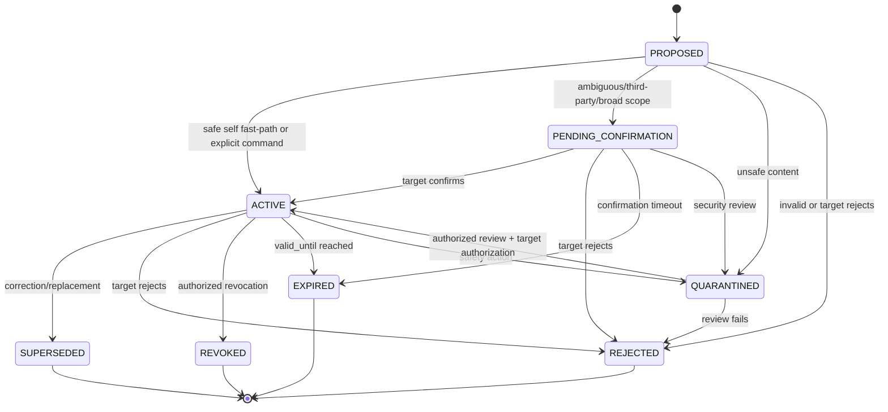
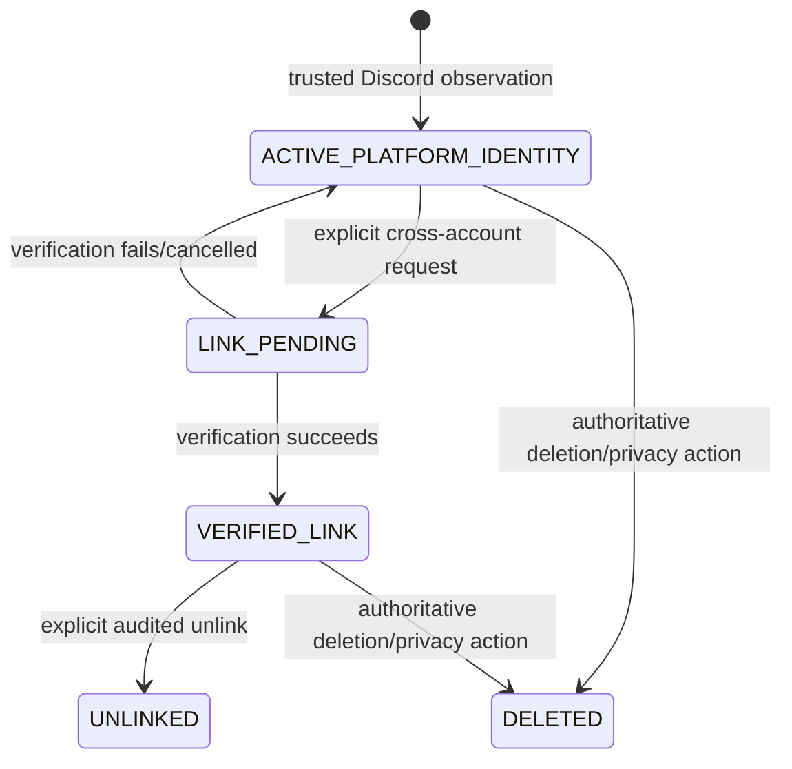
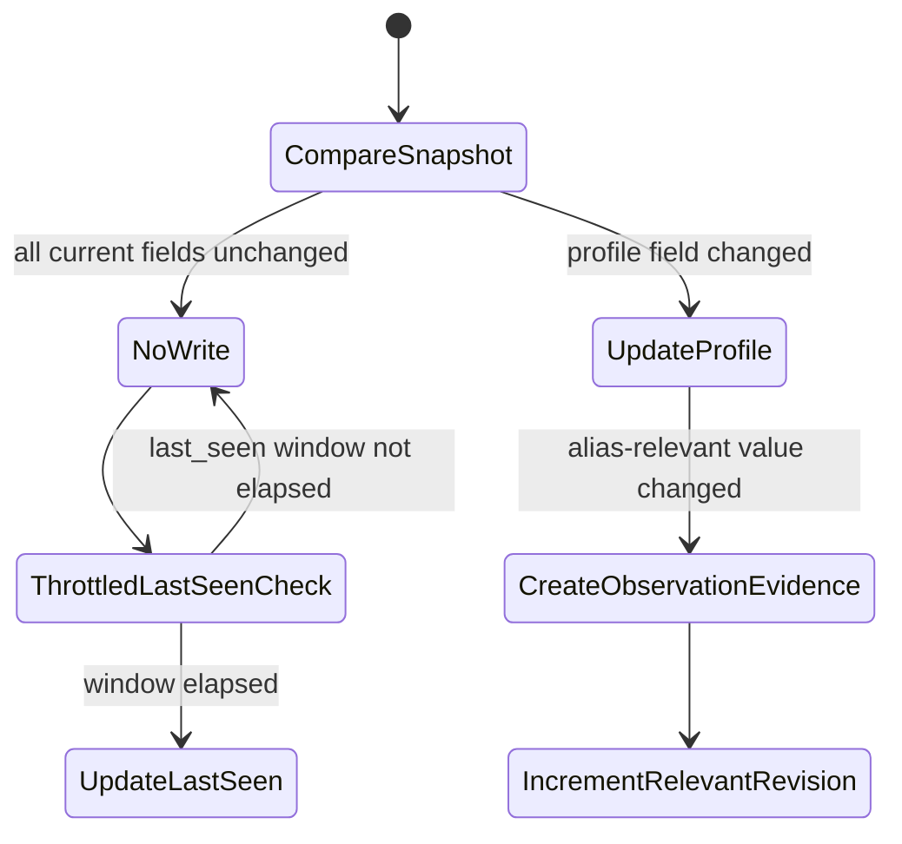

# Person Identity and Alias Specification

**Artifact filename:** `05-identity-alias-spec.md`  
**Status:** Normative specification; release-blocking identity-domain contract  
**Version:** 1.0-draft  
**Prepared:** 2026-08-01  
**Primary repository baseline:** `starryark/DC_BOT`, branch `main`, inspected tip `0ea3cbf5ec92f719e2b48066c3ada45aa50122ad`

## 1. Title and artifact filename

**Title:** Person Identity and Alias Specification  
**Artifact filename:** `05-identity-alias-spec.md`

Normative terms **MUST**, **MUST NOT**, **SHOULD**, **SHOULD NOT**, and **MAY** are used as requirements language.

---

## 2. Executive conclusion

**Classification: Recommendation / ADR-005.** DC_BOT SHALL adopt **Option B**: an internal UUID `PersonId` plus one or more separately verified `ExternalIdentity` records.

A Discord account is identified only by its Discord user snowflake. The tuple `(platform = "discord", external_subject_key = <snowflake>)` is the unique durable Discord identity. A username, global display name, guild nickname, alias, avatar, normalized string, voice characteristic, embedding, or model inference MUST NOT create, merge, or prove an identity relation.

For the Discord-only first release, the implementation remains minimal:

1. On first trusted observation of a Discord user snowflake, create exactly one `Person` and one `ExternalIdentity` linked to it.
2. Enforce a unique constraint on `(platform, external_subject_key)` so the same Discord account cannot produce two active people.
3. Do not expose or require an HTTP identity service. The domain MAY run in-process behind a transport-neutral `IdentityPort` with SQLite or PostgreSQL.
4. Do not infer that the `Person` is a verified real-world human. It is a durable memory subject associated with the observed account.
5. Future cross-platform links require an explicit verified linking ceremony and an auditable decision. Similar names, aliases, avatars, writing styles, or voices are never sufficient.

**Why Option A is rejected.** Using `discord:user:<snowflake>` directly as `PersonId` is operationally simple but semantically conflates a Discord account with the domain’s person/memory subject. It also makes later verified multi-account or cross-platform linking a primary-key migration instead of a controlled relation change. The UUID record adds one small table and one join while preserving a clean migration path and explicit verification boundary.

**Release-blocking conclusion.** The current group-voice path must be corrected before durable shared memory ships. It initially preserves separate `userId` values per utterance, but the controller later constructs one synthetic `displayName: 'Discord group'` turn and the current history stores only a speaker string. Durable events and causal links must retain each contributing Discord account separately; no synthetic group label may become a person or event author.

---

## 3. Scope

This specification defines:

- the `Person` aggregate;
- external platform identities, initially Discord;
- Discord actor and event-local presentation snapshots;
- aliases, evidence, normalization, validity, status, confidence, priority, and scope;
- deterministic preferred-address resolution for text and speech;
- revisioning and cache invalidation;
- same-name collision behavior;
- bot, deleted-account, and legacy-unresolved handling;
- third-party claims, corrections, rejection, and authorization;
- deterministic alias-intent parsing and constrained structured-LLM assistance;
- security, privacy, failure, migration, and acceptance requirements.

This specification does not define the complete memory-event schema, delivery state machine, logical-room binding model, retention implementation, or cross-platform account-verification UX. It defines the identity requirements those artifacts must satisfy.

---

## 4. Sources inspected

No repository was cloned. Inspection used GitHub repository trees, web-rendered source, raw source, commit pages, issues, and official documentation.

| Source | Branch / inspected revision | Material inspected | Notes |
|---|---|---|---|
| DC_BOT | `main` / `0ea3cbf5ec92f719e2b48066c3ada45aa50122ad` | Root README; Discord-bot README; `src/orchestration/events.ts`; `group-turn-builder.ts`; `conversation-controller.ts`; `guild-session.ts`; `src/voice/types.ts` | Primary implementation baseline. Commit: https://github.com/starryark/DC_BOT/commit/0ea3cbf5ec92f719e2b48066c3ada45aa50122ad |
| AIRI | `main` / `4d6e61f77dc99ec76c7cf352df62abb4282386c5` | `packages/memory-pgvector/package.json`; `packages/memory-pgvector/src/index.ts`; Alaya/memory issues and roadmap references | Comparison only. The inspected `memory-pgvector` entry point is a small module skeleton, not evidence of a complete identity system. Commit: https://github.com/moeru-ai/airi/commit/4d6e61f77dc99ec76c7cf352df62abb4282386c5 |
| AstrBot | `master` / `49095d3ba3fca9272a67aa5eeab2f6c0719c5091` | `astrbot/core/conversation_mgr.py`; `astrbot/core/db/po.py`; conversation/compression documentation | Comparison only. It demonstrates persisted conversation management but is not adopted as an identity or concurrency model. Commit: https://github.com/AstrBotDevs/AstrBot/commit/49095d3ba3fca9272a67aa5eeab2f6c0719c5091 |
| Discord developer documentation | Current at inspection | User object, guild member object, gateway intents, message `allowed_mentions`, snowflakes | Authoritative external platform contract. |
| Unicode Consortium | Current UAX #15 and UTS #39 at inspection | Normalization and confusable/security mechanisms | Used for comparison-key and abuse-detection requirements, never identity equivalence. |

### 4.1 Exact repository paths

DC_BOT:

- https://github.com/starryark/DC_BOT/blob/0ea3cbf5ec92f719e2b48066c3ada45aa50122ad/README.md
- https://github.com/starryark/DC_BOT/blob/0ea3cbf5ec92f719e2b48066c3ada45aa50122ad/airi/services/discord-bot/README.md
- https://github.com/starryark/DC_BOT/blob/0ea3cbf5ec92f719e2b48066c3ada45aa50122ad/airi/services/discord-bot/src/orchestration/events.ts
- https://github.com/starryark/DC_BOT/blob/0ea3cbf5ec92f719e2b48066c3ada45aa50122ad/airi/services/discord-bot/src/orchestration/group-turn-builder.ts
- https://github.com/starryark/DC_BOT/blob/0ea3cbf5ec92f719e2b48066c3ada45aa50122ad/airi/services/discord-bot/src/orchestration/conversation-controller.ts
- https://github.com/starryark/DC_BOT/blob/0ea3cbf5ec92f719e2b48066c3ada45aa50122ad/airi/services/discord-bot/src/orchestration/guild-session.ts
- https://github.com/starryark/DC_BOT/blob/0ea3cbf5ec92f719e2b48066c3ada45aa50122ad/airi/services/discord-bot/src/voice/types.ts

AIRI:

- https://github.com/moeru-ai/airi/blob/4d6e61f77dc99ec76c7cf352df62abb4282386c5/packages/memory-pgvector/package.json
- https://github.com/moeru-ai/airi/blob/4d6e61f77dc99ec76c7cf352df62abb4282386c5/packages/memory-pgvector/src/index.ts
- https://github.com/moeru-ai/airi/issues/879

AstrBot:

- https://github.com/AstrBotDevs/AstrBot/blob/49095d3ba3fca9272a67aa5eeab2f6c0719c5091/astrbot/core/conversation_mgr.py
- https://github.com/AstrBotDevs/AstrBot/blob/49095d3ba3fca9272a67aa5eeab2f6c0719c5091/astrbot/core/db/po.py

External:

- https://docs.discord.com/developers/resources/user
- https://docs.discord.com/developers/resources/guild#guild-member-object
- https://docs.discord.com/developers/events/gateway
- https://docs.discord.com/developers/reference#snowflakes
- https://docs.discord.com/developers/resources/message#allowed-mentions-object
- https://www.unicode.org/reports/tr15/
- https://www.unicode.org/reports/tr39/

### 4.2 Evidence limitations

**Classification: Confirmed repository fact.** The repository files above were opened through web-accessible GitHub content. No local build, runtime execution, database inspection, Discord gateway capture, or private deployment configuration was available.

**Classification: Open question.** The actual production gateway-intent configuration may differ from documentation. The root README describes a voice-oriented intent set, while the Discord-bot README discusses member and message-content intents for a text-reply version. Deployment configuration must be reconciled before relying on comprehensive member-update events.

---

## 5. Evidence table

| ID | Claim | Classification | Source URL | Confidence |
|---|---|---|---|---|
| EVID-001 | DC_BOT normalizes inbound events with `userId` and `displayName`, but not a complete Discord actor snapshot. | Confirmed repository fact | https://github.com/starryark/DC_BOT/blob/0ea3cbf5ec92f719e2b48066c3ada45aa50122ad/airi/services/discord-bot/src/orchestration/events.ts | High |
| EVID-002 | Voice utterances preserve a Discord `userId` and `displayName`, and capture sessions are keyed per user. | Confirmed repository fact | https://github.com/starryark/DC_BOT/blob/0ea3cbf5ec92f719e2b48066c3ada45aa50122ad/airi/services/discord-bot/src/voice/types.ts | High |
| EVID-003 | Group-turn construction retains original utterances and merges only adjacent fragments from the same `userId`. | Confirmed repository fact | https://github.com/starryark/DC_BOT/blob/0ea3cbf5ec92f719e2b48066c3ada45aa50122ad/airi/services/discord-bot/src/orchestration/group-turn-builder.ts | High |
| EVID-004 | The controller converts a multi-speaker group into one accepted turn with `displayName: 'Discord group'`, `userId` from the latest message, and `inputEvent` from the first utterance. | Confirmed repository fact | https://github.com/starryark/DC_BOT/blob/0ea3cbf5ec92f719e2b48066c3ada45aa50122ad/airi/services/discord-bot/src/orchestration/conversation-controller.ts#L2100-L2118 | High |
| EVID-005 | Current guild history is bounded and in-memory, is shared per guild, and persists a user `speaker` string rather than a durable person/account reference. | Confirmed repository fact | https://github.com/starryark/DC_BOT/blob/0ea3cbf5ec92f719e2b48066c3ada45aa50122ad/airi/services/discord-bot/src/orchestration/guild-session.ts | High |
| EVID-006 | Current history commit shape assumes one user half and one assistant half. | Confirmed repository fact | https://github.com/starryark/DC_BOT/blob/0ea3cbf5ec92f719e2b48066c3ada45aa50122ad/airi/services/discord-bot/src/orchestration/guild-session.ts#L549-L599 | High |
| EVID-007 | Discord’s user object defines `id` as the user snowflake and says `username` is not unique; global name, avatar, and bot/system flags are separate attributes. | External research finding | https://docs.discord.com/developers/resources/user#user-object | High |
| EVID-008 | A guild member has guild-scoped nickname and avatar fields separate from the user object. | External research finding | https://docs.discord.com/developers/resources/guild#guild-member-object | High |
| EVID-009 | Discord regular messages parse user, role, and everyone mentions by default unless `allowed_mentions` is explicitly constrained. | External research finding | https://docs.discord.com/developers/resources/message#allowed-mentions-object | High |
| EVID-010 | Comprehensive guild-member listing and some member event behavior involve the privileged `GUILD_MEMBERS` intent. | External research finding | https://docs.discord.com/developers/events/gateway#gateway-intents | High |
| EVID-011 | AIRI contains a `memory-pgvector` package, but the inspected entry point only registers a module/configure handler and does not establish a production identity implementation. | Confirmed repository fact | https://github.com/moeru-ai/airi/blob/4d6e61f77dc99ec76c7cf352df62abb4282386c5/packages/memory-pgvector/src/index.ts | High |
| EVID-012 | AIRI’s Alaya item is represented in issue/proposal work; it must not be treated as fully implemented production behavior without further evidence. | Confirmed repository fact | https://github.com/moeru-ai/airi/issues/879 | Medium-high |
| EVID-013 | AstrBot’s compatibility conversation object serializes conversation content as JSON history, and its manager appends user and assistant messages then updates the conversation content. | Confirmed repository fact | https://github.com/AstrBotDevs/AstrBot/blob/49095d3ba3fca9272a67aa5eeab2f6c0719c5091/astrbot/core/conversation_mgr.py | High |
| EVID-014 | Unicode normalization provides stable comparison transformations, while confusable detection is a security heuristic rather than exact identity science. | External research finding | https://www.unicode.org/reports/tr15/ and https://www.unicode.org/reports/tr39/ | High |
| EVID-015 | Names, aliases, and voice properties cannot safely establish account or human identity equivalence. | Source-plan requirement | User-supplied source plan | High |

---

## 6. Current-state findings

### 6.1 Inbound identity is under-specified

**Classification: Confirmed repository fact.** `BaseInputEvent` currently carries `userId` and `displayName`. This is enough for immediate routing but not enough to preserve the username, global name, guild nickname, guild avatar, bot/system status, source completeness, or the selected display value observed at event time.

**Classification: Recommendation.** Every persisted inbound text or voice event must carry a `DiscordActorSnapshot` plus an `EventDisplaySnapshot`. The event must reference the resolved `PersonId` and `ExternalIdentityId`, while preserving the original Discord snowflake as a string.

### 6.2 Voice capture begins correctly but group attribution is later collapsed

**Classification: Confirmed repository fact.** `VoiceUtterance` records one `userId` per captured speaker. `buildGroupTurn` retains original events and only merges adjacent fragments with the same `userId`.

**Classification: Confirmed repository fact.** `onConversationGroup` then chooses the first input event, the latest user ID, and the synthetic display name `Discord group` for one accepted turn.

**Classification: Inference.** If this turn were written into durable shared memory unchanged, the durable author and causal evidence would be ambiguous or wrong: one person could appear to have authored another person’s words, and a group label could be mistaken for an identity.

**Classification: Recommendation.** The durable model must append one attributable user event per contributing speaker and relate the assistant generation to all contributing events through a many-to-many causal relation defined by the memory-event specification.

### 6.3 Current history is presentation-keyed, not identity-keyed

**Classification: Confirmed repository fact.** `GuildSession.commitExchange` stores a `speaker: string`. It does not store Discord user ID, external identity ID, person ID, actor snapshot, event ID, or alias revision.

**Classification: Recommendation.** Speaker labels may remain prompt presentation data, but durable authorship must reference `PersonId` and `ExternalIdentityId`. Historical text must keep the event-local display snapshot, even when the person later changes names.

### 6.4 Current room history is guild-wide

**Classification: Confirmed repository fact.** The inspected `GuildSession` explicitly uses one shared logical session per guild and projects a room ID from the guild ID.

**Classification: Source-plan requirement.** Physical Discord channels and logical conversation rooms are distinct. Identity scope resolution must therefore accept both `guild_id` and `logical_room_id`; it must not infer that all channels in a guild share room aliases or private history.

### 6.5 Comparison projects do not supply a drop-in identity model

**Classification: Confirmed repository fact.** AIRI’s inspected `memory-pgvector` entry point is a small module skeleton; the Alaya material inspected is issue/proposal work. It is not evidence of a completed identity and alias subsystem.

**Classification: Confirmed repository fact.** AstrBot provides useful examples of persisted conversations and content updates, but the inspected compatibility shape serializes whole conversation content. This is not adopted as the concurrency or identity model for append-attributable events.

**Classification: Recommendation.** DC_BOT should borrow product lessons, not copy either persistence shape as an identity authority.

---

## 7. Proposed decisions

### ADR-005 — Internal UUID Person with verified external identities

**Decision:** Accept Option B.

**Consequences:**

- `PersonId` is an internal UUID.
- Discord identity is represented by an `ExternalIdentity` with `platform = discord` and `external_subject_key = snowflake string`.
- The first release creates one person per Discord identity by default.
- Multiple external identities may link to one person only after explicit verification.
- One external identity cannot link to two active people.
- Merging and splitting are audited domain operations, not alias updates.

### ADR-006 — Names are presentation, never identity proof

Aliases, usernames, global names, nicknames, avatars, normalized values, confusable skeletons, voiceprints, speech embeddings, and behavioral similarity are non-authoritative attributes. Exact equality of any such value must not trigger identity linking. Different values must not trigger identity splitting.

### ADR-007 — Event-local presentation is immutable evidence

Every persisted event stores the actor presentation observed at ingestion. Current presentation and current preferred aliases are separate mutable projections. A later name change must not rewrite the historical event’s displayed-at-the-time value, except through a defined privacy-redaction operation.

### ADR-008 — Narrower authorized alias scope wins

Preferred address resolution uses this context-specific scope order:

1. Exact private conversation.
2. Exact logical room.
3. Exact guild.
4. Exact character-global scope.
5. Platform scope.
6. Current Discord presentation fallback.
7. Safe generic fallback.

Authorization filtering occurs before ranking. A private alias is never considered in a public guild context.

### ADR-009 — Alias writes are change-driven, not event-driven

Every stored event may contain an actor snapshot. Current-profile and alias tables change only when value, validity, preference, authorization, status, or evidence relation changes. Identical repeated observations do not update alias rows.

### ADR-010 — Deterministic parser first; LLM can only propose uncertain intent

Safe, exact, first-person grammar may activate a local alias. Quoted, coded, negated, uncertain, joking, third-party, broad-scope, or otherwise ambiguous statements must not auto-activate. A structured LLM classifier may create a confirmation-required proposal but may not establish identity or silently activate an alias.

### ADR-011 — Prompt-local person references are opaque and non-exportable

When two or more participants have the same display alias, prompt serialization assigns ephemeral references such as `P01` and `P02`. These references distinguish people inside one prompt only. They must never be spoken, displayed, stored as aliases, or exposed to users.

### ADR-012 — Identity domain remains deployment-neutral

The initial implementation should be an in-process domain/application layer behind `IdentityPort`, using the selected relational store. A standalone service is a later topology option, not a first-milestone requirement.

---

## 8. Alternatives considered

| Alternative | Advantages | Disadvantages | Outcome |
|---|---|---|---|
| Option A: `discord:user:<snowflake>` as `PersonId` | Minimal table count; easy debugging | Conflates account identity and person aggregate; complicates verified linking, splitting, deletion, and cross-platform migration | Rejected |
| Option B: UUID `Person` + `ExternalIdentity` | Explicit verification boundary; supports multiple accounts and future platforms; preserves snowflake uniqueness | One extra join and lifecycle | Accepted |
| Name-keyed identity | Superficially simple | Same-name merges, rename splits, spoofing, privacy failures | Rejected |
| Avatar or voice-based linking | May seem useful for continuity | Probabilistic, spoofable, biometric/privacy risk, false merges | Rejected |
| Global alias only | Simple resolution | Leaks private preferences and ignores guild/room context | Rejected |
| LLM-only alias extraction | Broad linguistic coverage | Nondeterministic authorization, quote/code/negation errors, prompt-injection exposure | Rejected |
| Mandatory identity microservice | Centralized authority | Unjustified network dependency and latency for current topology | Deferred unless deployment evidence requires it |
| Mutable whole-history record | Simple read model | Weak event attribution, large concurrent writes, difficult deletion provenance | Rejected for durable memory events |

---

## 9. Rejected alternatives and reasons

### 9.1 Direct Discord key as PersonId

**Classification: Recommendation.** Rejected because a Discord account identifier is not a verified cross-platform human identifier. The internal person aggregate needs a stable key independent of any one platform account while retaining a strict unique external identity relation.

### 9.2 Alias equality as a merge signal

**Classification: Source-plan requirement.** Rejected. Two people named “Alex” remain two people. Alias equality may create a collision warning only.

### 9.3 Voice characteristics as identity proof

**Classification: Recommendation.** Rejected for identity equivalence. Voice may be used only for non-authoritative, session-local speaker-separation assistance after separate privacy review. The durable author must still be bound to Discord’s speaking user ID supplied by the voice transport.

### 9.4 Private aliases copied upward

**Classification: Source-plan requirement.** Rejected. Private-conversation aliases must not appear in room-, guild-, character-, or platform-scoped resolution unless the user explicitly creates a separate alias in that broader scope.

### 9.5 Updating alias evidence for every event

**Classification: Recommendation.** Rejected due to write amplification. Event snapshots already prove what was observed at that time. Alias evidence rows are created on first observation, changed presentation, explicit statement, confirmation, correction, rejection, or operator action.

### 9.6 Confusable-skeleton equality as identity

**Classification: External research finding / Recommendation.** Rejected. UTS #39 confusable detection is an abuse signal, not exact identity science. A skeleton collision may quarantine or warn but never merge people.

---

## 10. Normative domain specification

### 10.1 Core invariants

- **REQ-ID-001:** A Discord external identity MUST be keyed by the exact Discord user snowflake received from Discord.
- **REQ-ID-002:** Discord snowflakes MUST be stored and transported as decimal strings, not JavaScript numbers or floating-point values.
- **REQ-ID-003:** `(platform, external_subject_key)` MUST be unique among all external identities, including inactive records unless a privacy-erasure policy explicitly removes the record.
- **REQ-ID-004:** A username, global name, nickname, alias, avatar, normalized string, voice property, model output, or similarity score MUST NOT establish identity equivalence.
- **REQ-ID-005:** A person merge MUST require an explicit verified linking operation with audit evidence.
- **REQ-ID-006:** No cross-platform identity link may be inferred.
- **REQ-ID-007:** One observed Discord identity MUST resolve deterministically to one active `PersonId`.
- **REQ-ID-008:** A person split or external-identity reassignment MUST be an explicit audited administrative operation and MUST invalidate affected memory and alias caches.
- **REQ-ID-009:** Bot accounts MUST use the same snowflake-based external identity rule; bot status is an attribute, not a different key type.
- **REQ-ID-010:** A synthetic label such as `Discord group` MUST NOT be created as a `Person`, `ExternalIdentity`, or durable event author.

### 10.2 Person

A `Person` is the domain’s durable memory subject. It is not a legal assertion that a real-world human has been verified.

```text
Person {
  person_id: UUID primary key
  kind: ACCOUNT_SUBJECT | BOT_ACCOUNT | SYSTEM_ACCOUNT | LEGACY_UNRESOLVED
  status: ACTIVE | RESTRICTED | DELETED | TOMBSTONED | UNRESOLVED
  alias_revision: uint64
  created_at: timestamp
  updated_at: timestamp
  deleted_at: timestamp?
  metadata_policy_version: string
}
```

- **REQ-ID-011:** `person_id` MUST be internally generated and MUST NOT encode a username, snowflake, guild, alias, or platform.
- **REQ-ID-012:** `ACCOUNT_SUBJECT` means an account-associated subject; it MUST NOT be presented as proof of a unique biological or legal person.
- **REQ-ID-013:** Person status changes MUST be audited.
- **REQ-ID-014:** `alias_revision` MUST increment transactionally on any change that can alter preferred-address resolution.

### 10.3 External identity

```text
ExternalIdentity {
  external_identity_id: UUID primary key
  person_id: UUID foreign key -> Person
  platform: string                    // first release: "discord"
  external_subject_key: string        // exact snowflake decimal string
  link_status: ACTIVE | LINK_PENDING | UNLINKED | REVOKED | DELETED
  verification_method:
      PLATFORM_EVENT
    | PLATFORM_OAUTH
    | USER_CHALLENGE
    | OPERATOR_VERIFIED
    | MIGRATION_VERIFIED
  verification_strength: PLATFORM_ASSERTED | CROSS_ACCOUNT_VERIFIED
  verified_at: timestamp
  first_seen_at: timestamp
  last_seen_at: timestamp
  bot: boolean
  system: boolean
  revision: uint64
}
```

- **REQ-ID-015:** Discord event ingestion may create a `PLATFORM_EVENT` identity because Discord supplied the account snowflake in an authenticated gateway or API context. This verifies the Discord account identifier only, not a real-world person.
- **REQ-ID-016:** `CROSS_ACCOUNT_VERIFIED` MUST require a separate linking flow.
- **REQ-ID-017:** External identities MUST NOT be merged based on alias or profile similarity.
- **REQ-ID-018:** A unique database constraint MUST cover `(platform, external_subject_key)`.
- **REQ-ID-019:** `last_seen_at` SHOULD be updated at most once per 24-hour window per external identity, using a conditional update. Event timestamps remain the authoritative observation history.
- **REQ-ID-020:** Re-observing an unchanged identity and profile MUST be a no-op for current-profile and alias rows.

### 10.4 Current Discord profile

This projection stores the latest known Discord presentation attributes separately from historical events.

```text
CurrentDiscordProfile {
  external_identity_id: UUID primary key
  username: string
  global_name: string?
  avatar_hash: string?
  bot: boolean
  system: boolean
  observed_at: timestamp
  source_event_id: UUID?
  profile_revision: uint64
}

CurrentDiscordGuildProfile {
  external_identity_id: UUID
  guild_id: string
  guild_nickname: string?
  guild_avatar_hash: string?
  observed_at: timestamp
  source_event_id: UUID?
  profile_revision: uint64
  primary key (external_identity_id, guild_id)
}
```

- **REQ-ID-021:** A current-profile row changes only when a stored field changes or its authorization/completeness state changes.
- **REQ-ID-022:** A username change MUST update the current projection without creating a new person or external identity.
- **REQ-ID-023:** A guild nickname change MUST update only that guild projection.
- **REQ-ID-024:** Missing fields in a partial event MUST NOT silently erase previously known values. The snapshot must record completeness, and projection updates must distinguish “absent/not supplied” from explicit null.

### 10.5 Discord actor snapshot

Every inbound event eligible for memory or generation must include:

```text
DiscordActorSnapshot {
  discord_user_id: string
  username: string?
  global_name: string?
  guild_id: string?
  guild_nickname: string?
  avatar_hash: string?
  guild_avatar_hash: string?
  bot: boolean?
  system: boolean?
  observed_at: timestamp
  source_event_type: string
  completeness:
      USER_COMPLETE | USER_PARTIAL | MEMBER_COMPLETE | MEMBER_PARTIAL
}
```

- **REQ-EVENT-001:** `discord_user_id` is mandatory for attributable Discord user events.
- **REQ-EVENT-002:** The actor snapshot MUST be captured before asynchronous summarization or memory extraction.
- **REQ-EVENT-003:** Snapshot fields MUST preserve the values observed at event time.
- **REQ-EVENT-004:** Partial snapshots MUST be marked as partial.
- **REQ-EVENT-005:** Voice events MUST bind the Discord speaking user ID from the voice transport to the utterance; speaker identity must not be reconstructed from audio.
- **REQ-EVENT-006:** Text and voice events from the same Discord snowflake MUST resolve to the same external identity and person, subject to scope authorization.

### 10.6 Event-local display snapshot

The actor snapshot preserves raw platform fields. The display snapshot preserves exactly which presentation was selected for that event.

```text
EventDisplaySnapshot {
  display_text: string
  display_source:
      ACTIVE_ALIAS
    | GUILD_NICKNAME
    | GLOBAL_NAME
    | USERNAME
    | SAFE_GENERIC
  alias_id: UUID?
  alias_revision: uint64?
  spoken_form_used: string?
  rendering_policy_version: string
}
```

- **REQ-EVENT-007:** Historical event rendering SHOULD use the event-local display snapshot, not the person’s current alias.
- **REQ-EVENT-008:** Current direct address SHOULD use preferred-address resolution at the current time and context.
- **REQ-EVENT-009:** Privacy redaction may replace historical display text, but it must be an explicit redaction operation, not an ordinary alias update.

### 10.7 Alias

```text
Alias {
  alias_id: UUID primary key
  person_id: UUID foreign key -> Person
  text_form: string
  spoken_form: string?
  normalization_key: string
  confusable_skeleton: string?         // warning only
  scope_type:
      PLATFORM
    | CHARACTER_GLOBAL
    | GUILD
    | LOGICAL_ROOM
    | PRIVATE_CONVERSATION
  scope_key: string
  character_id: string?
  status:
      PROPOSED
    | PENDING_CONFIRMATION
    | ACTIVE
    | SUPERSEDED
    | REJECTED
    | REVOKED
    | EXPIRED
    | QUARANTINED
  preferred: boolean
  confidence: uint8                   // 0..100; not authorization
  authority:
      SELF_EXPLICIT
    | SELF_CONFIRMED
    | PLATFORM_OBSERVED
    | TARGET_CONFIRMED_THIRD_PARTY
    | OPERATOR_ADMINISTRATIVE
    | MIGRATION
    | LLM_PROPOSED
    | THIRD_PARTY_UNCONFIRMED
  priority: int16
  valid_from: timestamp
  valid_until: timestamp?
  authorized_by_person_id: UUID?
  created_at: timestamp
  updated_at: timestamp
  revision: uint64
}
```

- **REQ-ID-025:** `Alias.person_id` identifies the subject of the alias, not the claimant.
- **REQ-ID-026:** An alias MUST NOT be used unless its status is `ACTIVE`, its validity interval contains the resolution time, and its scope is authorized for the current context.
- **REQ-ID-027:** `confidence` MUST NOT override missing authorization.
- **REQ-ID-028:** A normalized alias collision MUST NOT merge people.
- **REQ-ID-029:** At most one active `preferred = true` alias may exist per `(person_id, scope_type, scope_key, character_id)` after context normalization.
- **REQ-ID-030:** Alias rows MUST NOT contain evidence ID arrays or duplicated evidence blobs.

### 10.8 Alias evidence

```text
AliasEvidence {
  evidence_id: UUID primary key
  evidence_kind:
      SELF_STATEMENT
    | EXPLICIT_COMMAND
    | SELF_CORRECTION
    | SELF_REJECTION
    | DISCORD_USERNAME_OBSERVATION
    | DISCORD_GLOBAL_NAME_OBSERVATION
    | DISCORD_GUILD_NICK_OBSERVATION
    | THIRD_PARTY_CLAIM
    | TARGET_CONFIRMATION
    | OPERATOR_ACTION
    | MIGRATION_SOURCE
    | LLM_CLASSIFICATION
  source_event_id: UUID?
  claimant_person_id: UUID?
  target_person_id: UUID
  source_external_identity_id: UUID?
  evidence_text_hash: string?
  protected_excerpt: string?
  created_at: timestamp
  authorization_context: string
}

AliasEvidenceLink {
  alias_id: UUID
  evidence_id: UUID
  relation: SUPPORTS | CORRECTS | REJECTS | SUPERSEDES | QUARANTINES
  primary key (alias_id, evidence_id, relation)
}
```

- **REQ-ID-031:** Evidence is normalized through `AliasEvidenceLink`; evidence identifiers MUST NOT also be duplicated in alias JSON.
- **REQ-ID-032:** Repeated unchanged platform presentation need not create repeated alias evidence. The event snapshot is sufficient observation history.
- **REQ-ID-033:** Evidence excerpts must follow retention and access controls; a hash and event reference are preferred when raw text is not required.

### 10.9 Alias normalization

Normalization is for lookup, duplicate detection, and abuse analysis only.

The first-release normalization pipeline is:

1. Validate UTF-8 and reject ill-formed sequences.
2. Preserve the original `text_form` separately.
3. Compute Unicode NFKC.
4. Apply full, locale-independent Unicode case folding.
5. Map all whitespace runs to one ASCII space and trim.
6. Remove prohibited control, surrogate, noncharacter, bidi-override, and unsafe default-ignorable code points from the comparison key.
7. Do not transliterate scripts.
8. Do not remove ordinary punctuation for identity or merge logic.
9. Optionally compute a UTS #39 confusable skeleton as a security-warning field only.

- **REQ-ID-034:** `normalization_key` equality means “comparison-colliding alias,” not “same person.”
- **REQ-ID-035:** Different normalization keys do not imply different people.
- **REQ-ID-036:** The normalization algorithm and Unicode version MUST be versioned so keys can be regenerated safely.
- **REQ-ID-037:** A confusable warning may require confirmation or quarantine, but must never trigger an identity merge.

### 10.10 Alias validity interval

Use half-open intervals: `[valid_from, valid_until)`.

- **REQ-ID-038:** `valid_from` is mandatory.
- **REQ-ID-039:** `valid_until = null` means no planned expiry, not permanent truth.
- **REQ-ID-040:** Correction normally closes the prior alias at the correction time and activates the replacement at the same time.
- **REQ-ID-041:** Historical event snapshots remain unchanged when current alias validity changes.
- **REQ-ID-042:** Overlapping active preferred aliases in the same exact scope are prohibited.

### 10.11 Alias status

Allowed transitions are defined in Section 11. A status is not inferred from confidence.

- `PROPOSED`: extracted or submitted but not yet authorized.
- `PENDING_CONFIRMATION`: target confirmation is required.
- `ACTIVE`: eligible for resolution.
- `SUPERSEDED`: replaced by a later alias.
- `REJECTED`: explicitly denied by the target or failed confirmation.
- `REVOKED`: removed by an authorized actor or policy.
- `EXPIRED`: outside a finite validity interval.
- `QUARANTINED`: withheld for security/safety review.

### 10.12 Alias confidence

Normative defaults:

| Evidence class | Default confidence | Automatic activation? |
|---|---:|---|
| Explicit self command with validated target and scope | 100 | Yes, if authorized |
| Safe deterministic first-person fast path | 95 | Yes, only local default or exact narrow scope |
| Self confirmation of pending claim | 100 | Yes |
| Discord username/global-name/nickname observation | 90 | Yes as non-self-explicit fallback alias |
| Target-confirmed third-party claim | 90 | Yes |
| Authorized migration | 85 | Yes, subject to migration policy |
| Operator administrative label | 80 | No as personal preference unless target authorizes |
| Structured LLM proposal | maximum 40 | No; confirmation required |
| Unconfirmed third-party claim | maximum 20 | No |

- **REQ-ID-043:** Confidence affects tie-breaking only after authorization, status, validity, and scope filtering.
- **REQ-ID-044:** LLM confidence is not a substitute for user confirmation.

### 10.13 Alias priority

`priority` is an explicit integer in `[-1000, 1000]`.

- Self-selected preferred aliases default to `100`.
- Platform-observed aliases default to `0`.
- Administrative safety labels default to `-100` and are not personal preferences.
- A correction supersedes the old row; it does not rely merely on higher priority.

- **REQ-ID-045:** Priority MUST NOT cross scope boundaries.
- **REQ-ID-046:** Priority MUST NOT activate an unauthorized, invalid, or inactive alias.
- **REQ-ID-047:** User-facing APIs should normally expose “preferred” rather than raw priority numbers.

### 10.14 Alias scopes

#### PLATFORM

`scope_key = "discord"` in the first release. Visible in Discord contexts when no narrower alias wins. It does not cross to another platform.

#### CHARACTER_GLOBAL

`scope_key = character_id`. Visible wherever the same character interacts with the person, subject to platform and privacy authorization. Creation requires an explicit command or confirmation because it broadens across guilds/rooms.

#### GUILD

`scope_key = discord guild snowflake`. Visible only within that guild. A Discord guild nickname observation naturally belongs here.

#### LOGICAL_ROOM

`scope_key = logical_room_id`. Visible only in the logical conversation room, even if the room binds multiple physical channels.

#### PRIVATE_CONVERSATION

`scope_key = private_conversation_id`. Visible only in that private conversation and authorized participants. It must never be read during public guild resolution.

- **REQ-SCOPE-001:** Scope authorization MUST happen before alias text is loaded into a prompt.
- **REQ-SCOPE-002:** Private alias rows MUST be excluded from guild/public queries at the database or repository predicate level, not merely hidden during rendering.
- **REQ-SCOPE-003:** A physical Discord channel ID MUST NOT be treated as a logical room ID unless an explicit binding says so.
- **REQ-SCOPE-004:** Character-global aliases require an exact `character_id` match.
- **REQ-SCOPE-005:** Platform aliases are platform-specific; they do not create cross-platform identity.
- **REQ-SCOPE-006:** An unbound guild channel receives guild and platform aliases only unless a defined room is created.

### 10.15 Preferred-address resolution

Input:

```text
ResolveAddressRequest {
  person_id
  platform
  character_id?
  guild_id?
  logical_room_id?
  private_conversation_id?
  modality: TEXT | SPEECH
  at_time
  viewer_authorization
}
```

Algorithm:

1. Authorize the viewer and context.
2. Build exact eligible scopes from the request.
3. Query only `ACTIVE` aliases whose validity contains `at_time`.
4. Exclude quarantined, rejected, revoked, expired, unauthorized, and unsafe modality forms.
5. Assign scope rank: private `500`, room `400`, guild `300`, character-global `200`, platform `100`.
6. Sort by:
   1. higher scope rank;
   2. `preferred = true` before false;
   3. authority rank: `SELF_CONFIRMED`, `SELF_EXPLICIT`, `TARGET_CONFIRMED_THIRD_PARTY`, `PLATFORM_OBSERVED`, `MIGRATION`, `OPERATOR_ADMINISTRATIVE`;
   4. higher `priority`;
   5. higher `confidence`;
   6. later `valid_from`;
   7. lexical ascending UUID bytes for deterministic final tie-break.
7. For text, choose the first valid text form.
8. For speech, choose the first valid spoken form; if absent, attempt safe derivation from text; otherwise continue to the next candidate.
9. If no alias remains, use current Discord presentation in this order: guild nickname, global name, username.
10. If no safe presentation remains, use the localized generic form “you” for direct address or “Discord user” for third-person reference. Do not include a raw snowflake.

- **REQ-SCOPE-007:** Resolution MUST be deterministic for the same data revision, context, modality, and time.
- **REQ-SCOPE-008:** A narrower scope wins even if a broader alias has higher numeric priority.
- **REQ-SCOPE-009:** A private alias can never win outside its exact private conversation.
- **REQ-SCOPE-010:** Resolution results MUST include `alias_revision` and selected `alias_id` or fallback source for observability.

### 10.16 Text display form

- **REQ-ID-048:** Explicit aliases must contain 1–64 Unicode grapheme clusters and no more than 256 UTF-8 bytes after trimming.
- **REQ-ID-049:** Stored event snapshots may preserve raw platform presentation, but rendered text must escape Discord markdown and neutralize mention syntax.
- **REQ-ID-050:** User-supplied aliases containing `@everyone`, `@here`, `<@...>`, `<@!...>`, `<@&...>`, or channel mention syntax MUST NOT auto-activate.
- **REQ-ID-051:** All bot messages that include user-controlled alias or presentation text MUST send `allowed_mentions` with an empty parse list unless an independent feature intentionally and explicitly authorizes a specific mention.
- **REQ-ID-052:** Prompt serialization MUST place alias text in a structured data field, not concatenate it into role or instruction delimiters.
- **REQ-ID-053:** Raw internal UUIDs, snowflakes, and prompt-local opaque references MUST NOT be exposed as normal display names.

### 10.17 Spoken form

A spoken form may be explicitly supplied or safely derived.

Validation:

- 1–80 grapheme clusters;
- no control characters, bidi override/isolate controls, Discord mention syntax, URLs, markdown code delimiters, or SSML/XML markup;
- at least one letter, number, or pronounceable symbol after filtering;
- must not be only emoji, punctuation, whitespace, or invisible characters unless the TTS provider has an explicitly tested pronunciation policy;
- provider-specific SSML escaping is mandatory.

- **REQ-ID-054:** Unsafe or empty spoken form MUST be treated as unavailable, not spoken literally.
- **REQ-ID-055:** If text-to-spoken derivation is unsafe, resolution continues to the next alias or current safe presentation.
- **REQ-ID-056:** The final fallback for direct speech is a localized pronoun or omission of the name, not a snowflake or opaque reference.

### 10.18 Revision and cache invalidation

- **REQ-OPS-001:** Every transaction that changes alias status, preference, scope, validity, authorization, text form, spoken form, or relevant person linkage MUST increment `Person.alias_revision`.
- **REQ-OPS-002:** Cache keys MUST include `person_id`, context identifiers, modality, and observed alias revision.
- **REQ-OPS-003:** In-process caches MUST invalidate after a successful commit, never before.
- **REQ-OPS-004:** Multi-process deployments MUST publish an outbox-backed invalidation event containing person ID and new revision. A network service is not required; the mechanism may be database polling or pub/sub.
- **REQ-OPS-005:** Cache invalidation failure must cause bounded staleness and observable metrics. Privacy-relevant revocation or rejection must support a fail-closed read path until the new revision is visible.
- **REQ-OPS-006:** A no-op repeated observation MUST NOT increment alias revision.

### 10.19 Same-name collisions

- **REQ-ID-057:** Two people sharing a normalization key remain separate people and external identities.
- **REQ-ID-058:** Prompt construction must assign ephemeral opaque references per prompt, deterministically from event order, such as `P01`, `P02`.
- **REQ-ID-059:** The opaque reference map exists only for the prompt/generation lifetime and must not become memory, alias, telemetry exposed to users, text output, or speech output.
- **REQ-ID-060:** Prompt records should carry both `person_ref` and safe display text, for example:

```json
{"person_ref":"P01","display":"Alex","event_id":"evt-1","text":"..."}
{"person_ref":"P02","display":"Alex","event_id":"evt-2","text":"..."}
```

- **REQ-ID-061:** The model instruction must state that `person_ref` is internal and must never be printed or spoken.
- **REQ-ID-062:** If user-visible disambiguation is needed, use contextual phrasing such as “the Alex who just asked about music,” not an internal identifier.

### 10.20 Bot accounts

- **REQ-ID-063:** Discord bot accounts are keyed by their Discord snowflake exactly like normal accounts.
- **REQ-ID-064:** `bot` and `system` flags are actor attributes.
- **REQ-ID-065:** By default, automated bot messages must not create self-asserted aliases or durable personal memories unless the deployment explicitly allows bot-to-bot memory.
- **REQ-ID-066:** A bot and a non-bot with the same name must never merge.

### 10.21 Deleted Discord accounts

- **REQ-ID-067:** A display string resembling “Deleted User” is not sufficient evidence that an account is deleted.
- **REQ-ID-068:** When deletion is established by authoritative API state, explicit operator action, or privacy workflow, mark the external identity status without reassigning historical events to another person.
- **REQ-ID-069:** Historical event snapshots remain attributable to the same internal person until the privacy-erasure specification redacts or deletes them.
- **REQ-ID-070:** Current address resolution for a deleted account must use an authorized surviving alias or a generic “former Discord user” form; it must not expose the raw snowflake.
- **REQ-ID-071:** Erasure, re-observation, and anti-recreation tombstones require the privacy/deletion artifact to choose among hard deletion, pseudonymous tombstone, or consent-based recreation.

### 10.22 Legacy unresolved speakers

- **REQ-ID-072:** Legacy records that contain only a speaker string create `Person.kind = LEGACY_UNRESOLVED` or remain explicitly unresolved; they must not be attached to a Discord identity by name matching.
- **REQ-ID-073:** Each unresolved legacy source must have a stable migration source key so two identical names from different records do not silently merge.
- **REQ-ID-074:** Resolution to a Discord identity requires verified migration evidence or target confirmation.
- **REQ-ID-075:** If evidence is insufficient, the record remains unresolved and is excluded from person-level facts that could affect a current Discord user.

### 10.23 Third-party alias claims

Example: Alice says “Call Bob ‘Bobby.’”

- **REQ-ID-076:** The claim is evidence about Bob, not authorization from Bob.
- **REQ-ID-077:** It creates `PROPOSED` or `PENDING_CONFIRMATION` status with authority `THIRD_PARTY_UNCONFIRMED`.
- **REQ-ID-078:** It must not affect preferred-address resolution until Bob confirms or an explicit policy grants a narrowly defined administrative label.
- **REQ-ID-079:** The claimant, target, source event, scope, and context must be recorded.

### 10.24 User corrections

Example: “Actually, call me Ren instead of Wren.”

- **REQ-ID-080:** A validated self-correction closes or supersedes the prior alias in the same target scope and activates the replacement in one transaction.
- **REQ-ID-081:** Correction evidence links to both old and new alias rows using `CORRECTS` and `SUPERSEDES` relations.
- **REQ-ID-082:** Correction must increment alias revision once for the transaction.
- **REQ-ID-083:** Historical events retain the old event-local display snapshot.

### 10.25 User rejection

Examples: “Don’t call me Bobby,” “I do not go by Ren.”

- **REQ-ID-084:** A validated self-rejection changes matching active/pending aliases in the authorized scope to `REJECTED` or `REVOKED`.
- **REQ-ID-085:** Rejection takes effect before any lower-priority cache is served.
- **REQ-ID-086:** A rejected alias may not reactivate from the same evidence. New explicit self evidence is required.
- **REQ-ID-087:** Rejection of a private alias does not necessarily reject a separately created guild alias with the same text unless the user explicitly selects broader scope.

### 10.26 Authorization to alter another person’s alias

Default policy is deny.

| Actor | Action on another person | Allowed? |
|---|---|---|
| Ordinary user | Create preferred alias | No; pending third-party claim only |
| Guild moderator | Create personal preferred alias | No by default |
| Guild moderator | Apply safety/moderation display label | Only under explicit guild policy; not represented as self preference |
| System operator | Quarantine unsafe alias | Yes, audited |
| System operator | Set migration alias | Only with migration evidence and policy |
| Target person | Confirm/reject claim | Yes |
| Linked verified account of target | Confirm/reject | Only after cross-account verification |

- **REQ-PRIV-001:** Authorization is evaluated against the target person, scope, and operation.
- **REQ-PRIV-002:** Moderator or operator safety action may suppress an alias but must not falsely record that the target prefers another name.
- **REQ-PRIV-003:** Every cross-person mutation requires actor identity, reason, scope, timestamp, and audit record.

---

## 11. Interfaces, schemas, state machines, and parser

### 11.1 Transport-neutral port

```ts
interface IdentityPort {
  resolveOrCreateDiscordActor(
    snapshot: DiscordActorSnapshot,
    sourceEventId: string,
  ): Promise<ResolvedActor>

  observePresentation(
    actor: ResolvedActor,
    snapshot: DiscordActorSnapshot,
    sourceEventId: string,
  ): Promise<ObservationResult>

  resolvePreferredAddress(
    request: ResolveAddressRequest,
  ): Promise<ResolvedAddress>

  submitAliasIntent(
    actor: ResolvedActor,
    intent: ParsedAliasIntent,
    sourceEventId: string,
  ): Promise<AliasMutationResult>

  confirmAliasClaim(
    actor: ResolvedActor,
    claimId: string,
  ): Promise<AliasMutationResult>

  rejectAlias(
    actor: ResolvedActor,
    selector: AliasSelector,
  ): Promise<AliasMutationResult>

  linkExternalIdentityVerified(
    request: VerifiedLinkRequest,
  ): Promise<LinkResult>

  redactPerson(
    request: PersonRedactionRequest,
  ): Promise<RedactionResult>
}
```

- **REQ-ID-088:** The port must not expose repository-specific ORM entities.
- **REQ-ID-089:** The first implementation may be in-process.
- **REQ-ID-090:** Durable mutation failure must be surfaced. Production must not pretend an alias write succeeded while silently keeping only ephemeral state.

### 11.2 Resolved actor

```text
ResolvedActor {
  person_id: UUID
  external_identity_id: UUID
  platform: "discord"
  external_subject_key: string
  bot: boolean
  system: boolean
  person_status: string
  external_identity_revision: uint64
  alias_revision: uint64
}
```

### 11.3 Context object

```text
IdentityContext {
  platform: "discord"
  character_id: string?
  guild_id: string?
  physical_channel_id: string?
  logical_room_id: string?
  private_conversation_id: string?
  visibility: PUBLIC_GUILD | PRIVATE_GUILD_THREAD | DM | GROUP_DM
  viewer_person_id: UUID?
}
```

- **REQ-SCOPE-011:** Context construction must be performed by trusted application code, not accepted from user text.
- **REQ-SCOPE-012:** Scope keys must be opaque canonical IDs, not display names.

### 11.4 Relational constraints

Illustrative, not production migration code:

```sql
UNIQUE external_identity(platform, external_subject_key)

CHECK alias_confidence BETWEEN 0 AND 100
CHECK alias_priority BETWEEN -1000 AND 1000
CHECK valid_until IS NULL OR valid_until > valid_from

-- Exactly one canonical scope key is stored; character_id is additionally
-- required for CHARACTER_GLOBAL and may constrain other character-specific UX.
CHECK scope_key <> ''

-- Implement as a partial unique index where supported.
UNIQUE (person_id, scope_type, scope_key, COALESCE(character_id, ''), preferred)
  WHERE status = 'ACTIVE' AND preferred = true AND valid_until IS NULL
```

The implementation must also prevent overlapping preferred validity intervals through transaction-level validation or an exclusion constraint.

---

### 11.5 State machines

#### 11.5.1 Alias lifecycle



- **REQ-ID-091:** Terminal rows are retained for provenance until privacy policy removes them.
- **REQ-ID-092:** A terminal row is never mutated back to active; reactivation creates a new alias row and evidence chain.

#### 11.5.2 External identity linking



- **REQ-ID-093:** Alias or voice similarity cannot enter `LINK_PENDING` automatically.
- **REQ-ID-094:** Linking must be idempotent and protected against replay.

#### 11.5.3 Observation update state



#### 11.5.4 Correction transaction

```text
BEGIN
  authorize self + scope
  lock person alias revision
  locate active alias in exact scope
  validate replacement
  mark old alias SUPERSEDED, valid_until = now
  insert new ACTIVE alias, valid_from = now
  insert evidence and normalized links
  increment person.alias_revision
  enqueue cache invalidation
COMMIT
```

Any failure rolls back the entire correction.

---

### 11.6 Deterministic alias-intent parser

#### 11.6.1 Parser outputs

```text
ParsedAliasIntent {
  intent:
      SET_SELF_ALIAS
    | CORRECT_SELF_ALIAS
    | REJECT_SELF_ALIAS
    | THIRD_PARTY_CLAIM
    | NO_INTENT
    | REVIEW_REQUIRED
  alias_text: string?
  rejected_alias_text: string?
  requested_scope: scope?
  evidence_spans: [start, end][]
  parser_rule_id: string
  confidence: uint8
  requires_confirmation: boolean
  rejection_reason: string?
}
```

#### 11.6.2 Safe fast-path prerequisites

All prerequisites are mandatory:

- **REQ-ID-095:** The statement is authored by the target account and uses first person.
- **REQ-ID-096:** The matching clause is not inside a quote, block quote, inline code span, fenced code block, source-code string/comment, URL, attachment transcript, or quoted reply.
- **REQ-ID-097:** The clause is not negated, hypothetical, conditional, uncertain, sarcastic, joking, or reported speech.
- **REQ-ID-098:** The alias is unquoted plain text captured by a fully anchored grammar.
- **REQ-ID-099:** The candidate passes text and spoken safety validation.
- **REQ-ID-100:** The parser can determine scope exactly. If scope is omitted, default only to the least-broad current context: DM to exact private conversation; guild to exact logical room. If no logical room exists, default to exact guild only after explicit UI confirmation; otherwise require confirmation.
- **REQ-ID-101:** Explicit character-global or platform scope always requires an explicit command or confirmation, not free-text fast-path activation.

#### 11.6.3 Fast-path grammar

Locale modules may add equivalent patterns, but each must have tests. The English core accepts fully anchored forms such as:

```regex
^(?:please\s+)?call\s+me\s+(?<alias>[^\n.!?]{1,128})[.!]?$ 
^i\s+go\s+by\s+(?<alias>[^\n.!?]{1,128})[.!]?$ 
^refer\s+to\s+me\s+as\s+(?<alias>[^\n.!?]{1,128})[.!]?$ 
^my\s+preferred\s+name\s+is\s+(?<alias>[^\n.!?]{1,128})[.!]?$ 
```

Dedicated correction forms:

```regex
^(?:actually,?\s*)?(?:call\s+me|i\s+go\s+by)\s+(?<new>.+?)\s+instead(?:\s+of\s+(?<old>.+?))?[.!]?$ 
^not\s+(?<old>.+?);?\s+(?:call\s+me|i\s+go\s+by)\s+(?<new>.+?)[.!]?$ 
```

Dedicated rejection forms:

```regex
^(?:please\s+)?(?:do\s+not|don't|never)\s+call\s+me\s+(?<old>.+?)[.!]?$ 
^stop\s+calling\s+me\s+(?<old>.+?)[.!]?$ 
^i\s+(?:do\s+not|don't)\s+go\s+by\s+(?<old>.+?)[.!]?$ 
```

General negation blocks `SET_SELF_ALIAS`; only the dedicated correction/rejection grammar may consume negation.

#### 11.6.4 Deterministic exclusions

The parser must return `NO_INTENT` or `REVIEW_REQUIRED`, never active alias, for:

- text inside `"..."`, `'...'`, Unicode quotation marks, block quotes, or reply quotations;
- fenced or inline code, source-code comments, string literals, stack traces, or syntax examples;
- phrases prefixed by “they said,” “the line says,” “example,” “quote,” or equivalent locale markers;
- “don’t call me X” unless matched as rejection;
- “maybe call me X,” “I guess call me X,” “you could call me X,” “call me X?,” “lol call me X,” “jk,” or explicit uncertainty;
- a candidate containing mass mentions, user/role/channel mention syntax, markdown delimiters on the fast path, control characters, unsafe bidi controls, or only invisibles;
- overlong input or alias candidate.

#### 11.6.5 Candidate validation

A fast-path alias candidate must:

1. trim to a non-empty string;
2. contain 1–64 grapheme clusters and at most 256 UTF-8 bytes;
3. have no C0/C1 controls, surrogates, noncharacters, line separators, bidi override/isolate controls, or unapproved default-ignorables;
4. not contain Discord mention syntax or the literals `@everyone` or `@here`;
5. not contain backticks or prompt/markdown structural delimiters on the free-text fast path;
6. not be only whitespace, punctuation, emoji, or invisible characters;
7. produce a safe text render;
8. produce either a safe spoken form or an explicit `spoken_form = null` so speech resolution can fall back.

#### 11.6.6 Structured LLM classifier

A structured LLM classifier is permitted only when:

- deterministic scanning has marked quoted/code regions and those spans are excluded;
- the input is within size limits;
- the classifier receives user text as data, not instructions;
- output is validated against a closed JSON schema;
- the classifier cannot choose a `PersonId` from a name;
- it cannot create cross-platform links;
- it cannot directly write an active alias.

Permitted output:

```json
{
  "intent": "set_self_alias|correct_self_alias|reject_self_alias|third_party_claim|none",
  "alias_text": "string or null",
  "scope_hint": "private|room|guild|character|platform|unknown",
  "evidence_spans": [[0, 12]],
  "uncertain": true,
  "reason_code": "PARAPHRASE_REQUIRES_CONFIRMATION"
}
```

- **REQ-ID-102:** Any LLM-derived alias mutation starts as `PENDING_CONFIRMATION` or `PROPOSED`.
- **REQ-ID-103:** LLM output is untrusted and must pass the same candidate validator.
- **REQ-ID-104:** A classifier result referencing another person remains an unconfirmed third-party claim.
- **REQ-ID-105:** Failure, timeout, invalid JSON, or schema mismatch produces no alias change.

---

## 12. Failure modes

| ID | Failure mode | Required behavior |
|---|---|---|
| RISK-IDENT-001 | Snowflake parsed as JavaScript number and rounded | Reject numeric API at boundary; store string; test values above `2^53` |
| RISK-IDENT-002 | Username change creates a new person | Resolve by snowflake; update profile only |
| RISK-IDENT-003 | Two users share alias | Keep separate IDs; prompt-local opaque refs; no merge |
| RISK-IDENT-004 | Group response attributed to latest speaker only | Persist each user event; many-to-many causal links; no synthetic author |
| RISK-IDENT-005 | Private alias loaded in guild prompt | Fail closed at repository authorization predicate; security alert |
| RISK-IDENT-006 | Stale cache uses rejected alias | Revision check; invalidate; privacy-sensitive read fails closed |
| RISK-IDENT-007 | `@everyone` or role mention causes ping | Escape text and send empty `allowed_mentions.parse` |
| RISK-IDENT-008 | Prompt delimiter or fake role in alias | Structured serialization and escaping; never concatenate into instructions |
| RISK-IDENT-009 | Invisible/bidi alias spoofs another user | Reject/quarantine; retain raw evidence only under authorization |
| RISK-IDENT-010 | LLM mistakes quote/code for alias | Deterministic exclusion; proposal only; no auto-write |
| RISK-IDENT-011 | Repeated events cause write amplification | Snapshot in event; conditional changed-value updates; 24h last-seen throttle |
| RISK-IDENT-012 | Member update intent unavailable | Use event snapshots opportunistically; document freshness limitation; do not claim complete current state |
| RISK-IDENT-013 | Alias mutation DB failure but UI says success | Return failure; no silent ephemeral success |
| RISK-IDENT-014 | Deletion leaves embeddings/summaries/cache | Invoke privacy deletion cascade artifact; block completion until verified |
| RISK-IDENT-015 | Confusable skeleton merges accounts | Skeleton is warning only; invariant prevents merge |
| RISK-IDENT-016 | Unsafe spoken alias reaches TTS/SSML | Validate, escape, skip alias, use safe fallback |
| RISK-IDENT-017 | Legacy name attached to current account | Keep unresolved until verified migration |
| RISK-IDENT-018 | Operator overwrites user preference | Separate safety label from preferred alias; audit and authorization |
| RISK-IDENT-019 | Partial Discord snapshot nulls known profile | Three-state field semantics: value/null/not-supplied |
| RISK-IDENT-020 | Cross-process invalidation is lost | Transactional outbox; revision on read; bounded retry and metrics |

---

## 13. Security and privacy implications

### 13.1 Identity spoofing

Aliases are attacker-controlled presentation data. They must not affect account binding. Unicode confusables, homoglyphs, copied avatars, and voice imitation may raise abuse warnings but never identity equivalence.

### 13.2 Mention safety

Discord documents that regular messages parse user, role, and everyone mentions by default when `allowed_mentions` is omitted. Therefore, user-controlled names must be escaped and messages must explicitly disable mention parsing unless a separate feature authorizes a precise mention.

- **REQ-PRIV-004:** Alias rendering defaults to `allowed_mentions: { parse: [] }`.
- **REQ-PRIV-005:** A display alias must not create a user, role, channel, `@everyone`, or `@here` notification.

### 13.3 Prompt injection

- **REQ-PRIV-006:** Retrieved alias data is untrusted data.
- **REQ-PRIV-007:** Alias, evidence, and event display values must be serialized in a typed data envelope with length limits and escaping.
- **REQ-PRIV-008:** Internal person references and IDs must be separated from user-visible text and covered by output filtering/tests.

### 13.4 Private-scope isolation

- **REQ-PRIV-009:** Private alias lookup requires exact private-conversation scope plus viewer authorization.
- **REQ-PRIV-010:** Cache namespaces must include visibility and scope IDs.
- **REQ-PRIV-011:** Logs and metrics must not emit private alias text by default; use alias ID, status, scope type, and hashed diagnostics.

### 13.5 Biometric caution

Voice characteristics can be biometric or sensitive. This specification does not authorize voiceprint enrollment, cross-session biometric identification, or account linking. Any future use requires a separate privacy, consent, retention, and false-match specification.

### 13.6 Deletion and correction

Identity, alias, event snapshots, summaries, semantic memories, embeddings, exports, backups, and caches may contain presentation data. The deletion artifact must define a complete cascade and verification report. Alias-domain deletion is incomplete until dependent derived stores are handled.

### 13.7 Gateway intents

Comprehensive guild-member update handling may require operational use and approval of Discord’s `GUILD_MEMBERS` privileged intent. The system must distinguish opportunistic event snapshots from a claim of continuously current member state.

---

## 14. Testable acceptance criteria

### 14.1 Identity and presentation tests

| Test ID | Scenario | Expected result |
|---|---|---|
| TEST-ID-001 | Same user changes username | Same `ExternalIdentityId` and `PersonId`; current username and platform-observed alias update; historical snapshots unchanged |
| TEST-ID-002 | Same user changes guild nickname | Same person; only exact guild profile/alias changes; other guild and DM resolution unaffected |
| TEST-ID-003 | Two people share one alias | Two people remain separate; no merge; prompt receives distinct opaque refs; output never exposes refs |
| TEST-ID-004 | Discord snowflake above `2^53` | Exact decimal string round-trips without numeric conversion |
| TEST-ID-005 | Bot and human share display name | Separate external identities; bot policy applied; no merge |
| TEST-ID-006 | Deleted account evidence received | External identity marked deleted; historical attribution retained pending deletion policy; safe generic current display |
| TEST-ID-007 | Legacy record contains “Alex” | `LEGACY_UNRESOLVED`; not attached to any current Alex without verified migration |
| TEST-ID-008 | Voice and text from same snowflake | Same person and external identity resolve in both modalities |
| TEST-ID-009 | Two platforms use same username | No link; separate people unless explicit verified linking ceremony succeeds |

### 14.2 Scope tests

| Test ID | Scenario | Expected result |
|---|---|---|
| TEST-SCOPE-001 | DM-only alias | Wins in exact DM/private conversation; absent from guild and other DM contexts |
| TEST-SCOPE-002 | Guild-only alias | Wins in exact guild unless room/private alias exists; absent from other guilds and DMs |
| TEST-SCOPE-003 | Room-only alias | Wins only in exact logical room, including explicitly bound channels; absent elsewhere |
| TEST-SCOPE-004 | Explicit character-global alias | Requires command/confirmation; applies only for exact character; loses to narrower room/guild/private alias |
| TEST-SCOPE-005 | Platform alias and guild nickname both exist | Guild candidate wins in guild; platform candidate may win outside guild |
| TEST-SCOPE-006 | Private alias cache key reused in public context | Test fails unless cache namespace prevents result; no private text emitted |
| TEST-SCOPE-007 | Unbound channel | No room alias considered; guild/platform only |

### 14.3 Correction, rejection, and claim tests

| Test ID | Scenario | Expected result |
|---|---|---|
| TEST-ALIAS-001 | “Actually, call me Ren instead of Wren.” | Old exact-scope alias becomes `SUPERSEDED`; new alias active atomically; one revision increment |
| TEST-ALIAS-002 | “Don’t call me Ren.” | Matching authorized alias rejected/revoked; cache invalidated before reuse |
| TEST-ALIAS-003 | Alice says “Call Bob Bobby.” | Pending third-party claim only; Bob’s resolution unchanged |
| TEST-ALIAS-004 | Bob confirms pending “Bobby” claim | New active alias in confirmed scope; evidence links claimant and confirmation |
| TEST-ALIAS-005 | Bob rejects claim | Claim and proposed alias rejected; same evidence cannot reactivate |
| TEST-ALIAS-006 | Moderator tries to set Bob’s preferred name | Denied by default; optional administrative label path is separate and audited |

### 14.4 Parser tests

| Test ID | Input | Expected result |
|---|---|---|
| TEST-PARSER-001 | `Call me Ren.` | Safe self fast path; local default scope; active if all validators pass |
| TEST-PARSER-002 | `I go by Ren.` | Safe self fast path |
| TEST-PARSER-003 | `She said "call me Ren" yesterday.` | `NO_INTENT`; quoted/reported speech |
| TEST-PARSER-004 | `The phrase is "call me Ren".` | `NO_INTENT` |
| TEST-PARSER-005 | ``const x = "call me Ren";`` | `NO_INTENT`; source code/string literal |
| TEST-PARSER-006 | Fenced code block containing `call me Ren` | `NO_INTENT` |
| TEST-PARSER-007 | `Don't call me Ren.` | `REJECT_SELF_ALIAS`, never set |
| TEST-PARSER-008 | `Not Ren; call me Wren.` | Dedicated correction path; not blocked as generic negation |
| TEST-PARSER-009 | `Maybe call me Ren?` | `REVIEW_REQUIRED` or `NO_INTENT`; no active alias |
| TEST-PARSER-010 | `Call me Ren lol, just kidding.` | `NO_INTENT`; joke marker |
| TEST-PARSER-011 | `@everyone call me Ren` | No auto-activation; mention marker rejected |
| TEST-PARSER-012 | `Call me @here.` | Candidate rejected/quarantined |
| TEST-PARSER-013 | `Call me <@123456789012345678>.` | Candidate rejected |
| TEST-PARSER-014 | `Call me <@&123456789012345678>.` | Candidate rejected |
| TEST-PARSER-015 | `Call me **Ren**.` | Fast path rejects markdown delimiters; explicit command UI may sanitize and reconfirm |
| TEST-PARSER-016 | Alias contains backticks or triple backticks | Rejected on fast path; never enters prompt as delimiter |
| TEST-PARSER-017 | Alias contains U+202E bidi override | Rejected/quarantined |
| TEST-PARSER-018 | Alias contains only zero-width/invisible characters | Rejected as empty/unsafe |
| TEST-PARSER-019 | Alias exceeds 64 grapheme clusters or 256 bytes | Rejected with bounded error |
| TEST-PARSER-020 | Very long overall input containing valid phrase at end | Fast path disabled by input limit; no alias write |
| TEST-PARSER-021 | Alias is emoji-only | Text may be retained only through explicit confirmed UI if policy allows; spoken form unavailable; free-text fast path rejects |
| TEST-PARSER-022 | Alias text yields empty spoken form | Text alias may remain if explicitly confirmed and safe; speech resolver skips it and uses fallback |
| TEST-PARSER-023 | LLM returns malformed JSON | No mutation |
| TEST-PARSER-024 | LLM proposes alias from quoted phrase | Deterministic excluded-span check rejects proposal |

### 14.5 Rendering and speech tests

| Test ID | Scenario | Expected result |
|---|---|---|
| TEST-RENDER-001 | Active alias contains literal mass-mention text from legacy migration | Rendered literally without ping; empty allowed-mentions parse; preferably quarantined for review |
| TEST-RENDER-002 | Alias contains markdown control characters | Escaped text; prompt JSON remains structurally valid |
| TEST-RENDER-003 | Two same-name speakers in one generation | Model receives P01/P02 mapping; response does not contain P01/P02 |
| TEST-SPEECH-001 | Spoken form contains SSML tags | Rejected or escaped as plain data; no provider markup injection |
| TEST-SPEECH-002 | Spoken form is empty after filtering | Resolver chooses next safe candidate or omits name |
| TEST-SPEECH-003 | Spoken alias includes mention token | Unsafe; not spoken |

### 14.6 Write-amplification and concurrency tests

| Test ID | Scenario | Expected result |
|---|---|---|
| TEST-OPS-001 | 10,000 events with unchanged actor profile | 10,000 event snapshots; no alias/profile updates after initial write; at most policy-bounded `last_seen_at` updates |
| TEST-OPS-002 | Two concurrent alias corrections | Serializes on person revision; one deterministic winner or explicit conflict; no overlapping preferred intervals |
| TEST-OPS-003 | Cache read races with rejection | Revision mismatch prevents stale rejected alias from being returned |
| TEST-OPS-004 | Outbox publish fails after commit | Transactional outbox remains pending; readers verify revision; retry observable |
| TEST-OPS-005 | Database write fails | Caller receives failure; no success acknowledgment and no silent ephemeral alias |

### 14.7 Group attribution tests

| Test ID | Scenario | Expected result |
|---|---|---|
| TEST-EVENT-001 | Alice and Bob speak in one group window | Two user events, each with own snowflake/person/snapshot; one assistant generation causally linked to both |
| TEST-EVENT-002 | Alice speaks twice adjacently | Fragments may be grouped for generation, but source event IDs remain attributable to Alice |
| TEST-EVENT-003 | Alice then Bob share same display name | Separate people and events; prompt-local refs distinguish them |
| TEST-EVENT-004 | Group generation fails | User events remain raw attributable events; no completed assistant delivery is fabricated |
| TEST-EVENT-005 | Controller attempts synthetic `Discord group` author | Contract test fails; synthetic label cannot satisfy author schema |

---

## 15. Non-goals

- Proving a real-world legal identity.
- Biometric speaker identification or voiceprint enrollment.
- Automatic cross-platform account linking.
- Social-graph identity inference.
- Transliteration-based identity matching.
- A mandatory standalone identity or memory microservice.
- Defining complete delivery persistence or many-to-many event causality beyond identity requirements.
- Defining complete backup erasure mechanics.
- Replacing Discord authorization with model judgment.
- Treating AIRI proposals or AstrBot conversation storage as a verified production identity implementation.

---

## 16. Dependencies on other artifacts

1. **Memory event and causality specification.** Must define one attributable event per speaker and many-to-many generation causes.
2. **Logical room and channel-binding specification.** Must provide canonical `logical_room_id` and authorization rules.
3. **MemoryPort / persistence architecture ADR.** Must select initial SQLite/PostgreSQL topology while preserving transport neutrality.
4. **Privacy, deletion, export, and retention specification.** Must define redaction versus hard deletion, derived-data cleanup, backup handling, and re-observation.
5. **Prompt serialization security specification.** Must define typed envelopes, escaping, output filtering, and opaque-ref handling.
6. **Discord gateway-intent operations review.** Must reconcile documented intent requirements with deployed bot configuration.
7. **Character identity/configuration specification.** Must define stable `character_id` used by character-global aliases.
8. **Authorization policy.** Must define moderator/operator roles and private-conversation participants.
9. **Migration specification.** Must define handling for current speaker-string history and any future persisted legacy data.
10. **Delivery state specification.** Must prevent failed/unheard assistant output from being treated as a normal completed turn.

---

## 17. Open questions

### 17.1 Blocking

- **OPEN-ID-001:** What is the canonical `logical_room_id`, and how are physical Discord channels bound to it?
- **OPEN-ID-002:** What stable identifier represents a private conversation: Discord DM channel ID, an internal conversation UUID, or a composite with character ID?
- **OPEN-ID-003:** Which Discord gateway intents are approved in production, and what profile freshness can be guaranteed without comprehensive member updates?
- **OPEN-ID-004:** What deletion model is required: hard delete, redact-and-tombstone, or another policy? How are backups and embeddings handled?
- **OPEN-ID-005:** What is the stable `character_id` and can multiple characters share one conversation?
- **OPEN-ID-006:** Which exact command or confirmation UX authorizes character-global and platform-scoped aliases?
- **OPEN-ID-007:** Does the first release permit bot-authored events to create memory or aliases, or are bot accounts excluded by policy?
- **OPEN-ID-008:** What relational database is selected for the first durable milestone, and how will overlapping alias intervals be constrained?

### 17.2 Non-blocking

- **OPEN-ID-101:** Which locale-specific deterministic alias grammars ship after English?
- **OPEN-ID-102:** Should users edit a separate phonetic spoken form through a command/UI?
- **OPEN-ID-103:** Should UTS #39 confusable warnings be visible to users, operators only, or both?
- **OPEN-ID-104:** What confirmation timeout should apply to third-party claims?
- **OPEN-ID-105:** Should platform-observed aliases be exposed in user settings or remain implicit fallbacks?
- **OPEN-ID-106:** Is an operator-facing identity split/merge console needed in the first production release?

---

## 18. Handoff instructions for downstream agents

### 18.1 Event-model agent

- Replace `userId + displayName` as the full actor contract with `ResolvedActorRef + DiscordActorSnapshot + EventDisplaySnapshot`.
- Preserve one raw user event per speaker.
- Define assistant-generation causal links as many-to-many.
- Make synthetic group authors structurally impossible.

### 18.2 Persistence agent

- Implement the relational entities and uniqueness constraints in this specification.
- Use string snowflakes.
- Separate event snapshots from current profile and aliases.
- Implement changed-value upserts, 24-hour `last_seen_at` throttling, person revision, and transactional invalidation outbox.
- Do not store evidence IDs both in JSON and join rows.

### 18.3 Discord adapter agent

- Populate the richest available actor snapshot for text and voice.
- Preserve partial-field semantics.
- Review `GUILD_MEMBERS` intent requirements.
- Send user-controlled display text with mention parsing disabled.

### 18.4 Prompt/security agent

- Serialize people as typed records with prompt-local opaque references.
- Never expose opaque refs or internal IDs.
- Treat aliases and retrieved memory as untrusted data.
- Add injection, markdown, mention, Unicode, and same-name tests.

### 18.5 Alias UX/parser agent

- Implement deterministic grammar and exclusion scanner before any LLM classifier.
- Default free-text alias scope to the narrowest valid context.
- Require confirmation for broad or ambiguous scope.
- Make correction and rejection atomic and immediate.

### 18.6 Privacy agent

- Define deletion/redaction across aliases, evidence, event snapshots, summaries, semantic memory, embeddings, caches, exports, and backups.
- Decide whether a pseudonymous anti-recreation tombstone is permissible.

---

## 19. What must be true before coding starts

1. **ADR-005 is approved:** UUID `Person` plus unique verified `ExternalIdentity`.
2. The canonical identifiers for logical rooms, private conversations, and characters are defined.
3. The first-release database and transaction model are selected.
4. The event schema supports actor snapshots and per-speaker authorship.
5. The memory causality artifact supports multiple user events triggering one assistant response.
6. The exact alias command/confirmation UX and authorization matrix are approved.
7. Discord gateway-intent availability and profile-freshness limitations are documented.
8. Deletion, correction, cache invalidation, and derived-data cleanup requirements are approved.
9. Prompt serialization and mention-safety contracts are in place.
10. The acceptance tests in Section 14 are assigned to implementation layers and treated as release gates.
11. Production behavior on identity-store failure is explicit and fail-closed for durable mutations; no silent unrelated ephemeral fallback is permitted.
12. Migration handling for current speaker-string history is defined, with unresolved records remaining unresolved rather than name-matched.

---

## Handoff summary

The identity decision is **Option B**: internal UUID `PersonId` plus a unique Discord `ExternalIdentity` keyed by snowflake. Next required artifacts are the memory event/causality schema, logical-room binding specification, privacy/deletion specification, prompt-serialization security contract, Discord gateway-intent review, and first-release persistence ADR. Coding must not begin until per-speaker group attribution, scope identifiers, deletion behavior, and alias authorization/confirmation are resolved.
