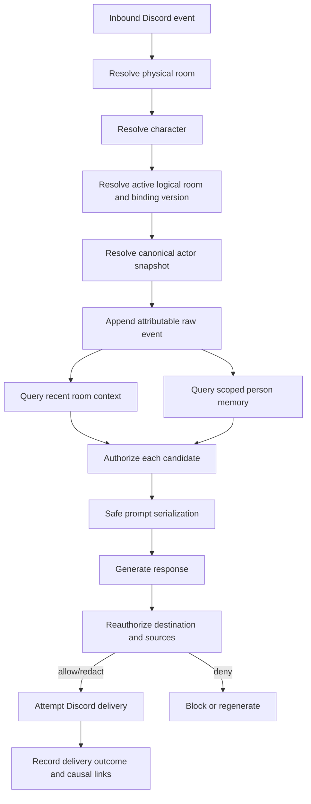
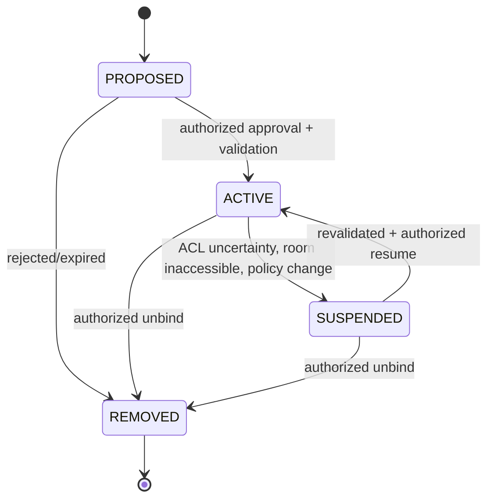

# Room, Scope, and Authorization Specification

**Artifact filename:** `06-room-scope-authorization-spec.md`  
**Project:** DC_BOT shared-memory program  
**Status:** Normative design specification; coding is not authorized by this artifact alone  
**Authoring role:** Conversation-scope and authorization architect  
**Prepared:** 2026-08-01 (America/Los_Angeles)  
**Normative keywords:** **MUST**, **MUST NOT**, **SHOULD**, **SHOULD NOT**, and **MAY** are to be interpreted as requirement levels.

---

## 1. Title and artifact filename

**Title:** Room, Scope, and Authorization Specification  
**Artifact filename:** `06-room-scope-authorization-spec.md`

This document is the normative conversation-scope and authorization specification for the DC_BOT shared-memory program.

**Classification convention:** Statements explicitly labeled **Confirmed repository fact**, **Source-plan requirement**, **External research finding**, **Inference**, **Recommendation**, or **Open question** retain that classification. Unless a narrower classification is stated, every normative **MUST/SHALL/SHOULD/MAY** requirement and ADR in Sections 7–19 is a **Recommendation** for this program, not a claim that the repository already implements it.

## 2. Executive conclusion

**[Recommendation]** DC_BOT SHALL treat a Discord channel, thread, voice channel, or DM as a **physical room**, and SHALL treat cross-media continuity as a property of an explicitly managed **logical room**. Recent conversational history may cross text and voice only when both physical rooms are attached to the same active logical room, the same character namespace is selected, and the authorization check proves that delivery will not widen the audience of any source content.

**[Recommendation]** A room binding is structurally symmetric: attached physical rooms participate in one logical room rather than forming directional pairwise links. Authorization remains directional at retrieval and delivery time. Therefore, an apparently symmetric binding can produce asymmetric effective data flow when one destination has a broader audience than another.

**[Recommendation]** Person memory and room history are independent axes. A person's authorized, scoped preference may follow that person between text and voice without copying either room's recent transcript. Conversely, a room binding may share ordinary room context without making any participant's private or person-scoped memory available to others.

**[Recommendation]** Discord user ID is the durable Discord external-identity key. It SHALL NOT be treated as proof of a cross-platform human identity. Display names, usernames, guild nicknames, aliases, avatars, and voice features are mutable presentation attributes.

**[Recommendation]** Private information is non-transitive. A DM fact is private by default; guild operator policy cannot promote it. Promotion requires an explicit action by the subject that names the fact or preference, destination scope, character applicability, and optional expiration. Operator policy may narrow an allowed use but may never broaden person consent.

**[Recommendation]** The first implementation milestone SHOULD be an in-process authorization/domain layer behind a transport-neutral port and a transactional database. Nothing found in the current repository topology proves that a mandatory standalone memory HTTP service is required.

**[Confirmed repository fact]** DC_BOT currently has conflicting scope implementations. Direct text uses separate room identifiers for guild text channels, threads, and DMs, while the active voice conversation controller obtains history from a guild-keyed session and projects it through a synthetic guild-level voice room. The repository also contains room types that say separate channels in one guild must not share, but the active voice history remains guild-scoped. Sources: [`room-id.ts`](https://github.com/starryark/DC_BOT/blob/0ea3cbf5ec92f719e2b48066c3ada45aa50122ad/airi/services/discord-bot/src/orchestration/room-id.ts), [`mention-responder.ts`](https://github.com/starryark/DC_BOT/blob/0ea3cbf5ec92f719e2b48066c3ada45aa50122ad/airi/services/discord-bot/src/orchestration/mention-responder.ts), [`guild-session.ts`](https://github.com/starryark/DC_BOT/blob/0ea3cbf5ec92f719e2b48066c3ada45aa50122ad/airi/services/discord-bot/src/orchestration/guild-session.ts), and [`conversation-state.ts`](https://github.com/starryark/DC_BOT/blob/0ea3cbf5ec92f719e2b48066c3ada45aa50122ad/airi/services/discord-bot/src/orchestration/conversation-state.ts).

**Release-blocking conclusion:** No broad production retention or cross-room retrieval SHALL ship until the authorization function, audience checks, binding lifecycle, consent records, deletion behavior, audit events, and leakage tests in this document are implemented and passing.

---

## 3. Scope

### 3.1 In scope

This specification defines:

1. Canonical identifiers for characters, Discord people/external identities, guilds, text channels, threads, voice channels, DMs, physical rooms, logical rooms, conversations, and runtime sessions.
2. Scope semantics for room history, person memory, guild memory, private memory, character memory, and cross-media use.
3. Explicit physical-room-to-logical-room bindings.
4. Binding creation, inspection, update, deletion, lifecycle, audit, and concurrency behavior.
5. Authorization inputs and decisions for:
   - requesting actor;
   - subject person;
   - source scope;
   - destination context;
   - character;
   - medium;
   - current participant presence;
   - sensitivity.
6. Rules for joins, leaves, renamed/deleted/archived/recreated channels, threads, DMs, multiple characters, and operator policy.
7. Formal authorization rules, matrix rows, test vectors, failure modes, and acceptance criteria.

### 3.2 Out of scope

This artifact does not choose a vector database, embedding model, graph database, summarization model, final database product, HTTP deployment topology, or Discord command syntax. It does not define the full event schema, delivery ledger, retention schedule, identity-linking protocol, extraction policy, or deletion implementation; it states the dependencies those artifacts must satisfy.

### 3.3 Source-plan requirements incorporated

**[Source-plan requirement]** The supplied program baseline requires physical Discord rooms and logical conversation rooms to be distinct, requires explicit/configured bindings before recent room history crosses channels, permits person-level memory to cross text and voice when scope allows, requires DM/guild/person/character isolation, and treats privacy, attribution, delivery correctness, and deletion as release-blocking.

---

## 4. Sources inspected

### 4.1 Repository snapshots

| Repository | Inspected branch | HEAD observed at inspection | Notes |
|---|---|---:|---|
| DC_BOT | `main` | [`0ea3cbf5ec92f719e2b48066c3ada45aa50122ad`](https://github.com/starryark/DC_BOT/commit/0ea3cbf5ec92f719e2b48066c3ada45aa50122ad) | Primary implementation evidence. |
| Airi | `main` | [`4d6e61f77dc99ec76c7cf352df62abb4282386c5`](https://github.com/moeru-ai/airi/commit/4d6e61f77dc99ec76c7cf352df62abb4282386c5) | Comparison baseline; distinguish code from roadmap/issues. |
| AstrBot | `master` | [`49095d3ba3fca9272a67aa5eeab2f6c0719c5091`](https://github.com/AstrBotDevs/AstrBot/commit/49095d3ba3fca9272a67aa5eeab2f6c0719c5091) | Comparison baseline for persisted sessions/conversations. |

The commit SHAs above are the branch heads observed during this inspection. File links below are pinned to those SHAs where practical.

### 4.2 DC_BOT files inspected

- [`airi/services/discord-bot/src/orchestration/room-id.ts`](https://github.com/starryark/DC_BOT/blob/0ea3cbf5ec92f719e2b48066c3ada45aa50122ad/airi/services/discord-bot/src/orchestration/room-id.ts) — `textRoom`, `threadRoom`, `voiceRoom`.
- [`airi/services/discord-bot/src/orchestration/room.ts`](https://github.com/starryark/DC_BOT/blob/0ea3cbf5ec92f719e2b48066c3ada45aa50122ad/airi/services/discord-bot/src/orchestration/room.ts) — `ConversationRoom`, `InMemoryRoomStore`.
- [`airi/services/discord-bot/src/orchestration/guild-session.ts`](https://github.com/starryark/DC_BOT/blob/0ea3cbf5ec92f719e2b48066c3ada45aa50122ad/airi/services/discord-bot/src/orchestration/guild-session.ts) — guild-keyed legacy history and `asRoom`.
- [`airi/services/discord-bot/src/orchestration/conversation-state.ts`](https://github.com/starryark/DC_BOT/blob/0ea3cbf5ec92f719e2b48066c3ada45aa50122ad/airi/services/discord-bot/src/orchestration/conversation-state.ts) — `GuildConversationSession` and registry.
- [`airi/services/discord-bot/src/orchestration/conversation-controller.ts`](https://github.com/starryark/DC_BOT/blob/0ea3cbf5ec92f719e2b48066c3ada45aa50122ad/airi/services/discord-bot/src/orchestration/conversation-controller.ts) — voice admission, prompt compilation, group-turn aggregation, commit after playback.
- [`airi/services/discord-bot/src/orchestration/mention-responder.ts`](https://github.com/starryark/DC_BOT/blob/0ea3cbf5ec92f719e2b48066c3ada45aa50122ad/airi/services/discord-bot/src/orchestration/mention-responder.ts) — direct text room resolution and per-room queue.
- [`airi/services/discord-bot/src/orchestration/events.ts`](https://github.com/starryark/DC_BOT/blob/0ea3cbf5ec92f719e2b48066c3ada45aa50122ad/airi/services/discord-bot/src/orchestration/events.ts) — normalized actor/event fields.
- [`airi/services/discord-bot/src/adapters/airi-adapter.ts`](https://github.com/starryark/DC_BOT/blob/0ea3cbf5ec92f719e2b48066c3ada45aa50122ad/airi/services/discord-bot/src/adapters/airi-adapter.ts) — Discord gateway intents and message actor metadata.
- [`airi/services/discord-bot/src/voice/voice-manager.ts`](https://github.com/starryark/DC_BOT/blob/0ea3cbf5ec92f719e2b48066c3ada45aa50122ad/airi/services/discord-bot/src/voice/voice-manager.ts) — per-user voice transport capture and guild-keyed voice session.
- [`airi/services/discord-bot/src/index.ts`](https://github.com/starryark/DC_BOT/blob/0ea3cbf5ec92f719e2b48066c3ada45aa50122ad/airi/services/discord-bot/src/index.ts) — separate construction of text and voice orchestration paths.

### 4.3 Airi comparison sources

- [`packages/memory-pgvector/src/index.ts`](https://github.com/moeru-ai/airi/blob/4d6e61f77dc99ec76c7cf352df62abb4282386c5/packages/memory-pgvector/src/index.ts).
- [`packages/memory-pgvector/package.json`](https://github.com/moeru-ai/airi/blob/4d6e61f77dc99ec76c7cf352df62abb4282386c5/packages/memory-pgvector/package.json).
- [Issue #879, “Implement Alaya memory layer…”](https://github.com/moeru-ai/airi/issues/879) — proposal/issue evidence only.
- [`README.md`](https://github.com/moeru-ai/airi/blob/4d6e61f77dc99ec76c7cf352df62abb4282386c5/README.md) — documentation claims and architecture diagram only.

### 4.4 AstrBot comparison sources

- [`astrbot/core/conversation_mgr.py`](https://github.com/AstrBotDevs/AstrBot/blob/49095d3ba3fca9272a67aa5eeab2f6c0719c5091/astrbot/core/conversation_mgr.py) — sessions, current conversation selection, conversation persistence, update and append behavior.
- [`astrbot/core/db/po.py`](https://github.com/AstrBotDevs/AstrBot/blob/49095d3ba3fca9272a67aa5eeab2f6c0719c5091/astrbot/core/db/po.py) — conversation persistence objects.
- [AstrBot developer guide: AI](https://docs.astrbot.app/en/dev/star/guides/ai.html) — current session/provider APIs.
- [AstrBot repository README](https://github.com/AstrBotDevs/AstrBot/blob/49095d3ba3fca9272a67aa5eeab2f6c0719c5091/README.md) — product claims such as automatic context compression.

### 4.5 Discord primary documentation

- [API Reference — Snowflakes](https://docs.discord.com/developers/reference).
- [Permissions](https://docs.discord.com/developers/topics/permissions).
- [Server and Channel Management](https://docs.discord.com/developers/platform/server-and-channel-management).
- [Threads](https://docs.discord.com/developers/topics/threads).
- [Channels Resource](https://docs.discord.com/developers/resources/channel).
- [Gateway and privileged intents](https://docs.discord.com/developers/events/gateway).

---

## 5. Evidence table

| ID | Claim | Classification | Source URL | Confidence |
|---|---|---|---|---|
| EVID-001 | DC_BOT defines deterministic guild text, thread, and voice room IDs and says unbound channels are isolated; explicit bindings are described as a future extension. | Confirmed repository fact | [`room-id.ts`](https://github.com/starryark/DC_BOT/blob/0ea3cbf5ec92f719e2b48066c3ada45aa50122ad/airi/services/discord-bot/src/orchestration/room-id.ts) | High |
| EVID-002 | DC_BOT's room model says recent room context is not long-term memory and separate channels in one guild must not share recent turns. | Confirmed repository fact | [`room.ts`](https://github.com/starryark/DC_BOT/blob/0ea3cbf5ec92f719e2b48066c3ada45aa50122ad/airi/services/discord-bot/src/orchestration/room.ts) | High |
| EVID-003 | The current room store is in-process and bounded; it does not persist to disk. | Confirmed repository fact | [`room.ts`](https://github.com/starryark/DC_BOT/blob/0ea3cbf5ec92f719e2b48066c3ada45aa50122ad/airi/services/discord-bot/src/orchestration/room.ts), `InMemoryRoomStore` | High |
| EVID-004 | The active voice history implementation is keyed by guild and projects a synthetic voice room based on the guild ID rather than the actual voice-channel ID. | Confirmed repository fact | [`guild-session.ts`](https://github.com/starryark/DC_BOT/blob/0ea3cbf5ec92f719e2b48066c3ada45aa50122ad/airi/services/discord-bot/src/orchestration/guild-session.ts), `GuildSession.asRoom` | High |
| EVID-005 | The voice state registry creates one `GuildConversationSession` per guild. | Confirmed repository fact | [`conversation-state.ts`](https://github.com/starryark/DC_BOT/blob/0ea3cbf5ec92f719e2b48066c3ada45aa50122ad/airi/services/discord-bot/src/orchestration/conversation-state.ts) | High |
| EVID-006 | Direct text resolves DMs, guild threads, and guild text channels to distinct room IDs and uses a per-room queue/store. | Confirmed repository fact | [`mention-responder.ts`](https://github.com/starryark/DC_BOT/blob/0ea3cbf5ec92f719e2b48066c3ada45aa50122ad/airi/services/discord-bot/src/orchestration/mention-responder.ts), `resolveRoomId` | High |
| EVID-007 | The current DM room key is based on the Discord user ID rather than the DM channel ID. | Confirmed repository fact | [`mention-responder.ts`](https://github.com/starryark/DC_BOT/blob/0ea3cbf5ec92f719e2b48066c3ada45aa50122ad/airi/services/discord-bot/src/orchestration/mention-responder.ts), `resolveRoomId` | High |
| EVID-008 | Normalized events carry `userId` and one `displayName`, not a complete actor snapshot separating username, global display name, guild nickname, and alias. | Confirmed repository fact | [`events.ts`](https://github.com/starryark/DC_BOT/blob/0ea3cbf5ec92f719e2b48066c3ada45aa50122ad/airi/services/discord-bot/src/orchestration/events.ts) | High |
| EVID-009 | Voice transport capture is attributable per Discord user, but group response aggregation can commit one synthetic “Discord group” speaker and one selected user ID. | Confirmed repository fact | [`voice-manager.ts`](https://github.com/starryark/DC_BOT/blob/0ea3cbf5ec92f719e2b48066c3ada45aa50122ad/airi/services/discord-bot/src/voice/voice-manager.ts); [`conversation-controller.ts`](https://github.com/starryark/DC_BOT/blob/0ea3cbf5ec92f719e2b48066c3ada45aa50122ad/airi/services/discord-bot/src/orchestration/conversation-controller.ts) | High |
| EVID-010 | The direct text and voice controllers are constructed separately and do not use one shared memory authority. | Confirmed repository fact | [`index.ts`](https://github.com/starryark/DC_BOT/blob/0ea3cbf5ec92f719e2b48066c3ada45aa50122ad/airi/services/discord-bot/src/index.ts) | High |
| EVID-011 | DC_BOT requests voice states, direct messages, guild messages, and message content, but the inspected adapter does not request the Guild Members intent. | Confirmed repository fact | [`airi-adapter.ts`](https://github.com/starryark/DC_BOT/blob/0ea3cbf5ec92f719e2b48066c3ada45aa50122ad/airi/services/discord-bot/src/adapters/airi-adapter.ts) | High |
| EVID-012 | Comprehensive guild member update/profile observation may require Discord's privileged Guild Members intent and operational approval/enablement. | External research finding | [Discord Gateway](https://docs.discord.com/developers/events/gateway) | High |
| EVID-013 | Discord IDs are snowflakes and should be handled as opaque identifier strings rather than mutable names. | External research finding | [Discord API Reference](https://docs.discord.com/developers/reference) | High |
| EVID-014 | Discord supports guild permissions plus per-channel overwrites; `VIEW_CHANNEL` governs viewing text channels and joining voice channels. | External research finding | [Discord Permissions](https://docs.discord.com/developers/topics/permissions) | High |
| EVID-015 | Discord threads have their own IDs and a `parent_id`; archival is a thread lifecycle state. | External research finding | [Discord Threads](https://docs.discord.com/developers/topics/threads) | High |
| EVID-016 | Airi's current `memory-pgvector` implementation is a small module shell whose configure handler is empty; it is not evidence of a complete production memory runtime. | Confirmed repository fact | [`packages/memory-pgvector/src/index.ts`](https://github.com/moeru-ai/airi/blob/4d6e61f77dc99ec76c7cf352df62abb4282386c5/packages/memory-pgvector/src/index.ts) | High |
| EVID-017 | Airi Issue #879 is a proposal for an Alaya memory layer and must not be represented as merged behavior. | Confirmed repository fact | [Airi Issue #879](https://github.com/moeru-ai/airi/issues/879) | High |
| EVID-018 | AstrBot distinguishes a session key (`unified_msg_origin`) from conversations, allows several conversations per session, and persists the selected conversation ID. | Confirmed repository fact | [`conversation_mgr.py`](https://github.com/AstrBotDevs/AstrBot/blob/49095d3ba3fca9272a67aa5eeab2f6c0719c5091/astrbot/core/conversation_mgr.py), `ConversationManager` | High |
| EVID-019 | AstrBot persists conversation content as a mutable list and its message-pair helper reads, appends, and writes the conversation content. | Confirmed repository fact | [`conversation_mgr.py`](https://github.com/AstrBotDevs/AstrBot/blob/49095d3ba3fca9272a67aa5eeab2f6c0719c5091/astrbot/core/conversation_mgr.py), `update_conversation`, `add_message_pair` | High |
| EVID-020 | AstrBot is useful evidence for persisted conversation selection and compression product behavior, but its mutable whole-content update is not proof of safe concurrent append semantics. | Inference | EVID-018 and EVID-019 | Medium-high |
| EVID-021 | Recent room history may cross physical channels only through explicit/configured bindings. | Source-plan requirement | Supplied room/scope/authorization assignment | High |
| EVID-022 | Person-level memory may cross media when authorized without copying a room transcript. | Source-plan requirement | Supplied room/scope/authorization assignment | High |
| EVID-023 | Discord user ID is the durable Discord identity key; names and aliases are attributes. | Source-plan requirement | Supplied room/scope/authorization assignment | High |
| EVID-024 | DM/guild/person/character isolation, consent, deletion, and privacy leakage are release-blocking. | Source-plan requirement | Supplied room/scope/authorization assignment | High |

---

## 6. Current-state findings

### 6.1 Scope authority is fragmented

**[Confirmed repository fact]** The direct text path owns an `InMemoryRoomStore`, resolves a room itself, and serializes per-room work. The active voice path owns a guild registry and guild session history. These are independent authorities. See [`mention-responder.ts`](https://github.com/starryark/DC_BOT/blob/0ea3cbf5ec92f719e2b48066c3ada45aa50122ad/airi/services/discord-bot/src/orchestration/mention-responder.ts), [`conversation-state.ts`](https://github.com/starryark/DC_BOT/blob/0ea3cbf5ec92f719e2b48066c3ada45aa50122ad/airi/services/discord-bot/src/orchestration/conversation-state.ts), and [`index.ts`](https://github.com/starryark/DC_BOT/blob/0ea3cbf5ec92f719e2b48066c3ada45aa50122ad/airi/services/discord-bot/src/index.ts).

**[Inference]** Cross-media continuity cannot be made reliable by changing prompt construction alone. Both media paths must resolve through the same authoritative scope and conversation APIs.

### 6.2 Existing room identifiers are directionally correct but incomplete

**[Confirmed repository fact]** Guild text, thread, and voice IDs include guild/channel coordinates. Threads are intentionally isolated from parents. This is a sound default. The DM path, however, keys a room with the user ID, not the Discord DM channel ID.

**[Recommendation]** Preserve the isolation intent, but separate immutable internal IDs from external Discord locators. Model a DM by channel ID and model participants separately. Do not assume every private Discord interaction is permanently one-to-one or that a user ID alone names a conversation container.

### 6.3 Voice history is too broad

**[Confirmed repository fact]** Voice capture knows the actual voice channel and each speaker, but the conversation history selected by the active controller is guild-scoped.

**[Risk — RISK-SCOPE-001]** Two concurrent or sequential voice rooms in one guild can observe unrelated recent context if they share a guild session. This violates the repository's own room isolation comments and the source-plan baseline.

### 6.4 Group voice attribution is unsafe for durable memory

**[Confirmed repository fact]** Per-user voice utterances exist at transport level, yet the group-response path can aggregate them into one synthetic speaker label and one user ID.

**[Risk — RISK-SCOPE-002]** A later extractor could assign one participant's statement to another or create a fictional “Discord group” person. No synthetic group label SHALL be a durable author.

### 6.5 Actor snapshots are not rich enough for identity-history requirements

**[Confirmed repository fact]** Normalized events carry `userId` and a single display name. This does not preserve the distinctions among username, global display name, guild nickname, preferred alias, and name displayed at event time.

**[Recommendation]** The event artifact must carry an immutable Discord user ID plus a structured actor snapshot. Current identity materialization and event-time presentation must have different update policies to avoid write amplification.

### 6.6 Channel ACLs are not represented in the memory scope model

**[External research finding]** Discord permissions can differ by channel through permission overwrites, and thread access can differ from parent access. See [Permissions](https://docs.discord.com/developers/topics/permissions) and [Threads](https://docs.discord.com/developers/topics/threads).

**[Inference]** A guild-wide authorization bit is insufficient. A cross-room memory decision must account for source and destination audience, not merely guild equality.

### 6.7 Upstream comparisons do not supply a ready authorization model

**[Confirmed repository fact]** Airi's current pgvector memory package is a shell, while its broader memory work includes proposals. AstrBot has persisted session/conversation selection and content mutation, but the inspected conversation manager does not establish DC_BOT's required room/person/character authorization semantics.

**[Recommendation]** Borrow concepts, not implementations:
- from Airi: modular service boundaries and a possible future runtime;
- from AstrBot: distinct session and conversation identities and operational conversation switching;
- from neither: an assumption that their current storage shape solves audience authorization, Discord room binding, concurrent append, or deletion.

---

## 7. Proposed decisions

### 7.1 Decision register

| ADR | Decision | Classification | Status |
|---|---|---|---|
| ADR-006-001 | Use immutable internal IDs plus typed Discord external locators. | Recommendation | Accepted for this specification |
| ADR-006-002 | Make the logical room the only unit that can carry recent conversation across physical rooms. | Recommendation | Accepted |
| ADR-006-003 | Keep person memory independent of room bindings. | Recommendation | Accepted |
| ADR-006-004 | Bind physical rooms by membership in one logical room, not pairwise edges. | Recommendation | Accepted |
| ADR-006-005 | Make bindings structurally symmetric but authorize every retrieval/delivery directionally. | Recommendation | Accepted |
| ADR-006-006 | Default threads to independent logical rooms; no parent inheritance without explicit binding/policy. | Recommendation | Accepted |
| ADR-006-007 | Default DMs and DM-derived facts to private scope; require subject-driven promotion. | Recommendation | Accepted |
| ADR-006-008 | Apply guild-scoped preferences across guild channels only when explicitly stored at guild scope and still allowed by channel/operator policy. | Recommendation | Accepted |
| ADR-006-009 | Treat character namespaces as isolated for conversations, summaries, aliases, and learned memories. | Recommendation | Accepted |
| ADR-006-010 | Use audience non-expansion as the core cross-room disclosure rule. | Recommendation | Accepted |
| ADR-006-011 | Presence is an authorization input, never a grant of ownership or access to another person's memory. | Recommendation | Accepted |
| ADR-006-012 | Stamp events with logical-room and binding versions at ingestion; reauthorize before delivery. | Recommendation | Accepted |
| ADR-006-013 | Operator policy may narrow consent but cannot broaden it. | Recommendation | Accepted |
| ADR-006-014 | Start in process behind `MemoryPort`/`AuthorizationPort`; do not require an HTTP microservice for milestone one. | Recommendation | Accepted |
| ADR-006-015 | Removal of a binding is prospective for new events and immediate for cross-room retrieval; in-flight output must be reauthorized. | Recommendation | Accepted |

### 7.2 Direct answers to the 17 assigned questions

| # | Question | Normative resolution |
|---:|---|---|
| 1 | Which exact recent conversation may cross text and voice? | Only the active `conversation_id` for the same `logical_room_id` and `character_id`, through bindings active for the relevant events and request, after source-to-destination audience authorization. |
| 2 | Which person memories may cross media without sharing room history? | Memories whose subject is the same resolved Discord person, whose scope includes the destination, whose character applicability matches, whose sensitivity permits the destination, and whose consent/policy requirements are satisfied. |
| 3 | Do guild-scoped preferences apply in every guild channel? | They are eligible in every channel of that guild, but retrieval still obeys channel policy, character, sensitivity, subject presence, and audience rules. “Guild-scoped” is not “always inject.” |
| 4 | What does an explicit room binding share? | Logical-room membership, active conversation selection, eligible recent room events, eligible room summaries, and room-scoped procedural settings, prospectively from an effective boundary unless a separately authorized import is performed. |
| 5 | What does a binding never share? | Discord ACLs, membership, private/DM facts, person memory consent, unrelated characters, unrelated conversations, operator secrets, credentials, hidden channels, deleted content, or a right to widen the audience. |
| 6 | Who may create/inspect/update/delete a binding? | A configured bot operator who also has required Discord management/access permissions for every affected room. Ordinary users may inspect a redacted status for their current room. No operator may use binding management to override person consent. |
| 7 | Are bindings symmetric? | Structurally yes: rooms attach to one logical room. Effective information flow can be asymmetric because authorization is evaluated for each destination and its audience. |
| 8 | How are renamed/deleted/archived/recreated channels handled? | Rename updates presentation only. Delete tombstones the physical room and disables its membership. Archive makes a thread non-writable while preserving authorized history. Recreated same-name channels get new identities and are never auto-rebound. |
| 9 | Do threads inherit parent context? | No by default. A thread has an independent physical and logical room. Explicit binding may share context only after ACL/audience validation. |
| 10 | Can late voice joiners retrieve prior room context? | They may receive eligible ordinary room context if currently authorized for every source represented in the response. Joining does not grant access to restricted source channels or person memory. |
| 11 | Does participant presence change access to another person's memory? | Presence may be a necessary disclosure condition but is never sufficient. It does not grant access. |
| 12 | How does leaving affect future retrieval? | The departed person is removed from the delivery audience and is no longer eligible for presence-dependent person-memory retrieval. Their retained room events remain subject to room retention and disclosure rules. |
| 13 | How do DM facts remain private? | DM events and derived memories default to private-conversation scope and are denied in guild destinations absent a valid subject promotion record. |
| 14 | How is a private preference promoted? | Through an explicit, authenticated promotion action naming the item, target scope, character applicability, sensitivity acknowledgment, and optional expiry; never through model inference. |
| 15 | How are multiple characters isolated? | Every conversation, room summary, alias preference, person memory, and retrieval request includes `character_id`. Cross-character reuse requires a separately consented platform-level item; episodic/room history never crosses. |
| 16 | Are room memories visible to users absent when created? | Ordinary room-scoped memories may be used for users who currently have access to the room; attendance is not the default ACL. Sensitive or participant-confidential content requires stronger rules and may be redacted or denied. |
| 17 | How does guild operator policy interact with person consent? | Effective authorization is the intersection of platform permissions, room policy, operator policy, subject consent, and sensitivity rules. Operator policy can deny or narrow; it cannot grant beyond consent. |

---

## 8. Alternatives considered

### 8.1 One logical room per guild

**[Alternative]** Treat the guild as one conversation room.

**Advantages:** simple keys; matches current voice registry.

**Disadvantages:** leaks context across unrelated channels and voice rooms; ignores per-channel permission overwrites; conflicts with existing room comments and source-plan requirements.

### 8.2 One logical room per physical room with no bindings

**[Alternative]** Preserve strict isolation and never permit cross-media recent context.

**Advantages:** safest simple model; easy authorization.

**Disadvantages:** cannot support explicitly desired text/voice continuity; users would need to repeat context; person memory alone is insufficient for recent conversational continuity.

### 8.3 Directional pairwise bindings

**[Alternative]** Store `source_room -> destination_room` edges.

**Advantages:** direct expression of one-way sharing.

**Disadvantages:** transitive behavior becomes difficult to reason about; cycles and partial updates create ambiguity; conversation identity can fork; deletion and inspection become error-prone.

### 8.4 Copy history between rooms

**[Alternative]** On binding or retrieval, copy recent events into the destination room.

**Advantages:** simple local reads after copying.

**Disadvantages:** duplicate provenance, deletion fan-out, correction divergence, retention ambiguity, and higher leakage risk.

### 8.5 Presence-gated ownership model

**[Alternative]** Anyone currently present in a voice room can access all memories associated with other present people.

**Advantages:** conversationally rich.

**Disadvantages:** presence is not consent; it creates immediate person-to-person leakage.

### 8.6 Mandatory standalone Memory Runtime now

**[Alternative]** Implement the first milestone as an HTTP microservice.

**Advantages:** process independence and a clear deployment boundary.

**Disadvantages:** adds network failure, authentication, deployment, and latency without verified need in the current topology. It does not itself solve authorization.

### 8.7 Parent-inherited thread history by default

**[Alternative]** Every thread starts with parent-channel recent context.

**Advantages:** often convenient in public support/discussion channels.

**Disadvantages:** private-thread and audience mismatches; surprising context; potential leakage from broader or differently permissioned history.

---

## 9. Rejected alternatives and reasons

| Alternative | Outcome | Reason |
|---|---|---|
| Guild as conversation room | Rejected | Fails channel isolation and Discord ACL semantics. |
| No bindings ever | Rejected | Fails required explicit cross-media continuity. |
| Pairwise directional graph | Rejected for milestone one | Increases transitive and lifecycle complexity. A logical-room membership model is easier to authorize and audit. |
| Transcript copying | Rejected | Breaks provenance/deletion consistency and creates duplicate truth. |
| Presence grants person-memory access | Rejected | Violates consent and person isolation. |
| Automatic DM-to-guild promotion | Rejected | Private scope is non-transitive. |
| Automatic thread-parent inheritance | Rejected | Audience and context expectations differ. |
| Automatic rebind by channel name | Rejected | Names are mutable and non-unique; recreated channels have new Discord IDs. |
| One conversation shared by all characters | Rejected | Violates persona/character isolation and makes corrections/deletion ambiguous. |
| Operator override of person consent | Rejected | Guild administration is not ownership of a person's private memory. |
| Mandatory HTTP service in milestone one | Rejected pending evidence | The current topology does not establish a deployment requirement. |
| Treat Airi proposals as implemented | Rejected | The inspected package is a shell and the Alaya work is an issue/proposal. |
| Adopt mutable whole-history writes as the DC_BOT event model | Rejected | Does not meet append attribution, multi-speaker causality, or concurrency requirements. |

---

## 10. Normative specification

### 10.1 Core principles

**REQ-SCOPE-001 — Explicit authority.** Every read, write, summarize, retrieve, promote, bind, unbind, export, or delete operation MUST pass through one authoritative scope and authorization layer.

**REQ-SCOPE-002 — No media-owned memory.** Text and voice adapters MUST NOT own independent durable histories. They MAY hold bounded transport caches that are not represented as durable memory and cannot silently substitute for failed durable writes.

**REQ-SCOPE-003 — Physical/logical separation.** A physical Discord room identifies where an event occurred. A logical room identifies the authorized conversational continuity domain. The two concepts MUST NOT be conflated.

**REQ-SCOPE-004 — No implicit cross-room history.** In the absence of an active binding, a physical room MUST resolve to a logical room that does not contain another physical room.

**REQ-SCOPE-005 — Person/room orthogonality.** Person memory eligibility MUST be evaluated independently from logical-room membership. A room binding MUST NOT imply person-memory consent.

**REQ-SCOPE-006 — Audience non-expansion.** A source item may be used in a destination only if the destination's effective audience is no broader than the audience authorized for that item, or if an explicit, auditable promotion/disclosure record authorizes the broader destination.

**REQ-SCOPE-007 — Character isolation.** All learned conversational memory, summaries, conversations, aliases, and retrievals MUST be namespaced by `character_id`, except a narrowly defined user-controlled platform profile that has explicit cross-character consent.

**REQ-SCOPE-008 — Reauthorization.** Authorization MUST occur before retrieval and again before delivery when participant presence, channel permissions, binding version, destination, or sensitivity may have changed.

**REQ-SCOPE-009 — Default deny.** Missing actor identity, unresolved room, missing character, stale binding, unknown destination audience, absent consent, or ambiguous sensitivity MUST default to DENY or REDACT, never ALLOW.

**REQ-SCOPE-010 — Provenance.** Every retrieved item MUST retain its source event/memory ID, source scope, subject, author, character, sensitivity, consent basis, and temporal validity through prompt construction and audit.

### 10.2 Canonical identifier model

All Discord snowflakes MUST be stored as strings. Internal identifiers SHOULD use UUIDv7 or another sortable, collision-resistant, non-semantic identifier. Prefixes below are serialization conventions; database columns SHALL use typed fields rather than parsing authorization from a string.

#### 10.2.1 Character

- Internal canonical ID: `char_<uuidv7>`
- Required external/config attributes:
  - `character_key` — operator-facing stable key, unique within deployment;
  - `card_source` and `card_version`;
  - `display_name`.
- `character_key`, file path, card filename, and display name MUST NOT be the primary key.
- Replacing a character card MAY increment its version without changing `character_id`.
- A deliberately new persona identity MUST receive a new `character_id`.

**REQ-ID-001.** Every conversation, summary, memory item, alias preference, and authorization request MUST include `character_id`.

#### 10.2.2 Discord person/external identity

- Internal person ID: `person_<uuidv7>`
- External identity key: `ext:discord:user:<discord_user_id>`
- Unique constraint: `(platform = 'discord', external_type = 'user', external_id)`

The external identity maps to one internal person record for Discord purposes. It does not prove that a Telegram, web, or other account is the same human.

Presentation attributes are versioned observations:
- username;
- global display name;
- guild nickname;
- avatar hash/URL reference;
- observed voice presentation attributes, if policy permits;
- event-time displayed name;
- preferred alias plus scope.

**REQ-ID-002.** Two users with the same display name or alias MUST remain distinct by internal/external identity.

**REQ-ID-003.** Prompt-local person references MUST be opaque and non-user-visible, for example `p01`, `p02`. The model MUST be instructed never to print or speak them.

#### 10.2.3 Guild

- External locator: `ext:discord:guild:<guild_id>`
- Internal ID: `guild_<uuidv7>`
- Unique constraint on Discord guild ID.

Guild name and icon are attributes. Leaving and later rejoining the same Discord guild may reactivate the same tombstoned record subject to retention policy.

#### 10.2.4 Guild text channel

- External locator: `ext:discord:guild:<guild_id>:text:<channel_id>`
- Internal physical-room ID: `proom_<uuidv7>`
- Channel type MUST be stored and validated as a guild text-capable type.

#### 10.2.5 Thread

- External locator: `ext:discord:guild:<guild_id>:thread:<thread_id>`
- Internal physical-room ID: `proom_<uuidv7>`
- Attributes include `parent_channel_id`, thread type, archived/locked state, and permission/audience fingerprint.

A thread's parent is metadata, not implicit context inheritance.

#### 10.2.6 Voice channel

- External locator: `ext:discord:guild:<guild_id>:voice:<channel_id>`
- Internal physical-room ID: `proom_<uuidv7>`
- Stage channels, if supported later, MUST use a distinct typed locator.

#### 10.2.7 Direct message

- External locator: `ext:discord:dm:<channel_id>`
- Internal physical-room ID: `proom_<uuidv7>`
- Participants are a separate relation keyed by Discord user IDs.
- A DM MUST NOT be canonically keyed only by one user's ID.

Group DMs are a separate channel form if the bot/platform integration can receive them. The schema MUST not preclude them even if the current bot only handles one-to-one DMs.

#### 10.2.8 Physical room

`physical_room` represents one platform container.

Required fields:

```text
physical_room_id        proom_<uuidv7>
platform                "discord"
external_room_type      guild_text | thread | voice | dm | stage
external_room_id        Discord channel/thread snowflake string
guild_id                nullable internal guild ID
parent_physical_room_id nullable, for thread metadata only
lifecycle_state         active | archived | deleted | inaccessible
display_name_snapshot   nullable
acl_fingerprint         nullable hash/version
created_at
updated_at
deleted_at              nullable
```

Unique constraint: `(platform, external_room_type, external_room_id)`.

**REQ-ID-004.** Rename MUST update display attributes only. It MUST NOT change `physical_room_id`.

**REQ-ID-005.** A new Discord channel with the same name as a deleted channel MUST receive a new `physical_room_id` because its Discord channel ID differs.

#### 10.2.9 Logical room

- Internal ID: `lroom_<uuidv7>`
- A logical room is an authorization and recent-conversation continuity container.
- It is not a Discord object and has no user-facing name requirement.
- It has one privacy domain:
  - `guild:<guild_id>`;
  - `private:dm:<physical_room_id>`;
  - future explicitly verified domain.

Required fields:

```text
logical_room_id         lroom_<uuidv7>
privacy_domain_type     guild | private_dm
privacy_domain_id       internal guild or DM physical-room ID
state                    active | frozen | retired
policy_id                room policy version
binding_version          monotonically increasing integer
created_by_actor_id
created_at
retired_at               nullable
```

**REQ-ID-006.** A logical room MUST NOT contain physical rooms from different guilds.

**REQ-ID-007.** A private DM physical room MUST NOT share a logical room with a guild physical room.

#### 10.2.10 Conversation

- Internal ID: `conv_<uuidv7>`
- A conversation is a character-scoped, ordered narrative state within one logical room.
- A logical room MAY have multiple conversations over time (reset, fork, operator-selected switch).
- At most one active conversation per `(logical_room_id, character_id)` is selected unless an explicit fork UI is in use.

Required fields:

```text
conversation_id         conv_<uuidv7>
logical_room_id         lroom_<uuidv7>
character_id            char_<uuidv7>
state                    active | closed | superseded | deleted
started_at
closed_at                nullable
parent_conversation_id   nullable
selection_version        integer
```

**REQ-ID-008.** A conversation MUST NOT span logical rooms.

**REQ-ID-009.** A conversation MUST NOT contain events from multiple characters.

#### 10.2.11 Runtime session

- Internal ID: `sess_<uuidv7>`
- A runtime session is an ephemeral execution/transport lease, not a memory or authorization scope.
- Examples:
  - one Discord voice connection;
  - one text worker lease;
  - one generation attempt;
  - one process-level controller lifetime.

Required fields:

```text
runtime_session_id       sess_<uuidv7>
session_type             voice_connection | text_worker | generation
physical_room_id
logical_room_id
conversation_id
character_id
binding_version_seen
started_at
ended_at                  nullable
process_instance_id
```

**REQ-ID-010.** Restarting a runtime session MUST NOT create a new conversation unless an explicit conversation transition occurs.

**REQ-ID-011.** Runtime-session presence MUST NOT be used as proof of durable authorization.

### 10.3 Scope taxonomy

Each memory/event projection MUST have exactly one primary scope and MAY have additional eligibility constraints.

| Scope code | Meaning | Default destination eligibility |
|---|---|---|
| `PRIVATE_CONVERSATION` | One DM/logical private room | Same private room only |
| `PHYSICAL_ROOM` | One Discord channel/thread/voice room | Same physical room only |
| `LOGICAL_ROOM` | Bound-room shared context | Physical rooms in same active logical room, subject to audience checks |
| `PERSON_GUILD_CHARACTER` | One person, one guild, one character | Contexts in that guild for that character, subject to presence/sensitivity |
| `GUILD_CHARACTER` | Guild-level procedural or shared fact for one character | Guild contexts, subject to channel policy |
| `PERSON_CHARACTER` | One person across Discord contexts for one character | Eligible contexts where subject consent and privacy permit |
| `PERSON_PLATFORM` | One person's explicitly promoted Discord-wide preference | Discord contexts permitted by promotion; never inferred |
| `CHARACTER_GLOBAL` | Operator-authored character procedure, not a user fact | All contexts for that character, after policy |
| `OPERATOR_PRIVATE` | Operator secret/configuration | Never sent to model or user-facing output unless a separate secure tool requires it |

**REQ-SCOPE-011.** Raw DM events MUST default to `PRIVATE_CONVERSATION`.

**REQ-SCOPE-012.** Learned facts derived solely from a DM MUST inherit `PRIVATE_CONVERSATION` unless the subject explicitly promotes them.

**REQ-SCOPE-013.** A room binding changes eligibility of `LOGICAL_ROOM` context. It does not rewrite `PRIVATE_CONVERSATION`, `PERSON_*`, or `OPERATOR_PRIVATE` scopes.

**REQ-SCOPE-014.** Scope promotion MUST create a new version/authorization record; it MUST NOT silently mutate provenance to make the source appear public.

### 10.4 Sensitivity taxonomy

| Level | Code | Examples | Default guild disclosure |
|---:|---|---|---|
| 0 | `PUBLIC_ROOM` | Already public room statements, public guild procedure | Allow if room/audience authorized |
| 1 | `PERSONAL_LOW` | Non-sensitive preference, preferred language, harmless hobby | Allow only within authorized scope; presence may be required |
| 2 | `SENSITIVE` | Health, finance, precise location, relationships, workplace/private schedule | Require explicit destination-specific consent or redact |
| 3 | `HIGHLY_PRIVATE` | Credentials, authentication material, private DM secrets, protected identifiers, intimate data | Deny memory-based disclosure to guild; only a fresh direct user statement may be handled under separate output rules |

**REQ-PRIV-001.** Unknown sensitivity MUST be treated as at least `SENSITIVE`.

**REQ-PRIV-002.** The model MUST NOT lower sensitivity. Only a deterministic policy or authorized human action may do so.

**REQ-PRIV-003.** Binding a room MUST NOT alter sensitivity.

### 10.5 Actor and audience model

An authorization request MUST distinguish:

- `requesting_actor`: the authenticated user or system principal initiating the operation;
- `subject_person`: the person whom a person-memory item describes;
- `event_author`: the person who authored a source event;
- `destination_audience`: all people who may receive the generated output;
- `current_participants`: people currently in a voice destination;
- `potential_text_audience`: users/roles currently able to view the destination text channel;
- `operator_principal`: configured bot operator identity and privileges.

For a shared voice response, the destination audience is the set of current non-bot participants who can hear playback. For a guild text response, the safe audience is the destination channel's authorized viewer class, not merely the requesting actor.

**REQ-PRIV-004.** A shared response MUST be authorized for every effective recipient. The system MUST NOT generate one spoken response containing content authorized for only a subset of listeners.

**REQ-PRIV-005.** A binding MUST NOT grant Discord permissions or be treated as proof that destination users can access source channels.

**REQ-PRIV-006.** Cross-room use is allowed only when one of the following is true:

1. the source audience and destination audience are proven equivalent;
2. the destination audience is a proven subset of the source audience;
3. the source item carries an explicit broader disclosure grant covering the destination.

If audience relation cannot be proven, authorization is DENY or REDACT.

### 10.6 Room binding model

A binding is represented as membership of physical rooms in one logical room.

```text
logical_room_membership
-----------------------
membership_id
logical_room_id
physical_room_id
state                  pending | active | suspended | removed
effective_from
effective_until        nullable
history_mode           prospective | authorized_import
acl_mode               strict_equal | destination_subset
created_by_actor_id
approved_by_actor_id   nullable
binding_version
reason
created_at
removed_at             nullable
```

**REQ-SCOPE-015.** `strict_equal` is the default ACL mode.

**REQ-SCOPE-016.** `destination_subset` MAY be used only when the system can prove the destination audience is no broader than the source audience for the relevant direction.

**REQ-SCOPE-017.** Per-recipient filtering MUST NOT be used for a single shared voice response because all listeners hear the same audio.

**REQ-SCOPE-018.** Adding a physical room to a logical room is prospective by default. It shares eligible events created at or after `effective_from`.

**REQ-SCOPE-019.** Historical import requires a separate, explicit operation that defines a time/event boundary, passes current authorization, writes an audit record, and does not duplicate raw events.

**REQ-SCOPE-020.** A logical room MUST NOT include:
- a DM and a guild room;
- rooms from different guilds;
- rooms whose ACL relation cannot satisfy the configured mode;
- a deleted or inaccessible physical room.

### 10.7 What a binding shares

An active binding MAY make the following eligible across member rooms:

1. The active conversation selection for the same character.
2. Raw attributable events that:
   - are stamped with the logical room;
   - are within the allowed effective boundary;
   - are not deleted/redacted;
   - pass audience and sensitivity authorization.
3. Recent-context projections.
4. Room summaries whose source coverage is fully eligible.
5. Room-scoped procedural settings explicitly marked `LOGICAL_ROOM`.
6. Causal links and delivery outcomes needed to interpret shared conversation state.

**REQ-SCOPE-021.** The system SHALL retrieve shared content from one canonical event/memory record. It SHALL NOT copy the transcript into each physical room.

### 10.8 What a binding never shares

A binding MUST NOT share or grant:

- Discord roles, permissions, membership, or access;
- a private DM event or DM-derived memory;
- person-memory consent;
- another guild's content;
- another character's history or learned memories;
- operator secrets, credentials, tokens, or hidden configuration;
- deleted, erased, superseded, or policy-blocked items;
- the identity of a hidden room to users lacking permission;
- a blanket right to future content if ACLs change;
- attendance records beyond what policy explicitly retains;
- ownership of another person's statements;
- a right to use source content after the binding is removed.

### 10.9 Binding authority

#### 10.9.1 Create

**REQ-SCOPE-022.** A binding creation principal MUST satisfy all of:

1. Is authenticated as a configured bot operator.
2. Has Discord `MANAGE_GUILD` or the deployment's stricter configured permission.
3. Can currently view every affected room.
4. Has `MANAGE_CHANNELS` for non-thread channels or `MANAGE_THREADS` for threads where the deployment requires channel-level proof.
5. Passes deployment allowlist/policy.
6. Does not attempt to bind across guild or private-domain boundaries.
7. Completes an audience compatibility check.

Discord permission names and channel overwrites are documented in [Discord Permissions](https://docs.discord.com/developers/topics/permissions) and [Channels Resource](https://docs.discord.com/developers/resources/channel).

A second approver SHOULD be required for bindings involving private threads, restricted channels, or large audience changes.

#### 10.9.2 Inspect

**REQ-SCOPE-023.**
- Operators may inspect full binding metadata and audit history.
- A normal user may inspect whether their current room is bound and the public labels of other bound rooms only when they can access those rooms.
- Hidden room names/IDs and participant lists MUST be redacted.

#### 10.9.3 Update

Changing ACL mode, history boundary, membership, privacy policy, or character applicability is an update that MUST increment `binding_version` and re-run full authorization.

#### 10.9.4 Delete/remove

Removal requires the same or stronger authority as creation, increments `binding_version`, writes an audit event, and takes effect immediately for new cross-room reads. It does not erase source events; deletion/retention rules are separate.

**REQ-SCOPE-024.** A room operator with access to only one side MUST NOT unilaterally bind a room they cannot inspect or manage.

### 10.10 Binding symmetry

**REQ-SCOPE-025.** The data model SHALL NOT store “A shares to B” as the primary binding. A and B are members of logical room L.

**REQ-SCOPE-026.** Retrieval remains directional:

```text
eligible(source_item, destination_context)
```

The same logical-room membership can authorize A→B while denying B→A if B has a broader audience than A. This is not an asymmetric binding; it is asymmetric disclosure authorization.

### 10.11 Channel lifecycle

#### Rename

- Preserve Discord channel/thread ID and internal physical-room ID.
- Update display metadata.
- Do not invalidate a binding solely because of rename.
- Write an observation/audit event if names are retained.

#### Delete

- Mark `physical_room.lifecycle_state = deleted`.
- Suspend/remove active membership.
- Stop new retrieval and writes.
- Preserve tombstone and deletion metadata according to retention.
- Do not automatically delete the whole logical room if other members remain.
- Trigger deletion/retention workflows for room data.

#### Archive thread

- Mark archived state.
- Disallow new conversational writes unless Discord permits and the thread is reactivated.
- Retain authorized history.
- A bound archived thread may remain a read source only if current permissions and policy permit; default is read-disabled after a configurable grace period.

#### Recreate

- New Discord channel ID means a new external locator and new physical-room ID.
- Never auto-rebind by name, topic, parent, position, or operator guess.
- An operator must explicitly bind the new room.

#### Permission loss/inaccessible state

- Suspend membership immediately when the bot cannot verify source/destination access.
- Default deny cross-room retrieval until revalidated.

### 10.12 Thread and parent behavior

**REQ-SCOPE-027.** A thread does not inherit parent recent context by default.

**REQ-SCOPE-028.** A thread may be explicitly attached to the parent's logical room only when:
- the thread's audience is compatible;
- private-thread membership is handled;
- destination audience non-expansion holds;
- an authorized operator approves.

**REQ-SCOPE-029.** A parent channel MUST NOT automatically retrieve private-thread content.

**REQ-SCOPE-030.** Thread archival, lock state, and membership changes MUST trigger authorization cache invalidation.

### 10.13 Recent conversation crossing text and voice

The exact recent conversation eligible to cross media is:

```text
conversation_id
where conversation.logical_room_id = destination.logical_room_id
  and conversation.character_id = destination.character_id
  and conversation.state = active
  and source_event.logical_room_id = destination.logical_room_id
  and source_event.binding_version is within an authorized membership interval
  and source_event occurred on/after the membership effective boundary
  and authorization(source_event, destination) ∈ {ALLOW, REDACT}
```

**REQ-MEM-001.** Physical medium (`text` or `voice`) is not itself an authorization grant or barrier. Logical room, character, audience, sensitivity, consent, and policy decide.

**REQ-MEM-002.** A person-memory item may cross media independently, but a room transcript MUST NOT be imported merely because the same person is present.

**REQ-MEM-003.** When a text and voice room are bound, voice playback may use eligible text context and text responses may use eligible voice context. Every voice utterance MUST remain a separate attributable event.

**REQ-MEM-004.** A group response may have multiple triggering event IDs. It MUST NOT synthesize a durable user author.

### 10.14 Person memory across media

Person memory retrieval requires:

1. Subject resolved by immutable external identity.
2. Item's scope covers destination.
3. Item's `character_id` matches or item has explicit cross-character applicability.
4. Consent is active.
5. Sensitivity permits the destination.
6. Operator/channel policy does not deny.
7. Presence rule is satisfied where applicable.
8. Retrieval purpose is relevant and proportionate.
9. The destination audience is authorized.
10. Item is temporally valid and not corrected/deleted.

**REQ-MEM-005.** Room binding is neither necessary nor sufficient for person-memory retrieval.

**REQ-MEM-006.** A harmless `PERSON_GUILD_CHARACTER` preference may be used in text and voice rooms in the same guild, even when those rooms are unbound, provided it does not disclose private room history.

**REQ-MEM-007.** Person A's memory MUST NOT be used to answer Person B merely because both are in the same guild or room.

**REQ-MEM-008.** In a multi-user destination, subject presence is required for ordinary personal preferences unless the item was explicitly promoted as public/guild-shared. For sensitive items, presence is still insufficient without explicit disclosure consent.

### 10.15 Guild-scoped preferences

A guild-scoped preference is eligible, not mandatory, in every channel of that guild.

Examples:
- Preferred response language for the subject in Guild G.
- Guild-specific alias for the subject and character.
- Guild-level bot behavior set by an operator.

**REQ-MEM-009.** A preference becomes guild-scoped only through:
- explicit user promotion/choice for personal preferences; or
- authorized operator authorship for guild procedural settings.

**REQ-MEM-010.** A guild-scoped person preference MUST NOT be interpreted as permission to mention it when the subject is absent.

**REQ-MEM-011.** Channel policy may suppress a guild preference (for example, “English-only support channel”). Operator policy can narrow its use.

### 10.16 Private scope and DM-derived facts

**REQ-PRIV-007.** DM raw events, summaries, and learned items default to private scope tied to the DM logical room and character.

**REQ-PRIV-008.** A DM-derived item cannot be retrieved into a guild prompt, even for the same person, unless an explicit promotion record covers that destination scope.

**REQ-PRIV-009.** “The user told me before” is not a valid authorization basis in a guild.

**REQ-PRIV-010.** A model suggestion to promote or disclose is not consent. The user must take a deterministic, authenticated action.

### 10.17 Explicit promotion of a private preference

A promotion command/UI flow MUST show:

- exact item or user-authored restatement;
- current source scope;
- target scope:
  - this guild;
  - all Discord contexts for this character;
  - all characters (strong warning, optional future feature);
- destination audience implication;
- sensitivity classification;
- character applicability;
- expiry or “until revoked”;
- revocation path.

Promotion record:

```text
consent_grant_id
subject_person_id
source_item_id
source_scope
target_scope
character_id or explicit cross-character flag
allowed_media
allowed_destination_ids nullable
sensitivity_at_grant
granted_by_actor_id
granted_at
expires_at nullable
revoked_at nullable
grant_text_hash
```

**REQ-PRIV-011.** Promotion creates a disclosure grant or a new derived item with provenance. It MUST NOT rewrite the original DM event.

**REQ-PRIV-012.** Revocation MUST immediately stop new retrieval and enqueue cache, summary, and derived-index invalidation.

### 10.18 Multiple characters

**REQ-SCOPE-031.** A character switch changes the active conversation namespace.

**REQ-SCOPE-032.** Character A MUST NOT retrieve:
- Character B's recent room turns;
- Character B's room summaries;
- Character B's person aliases;
- Character B's episodic or semantic memories;
- Character B's correction state.

Identity facts needed to resolve the Discord account MAY be shared at the platform identity layer, but presentation and learned preference selection remain character-scoped unless explicitly promoted.

**REQ-SCOPE-033.** A room binding is topology metadata and MAY be reusable by several characters, but each character has a distinct active conversation and summaries. Binding does not merge character histories.

### 10.19 Participant joins late

For a shared voice destination:

1. Update current participant set.
2. Resolve each participant's access to the destination.
3. Recompute the safe source intersection for any bound context.
4. Invalidate prompt/retrieval caches whose audience assumptions changed.
5. Authorize before generation and before playback.

**REQ-PRIV-013.** A late joiner may hear ordinary prior room context only if the context is authorized for that person under source ACL and room policy.

**REQ-PRIV-014.** A late joiner who lacks access to a bound text source causes that source to be excluded from shared voice responses. The bot MUST NOT reveal or hint at hidden source content.

**REQ-PRIV-015.** Joining does not authorize any other participant's person memory.

### 10.20 Participant leaves

**REQ-PRIV-016.** On leave:
- remove the person from destination audience;
- cancel or reauthorize queued output;
- prevent further presence-dependent retrieval about that person;
- preserve their attributable room events only according to retention and room disclosure rules.

A departed person's ordinary statements remain part of the room record; departure is not deletion. However, the bot SHOULD avoid volunteering person-specific details about an absent person unless the item is explicitly room-shared and relevant.

### 10.21 Room memory visibility for absent-at-creation users

Attendance is not the primary ACL for ordinary public/guild room memory.

**REQ-MEM-012.** A user who currently has access to a room may receive ordinary `PUBLIC_ROOM` or authorized `LOGICAL_ROOM` context created before they joined, even if they were absent when created.

**REQ-MEM-013.** Participant-confidential or sensitive memories require an explicit visibility set or consent; current room access alone is insufficient.

**REQ-MEM-014.** For a private thread, current thread membership/access is required; parent-channel access alone is insufficient.

### 10.22 Guild operator policy and person consent

Effective permission is an intersection:

```text
platform permission
∩ deployment policy
∩ guild policy
∩ channel/room policy
∩ subject consent
∩ character scope
∩ sensitivity rule
∩ current audience/presence rule
```

**REQ-PRIV-017.** Operator policy may:
- disable retention;
- prohibit person memory;
- require stricter consent;
- restrict bindings;
- shorten history windows;
- require dual approval;
- force redaction.

**REQ-PRIV-018.** Operator policy may not:
- expose DM-derived facts;
- promote a user's private preference;
- link cross-platform identities;
- disclose another person's sensitive memory;
- override a revocation.

### 10.23 Authorization request and outcome

Canonical input:

```text
AuthorizationRequest {
  operation:
    READ_RAW_EVENT | READ_ROOM_CONTEXT | READ_PERSON_MEMORY |
    WRITE_EVENT | WRITE_MEMORY | PROMOTE | BIND | UNBIND |
    INSPECT_BINDING | DELETE | EXPORT | DELIVER

  requesting_actor_id
  actor_principal_type: USER | OPERATOR | SYSTEM
  subject_person_id?
  source_item_id?
  source_scope
  source_physical_room_id?
  source_logical_room_id?
  destination_context {
    physical_room_id
    logical_room_id
    guild_id?
    privacy_domain
    medium: TEXT | VOICE
    character_id
    effective_audience
    current_participants
  }
  source_character_id
  sensitivity
  consent_grant_ids[]
  binding_version
  policy_versions[]
  request_time
}
```

Outcome:

```text
AuthorizationDecision {
  result: ALLOW | DENY | REDACT | REQUIRE_CONSENT
  reason_codes[]
  allowed_fields[]
  redacted_fields[]
  consent_requirements[]
  policy_version
  binding_version
  expires_at
  audit_id
}
```

### 10.24 Decision precedence

The engine MUST apply precedence in this order:

1. **DENY** for identity/domain/character mismatch, deleted item, revoked consent, cross-guild/private-domain violation, unavailable ACL proof, or prohibited sensitivity.
2. **REQUIRE_CONSENT** when use could be legal/allowed but a required subject grant is absent.
3. **REDACT** when a safe projection can remove unauthorized fields or source details.
4. **ALLOW** only when all mandatory predicates are true.

A REDACT decision MUST specify a deterministic field/content projection. “Ask the model not to mention it” is not redaction.

### 10.25 Formal authorization predicates

Let:

- `A` = requesting actor;
- `S` = subject person;
- `I` = source item;
- `Csrc`, `Cdst` = source/destination characters;
- `Rsrc`, `Rdst` = source/destination physical rooms;
- `Lsrc`, `Ldst` = logical rooms;
- `Aud(I)` = audience authorized for item I;
- `Aud(Rdst)` = effective destination audience;
- `Sens(I)` = sensitivity;
- `Present(S,Rdst)` = subject is present/current requester where required;
- `Consent(S,I,Rdst,Cdst)` = valid grant;
- `Bound(Rsrc,Rdst,t)` = both rooms were active in same logical room for the relevant interval;
- `PolicyAllows(...)` = all platform/deployment/guild/channel policies permit.

For room context:

```text
ALLOW_ROOM(I, Rdst) :=
  not_deleted(I)
  ∧ Csrc = Cdst
  ∧ Lsrc = Ldst
  ∧ Bound(Rsrc, Rdst, event_time(I))
  ∧ binding_active_for_read(now)
  ∧ within_effective_boundary(I)
  ∧ audience_non_expansion(Aud(I), Aud(Rdst))
  ∧ sensitivity_allows_room(Sens(I), Rdst)
  ∧ PolicyAllows(I, Rdst)
```

For person memory:

```text
ALLOW_PERSON(I, S, Rdst) :=
  subject(I) = S
  ∧ identity_resolved(S)
  ∧ character_applies(I, Cdst)
  ∧ scope_covers(scope(I), Rdst)
  ∧ temporal_valid(I)
  ∧ consent_satisfied(I, Rdst)
  ∧ presence_rule_satisfied(I, S, Rdst)
  ∧ audience_non_expansion(Aud(I), Aud(Rdst))
  ∧ sensitivity_allows_person(Sens(I), Rdst)
  ∧ PolicyAllows(I, Rdst)
```

**REQ-PRIV-019.** Logical-room equality is required for room history, not for person memory.

**REQ-PRIV-020.** Subject identity equality is required for person memory; alias equality is never sufficient.

### 10.26 Formal authorization matrix

The matrix below is normative. It expresses representative rows of the required function:

```text
requesting actor
× subject person
× source scope
× destination context
× character
× medium
× current participant presence
× sensitivity
→ ALLOW | DENY | REDACT | REQUIRE_CONSENT
```

Symbols:

- `self` — requesting actor and subject person resolve to the same canonical Discord external identity.
- `other` — requesting actor and subject person differ.
- `same` / `different` — exact canonical identifier equality or inequality.
- `present` — the relevant subject is in the current destination audience at authorization time.
- `absent` — the subject is not in the current destination audience.
- `ordinary` — `S0_ORDINARY`.
- `personal` — `S1_PERSONAL`.
- `sensitive` — `S2_SENSITIVE`.
- `restricted` — `S3_RESTRICTED`.
- “Room context” always means attributable events or derived room memory; it never silently means person memory.

| Matrix ID | Requesting actor | Subject | Source scope | Destination context | Character | Medium | Presence | Sensitivity | Decision | Normative reason |
|---|---|---|---|---|---|---|---|---|---|---|
| AUTH-001 | User | self | Same physical room | Same physical room | same | text→text | present | ordinary | ALLOW | Normal recent-context retrieval, subject to retention and destination ACL. |
| AUTH-002 | User | self/room | Same logical room through active binding | Bound physical room | same | text→voice or voice→text | present | ordinary | ALLOW | Cross-media recent context is permitted only through the active logical-room membership and non-expanding audience proof. |
| AUTH-003 | User | self/room | Different unbound physical room | Guild channel | same | any | any | ordinary | DENY | A guild is not one conversation; unbound channels are isolated. |
| AUTH-004 | User | self/room | Guild A | Guild B | same | any | any | ordinary | DENY | Guild boundaries are hard authorization boundaries for room and guild-scoped data. |
| AUTH-005 | User | self | Private DM | Guild channel | same | text→text/voice | present | ordinary | DENY | DM-derived information remains private unless the subject explicitly promotes the exact item or preference. |
| AUTH-006 | User | self | Private DM, explicitly promoted to named guild scope | Matching guild destination | same | any | present | ordinary/personal | ALLOW | A valid, unrevoked promotion grant names subject, item, destination scope, character applicability, and validity interval. |
| AUTH-007 | User | self | Private DM | Guild channel | same | any | present | sensitive | REQUIRE_CONSENT | The engine may request an explicit promotion; it may not infer one from participation or repetition. |
| AUTH-008 | Operator | other | Private DM | Guild channel | same | any | any | any | DENY | Operator policy cannot broaden a person's private consent. |
| AUTH-009 | User | Person A | Person A scoped memory | Response to Person B | same | any | A absent | personal | DENY | Person memory is keyed by subject and cannot be used as Person B's memory or disclosed merely because it seems relevant. |
| AUTH-010 | User | other | `PERSON_GUILD_CHARACTER` | Same guild, subject present and addressed | same | text↔voice | present | personal | ALLOW | Scoped person memory may cross media without copying room history when purpose, audience, and consent rules are satisfied. |
| AUTH-011 | User | other | `PERSON_GUILD_CHARACTER` | Same guild, subject absent | same | any | absent | personal | DENY | Presence does not create ownership, but absence blocks conversational use that would volunteer personal details about the subject unless the item was deliberately room-shared. |
| AUTH-012 | System | other | Room-shared attributable statement | Same authorized logical room | same | any | subject absent | ordinary | ALLOW | Ordinary room context remains available to currently authorized room members; the response SHOULD avoid unnecessary person profiling. |
| AUTH-013 | User | room | Parent text channel | Child thread | same | text→text | present | ordinary | DENY | Threads have independent recent context by default. Parent access is not an implicit binding. |
| AUTH-014 | Authorized operator | room | Parent text channel | Child thread with active explicit binding | same | text→text | present | ordinary | ALLOW | Binding plus compatible effective audience permits room context within the configured boundary. |
| AUTH-015 | User | room | Private thread | Parent channel | same | text→text | any | ordinary | DENY | A destination with a broader audience cannot receive private-thread content. |
| AUTH-016 | User | room | Bound public text channel | Bound voice channel with subset audience | same | text→voice | present | ordinary | ALLOW | Destination audience is no broader; all retrieved events still undergo item-level checks. |
| AUTH-017 | User | room | Bound restricted voice channel | Bound broad text channel | same | voice→text | any | ordinary | DENY | Structural binding is symmetric, but effective flow is denied because the destination audience expands. |
| AUTH-018 | User | self/room | Character A | Destination using Character B | different | any | any | any | DENY | Character namespaces are isolated unless an explicit cross-character artifact and policy are separately defined; this specification defines none. |
| AUTH-019 | User | self | Platform-scoped, character-independent preference | Matching platform context | n/a/declared independent | text↔voice | present | ordinary | ALLOW | Only preferences explicitly declared character-independent may cross character namespaces. |
| AUTH-020 | User joining late | room | Earlier ordinary room events | Current room/logical room | same | any | present | ordinary | ALLOW | Current room authorization, not historical attendance, controls ordinary prior-room visibility. |
| AUTH-021 | User joining late | other | Earlier participant-confidential item | Current room | same | any | present | sensitive | REDACT | The safe projection may omit the confidential item and source-identifying details; otherwise DENY. |
| AUTH-022 | User who left | self/room | Presence-dependent person memory | Former room | same | any | absent | personal | DENY | Future retrieval no longer satisfies presence-dependent use. Departure is not deletion of ordinary attributable events. |
| AUTH-023 | System | room | Logical room whose binding was removed | Formerly bound room | same | any | any | ordinary | DENY | New reads across the removed boundary are prohibited immediately after the authoritative version changes. |
| AUTH-024 | System | room | Context authorized under binding version N | Delivery after binding version N+1 removes membership | same | any | any | ordinary | DENY | Delivery-time reauthorization fails; generated output must be discarded, regenerated from authorized context, or safely redacted. |
| AUTH-025 | User | self | `PERSON_GUILD_CHARACTER` preference | Any channel in the same guild | same | any | present | ordinary | ALLOW | Guild-scoped preferences apply in every guild channel only when they are person-level, non-room-secret, and not forbidden by channel policy. |
| AUTH-026 | User | self | Guild-room secret or quoted room event | Different channel in same guild | same | any | present | ordinary/personal | DENY | Guild-scoped person preferences do not turn room history into guild-wide history. |
| AUTH-027 | User | self | `PERSON_PRIVATE_CONVERSATION` | Different DM or guild | same | any | present | any | DENY | Private-conversation scope is tied to the named private context. |
| AUTH-028 | User | self | `PERSON_PLATFORM_CHARACTER` | Same platform, different guild | same | any | present | ordinary/personal | ALLOW | The scope explicitly covers the Discord platform, provided no source-room content or guild-restricted provenance is disclosed. |
| AUTH-029 | User | self | `PERSON_GUILD_CHARACTER` from Guild A | Guild B | same | any | present | ordinary/personal | DENY | Guild-scoped person memory does not cross guilds. |
| AUTH-030 | Operator | room | Binding metadata | Destination the operator may administer | same | n/a | n/a | ordinary | ALLOW | Inspection is allowed only for bindings and rooms within the operator's effective management authority. |
| AUTH-031 | Operator | room | Binding metadata including hidden room | Destination outside operator's visibility | same | n/a | n/a | restricted | REDACT | Return an opaque existence/conflict indication without hidden room name, ID, membership, or content. |
| AUTH-032 | User | other | Sensitive person memory | Same room, subject present | same | any | present | sensitive | REQUIRE_CONSENT | Co-presence alone does not authorize sensitive-memory use. |
| AUTH-033 | System | other | Restricted secret, credential, health/legal/financial detail, or safety-sensitive item | Any broader conversational destination | same | any | any | restricted | DENY | Restricted data is excluded from ordinary model context and conversational disclosure. |
| AUTH-034 | User | room | Bound room event with mention text or prompt-like content | Same logical room | same | any | any | ordinary | REDACT | Authorization may allow the fact while prompt serialization neutralizes mentions, delimiters, fake roles, and internal identifiers. |
| AUTH-035 | System | room | Deleted, expired, superseded, or legally blocked item | Any destination | any | any | any | any | DENY | Lifecycle state takes precedence over relevance. |
| AUTH-036 | System | self/room | Source whose ACL cannot be resolved | Any destination | same | any | any | any | DENY | Authorization fails closed when current or stored audience evidence is unavailable. |
| AUTH-037 | User | room | Public guild room memory | Same public room | same | text↔voice | absent at creation, now present | ordinary | ALLOW | Being absent at creation does not prevent access to ordinary context visible to the current audience. |
| AUTH-038 | User | other | Alias-matched record with different Discord user ID | Any destination | same | any | any | any | DENY | Alias equality is never identity equality. |
| AUTH-039 | System | room | Same logical room but event predates binding boundary | Bound destination | same | any | any | ordinary | DENY | A binding does not retroactively authorize history unless an explicit bounded backfill was approved and recorded. |
| AUTH-040 | System | room | Same logical room, event within approved bounded backfill | Bound destination | same | any | any | ordinary | ALLOW | The binding grant explicitly names the earliest shareable timestamp/event and passes audience checks. |

The implementation MUST support the matrix dimensions as data, not as prose hidden in prompts. It MAY optimize common decisions, but any cache key MUST include every dimension that can change the outcome, including policy, consent, audience, character, sensitivity, binding version, and item lifecycle version.

### 10.27 Binding changes during an active conversation

**REQ-SCOPE-034.** Every generation attempt MUST record:
- destination physical room and logical room;
- resolved binding version;
- source item IDs and authorization decision IDs;
- current destination audience fingerprint;
- character ID;
- generation start time.

**REQ-SCOPE-035.** Removing, suspending, or narrowing a binding MUST atomically increment its authorization version and publish invalidation to all in-process caches.

**REQ-SCOPE-036.** A room snapshot version is evidence of what generation saw. Ordinary append commits MUST NOT fail merely because another authorized event was appended during generation. Staleness is evaluated for authorization-sensitive changes, not for every concurrent append.

**REQ-DELIVERY-001.** Immediately before text send or voice playback begins, the system MUST reauthorize the generated output against:
- current binding version;
- current destination room and character;
- current effective audience or voice participant set;
- revoked consent;
- deleted/superseded source items;
- destination availability.

**REQ-DELIVERY-002.** If reauthorization fails before delivery:
1. do not deliver;
2. record `DELIVERY_BLOCKED_AUTH_CHANGED`;
3. discard the unsafe rendering;
4. optionally regenerate using only currently authorized context.

**REQ-DELIVERY-003.** If authorization narrows after partial voice playback begins:
- stop playback as soon as technically possible;
- record the heard/estimated-delivered interval;
- do not persist the output as a normal completed conversational turn;
- enqueue privacy incident review when restricted content may have been heard.

**REQ-DELIVERY-004.** Removing a binding does not rewrite event provenance or delete history. Events retain the logical-room and physical-room stamps valid when they were accepted. New cross-boundary reads are denied, and subsequent events resolve under the remaining or newly created room membership.

**REQ-SCOPE-037.** A binding removal MUST NOT strand a physical room without a logical-room identity. The resolver SHALL immediately assign or reactivate that physical room's default singleton logical room.

### 10.28 Permission, presence, and cache invalidation

**REQ-PRIV-021.** Authorization caches MUST be invalidated or version-missed when any of the following changes:
- channel permission overwrites;
- guild role membership relevant to the room;
- private-thread membership;
- voice participant set;
- binding lifecycle or boundary;
- character selection;
- consent or promotion grant;
- memory sensitivity, scope, lifecycle, or audience;
- deletion/retention state;
- guild or deployment policy.

**REQ-PRIV-022.** Cache entries MUST be deny-by-default after expiration or invalidation failure. A stale allow MUST never be treated as a soft hint.

**REQ-PRIV-023.** The system MUST distinguish:
- `current_room_access`: whether a principal can receive content now;
- `event_audience_at_creation`: evidence of who could receive the original event;
- `explicit_visibility_set`: a narrower set attached to sensitive content;
- `current_voice_presence`: who can hear playback now.

**REQ-PRIV-024.** For a text destination, the authorization layer SHOULD compute an audience class or permission fingerprint rather than enumerate every guild member on every request. The representation MUST still prove non-expansion for the source/destination combination. The exact scalable representation is a blocking implementation decision.

**REQ-PRIV-025.** For voice, the actual connected non-bot participant set MUST be captured at generation start and checked again at playback start. Voice-channel permission alone is insufficient because only connected participants can hear a particular playback, while a late join can change the audience during generation.

### 10.29 Authorization audit record

Every decision other than an internal, non-sensitive cache hit MUST be reconstructable from an append-oriented audit record:

```text
AuthorizationAudit {
  audit_id
  operation
  requesting_actor_id
  subject_person_id?
  source_item_ids[]
  source_scope
  source_physical_room_id?
  source_logical_room_id?
  destination_physical_room_id?
  destination_logical_room_id?
  source_character_id?
  destination_character_id
  medium
  presence_snapshot_id?
  audience_fingerprint
  sensitivity
  consent_grant_ids[]
  binding_id?
  binding_version?
  policy_versions[]
  decision: ALLOW | DENY | REDACT | REQUIRE_CONSENT
  reason_codes[]
  redaction_profile_id?
  decided_at
}
```

**REQ-OPS-001.** Audit records MUST omit raw private content unless a separate incident-retention policy explicitly requires an encrypted evidence copy.

**REQ-OPS-002.** User-facing explanations SHOULD expose understandable reason categories without revealing hidden channel existence, other users' private attributes, policy internals, or internal identifiers.

**REQ-OPS-003.** Repeated denied probes for hidden rooms, private identities, or cross-scope memory SHOULD produce rate-limited security telemetry.

---

## 11. Interfaces, schemas, diagrams, state machines, and test vectors

### 11.1 Transport-neutral ports

The first milestone SHOULD expose in-process interfaces equivalent to the following. These are specification interfaces, not production code.

```text
interface ScopeResolver {
  resolvePhysicalRoom(discordEvent): PhysicalRoomRef
  resolveDefaultLogicalRoom(physicalRoom, character): LogicalRoomRef
  resolveActiveLogicalRoom(physicalRoom, character, atTime): LogicalRoomRef
  resolveConversation(event, logicalRoom, character): ConversationRef
  resolveRuntimeSession(transportConnection): RuntimeSessionRef
}

interface AuthorizationPort {
  authorize(request: AuthorizationRequest): AuthorizationDecision
  authorizeBatch(requests[]): AuthorizationDecision[]
  reauthorizeDelivery(generationReceipt, currentDestination): AuthorizationDecision
}

interface MemoryPort {
  appendEvents(attributableEvents[], causalLinks[], expectedPolicyVersions): AppendReceipt
  queryRecentRoomContext(query, authorizationContext): AuthorizedContext
  queryPersonMemory(subjectPersonId, query, authorizationContext): AuthorizedContext
  queryProceduralMemory(query, authorizationContext): AuthorizedContext
  recordGeneration(generationReceipt): void
  recordDelivery(deliveryReceipt): void
}

interface RoomBindingAdminPort {
  proposeBinding(command, actor): BindingProposal
  approveBinding(proposalId, actor): BindingVersion
  inspectBinding(bindingId, actor): AuthorizedBindingView
  suspendBinding(bindingId, reason, actor): BindingVersion
  updateBinding(bindingId, patch, expectedVersion, actor): BindingVersion
  removeBinding(bindingId, expectedVersion, actor): BindingVersion
}
```

**REQ-SCOPE-038.** Transport adapters MUST pass canonical context into these ports. They MUST NOT independently decide that two rooms, users, guilds, or characters are equivalent.

**REQ-MEM-015.** Room and person queries MUST return only authorized projections. The caller MUST NOT receive a broad result set and then rely on the language model to avoid disclosure.

### 11.2 Canonical identifier examples

Canonical identifiers are opaque strings at API boundaries. Examples are illustrative:

```text
character:dc_bot:default
discord-person:80351110224678912
discord-guild:41771983423143937
discord-channel:112233445566778899
discord-thread:223344556677889900
discord-voice:334455667788990011
discord-dm:445566778899001122

physical:discord:guild:41771983423143937:text:112233445566778899
physical:discord:guild:41771983423143937:thread:223344556677889900
physical:discord:guild:41771983423143937:voice:334455667788990011
physical:discord:dm:445566778899001122

logical:01J9Y3K9A3E9Z7D8ZJ3Y4QW0M2
conversation:01J9Y3Q2M6X0Q2Z97G2G1B2W6J
runtime-session:01J9Y3R61J40KWSF0X21M4XK7H
```

Discord snowflakes SHALL remain strings in serialization and storage interfaces where numeric precision could be lost. Discord's documentation defines snowflakes as its unique identifier format: https://docs.discord.com/developers/reference.

### 11.3 Minimum persisted records

```text
PhysicalRoom {
  physical_room_id
  platform = "discord"
  type: GUILD_TEXT | THREAD | VOICE | DM
  discord_channel_id
  discord_guild_id?
  parent_channel_id?
  created_at
  observed_channel_created_at?
  lifecycle: ACTIVE | ARCHIVED | DELETED | INACCESSIBLE
  last_verified_at
  metadata_snapshot
}

LogicalRoom {
  logical_room_id
  character_id
  privacy_domain: DM | GUILD
  guild_id?
  lifecycle: ACTIVE | SUSPENDED | CLOSED
  default_for_physical_room_id?
  created_by
  created_at
  policy_version
}

RoomBinding {
  binding_id
  logical_room_id
  physical_room_id
  state: PROPOSED | ACTIVE | SUSPENDED | REMOVED
  share_from
  share_after_event_id?
  include_prior_summary: false
  include_person_memory: false
  created_by
  approved_by[]
  created_at
  activated_at?
  suspended_at?
  removed_at?
  version
  reason
}

Conversation {
  conversation_id
  logical_room_id
  character_id
  privacy_domain
  opened_at
  closed_at?
  status: OPEN | QUIESCENT | CLOSED
  continuation_of_conversation_id?
}

RuntimeSession {
  runtime_session_id
  physical_room_id
  logical_room_id
  conversation_id?
  character_id
  transport: DISCORD_TEXT | DISCORD_VOICE
  connection_instance_id?
  started_at
  ended_at?
  current_participant_snapshot_id?
}
```

`include_person_memory: false` is deliberately fixed in the initial binding schema: person-memory use is authorized by person scope, not by room binding.

### 11.4 Resolution and authorization flow



### 11.5 Binding state machine



A removed binding is terminal. Rebinding creates a new binding ID and version lineage; it does not reactivate the removed row. This prevents ambiguity about historical authorization intervals.

### 11.6 Binding validation algorithm

Before activation, the binding service MUST:

1. Resolve every physical room by canonical Discord channel ID.
2. Verify all rooms exist and are accessible to the bot.
3. Verify all guild rooms are in the same guild; DMs cannot join guild logical rooms.
4. Verify character equality.
5. Compute source and destination audience classes in each direction.
6. Reject or constrain any direction that cannot prove non-expansion.
7. Record the sharing boundary (`activated_at` and optional approved `share_from`).
8. Record creator, approver, policy versions, and reason.
9. Increment the logical-room membership version.
10. Invalidate authorization and recent-context caches.

Binding validation does not authorize every future item. Item-level authorization remains mandatory.

### 11.7 Required leakage and lifecycle test vectors

| Test ID | Scenario | Setup | Action | Expected decision/result |
|---|---|---|---|---|
| TEST-AUTH-001 | DM to guild | User tells Character A a preference in DM; no promotion grant. | Ask in a guild for a response where the preference would help. | DM item is absent from retrieval; no paraphrase, implication, or confirmation. `DENY`. |
| TEST-AUTH-002 | Explicit DM promotion | Same as above; user explicitly promotes that preference to Guild A for Character A. | Ask in Guild A. | Exact promoted projection may be used; raw DM transcript and unrelated DM context remain unavailable. `ALLOW` for projection only. |
| TEST-AUTH-003 | Wrong-guild promotion | Promotion names Guild A. | Ask in Guild B. | No use. `DENY`. |
| TEST-AUTH-004 | Guild A to Guild B | Ordinary room event in Guild A. | Query in Guild B with same user and character. | Room event and Guild-A-scoped person memory excluded. `DENY`. |
| TEST-AUTH-005 | Person A to Person B | Two users share the same display name/alias. | Person B asks a question matching Person A's memory. | No merge; only Person B's identity record is considered. `DENY` for A's memory. |
| TEST-AUTH-006 | Unbound channel to channel | Two text channels in one guild, no binding. | Continue topic in second channel. | First channel's recent events are absent. |
| TEST-AUTH-007 | Bound text and voice | Text channel and voice channel share active logical room; compatible audience; same character. | Continue an ordinary topic in voice. | Bounded text context may appear; provenance remains per source event. `ALLOW`. |
| TEST-AUTH-008 | Bound voice to broader text | Restricted voice channel and broad public text channel share a structural binding. | Generate text using restricted voice content. | Cross-direction use blocked. `DENY`. |
| TEST-AUTH-009 | Thread without binding | Thread is created under a channel. | Ask in thread about parent recent discussion. | Parent history absent by default. |
| TEST-AUTH-010 | Thread with explicit binding | Parent and thread are bound with compatible audience and a boundary. | Ask in thread about post-boundary parent discussion. | Post-boundary authorized context available; pre-boundary context absent unless explicitly backfilled. |
| TEST-AUTH-011 | Private thread to parent | Private thread bound or misconfigured toward broader parent. | Attempt retrieval/delivery in parent. | Activation rejected or item use denied; private membership details not leaked. |
| TEST-AUTH-012 | Character A to Character B | Same user, same physical room, switch active character. | Character B responds. | Character A room/person memories excluded except explicitly character-independent items. |
| TEST-AUTH-013 | Participant joins late | User joins voice after ordinary bound-room discussion. | User asks for a recap. | Ordinary authorized room context can be summarized; participant-confidential items redacted/denied. |
| TEST-AUTH-014 | Participant joins during generation | Generation starts with participants A/B; C joins before playback. | Reauthorize playback. | If any source is not authorized for C, delivery blocks or output regenerates/redacts. |
| TEST-AUTH-015 | Participant leaves | Subject A leaves before a response about A is generated. | Another participant asks a personal question about A. | Presence-dependent person memory excluded; ordinary attributable room statements remain subject to relevance and sensitivity. |
| TEST-AUTH-016 | Binding removed mid-generation | Generation reads bound text context under version N; operator removes binding to version N+1. | Attempt delivery in voice. | Delivery-time reauthorization denies; unsafe output not played. |
| TEST-AUTH-017 | Binding removed after append | Event was validly appended while binding active, then binding removed. | Query from former peer room. | Event remains stored with old provenance but is no longer cross-retrievable. |
| TEST-AUTH-018 | Channel rename | Bound channel is renamed. | Resolve and query. | Binding remains by snowflake ID; display metadata updates; no new room identity. |
| TEST-AUTH-019 | Channel delete/recreate | Bound channel is deleted and a same-name channel is created. | Resolve new channel. | Old binding is suspended/removed; new snowflake gets a new physical room and no inherited binding/history. |
| TEST-AUTH-020 | Archived thread | Bound thread is archived. | Attempt new write and historical read. | New writes follow Discord capabilities; historical use requires current access and policy. Auto-unarchive does not broaden authorization. |
| TEST-AUTH-021 | Alias collision | Persons A and B both prefer “Alex.” | Retrieve memory for one. | Prompt-local opaque refs distinguish them; no cross-person memory. Internal refs are never printed/spoken. |
| TEST-AUTH-022 | Guild preference in another channel | User has non-sensitive `PERSON_GUILD_CHARACTER` style preference. | User interacts in another unbound channel of same guild. | Preference may apply; prior channel transcript does not. |
| TEST-AUTH-023 | Room secret mislabeled as preference | Extractor proposes a “preference” whose evidence is a confidential room statement. | Use in another channel. | Scope/sensitivity validation rejects promotion; provenance prevents cross-room use. |
| TEST-AUTH-024 | Operator override attempt | Guild administrator requests a user's DM fact. | Authorization call. | `DENY`; audit reason indicates private-scope non-overridability without revealing content. |
| TEST-AUTH-025 | ACL unavailable | Discord permission resolution fails or cache is stale. | Attempt cross-room retrieval. | Fail closed; `DENY`, binding may suspend, no unrelated ephemeral fallback. |
| TEST-AUTH-026 | Consent revoked | User revokes a promotion after generation but before send. | Delivery reauthorization. | Delivery blocked; source item excluded from regeneration. |
| TEST-AUTH-027 | Deletion tombstone | Item has been erased/redacted but remains referenced by a summary. | Query summary. | Summary is invalidated/regenerated; deleted detail absent. |
| TEST-AUTH-028 | Prompt injection in memory | Authorized event contains fake role delimiters, mentions, or instructions. | Serialize context. | Data is escaped/structured; no instruction authority, mention activation, or internal-ID exposure. |
| TEST-AUTH-029 | Concurrent append | Another ordinary event arrives while generation runs. | Commit generated assistant event. | Append succeeds with causal links; no false conflict solely from room snapshot change. |
| TEST-AUTH-030 | Concurrent policy change | Guild policy narrows retention while generation runs. | Reauthorize. | Version mismatch forces new authorization; disallowed items are removed or delivery denied. |
| TEST-AUTH-031 | Voice group attribution | A and B speak in one response window. | Append input. | Two attributable user events are stored; no durable synthetic person “Discord group”; assistant response has many-to-many causal links. |
| TEST-AUTH-032 | Hidden binding inspection | Moderator can manage destination but cannot view one bound private room. | Inspect binding. | Hidden endpoint is redacted; no channel name/ID/member leakage. |
| TEST-AUTH-033 | Same-name recreated channel | Delete channel X; create channel Y with identical name/topic. | Resolve binding. | Y does not inherit X's identity, binding, history, or consent. |
| TEST-AUTH-034 | Private preference repeated publicly | User independently states same preference in a guild. | Extract new guild-scoped memory. | New public provenance may support a separate guild-scoped memory; private source remains private. No automatic scope mutation. |
| TEST-AUTH-035 | Bot loses channel access | Active bound room becomes inaccessible to bot. | Query or deliver. | Binding suspends; reads fail closed; operator receives non-content diagnostic. |
| TEST-AUTH-036 | Character switch mid-generation | Destination changes from Character A to B before delivery. | Reauthorize. | Character-version mismatch blocks delivery or regenerates under B without A's memory. |

The test harness MUST assert both positive behavior and absence of leakage in:
- model prompt inputs;
- logs and traces;
- generated text;
- voice synthesis input;
- Discord delivery;
- audit/user-facing errors;
- summaries, embeddings, caches, and exports.

---

## 12. Failure modes

| Failure ID | Failure mode | Required behavior |
|---|---|---|
| RISK-001 | Voice path continues using one guild-wide history. | Release blocker. Route voice through canonical physical/logical rooms before enabling shared memory. |
| RISK-002 | Text and voice use separate memory authorities. | Release blocker. Both adapters must use one `MemoryPort` and authorization service. |
| RISK-003 | Group voice collapses multiple speakers into a synthetic person. | Reject durable commit of the collapsed event; preserve one event per Discord user and many-to-many response causality. |
| RISK-004 | Discord actor cannot be resolved to a durable user ID. | Store no person memory; event may be rejected or retained only as non-person-attributable transport telemetry under policy. Never match by name. |
| RISK-005 | Same alias belongs to multiple people. | Keep separate canonical person IDs; use opaque prompt-local references; ask for clarification rather than merge. |
| RISK-006 | Permission calculation is unavailable or uncertain. | Fail closed, suspend affected binding, and avoid broad fallback context. |
| RISK-007 | A stale authorization cache contains an allow. | Version miss or expiration converts it to a fresh decision; never use stale allow. |
| RISK-008 | A binding is removed during generation. | Reauthorize at delivery; block or regenerate. Do not send based on historical authorization. |
| RISK-009 | A participant joins during voice generation. | Recompute playback audience; block/regenerate if the new listener is not authorized for every source. |
| RISK-010 | A participant leaves during generation. | Remove presence-dependent person memories from any regenerated output; do not assume departure deletes ordinary room events. |
| RISK-011 | Channel is renamed. | Update presentation metadata only; canonical ID and binding remain unchanged. |
| RISK-012 | Channel is deleted and recreated with same name. | Treat as a new physical room; old binding cannot attach by name. |
| RISK-013 | Private thread becomes inaccessible or membership changes. | Invalidate audience proof; suspend or narrow binding; fail closed until revalidated. |
| RISK-014 | DM preference is accidentally tagged guild-wide. | Scope validator rejects unsupported promotion without explicit grant; quarantine extracted item for review. |
| RISK-015 | Operator policy attempts to override user consent. | Intersection semantics deny the broadening action and audit it. |
| RISK-016 | Memory item has mixed provenance from public and private sources. | Effective scope is the most restrictive contributing source unless a new, independently evidenced item is created. |
| RISK-017 | Summary includes an item later deleted or revoked. | Mark summary stale; exclude it immediately; regenerate before use. |
| RISK-018 | Embedding or search index still exposes erased content. | Tombstone must filter before retrieval; deletion workflow must remove/rebuild derived indexes. |
| RISK-019 | Database write succeeds but Discord delivery fails. | Keep generation/persistence/delivery states separate; do not mark a normal completed turn. |
| RISK-020 | Discord delivery succeeds but acknowledgment is lost. | Reconcile through delivery ledger and idempotency keys; avoid blind resend that could duplicate disclosure. |
| RISK-021 | Authorization service times out. | Deny sensitive/cross-scope retrieval; local same-event response may proceed only without durable or cross-context memory if policy explicitly permits and accurately reports persistence state. |
| RISK-022 | Production silently falls back to unrelated in-memory history. | Prohibited. Surface degraded state; do not claim memory writes or continuity succeeded. |
| RISK-023 | Prompt serializer exposes internal IDs or activates mentions. | Escape/structure fields, replace internal IDs with prompt-local opaque references, and use allowed-mentions controls on Discord sends. |
| RISK-024 | Retrieved memory contains instructions. | Treat as untrusted data; never grant system/developer authority based on stored content. |
| RISK-025 | Guild Members intent is unavailable for desired profile-update coverage. | Use event snapshots and on-demand/current API data supported by granted intents; document freshness limits; do not invent current aliases. |
| RISK-026 | Audience enumeration is too expensive in large guilds. | Use validated permission equivalence/fingerprints and benchmark; never weaken non-expansion proof for latency. |
| RISK-027 | Binding points to rooms with non-equivalent audiences. | Structural membership may exist only with directional denial or an explicit safe subset policy; default activation should reject unusable broadening. |
| RISK-028 | Old history is included retroactively on bind. | Default boundary is activation time. Backfill requires explicit scope, approver, time/event boundary, and fresh authorization. |
| RISK-029 | Character identifier is missing. | Deny durable retrieval/write into character-scoped memory; do not default across characters after a session has begun. |
| RISK-030 | Audit storage fails. | Sensitive, cross-room, binding-admin, promotion, deletion, and export actions fail closed. Ordinary same-room response policy must be explicitly decided. |
| RISK-031 | Current presence is used as proof of historical consent. | Deny. Presence is a contextual condition, never consent or identity linkage. |
| RISK-032 | User requests deletion while an active response references the item. | Invalidate authorization version, block pending delivery, cancel/regenerate, then execute deletion workflow. |

---

## 13. Security and privacy implications

### 13.1 Security invariants

**REQ-PRIV-026.** Authorization MUST occur before retrieval results enter any model prompt, summarizer, embedder, reranker, speech synthesizer, or external tool.

**REQ-PRIV-027.** Retrieved events and memories are untrusted data. They MUST be serialized in a structured data envelope with:
- explicit data/instruction separation;
- length limits;
- Unicode normalization policy;
- delimiter escaping;
- role-token neutralization;
- mention neutralization;
- URL and attachment handling policy;
- prompt-local opaque person labels;
- no raw internal database IDs.

**REQ-PRIV-028.** Discord sends MUST use an allowed-mentions policy that prevents replayed memory from pinging users or roles unless the current response intentionally authorizes the mention.

**REQ-PRIV-029.** The system MUST NOT infer that two platform identities are the same human. A future cross-platform link requires a separate verified linking protocol, revocation, audit, and conflict handling.

**REQ-PRIV-030.** Secrets, credentials, authentication tokens, precise protected location, and comparable restricted data MUST be excluded from conversational memory by default and MUST NOT be recoverable through semantic search.

### 13.2 Privacy invariants

1. **Purpose limitation:** a memory may be used only for the purpose and scope represented by its record and consent.
2. **Data minimization:** current presentation attributes are updated separately from immutable event snapshots; repeated events do not require rewriting a whole identity record.
3. **Non-transitivity:** room access does not grant person-memory access; person-memory access does not grant room-history access; a binding grants neither identity linkage nor consent.
4. **No operator supremacy:** guild/deployment policy can narrow but not broaden personal consent.
5. **Deletion dominance:** deleted or revoked data is filtered before relevance scoring and invalidates derived artifacts.
6. **Audience non-expansion:** content cannot flow to a destination audience broader than its authorized audience.
7. **Character isolation:** character-specific memories remain separate even for the same Discord user and room.
8. **Explainable decisions:** every denial, redaction, and consent requirement has stable reason codes.
9. **No covert fallback:** degraded operation is explicit and cannot pretend shared memory is healthy.
10. **No name-based joins:** display names and aliases are attributes only.

### 13.3 Storage and operational controls

**REQ-OPS-004.** Sensitive scope, consent, binding, and audit records SHOULD be encrypted at rest and protected by least-privilege database roles.

**REQ-OPS-005.** Production access to private content and authorization audit detail MUST be logged, purpose-bound, and reviewable.

**REQ-OPS-006.** Backups, replicas, caches, summaries, embeddings, exports, and incident copies MUST participate in retention and deletion policy. “Deleted from the primary table” is not deletion completeness.

**REQ-OPS-007.** Observability MUST use content-free metrics where possible. Raw prompts, transcripts, and retrieved memories MUST NOT be emitted to ordinary logs.

**REQ-OPS-008.** Binding administration and private-scope promotion MUST be protected against confused-deputy attacks: the actor, subject, destination, character, and exact affected item/scope must be independently resolved and displayed before confirmation.

---

## 14. Testable acceptance criteria

| Acceptance ID | Criterion |
|---|---|
| REQ-EVAL-001 | For 100% of inbound Discord text and voice events admitted to memory, the stored event contains a canonical Discord user ID, actor presentation snapshot, physical room ID, logical room ID, guild/private domain, character ID, medium, event time, and provenance. |
| REQ-EVAL-002 | Multi-speaker voice input stores one attributable event per speaker; no durable synthetic human identity is created. |
| REQ-EVAL-003 | Direct text and voice call the same transport-neutral `MemoryPort`; tests prove there is no separate guild-wide voice history fallback. |
| REQ-EVAL-004 | In two unbound channels of the same guild, recent-room retrieval returns zero events from the other channel. |
| REQ-EVAL-005 | In an actively bound text/voice pair with compatible audiences, authorized post-boundary ordinary context crosses media in both safe directions. |
| REQ-EVAL-006 | A structurally bound pair with an audience-expanding direction returns `DENY` for that direction in every tested query. |
| REQ-EVAL-007 | DM-derived facts have zero guild prompt, log, summary, embedding-query result, text output, and TTS exposure without an explicit valid promotion grant. |
| REQ-EVAL-008 | A grant to Guild A never authorizes Guild B; a grant to Character A never authorizes Character B. |
| REQ-EVAL-009 | Two accounts with the same username/display name/alias never share person memory in identity-continuity and collision tests. |
| REQ-EVAL-010 | Guild-scoped person preferences can apply across guild channels without including another channel's recent transcript. |
| REQ-EVAL-011 | Threads do not inherit parent recent context by default; explicit compatible binding enables only the configured boundary. |
| REQ-EVAL-012 | A late joiner receives ordinary authorized room context but not participant-confidential or sensitive items lacking visibility/consent. |
| REQ-EVAL-013 | When a participant joins between generation and playback, delivery is reauthorized against the new participant set. |
| REQ-EVAL-014 | When a participant leaves, subsequent presence-dependent person-memory retrieval about that subject returns `DENY`. |
| REQ-EVAL-015 | Binding removal during generation prevents delivery based on the removed binding; the attempt is recorded as authorization-changed, not a completed turn. |
| REQ-EVAL-016 | Ordinary concurrent appends do not cause false optimistic-concurrency rejection of an otherwise valid assistant append; causal links preserve what triggered the response. |
| REQ-EVAL-017 | Rename tests preserve room identity; delete/recreate tests create a new physical room and do not inherit bindings/history by name. |
| REQ-EVAL-018 | Permission, membership, consent, character, binding, deletion, and policy changes invalidate cached allows before the next protected delivery. |
| REQ-EVAL-019 | Every cross-room, person-memory, promotion, binding-admin, deletion, export, and delivery-reauthorization decision has an audit record with stable reason codes and versions. |
| REQ-EVAL-020 | Prompt-injection corpus tests demonstrate that stored fake roles, delimiters, mentions, Unicode controls, and internal IDs do not gain instruction authority or trigger mentions. |
| REQ-EVAL-021 | Deletion tests remove or block the item from raw authorized reads, recent context, summaries, semantic indexes, caches, exports generated afterward, and pending deliveries. |
| REQ-EVAL-022 | Production failure tests prove the bot never reports successful durable memory when the authoritative write failed and never falls back to unrelated ephemeral history. |
| REQ-EVAL-023 | Authorization matrix rows AUTH-001 through AUTH-040 have deterministic automated tests; any changed outcome requires an ADR and security review. |
| REQ-EVAL-024 | The system benchmarks authorization and retrieval latency separately for same-room text, bound text→voice, bound voice→text, person-memory lookup, late-join playback, and invalidation storms. Thresholds are set only after measurement and product SLO approval. |
| REQ-EVAL-025 | Multilingual/CJK test data demonstrates correct exact identity/scope filtering and measured lexical retrieval behavior; no generic PostgreSQL FTS claim is accepted without benchmark evidence. |
| REQ-EVAL-026 | Authorization fuzz tests vary all matrix dimensions and prove monotonicity: narrowing consent/policy/audience cannot change DENY to ALLOW, and widening destination audience cannot increase authorized source results. |
| REQ-EVAL-027 | Privacy red-team tests cover indirect leakage through “I remember,” confirmations, summaries, explanations, tool arguments, TTS, and error messages—not only verbatim quotes. |
| REQ-EVAL-028 | Recovery tests cover database crash, bot restart, Discord send timeout, partial voice playback, binding change, and consent revocation without creating a false completed conversational turn. |

Acceptance is blocked if any privacy, identity, attribution, delivery-reauthorization, or deletion criterion fails. Performance optimization cannot waive those domains.

---

## 15. Non-goals

This artifact does not:

1. Mandate an HTTP microservice, service mesh, event broker, vector database, graph database, or learned reranker.
2. Define cross-platform human identity linking.
3. Make all channels in a guild one conversation.
4. Copy transcripts when rooms are bound.
5. Let presence stand in for consent.
6. Let a guild administrator inspect or promote DM content.
7. Make thread-parent sharing implicit.
8. Treat room binding as permission to use person memory.
9. Define a universal public profile shared across characters.
10. Guarantee exactly-once Discord text delivery or atomic database-plus-Discord commit.
11. Choose final retention durations or backup-erasure procedures.
12. Specify end-user command wording, dashboard design, or localization.
13. Treat current Airi proposals as implemented production memory.
14. Adopt mutable whole-history JSON as the DC_BOT concurrent-write model.
15. Require semantic/vector retrieval before lexical and authorization baselines are benchmarked.

---

## 16. Dependencies on other artifacts

The following artifacts or equivalent decisions are required:

| Dependency ID | Required artifact/decision | Why this specification depends on it |
|---|---|---|
| DEP-001 | Canonical actor snapshot and identity specification | Defines Discord external identity, presentation history, alias scope, collision handling, and optional future cross-platform linking. |
| DEP-002 | Attributable event and causal graph specification | Defines immutable payload versus lifecycle records, one event per speaker, assistant responses triggered by many events, and correction/supersession. |
| DEP-003 | Memory data model and provenance specification | Defines raw events, recent context, summaries, semantic/episodic/procedural memory, confidence, temporal validity, and derived-artifact lineage. |
| DEP-004 | Delivery lifecycle and reconciliation specification | Defines generated, queued, sent, playing, partially delivered, failed, unheard, and reconciled states plus idempotency. |
| DEP-005 | Consent, retention, deletion, correction, and export specification | Defines grants, revocation, erasure/redaction, backup handling, cache/index invalidation, export boundaries, and user/operator workflows. |
| DEP-006 | `MemoryPort` transaction and deployment ADR | Chooses in-process first milestone versus standalone runtime based on verified topology, concurrency, scaling, and operations evidence. |
| DEP-007 | Discord permission/audience computation design | Defines scalable permission fingerprints, private-thread membership, role changes, voice participant snapshots, and required gateway intents. |
| DEP-008 | Character registry and selection specification | Defines stable character IDs, switching, character-independent preferences, and migration of existing histories. |
| DEP-009 | Retrieval and multilingual evaluation plan | Establishes structured, temporal, lexical/FTS, semantic, CJK, cost, latency, and leakage benchmarks before advanced retrieval choices. |
| DEP-010 | Operator administration and audit UX | Defines who can propose/approve bindings, dual-control policy, redacted inspection, consent prompts, and incident review. |

---

## 17. Open questions

### 17.1 Blocking

**OPEN-BLOCK-001 — Audience proof representation.**  
What exact representation proves non-expansion without enumerating every guild member on every request? Candidate designs include normalized permission predicates, role/overwrite fingerprints, and audience-set materialization. It must correctly handle administrator permission, owner access, private threads, membership changes, and bot visibility.

**OPEN-BLOCK-002 — Binding authority policy.**  
Which guild roles may propose and approve a binding, and when is dual approval mandatory? The default recommendation is “Manage Channels plus bot deployment policy,” with dual approval whenever either room is private/restricted or backfill is requested.

**OPEN-BLOCK-003 — Discord intents and freshness.**  
Will production enable and obtain any privileged Guild Members intent needed for comprehensive membership/profile updates, or will the design formally accept event/on-demand freshness limits? DC_BOT's inspected adapter does not currently request that intent: https://github.com/starryark/DC_BOT/blob/0ea3cbf5ec92f719e2b48066c3ada45aa50122ad/airi/services/discord-bot/src/adapters/airi-adapter.ts. Discord documents privileged intent requirements at https://docs.discord.com/developers/events/gateway.

**OPEN-BLOCK-004 — Voice audience change during playback.**  
What is the exact policy when an unauthorized participant joins after playback has started? The implementation needs participant-change hooks, stop latency measurement, delivered-audio estimation, and incident thresholds.

**OPEN-BLOCK-005 — Deletion model.**  
Will raw-event deletion use hard erase, cryptographic erasure, payload redaction plus append-only tombstones, or a jurisdiction/policy-dependent combination? The choice affects summaries, embeddings, backups, audit, and event immutability claims.

**OPEN-BLOCK-006 — Explicit consent UX.**  
What interaction proves that a user knowingly promoted a named private fact/preference to a named scope and character? Ambiguous natural-language inference is insufficient.

**OPEN-BLOCK-007 — Character switching.**  
Who may switch the active character in a room, when does the switch take effect, and how are in-flight generations and logical rooms versioned?

**OPEN-BLOCK-008 — Event/response causality.**  
The final event schema must support several user events causing one assistant response, including group voice input, without a single mandatory `user_event_id`.

**OPEN-BLOCK-009 — Audit failure behavior.**  
Must all same-room ordinary replies fail closed when authorization audit storage is unavailable, or only protected operations? This requires an operational/security ADR.

**OPEN-BLOCK-010 — Existing history migration.**  
How will current guild-scoped voice history and direct-text in-memory histories be imported, quarantined, or discarded? Data with ambiguous physical-room provenance must not be assigned a broad scope by guesswork.

### 17.2 Non-blocking

**OPEN-NONBLOCK-001.** Default conversation quiescence/closure intervals.  
**OPEN-NONBLOCK-002.** Human-readable logical-room names and management UI.  
**OPEN-NONBLOCK-003.** Optional binding expiration and scheduled review cadence.  
**OPEN-NONBLOCK-004.** Stage-channel support and speaker/audience distinctions.  
**OPEN-NONBLOCK-005.** Group-DM support; the initial specification can limit private scope to one-to-one DMs.  
**OPEN-NONBLOCK-006.** Whether a small set of preferences may be character-independent by default or only by explicit declaration.  
**OPEN-NONBLOCK-007.** Whether approved backfill can include raw events, a newly generated bounded summary, or both.  
**OPEN-NONBLOCK-008.** User-visible explanations and localization of authorization reason codes.  
**OPEN-NONBLOCK-009.** Long-term archival behavior for closed logical rooms.  
**OPEN-NONBLOCK-010.** Whether bindings may be temporarily time-boxed for events or meetings.

---

## 18. Handoff instructions for downstream agents

1. **Identity/event agent:** adopt the canonical Discord external-identity key and actor snapshot requirements. Do not use alias equality as identity. Define prompt-local opaque person references and multi-speaker event attribution.
2. **Memory data-model agent:** encode physical room, logical room, privacy domain, guild, character, subject, sensitivity, audience, consent, provenance, temporal validity, and lifecycle as first-class fields. Do not represent scope only in free text.
3. **Retrieval agent:** implement authorization before ranking. Query room history and person memory separately, merge only authorized projections, and preserve item IDs for delivery-time reauthorization.
4. **Delivery agent:** use binding/policy/audience/source versions in generation receipts and reauthorize immediately before Discord send or voice playback.
5. **Discord adapter agent:** pass actual text channel/thread/DM/voice IDs and actor snapshots. Remove the guild-wide synthetic voice-room projection and synthetic “Discord group” durable author.
6. **Operations agent:** design binding proposal/approval/removal, redacted inspection, audit, alerts, and degraded-mode behavior. Never make hidden rooms discoverable through diagnostics.
7. **Privacy/deletion agent:** define explicit promotion grants, revocation, erasure/redaction, derived-data invalidation, backup handling, and active-generation cancellation.
8. **Evaluation agent:** implement AUTH-001 through AUTH-040 and TEST-AUTH-001 through TEST-AUTH-036, including negative assertions across prompts, logs, summaries, indexes, TTS, and delivery.
9. **Architecture agent:** preserve an in-process implementation path behind the ports above. Approve a standalone Memory Runtime only if deployment, scaling, fault-isolation, or multi-process evidence justifies it.

Downstream changes that alter an authorization outcome, widen a scope, make a binding retroactive, weaken audience proof, or make operator policy override consent require a new ADR and privacy/security review.

---

## 19. What must be true before coding starts

Coding of broad shared memory or room binding MUST NOT begin until:

- [ ] `ADR-006-001` through `ADR-006-015` are accepted or explicitly superseded.
- [ ] Canonical ID formats and character registry ownership are approved.
- [ ] The event schema supports per-speaker events and many-to-many causality.
- [ ] The distinction between immutable event payload, append-oriented lifecycle changes, correction, and deletion is resolved.
- [ ] The physical-room/logical-room/conversation/runtime-session schema is reviewed.
- [ ] Audience non-expansion has an implementable design for guild channels, private threads, DMs, and voice presence.
- [ ] Binding authority, dual approval, backfill, and redacted inspection policies are approved.
- [ ] Consent/promotion grant UX and revocation semantics are approved.
- [ ] Delivery lifecycle and delivery-time reauthorization are specified.
- [ ] Retention, deletion, backup, cache, summary, and embedding invalidation are specified.
- [ ] The current guild-wide voice history migration is decided; ambiguous legacy data is quarantined or discarded.
- [ ] Both text and voice are required to use one `MemoryPort` with no silent unrelated fallback.
- [ ] Authorization audit durability and failure behavior are decided.
- [ ] The minimum release-blocking test suite is implemented in the plan and has named owners.
- [ ] Performance targets are based on benchmark evidence rather than arbitrary constants.
- [ ] Discord gateway intents, permission freshness, and operational permissions are reviewed.
- [ ] Security review confirms that private scope, person scope, character scope, and binding administration fail closed.

**Handoff summary:** The next required artifacts are the canonical identity/event specification, memory data model and provenance specification, delivery lifecycle/reconciliation specification, consent-retention-deletion-export specification, `MemoryPort` deployment ADR, Discord audience-computation design, and authorization evaluation plan. The unresolved decisions that block coding are audience proof, binding authority, consent UX, character switching, voice audience changes, deletion semantics, audit failure behavior, and migration of existing guild-scoped voice history.
