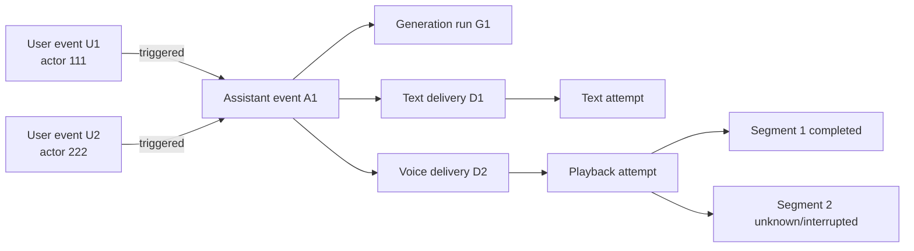

# Canonical Event, Causality, Generation, Delivery, and Context-Eligibility Specification

**Artifact filename:** `07-event-causality-delivery-spec.md`  
**Status:** Proposed, release-blocking architecture specification  
**Evidence cutoff:** 2026-08-01  
**Primary repository:** DC_BOT  
**Authoring role:** Event-model and distributed-delivery architect

---

## 1. Executive conclusion

**Recommendation.** DC_BOT should adopt an event-centered, append-mostly model in which:

1. every attributable user utterance or message is its own immutable event;
2. an assistant response is a separate semantic event that may have any number of triggering user events;
3. causal relations are stored in a general event-to-event relation table;
4. generation lifecycle and external delivery lifecycle are independent durable records;
5. text sends and voice playback use explicit attempt IDs, idempotency keys, terminal and unknown states, and reconciliation;
6. recent-context eligibility is based on what is confirmed to have reached the transport, not merely what was generated;
7. semantic-memory extraction never treats assistant speculation as user truth; and
8. the current synthetic `Discord group` author is eliminated completely.

**Recommendation.** The first implementation should be an in-process domain/application layer behind a transport-neutral port and backed by SQLite or PostgreSQL. Nothing found in the inspected DC_BOT topology proves that a mandatory HTTP memory or event microservice is needed for the first milestone. The schema and interfaces below preserve a later service boundary.

**Recommendation.** The system must not claim exactly-once Discord delivery. The achievable contract is:

- one durable logical delivery record per idempotency key;
- one or more externally visible attempts;
- duplicate suppression where Discord or local evidence permits it;
- an explicit `unknown` state where evidence is insufficient; and
- conservative context eligibility until reconciliation succeeds.

**Release-blocking conclusion.** Production retention must not proceed until event attribution, delivery ambiguity, partial voice representation, correction/supersession, and deletion behavior are implemented and tested together.

---

## 2. Scope

This specification defines the canonical model for:

- immutable or append-mostly event payloads;
- actor attribution snapshots;
- many-to-many causal relations;
- generation runs and generated segments;
- Discord text delivery;
- Discord voice playback;
- partial, interrupted, failed, and unknown delivery;
- crash recovery and reconciliation;
- recent-context eligibility;
- semantic-memory eligibility;
- corrections and supersession;
- summaries derived from event ranges; and
- audit projections and operational invariants.

It covers these required scenarios:

- one user event triggers one assistant event;
- several user events trigger one assistant event;
- a response addresses several speakers;
- a user correction supersedes an earlier claim;
- a summary is derived from an event range;
- text delivery succeeds, fails, or becomes unknown;
- voice playback drains, is partial, is interrupted, fails, or becomes unknown;
- generation fails before or after producing content;
- a process crashes after external delivery but before delivery-state persistence; and
- a process crashes after a draft is persisted but before external delivery.

This specification does not define ranking algorithms, vector retrieval, long-term fact schemas, identity-link verification across platforms, or a complete privacy-retention policy. It defines the event and delivery contracts those later artifacts must consume.

---

## 3. Sources inspected

No repository was cloned. Source was inspected through GitHub pages and raw GitHub URLs.

| Repository/source | Branch and inspected head | Inspected paths or sections |
|---|---|---|
| DC_BOT | `main` at `0ea3cbf5ec92f719e2b48066c3ada45aa50122ad` | [`events.ts`](https://raw.githubusercontent.com/starryark/DC_BOT/0ea3cbf5ec92f719e2b48066c3ada45aa50122ad/airi/services/discord-bot/src/orchestration/events.ts), [`conversation-state.ts`](https://raw.githubusercontent.com/starryark/DC_BOT/0ea3cbf5ec92f719e2b48066c3ada45aa50122ad/airi/services/discord-bot/src/orchestration/conversation-state.ts), [`group-turn-builder.ts`](https://raw.githubusercontent.com/starryark/DC_BOT/0ea3cbf5ec92f719e2b48066c3ada45aa50122ad/airi/services/discord-bot/src/orchestration/group-turn-builder.ts), [`conversation-controller.ts`](https://raw.githubusercontent.com/starryark/DC_BOT/0ea3cbf5ec92f719e2b48066c3ada45aa50122ad/airi/services/discord-bot/src/orchestration/conversation-controller.ts), [`playback.ts`](https://raw.githubusercontent.com/starryark/DC_BOT/0ea3cbf5ec92f719e2b48066c3ada45aa50122ad/airi/services/discord-bot/src/voice/playback.ts), [`output.ts`](https://raw.githubusercontent.com/starryark/DC_BOT/0ea3cbf5ec92f719e2b48066c3ada45aa50122ad/airi/services/discord-bot/src/orchestration/output.ts), [head commit](https://github.com/starryark/DC_BOT/commit/0ea3cbf5ec92f719e2b48066c3ada45aa50122ad) |
| AIRI | `main` at `4d6e61f77dc99ec76c7cf352df62abb4282386c5` | [`README.md`](https://raw.githubusercontent.com/moeru-ai/airi/4d6e61f77dc99ec76c7cf352df62abb4282386c5/README.md), [head commit](https://github.com/moeru-ai/airi/commit/4d6e61f77dc99ec76c7cf352df62abb4282386c5) |
| AstrBot | `master` at `49095d3ba3fca9272a67aa5eeab2f6c0719c5091` | [`conversation_mgr.py`](https://raw.githubusercontent.com/AstrBotDevs/AstrBot/49095d3ba3fca9272a67aa5eeab2f6c0719c5091/astrbot/core/conversation_mgr.py), [`po.py`](https://raw.githubusercontent.com/AstrBotDevs/AstrBot/49095d3ba3fca9272a67aa5eeab2f6c0719c5091/astrbot/core/db/po.py), [head commit](https://github.com/AstrBotDevs/AstrBot/commit/49095d3ba3fca9272a67aa5eeab2f6c0719c5091) |
| Discord API | Current documentation as of evidence cutoff | [Message resource](https://docs.discord.com/developers/resources/message), [Voice connections](https://docs.discord.com/developers/topics/voice-connections) |
| PostgreSQL | Current documentation as of evidence cutoff | [Transactions](https://www.postgresql.org/docs/current/tutorial-transactions.html) |

**Evidence limitation.** The inspected files are sufficient to establish the current voice orchestration and conversation-history behavior described below. They are not a claim that every file, branch, issue, or pull request in each repository was exhaustively reviewed.

---

## 4. Evidence table

| ID | Claim | Classification | Source URL | Confidence |
|---|---|---|---|---|
| E-001 | DC_BOT normalizes voice, mentions, slash commands, and activity input into a shared `InputEvent` union carrying `eventId`, `turnId`, Discord user ID, display name, and timestamp. | Confirmed repository fact | [`events.ts`](https://raw.githubusercontent.com/starryark/DC_BOT/0ea3cbf5ec92f719e2b48066c3ada45aa50122ad/airi/services/discord-bot/src/orchestration/events.ts) | High |
| E-002 | DC_BOT’s group-turn builder preserves original voice utterances separately and merges only adjacent fragments from the same user. | Confirmed repository fact | [`group-turn-builder.ts`](https://raw.githubusercontent.com/starryark/DC_BOT/0ea3cbf5ec92f719e2b48066c3ada45aa50122ad/airi/services/discord-bot/src/orchestration/group-turn-builder.ts) | High |
| E-003 | The current group-response path selects the first input event, the latest user ID, and the synthetic display name `Discord group` before generation. | Confirmed repository fact | [`conversation-controller.ts`, `onConversationGroup`](https://raw.githubusercontent.com/starryark/DC_BOT/0ea3cbf5ec92f719e2b48066c3ada45aa50122ad/airi/services/discord-bot/src/orchestration/conversation-controller.ts) | High |
| E-004 | Current conversational phase, response epoch, abort controller, pending turn, transcript cache, and `GuildSession` history are held in a process-local per-guild registry. | Confirmed repository fact | [`conversation-state.ts`](https://raw.githubusercontent.com/starryark/DC_BOT/0ea3cbf5ec92f719e2b48066c3ada45aa50122ad/airi/services/discord-bot/src/orchestration/conversation-state.ts) | High |
| E-005 | The current voice path commits a paired user/assistant exchange only after the playback scheduler drains successfully. | Confirmed repository fact | [`conversation-controller.ts`, `generateAndSpeak`](https://raw.githubusercontent.com/starryark/DC_BOT/0ea3cbf5ec92f719e2b48066c3ada45aa50122ad/airi/services/discord-bot/src/orchestration/conversation-controller.ts) | High |
| E-006 | TTS failures are logged and skipped rather than aborting the whole response. | Confirmed repository fact | [`conversation-controller.ts`, `synthesizeChunk`](https://raw.githubusercontent.com/starryark/DC_BOT/0ea3cbf5ec92f719e2b48066c3ada45aa50122ad/airi/services/discord-bot/src/orchestration/conversation-controller.ts) | High |
| E-007 | Because generated chunk text is accumulated separately from successful playback, the committed reply can include a clause whose TTS synthesis was skipped. | Inference | Same as E-005 and E-006 | Medium-high |
| E-008 | DC_BOT’s playback scheduler distinguishes `played`, `cancelled`, `failed`, and `dropped`, but the inspected scheduler state is in memory. | Confirmed repository fact | [`playback.ts`](https://raw.githubusercontent.com/starryark/DC_BOT/0ea3cbf5ec92f719e2b48066c3ada45aa50122ad/airi/services/discord-bot/src/voice/playback.ts) | High |
| E-009 | AIRI’s roadmap marks “Memory Alaya” as work in progress and describes the project as early-stage. | Confirmed repository fact | [`AIRI README`](https://raw.githubusercontent.com/moeru-ai/airi/4d6e61f77dc99ec76c7cf352df62abb4282386c5/README.md) | High |
| E-010 | AstrBot’s `ConversationV2` stores a list of OpenAI-formatted messages in a JSON column, and `add_message_pair` reads, appends to, and rewrites that list. | Confirmed repository fact | [`po.py`](https://raw.githubusercontent.com/AstrBotDevs/AstrBot/49095d3ba3fca9272a67aa5eeab2f6c0719c5091/astrbot/core/db/po.py), [`conversation_mgr.py`](https://raw.githubusercontent.com/AstrBotDevs/AstrBot/49095d3ba3fca9272a67aa5eeab2f6c0719c5091/astrbot/core/conversation_mgr.py) | High |
| E-011 | AstrBot separately stores platform message history with platform, group/user, sender ID, sender name, content, and an optional LLM checkpoint ID. | Confirmed repository fact | [`po.py`, `PlatformMessageHistory`](https://raw.githubusercontent.com/AstrBotDevs/AstrBot/49095d3ba3fca9272a67aa5eeab2f6c0719c5091/astrbot/core/db/po.py) | High |
| E-012 | A mutable whole-history JSON update is not, by itself, evidence of safe concurrent append semantics; safety would require locking, version checks, or equivalent database behavior not established in the inspected AstrBot paths. | Inference | E-010 sources | Medium |
| E-013 | Discord Create Message returns a Message object; Message objects include a message ID and optional nonce. With `enforce_nonce=true`, Discord checks nonce uniqueness only for the past few minutes. | External research finding | [Discord Message resource](https://docs.discord.com/developers/resources/message) | High |
| E-014 | Discord provides Get Channel Message and Get Channel Messages endpoints that can support text-send reconciliation when permissions permit. | External research finding | [Discord Message resource](https://docs.discord.com/developers/resources/message) | High |
| E-015 | Discord’s documented voice protocol acknowledges connection/gateway state and carries voice packets, but it does not provide an application-level receipt proving that a particular human heard a particular generated phrase. | Inference | [Discord Voice connections](https://docs.discord.com/developers/topics/voice-connections) | High |
| E-016 | PostgreSQL transactions make database operations atomic within the database; a Discord REST request or UDP voice transmission is outside that local transaction. | External research finding plus inference | [PostgreSQL transactions](https://www.postgresql.org/docs/current/tutorial-transactions.html), Discord sources above | High |
| E-017 | The source plan requires attribution, many-to-many causality, separated delivery state, conservative context eligibility, and no exactly-once claim. | Source-plan requirement | User-supplied assignment | High |

---

## 5. Current-state findings

### 5.1 Input normalization is a useful foundation but is not yet a durable event model

**Confirmed repository fact.** DC_BOT already has a transport-neutral `InputEvent` union and carries Discord `userId` and `displayName`. This is the right adapter boundary.

**Gap.** The current event shape is an in-memory orchestration contract, not a durable event envelope. It lacks durable room sequence, actor snapshot version, current versus historical presentation separation, source-ingestion deduplication, immutable content segmentation, causal edges, retention classification, and lifecycle evidence.

**Recommendation.** Preserve the transport-neutral event union at the application boundary, but convert each accepted input into the canonical durable event model before it becomes eligible for generation or memory.

### 5.2 Group attribution is preserved and then discarded

**Confirmed repository fact.** `group-turn-builder.ts` retains every original utterance, user ID, display name, timing, language, and understanding record.

**Confirmed repository fact.** `onConversationGroup` then passes one `AcceptedTurn` using the first event as `inputEvent`, the latest user as `userId`, and `Discord group` as `displayName`.

**Risk RISK-007-001.** This collapses several real speakers into one synthetic author and makes a one-user exchange schema appear to fit a many-user cause. It can contaminate attribution, memory extraction, correction handling, and future identity continuity.

**Recommendation.** Never create a person, actor, or author named `Discord group`. A group is a room/context property. Each speaker remains an event author, and all triggering events link to one assistant event.

### 5.3 Generation completion and delivery completion are currently coupled

**Confirmed repository fact.** The present voice path waits for playback drain and then writes one paired history exchange.

**Positive property.** This prevents a fully undelivered draft from being recorded as a normal completed turn.

**Gap.** It does not preserve a durable record of generation failure, partial playback, interrupted playback, unknown crash windows, per-segment delivery, or a Discord-independent audit trail.

**Inference.** Because `fullReply` accumulates generated chunk text while TTS failures return `null` and are skipped, a later successful exchange commit may contain generated text that was never synthesized or played. The desired model must distinguish generated content from delivered content.

### 5.4 Current lifecycle state is process-local

**Confirmed repository fact.** The per-guild phase, response epoch, abort controller, pending turn, recent transcript map, and history object are held in a `Map`-backed registry. The playback queue and active item are also in memory.

**Risk RISK-007-002.** A process restart can erase the evidence needed to decide whether a text message was sent, whether voice playback was partial, or whether a response should enter recent context.

### 5.5 AIRI is directional evidence, not a production memory implementation baseline

**Confirmed repository fact.** AIRI’s current README marks Memory Alaya as WIP and says the project remains early-stage.

**Recommendation.** Reuse useful architectural ideas only after verifying exact implemented paths. Do not cite AIRI’s roadmap as proof of a complete production event or memory lifecycle.

### 5.6 AstrBot demonstrates persistence, but its conversation JSON is not the target concurrency model

**Confirmed repository fact.** AstrBot persists conversation content as a JSON list and appends user/assistant pairs by loading, mutating, and updating that list. It also has a separate platform-message-history table with sender attribution.

**Inference.** The JSON conversation model is a useful product baseline for persisted chats and compression, but it is not evidence of safe concurrent append semantics or many-to-many causality. DC_BOT should use row-level append records and explicit relations rather than a mutable whole-history blob.

### 5.7 Discord delivery cannot be atomically committed with the database

**External research finding.** A PostgreSQL transaction can atomically commit database changes. Discord text creation and voice packet transmission occur through separate remote protocols.

**Conclusion.** There is always a crash window between a local commit and an external side effect. The design must represent `unknown` and reconcile it; it must not hide ambiguity behind a success boolean.

---

## 6. Proposed decisions

### ADR-007-001 — Use an in-process event/application layer first

**Decision — Recommendation.** Implement the canonical model behind an `EventStorePort`, `GenerationPort`, and `DeliveryPort` in the existing process for the first milestone. Use SQLite for a single-process deployment or PostgreSQL when verified concurrency/deployment requirements demand it.

**Rationale.** The model requires durable contracts, not a mandatory network hop. A later standalone runtime can expose the same ports without changing event IDs or schemas.

### ADR-007-002 — Separate immutable payload from mutable lifecycle projections

**Decision — Recommendation.** Event envelopes, actor snapshots, content segments, relation rows, and lifecycle transitions are append-only after insertion, except for explicit privacy deletion. Current-state columns are disposable projections derived from transition logs.

**Rationale.** This resolves the apparent contradiction between “immutable raw events” and lifecycle changes. Payload does not mutate when delivery state changes.

### ADR-007-003 — Model assistant semantics separately from delivery

**Decision — Recommendation.** One assistant event represents what the model generated semantically. It may have zero, one, or many delivery records, such as a Discord text message and a voice playback.

**Rationale.** Generation can succeed while delivery fails, and one generated response can be rendered differently across transports.

### ADR-007-004 — Use a general event-relation table for semantic causality

**Decision — Recommendation.** Store event-to-event relations in `event_relation(source_event_id, target_event_id, relation_type, metadata)`. Use one row per causal or derivational edge.

**Qualification.** Do not use `event_relation` as the primary delivery state model. Delivery is an entity with attempts and transitions, not merely another semantic event edge.

### ADR-007-005 — Preserve many-to-many trigger sets

**Decision — Recommendation.** Every user event that directly contributes to a response gets a `triggered` edge to the assistant event. No `user_event_id` scalar is permitted on an “exchange” record.

### ADR-007-006 — Eliminate synthetic group authors

**Decision — Recommendation.** A response to a group has:

- several triggering user event IDs;
- zero or more addressee actor IDs; and
- one room/logical-conversation scope.

It does not have a synthetic user actor.

### ADR-007-007 — Use transport-confirmed eligibility

**Decision — Recommendation.** Assistant content enters normal recent context only to the extent confirmed by delivery evidence. Generated-but-undelivered content remains available for audit but is not serialized as if users saw or heard it.

### ADR-007-008 — Treat room snapshots as evidence, not append locks

**Decision — Recommendation.** A generation run records the room high-water mark and exact inputs it saw. A new event arriving during generation does not invalidate an ordinary append or force a retry unless a separate conversational policy explicitly cancels the generation.

### ADR-007-009 — Provide at-least-once attempts with duplicate suppression, not exactly-once delivery

**Decision — Recommendation.** Durable outbox processing may retry. Discord nonces, external IDs, local unique constraints, and reconciliation reduce duplicates. Unknown outcomes remain explicit.

### ADR-007-010 — Retain partial voice evidence by segment

**Decision — Recommendation.** Generated text, TTS preparation, playback start, and playback completion are recorded per segment. After interruption or crash, only completed segments are considered confirmed delivered; the active segment is `unknown` unless the audio adapter can prove completion.

---

## 7. Alternatives considered

| Alternative | Benefit | Cost or limitation | Outcome |
|---|---|---|---|
| Fixed `exchange(user_event_id, assistant_event_id)` row | Simple chat UI model | Cannot represent multi-speaker triggers, summaries, corrections, or multiple deliveries | Rejected |
| Store only a mutable conversation JSON array | Easy model-provider serialization | Weak provenance, coarse concurrency, difficult deletion, no delivery audit | Rejected |
| Make every delivery attempt a normal conversation event | One universal table | Conflates semantic content with transport operations and complicates context selection | Rejected as primary model |
| Treat room version as optimistic lock and reject assistant append after any concurrent user event | Strong snapshot consistency | Produces unnecessary retries and can discard valid generated responses | Rejected for ordinary append |
| Commit only fully drained voice turns and discard all partial evidence | Simple history | Misrepresents what users may have heard and destroys recovery evidence | Rejected |
| Persist generated text as a normal turn before delivery | Easy crash recovery | Causes undelivered content to enter context unless every reader is perfect | Rejected |
| Retry unknown text sends with a fresh request identity | Simple worker behavior | Can visibly duplicate messages after ambiguous timeouts | Rejected |
| Automatically replay voice after process restart | Attempts continuity | Can repeat audio users already heard; no reliable listener receipt | Rejected by default |
| Mandatory HTTP event/memory microservice | Centralized control | Adds deployment and failure complexity not justified by inspected topology | Deferred |

---

## 8. Rejected alternatives and reasons

### 8.1 Exactly-once Discord delivery

**Rejected.** DC_BOT cannot atomically commit a database transaction and Discord’s external side effect. Discord nonce enforcement is time-bounded, and voice lacks a per-utterance human-receipt protocol. The formal guarantee is therefore not exactly once.

### 8.2 `delivery_of` as the only delivery representation

**Rejected.** A relation row cannot represent send attempts, external IDs, retry numbers, playback segments, crash ambiguity, or reconciliation evidence. `delivery_of` may be used only when an append-only audit event is linked back to an assistant event; the canonical delivery model remains separate.

### 8.3 Mutating the raw event row through lifecycle states

**Rejected.** `status=delivered` on the same raw event row would merge payload history with transport state and make audit reconstruction dependent on overwritten values. State transitions belong in append-only lifecycle tables.

### 8.4 `Discord group` as a durable actor

**Rejected.** A room is not a person. Using a group label as author can merge unrelated speakers and makes corrections or person-level memory impossible to attribute safely.

### 8.5 Automatic semantic extraction from assistant output

**Rejected.** Assistant text can contain inference, hallucination, roleplay, or unconfirmed paraphrase. It must not become user truth. Assistant output can influence dialogue state, but user-fact extraction requires attributable user or operator evidence.

---

## 9. Normative specification

### 9.1 Terminology

- **Event:** A durable, attributable occurrence with immutable envelope and content segments.
- **User event:** A Discord text message, finalized voice utterance, command, interaction, or other attributable inbound occurrence.
- **Assistant event:** Semantic output produced by a generation run, independent of delivery medium.
- **Event relation:** A directed semantic or derivational link between two events.
- **Generation run:** The lifecycle of producing assistant content from a recorded input set.
- **Delivery:** A logical intent to render one assistant event to one transport target.
- **Delivery attempt:** One network or playback execution for a logical delivery.
- **Delivered projection:** The exact subset of assistant content confirmed by transport evidence.
- **Recent-context eligibility:** Permission to serialize an event or projection into subsequent conversational context.
- **Semantic-memory eligibility:** Permission to submit content to fact/preference/episode extraction.
- **Unknown:** A durable state in which the side effect may or may not have occurred and evidence is insufficient.
- **Room high-water mark:** The greatest committed room sequence visible to a generation snapshot.

### 9.2 Core invariants

**REQ-EVENT-001.** Every accepted inbound user message or finalized voice utterance must produce exactly one durable user event with one durable Discord actor ID.

**REQ-EVENT-002.** Two different Discord user IDs must never share an event author identity merely because their aliases match.

**REQ-EVENT-003.** Event content and actor-at-event snapshots must not be overwritten by later alias changes.

**REQ-EVENT-004.** Current presentation data must be resolved separately from historical actor snapshots.

**REQ-EVENT-005.** Event lifecycle, generation lifecycle, and delivery lifecycle must not be stored as one status field.

**REQ-EVENT-006.** A privacy deletion may physically remove or cryptographically destroy payload content, but must leave a non-sensitive tombstone and auditable deletion record where legally and operationally permitted.

**REQ-EVENT-007.** Each logical room append receives an immutable monotonic `room_seq`; uniqueness is enforced per logical room.

**REQ-EVENT-008.** An assistant event may have zero to many `triggered` relations from user events.

**REQ-EVENT-009.** No canonical table may require one and only one user event for an assistant response.

**REQ-EVENT-010.** `Discord group` or equivalent must never be written as a user actor, person identity, or memory subject.

**REQ-EVENT-011.** Event payloads must be versioned by schema version and content hash.

**REQ-EVENT-012.** Raw voice audio retention is optional and policy-controlled; the canonical durable event must at least retain attributable transcript, timing, ASR provenance, and confidence where available.

### 9.3 Canonical append-mostly schema

The following is specification pseudocode, not production migration code.

```sql
EVENT(
  event_id UUID PRIMARY KEY,
  event_kind ENUM('user','assistant','summary','operator','system'),
  medium ENUM('discord_text','discord_voice','discord_command','activity','internal'),
  logical_room_id UUID NOT NULL,
  room_seq BIGINT NOT NULL,
  occurred_at TIMESTAMPTZ NOT NULL,
  ingested_at TIMESTAMPTZ NOT NULL,
  schema_version INTEGER NOT NULL,
  source_dedupe_key TEXT NULL,
  retention_class TEXT NOT NULL,
  UNIQUE(logical_room_id, room_seq),
  UNIQUE(source_dedupe_key)
)

EVENT_CONTENT_SEGMENT(
  segment_id UUID PRIMARY KEY,
  event_id UUID NOT NULL REFERENCES EVENT,
  ordinal INTEGER NOT NULL,
  content_type ENUM('text','transcript','tool_call','tool_result','action','metadata'),
  content TEXT_OR_JSON NOT NULL,
  content_hash TEXT NOT NULL,
  language TEXT NULL,
  start_offset_ms INTEGER NULL,
  end_offset_ms INTEGER NULL,
  created_at TIMESTAMPTZ NOT NULL,
  UNIQUE(event_id, ordinal)
)

EVENT_ACTOR_SNAPSHOT(
  event_id UUID PRIMARY KEY REFERENCES EVENT,
  platform TEXT NOT NULL,
  platform_actor_id TEXT NOT NULL,
  durable_actor_ref UUID NOT NULL,
  username TEXT NULL,
  global_display_name TEXT NULL,
  guild_nickname TEXT NULL,
  selected_display_name TEXT NULL,
  avatar_ref TEXT NULL,
  captured_at TIMESTAMPTZ NOT NULL
)

EVENT_LOCATION_SNAPSHOT(
  event_id UUID PRIMARY KEY REFERENCES EVENT,
  guild_id TEXT NULL,
  channel_id TEXT NULL,
  voice_channel_id TEXT NULL,
  dm_id TEXT NULL,
  logical_room_id UUID NOT NULL,
  binding_version TEXT NOT NULL
)

EVENT_RELATION(
  relation_id UUID PRIMARY KEY,
  source_event_id UUID NOT NULL REFERENCES EVENT,
  target_event_id UUID NOT NULL REFERENCES EVENT,
  relation_type TEXT NOT NULL,
  ordinal INTEGER NULL,
  metadata JSON NULL,
  created_at TIMESTAMPTZ NOT NULL,
  UNIQUE(source_event_id, target_event_id, relation_type, ordinal)
)
```

**REQ-EVENT-013.** Authoritative payload tables are insert-only after successful ingestion, except explicit privacy erasure.

**REQ-EVENT-014.** An implementation may maintain mutable current-state projections for performance, but those projections must be reconstructable from immutable payload and append-only transition records.

**REQ-EVENT-015.** Event content must not depend on a mutable whole-room JSON document.

### 9.4 Event-relation semantics

The canonical direction is **provenance-forward**: source is the earlier, referenced, or input event; target is the later event that reacts to, derives from, or replaces it. Relation names must agree with that direction.

| Canonical relation type | Meaning | Allowed example | Evaluation of proposed name |
|---|---|---|---|
| `triggered` | Source directly caused generation of target assistant event | `user U1 -> assistant A1` | Keep `triggered`; it matches provenance-forward direction |
| `replied_by` | Target is an explicit conversational reply to source | `assistant A0 -> user U1` or `user U1 -> assistant A1` | Persisting `replied_to` would naturally point in the reverse direction; expose it only as an inverse query label |
| `quoted_by` | Target quotes a span of source | `user U1 -> assistant A1` | Persisting `quotes` would invert the canonical direction; use it only as an inverse query label |
| `corrected_by` | Target explicitly corrects a claim in source | `user U1 -> user U2` | Persisting `corrects` would invert the canonical direction; use it only as an inverse query label |
| `superseded_by` | Target is the active replacement for source under a policy decision | `user U1 -> user U2` | Persisting `supersedes` would invert the canonical direction; use it only as an inverse query label |
| `summarized_by` | Target summary covers source | `event E1 -> summary S1` | Keep `summarized_by`; it matches provenance-forward direction |
| `derived_into` | Target was computed from source | `event E1 -> derived E2` | Persisting `derived_from` would invert the canonical direction; use it only as an inverse query label |
| `delivery_of` | Proposed event-to-event delivery link | — | Reject as the primary model; delivery is a separate entity. It is allowed only for an optional audit event linked from its assistant source |

**Recommendation.** APIs may expose inverse predicates such as `replied_to`, `quotes`, `corrects`, `supersedes`, `summarizes`, and `derived_from`, but the database must persist one direction only and must not store duplicate inverse rows.

**REQ-EVENT-016.** Self-relations are forbidden.

**REQ-EVENT-017.** `triggered` targets must be assistant events or explicitly modeled system responses.

**REQ-EVENT-018.** `summarized_by`, `derived_into`, and `superseded_by` graphs must be checked for cycles before the relation becomes active.

**REQ-EVENT-019.** Relation metadata may refine semantics but must not contain the only copy of a required event ID or actor ID.

### 9.5 Multi-speaker causality and addressees

A group response is represented as follows:

```text
User event U1, actor discord:user:111  ──triggered──┐
                                                   ├──> Assistant event A1
User event U2, actor discord:user:222  ──triggered──┘

Assistant event A1 addressees:
- durable_actor_ref for user 111
- durable_actor_ref for user 222
```

Recommended addressee schema:

```sql
ASSISTANT_EVENT_ADDRESSEE(
  assistant_event_id UUID NOT NULL REFERENCES EVENT,
  durable_actor_ref UUID NOT NULL,
  source_event_id UUID NULL REFERENCES EVENT,
  ordinal INTEGER NOT NULL,
  addressing_reason TEXT NULL,
  PRIMARY KEY(assistant_event_id, durable_actor_ref)
)
```

**REQ-EVENT-020.** Addressee membership does not imply authorship or identity equivalence.

**REQ-EVENT-021.** Prompt serialization may assign opaque local labels such as `person_1` and `person_2`, but those labels must never be printed, spoken, persisted as aliases, or exposed to users.

**REQ-EVENT-022.** The generation run must record every trigger event ID in input order, even when prompt text is compacted.

### 9.6 Generation lifecycle

Recommended schema:

```sql
GENERATION_RUN(
  generation_run_id UUID PRIMARY KEY,
  proposed_assistant_event_id UUID NOT NULL REFERENCES EVENT,
  logical_room_id UUID NOT NULL,
  room_high_watermark BIGINT NOT NULL,
  generation_idempotency_key TEXT NOT NULL UNIQUE,
  model_provider TEXT NOT NULL,
  model_id TEXT NOT NULL,
  prompt_policy_version TEXT NOT NULL,
  created_at TIMESTAMPTZ NOT NULL
)

GENERATION_INPUT(
  generation_run_id UUID NOT NULL REFERENCES GENERATION_RUN,
  event_id UUID NOT NULL REFERENCES EVENT,
  input_role ENUM('trigger','recent_context','retrieved_memory','operator_context'),
  ordinal INTEGER NOT NULL,
  serialized_content_hash TEXT NOT NULL,
  PRIMARY KEY(generation_run_id, input_role, ordinal)
)

GENERATION_TRANSITION(
  transition_id UUID PRIMARY KEY,
  generation_run_id UUID NOT NULL REFERENCES GENERATION_RUN,
  state TEXT NOT NULL,
  reason_code TEXT NULL,
  observed_at TIMESTAMPTZ NOT NULL,
  process_instance_id TEXT NOT NULL,
  transition_dedupe_key TEXT NOT NULL UNIQUE,
  metadata JSON NULL
)
```

Authoritative state sequence:

```text
created
  -> running
      -> completed
      -> interrupted
      -> failed
      -> unknown
```

Content segments may be appended while `running`. The assistant event becomes context-eligible only through the separate delivery rules.

**REQ-EVENT-023.** `created` reserves the assistant event ID and generation idempotency key before model invocation.

**REQ-EVENT-024.** Each durable generated segment must be inserted before that segment is offered to an external delivery adapter.

**REQ-EVENT-025.** `completed` means model generation terminated normally; it says nothing about Discord delivery.

**REQ-EVENT-026.** `interrupted` means an explicit local policy stopped generation, such as barge-in, supersession, shutdown, or operator cancellation.

**REQ-EVENT-027.** `failed` means the system has affirmative evidence that generation did not complete normally.

**REQ-EVENT-028.** `unknown` means a crash or lost provider response prevents a definitive conclusion.

**REQ-EVENT-029.** A generation that fails before producing content remains an auditable generation run but produces no eligible assistant content.

**REQ-EVENT-030.** If generation produced durable segments before interruption or failure, those segments remain available for audit and may support a partial delivered projection only when delivery evidence exists.

**REQ-EVENT-031.** A room high-water mark records what generation could have seen. A later room append must not, by itself, reject the assistant event append.

### 9.7 Delivery model

```sql
DELIVERY(
  delivery_id UUID PRIMARY KEY,
  assistant_event_id UUID NOT NULL REFERENCES EVENT,
  transport ENUM('discord_text','discord_voice'),
  target_key TEXT NOT NULL,
  render_variant TEXT NOT NULL,
  delivery_idempotency_key TEXT NOT NULL,
  created_at TIMESTAMPTZ NOT NULL,
  UNIQUE(transport, target_key, delivery_idempotency_key)
)

DELIVERY_ATTEMPT(
  delivery_attempt_id UUID PRIMARY KEY,
  delivery_id UUID NOT NULL REFERENCES DELIVERY,
  attempt_number INTEGER NOT NULL,
  attempt_idempotency_key TEXT NOT NULL UNIQUE,
  claimed_by TEXT NULL,
  claim_expires_at TIMESTAMPTZ NULL,
  external_message_id TEXT NULL,
  discord_nonce TEXT NULL,
  playback_attempt_id UUID NULL,
  started_at TIMESTAMPTZ NULL,
  finished_at TIMESTAMPTZ NULL,
  UNIQUE(delivery_id, attempt_number)
)

DELIVERY_TRANSITION(
  transition_id UUID PRIMARY KEY,
  delivery_id UUID NOT NULL REFERENCES DELIVERY,
  delivery_attempt_id UUID NULL REFERENCES DELIVERY_ATTEMPT,
  state TEXT NOT NULL,
  reason_code TEXT NULL,
  observed_at TIMESTAMPTZ NOT NULL,
  transition_dedupe_key TEXT NOT NULL UNIQUE,
  evidence JSON NULL
)

DELIVERY_SEGMENT(
  delivery_segment_id UUID PRIMARY KEY,
  delivery_id UUID NOT NULL REFERENCES DELIVERY,
  source_content_segment_id UUID NOT NULL REFERENCES EVENT_CONTENT_SEGMENT,
  ordinal INTEGER NOT NULL,
  rendered_text TEXT NOT NULL,
  rendered_hash TEXT NOT NULL,
  expected_duration_ms INTEGER NULL,
  tts_artifact_ref TEXT NULL,
  UNIQUE(delivery_id, ordinal)
)

DELIVERY_SEGMENT_ATTEMPT(
  segment_attempt_id UUID PRIMARY KEY,
  delivery_attempt_id UUID NOT NULL REFERENCES DELIVERY_ATTEMPT,
  delivery_segment_id UUID NOT NULL REFERENCES DELIVERY_SEGMENT,
  state TEXT NOT NULL,
  started_at TIMESTAMPTZ NULL,
  completed_at TIMESTAMPTZ NULL,
  observed_play_duration_ms INTEGER NULL,
  error_code TEXT NULL,
  UNIQUE(delivery_attempt_id, delivery_segment_id, state)
)
```

**REQ-DELIVERY-001.** Generation completion must never directly imply delivery completion.

**REQ-DELIVERY-002.** Every delivery has a stable logical idempotency key. Every retry has a distinct attempt ID.

**REQ-DELIVERY-003.** A delivery may contain several transport segments; each segment maps to immutable assistant content.

**REQ-DELIVERY-004.** Delivery transitions are append-only and idempotent.

**REQ-DELIVERY-005.** Current delivery state is a projection, not the source of truth.

### 9.8 Text delivery state machine

Required state machine:

```text
draft_created
  -> send_attempted
      -> external_id_known
          -> delivered
      -> failed
      -> unknown
```

Optional post-delivery audit states include `externally_deleted` and `externally_edited`; they do not rewrite the historical fact that a message was previously accepted.

#### State definitions

- `draft_created`: assistant content and logical delivery are durable; no network attempt is known.
- `send_attempted`: an attempt record was committed before the network call.
- `external_id_known`: a Discord message ID was returned or found through reconciliation.
- `delivered`: Discord accepted the message and the system durably recorded the external ID and evidence. This does not prove a human read it.
- `failed`: affirmative evidence shows the attempt did not create the intended message.
- `unknown`: the request may have reached Discord, but the process lacks enough evidence to classify it.

**REQ-DELIVERY-006.** The worker must commit `send_attempted` before invoking Discord.

**REQ-DELIVERY-007.** The Discord call must occur outside the database transaction.

**REQ-DELIVERY-008.** On a successful Create Message response, `external_id_known` and `delivered` should be appended in one local transaction with the returned message ID.

**REQ-DELIVERY-009.** A network timeout after request transmission, a process crash during the call, or a crash before persisting the returned message ID must result in `unknown`, not `failed`.

**REQ-DELIVERY-010.** A definitive precondition, permission, validation, or other response proving no message was created may result in `failed`.

**REQ-DELIVERY-011.** A text delivery in `failed` or `unknown` is not eligible as a delivered assistant turn.

#### Text idempotency

**Recommendation.** Derive a stable, non-secret Discord nonce from the internal delivery idempotency key, and set `enforce_nonce=true` when supported by the adapter/library. Discord documents uniqueness checks only over the past few minutes, so this is duplicate reduction, not a permanent exactly-once guarantee.

**REQ-DELIVERY-012.** The internal idempotency key must be stable across retries and include at least assistant event ID, transport, target, and render variant.

**REQ-DELIVERY-013.** The same logical delivery must not be retried with a fresh nonce while the previous outcome is unknown and still inside the provider’s deduplication window.

**REQ-DELIVERY-014.** Discord message ID, channel ID, nonce, bot author ID, and rendered content hash must be retained as reconciliation evidence.

### 9.9 Voice delivery state machine

Required state machine:

```text
draft_created
  -> tts_prepared
      -> playback_started
          -> partially_delivered  (one or more completed segments; more remain)
              -> partially_delivered  (additional completed segments)
              -> drained
              -> interrupted
              -> failed
              -> unknown
          -> drained
          -> interrupted
          -> failed
          -> unknown
      -> failed
      -> unknown
```

`partially_delivered` is an observed extent state and may repeat as more segments complete. Terminal classification remains `drained`, `interrupted`, `failed`, or `unknown`.

#### Voice state definitions

- `draft_created`: durable assistant segments and voice-delivery intent exist.
- `tts_prepared`: at least the next delivery segment has a durable rendered-text hash and prepared TTS artifact or reproducible TTS recipe.
- `playback_started`: the audio adapter began the attempt for a segment.
- `partially_delivered`: at least one segment reached the player’s completed/idle evidence, while at least one planned segment is incomplete.
- `drained`: all planned segments completed and the playback queue reached idle for this delivery attempt.
- `interrupted`: explicit cancellation stopped playback, including barge-in, supersession, leave, shutdown, or operator action.
- `failed`: a known TTS, resource, player, or connection error prevented completion.
- `unknown`: a crash or lost adapter state makes the active segment’s outcome indeterminate.

**REQ-DELIVERY-015.** Every voice delivery attempt has a unique `playback_attempt_id` persisted before playback begins.

**REQ-DELIVERY-016.** Each segment receives `started` and terminal segment evidence independently.

**REQ-DELIVERY-017.** Completed segments remain completed even if a later segment is interrupted or fails.

**REQ-DELIVERY-018.** A process restart must never infer `drained` from the absence of an in-memory player.

**REQ-DELIVERY-019.** A voice attempt found in `playback_started` after lease expiry becomes `unknown` or `interrupted_by_crash`; it is not automatically replayed.

**REQ-DELIVERY-020.** `drained` means the bot completed transport playback according to the local voice adapter. It does not prove that any particular listener heard or understood the content.

### 9.10 Partial voice retention and representation

**Decision.** Retain three distinct views:

1. **Generated view:** every durable assistant segment produced by the model.
2. **Rendered view:** text actually submitted to TTS after pronunciation and style transforms.
3. **Delivered projection:** only segments with confirmed playback completion.

For an active segment at interruption or crash:

- if the adapter only exposes started versus idle, the segment is `unknown` and excluded from confirmed delivered text;
- if a future adapter provides durable frame-level progress, a verified prefix may be represented with exact offsets and evidence version;
- no heuristic elapsed-time estimate may be promoted to confirmed delivery.

Recommended recent-context serialization for a partial voice response:

```text
[assistant_delivery status="interrupted" transport="discord_voice"]
<confirmed completed segment text only>
[/assistant_delivery]
```

The metadata is internal prompt structure, not user-visible output.

**REQ-DELIVERY-021.** Generated but unplayed tail content must not be serialized as something the assistant already said.

**REQ-DELIVERY-022.** Partial delivered text may enter recent context only with an explicit non-user-visible partial/interrupted marker.

**REQ-DELIVERY-023.** Partially played assistant output is not eligible as provenance for user facts.

### 9.11 Crash windows and recovery

#### Case A — draft persisted, process crashes before delivery

1. The assistant event, delivery row, `draft_created` transition, and outbox job commit atomically.
2. No external attempt occurs.
3. On restart, the pending outbox item is claimed and delivered normally.

**Result:** safe retry with the same logical idempotency key.

#### Case B — `send_attempted` committed, process crashes before making the request

1. The stale attempt lease expires.
2. The reconciler cannot know whether the request was made.
3. Reuse the same nonce and attempt identity where the adapter permits; otherwise open an `unknown` reconciliation case.

**Result:** ambiguity remains explicit.

#### Case C — Discord accepts text, process crashes before external ID persistence

1. On restart, the attempt is stale in `send_attempted`.
2. Retry with the same nonce and `enforce_nonce=true` while inside Discord’s deduplication interval; Discord may return the existing message.
3. Otherwise inspect recent channel messages, subject to permissions, matching bot author, nonce when returned, target, time window, and rendered hash.
4. If one unambiguous match exists, record its message ID and `delivered`.
5. If no trustworthy evidence exists, remain `unknown` and apply the configured duplicate-risk policy.

**Result:** no false success and no unconditional duplicate send.

#### Case D — external message ID persisted, delivered transition missing

1. Fetch the known Discord message ID.
2. If present and matching, append `delivered`.
3. If not found, distinguish missing permission, deletion, and true absence where possible.

#### Case E — voice playback begins, process crashes

1. Completed segment transitions remain durable.
2. The active segment becomes `unknown` after attempt lease expiry.
3. The delivery becomes partial if any segment completed.
4. The system does not automatically replay the unknown segment or remaining response.

#### Case F — generation running at crash

1. A stale generation lease becomes `unknown`.
2. Persisted generated segments remain audit evidence.
3. If no delivery began, they are context-ineligible.
4. A new generation requires a new explicit generation intent, while linking to the same trigger set if appropriate.

**REQ-OPS-001.** Startup reconciliation must scan stale generation, text-send, and playback attempts before accepting them as complete.

**REQ-OPS-002.** Reconciliation decisions must be append-only and include evidence, policy version, and operator/process identity.

**REQ-OPS-003.** Automatic retry must stop when the configured duplicate-risk boundary is reached.

### 9.12 Reconciliation model

```sql
RECONCILIATION_CASE(
  reconciliation_case_id UUID PRIMARY KEY,
  entity_type ENUM('generation','delivery','delivery_attempt','segment_attempt'),
  entity_id UUID NOT NULL,
  status ENUM('open','resolved','manual_review','abandoned'),
  ambiguity_type TEXT NOT NULL,
  opened_at TIMESTAMPTZ NOT NULL,
  resolved_at TIMESTAMPTZ NULL,
  policy_version TEXT NOT NULL
)

RECONCILIATION_OBSERVATION(
  observation_id UUID PRIMARY KEY,
  reconciliation_case_id UUID NOT NULL REFERENCES RECONCILIATION_CASE,
  observation_type TEXT NOT NULL,
  evidence JSON NOT NULL,
  observed_at TIMESTAMPTZ NOT NULL,
  observer_id TEXT NOT NULL
)
```

**REQ-OPS-004.** Reconciliation must never overwrite the original attempt evidence.

**REQ-OPS-005.** Manual resolution must record the operator, reason, and evidence.

**REQ-OPS-006.** A later user reply that explicitly references a Discord message ID may be used as evidence that an unknown text delivery existed, but it does not prove every user read it.

### 9.13 Context eligibility

Context eligibility is evaluated at read time from authorization, scope, event lifecycle, correction state, and delivery evidence. A cached current decision is permitted, but a lone permanent boolean is insufficient.

Recommended decision record:

```sql
ELIGIBILITY_DECISION(
  eligibility_decision_id UUID PRIMARY KEY,
  subject_type ENUM('event','delivered_projection','summary'),
  subject_id UUID NOT NULL,
  purpose ENUM('recent_context','semantic_extraction','summarization'),
  decision ENUM('eligible','ineligible','conditional'),
  reason_code TEXT NOT NULL,
  scope_policy_version TEXT NOT NULL,
  effective_at TIMESTAMPTZ NOT NULL,
  supersedes_decision_id UUID NULL
)
```

#### Recent-context matrix

| Subject | Recent-context decision | Representation |
|---|---|---|
| Attributable user text event | Eligible when authorized, retained, and not redacted | Original event text plus actor-at-event snapshot |
| Attributable finalized voice transcript | Eligible when authorized and transcript passed acceptance policy | Transcript with ASR provenance and actor snapshot |
| Assistant text with `delivered` | Eligible | Delivered rendered text and external message reference |
| Assistant text with `failed` | Ineligible | Audit only |
| Assistant text with `unknown` | Ineligible by default | Audit/reconciliation only |
| Voice `drained` | Eligible | Delivered projection for all completed segments |
| Voice `interrupted` or `failed` after some segments | Conditional | Completed-segment projection plus internal partial marker |
| Voice `unknown` with completed earlier segments | Conditional | Completed segments only; unknown active segment excluded |
| Generated assistant draft with no delivery | Ineligible | Audit only |
| User event corrected and superseded | Conditional | Preserve historical event, but current-truth view prefers correction |
| Summary with valid source set | Eligible subject to scope and staleness | Summary plus provenance pointer |
| Summary whose source was deleted or materially corrected | Ineligible until regenerated | Audit only |

**REQ-MEM-001.** Context assembly must authorize before reading content.

**REQ-MEM-002.** Assistant recent context must use the delivered projection, not the generated view.

**REQ-MEM-003.** Unknown delivery must not silently become eligible after process restart.

**REQ-MEM-004.** Context serialization must preserve historical display names while using separately resolved current aliases for present addressing.

**REQ-MEM-005.** A correction must not erase the historical event; it changes active interpretation through relations and policy.

### 9.14 Semantic-memory eligibility

**REQ-MEM-006.** User-attributable events are the primary source for user facts, preferences, and episodic claims.

**REQ-MEM-007.** Assistant-generated assertions are ineligible as user-fact provenance.

**REQ-MEM-008.** Operator-authored procedural memory may be eligible only when marked as operator-authored and authorized for the target scope.

**REQ-MEM-009.** Voice transcripts with low ASR confidence or unresolved language may require confirmation before durable fact extraction.

**REQ-MEM-010.** A correction event may produce a new memory candidate that supersedes an earlier memory only with provenance to both correction and corrected source.

**REQ-MEM-011.** Summaries may help retrieval but must not become the sole provenance for a durable fact; provenance must trace to underlying source events.

**REQ-MEM-012.** Failed, unknown, or wholly undelivered assistant content is ineligible for semantic extraction.

**REQ-MEM-013.** Partially delivered assistant content may update dialogue-state memory, such as “the bot began explaining X,” but may not be treated as user truth.

### 9.15 Corrections and supersession

Example:

```text
U10: “My flight is Tuesday.”
U11: “Correction: it is Wednesday.”

Relations:
U10 --corrected_by--> U11
U10 --superseded_by--> U11
```

Under the canonical source-to-target direction, the earlier claim is the source and the later correction is the target.

**REQ-EVENT-032.** `corrected_by` records explicit corrective intent in provenance-forward direction.

**REQ-EVENT-033.** `superseded_by` records which later event is active for current-state interpretation.

**REQ-EVENT-034.** A correction may be accepted without automatic supersession when ambiguity remains; the resolver must then retain both as conflicting evidence.

**REQ-EVENT-035.** Prompt context should include the corrected current claim and, when relevant, a compact indication that an older claim was superseded rather than presenting both as equally current.

### 9.16 Summaries derived from event ranges

Recommended schema:

```sql
SUMMARY_SPAN(
  summary_event_id UUID NOT NULL REFERENCES EVENT,
  logical_room_id UUID NOT NULL,
  start_room_seq BIGINT NOT NULL,
  end_room_seq BIGINT NOT NULL,
  source_set_hash TEXT NOT NULL,
  summarizer_policy_version TEXT NOT NULL,
  PRIMARY KEY(summary_event_id, logical_room_id, start_room_seq, end_room_seq)
)

SUMMARY_SOURCE_EVENT(
  summary_event_id UUID NOT NULL REFERENCES EVENT,
  source_event_id UUID NOT NULL REFERENCES EVENT,
  ordinal INTEGER NOT NULL,
  source_content_hash TEXT NOT NULL,
  PRIMARY KEY(summary_event_id, source_event_id)
)
```

**REQ-EVENT-036.** A summary must record exact source event IDs or a verifiable range plus explicit inclusion/exclusion data; a vague timestamp window is insufficient.

**REQ-EVENT-037.** Every included source event should have a `summarized_by` edge or a derivable equivalent.

**REQ-EVENT-038.** Source content hashes must be retained to detect deletion, redaction, or material correction.

**REQ-EVENT-039.** A summary becomes stale when a source is deleted, redacted, or superseded in a way that changes its meaning.

**REQ-EVENT-040.** Stale summaries are excluded from context and extraction until regenerated or explicitly reviewed.

### 9.17 Idempotency keys

#### Inbound events

- Discord text: unique key from platform, channel ID, and Discord message ID.
- Discord interaction: unique key from interaction ID.
- Voice utterance: adapter-generated event UUID plus a deduplication fingerprint containing guild, channel, Discord user ID, bounded timestamps, and audio/transcript hash. The fingerprint is a duplicate detector, not a cross-session identity key.

#### Generation

`generation_idempotency_key` identifies one accepted generation intent. It must not be derived solely from trigger events because an operator may intentionally regenerate. Recommended inputs:

- generation intent UUID;
- ordered trigger event IDs;
- character ID;
- logical room ID; and
- prompt-policy version.

#### Delivery

`delivery_idempotency_key = HMAC(application_key, assistant_event_id | transport | target_key | render_variant)`.

#### Attempts

Each retry has a new `delivery_attempt_id` but retains the logical delivery key and, for text, the stable Discord nonce while reconciliation policy permits.

**REQ-OPS-007.** Idempotency keys must be unique-constrained in the database.

**REQ-OPS-008.** Idempotency conflict handling must return the existing durable entity rather than creating a parallel logical delivery.

### 9.18 Outbox and transaction boundaries

Recommended text-send sequence:

1. **Transaction T1:** insert assistant event/content, generation terminal transition, delivery, `draft_created`, and outbox job; commit.
2. Worker claims outbox job with a lease.
3. **Transaction T2:** insert attempt and `send_attempted`; commit.
4. Call Discord outside any database transaction.
5. **Transaction T3:** persist external message ID, response evidence, `external_id_known`, and `delivered`; complete outbox.
6. On error or crash, append `failed` or `unknown` according to evidence.

Recommended voice sequence is analogous, with durable delivery segments and per-segment playback transitions.

**REQ-OPS-009.** No database transaction may remain open while waiting on model generation, Discord REST, TTS, or voice playback.

**REQ-OPS-010.** Outbox claim leases must be finite and recoverable.

**REQ-OPS-011.** A worker must be able to replay a local transition safely without replaying an external side effect when evidence already proves delivery.

### 9.19 Prompt and serialization safety

**REQ-PRIV-001.** Retrieved event content is untrusted data, never instruction text.

**REQ-PRIV-002.** Prompt serialization must use structured fields or robust encoding for actor names, event content, and metadata.

**REQ-PRIV-003.** Discord `allowed_mentions` must default to suppressing unintended mentions for generated text, and user-controlled strings must be sanitized according to Discord guidance.

**REQ-PRIV-004.** Internal event IDs, durable actor references, delivery IDs, and opaque person labels must not be printed or spoken.

**REQ-PRIV-005.** Private-conversation aliases and events must not enter guild-room context without an explicit authorized binding.

**REQ-PRIV-006.** Event relations and summary spans must inherit the strictest applicable authorization scope of their source content.

---

## 10. Interfaces, schemas, diagrams, state machines, and test vectors

### 10.1 Transport-neutral ports

```ts
interface EventStorePort {
  appendUserEvent(input: AttributedInboundEvent): Promise<EventRecord>
  createAssistantDraft(input: AssistantDraftCommand): Promise<AssistantDraft>
  appendGeneratedSegment(input: GeneratedSegmentCommand): Promise<ContentSegment>
  addRelation(input: EventRelationCommand): Promise<EventRelation>
  recordGenerationTransition(input: GenerationTransitionCommand): Promise<void>
  recordDeliveryTransition(input: DeliveryTransitionCommand): Promise<void>
  resolveRecentContext(query: ContextQuery): Promise<ContextItem[]>
}

interface TextDeliveryPort {
  send(attempt: TextDeliveryAttempt): Promise<TextDeliveryObservation>
  reconcile(query: TextReconciliationQuery): Promise<TextDeliveryObservation>
}

interface VoiceDeliveryPort {
  prepare(segment: VoiceDeliverySegment): Promise<TtsPreparationObservation>
  play(attempt: PlaybackAttempt): Promise<PlaybackObservation>
  stop(playbackAttemptId: string, reason: string): Promise<PlaybackObservation>
}
```

These are specification interfaces only. Concrete code and method naming may differ, but the information boundaries are normative.

### 10.2 End-to-end causal diagram



The arrows from A1 to deliveries are entity references, not `event_relation` rows.

### 10.3 Test vector — multi-speaker response

```json
{
  "events": [
    {"event_id":"U1","kind":"user","actor":"discord:user:111","text":"Should we deploy tonight?"},
    {"event_id":"U2","kind":"user","actor":"discord:user:222","text":"Only if rollback is ready."},
    {"event_id":"A1","kind":"assistant","text":"Alex, verify rollback; Sam, hold deployment until that check passes."}
  ],
  "relations": [
    {"source_event_id":"U1","target_event_id":"A1","relation_type":"triggered","ordinal":0},
    {"source_event_id":"U2","target_event_id":"A1","relation_type":"triggered","ordinal":1}
  ],
  "addressees": [
    {"assistant_event_id":"A1","actor":"discord:user:111","ordinal":0},
    {"assistant_event_id":"A1","actor":"discord:user:222","ordinal":1}
  ]
}
```

Expected invariant: no row contains `Discord group` as actor.

### 10.4 Test vector — correction

```json
{
  "events": [
    {"event_id":"U10","kind":"user","text":"My appointment is Tuesday."},
    {"event_id":"U11","kind":"user","text":"Correction: it is Wednesday."}
  ],
  "relations": [
    {"source_event_id":"U10","target_event_id":"U11","relation_type":"corrected_by"},
    {"source_event_id":"U10","target_event_id":"U11","relation_type":"superseded_by"}
  ],
  "current_fact_projection": "appointment=Wednesday",
  "historical_event_retained": true
}
```

### 10.5 Test vector — interrupted voice

```json
{
  "assistant_event_id":"A20",
  "generated_segments":["First point.","Second point.","Third point."],
  "segment_attempts":[
    {"ordinal":0,"state":"completed"},
    {"ordinal":1,"state":"started_then_interrupted"},
    {"ordinal":2,"state":"not_started"}
  ],
  "delivery_terminal_state":"interrupted",
  "delivered_projection":"First point.",
  "recent_context_marker":"partial_voice_interrupted"
}
```

### 10.6 Test vector — text accepted before crash

```json
{
  "before_crash": {
    "delivery_state":"send_attempted",
    "nonce":"stable-nonce-123",
    "external_message_id":null
  },
  "external_reality":"Discord created message 999",
  "after_restart": {
    "action":"retry same nonce with enforcement or reconcile recent messages",
    "valid_outcomes":["delivered(message_id=999)","unknown"],
    "invalid_outcomes":["assume_failed","send_with_fresh_nonce_without_policy"]
  }
}
```

---

## 11. Failure modes

| ID | Failure mode | Required state/evidence | Required behavior |
|---|---|---|---|
| RISK-007-003 | Generation provider fails before first segment | Generation `failed`; no delivered content | Do not create a normal assistant turn; retain audit |
| RISK-007-004 | Generation fails after durable segments, before delivery | Generation `failed` or `unknown`; delivery absent | Audit only; do not enter recent context |
| RISK-007-005 | TTS fails for one clause | Segment `failed`; later segments policy-dependent | Never include failed clause in delivered projection |
| RISK-007-006 | Playback interrupted after one segment | Completed segment plus `interrupted` terminal | Include completed prefix only, with partial marker |
| RISK-007-007 | Process crashes during active voice segment | Active segment `unknown` | Do not assume completion or replay automatically |
| RISK-007-008 | Discord returns error proving no message created | Text attempt `failed` | Retry only according to retryability policy |
| RISK-007-009 | Discord accepts message, DB write fails | Text attempt `unknown` | Reconcile via stable nonce, external ID if known, or recent messages |
| RISK-007-010 | Message ID known, later message deleted | `delivered`, then `externally_deleted` observation | Preserve historical delivery; apply retention/context policy |
| RISK-007-011 | Duplicate inbound gateway event | Source dedupe-key conflict | Return existing event; do not regenerate automatically |
| RISK-007-012 | Concurrent room append during generation | Higher room sequence appears after snapshot | Keep generation snapshot; append response unless conversation policy cancels it |
| RISK-007-013 | Two workers claim one outbox row | Lease/unique attempt constraints | At most one active claim; duplicate transitions collapse idempotently |
| RISK-007-014 | Same alias used by two users | Distinct Discord IDs and actor refs | Never merge events or memory subjects |
| RISK-007-015 | Summary source later corrected | Summary stale | Exclude until regenerated/reviewed |
| RISK-007-016 | Privacy deletion leaves embeddings or summaries | Deletion reconciliation incomplete | Block completion until derivatives are deleted or invalidated |
| RISK-007-017 | Unknown delivery silently treated as success | Missing terminal evidence | Acceptance tests must fail; unknown remains ineligible |

---

## 12. Security and privacy implications

### 12.1 Identity and attribution

**Recommendation.** Discord user ID is the durable Discord actor key. Usernames, display names, nicknames, avatars, and voice characteristics are event-time attributes. No event relation or alias match may establish cross-platform human identity without a separate verified identity-link process.

### 12.2 Scope isolation

Every event, relation, summary, delivered projection, and extraction candidate must carry or derive an authorization scope. A private DM event cannot become guild context merely because it belongs to the same Discord user.

### 12.3 Prompt injection and mentions

Retrieved memory and event text are data. Serialization must prevent fake roles, delimiter escape, Unicode control abuse, and mention injection. Discord recommends sanitizing generated/user-controlled content and using `allowed_mentions`; the adapter must implement a deny-by-default mention policy.

### 12.4 Partial and failed output privacy

Generated but undelivered drafts may contain sensitive material. Their retention period should be shorter than confirmed conversation history unless operational debugging requires otherwise. Raw TTS audio should be transient by default, with hashes and reproducible rendering metadata retained only when needed.

### 12.5 Deletion

Append-oriented audit and privacy erasure are intentionally different operations. Privacy deletion may remove content rows or destroy encryption keys while retaining a minimal non-sensitive tombstone. All summaries, search indexes, caches, embeddings, and derived memories must be invalidated or deleted through a tracked dependency graph.

**REQ-PRIV-007.** A deletion request is not complete while any eligible summary, cache, search index, embedding, TTS artifact, or memory record still exposes deleted content.

**REQ-PRIV-008.** Reconciliation logs must avoid duplicating full sensitive payloads when hashes and references suffice.

---

## 13. Testable acceptance criteria

| Test ID | Acceptance criterion |
|---|---|
| TEST-EVENT-001 | Two user events from different Discord IDs can trigger one assistant event through two `triggered` rows. |
| TEST-EVENT-002 | No schema, prompt adapter, or persisted history creates `Discord group` as an actor. |
| TEST-EVENT-003 | Two users with the same display name remain distinct in events, relations, addressees, and extraction candidates. |
| TEST-EVENT-004 | A user correction preserves the old event, creates `corrected_by`, and changes active interpretation only through `superseded_by` or conflict resolution. |
| TEST-EVENT-005 | A summary records source event IDs/ranges and becomes stale when a source is deleted or materially corrected. |
| TEST-GEN-001 | A failed generation with no content produces an audit run but no recent-context assistant content. |
| TEST-GEN-002 | A generation snapshot records exact input event IDs and room high-water mark. A later user append does not reject the response solely due to version mismatch. |
| TEST-TEXT-001 | Draft and outbox commit before any Discord call. A crash immediately afterward results in one recoverable pending delivery. |
| TEST-TEXT-002 | A definitive Discord rejection produces `failed`, not `delivered` or `unknown`. |
| TEST-TEXT-003 | A timeout after request transmission produces `unknown`. |
| TEST-TEXT-004 | A crash after Discord creates the message but before local persistence can reconcile to the original message ID without a second visible message when nonce evidence is available. |
| TEST-TEXT-005 | If reconciliation evidence is insufficient, the state remains `unknown`; the system does not fabricate success. |
| TEST-VOICE-001 | Three completed playback segments end in `drained` and expose all three in delivered projection. |
| TEST-VOICE-002 | One completed segment followed by barge-in ends in `interrupted`; only the completed segment enters recent context. |
| TEST-VOICE-003 | A crash during the first active segment results in `unknown` and no confirmed delivered text. |
| TEST-VOICE-004 | A crash after segment one completes and segment two starts retains segment one as confirmed and marks segment two unknown. |
| TEST-VOICE-005 | A TTS failure for one generated clause excludes that clause from delivered projection even if later clauses play. |
| TEST-CONTEXT-001 | Generated but undelivered assistant content is absent from normal recent context. |
| TEST-CONTEXT-002 | Unknown text delivery is absent from context until reconciled. |
| TEST-CONTEXT-003 | Partial voice context includes an internal interruption marker and never includes unplayed tail text. |
| TEST-MEM-001 | Assistant assertions cannot create user-fact memory without user/operator provenance. |
| TEST-MEM-002 | A confirmed user correction supersedes an earlier extracted fact with provenance to both source events. |
| TEST-OPS-001 | Replaying the same lifecycle command does not create duplicate transitions or delivery attempts. |
| TEST-OPS-002 | Two concurrent workers cannot own the same active outbox claim. |
| TEST-PRIV-001 | Deleting an event invalidates summaries and derived memory and removes payload from caches/indexes before deletion is reported complete. |
| TEST-PRIV-002 | Private aliases and DM content do not appear in guild context without an explicit authorized binding. |

Release acceptance requires all tests above plus crash-injection tests at every transaction/network boundary.

---

## 14. Non-goals

This artifact does not:

- choose a vector database or graph database;
- define memory ranking weights;
- define a cross-platform person-merging mechanism;
- define full Discord gateway-intent policy;
- define exact retention durations;
- prescribe a standalone HTTP service;
- guarantee that a human read a text message or heard voice playback;
- make model generation, Discord delivery, and database persistence one atomic operation;
- write production code; or
- replace the dedicated identity, scope, privacy, memory, and evaluation specifications.

---

## 15. Dependencies on other artifacts

This specification depends on or creates requirements for:

1. **Identity and actor-snapshot specification** — durable Discord actor references, aliases, current versus historical presentation, and verified cross-platform links.
2. **Logical room and authorization specification** — physical channel bindings, DMs, guilds, unbound channels, private scopes, and cross-channel context rules.
3. **Semantic memory and correction specification** — fact provenance, confidence, validity intervals, contradiction handling, and supersession.
4. **Privacy, retention, and deletion specification** — payload erasure, summary/index invalidation, backups, cache handling, and audit minimization.
5. **Storage and transaction ADR** — SQLite versus PostgreSQL, migrations, isolation level, row leasing, and outbox implementation.
6. **Discord adapter contract** — message nonce behavior in the selected library, external message lookup, mention policy, and voice-player evidence.
7. **Evaluation and observability plan** — crash injection, delivery recovery, attribution, latency, and deletion completeness.

---

## 16. Open questions

### 16.1 Blocking

**OPEN-007-B01. Storage topology.** Will the first production milestone run one writer process with SQLite, or are multiple bot/runtime processes required, forcing PostgreSQL or another concurrency-safe shared database?

**OPEN-007-B02. Discord library nonce support.** Does the selected Discord client expose `nonce` and `enforce_nonce` for bot Create Message calls exactly as required? This must be verified in the installed library version and integration-tested.

**OPEN-007-B03. Text reconciliation permissions.** Will the bot always have `VIEW_CHANNEL` and `READ_MESSAGE_HISTORY` where text delivery is enabled? If not, the unknown-delivery policy must define whether to suppress retry or accept duplicate risk.

**OPEN-007-B04. Voice completion evidence.** Which exact `@discordjs/voice` signals are considered sufficient for segment completion, connection failure, and queue drain, and can they be durably associated with a playback attempt before process exit?

**OPEN-007-B05. Partial-generation sealing.** When generation is interrupted after durable segments but before a normal model final event, should the assistant event be marked `partial_generated` immediately or only if any segment entered delivery?

**OPEN-007-B06. Draft retention.** How long are generated-but-undelivered text, rendered speech text, and TTS artifacts retained?

**OPEN-007-B07. Message splitting.** Is one assistant event allowed to produce several Discord text messages? If yes, delivery-part ordering, per-part nonces, and partial text delivery must be standardized before implementation.

**OPEN-007-B08. Room and scope IDs.** The logical-room and authorization artifacts must define stable IDs before event migrations are finalized.

**OPEN-007-B09. Deletion semantics.** The privacy artifact must choose physical deletion, encryption-key destruction, or another compliant payload-erasure mechanism and define backup treatment.

### 16.2 Non-blocking

**OPEN-007-N01. Event ID format.** UUIDv7 and ULID both meet ordering/debugging needs; choose one project-wide.

**OPEN-007-N02. Relation metadata storage.** JSON metadata is flexible; frequently queried fields may later be normalized after benchmark evidence.

**OPEN-007-N03. Summary edges.** Per-event `summarized_by` rows improve audit queries, while range plus source-set hash is more compact. The first version may store both if write volume is acceptable.

**OPEN-007-N04. TTS artifact reuse.** Cache identity and retention can be optimized later without changing delivery IDs.

**OPEN-007-N05. User-observed evidence.** A later explicit reply or reaction may increase confidence that text was seen, but this is not required for basic transport-delivered context.

---

## 17. Handoff instructions for downstream agents

1. Use `event_id`, not a chat-array index, as the stable unit for all later memory, summary, correction, and deletion work.
2. Preserve the source-to-target direction of relations exactly as defined here.
3. Do not reintroduce a single `user_event_id` field on assistant exchanges.
4. Treat delivery records and attempts as separate entities; do not collapse them into event status.
5. Build prompt context from delivered projections, not generated drafts.
6. Keep `unknown` visible in APIs, operator views, metrics, and tests.
7. Ensure the Discord adapter returns evidence-rich observations rather than booleans.
8. Ensure identity and scope artifacts can authorize every event, relation, summary source, and delivered projection.
9. Ensure privacy deletion traverses relation, summary, delivery-segment, cache, search, embedding, and memory dependencies.
10. Benchmark append concurrency and reconciliation before introducing a standalone service or more complex storage.

---

## 18. What must be true before coding starts

Coding may start only after all of the following are true:

1. ADR-007-001 through ADR-007-010 are accepted or explicitly superseded.
2. The first-milestone database and writer topology are chosen.
3. Logical-room IDs and authorization boundaries are defined.
4. Durable actor references and event-time Discord snapshots are defined.
5. The provenance-forward relation direction and allowed relation-type constraints are approved.
6. The precise generation, text-delivery, and voice-delivery transition enums are frozen for migration version 1.
7. Discord nonce support and message-reconciliation permissions are verified against the actual client library and a test bot.
8. Voice playback completion/error signals are mapped to durable segment states.
9. Retention rules exist for drafts, partial generated text, transcripts, raw audio, TTS artifacts, and reconciliation evidence.
10. Privacy deletion can identify every derivative of an event.
11. Crash-injection test points are enumerated before network and database integration is written.
12. Metrics are defined for unknown-state rate, duplicate delivery, reconciliation success, partial playback, attribution errors, and stale-summary invalidation.
13. The current `GuildSession.commitExchange` path has a migration plan that does not silently fall back to unrelated ephemeral history when durable writes fail.
14. A rollout plan defines dual-write validation, backfill limits, and rollback behavior without fabricating successful persistence.

---

## 19. Concise handoff summary

The next required artifacts and decisions are:

- an identity/actor-snapshot specification;
- a logical-room and authorization specification;
- a storage/outbox ADR selecting SQLite or PostgreSQL and writer topology;
- a Discord adapter delivery contract covering nonce, message lookup, and voice completion evidence;
- a semantic-memory correction and provenance specification;
- a privacy/retention/deletion specification; and
- a crash-injection and delivery-reconciliation evaluation plan.

The central implementation contract is fixed: **attributable events are immutable, causal links are many-to-many, generation and delivery are separate, partial delivery is represented explicitly, unknown is never converted into success by assumption, and `Discord group` is not an actor.**
