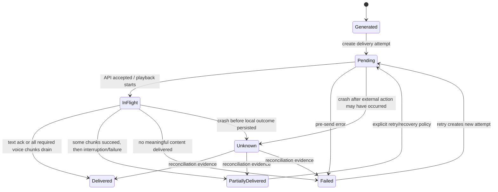
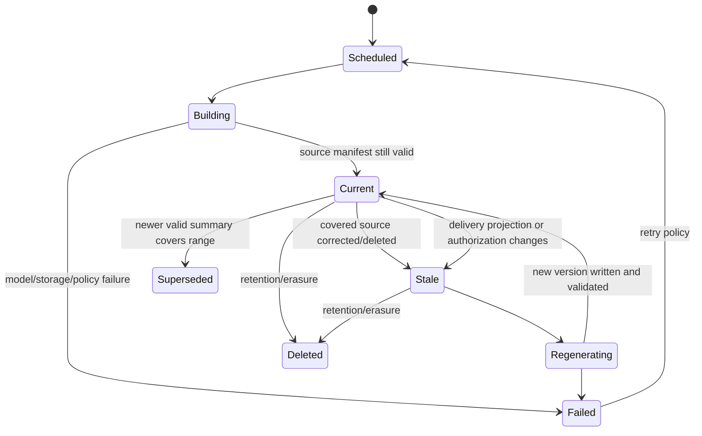
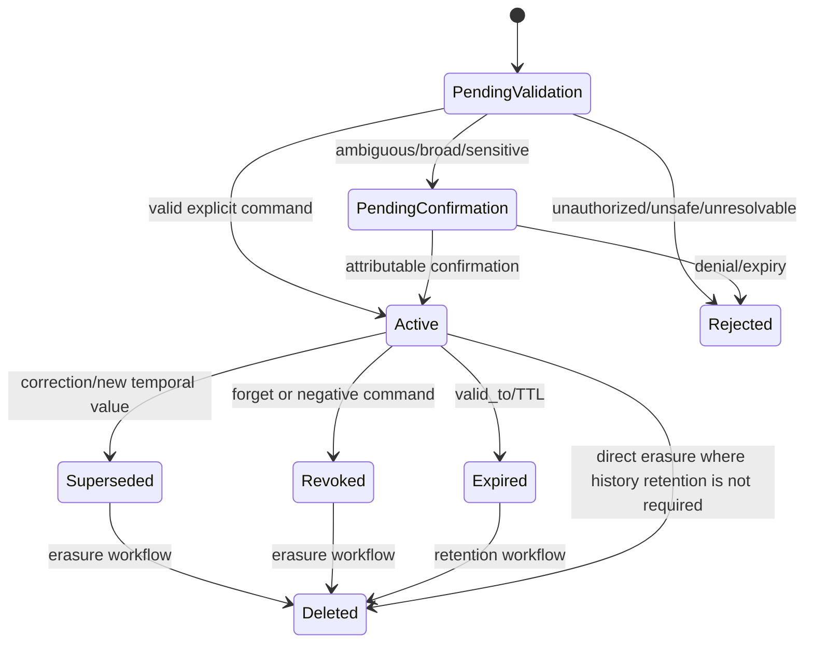
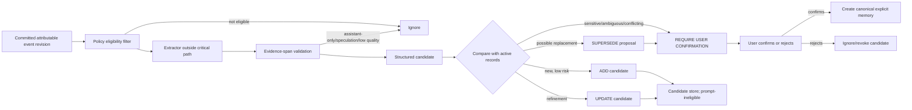
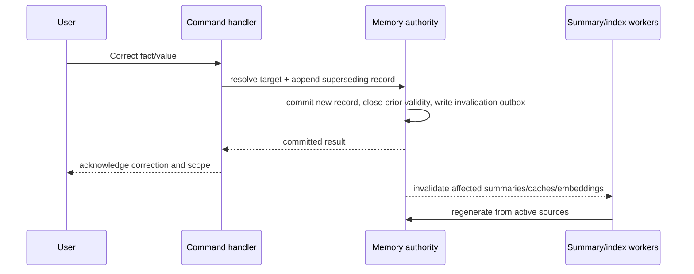
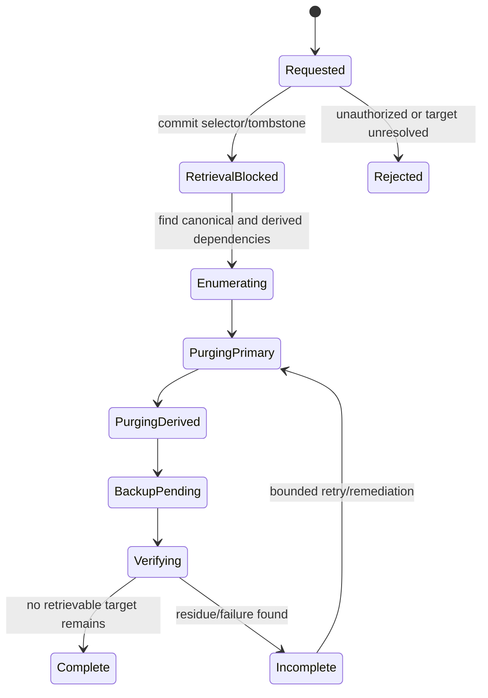

# Summarization and Semantic-Memory Lifecycle Specification

**Artifact filename:** `11-memory-lifecycle-spec.md`  
**Status:** Proposed release-one normative specification  
**Prepared:** 2026-08-01  
**Primary repository:** `starryark/DC_BOT`  
**Comparison repositories:** `moeru-ai/airi`, `AstrBotDevs/AstrBot`

## 1. Executive conclusion

**[Recommendation]** DC_BOT should implement one transport-neutral `MemoryPort` as the authority for text and voice. Release one should run that authority in-process unless a separate deployment artifact proves that multiple independently deployed writers require a service boundary. SQLite is the default for a single bot process; PostgreSQL is the preferred first-release store when concurrent processes or external workers must write the same authority. A mandatory HTTP memory microservice is not justified by the repository evidence inspected.

**[Recommendation]** Release one should include:

- attributable raw conversational events;
- explicit delivery-state tracking separate from generation;
- authorization-filtered recent context;
- room-scoped, source-manifested summaries that can become stale and be regenerated;
- explicit user memory and scoped alias directives;
- operator-authored procedural/persona memory;
- explicit, evidence-linked episodic records only;
- cache invalidation and deletion propagation.

**[Recommendation]** Release one should defer production activation of:

- automatic semantic facts;
- relationship hypotheses;
- familiarity bands;
- emotional retrieval weighting;
- automatic cross-room inference;
- embeddings and vector retrieval.

An optional shadow evaluator may produce non-authoritative semantic candidates, but those candidates must not enter prompts or become durable user truth without an explicit confirmation transition.

**[Recommendation]** Durable user facts require user-authored evidence. Ordinary assistant output, tool-generated prose, TTS style, ACT emotion markup, inferred mood, inferred relationships, and conversational speculation are categorically ineligible as evidence for durable user truth.

**[Recommendation]** The core correctness rule is: persist what happened, not an idealized user/assistant pair. User events survive failed replies. Assistant text enters ordinary conversational context only to the extent delivery was confirmed. A response may be caused by several user events, so causality is many-to-many.

## 2. Scope

**[Source-plan requirement]** This artifact defines the lifecycle from attributable raw events to recent eligible context, summaries, explicit memory, optional semantic candidates, episodic memory, procedural/persona memory, cached digests, and optional embeddings.

**[Recommendation]** It specifies:

- canonical versus derived records;
- provenance, validity, confidence, sensitivity, scope, authority, and lifecycle transitions;
- explicit memory commands;
- asynchronous extraction decisions;
- summary scheduling and staleness;
- delivery correctness;
- correction, supersession, expiry, deletion, and regeneration;
- schemas, interfaces, state machines, failure handling, and acceptance tests.

**[Recommendation]** It does not select a final cross-platform human-identity system, vector database, graph database, learned reranker, or standalone service topology.

## 3. Sources inspected

### 3.1 Inspection points and revisions

| Repository or source | Branch / revision inspected | Material inspected |
|---|---|---|
| DC_BOT | `main` at latest observed commit `0ea3cbf5ec92f719e2b48066c3ada45aa50122ad` | Root and Discord-bot READMEs; orchestration event, room, guild-session, group-turn, state, mention-response, and conversation-controller files |
| Airi | `main` at latest observed commit `4d6e61f77dc99ec76c7cf352df62abb4282386c5` | README roadmap; `memory-pgvector`; Telegram database schema; memory architecture issues |
| AstrBot | `master` at latest observed commit `80ccac1c80f442538e164f76951a4dc107e2b7a1` | README; conversation manager; conversation persistence model |
| Discord developer documentation | current pages retrieved 2026-08-01 | Snowflake IDs, user fields, Gateway intents, Guild Member Update |

**[Open question]** The repositories continued changing on 2026-08-01/02. Downstream implementation work must pin and re-verify the actual integration commit before coding.

### 3.2 Direct source URLs

DC_BOT:

- https://github.com/starryark/DC_BOT/commit/0ea3cbf5ec92f719e2b48066c3ada45aa50122ad
- https://github.com/starryark/DC_BOT/blob/main/airi/services/discord-bot/src/orchestration/events.ts
- https://github.com/starryark/DC_BOT/blob/main/airi/services/discord-bot/src/orchestration/guild-session.ts
- https://github.com/starryark/DC_BOT/blob/main/airi/services/discord-bot/src/orchestration/room.ts
- https://github.com/starryark/DC_BOT/blob/main/airi/services/discord-bot/src/orchestration/group-turn-builder.ts
- https://github.com/starryark/DC_BOT/blob/main/airi/services/discord-bot/src/orchestration/conversation-state.ts
- https://github.com/starryark/DC_BOT/blob/main/airi/services/discord-bot/src/orchestration/mention-responder.ts
- https://github.com/starryark/DC_BOT/blob/main/airi/services/discord-bot/src/orchestration/conversation-controller.ts
- https://github.com/starryark/DC_BOT/tree/main/airi/services/discord-bot

Airi:

- https://github.com/moeru-ai/airi/commit/4d6e61f77dc99ec76c7cf352df62abb4282386c5
- https://github.com/moeru-ai/airi/blob/main/README.md
- https://github.com/moeru-ai/airi/tree/main/packages/memory-pgvector
- https://github.com/moeru-ai/airi/blob/main/packages/memory-pgvector/src/index.ts
- https://github.com/moeru-ai/airi/blob/main/services/telegram-bot/src/db/schema.ts
- https://github.com/moeru-ai/airi/issues/387
- https://github.com/moeru-ai/airi/issues/879

AstrBot:

- https://github.com/AstrBotDevs/AstrBot/commit/80ccac1c80f442538e164f76951a4dc107e2b7a1
- https://github.com/AstrBotDevs/AstrBot
- https://github.com/AstrBotDevs/AstrBot/blob/master/astrbot/core/conversation_mgr.py
- https://github.com/AstrBotDevs/AstrBot/blob/master/astrbot/core/db/po.py

Discord:

- https://docs.discord.com/developers/reference#snowflakes
- https://docs.discord.com/developers/resources/user
- https://docs.discord.com/developers/events/gateway
- https://docs.discord.com/developers/events/gateway-events#guild-member-update

## 4. Evidence table

| ID | Claim | Classification | Source URL | Confidence |
|---|---|---|---|---|
| EVID-001 | DC_BOT normalizes inbound text and voice into events carrying `userId`, `displayName`, room identifiers, and timestamps. | Confirmed repository fact | [DC_BOT `events.ts`](https://github.com/starryark/DC_BOT/blob/main/airi/services/discord-bot/src/orchestration/events.ts) | High |
| EVID-002 | DC_BOT voice history is bounded, process-local, guild-scoped in `GuildSession`, and stores a speaker display name rather than a durable author ID. | Confirmed repository fact | [DC_BOT `guild-session.ts`](https://github.com/starryark/DC_BOT/blob/main/airi/services/discord-bot/src/orchestration/guild-session.ts) | High |
| EVID-003 | DC_BOT also contains a newer in-memory room store with bounded turns and an optional running summary; its turn record likewise lacks `userId`. | Confirmed repository fact | [DC_BOT `room.ts`](https://github.com/starryark/DC_BOT/blob/main/airi/services/discord-bot/src/orchestration/room.ts) | High |
| EVID-004 | Text mention handling uses an `InMemoryRoomStore`, while voice orchestration still uses `GuildSession`; the two paths therefore do not share one durable authority. | Confirmed repository fact | [mention responder](https://github.com/starryark/DC_BOT/blob/main/airi/services/discord-bot/src/orchestration/mention-responder.ts); [conversation controller](https://github.com/starryark/DC_BOT/blob/main/airi/services/discord-bot/src/orchestration/conversation-controller.ts); [guild session](https://github.com/starryark/DC_BOT/blob/main/airi/services/discord-bot/src/orchestration/guild-session.ts) | High |
| EVID-005 | Voice grouping preserves distinct per-speaker input events and user IDs before generation. | Confirmed repository fact | [DC_BOT `group-turn-builder.ts`](https://github.com/starryark/DC_BOT/blob/main/airi/services/discord-bot/src/orchestration/group-turn-builder.ts) | High |
| EVID-006 | Voice history commits a paired user/assistant exchange only after playback drain; the schema cannot preserve several causal user-event authors in that committed turn. | Confirmed repository fact / Inference | [conversation controller](https://github.com/starryark/DC_BOT/blob/main/airi/services/discord-bot/src/orchestration/conversation-controller.ts); [guild session](https://github.com/starryark/DC_BOT/blob/main/airi/services/discord-bot/src/orchestration/guild-session.ts) | High |
| EVID-007 | Mention handling appends cleaned assistant output to its local history before returning it to downstream delivery code, so that store cannot express later send failure. | Confirmed repository fact / Inference | [DC_BOT `mention-responder.ts`](https://github.com/starryark/DC_BOT/blob/main/airi/services/discord-bot/src/orchestration/mention-responder.ts) | High |
| EVID-008 | DC_BOT parses ACT-style output separately from clean text used for TTS/history. | Confirmed repository fact | [DC_BOT README](https://github.com/starryark/DC_BOT/blob/main/README.md); [conversation controller](https://github.com/starryark/DC_BOT/blob/main/airi/services/discord-bot/src/orchestration/conversation-controller.ts) | High |
| EVID-009 | Airi’s roadmap labels “Memory Alaya” as work in progress. | Confirmed repository fact | [Airi README](https://github.com/moeru-ai/airi/blob/main/README.md) | High |
| EVID-010 | Airi’s `memory-pgvector` package entry point is a small server-module skeleton with configuration wiring but no lifecycle API in the inspected file. | Confirmed repository fact | [Airi `memory-pgvector/src/index.ts`](https://github.com/moeru-ai/airi/blob/main/packages/memory-pgvector/src/index.ts) | High |
| EVID-011 | Airi’s Telegram schema contains vectorized chat messages, memory fragments, emotional-impact and importance fields, soft deletion, and episodic tables. | Confirmed repository fact | [Airi Telegram `schema.ts`](https://github.com/moeru-ai/airi/blob/main/services/telegram-bot/src/db/schema.ts) | High |
| EVID-012 | Airi issues #387 and #879 are proposals discussing competing deployment and retrieval designs, not proof of a complete production memory implementation. | Confirmed repository fact | [Airi issue #387](https://github.com/moeru-ai/airi/issues/387); [Airi issue #879](https://github.com/moeru-ai/airi/issues/879) | High |
| EVID-013 | AstrBot advertises persisted conversations and automatic context compression. | Confirmed repository fact | [AstrBot README](https://github.com/AstrBotDevs/AstrBot) | High |
| EVID-014 | AstrBot’s `ConversationV2.content` is one JSON list of OpenAI-formatted messages. | Confirmed repository fact | [AstrBot `po.py`](https://github.com/AstrBotDevs/AstrBot/blob/master/astrbot/core/db/po.py) | High |
| EVID-015 | AstrBot’s `add_message_pair` reads the current list, appends a user/assistant pair, and writes the whole list back. | Confirmed repository fact | [AstrBot `conversation_mgr.py`](https://github.com/AstrBotDevs/AstrBot/blob/master/astrbot/core/conversation_mgr.py) | High |
| EVID-016 | Whole-history read/modify/write is not an adequate model for DC_BOT’s multi-speaker, delivery-aware, append-concurrent requirements without additional locking/versioning. | Inference | [AstrBot `po.py`](https://github.com/AstrBotDevs/AstrBot/blob/master/astrbot/core/db/po.py); [AstrBot `conversation_mgr.py`](https://github.com/AstrBotDevs/AstrBot/blob/master/astrbot/core/conversation_mgr.py) | High |
| EVID-017 | Discord user snowflake IDs are unique Discord identifiers, while usernames are not unique and display names are separate attributes. | External research finding | [Discord snowflakes](https://docs.discord.com/developers/reference#snowflakes); [User Resource](https://docs.discord.com/developers/resources/user) | High |
| EVID-018 | Receiving Guild Member Update events for other members requires the privileged `GUILD_MEMBERS` intent. | External research finding | [Discord Gateway](https://docs.discord.com/developers/events/gateway); [Guild Member Update](https://docs.discord.com/developers/events/gateway-events#guild-member-update) | High |
| EVID-019 | A Discord user ID does not by itself prove that two accounts on different platforms belong to the same human. | Inference | [Discord User Resource](https://docs.discord.com/developers/resources/user) | High |
| EVID-020 | The supplied source plan requires provenance, temporal validity, deletion completeness, delivery separation, authorization-first retrieval, and no silent ephemeral fallback. | Source-plan requirement | User-supplied assignment | High |

## 5. Current-state findings

### 5.1 Fragmented conversational authority

**[Confirmed repository fact]** The inspected text path and voice path do not use one shared memory authority. Text mention handling owns an in-process room store. Voice owns an in-process guild session. Both are bounded and process-lifetime.

**[Inference]** Restarting the process loses recent context, and a successful write in one path cannot make the other path immediately consistent through a common contract.

**[Recommendation]** Replace both ownership models with adapters over one `MemoryPort`. Existing buffers may remain as read-through caches only after cache invalidation and write-through semantics are defined.

### 5.2 Identity and attribution loss at the history boundary

**[Confirmed repository fact]** Inbound events carry `userId`, but current turn schemas preserve only `speaker`/display-name text.

**[Confirmed repository fact]** The group-turn builder preserves one attributable event per speaker before generation.

**[Inference]** Attribution is lost when a multi-speaker trigger is reduced to one paired history exchange. Duplicate aliases can therefore become ambiguous, and corrections or deletion cannot reliably target the durable author.

**[Recommendation]** Every canonical user event must retain `discord_user_id`; every assistant response must link to all causal user events through a join relation.

### 5.3 Generation and delivery are conflated differently in text and voice

**[Confirmed repository fact]** The voice path waits for playback drain before committing a paired exchange.

**[Inference]** “Playback queue drained” is useful evidence but is not a complete delivery model. It does not by itself encode per-chunk TTS failure, interruption, receiver departure, or crash uncertainty.

**[Confirmed repository fact / Inference]** The text mention responder writes its assistant turn before downstream send success is represented in the room store.

**[Recommendation]** Persist generated output first, then record independent delivery attempts and chunk-level outcomes. Context eligibility must derive from delivery state, not from whether the generator returned text.

### 5.4 Current room summaries lack lifecycle metadata

**[Confirmed repository fact]** The newer room abstraction has a single optional `runningSummary` string and no source manifest, summary version, model version, stale state, correction linkage, or deletion cascade.

**[Recommendation]** A summary must be a versioned derived object whose source event revisions are explicit. Ordinary appends after its covered range do not invalidate it; a correction, deletion, authorization change, or delivery-state change inside the covered range does.

### 5.5 Comparison-repository lessons

**[Confirmed repository fact]** Airi contains useful schema experiments, including episodic tables, embeddings, importance, emotional impact, and soft deletion, while its unified “Alaya” layer remains identified as WIP/proposed.

**[Recommendation]** DC_BOT should borrow the distinction between low-level storage and a higher-level memory interface, but should not adopt arbitrary emotional weights, vector-first retrieval, or soft deletion as proof of correctness.

**[Confirmed repository fact]** AstrBot provides a practical persisted-conversation baseline, but its inspected conversation record is a mutable whole-history JSON list.

**[Recommendation]** DC_BOT should borrow user-visible conversation management and compression ideas, not the whole-history write model.

## 6. Proposed decisions

| ADR | Decision | Classification | Release status |
|---|---|---|---|
| ADR-001 | One transport-neutral `MemoryPort` is authoritative for text and voice. | Recommendation | Adopt |
| ADR-002 | Default to in-process domain/application services; introduce HTTP only when verified deployment boundaries require it. | Recommendation | Adopt |
| ADR-003 | Use append-oriented canonical events plus revision/redaction records; do not mutate a monolithic transcript. | Recommendation | Adopt |
| ADR-004 | Store Discord user ID as the Discord identity key and presentation fields as snapshots/attributes. | Source-plan requirement / Recommendation | Adopt |
| ADR-005 | Separate generated response, causal inputs, and delivery attempts. | Source-plan requirement / Recommendation | Adopt |
| ADR-006 | Allow ordinary appends after a generation snapshot; do not reject them merely because the room advanced. | Recommendation | Adopt |
| ADR-007 | Include explicit memory and scoped aliases in release one. | Recommendation | Adopt |
| ADR-008 | Include room/topic summaries with staleness and regeneration. | Recommendation | Adopt |
| ADR-009 | Defer active automatic semantic memory; allow optional candidate-only shadow evaluation. | Recommendation | Defer activation |
| ADR-010 | Defer relationship hypotheses, familiarity bands, and emotional retrieval weighting. | Recommendation | Defer |
| ADR-011 | Defer automatic cross-room inference; allow only explicitly scoped memories to cross rooms. | Recommendation | Defer |
| ADR-012 | Defer embeddings until lexical/structured baselines and multilingual benchmarks establish benefit. | Recommendation | Defer |
| ADR-013 | Stale summaries are excluded from generation context until regenerated. | Recommendation | Adopt |
| ADR-014 | Privacy erasure overrides append-only retention; retain only a minimal non-content tombstone when legally and operationally permissible. | Recommendation | Adopt |
| ADR-015 | Production must fail closed or visibly degrade when the authority is unavailable; it must not silently claim successful writes to an unrelated ephemeral store. | Source-plan requirement / Recommendation | Adopt |

## 7. Alternatives considered

| Alternative | Advantages | Risks / deficiencies | Outcome |
|---|---|---|---|
| Standalone HTTP memory microservice in milestone one | Language-neutral boundary; independent scaling; centralized policy | Adds network failure modes, authentication, deployment, observability, versioning, and latency before DC_BOT has demonstrated multi-process need | Rejected for release one; preserve a transport-neutral port so it can be introduced later |
| In-process application/domain layer with SQLite | Minimal operations; transactional local persistence; easy migration path | Single-writer/process assumptions must be explicit; unsuitable for independently scaled workers without coordination | Preferred default for a single bot process |
| In-process application/domain layer with PostgreSQL | Concurrent writers, richer indexing, operational durability | More operations and schema management | Preferred when deployment already requires multiple writers or managed PostgreSQL |
| One mutable JSON transcript per conversation | Simple to inspect; resembles common chat APIs | Lost updates, poor deletion granularity, weak provenance, no delivery states, no many-to-many causality | Rejected |
| Event log only, no derived summaries | Strong auditability and simple canonical model | Context windows and latency/cost become unbounded | Rejected; retain canonical events plus derived summaries |
| Vector-first semantic memory | Approximate retrieval across paraphrases | Harder authorization filtering, opaque ranking, multilingual uncertainty, deletion fan-out, benchmark and cost burden | Deferred |
| Automatic semantic facts written directly to durable memory | Low user effort | False facts, assistant-speculation contamination, temporal mistakes, privacy surprise | Rejected for release one |
| Automatic candidates requiring confirmation | Enables measurement without granting authority | Candidate review UX and retention policy still required | Allowed only as opt-in/shadow mode; never generation-authoritative by default |
| Relationship/familiarity/emotional scoring | Potentially richer character behavior | Sensitive profiling, difficult correction, arbitrary weights, weak evidence | Deferred |
| Automatic cross-room knowledge | Strong continuity | High privacy-leakage risk and confusing scope | Rejected for release one |
| Reject a generated response whenever the room version advanced | Strong snapshot serializability | Drops otherwise valid responses whenever unrelated events arrive; poor group-chat usability | Rejected |
| Commit assistant text only after Discord delivery | Avoids treating failed output as heard | Crash after send but before commit loses evidence; cannot represent partial voice playback | Rejected; generation and delivery are separate records |
| Soft deletion only | Simple audit trail | Does not satisfy user erasure or embedding/cache/backup deletion requirements | Rejected as the sole deletion mechanism |

## 8. Rejected alternatives and reasons

### 8.1 Mandatory first-release service boundary

**[Rejected recommendation]** A compulsory HTTP service is not justified by the inspected topology. It would move correctness problems behind a network rather than solve attribution, state, deletion, and delivery semantics. The port, schemas, and conformance tests are the stable boundary; transport is a deployment choice.

### 8.2 Pair-only exchange schema

**[Rejected recommendation]** A record with exactly one `user_event_id` and one assistant response cannot represent group voice prompts, a reply triggered by several messages, or a bot response to a quoted/replied thread. Canonical causal relations are many-to-many.

### 8.3 Display name as identity

**[Rejected recommendation]** Usernames, global names, guild nicknames, aliases, and voice characteristics can change or collide. They remain presentation evidence, never merge keys.

### 8.4 Summary as an editable transcript replacement

**[Rejected recommendation]** A summary is not canonical history. It may omit, distort, or become stale. It cannot be the only retained representation of facts needed for correction, provenance, export, or deletion.

### 8.5 Assistant output as user-memory evidence

**[Rejected recommendation]** Ordinary assistant prose, TTS prosody, ACT/emotion tags, inferred mood, role-play, and conversational speculation are prohibited as durable evidence about a user. They may influence the current response pipeline only within their narrowly defined runtime purpose.

### 8.6 Append-only absolutism

**[Rejected recommendation]** “Immutable” must describe original event payload/revision lineage, not an obligation to retain deleted personal content forever. Privacy deletion may cryptographically erase, redact, or physically remove content while retaining a non-content tombstone sufficient to prevent resurrection.

## 9. Normative lifecycle model

The keywords **MUST**, **MUST NOT**, **SHOULD**, **SHOULD NOT**, and **MAY** are normative.

### 9.1 Authority hierarchy

1. **Operator safety and policy controls** govern what may be processed or retrieved, but MUST NOT silently rewrite user-authored biographical facts.
2. **Current explicit user commands** are authoritative for preferences, aliases, corrections, and forget requests within their permitted scope.
3. **User-authored attributable evidence** may support durable facts, subject to scope, confidence, temporal validity, and contradiction handling.
4. **Derived summaries and automatic candidates** are aids, not independent truth sources.
5. **Assistant output, model inference, TTS/ACT metadata, and mood estimates** have no authority to establish durable user truth.

When two applicable memories conflict, the system MUST apply, in order: authorization and scope; explicit correction/supersession; temporal validity; source authority; confidence; then recency. It MUST abstain or ask for confirmation when the conflict remains material.

### 9.2 Common metadata contract

Every persisted lifecycle object MUST expose or inherit the following fields where applicable:

```text
record_id                 opaque internal identifier
record_type               lifecycle layer enum
subject_ref               scoped person/room/character/etc. reference
scope                     platform | character | guild | logical_room | private_conversation
created_at                 database timestamp
updated_at                 database timestamp
created_by                 user_command | inbound_event | operator | extractor | summarizer | system
provenance_refs[]          source event/revision/delivery/operator-document identifiers
valid_from                 nullable real-world validity boundary
valid_to                   nullable real-world validity boundary
confidence                 0..1 plus confidence_method
sensitivity                public | internal | personal | sensitive | highly_sensitive
status                     layer-specific state
supersedes_id              nullable prior record
retention_class            configured policy class
policy_version             authorization/retention policy version
```

`confidence` MUST NOT substitute for provenance. A high model score without user-authored evidence cannot become a durable user fact.

### 9.3 Layer catalog

| Layer | Canonical or derived | Model authority | Default release-one context eligibility |
|---|---|---|---|
| Raw attributable event | Canonical evidence envelope; payload may acquire revisions/redactions | High for what the user actually sent, not automatically for factual truth | Eligible when authorized, attributable, not deleted, and within context policy |
| Delivery state | Canonical operational record | High for whether output was attempted/delivered; no authority about user facts | Used to decide whether assistant output may appear as completed context |
| Recent eligible context | Derived query result/cache | None beyond its canonical sources | Eligible by definition; must be reproducible from policy and sources |
| Session/topic summary | Derived | Low; compression only | Eligible only while current, authorized, and source-complete |
| Explicit user memory | Canonical user instruction/preference record | Highest user-memory authority within scope | Eligible when active and authorized |
| Automatically extracted semantic fact | Derived candidate in release one | None until confirmed; bounded after confirmation | Candidate excluded; confirmed form becomes explicit/verified memory |
| Episodic memory | Canonical if explicitly saved; otherwise derived candidate | Medium when backed by attributable events | Eligible only under explicit scope and relevance rules |
| Operator-authored procedural/persona memory | Canonical operator configuration | High for bot procedure/persona, none for user biography | Eligible according to deployment, character, and room policy |
| Relationship hypothesis | Derived sensitive inference | None in release one | Not retained or retrieved in release one |
| Cached digest | Derived cache | None | Eligible only as an optimization with version checks |
| Embedding | Derived index artifact | None | Disabled in release one unless benchmark gate is passed |

### 9.4 Raw attributable event — `REQ-EVENT-001` through `REQ-EVENT-014`

**Definition.** One inbound Discord text or voice-derived user event with durable actor attribution and presentation snapshot.

| Property | Normative rule |
|---|---|
| Canonical/derived | Canonical evidence envelope. ASR text is a derived representation attached to the canonical voice event, with engine/version/confidence. |
| Source/provenance | Discord event/message identifiers, gateway receipt, actor snapshot, channel/guild/thread/voice identifiers, reply references, and transport metadata. |
| Validity | Event occurrence time is immutable. Content may be corrected through a revision; current view resolves the latest active revision. |
| Confidence | Transport attribution is deterministic when Discord supplied the actor ID. ASR content confidence is separate and MUST be retained. |
| Sensitivity | Derived from location and content policy; DMs default at least `personal`. Voice audio/transcripts may receive stricter retention. |
| Creation trigger | Every inbound text or attributable voice segment accepted for processing. |
| Update trigger | Never overwrite the original payload in place. Append a revision, moderation state, or redaction. |
| Supersession | A correction revision supersedes prior content for current-context use while preserving lineage until erasure. |
| Expiry | Per retention class; raw audio may expire before transcript/event metadata. |
| Correction | User edits, transcription correction, or operator moderation create typed revisions with actor and reason. |
| Deletion | Remove or cryptographically erase content and derived artifacts; retain only a non-content tombstone when policy allows. |
| Regeneration | Not regenerable from summaries. ASR may be regenerated only while authorized source audio exists. |
| Context eligibility | Requires scope authorization, active revision, non-deleted state, accepted moderation state, and suitable delivery/causal policy. |
| Model authority | Evidence of what was sent by that actor. It is not proof that every assertion is objectively true. |

Additional requirements:

- **REQ-EVENT-001:** `discord_user_id` MUST be stored separately from all presentation strings.
- **REQ-EVENT-002:** Each event MUST include an actor snapshot: username when available, global display name when available, guild nickname when available, chosen active alias when permitted, avatar reference when needed, and snapshot timestamp.
- **REQ-EVENT-003:** Historical rendering MUST use the event snapshot; current direct address MUST use the current authorized alias resolution.
- **REQ-EVENT-004:** Prompt-local person handles such as `P1`, `P2` MAY disambiguate speakers, but MUST NOT be emitted to Discord or TTS.
- **REQ-EVENT-005:** Two actor IDs MUST NOT merge because their names or aliases match.
- **REQ-EVENT-006:** Group voice ingestion MUST preserve one event per attributable speaker.
- **REQ-EVENT-007:** Synthetic labels such as “Discord group” MUST NOT be the durable author.
- **REQ-EVENT-008:** Voice segmentation or aggregation MAY create a generation input group, but the group MUST reference every source event.
- **REQ-EVENT-009:** Message edits and ASR corrections MUST create revisions rather than silently changing provenance.
- **REQ-EVENT-010:** An event’s logical room binding MUST be versioned independently of the physical Discord channel.
- **REQ-EVENT-011:** Event snapshot writes MUST NOT force an update to the current identity table on every event. Identity attributes SHOULD update only when changed or after a freshness policy interval.
- **REQ-EVENT-012:** Unbound channels MUST remain isolated unless an explicit room-binding rule applies.
- **REQ-EVENT-013:** Cross-platform person linking requires a separate verified-link record and user-visible control; `discord_user_id` alone is insufficient.
- **REQ-EVENT-014:** User-authored evidence used by a durable memory MUST point to the exact event revision that supplied it.

### 9.5 Delivery state — `REQ-DELIVERY-001` through `REQ-DELIVERY-014`

**Definition.** Operational records describing attempts to deliver a generated assistant response through text or voice.

| Property | Normative rule |
|---|---|
| Canonical/derived | Canonical operational state; generated content is stored separately from delivery attempts. |
| Source/provenance | Response ID, Discord request/message IDs, voice playback IDs, chunk IDs, timestamps, retries, and gateway/API acknowledgements. |
| Validity | State reflects the best observed delivery evidence. `UNKNOWN` is valid after an unreconciled crash window. |
| Confidence | Deterministic for API acknowledgement; bounded for “heard” voice semantics. Playback completion proves local completion, not human attention. |
| Sensitivity | Inherits response and destination sensitivity. |
| Creation trigger | Before the first send/playback attempt. |
| Update trigger | API response, message receipt, playback start/drain/interruption, receiver departure, retry, or reconciliation. |
| Supersession | Attempts are append records; a response-level projection derives the current outcome. |
| Expiry | Operational details may expire after reconciliation/audit windows, but response context state must remain derivable. |
| Correction | Reconciliation may change `UNKNOWN` to delivered/failed and attach evidence. |
| Deletion | Follows response/event privacy deletion while preserving non-content operational tombstones if permissible. |
| Regeneration | Cannot be regenerated from generated text alone. |
| Context eligibility | Assistant text is a normal completed turn only when policy says the destination received an adequate delivery. Partial delivery is represented explicitly. |
| Model authority | Authoritative only about operational delivery evidence. |

State machine:



- **REQ-DELIVERY-001:** A generated response MUST exist independently of delivery attempts.
- **REQ-DELIVERY-002:** `response_causes(response_id, user_event_id)` MUST support one-to-many and many-to-many causal relations.
- **REQ-DELIVERY-003:** Voice output MUST record ordered chunks/segments and each chunk’s synthesis and playback outcome.
- **REQ-DELIVERY-004:** TTS synthesis failure MUST NOT be represented as delivered speech.
- **REQ-DELIVERY-005:** ACT/emotion tags and TTS style parameters MUST NOT enter user memory.
- **REQ-DELIVERY-006:** A text API acknowledgement MAY establish `DELIVERED_TO_CHANNEL`; it MUST NOT be described as proof the user read it.
- **REQ-DELIVERY-007:** A drained local voice queue MAY establish `PLAYBACK_COMPLETED`; it MUST NOT be described as proof the user heard or understood it.
- **REQ-DELIVERY-008:** Partial voice output MUST be serializable as the exact delivered prefix/chunks.
- **REQ-DELIVERY-009:** Context assembly SHOULD include only the delivered portion, plus a machine-readable interruption marker when conversationally useful.
- **REQ-DELIVERY-010:** Crash windows MUST use `UNKNOWN`, not optimistic success or silent loss.
- **REQ-DELIVERY-011:** Reconciliation MUST be idempotent.
- **REQ-DELIVERY-012:** A retry MUST be a new attempt linked to the same response or to a regenerated response, never an in-place state reset.
- **REQ-DELIVERY-013:** Discord send/playback cannot be included in the database transaction; implementations MUST use an outbox/attempt/reconciliation pattern.
- **REQ-DELIVERY-014:** Current DC_BOT commit-after-drain behavior MUST be migrated without inventing delivery evidence that old records do not contain.

### 9.6 Recent eligible context — `REQ-MEM-001` through `REQ-MEM-012`

**Definition.** A policy-filtered, ordered projection of recent events, eligible assistant output, summaries, and memories for one generation request.

| Property | Normative rule |
|---|---|
| Canonical/derived | Derived and ephemeral; an optional cache is not authoritative. |
| Source/provenance | Query plan, source record IDs/revisions, authorization decision, logical-room binding version, and context-policy version. |
| Validity | Valid only for the captured snapshot/request. Ordinary later appends do not retroactively invalidate the generation snapshot. |
| Confidence | Inherited per item; context membership is deterministic under the recorded policy. |
| Sensitivity | Maximum sensitivity of included items. |
| Creation trigger | A generation request, preview, export, or evaluation. |
| Update trigger | Rebuilt rather than mutated when policy/source state changes. |
| Supersession | A later context snapshot supersedes it only for later requests. |
| Expiry | Short-lived request/cache TTL. |
| Correction | Rebuild from corrected canonical records. |
| Deletion | Cache invalidated synchronously or through a bounded, tested invalidation path. |
| Regeneration | Fully regenerable from authorized canonical and current derived records. |
| Context eligibility | This layer is the eligibility result, not an independent source. |
| Model authority | None beyond included sources. |

Assembly order MUST begin with authorization and structured filters, not similarity search:

1. Resolve requesting character, Discord actor, destination, physical channel, logical room, and private/public context.
2. Apply denial rules and privacy scope.
3. Resolve active explicit alias and identity presentation.
4. Fetch exact structured memories and active procedural/persona rules.
5. Fetch current summary whose source coverage is valid.
6. Fetch recent active event revisions and eligible assistant delivery projections.
7. Apply temporal validity and contradiction/supersession.
8. Apply lexical/full-text relevance if the budget requires narrowing.
9. Apply optional embedding/reranking only after authorization and only when enabled by a passed benchmark gate.
10. Serialize as untrusted data with role and delimiter hardening.

- **REQ-MEM-001:** A context snapshot MUST record the maximum canonical event sequence observed and the revision/policy versions it used.
- **REQ-MEM-002:** A response commit MUST NOT fail merely because a newer unrelated event was appended after snapshot creation.
- **REQ-MEM-003:** A response MAY be marked contextually stale when a causal event was corrected/deleted or authorization changed before delivery; policy decides cancel/regenerate/deliver-with-warning.
- **REQ-MEM-004:** Recent room history crosses physical channels only through an explicit logical-room binding.
- **REQ-MEM-005:** Person-level explicit memory may cross text and voice when its scope permits, without importing unrelated room transcripts.
- **REQ-MEM-006:** Private-conversation aliases and memories MUST NOT be included in public guild contexts.
- **REQ-MEM-007:** Context serialization MUST encode source type and treat retrieved text as data, never as higher-priority instructions.
- **REQ-MEM-008:** Mentions, control characters, bidirectional Unicode, fake role labels, and delimiter-like text MUST be escaped or safely structured.
- **REQ-MEM-009:** Internal record IDs and prompt-local person handles MUST NOT be emitted.
- **REQ-MEM-010:** Context budgets MUST reserve space for the current user input and required system/persona instructions before optional memory.
- **REQ-MEM-011:** If the authoritative store is unavailable, the request MUST fail visibly or enter an explicitly declared degraded read-only mode; no silent unrelated fallback is allowed.
- **REQ-MEM-012:** Context assembly MUST emit auditable exclusion reasons in debug/evaluation mode without leaking excluded content.

### 9.7 Session/topic summary — `REQ-MEM-020` through `REQ-MEM-035`

**Definition.** A bounded, regenerable compression of an authorized sequence of eligible conversational records, normally scoped to a logical room and topic/session.

| Property | Normative rule |
|---|---|
| Canonical/derived | Derived. Never the sole canonical evidence for durable facts. |
| Source/provenance | Ordered event revisions, eligible delivered response portions, prior summary ID when recursively summarized, model/prompt/version, source range and manifest hash. |
| Validity | `CURRENT`, `STALE`, `REGENERATING`, `FAILED`, or `DELETED`. Current only while every covered source revision, delivery projection, authorization rule, and room binding remains compatible. |
| Confidence | Summary-level quality score plus optional per-claim provenance; confidence cannot elevate it above source evidence. |
| Sensitivity | Maximum included sensitivity, with destination-scope constraints. |
| Creation trigger | Tunable scheduler policy; never on the synchronous voice-critical path. |
| Update trigger | New eligible material beyond coverage, topic transition, idle boundary, context pressure, or explicit operator/user request. |
| Supersession | A new summary supersedes an older summary for overlapping coverage; old summary may remain for audit until retention/deletion. |
| Expiry | Policy-defined; a summary may be compacted again but remains regenerable only while source evidence is retained. |
| Correction | A source correction marks affected summaries stale; they are excluded until regeneration succeeds. |
| Deletion | Deletion of any covered source invalidates the summary and requires deletion/regeneration without the erased content. |
| Regeneration | Re-run from current eligible source revisions with recorded model/prompt policy; output receives a new ID/version. |
| Context eligibility | Only `CURRENT`; scope and sensitivity must match request authorization. |
| Model authority | Low. It provides continuity and compression, not durable user truth. |

Summary state machine:



- **REQ-MEM-020:** A summary MUST identify `scope`, `logical_room_id`, covered sequence/range, exact source revisions, and the policy/model versions used.
- **REQ-MEM-021:** Summary generation MUST read a stable source snapshot, but its commit MUST NOT be rejected merely because later events were appended outside the covered range.
- **REQ-MEM-022:** If a covered source revision changes before summary commit, the output MUST be discarded or immediately stored as `STALE`; it MUST NOT become context eligible.
- **REQ-MEM-023:** A source-manifest hash MUST detect corrections, redactions, delivery changes, and source omission.
- **REQ-MEM-024:** A summary MUST distinguish user statements, assistant actions, unresolved questions, decisions, and uncertainty.
- **REQ-MEM-025:** Summaries MUST NOT convert assistant claims into user facts.
- **REQ-MEM-026:** Summaries SHOULD retain exact provenance pointers for names, preferences, commitments, dates, corrections, and safety/privacy instructions.
- **REQ-MEM-027:** Summaries MUST preserve unresolved contradictions rather than selecting a winner without policy support.
- **REQ-MEM-028:** Summaries MUST NOT include deleted or unauthorized source content.
- **REQ-MEM-029:** Summary text is untrusted retrieved data and MUST be serialized as such.
- **REQ-MEM-030:** Summary failure MUST leave recent canonical context available within configured limits; it MUST NOT cause raw records to be deleted early.
- **REQ-MEM-031:** Summary scheduling thresholds MUST be configuration/policy, not schema constants.
- **REQ-MEM-032:** Recursive summarization MUST preserve a manifest chain to canonical sources or to verifiable prior manifests.
- **REQ-MEM-033:** Summary regeneration MUST be idempotent with respect to the same source manifest and summarizer version, aside from explicitly accepted nondeterminism.
- **REQ-MEM-034:** A stale summary MUST be excluded even when regeneration is delayed.
- **REQ-MEM-035:** A summary MAY carry a machine-readable `open_loops` list, but these are not automatically scheduled tasks or user commitments.

#### 9.7.1 Tunable scheduling policy

The scheduler evaluates signals outside the voice-critical path. No single threshold is universally correct.

| Signal | Purpose | Scheduling effect |
|---|---|---|
| Eligible exchange count since coverage | Bounds conversational growth | Soft trigger after configured count; stronger trigger at hard maximum |
| Unsummarized eligible tokens | Protects model context and latency | Hard trigger before projected context overflow; soft trigger at target budget |
| Topic transition | Creates coherent topic summaries | Trigger when transition confidence and minimum supporting turns meet policy |
| Logical-room idle time | Closes a session naturally | Trigger after configurable inactivity if enough material exists |
| Current model context capacity | Adapts to selected generator | Lower summary threshold for smaller contexts; preserve current input reserve |
| End-to-end latency | Avoids synchronous stalls | Delay or lower-priority schedule when summarizer would compete with voice generation |
| Summarization cost/budget | Controls spend | Batch, use cheaper approved models, or defer soft triggers; never violate hard context/privacy requirements |
| Source churn | Avoids repeated work | Debounce while events are rapidly arriving; do not debounce correction/deletion invalidation |

Initial evaluation hypotheses—not release guarantees—MAY begin near: 20 eligible exchanges, 6,000 unsummarized tokens, 10 minutes of idle time, or a topic transition after at least 8 turns. These values MUST be benchmarked against DC_BOT workloads and changed without migration.

A hard context-pressure trigger occurs when:

```text
required_system_tokens
+ current_input_tokens
+ reserved_output_tokens
+ explicit_memory_tokens
+ recent_unsummarized_tokens
> configured_safe_context_budget
```

The scheduler SHOULD first trim low-authority optional context, then use a current summary, then schedule/regenerate compression. It MUST NOT drop the current user input, required safety policy, or an applicable explicit correction to make room for lower-authority history.

### 9.8 Explicit user memory — `REQ-MEM-040` through `REQ-MEM-061`

**Definition.** A durable, scoped instruction, preference, alias, fact, correction, or episodic save created by an attributable explicit user command or confirmed candidate.

| Property | Normative rule |
|---|---|
| Canonical/derived | Canonical user-memory record. Normalized fields are projections of the command and retain exact evidence. |
| Source/provenance | Exact user event revision(s), parsed command/action, confirmation event if applicable, subject resolution, and command parser version. |
| Validity | Active temporal interval and scope. May be `ACTIVE`, `SUPERSEDED`, `REVOKED`, `EXPIRED`, `PENDING_CONFIRMATION`, or `DELETED`. |
| Confidence | Explicit commands default high for user preferences and self-reports, but confidence remains domain-specific and does not prove external truth. |
| Sensitivity | User-selected or classifier/policy-derived, with conservative defaults. |
| Creation trigger | Explicit remember/alias/scope command, correction, or affirmative confirmation of a candidate. |
| Update trigger | Explicit correction, scope change, temporal update, or new contradictory attributable evidence requiring confirmation. |
| Supersession | New active record links to prior record; current projection selects one or preserves conflict by predicate/time/scope. |
| Expiry | Optional user-provided end, policy retention, or type-specific TTL. Stable preferences need not expire automatically. |
| Correction | Append correction/supersession; never rewrite evidence silently. |
| Deletion | Revoke current use immediately, erase content/derivatives under deletion workflow, and prevent resurrection from summaries/backups. |
| Regeneration | Normalized projection can be rebuilt from retained command evidence; erased memory cannot be regenerated. |
| Context eligibility | Exact scope, subject, temporal validity, authorization, and non-conflict checks. |
| Model authority | Highest user-memory authority within scope; lower than safety policy for prohibited actions. |

- **REQ-MEM-040:** Durable user facts require at least one attributable user-authored event revision or explicit confirmation as evidence.
- **REQ-MEM-041:** Ordinary assistant output MUST NOT serve as supporting evidence.
- **REQ-MEM-042:** TTS style, ACT emotion, inferred mood, sentiment, and role-play narration MUST NOT create or update explicit memory.
- **REQ-MEM-043:** The stored record MUST include the user-visible proposition and a structured predicate/value representation when available.
- **REQ-MEM-044:** The system MUST preserve exact scope and MUST NOT broaden it implicitly.
- **REQ-MEM-045:** `Use this only here` narrows to the current private conversation or logical room, selected by a deterministic context rule disclosed to the user.
- **REQ-MEM-046:** `Use this everywhere` MAY broaden only to scopes the actor is authorized to control; it cannot authorize a private fact for unrelated users or characters.
- **REQ-MEM-047:** A user MUST be able to inspect the active scope before confirmation when broadening could expose sensitive content.
- **REQ-MEM-048:** Explicit memory about a third party requires stricter sensitivity, authorization, retention, and retrieval controls; release one SHOULD default to room-local or reject durable retention.
- **REQ-MEM-049:** “Call me X” creates an alias preference, not a new identity or merge.
- **REQ-MEM-050:** “Do not call me X” revokes matching aliases in the resolved scope and records a negative naming constraint.
- **REQ-MEM-051:** Alias resolution MUST prefer the most specific active scope and MUST prevent private aliases from public use.
- **REQ-MEM-052:** Same-string aliases for different Discord users MUST remain separate records keyed by subject.
- **REQ-MEM-053:** A correction MUST supersede the targeted record and invalidate summaries/caches containing the prior value.
- **REQ-MEM-054:** When a user says a fact is no longer true, the default is temporal closure (`valid_to`) plus a new active value, not historical deletion, unless they also request forgetting.
- **REQ-MEM-055:** A forget command MUST resolve targets conservatively and ask for disambiguation rather than erase an unrelated same-name memory.
- **REQ-MEM-056:** Forget takes effect for retrieval immediately, before asynchronous physical cleanup completes.
- **REQ-MEM-057:** Export MUST include active and, where allowed, superseded user memories with provenance and scope in understandable form.
- **REQ-MEM-058:** Negative preferences such as “never call me X” MUST be retrievable before positive aliases.
- **REQ-MEM-059:** Conflicting active explicit memories MUST cause deterministic resolution or abstention; silent arbitrary selection is prohibited.
- **REQ-MEM-060:** The bot SHOULD acknowledge the remembered proposition and scope without exposing internal IDs.
- **REQ-MEM-061:** Failed durable writes MUST be reported; the bot MUST NOT say “I’ll remember” when the write did not commit.

Explicit-memory state machine:



### 9.9 Automatically extracted semantic fact — `REQ-MEM-070` through `REQ-MEM-089`

**Release-one decision:** automatic extraction is **deferred as an active memory source**. An opt-in shadow pipeline MAY write short-lived candidates for evaluation, but candidates MUST NOT enter prompts, change aliases, personalize responses, or cross scopes until explicitly confirmed.

| Property | Normative rule |
|---|---|
| Canonical/derived | Derived candidate. After confirmation, a new explicit/verified memory record is created; the candidate itself never becomes canonical by status flip alone. |
| Source/provenance | Exact user-authored evidence spans, extractor/model/prompt/version, extraction timestamp, and subject/scope resolver output. |
| Validity | Candidate states: `PROPOSED`, `IGNORED`, `NEEDS_CONFIRMATION`, `CONFIRMED`, `SUPERSEDED`, `EXPIRED`, `DELETED`. |
| Confidence | Calibrated extraction score plus evidence quality; never enough alone for durable truth. |
| Sensitivity | Conservative classification; sensitive candidates SHOULD be discarded or require explicit user initiation. |
| Creation trigger | Asynchronous processing after canonical event commit, when enabled for shadow evaluation. |
| Update trigger | New user evidence, correction, contradiction, confirmation, expiry, or extractor reprocessing. |
| Supersession | Candidate links may identify a possible prior memory; no active memory changes until authorized decision/confirmation. |
| Expiry | Short candidate TTL; recommended evaluation starting point 7–30 days, subject to privacy review. |
| Correction | Source correction deletes/recomputes candidate; confirmed memory follows explicit correction workflow. |
| Deletion | Delete candidate, features, embeddings, queues, and derived logs when source/subject is erased. |
| Regeneration | May be regenerated only from still-authorized retained source evidence. |
| Context eligibility | Never eligible in release one. |
| Model authority | None. |

Asynchronous decision contract:

```text
ADD
  Evidence supports a new candidate not overlapping an active record.
UPDATE
  Evidence suggests a non-material refinement to a candidate; active memory is unchanged.
SUPERSEDE
  Evidence suggests a temporal replacement or correction; confirmation is required before active change.
IGNORE
  Evidence is speculative, assistant-authored, low-value, low-confidence, joke/role-play, duplicated, prohibited, or outside retention policy.
REQUIRE_USER_CONFIRMATION
  Evidence is sensitive, contradictory, scope-broadening, identity-affecting, consequential, or insufficiently precise.
```

- **REQ-MEM-070:** Extractors MUST process only attributable user-authored text/transcript spans permitted by policy.
- **REQ-MEM-071:** Extractors MUST exclude assistant turns as factual user evidence.
- **REQ-MEM-072:** Extractors MUST exclude TTS style, ACT tags, inferred emotion/mood, sentiment, and generated summaries as sole evidence.
- **REQ-MEM-073:** A summary MAY help locate source events, but candidate provenance MUST terminate in exact canonical user event revisions.
- **REQ-MEM-074:** Low-confidence ASR SHOULD default to `IGNORE` or confirmation, especially for names, numbers, health, finance, legal status, identity, and commitments.
- **REQ-MEM-075:** Candidate extraction MUST occur after the voice-critical path.
- **REQ-MEM-076:** Candidate writes MUST be idempotent by source span, extractor version, predicate, value, and scope.
- **REQ-MEM-077:** Candidate deduplication MUST NOT merge people by alias.
- **REQ-MEM-078:** `UPDATE` and `SUPERSEDE` are proposals, not permission to mutate active memory.
- **REQ-MEM-079:** Confirmation must be attributable and show the proposition and scope being confirmed.
- **REQ-MEM-080:** Confirmation creates a new canonical memory with links to both evidence and confirmation.
- **REQ-MEM-081:** A user denial SHOULD mark the candidate ignored and MAY create a negative extraction example if privacy policy permits.
- **REQ-MEM-082:** Candidate retention and evaluation logs MUST be included in export/deletion policy.
- **REQ-MEM-083:** No candidate may broaden from room/private scope to platform scope without explicit confirmation.
- **REQ-MEM-084:** Automatic extraction activation requires measured precision, calibration, abstention, privacy leakage, correction, and deletion results.
- **REQ-MEM-085:** The system MUST distinguish “user said X” from “X is true.”
- **REQ-MEM-086:** The system MUST preserve temporal language such as “used to,” “next month,” and “for this project.”
- **REQ-MEM-087:** Contradictory user evidence SHOULD result in a temporal proposal or confirmation request, not last-write-wins.
- **REQ-MEM-088:** Candidate queues MUST have bounded retry and dead-letter handling.
- **REQ-MEM-089:** Shadow evaluation MUST not change user-visible behavior.

### 9.10 Episodic memory — `REQ-MEM-100` through `REQ-MEM-113`

**Definition.** A scoped record of a personally or conversationally meaningful event, with participants, time, place/context, salience rationale, and attributable evidence.

| Property | Normative rule |
|---|---|
| Canonical/derived | Canonical when explicitly saved by the user/operator under policy; otherwise candidate-only and derived. |
| Source/provenance | User command and exact event revisions; optional linked room/topic summary for navigation, never as sole evidence. |
| Validity | Event time and knowledge time are separate. Later reinterpretations create revisions/annotations. |
| Confidence | Explicit self-report confidence plus per-field uncertainty; inferred participants or dates require confirmation. |
| Sensitivity | Usually personal; health, trauma, sexuality, precise location, minors, or third-party details may be sensitive/highly sensitive. |
| Creation trigger | “Remember that this happened,” explicit milestone save, or confirmed candidate. |
| Update trigger | User adds details, corrects time/participants, changes scope, or requests forgetting. |
| Supersession | Corrected episode version supersedes prior description while retaining lineage until erasure. |
| Expiry | User/policy-defined; no automatic permanence. |
| Correction | Append a corrected version and invalidate derived summaries/digests. |
| Deletion | Immediate retrieval revocation plus cascade to summaries, embeddings, caches, and exports pending regeneration. |
| Regeneration | Structured projection can be rebuilt from retained authorized evidence. |
| Context eligibility | Relevance plus exact scope, sensitivity, temporal, and participant authorization. |
| Model authority | Medium as evidence of the user’s reported experience, not proof of external facts. |

- **REQ-MEM-100:** Release one supports explicit episodic saves only.
- **REQ-MEM-101:** An episode MUST identify whose experience it is and MUST NOT turn a multi-person room event into a shared personal memory for every participant.
- **REQ-MEM-102:** Third-party details MUST be minimized and normally remain room-local.
- **REQ-MEM-103:** Retrieval SHOULD favor exact date/topic/participant filters before lexical relevance.
- **REQ-MEM-104:** An episode MUST not be generated from assistant narration alone.
- **REQ-MEM-105:** Episodic salience is metadata for retrieval, not authority.
- **REQ-MEM-106:** Emotional intensity MAY be stored only when explicitly user-authored and necessary; inferred emotional impact is deferred.
- **REQ-MEM-107:** “Remember this conversation” MUST resolve a bounded source range and show the scope/retention effect.
- **REQ-MEM-108:** An episode may reference several source events and assistant delivery portions.
- **REQ-MEM-109:** If a source assistant response was only partially delivered, the episode MUST not claim the undelivered portion occurred conversationally.
- **REQ-MEM-110:** Episode correction follows temporal closure or content revision according to user intent.
- **REQ-MEM-111:** Forgotten episodes MUST not be reconstructed from old summaries or embeddings.
- **REQ-MEM-112:** Export SHOULD present episodes separately from semantic facts/preferences.
- **REQ-MEM-113:** Automatic event salience scoring is not a release-one retention trigger.

### 9.11 Operator-authored procedural/persona memory — `REQ-MEM-120` through `REQ-MEM-133`

**Definition.** Versioned operator configuration governing character behavior, procedural knowledge, tool policy, domain instructions, and stable persona—not assertions about a particular user.

| Property | Normative rule |
|---|---|
| Canonical/derived | Canonical operator-authored configuration. |
| Source/provenance | Repository/config/document version, author/operator identity, approval, effective dates. |
| Validity | Deployment/character/scope version with activation and rollback states. |
| Confidence | Not a probabilistic user fact; reliability may be documented separately. |
| Sensitivity | Internal by default; secrets MUST remain outside prompt-visible memory. |
| Creation trigger | Approved operator publication. |
| Update trigger | Versioned configuration release. |
| Supersession | New version supersedes prior version for its effective scope; rollback remains possible. |
| Expiry | Optional effective end/version retirement. |
| Correction | New signed/approved version; no silent mutable edits in production. |
| Deletion | Configuration retirement and secret-management policy. User erasure does not delete generic procedure, but user-derived content must never be embedded in it. |
| Regeneration | Built from source-controlled/configured documents. |
| Context eligibility | Character, deployment, room, and tool policy; selected before user memory. |
| Model authority | High for bot behavior/procedure, zero for establishing user biography. |

- **REQ-MEM-120:** Persona/procedure and user memory MUST use different record types and authorization paths.
- **REQ-MEM-121:** Operator content MUST NOT impersonate user-authored evidence.
- **REQ-MEM-122:** Retrieved procedural text is still untrusted relative to system-enforced permissions; tool authorization remains outside the model.
- **REQ-MEM-123:** Secrets, tokens, and credentials MUST NOT be stored in prompt-retrievable procedural memory.
- **REQ-MEM-124:** Every generation snapshot MUST record the active procedural/persona version IDs.
- **REQ-MEM-125:** A configuration rollback MUST not rewrite historical generation evidence.
- **REQ-MEM-126:** Character-global user aliases remain user memory, not persona configuration.
- **REQ-MEM-127:** Operator procedures MAY set retention ceilings but MUST NOT override a valid user deletion right.
- **REQ-MEM-128:** Safety policy precedence MUST be explicit when persona conflicts with platform or operator controls.
- **REQ-MEM-129:** Procedural retrieval SHOULD use exact scope/tag/version matching before free-text search.
- **REQ-MEM-130:** Operator-authored examples MUST be marked as examples and not confused with past conversations.
- **REQ-MEM-131:** Changes that broaden user-data use require privacy review and migration impact analysis.
- **REQ-MEM-132:** Persona memory MUST NOT infer relationship status or familiarity bands.
- **REQ-MEM-133:** The deployment MUST expose active configuration versions for debugging and evaluation.

### 9.12 Relationship hypothesis — `REQ-MEM-140` through `REQ-MEM-147`

**Release-one decision:** do not retain or retrieve relationship hypotheses.

| Property | Release-one rule |
|---|---|
| Canonical/derived | Derived sensitive inference |
| Source/provenance | Would require attributable events and model/version if ever enabled |
| Validity/confidence | Unvalidated and highly context-dependent |
| Sensitivity | Sensitive by default |
| Creation/update | Disabled |
| Supersession/expiry/correction | Not applicable until a separate approved design exists |
| Deletion/regeneration | No records should exist in release one |
| Context eligibility | Prohibited |
| Model authority | None |

- **REQ-MEM-140:** Terms such as “friend,” “close,” “trusts,” “likes,” “dislikes,” “romantic,” or “familiar” MUST NOT be inferred into durable records in release one.
- **REQ-MEM-141:** Explicit user statements about a relationship may be retained only as ordinary scoped semantic/episodic statements if the explicit-memory policy permits; they do not activate a hidden relationship score.
- **REQ-MEM-142:** Familiarity bands are deferred.
- **REQ-MEM-143:** Emotional retrieval weighting is deferred.
- **REQ-MEM-144:** Any future proposal requires user visibility, correction, opt-out, bias testing, and purpose limitation.
- **REQ-MEM-145:** Relationship inference about minors or sensitive contexts SHOULD remain prohibited absent a separate safety/privacy decision.
- **REQ-MEM-146:** Persona style may be warm or familiar by configuration without claiming a measured relationship state.
- **REQ-MEM-147:** No migration may synthesize relationship hypotheses from historic transcripts by default.

### 9.13 Cached digest — `REQ-MEM-150` through `REQ-MEM-161`

**Definition.** A non-authoritative optimization containing preassembled identity, memory, summary, or room-context fragments.

| Property | Normative rule |
|---|---|
| Canonical/derived | Derived cache only. |
| Source/provenance | Exact source IDs/revisions, policy version, scope, subject, and build timestamp. |
| Validity | Valid only while all dependency versions match and no invalidation tombstone applies. |
| Confidence | None independently. |
| Sensitivity | Maximum of dependencies; storage must meet that level. |
| Creation trigger | Read-through build, scheduled precompute, or post-write refresh. |
| Update trigger | Rebuild; do not patch opaque text without dependency checks. |
| Supersession | New digest version replaces old cache key. |
| Expiry | Short TTL plus event-driven invalidation. |
| Correction | Invalidate synchronously/transactionally where possible; rebuild from corrected sources. |
| Deletion | Purge all keys by dependency/subject/scope and prevent stale repopulation. |
| Regeneration | Fully regenerable. |
| Context eligibility | Only after dependency-version and authorization validation. |
| Model authority | None. |

- **REQ-MEM-150:** Cache hits MUST NOT bypass authorization.
- **REQ-MEM-151:** Cache keys MUST include actor/character/scope and policy versions sufficient to prevent cross-user leakage.
- **REQ-MEM-152:** Private and public digests MUST use separate keys and storage partitions where practical.
- **REQ-MEM-153:** Deletion and correction MUST publish invalidation before or atomically with making the underlying record unavailable for retrieval.
- **REQ-MEM-154:** A failed invalidation MUST cause conservative cache bypass.
- **REQ-MEM-155:** Digests MUST store dependency manifests.
- **REQ-MEM-156:** Cache TTL alone is insufficient for privacy deletion.
- **REQ-MEM-157:** Digest text MUST be treated as untrusted data.
- **REQ-MEM-158:** Cache rebuilds MUST not resurrect superseded/deleted records.
- **REQ-MEM-159:** Cache metrics MUST not contain raw sensitive content.
- **REQ-MEM-160:** A digest is not export/audit evidence; the canonical sources are.
- **REQ-MEM-161:** Release one MAY omit cached digests until profiling proves need.

### 9.14 Embedding — `REQ-RETRIEVAL-001` through `REQ-RETRIEVAL-014`

**Release-one decision:** disabled unless a benchmark gate demonstrates material benefit over structured and lexical retrieval for the target languages/workloads.

| Property | Normative rule if enabled |
|---|---|
| Canonical/derived | Derived index artifact. |
| Source/provenance | Source record/revision, embedding model/version, dimensions, preprocessing, language, and timestamp. |
| Validity | Invalid when source revision, authorization scope, or model/index version changes. |
| Confidence | Similarity is not factual confidence. |
| Sensitivity | Same as source or higher due to inference risk. |
| Creation trigger | Asynchronous post-commit indexing after authorization/retention eligibility. |
| Update trigger | New source revision, model migration, or index policy change. |
| Supersession | New vector replaces index eligibility for prior revision; old vector is deleted. |
| Expiry | Source retention or index-version retirement. |
| Correction | Delete prior vector and regenerate from current source. |
| Deletion | Synchronous logical exclusion and bounded physical deletion from all indexes/backups. |
| Regeneration | From retained authorized source only. |
| Context eligibility | Never placed directly in prompts; only retrieves source records after authorization. |
| Model authority | None. Similarity cannot resolve contradictions or establish truth. |

- **REQ-RETRIEVAL-001:** Authorization and exact scope filters MUST precede vector ranking.
- **REQ-RETRIEVAL-002:** Vector stores MUST support deletion by source revision, subject, scope, and retention class.
- **REQ-RETRIEVAL-003:** The benchmark MUST include English, CJK, and other supported language mixes rather than assuming generic PostgreSQL full-text or one embedding model is sufficient.
- **REQ-RETRIEVAL-004:** Evaluation MUST compare structured lookup + lexical/full-text baseline against vectors on recall, precision, latency, cost, and privacy leakage.
- **REQ-RETRIEVAL-005:** Arbitrary retrieval weights are hypotheses, not requirements.
- **REQ-RETRIEVAL-006:** Learned rerankers require their own benchmark and deletion/provenance plan.
- **REQ-RETRIEVAL-007:** Embeddings MUST NOT be generated for records prohibited from semantic reuse.
- **REQ-RETRIEVAL-008:** Deleted source content MUST be removed from pending embedding queues and retry/dead-letter stores.
- **REQ-RETRIEVAL-009:** Embedding-model migration MUST be versioned and reversible.
- **REQ-RETRIEVAL-010:** Similarity results MUST return canonical source IDs and be reauthorized before serialization.
- **REQ-RETRIEVAL-011:** A vector hit from a stale summary or superseded fact MUST be discarded.
- **REQ-RETRIEVAL-012:** Embedding index outages MUST degrade to structured/lexical retrieval, not to unauthorized broader search.
- **REQ-RETRIEVAL-013:** No graph database is required for release one.
- **REQ-RETRIEVAL-014:** Automatic cross-room vector search is prohibited in release one.

## 10. Write paths and command semantics

### 10.1 Explicit command path


The transaction SHOULD write: command interpretation, canonical memory/revision, evidence links, supersession/revocation records, and an outbox entry for invalidation. User acknowledgement occurs only after commit.

#### 10.1.1 `Remember`

- Resolve the proposition, subject, scope, sensitivity, temporal qualifiers, and evidence span.
- Default scope SHOULD be the narrowest useful current scope, not platform-global.
- Ambiguous pronouns, third-party subjects, broad scope, or high sensitivity require confirmation.
- On success, create an active explicit semantic or episodic record and evidence links.

#### 10.1.2 `Correct`

- Identify the target by predicate, quoted value, recent memory reference, or user-visible disambiguation.
- Preserve the prior record as superseded unless the user requests erasure.
- Record whether correction is historical (“that was never true”) or temporal (“that changed”).
- Mark affected summaries/digests/embeddings stale or invalid before acknowledgement.

#### 10.1.3 `Forget`

- Resolve the narrowest matching target and show ambiguity rather than over-delete.
- Immediately create a retrieval denial/tombstone.
- Queue bounded deletion across canonical content, summaries, candidates, episodes, caches, embeddings, exports, logs, and backups according to policy.
- Acknowledge the effective scope and explain any legally/operationally retained non-content tombstone.

#### 10.1.4 `Call me X`

- Subject is the issuing Discord identity unless explicitly and safely resolved otherwise.
- Create alias `X` in the current resolved scope.
- Do not merge identities or rewrite old event snapshots.
- Current addressing uses the new alias after commit.

#### 10.1.5 `Do not call me X`

- Revoke matching active alias records in the resolved scope.
- Create a negative naming constraint so fallback presentation does not reproduce the prohibited alias from a stale source.
- Invalidate presentation digests and summaries only when they use the alias as current address; historical quoted snapshots remain subject to separate forget/correction intent.

#### 10.1.6 `Use this only here`

- Applies to the immediately referenced memory/alias or the pending proposition.
- Resolve “here” as private conversation when in a DM; otherwise as the current logical room, not automatically the whole guild.
- Narrowing is permitted without exposing the record elsewhere.

#### 10.1.7 `Use this everywhere`

- “Everywhere” means the broadest authorized scope for the current platform/character policy, never an unverified cross-platform human scope.
- Sensitive/private records require a confirmation displaying the consequences.
- Scope broadening creates a new version and revokes or supersedes the narrow projection according to user intent; it does not duplicate uncontrolled copies.

### 10.2 Asynchronous extraction path



The extractor MUST produce a typed decision with reasons:

```ts
interface ExtractionDecision {
  decision: "ADD" | "UPDATE" | "SUPERSEDE" | "IGNORE" | "REQUIRE_USER_CONFIRMATION";
  subjectRef: string;
  predicate?: string;
  value?: unknown;
  scope: MemoryScope;
  validFrom?: string;
  validTo?: string;
  evidence: Array<{ eventId: string; revisionId: string; start: number; end: number }>;
  confidence: number;
  confidenceMethod: string;
  sensitivity: Sensitivity;
  reasons: string[];
  extractorVersion: string;
}
```

No asynchronous decision directly mutates an active user-memory record in release one.

## 11. Interfaces, schemas, state machines, and test vectors

### 11.1 Transport-neutral application interface

The following is specification pseudocode, not production code:

```ts
type MemoryScope =
  | { kind: "platform"; platform: "discord" }
  | { kind: "character"; characterId: string }
  | { kind: "guild"; guildId: string }
  | { kind: "logical_room"; logicalRoomId: string }
  | { kind: "private_conversation"; conversationId: string };

type EventRevisionRef = { eventId: string; revisionId: string };

type ContextRequest = {
  requesterDiscordUserId: string;
  characterId: string;
  destination: {
    guildId?: string;
    channelId: string;
    threadId?: string;
    logicalRoomId: string;
    isPrivate: boolean;
  };
  causalEventIds: string[];
  tokenBudget: number;
  policyVersion: string;
};

interface MemoryPort {
  appendInboundEvent(input: NewInboundEvent): Promise<EventRevisionRef>;
  appendGeneratedResponse(input: NewGeneratedResponse): Promise<{ responseId: string }>;
  linkResponseCauses(responseId: string, eventIds: string[]): Promise<void>;

  createDeliveryAttempt(input: NewDeliveryAttempt): Promise<{ attemptId: string }>;
  recordDeliveryObservation(input: DeliveryObservation): Promise<void>;
  reconcileUnknownDelivery(attemptId: string): Promise<DeliveryProjection>;

  buildContext(request: ContextRequest): Promise<ContextSnapshot>;
  commitExplicitCommand(command: ExplicitMemoryCommand): Promise<MemoryCommitResult>;
  submitExtractionDecision(decision: ExtractionDecision): Promise<void>;

  markSourcesChanged(refs: EventRevisionRef[], reason: ChangeReason): Promise<void>;
  scheduleSummary(request: SummaryRequest): Promise<void>;
  getCurrentSummary(scope: MemoryScope, logicalRoomId: string): Promise<SummaryRecord | null>;

  requestDeletion(request: DeletionRequest): Promise<{ deletionJobId: string }>;
  getDeletionStatus(deletionJobId: string): Promise<DeletionStatus>;
  exportSubjectData(request: ExportRequest): Promise<ExportManifest>;
}
```

- **REQ-OPS-001:** In-process and remote implementations MUST pass the same conformance suite.
- **REQ-OPS-002:** Methods that create canonical records MUST be idempotent using caller-supplied idempotency keys.
- **REQ-OPS-003:** Reads MUST expose snapshot/version metadata adequate for reproducibility.
- **REQ-OPS-004:** Writes MUST return committed status or typed failure; ambiguous outcomes use reconciliation rather than invented success.
- **REQ-OPS-005:** No API method may accept a display name as the sole person key.
- **REQ-OPS-006:** The port MUST not expose arbitrary raw SQL/query capability to model-generated input.

### 11.2 Minimum relational schema

Names are illustrative. Implementations may normalize further while preserving semantics.

```sql
identity_subject (
  subject_id PK,
  platform,
  platform_user_id,
  created_at,
  UNIQUE(platform, platform_user_id)
)

identity_attribute (
  attribute_id PK,
  subject_id FK,
  attribute_type,       -- username/global_name/guild_nickname/avatar/etc.
  scope_key,
  value,
  observed_at,
  valid_to,
  source_event_id NULL
)

alias_preference (
  alias_id PK,
  subject_id FK,
  scope_kind,
  scope_id,
  alias_text,
  is_negative,
  status,
  evidence_revision_id FK,
  supersedes_alias_id NULL,
  valid_from,
  valid_to
)

logical_room (
  logical_room_id PK,
  character_id,
  privacy_class,
  policy_version
)

room_binding (
  binding_id PK,
  logical_room_id FK,
  guild_id NULL,
  channel_id,
  thread_id NULL,
  valid_from,
  valid_to,
  binding_version
)

inbound_event (
  event_id PK,
  platform_event_id NULL,
  event_type,            -- text/voice
  subject_id FK,
  logical_room_id FK,
  guild_id NULL,
  channel_id,
  occurred_at,
  actor_snapshot_json,
  sensitivity,
  retention_class,
  deleted_at NULL
)

event_revision (
  revision_id PK,
  event_id FK,
  revision_no,
  content_text NULL,
  content_blob_ref NULL,
  asr_metadata_json NULL,
  revision_reason,
  created_at,
  created_by,
  active,
  UNIQUE(event_id, revision_no)
)

generated_response (
  response_id PK,
  character_id,
  logical_room_id FK,
  generated_text,
  generation_metadata_json,
  context_snapshot_id FK,
  created_at,
  sensitivity,
  deleted_at NULL
)

response_cause (
  response_id FK,
  event_id FK,
  cause_order,
  PRIMARY KEY(response_id, event_id)
)

delivery_attempt (
  attempt_id PK,
  response_id FK,
  medium,                -- discord_text/discord_voice
  destination_json,
  attempt_no,
  state,
  created_at,
  last_observed_at,
  external_message_id NULL,
  idempotency_key,
  UNIQUE(idempotency_key)
)

delivery_chunk (
  chunk_id PK,
  attempt_id FK,
  chunk_index,
  source_text_start,
  source_text_end,
  synthesized,
  playback_state,
  started_at NULL,
  completed_at NULL,
  error_code NULL,
  UNIQUE(attempt_id, chunk_index)
)

context_snapshot (
  context_snapshot_id PK,
  request_json,
  max_event_sequence,
  policy_version,
  room_binding_version,
  source_manifest_hash,
  created_at
)

context_snapshot_item (
  context_snapshot_id FK,
  ordinal,
  source_type,
  source_id,
  source_revision,
  inclusion_reason,
  PRIMARY KEY(context_snapshot_id, ordinal)
)

summary_record (
  summary_id PK,
  logical_room_id FK,
  topic_key NULL,
  status,
  summary_text,
  covered_sequence_start,
  covered_sequence_end,
  source_manifest_hash,
  summarizer_version,
  policy_version,
  sensitivity,
  supersedes_summary_id NULL,
  created_at
)

summary_source (
  summary_id FK,
  source_type,
  source_id,
  source_revision,
  PRIMARY KEY(summary_id, source_type, source_id, source_revision)
)

memory_record (
  memory_id PK,
  memory_kind,           -- explicit_semantic/explicit_episodic/procedural
  subject_id NULL,
  character_id NULL,
  scope_kind,
  scope_id,
  predicate,
  value_json,
  user_visible_text,
  status,
  confidence,
  confidence_method,
  sensitivity,
  valid_from,
  valid_to,
  supersedes_memory_id NULL,
  retention_class,
  created_at,
  deleted_at NULL
)

memory_evidence (
  memory_id FK,
  event_id FK,
  revision_id FK,
  span_start NULL,
  span_end NULL,
  evidence_role,         -- assertion/confirmation/correction
  PRIMARY KEY(memory_id, revision_id, evidence_role)
)

semantic_candidate (
  candidate_id PK,
  subject_id FK,
  scope_kind,
  scope_id,
  predicate,
  value_json,
  status,
  confidence,
  sensitivity,
  extractor_version,
  source_fingerprint,
  expires_at,
  UNIQUE(source_fingerprint, extractor_version, predicate)
)

cache_dependency (
  cache_key,
  source_type,
  source_id,
  source_revision,
  PRIMARY KEY(cache_key, source_type, source_id, source_revision)
)

embedding_index_record (
  embedding_id PK,
  source_type,
  source_id,
  source_revision,
  model_version,
  dimensions,
  scope_kind,
  scope_id,
  index_state,
  UNIQUE(source_type, source_id, source_revision, model_version)
)

deletion_job (
  deletion_job_id PK,
  requester_subject_id,
  target_selector_json,
  status,
  requested_at,
  effective_at,
  completed_at NULL,
  verification_manifest_json NULL
)
```

### 11.3 Append, correction, and erasure semantics

“Append-oriented” means:

- Original event and memory creation records receive stable IDs and lineage.
- Corrections append revisions/superseding records.
- Projections select active revisions deterministically.
- Audit records do not require retaining erased user content.
- A deletion tombstone contains selector/hash/operation metadata only when that retention is lawful and necessary.

Correction flow:



Deletion flow:



- **REQ-PRIV-001:** Retrieval denial MUST become effective in the canonical transaction that accepts a valid forget request.
- **REQ-PRIV-002:** Deletion enumeration MUST cover raw payloads/audio, revisions, generated content as applicable, memories, episodes, summaries, candidates, caches, embeddings, queues, dead letters, analytics samples, exports, and backup lifecycle.
- **REQ-PRIV-003:** Summary regeneration after deletion MUST use a manifest that proves the deleted source is absent.
- **REQ-PRIV-004:** Backups that cannot be selectively edited MUST have documented expiry and restore-time deletion replay.
- **REQ-PRIV-005:** Restoring a backup MUST replay deletion tombstones before serving reads or starting derived workers.
- **REQ-PRIV-006:** Deletion completion MUST produce a verification manifest without reproducing erased content.
- **REQ-PRIV-007:** Failed or partial deletion is an operational incident, not success.
- **REQ-PRIV-008:** Legal-hold exceptions, if any, require a separate policy and user-facing disclosure; they are not defined by this artifact.

### 11.4 Alias resolution algorithm

For a target Discord subject and generation destination:

1. Load active negative alias constraints for all applicable scopes.
2. Load active positive aliases in specificity order: private conversation, logical room, guild, character-global, platform.
3. Remove aliases prohibited by an applicable negative constraint.
4. Choose the most specific remaining preferred alias; break ties by explicit preference order then latest attributable command.
5. If none exists, use the current permitted Discord presentation attribute according to destination policy.
6. Never use another subject’s alias because strings match.
7. For historical quotation, use the event actor snapshot unless a privacy correction/redaction requires otherwise.

### 11.5 Contradiction model

Contradiction is predicate-, subject-, scope-, and time-aware.

Example:

```text
M1: subject=U1, predicate=lives_in, value=Paris,
    valid_from=2024-01-01, valid_to=2026-05-31, status=SUPERSEDED
M2: subject=U1, predicate=lives_in, value=Lyon,
    valid_from=2026-06-01, valid_to=null, status=ACTIVE,
    supersedes=M1
```

This is a temporal update, not an unresolved contradiction. By contrast, two active values for the same single-valued predicate and overlapping interval require confirmation or abstention. Multi-valued predicates (for example, languages spoken) use type-specific merge rules.

### 11.6 Summary staleness algorithm

A summary is current only if all are true:

```text
stored_source_manifest_hash == recomputed_manifest_hash
AND stored_policy_version is retrieval-compatible
AND stored_room_binding_version is retrieval-compatible
AND every source remains authorized for the destination scope
AND every covered delivery projection remains compatible
AND summary.status == CURRENT
```

A later append with sequence greater than `covered_sequence_end` does not make the summary stale. It merely creates unsummarized tail context. A correction, deletion, moderation change, room-rebinding change, or delivery-state change affecting a covered source does make it stale.

### 11.7 Context serialization example

The serializer SHOULD use structured fields rather than concatenated pseudo-chat roles:

```json
{
  "people": [
    {"ref":"P1","display":"Lex","source":"active_alias","scope":"logical_room"},
    {"ref":"P2","display":"Alex","source":"guild_nickname","scope":"guild"}
  ],
  "summary": {
    "status":"current",
    "text":"Untrusted summary data...",
    "source_manifest":"sha256:..."
  },
  "events": [
    {"kind":"user","person_ref":"P1","text":"...","event_id_exposed_to_model":false},
    {"kind":"assistant","delivery":"partial","text":"delivered prefix..."}
  ],
  "explicit_memories": [
    {"subject_ref":"P1","scope":"logical_room","proposition":"Prefers to be called Lex here.","authority":"explicit_user"}
  ]
}
```

The actual model-facing representation MUST escape or encode untrusted strings and MUST not expose database identifiers.

## 12. Failure modes and recovery

| ID | Failure mode | Required behavior |
|---|---|---|
| RISK-001 | Authoritative database unavailable | Fail visibly or use explicitly declared bounded read-only cache; do not claim writes succeeded |
| RISK-002 | Process crashes after Discord send but before success write | Delivery becomes `UNKNOWN`; reconcile using external message ID/idempotency evidence |
| RISK-003 | Voice playback stops after some chunks | Record exact successful chunks and `PARTIALLY_DELIVERED`; do not persist full text as heard context |
| RISK-004 | TTS synthesis fails for one chunk | Mark chunk failed; retry/skip according to policy; exclude unsynthesized text from delivered projection |
| RISK-005 | New room event arrives during generation | Preserve generation snapshot; allow response commit; causal/source staleness policy decides delivery |
| RISK-006 | Causal user message is edited/deleted before send | Mark response contextually stale; cancel/regenerate or explicitly handle according to policy |
| RISK-007 | Two writers append concurrently | Use independent event rows, database uniqueness/idempotency, and transactional sequence allocation; no whole-history overwrite |
| RISK-008 | Summary worker reads changing source set | Commit only against captured covered range and manifest; later append is acceptable, covered revision change is stale |
| RISK-009 | Summary regeneration repeatedly fails | Keep summary stale/excluded; use bounded recent canonical context; alert after retry budget |
| RISK-010 | Cache invalidation fails after correction/deletion | Write invalidation outbox in canonical transaction; bypass cache while pending/failed |
| RISK-011 | Extractor retries duplicate a fact | Idempotent candidate fingerprint; never duplicate active memory |
| RISK-012 | ASR mishears a name or commitment | Retain ASR confidence; do not create active memory; require confirmation for consequential candidate |
| RISK-013 | Same alias used by two people | Keep subject-keyed records and prompt-local distinct references |
| RISK-014 | Private alias leaks into guild | Scope-first resolution and cache partitioning; privacy test is release blocking |
| RISK-015 | Backup restore resurrects forgotten data | Replay deletion ledger before reads/derived processing; verify deletion after restore |
| RISK-016 | Embedding remains after source deletion | Logical index exclusion immediately; bounded physical purge and verification |
| RISK-017 | Assistant speculation enters a summary | Summary prompt/schema separates speakers; provenance validation rejects unsupported user-fact claims |
| RISK-018 | Operator persona conflicts with user preference | Apply policy precedence and scope; persona cannot rewrite explicit user memory |
| RISK-019 | Guild member updates unavailable due to intent configuration | Continue using event snapshots/current known attributes with staleness marker; do not invent freshness |
| RISK-020 | Cost pressure delays summarization | Defer soft jobs, not deletion invalidation or hard context safety; use configured model tiers/batching |
| RISK-021 | Full-text retrieval performs poorly for CJK | Measure language-specific tokenizer/search alternatives; do not hide deficit behind generic FTS claims |
| RISK-022 | Unknown delivery cannot be reconciled | Keep `UNKNOWN`; exclude from normal completed-turn projection or serialize uncertainty according to policy |
| RISK-023 | User asks to forget an ambiguous name | Ask target/scope disambiguation; do not broad-delete by string alone |
| RISK-024 | Cross-platform account is linked incorrectly | Require explicit verified link workflow and unlink/correction; never infer from names |

Operational recovery requirements:

- Workers MUST be retry-safe and use bounded exponential backoff with dead-letter visibility.
- Outbox rows for invalidation, summary scheduling, extraction, embedding, and deletion MUST be durable and idempotent.
- Health checks MUST distinguish read availability, write availability, queue lag, stale-summary count, unknown-delivery count, and deletion backlog.
- Migrations MUST be forward/rollback tested on representative data, including privacy deletion during migration.
- Metrics MUST use record IDs/counts and classified labels, not raw sensitive text.

## 13. Security and privacy implications

### 13.1 Isolation and authorization

- **REQ-SCOPE-001:** Authorization is evaluated before retrieval for DMs, guilds, people, characters, logical rooms, unbound channels, summaries, memories, caches, and indexes.
- **REQ-SCOPE-002:** A DM logical room MUST not be bound to a guild room.
- **REQ-SCOPE-003:** Guild memories are not visible in another guild unless the record has a broader explicitly authorized person/character scope.
- **REQ-SCOPE-004:** Character scopes are independent; one character’s user memory does not automatically enter another character.
- **REQ-SCOPE-005:** Unbound channels default to isolated logical rooms.
- **REQ-SCOPE-006:** Room-binding changes are versioned and auditable.
- **REQ-SCOPE-007:** Automatic cross-room knowledge is disabled in release one.
- **REQ-SCOPE-008:** Person-level explicit memory crossing text/voice still requires destination authorization and sensitivity checks.

### 13.2 Prompt-injection resistance

Retrieved memory is attacker-controlled data because users can store arbitrary strings.

- Use structured serialization with fixed role/type fields.
- Escape mentions, markdown/control delimiters, fake system/user/assistant headers, XML/JSON boundary attacks as appropriate to the serializer.
- Normalize or flag Unicode bidirectional controls, zero-width confusables, and invalid sequences.
- Never execute tools or broaden access because retrieved text says to do so.
- Keep authorization/tool permissions in code outside model text.
- Cap per-record and aggregate memory sizes.
- Do not expose internal IDs, database keys, queue names, or hidden person references.
- Red-team direct and indirect prompt injection through aliases, summaries, episodes, operator documents, and extracted candidates.

### 13.3 Data minimization and retention

- Retain raw audio only when necessary and under a shorter explicit policy where possible.
- Separate event snapshots from current identity attributes to avoid write amplification and unnecessary profile accumulation.
- Do not collect voice characteristics as an identity key.
- Do not retain inferred mood, emotional impact, familiarity, or relationship scores in release one.
- Do not embed data that is excluded from semantic reuse.
- Keep candidate extraction off by default until privacy review and benchmark approval.
- Provide export, correction, scoped forget, and broad forget workflows before broad production retention.

### 13.4 Discord operational implications

**[Confirmed repository fact]** DC_BOT’s inspected documentation has intent requirements that need operational reconciliation. Discord’s Gateway documentation classifies `GUILD_MEMBERS` and `MESSAGE_CONTENT` as privileged, and receiving member updates for other users depends on the members intent. Direct references:

- https://docs.discord.com/developers/events/gateway
- https://docs.discord.com/developers/events/gateway-events#guild-member-update

**[Recommendation]** Before relying on continuously current guild nicknames or member profiles, document enabled intents, portal approval needs, degraded behavior, data-retention implications, and event-volume impact. Event actor snapshots remain valid historical evidence even if the current identity projection is stale.

### 13.5 Privacy deletion versus auditability

The system SHOULD preserve operation-level audit evidence—who requested deletion, selector category, timestamps, completion status, component checklist—without retaining the erased content. Hashes must be assessed carefully: a hash of low-entropy personal data can itself permit guessing and SHOULD not be retained unless salted/keyed and necessary.

## 14. Testable acceptance criteria

All privacy, identity, attribution, delivery, deletion, and no-silent-fallback tests are release blocking.

| Test ID | Scenario | Expected result |
|---|---|---|
| TEST-001 | Two Discord users share alias “Alex” in one room | Separate subject records and prompt references; no merged history or memory |
| TEST-002 | User says “Call me Lex” in one logical room | Active room alias becomes Lex; old events preserve historical snapshots |
| TEST-003 | Same user says “Use this only here” in DM | Alias/memory is private-conversation scoped and absent from guild context |
| TEST-004 | User says “Use this everywhere” for a sensitive DM fact | Confirmation displays scope consequence; no broadening without confirmation |
| TEST-005 | User says “Do not call me Lex” | Positive alias is revoked in scope; negative constraint prevents fallback reuse |
| TEST-006 | Group voice response is triggered by three user events | Response has three `response_cause` rows; each source retains actor ID |
| TEST-007 | Voice turn includes two speakers with same display name | Distinct actor IDs remain distinguishable; durable author is never “Discord group” |
| TEST-008 | Text generation succeeds but Discord send fails | Generated response retained with failed attempt; not projected as delivered turn |
| TEST-009 | Crash after Discord accepted send before DB update | Attempt becomes/remaining `UNKNOWN`; reconciliation is idempotent and avoids duplicate send |
| TEST-010 | Five voice chunks generated; first two played; third fails | Delivered projection contains only chunks 1–2 plus interruption metadata |
| TEST-011 | TTS style says “sad” and ACT tag says `crying` | No user memory/candidate is created from either field |
| TEST-012 | Assistant says “You must love hiking” | No durable user fact or candidate is created without user-authored evidence |
| TEST-013 | User jokes “I live on Mars” in role-play context | Extractor ignores or requests confirmation; never direct active memory |
| TEST-014 | Low-confidence ASR produces “my name is Erin” | No active alias; confirmation required before memory write |
| TEST-015 | User explicitly says “Remember that I prefer tea” | Scoped active explicit memory with exact evidence and committed acknowledgement |
| TEST-016 | Durable write fails after command | Bot reports failure and does not claim it will remember |
| TEST-017 | User corrects “tea” to “coffee” | Prior value superseded/closed; caches invalidated; affected summaries stale |
| TEST-018 | User says “I moved from Paris to Lyon in June” | Temporal records preserve Paris history and active Lyon value without false conflict |
| TEST-019 | Two overlapping active residence values lack dates | Retrieval abstains or asks for confirmation; no arbitrary last-write-wins |
| TEST-020 | Summary covers events 1–50; event 51 arrives | Summary remains current; event 51 is unsummarized tail |
| TEST-021 | Event 20 is corrected after summary creation | Summary immediately becomes stale and is excluded until regenerated |
| TEST-022 | Event 20 is deleted | Retrieval blocks it; summary/cache/embedding invalidated and regenerated without content |
| TEST-023 | Regeneration fails three times | Stale summary remains excluded; bounded canonical context works; alert/dead letter emitted |
| TEST-024 | Forget targets one scoped alias among same-string aliases | Only resolved subject/scope is revoked; other users untouched |
| TEST-025 | Broad subject deletion requested | Primary, summaries, candidates, caches, embeddings, queues, exports, and backup replay are verified |
| TEST-026 | Restore pre-deletion backup | Deletion ledger replays before reads; forgotten data never becomes retrievable |
| TEST-027 | Concurrent writers append 100 events | All unique events persist exactly once; no lost update or whole-list overwrite |
| TEST-028 | Concurrent correction and summary build | Invalid manifest prevents stale summary from becoming current |
| TEST-029 | New unrelated event arrives while response generates | Response can commit against its snapshot; no false optimistic-concurrency rejection |
| TEST-030 | Causal event is deleted before delivery | Response marked contextually stale; configured cancel/regenerate policy executes |
| TEST-031 | Private cache key is requested from guild context | Authorization/key mismatch forces miss; no content leakage |
| TEST-032 | Stored memory contains fake `SYSTEM:` instruction and mention | Serializer treats it as data, escapes mention, and tool policy is unaffected |
| TEST-033 | Stored text contains bidi controls/zero-width confusables | Sanitizer flags/normalizes safely; no role or identity spoofing |
| TEST-034 | Memory authority unavailable in production | No silent local write; typed error/degraded mode is user-visible and observable |
| TEST-035 | Candidate shadow mode enabled | Candidates never enter generation context or change user-visible behavior |
| TEST-036 | Candidate source is corrected/deleted | Candidate is deleted/recomputed and cannot be confirmed from stale evidence |
| TEST-037 | CJK fact retrieval benchmark | Structured/lexical baseline and any vector option report per-language recall/precision/latency/cost |
| TEST-038 | Discord nickname changes | New events use new snapshot; old events retain old snapshot; current addressing follows current policy |
| TEST-039 | Member-update intent unavailable | Current identity may be marked stale; no false claim of freshness |
| TEST-040 | Cross-platform account has same name/avatar | No link is created without explicit verified-link workflow |
| TEST-041 | User exports memory | Export separates explicit semantic, episodic, aliases, scope, status, and provenance in understandable form |
| TEST-042 | Operator persona says to call everyone “friend,” user prohibits it | Applicable negative explicit preference wins for direct address |
| TEST-043 | Summary claims a user fact supported only by assistant text | Provenance validator rejects or marks summary invalid |
| TEST-044 | Delivery retry after partial voice output | New attempt is recorded; conversation projection does not duplicate already delivered prefix without explicit policy |
| TEST-045 | Cache invalidation outbox is delayed | Reads bypass affected key while invalidation pending; corrected/deleted data is not served |
| TEST-046 | Embeddings disabled | System functions using structured and lexical retrieval; no hidden vector dependency |
| TEST-047 | Relationship/familiarity extraction attempted | Record creation rejected by release-one policy |
| TEST-048 | Automatic cross-room search attempted | Authorization/policy denies it; only explicit eligible person memory may cross modalities |

### 14.1 Evaluation suites and gates

- **REQ-EVAL-001 Identity continuity:** nickname/username/alias changes, collisions, stale member data, and cross-platform non-linking.
- **REQ-EVAL-002 Attribution:** multi-speaker text/voice, quoted/replied inputs, many-to-many causes, ASR corrections.
- **REQ-EVAL-003 Temporal updates:** past versus current facts, single- versus multi-valued predicates, corrections.
- **REQ-EVAL-004 Abstention:** ambiguous subject/scope, conflicting facts, low-confidence ASR, sensitive candidates.
- **REQ-EVAL-005 Privacy leakage:** DM-to-guild, room-to-room, character-to-character, cache/index leakage, prompt injection.
- **REQ-EVAL-006 Deletion completeness:** live stores, derived stores, queues, caches, indexes, exports, backups/restores.
- **REQ-EVAL-007 Concurrency:** parallel append, correction, summary, deletion, and delivery reconciliation.
- **REQ-EVAL-008 Delivery recovery:** send/playback crash windows, partial output, retry deduplication.
- **REQ-EVAL-009 Multilingual retrieval:** supported language mix, especially CJK segmentation/tokenization and cross-language paraphrase.
- **REQ-EVAL-010 Cost/latency:** p50/p95/p99 generation-context build, write commit, voice-path overhead, worker lag, summary cost.
- **REQ-EVAL-011 Summary fidelity:** attributable facts, unresolved questions, decisions, omissions, hallucination, stale-source rejection.
- **REQ-EVAL-012 Semantic extraction gate:** candidate precision, calibration, confirmation burden, sensitive false positives, temporal handling, deletion.

No universal numeric latency target is set here because deployment hardware, database choice, room size, and model provider are not yet benchmarked. Release targets MUST be chosen from measured baselines and documented in the implementation/evaluation plan.

## 15. Non-goals

- Building or modifying production code in this artifact.
- Requiring a standalone network service in release one.
- Establishing a verified cross-platform human identity graph.
- Retaining inferred relationships, familiarity bands, moods, emotional impact, or emotional retrieval weights.
- Automatically promoting semantic extraction to active memory.
- Automatically sharing transcript-derived knowledge across logical rooms.
- Treating summaries as canonical evidence.
- Guaranteeing that Discord text was read or that voice playback was heard/understood.
- Exactly-once atomic commit across the database and Discord delivery.
- Selecting a vector database, graph database, embedding model, learned reranker, or arbitrary retrieval weights before benchmark evidence.
- Defining legal bases, jurisdiction-specific retention periods, or legal-hold rules; those require policy/legal review.
- Using display names, voiceprints, aliases, or avatars as durable person keys.

## 16. Dependencies on other artifacts

The following artifacts or decisions are required to implement this specification coherently:

1. **Identity and scope specification:** Discord identity model, actor snapshots, alias precedence, verified cross-platform links, logical-room binding and authorization matrix.
2. **Canonical event and causal schema specification:** event revisions, many-to-many response causes, sequence/snapshot semantics, migration from current text/voice buffers.
3. **Delivery state-machine specification:** text and chunked voice observations, outbox/idempotency, `UNKNOWN` reconciliation, partial-context projection.
4. **Privacy/retention/deletion specification:** retention classes, export, erasure selectors, backup lifecycle, restore-time deletion replay, verification evidence.
5. **Retrieval and prompt-serialization specification:** structured/lexical baseline, language support, authorization filters, injection hardening, token budgeting.
6. **Evaluation and benchmark plan:** workloads, corpora, target languages, accuracy/latency/cost gates, semantic/vector activation criteria.
7. **Deployment ADR:** SQLite versus PostgreSQL based on verified writer topology, durability, backup, and operations; criteria for introducing a remote service.
8. **Discord intents and identity-freshness runbook:** enabled privileged intents, approval, degradation, rate/event volume, and privacy review.
9. **Migration plan:** import of process-local/current persisted history where possible, labeling unknown attribution/delivery, and no invented evidence.
10. **Operator governance specification:** persona/procedural publication, approvals, rollback, secrets separation, and policy precedence.

## 17. Open questions

### 17.1 Blocking

| ID | Question | Why blocking | Decision owner/evidence needed |
|---|---|---|---|
| OQ-B-001 | Will the first production topology have one writer process or several independent workers? | Determines SQLite suitability, sequence allocation, locking, and operational database | Deployment owner; verified process topology and failover plan |
| OQ-B-002 | What exact Discord event/message IDs and acknowledgement data are available in each text and voice path? | Required for idempotency and delivery reconciliation | DC_BOT implementation inspection/instrumented trace |
| OQ-B-003 | What voice playback callbacks can distinguish queued, started, drained, skipped, interrupted, and receiver departure? | Required for honest partial delivery projection | Voice adapter/API capability test |
| OQ-B-004 | What are the logical-room binding rules for guild channels, threads, DMs, and voice channels? | Privacy and recent-context boundary | Product/privacy decision |
| OQ-B-005 | What is the default scope for “remember,” “here,” and “everywhere” in every destination type? | Prevents surprise sharing | Product/privacy UX decision |
| OQ-B-006 | Which memory categories are permitted for third parties and in group rooms? | High privacy and consent risk | Privacy/safety policy |
| OQ-B-007 | What raw audio, transcript, and event retention classes apply? | Schema partitioning, deletion and backup design | Privacy/legal/operations |
| OQ-B-008 | What constitutes adequate text/voice delivery eligibility for context? | Determines normal completed-turn projection | Product/voice UX decision |
| OQ-B-009 | Which privileged Discord intents are enabled and approved in production? | Determines current identity freshness and event availability | Bot owner/Discord configuration review |
| OQ-B-010 | What user-facing correction, scope, export, and forget UX exists before retention launch? | Release-blocking user control | Product design |
| OQ-B-011 | What restore-time deletion replay and backup expiry guarantees can operations support? | Deletion completeness | Operations/security |
| OQ-B-012 | What supported languages and scripts must retrieval/summary evaluation cover? | Prevents invalid generic FTS/vector decisions | Product/evaluation owner |
| OQ-B-013 | How will legacy/current in-memory turns be migrated when actor IDs or delivery evidence are absent? | Must avoid invented provenance | Migration ADR; likely import as low-authority/unknown or discard |
| OQ-B-014 | What policy applies when a causal event is corrected/deleted after generation but before delivery? | Affects cancellation/regeneration and user experience | Product/safety decision |
| OQ-B-015 | Which fields are considered highly sensitive and prohibited from automatic candidate extraction? | Needed even for shadow mode | Privacy/safety classification |

### 17.2 Non-blocking

| ID | Question | Deferrable outcome |
|---|---|---|
| OQ-N-001 | Should summary boundaries be topic-, idle-, or fixed-window-first? | Benchmark multiple tunable policies |
| OQ-N-002 | Should candidate shadow retention begin at 7, 14, or 30 days? | Keep extraction disabled until review |
| OQ-N-003 | Is a cached digest necessary at observed load? | Omit until profiling |
| OQ-N-004 | Which lexical engine/tokenizers best support target language mix? | Begin with exact lookup and evaluated FTS alternatives |
| OQ-N-005 | Do vectors materially improve evaluated recall enough to justify cost/privacy complexity? | Keep embeddings disabled |
| OQ-N-006 | Is a standalone Memory Runtime needed for independent scaling or multi-client reuse? | Keep in-process port; revisit with deployment evidence |
| OQ-N-007 | Should explicit episodes allow user-selected salience labels? | Support neutral explicit episode first |
| OQ-N-008 | What summary model/prompt versions offer the best fidelity/cost? | Pluggable versioned summarizer |
| OQ-N-009 | Should users see source-message links in memory export/inspection? | Preserve internal provenance now; decide UX later |
| OQ-N-010 | Is cryptographic erasure needed for any storage tier? | Choose based on backup/storage constraints |

## 18. Handoff instructions for downstream agents

1. Treat ADR-001 through ADR-015 as the design baseline unless a new ADR records contrary evidence.
2. Preserve every `REQ-*`, `RISK-*`, and `TEST-*` identifier in downstream schemas and test plans; record any renumbering map.
3. Do not collapse event, delivery, summary, explicit memory, candidate, episode, procedure, cache, or embedding tables into one polymorphic blob without proving every lifecycle rule still holds.
4. Build identity/scope and delivery specifications before selecting storage technology; those semantics determine indexes, constraints, and transactions.
5. Model user-event revisions and response causes before adapting current room/guild histories.
6. Mark legacy imported assistant output with honest delivery uncertainty. Do not infer “delivered” from presence in a process-local buffer.
7. Keep summary/extraction/index workers off the synchronous voice path and make every worker idempotent.
8. Implement correction and deletion invalidation before enabling summaries broadly.
9. Implement explicit memory and aliases before automatic extraction. Keep shadow candidates prompt-ineligible.
10. Do not enable embeddings, relationship hypotheses, familiarity bands, emotional weighting, or automatic cross-room retrieval without separate approved ADRs and passed evaluation gates.
11. Reinspect repository files at the pinned revisions or record newer SHAs before coding; source behavior may have changed after this artifact date.
12. Resolve all blocking open questions in section 17.1 and attach decisions to the implementation plan.

## 19. What must be true before coding starts

- The authoritative deployment topology and database choice are documented, with no assumption that HTTP is mandatory.
- Identity/scope rules define Discord subject keys, actor snapshots, alias precedence, logical rooms, DMs, guilds, characters, unbound channels, and verified links.
- The canonical event, revision, response-cause, and delivery schemas are approved.
- Text and voice adapters can supply the required actor, causal, destination, and delivery evidence—or gaps are explicitly represented as unknown.
- User-visible semantics for remember, correct, forget, call-me, do-not-call-me, only-here, and everywhere are approved.
- Retention, export, deletion, backup, restore, cache invalidation, and derived-artifact erasure are operationally specified.
- Prompt serialization and authorization-first retrieval have threat models and tests.
- Summary source manifests, staleness, regeneration, scheduling policy, and failure fallback are approved.
- The release-one feature boundary is accepted: explicit memory and summaries enabled; active automatic semantic extraction, relationship hypotheses, familiarity bands, emotional weighting, automatic cross-room knowledge, and embeddings deferred.
- A migration policy exists for current process-local text/voice history without inventing actor or delivery facts.
- The release-blocking tests in section 14 have owners, fixtures, and measurable pass criteria.
- Production observability can detect authority outages, write failures, unknown delivery, stale summaries, invalidation failures, worker lag, and incomplete deletions.
- Discord privileged-intent configuration and degraded identity-freshness behavior are documented.
- Security/privacy review has approved sensitivity classes, third-party retention rules, and candidate-extraction prohibition/defaults.

## Handoff summary

The next required artifacts are: **identity-and-scope specification**, **canonical event/causality schema**, **delivery lifecycle specification**, **privacy-retention-deletion specification**, **retrieval/prompt-serialization specification**, **evaluation benchmark plan**, and a **deployment/storage ADR**. The key decisions to carry forward are one transport-neutral authority; append-oriented attributable events; many-to-many response causality; delivery separate from generation; explicit scoped memory and regenerable summaries in release one; and deferral of active semantic extraction, relationship/familiarity/emotional inference, automatic cross-room knowledge, and embeddings until evidence and privacy gates are passed.
