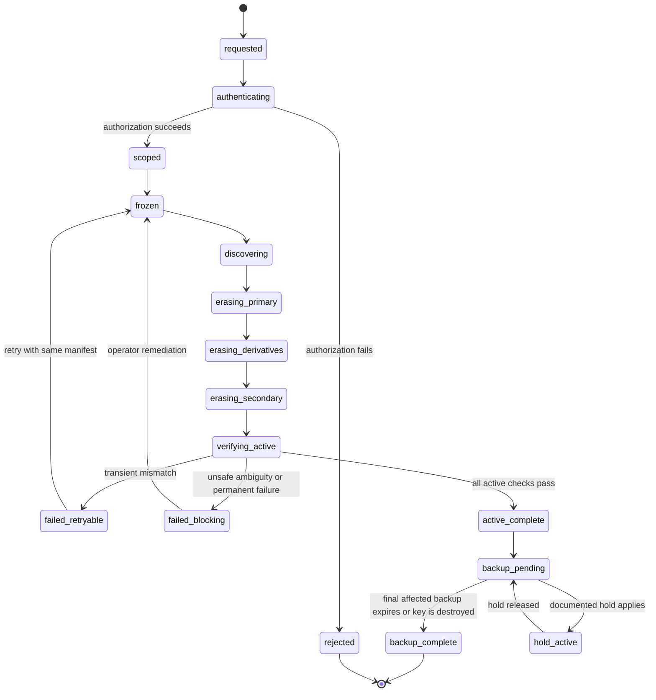
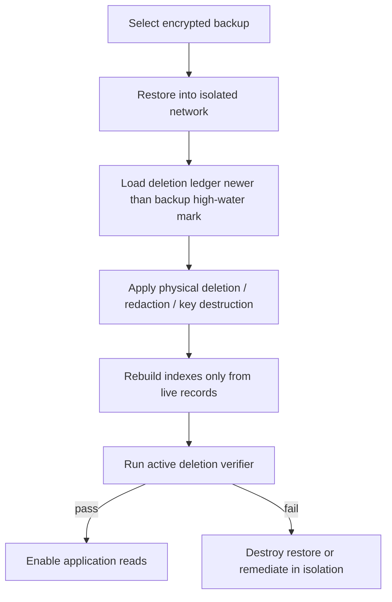

# Data Governance, Retention, Deletion, and Export

**Artifact filename:** `14-data-governance-retention-deletion.md`  
**Status:** Proposed normative specification  
**Owner:** Data-governance and privacy-specification owner  
**Date:** 2026-08-01 (America/Los_Angeles)  
**Repository baseline:** `starryark/DC_BOT`, branch `main`, commit `0ea3cbf5ec92f719e2b48066c3ada45aa50122ad`

---

## 1. Title and artifact filename

**Title:** Data Governance, Retention, Deletion, and Export  
**Artifact filename:** `14-data-governance-retention-deletion.md`

## 2. Executive conclusion

**Recommendation.** DC_BOT SHALL resolve the apparent conflict between attributable, append-oriented history and user erasure by making **event identity and lifecycle append-oriented, while making personal content and identity bindings erasable**. “Immutable raw events” SHALL NOT mean immortal plaintext. It SHALL mean:

1. an immutable event envelope and causal graph while the event is live;
2. separately stored, encrypted, replaceable or deletable content;
3. append-only lifecycle transitions such as `recorded`, `delivered`, `redacted`, and `erased`;
4. structural retention only where it is necessary to preserve causal or operational integrity; and
5. removal or irreversible replacement of personal content and identity references when a valid deletion scope applies.

**Recommendation.** The first durable-memory milestone SHALL use a single authoritative data-governance layer behind the transport-neutral `MemoryPort`. It may run in process with SQLite or PostgreSQL. A standalone HTTP memory service is not required for deletion correctness and SHALL not be introduced without a verified deployment need.

**Recommendation.** Deletion is a cross-store workflow, not a SQL `DELETE` statement and not a retrieval-hidden flag. Every deletion request SHALL create an idempotent deletion manifest, freeze re-derivation for the target scope, erase active copies, invalidate derivatives, verify all active stores, and record the maximum backup-expiry date. Completion SHALL be reported in two stages:

- **Active completion:** no target data remains usable in the primary database, search indexes, summaries, embeddings, caches, queues, exports, logs that are in scope, or future prompts.
- **Backup completion:** every backup containing the target has expired or has been cryptographically erased under a verified key design.

**Confirmed repository fact.** Current DC_BOT conversation history is bounded, in-memory, guild-scoped, and explicitly not persisted to a database in v1. The current voice path commits a user/assistant pair only after playback drains. The group-input path can aggregate several utterances into one prompt but assigns the resulting turn the display name `Discord group` and the latest speaker’s user ID. These facts mean the governance model must be implemented before broad durable retention and must not inherit the existing one-exchange/one-author assumption. Sources:  
- https://github.com/starryark/DC_BOT/blob/0ea3cbf5ec92f719e2b48066c3ada45aa50122ad/airi/services/discord-bot/src/orchestration/guild-session.ts  
- https://github.com/starryark/DC_BOT/blob/0ea3cbf5ec92f719e2b48066c3ada45aa50122ad/airi/services/discord-bot/src/orchestration/conversation-controller.ts

**Release decision.** Privacy, deletion, attribution, delivery-state correctness, and backup expiry are release-blocking. Production durable memory SHALL remain disabled until the acceptance criteria in section 14 pass.

---

## 3. Scope

### 3.1 In scope

**Source-plan requirement.** This specification governs the lifecycle of:

- raw text events;
- voice transcripts;
- assistant output;
- delivery metadata;
- identity snapshots;
- current aliases;
- historical aliases;
- alias evidence;
- summaries;
- semantic memories;
- episodic memories;
- relationship hypotheses;
- embeddings;
- cached digests;
- operational logs;
- audit logs;
- database backups; and
- export packages.

It defines collection defaults, retention, access, encryption, correction, export, deletion, backup handling, cache invalidation, derived-data invalidation, deletion verification, privacy tests, and failure runbooks.

### 3.2 Systems in scope

**Recommendation.** The control boundary includes every component that can retain or reconstruct personal data:

- the MemoryPort implementation and its primary database;
- text and voice adapters;
- prompt compiler and recent-context cache;
- lexical/full-text indexes;
- optional vector indexes and embedding workers;
- summary, extraction, reconciliation, and relationship workers;
- delivery outbox and reconciliation workers;
- local files, debug artifacts, and TTS caches;
- operational and audit logging sinks;
- worker queues and dead-letter queues;
- database and filesystem backups;
- export generation and download storage; and
- restored environments used for disaster recovery or testing.

### 3.3 Out of scope

See section 15. This is a privacy-engineering specification, not jurisdiction-specific legal advice.

---

## 4. Sources inspected

### 4.1 Primary repository

**Confirmed repository fact.** Inspected branch `main`, commit `0ea3cbf5ec92f719e2b48066c3ada45aa50122ad`:

- Repository and commit:  
  https://github.com/starryark/DC_BOT  
  https://github.com/starryark/DC_BOT/commit/0ea3cbf5ec92f719e2b48066c3ada45aa50122ad
- Current conversation history and commit semantics:  
  https://github.com/starryark/DC_BOT/blob/0ea3cbf5ec92f719e2b48066c3ada45aa50122ad/airi/services/discord-bot/src/orchestration/guild-session.ts
- Group input, generation, playback, and commit path:  
  https://github.com/starryark/DC_BOT/blob/0ea3cbf5ec92f719e2b48066c3ada45aa50122ad/airi/services/discord-bot/src/orchestration/conversation-controller.ts
- Per-guild process-local state:  
  https://github.com/starryark/DC_BOT/blob/0ea3cbf5ec92f719e2b48066c3ada45aa50122ad/airi/services/discord-bot/src/orchestration/conversation-state.ts
- Voice debug WAV behavior:  
  https://github.com/starryark/DC_BOT/blob/0ea3cbf5ec92f719e2b48066c3ada45aa50122ad/airi/services/discord-bot/src/voice/voice-manager.ts
- Configuration defaults, including conversation bound and TTS cache:  
  https://github.com/starryark/DC_BOT/blob/0ea3cbf5ec92f719e2b48066c3ada45aa50122ad/airi/services/discord-bot/src/config.ts  
  https://github.com/starryark/DC_BOT/blob/0ea3cbf5ec92f719e2b48066c3ada45aa50122ad/airi/services/discord-bot/.env.example
- Root ignore rules and checked-in logs:  
  https://github.com/starryark/DC_BOT/blob/0ea3cbf5ec92f719e2b48066c3ada45aa50122ad/.gitignore  
  https://github.com/starryark/DC_BOT/blob/0ea3cbf5ec92f719e2b48066c3ada45aa50122ad/Log%20.txt  
  https://github.com/starryark/DC_BOT/blob/0ea3cbf5ec92f719e2b48066c3ada45aa50122ad/Inference_Log.txt

### 4.2 Required comparison repositories

**Confirmed repository fact.** AIRI was inspected on branch `main`, commit `4d6e61f77dc99ec76c7cf352df62abb4282386c5`. Its README labels Memory Alaya as work in progress. An open issue proposes a unified `MemoryDriver`; the issue has no linked branch or pull request and therefore is proposal evidence, not implemented production behavior.  
- https://github.com/moeru-ai/airi/tree/4d6e61f77dc99ec76c7cf352df62abb4282386c5  
- https://github.com/moeru-ai/airi/blob/4d6e61f77dc99ec76c7cf352df62abb4282386c5/README.md  
- https://github.com/moeru-ai/airi/issues/879

**Confirmed repository fact.** AstrBot was inspected on branch `master`, commit `49095d3ba3fca9272a67aa5eeab2f6c0719c5091`. Its current conversation manager uses a database plus local session-selection storage, serializes conversation content for legacy access, supports conversation and user-session deletion, invokes deletion callbacks, and updates conversation content as a whole list. This is a useful persisted-conversation baseline but not proof of safe concurrent append, derivative deletion, backup erasure, or participant-level removal.  
- https://github.com/AstrBotDevs/AstrBot/tree/49095d3ba3fca9272a67aa5eeab2f6c0719c5091  
- https://github.com/AstrBotDevs/AstrBot/blob/49095d3ba3fca9272a67aa5eeab2f6c0719c5091/astrbot/core/conversation_mgr.py  
- https://github.com/AstrBotDevs/AstrBot/wiki/en-dev-star-guides-ai#conversation-manager

### 4.3 External references

**External research finding.** These references are used as engineering baselines; applicability to a deployment depends on jurisdiction and controller decisions.

- GDPR consolidated text, including storage limitation, rectification, erasure, restriction, and portability:  
  https://eur-lex.europa.eu/legal-content/EN/TXT/HTML/?uri=CELEX%3A02016R0679-20160504
- ICO right-to-erasure guidance, including treatment of backup copies as beyond use pending scheduled overwrite:  
  https://ico.org.uk/for-organisations/uk-gdpr-guidance-and-resources/individual-rights/individual-rights/right-to-erasure/
- ICO storage-limitation guidance:  
  https://ico.org.uk/for-organisations/uk-gdpr-guidance-and-resources/data-protection-principles/a-guide-to-the-data-protection-principles/storage-limitation/
- ICO data-portability guidance:  
  https://ico.org.uk/for-organisations/uk-gdpr-guidance-and-resources/individual-rights/individual-rights/right-to-data-portability/
- NIST SP 800-88 Rev. 2, media sanitization:  
  https://csrc.nist.gov/pubs/sp/800/88/r2/final
- OWASP Logging Cheat Sheet:  
  https://cheatsheetseries.owasp.org/cheatsheets/Logging_Cheat_Sheet.html

### 4.4 Evidence limitations

**Open question.** No production deployment topology, controller identity, jurisdiction, cloud provider, database engine, backup product, KMS design, or current privacy notice was supplied. Repository inspection does not establish the contents of untracked local files, hosted infrastructure, Discord configuration, third-party provider retention, or historical deployments. Those items are blocking decisions in section 17.

---

## 5. Evidence table

| ID | Claim | Classification | Source URL | Confidence |
|---|---|---|---|---|
| EVID-001 | Current DC_BOT voice conversation history is bounded and in memory per guild; v1 does not persist it to a database. | Confirmed repository fact | https://github.com/starryark/DC_BOT/blob/0ea3cbf5ec92f719e2b48066c3ada45aa50122ad/airi/services/discord-bot/src/orchestration/guild-session.ts | High |
| EVID-002 | Current history appends a user/assistant pair only after reply generation and voice playback complete. | Confirmed repository fact | https://github.com/starryark/DC_BOT/blob/0ea3cbf5ec92f719e2b48066c3ada45aa50122ad/airi/services/discord-bot/src/orchestration/conversation-controller.ts | High |
| EVID-003 | The current group path can aggregate several speakers but passes `displayName: 'Discord group'` and the latest user ID into generation/history. | Confirmed repository fact | https://github.com/starryark/DC_BOT/blob/0ea3cbf5ec92f719e2b48066c3ada45aa50122ad/airi/services/discord-bot/src/orchestration/conversation-controller.ts | High |
| EVID-004 | Debug voice dumping, when enabled, writes WAV files under `dumps/` with guild ID and user ID in the filename. | Confirmed repository fact | https://github.com/starryark/DC_BOT/blob/0ea3cbf5ec92f719e2b48066c3ada45aa50122ad/airi/services/discord-bot/src/voice/voice-manager.ts | High |
| EVID-005 | Debug audio is disabled by default, while the configured TTS cache is enabled by default with a 168-hour TTL. | Confirmed repository fact | https://github.com/starryark/DC_BOT/blob/0ea3cbf5ec92f719e2b48066c3ada45aa50122ad/airi/services/discord-bot/.env.example | High |
| EVID-006 | A checked-in log contains Discord guild IDs, user IDs, display names, turn IDs, language and timing metadata. | Confirmed repository fact | https://github.com/starryark/DC_BOT/blob/0ea3cbf5ec92f719e2b48066c3ada45aa50122ad/Log%20.txt | High |
| EVID-007 | The reviewed root `.gitignore` excludes environment and dependency paths but does not list `dumps/`, `.cache/`, or generic log files. | Confirmed repository fact | https://github.com/starryark/DC_BOT/blob/0ea3cbf5ec92f719e2b48066c3ada45aa50122ad/.gitignore | High for the root file; unknown for uninspected nested ignore files |
| EVID-008 | AIRI labels Memory Alaya as WIP. | Confirmed repository fact | https://github.com/moeru-ai/airi/blob/4d6e61f77dc99ec76c7cf352df62abb4282386c5/README.md | High |
| EVID-009 | AIRI issue 879 proposes a unified memory driver and arbitrary scoring ideas; it is open and has no linked development branch or PR. | Confirmed proposal status | https://github.com/moeru-ai/airi/issues/879 | High |
| EVID-010 | AstrBot persists conversation content, exposes deletion methods and callbacks, and updates serialized content lists. | Confirmed repository fact | https://github.com/AstrBotDevs/AstrBot/blob/49095d3ba3fca9272a67aa5eeab2f6c0719c5091/astrbot/core/conversation_mgr.py | High |
| EVID-011 | Storage limitation, rectification, erasure and portability are established privacy-engineering concerns in GDPR. | External research finding | https://eur-lex.europa.eu/legal-content/EN/TXT/HTML/?uri=CELEX%3A02016R0679-20160504 | High; legal applicability is deployment-specific |
| EVID-012 | Backup data that cannot be immediately overwritten should be placed beyond use and replaced on an established schedule. | External research finding | https://ico.org.uk/for-organisations/uk-gdpr-guidance-and-resources/individual-rights/individual-rights/right-to-erasure/ | High as ICO guidance; applicability is deployment-specific |
| EVID-013 | Sanitization should render target data access infeasible for the relevant effort and sensitivity. | External research finding | https://csrc.nist.gov/pubs/sp/800/88/r2/final | High |
| EVID-014 | Logs can contain personal or sensitive data and require protection against unauthorized access, modification, and misuse. | External research finding | https://cheatsheetseries.owasp.org/cheatsheets/Logging_Cheat_Sheet.html | High |

---

## 6. Current-state findings

### 6.1 No durable authority exists yet

**Confirmed repository fact.** DC_BOT currently has a bounded `GuildSession` history in process memory and explicitly says it is not persisted in v1. `ConversationStateRegistry` also holds per-guild and per-user runtime maps. A process restart therefore discards the normal conversation state. This reduces current database-erasure exposure but does not address local logs, debug files, caches, provider-side copies, or future persistence.

**Inference.** Because there is no durable memory authority today, the least-risk path is to introduce governance in the first persistence schema rather than retrofit deletion after data has spread across multiple stores.

### 6.2 Current attribution is insufficient for participant deletion

**Confirmed repository fact.** The group-input path constructs a combined prompt from multiple utterances but uses the first turn ID, the latest user ID, and the synthetic display name `Discord group` for the generated turn. That representation cannot support reliable attribution, participant export, correction, or deletion.

**Source-plan requirement.** Each speaker contribution SHALL be a separate attributable user event. Assistant output SHALL link to zero or more input events through a many-to-many causal relation.

### 6.3 Delivery and history are coupled in a way that loses failed user events

**Confirmed repository fact.** Current voice history commits both sides only after playback drains, avoiding a completed assistant turn when delivery failed.

**Inference.** This is appropriate for recent conversational context but not sufficient for durable governance. A durable system must separately record an accepted user event, generation attempt, assistant output, and delivery state. Otherwise valid user data can disappear from audit/export, and failed or unheard assistant output can be misclassified as a normal turn.

### 6.4 Local artifacts are a present privacy risk

**Confirmed repository fact.** Optional debug WAV filenames include guild and user IDs. The root ignore file reviewed does not list `dumps/`, `.cache/`, or generic logs. A checked-in log contains Discord IDs and display names. The TTS cache is enabled by default with a seven-day TTL.

**Recommendation.** Production startup SHALL refuse `DEBUG_DUMP_AUDIO=true`; local voice dumps SHALL be prohibited outside an explicit incident mode. Runtime-generated logs, dumps, exports, database files and caches SHALL be ignored by version control and stored outside the source tree. Existing checked-in logs SHALL be treated as a security/privacy incident and removed from the working tree and, after owner approval, remediated in repository history.

### 6.5 Comparison projects do not resolve DC_BOT’s governance requirements

**Confirmed repository fact.** AIRI’s unified memory layer is still labeled WIP and its detailed unified-driver design is an open proposal. AstrBot demonstrates persisted conversations and deletion callbacks, but its manager still handles conversation history as a serialized content list and does not establish participant-level erasure or derivative verification.

**Recommendation.** Use comparison repositories as evidence of useful interfaces and product behavior, not as a substitute for a deletion-aware event model.

---

## 7. Proposed decisions

### ADR-014-001 — Append-mostly envelope, erasable content

**Decision.** Event IDs, causal links, scope IDs, and lifecycle transitions are append-oriented. User content, actor snapshots, aliases, claims, and derived content reside in separable content records that can be physically deleted or cryptographically erased. After erasure, an optional structural stub may remain only under the minimization rules in REQ-PRIV-018.

### ADR-014-002 — Physical deletion is the active-store default

**Decision.** Active primary records, search documents, embeddings, caches, queue payloads and exports use physical deletion. Cryptographic erasure is an optional additional mechanism, not a substitute, unless key coverage is independently verified. Tombstones never retain plaintext content, Discord IDs, aliases, or reversible identity bindings.

### ADR-014-003 — Backups expire on a bounded schedule

**Decision.** Default backup retention is 35 days rolling. Deleted data in immutable backups is placed beyond use and SHALL not be restored into service. Every restore replays the deletion ledger before network or worker access. Backup completion occurs no later than the last backup-expiry date unless a valid, documented hold applies.

### ADR-014-004 — Conservative retention defaults

**Decision.** Raw conversation content defaults to 30 days; durable memories have separate, shorter-purpose policies and cannot survive their provenance unless explicitly confirmed as independent durable memory. Long-term or indefinite raw transcript retention is not the default.

### ADR-014-005 — Derived data never has independent life by accident

**Decision.** Every summary, memory, relationship hypothesis, embedding, digest, or model-ready artifact SHALL list source IDs and a derivation version. Deleting or materially correcting a source invalidates all dependents before any future retrieval.

### ADR-014-006 — Deletion ledger and scope freeze

**Decision.** An authorized deletion creates a control-plane job and scope freeze. Workers SHALL check the freeze and deletion generation before writing. Late results from earlier generations are discarded.

### ADR-014-007 — Two-stage completion

**Decision.** The system reports `active_complete` and `backup_complete` separately. “Deleted” without qualification means `active_complete`; user-facing notices also disclose the backup expiry deadline.

### ADR-014-008 — No vague forget flag

**Decision.** A `hidden`, `inactive`, or `excluded_from_retrieval` flag alone does not satisfy deletion. Every operation in section 10.8 has an explicit physical deletion, cryptographic erasure, tombstone, structural redaction, or delayed-backup-expiry effect.

### ADR-014-009 — Controller and tenancy boundary

**Decision.** The deployment operator is the controller/owner for operational policy. Each deployment or tenant has an isolated encryption and authorization boundary. Discord user ID identifies a Discord account only; it is not automatically linked to another platform or human identity.

### ADR-014-010 — Exports are ephemeral disclosures

**Decision.** Exports are generated on demand, encrypted, access logged, scoped to the requester’s authorization, expire after seven days, and are immediately revoked when overlapping deletion begins.

---

## 8. Alternatives considered

| Alternative | Advantages | Risks / limitations | Outcome |
|---|---|---|---|
| Immutable event log containing permanent plaintext | Simple audit narrative; easy replay | Conflicts with erasure; leaks in backups and replicas; makes shared-event deletion impossible | Rejected |
| Soft-delete or retrieval-hidden flag | Simple implementation; reversible | Data remains in indexes, prompts, exports and backups; does not meet assignment semantics | Rejected |
| Rewrite every historical event in place | Straightforward mental model | Loses lifecycle evidence; concurrent rewrites are risky; no durable deletion proof | Rejected as sole model |
| Per-person database or per-person conversation rows | Easy person deletion | Shared-room events and assistant outputs span people; duplicates data; breaks causal integrity | Rejected |
| Per-subject encryption keys only | Fast cryptographic erasure | Shared objects and derived outputs have multiple subjects; key granularity becomes ambiguous | Not sufficient alone |
| Standalone HTTP memory service immediately | Central control plane | Adds network failure, deployment and auth complexity without verified need | Deferred |
| Keep all raw content indefinitely and delete on request | Maximum recall | Violates minimization objective; increases breach and deletion cost | Rejected |
| Delete only primary rows; let derivatives age out | Cheap | Deleted content can reappear from summaries, vectors, caches or queues | Rejected |
| Block all deletion while any legal risk is conceivable | Operational simplicity | Overbroad and indefinite; no scoped authority or review | Rejected |
| Whole-conversation serialized JSON updates | Familiar; used by some products | Weak participant deletion and concurrent append semantics; expensive rewrites | Rejected for authoritative storage; acceptable only as export representation |

---

## 9. Rejected alternatives and reasons

### 9.1 Permanent “immutable raw events”

**Recommendation.** Reject. Immutability applies to event identity and lifecycle evidence, not to personal content. A system that cannot erase content is not eligible for broad production retention.

### 9.2 Soft deletion

**Recommendation.** Reject as deletion. Soft state may be used temporarily during an in-progress job, but the terminal active-store state must be physical deletion or verified cryptographic erasure, with only minimized structural evidence where justified.

### 9.3 Silent backup exception

**Recommendation.** Reject. Backup lag must be disclosed, bounded, verified, and represented by `backup_pending_until`. Restored backups must not reactivate deleted data.

### 9.4 Alias deletion that only disables addressing

**Recommendation.** Reject. Disabling an alias but retaining its plaintext in evidence, snapshots, summaries, embeddings or logs is not deletion.

### 9.5 Participant deletion from a synthetic group turn

**Recommendation.** Reject. A composite `Discord group` author cannot be safely partitioned after the fact. New durable ingestion SHALL preserve one child event per participant; legacy composites require conservative redaction or deletion.

---

## 10. Normative specification and detailed plan

### 10.1 Normative language and classifications

The key words **SHALL**, **SHALL NOT**, **SHOULD**, **SHOULD NOT**, and **MAY** are normative.

**Data sensitivity levels**:

- **S1 — Operational:** low-risk configuration or aggregate metrics with no stable person identifier.
- **S2 — Personal metadata:** Discord IDs, scoped identifiers, timestamps, room/guild membership, delivery and access metadata.
- **S3 — Conversational personal data:** text, transcripts, aliases, identity snapshots, summaries, memories, exports.
- **S4 — Highly sensitive inferred or voice-derived data:** relationship hypotheses, sensitive traits, voice content, incident exports, or any content containing secrets, health, sexuality, political beliefs, minors’ data, authentication material, or comparable high-impact information.

**Visibility values**:

- `subject`: the person the data is about;
- `participant`: authorized participants in the originating conversation;
- `guild_admin`: narrowly scoped guild administration where policy permits;
- `operator_privileged`: audited operator access;
- `runtime_only`: service components; not rendered to users;
- `export_only`: disclosed only in an authorized export.

### 10.2 Core privacy invariants

- **REQ-PRIV-001.** Every retained item SHALL have a data class, purpose, tenant, scope, creation time, expiry time or retention rule, sensitivity, and source/provenance reference.
- **REQ-PRIV-002.** Collection SHALL be purpose-limited. Enabling one memory layer SHALL NOT silently enable relationship inference, embeddings, raw audio capture, or indefinite transcript retention.
- **REQ-PRIV-003.** A Discord user ID SHALL be treated as a Discord-account identity key, not a verified cross-platform human identity.
- **REQ-PRIV-004.** Current aliases, historical aliases, event-time presentation snapshots, and alias evidence SHALL be distinct records with distinct retention and deletion behavior.
- **REQ-PRIV-005.** Private-conversation aliases SHALL never be retrieved in public guild contexts.
- **REQ-PRIV-006.** Shared voice input SHALL preserve one attributable source event per speaker.
- **REQ-PRIV-007.** Derived records SHALL carry complete source IDs, derivation version, generated time, confidence where applicable, and invalidation state.
- **REQ-PRIV-008.** Assistant speculation SHALL NOT become a user fact without an allowed extraction policy and provenance.
- **REQ-PRIV-009.** Relationship hypotheses are disabled by default and SHALL never be presented as verified facts.
- **REQ-PRIV-010.** Retrieval-hidden state SHALL NOT be a terminal deletion state.
- **REQ-PRIV-011.** Deletion SHALL be idempotent and safe to retry.
- **REQ-PRIV-012.** A deletion scope freeze SHALL prevent new source ingestion, derivation, indexing, caching, export, and prompt use for the targeted objects while the job is active.
- **REQ-PRIV-013.** Every worker write SHALL include the source deletion generation observed at read time. A stale generation SHALL be rejected.
- **REQ-PRIV-014.** A restored backup SHALL replay all later deletion manifests before serving traffic or running derivation workers.
- **REQ-PRIV-015.** No audit or operational log is categorically exempt from privacy review or deletion merely because it is called a log.
- **REQ-PRIV-016.** Tombstones SHALL contain no raw text, transcript, alias, display name, avatar URL, Discord ID, embedding, or reversible identity binding.
- **REQ-PRIV-017.** Cryptographic erasure SHALL be claimed only when key destruction makes every relevant ciphertext copy inaccessible and plaintext copies are absent or independently deleted.
- **REQ-PRIV-018.** A structural stub MAY retain an opaque record ID, type, coarse time, causal position, deletion reason category, and lifecycle status only when necessary for integrity, abuse prevention, financial reconciliation, or legal duty. It SHALL not be usable to identify the person without a separately authorized mapping, and that mapping SHALL be deleted when the scope requires person erasure.
- **REQ-PRIV-019.** Future prompt compilation SHALL exclude any source or derivative whose lifecycle is not `active`, whose retention has expired, whose authorization fails, or whose deletion generation is stale.
- **REQ-PRIV-020.** The controller SHALL publish the configured retention values and subprocessors before production durable retention.

### 10.3 Controller, ownership, and access model

**Recommendation.** The deployment operator is the controller and policy owner for all classes below. DC_BOT components and infrastructure providers act only under the operator’s configuration. For a hosted multi-tenant service, each tenant is an authorization boundary and MAY be a separate controller depending on contractual design; that legal allocation is outside this document.

**REQ-SCOPE-014.** Runtime reads SHALL be authorized by tenant, character, platform, guild/DM, logical room, person, and purpose. The existence of a record in the same database is not authorization.

**REQ-OPS-014.** Privileged reads, exports, corrections, holds, and deletion operations SHALL be access logged with actor, purpose, scope, time, result, and request ID. Log entries SHALL use opaque internal subject references and SHALL not include content.

### 10.4 Data-class inventory — collection, purpose, retention, visibility, sensitivity

The retention values below are **recommended production defaults**. They are not statements of current repository behavior. A deployment MAY choose shorter retention. Longer retention requires a recorded purpose, user-facing disclosure, and approval by the privacy owner.

| Data class | Purpose | Controller / owner | Default collection | Default retention | Visibility | Sensitivity |
|---|---|---|---|---|---|---|
| Raw text events | Attributable source record, recent context, provenance, correction and export | Deployment operator | On when durable conversation history is enabled; otherwise process-local only | 30 days from event; shorter for unbound/public channels if configured | Subject, authorized participants, runtime; privileged operator only for incident need | S3; S4 when content is sensitive |
| Voice transcripts | Attributable textual representation of speech for response and provenance | Deployment operator | On only for utterances admitted to ASR/conversation processing; raw audio remains off | 30 days; failed/empty transcripts 24 hours or less | Subject, authorized participants, runtime | S3/S4 |
| Assistant output | Conversation continuity, delivery reconciliation, export, causal audit | Deployment operator | On for generated output that reaches a terminal generation state | 30 days; undelivered drafts 24 hours unless needed for incident analysis | Authorized participants, runtime | S3; may contain S4 derived material |
| Delivery metadata | Reconcile generation with Discord send/playback; diagnose failures | Deployment operator | Required | 30 days at event level; anonymous aggregates up to 90 days | Runtime, operator privileged; subject in export where meaningful | S2 |
| Identity snapshots | Preserve event-time Discord presentation and attribution | Deployment operator | Required for each retained source event, but stored with event rather than updating identity master | Same as source event | Subject, authorized participants where originally visible, runtime | S2/S3 |
| Current aliases | Current permitted addressing in a defined scope | Deployment operator; alias subject controls preference where allowed | Off until explicit user setting or verified operator entry | Until revoked, scope expires, account deletion, or 365 days inactivity review | Subject; runtime in authorized scope; participants only when actually used | S3 |
| Historical aliases | Historical presentation and correction trail, not current addressing | Deployment operator | On only when a current alias is superseded and history is required | 90 days after supersession, bounded by source records that need it | Subject, operator privileged; runtime only for historical display | S3 |
| Alias evidence | Provenance for why an alias was accepted/rejected and by whom | Deployment operator | On only for alias decisions; no per-event write amplification | Accepted evidence while alias is active plus 30 days; rejected plaintext 30 days, minimized rejection fingerprint up to 90 days | Subject, operator privileged, runtime decision engine | S3/S4 if evidence text is sensitive |
| Summaries | Compress recent context without replaying full history | Deployment operator | On only when summarization is enabled; outside voice-critical path | 90 days maximum and never beyond all sources unless independently confirmed memory exists | Runtime; subject export; privileged operator | S3/S4 |
| Semantic memories | Durable user-confirmed facts/preferences with provenance | Deployment operator; subject may correct/delete | Off by default until memory feature enabled; automatic extraction must be separately enabled | Unconfirmed: 90 days; user-confirmed: 365 days since confirmation or last validated use | Subject, runtime in authorized scopes | S3/S4 |
| Episodic memories | Compact record of a meaningful interaction or event | Deployment operator | Off by default; extraction policy required | 180 days since creation or last user confirmation | Subject, runtime in authorized scopes | S3/S4 |
| Relationship hypotheses | Tentative model inference about relationships or social context | Deployment operator | Off by default | 30 days if explicitly enabled; delete on source expiry or confidence rejection | Runtime only; subject export with clear hypothesis label; operator privileged | S4 |
| Embeddings | Optional retrieval acceleration | Deployment operator | Off until benchmark evidence supports need and deletion path is tested | Exactly source lifetime; no independent retention | Runtime only | S3/S4 because vectors can encode content |
| Cached digests | Low-latency prompt/retrieval cache | Deployment operator | On only for bounded cache use | 24 hours maximum; preferably minutes | Runtime only | Same as source, usually S3/S4 |
| Operational logs | Reliability, security events, latency, failure diagnosis | Deployment operator | Required but content-free and minimized | 30 days; critical security incident subset 90 days with approval | Operator privileged | S1/S2; S3 prohibited by default |
| Audit logs | Evidence of privileged access, export, correction, hold and deletion actions | Deployment operator / privacy owner | Required | 365 days, then aggregate or delete; longer only for documented duty | Privacy/security privileged | S2; content and aliases prohibited |
| Database backups | Disaster recovery | Deployment operator | Required for durable production unless explicitly single-node/no-recovery | 35-day rolling maximum by default | Backup service and recovery operators only | Inherits highest included class, S4 |
| Export packages | Fulfill authorized access/portability requests | Deployment operator; requester controls downloaded copy | On request only | 7 days or first successful download plus 24 hours, whichever is sooner if product supports it | Requester and export service only | S4 |

### 10.5 Data-class inventory — encryption, logging, export, correction, deletion, backup and invalidation

| Data class | Encryption | Access logging | Export behavior | Correction behavior | Active deletion behavior | Backup behavior | Cache invalidation | Derived-data invalidation |
|---|---|---|---|---|---|---|---|---|
| Raw text events | TLS; encrypted database; application envelope encryption for content recommended | Privileged reads and bulk retrieval logged | Include attributable content and event-time display; redact other participants as policy requires | Append correction/supersession; preserve old content only until correction retention or delete it when requested | Physical delete content; optionally retain minimized structural stub; destroy content key if used | Remains beyond use until ≤35-day expiry; deletion ledger replay on restore | Purge event, room, person and prompt caches | Delete/regenerate summaries, memories, embeddings, digests, hypotheses and exports |
| Voice transcripts | Same as raw text; separate per-speaker content blob | Same as raw text | Include transcript and confidence/timing when authorized; no raw audio by default | Append corrected transcript; mark ASR original superseded; user may request original deletion | Physical delete transcript; structural ops evidence may remain under section 10.8 | Same as raw text | Purge transcript/prompt/ASR caches | Delete/regenerate every derivative |
| Assistant output | Encrypted content blob separate from delivery | Privileged reads logged | Include output and delivery status | Correct by appending replacement; do not rewrite delivered Discord message unless separately supported | Delete if directly requested, within conversation scope, or if it materially exposes deleted source content | Delayed expiry | Purge output, TTS and prompt caches | Delete embeddings/summaries/digests; re-evaluate downstream memories |
| Delivery metadata | Encrypted at rest; identifiers tokenized in analytics | Privileged queries logged | Include subject-relevant status, timestamps and channel type; omit internal secrets | Append state correction/reconciliation | Delete person-linked metadata; retain non-identifying aggregate or minimal structural state if justified | Delayed expiry | Purge delivery caches/outbox | Recompute metrics without subject linkage where feasible |
| Identity snapshots | Encrypted with event content or separate actor-snapshot blob | Privileged reads logged | Include subject snapshot; redact unrelated participants as needed | Event-time snapshot is corrected by append annotation; current identity updated separately | Delete or redact targeted actor fields; replace actor link with opaque deleted-participant marker only if structural retention justified | Delayed expiry | Purge identity/addressing caches | Regenerate summaries, aliases and prompts that copied snapshot data |
| Current aliases | Application-level encryption; scoped lookup index may contain normalized keyed hash | All reads outside normal addressing and all writes logged | Include alias, scope, provenance category and status | Replace current version; previous becomes historical or is deleted | Physical delete plaintext, normalized index and current pointer; key destruction optional | Delayed expiry | Immediate purge in all scope caches | Regenerate prompts/summaries; delete alias embeddings/evidence as requested |
| Historical aliases | Application-level encryption | Privileged reads logged | Include only subject’s own history unless policy requires otherwise | Append correction or delete | Physical delete plaintext and structured copies; event-field copies redacted | Delayed expiry | Purge historical-address cache | Regenerate display projections and embeddings |
| Alias evidence | Application-level encryption | Every read logged | Include subject-facing evidence where it does not expose another person; otherwise provide category/redaction | Append decision correction; retain decision provenance | Physical delete evidence text; minimized rejection tombstone only when user did not request full alias deletion | Delayed expiry | Purge candidate and decision caches | Re-evaluate active alias and delete derived alias vectors/digests |
| Summaries | Application-level encryption | Privileged reads logged | Include as derived data with source IDs and generation date | Never edit silently; invalidate and regenerate | Physical delete, then regenerate only from remaining authorized sources | Delayed expiry | Purge room/person summary caches | Cascade to memories, embeddings and digests derived from summary |
| Semantic memories | Application-level encryption; per-memory key recommended | Every privileged read/write logged | Include statement, scope, provenance, confidence, validity, confirmation status | Supersede or delete old value; contradiction links retained without deleted content | Physical delete memory, search rows, embeddings and dependent outputs | Delayed expiry | Purge memory/retrieval/prompt caches | Delete dependent summaries/hypotheses/digests and regenerate prompts |
| Episodic memories | Same as semantic | Same as semantic | Include episode and provenance, clearly derived | Supersede/invalidate | Physical delete and cascade | Delayed expiry | Purge | Delete dependent vectors, summaries and hypotheses |
| Relationship hypotheses | Strong application-level encryption; separate table and permission | Every read/write logged | Include only to data subject, clearly labeled hypothesis, with source redaction | Reject, correct or expire; never promote silently | Physical delete; no structural content retention | Delayed expiry | Purge all hypothesis caches | Delete vectors, summaries and outputs that quote it |
| Embeddings | Encrypted storage/volume; payload-free IDs; no vector in logs | Administrative access logged | Do not export raw vector by default; export source and model metadata; vector available only if policy explicitly requires | Regenerate after source correction | Physical delete vector rows/index entries and provider-side copies | Delayed expiry only if included; prefer reconstructable indexes excluded from backup | Purge vector/query caches | Rebuild affected index partitions from live sources |
| Cached digests | Encrypted cache transport and storage where supported | Administrative access logged; normal cache reads need not be per-item logged | Never independently exported | Regenerate | Hard eviction and namespace-generation bump | Exclude from backup | Immediate | None after source invalidation; cache is derivative |
| Operational logs | Encrypted transport/storage; no content | Access to logs logged at platform layer | Include only subject-linked entries that are meaningful and safe; redact secrets and third parties | Append correction note; do not mutate security evidence unless privacy requires redaction | Delete or redact direct identifiers and accidental content; retain anonymous security evidence | Backups inherit log retention; no separate long archive by default | N/A | Remove dashboards/indexes that copied deleted identifiers |
| Audit logs | Encrypted, tamper-evident chain or equivalent integrity control | Access to audit system itself logged | Export a requester-readable action history where appropriate; never expose operator secrets | Append correction entry | Retain minimized action evidence; redact/delete personal payload or direct identifier; map subject through deletion-request ID only | Delayed expiry per 365-day policy | N/A | Rebuild audit search projections after redaction |
| Database backups | Strong encryption with separate backup key and restricted recovery role | Every restore/read/delete logged | Not directly exported | Not corrected in place | Cryptographic erasure only if verified key domain permits; otherwise beyond use and delayed expiry | 35-day rolling, immutable if required | N/A | Restore process must replay deletion ledger before derivatives start |
| Export packages | Per-package encryption; signed short-lived download token | Generation, access, download, revoke and delete logged | This is the export artifact | Regenerate corrected export; revoke prior package | Physical delete package and token; cryptographic erase package key | Exclude from normal backups where feasible; otherwise ≤7-day primary plus backup expiry | CDN/object cache purge | Delete staging files, manifests containing content and temporary indexes |

### 10.6 Additional class: raw voice audio and TTS audio

**Confirmed repository fact.** DC_BOT can optionally write input WAV files and has an enabled TTS cache by default.

- **REQ-PRIV-021.** Raw input audio SHALL NOT be a normal retained memory class. Production collection is off.
- **REQ-PRIV-022.** Incident-mode raw input audio requires explicit operator activation, visible notice where feasible, a case ID, isolated encrypted storage, no repository path, no backup, and automatic deletion within 24 hours.
- **REQ-PRIV-023.** Input audio filenames SHALL NOT contain Discord IDs, aliases, guild IDs, channel IDs, or display names.
- **REQ-PRIV-024.** TTS audio cache keys SHALL be content-derived keyed hashes, not plaintext text or user identifiers. Cache entries SHALL expire in at most 24 hours for personalized output; generic non-personal synthesis MAY use a longer configured TTL only after content classification.
- **REQ-PRIV-025.** Deleting assistant output SHALL purge matching TTS audio and provider cache entries.

### 10.7 Append-oriented record model

#### 10.7.1 Logical separation

**Recommendation.** Store the following independently:

1. `event_envelope`: opaque event ID, event type, tenant, scope, coarse/precise timestamps as authorized, causal sequence, current lifecycle state pointer.
2. `actor_binding`: event-to-Discord-account binding and event-time identity snapshot.
3. `content_blob`: encrypted text/transcript/output content and content hash.
4. `causal_link`: many-to-many input/output links.
5. `lifecycle_transition`: append-only transitions for recording, correction, delivery, redaction and erasure.
6. `derivation_edge`: source-to-summary/memory/embedding/digest/hypothesis edges.
7. `retention_policy_binding`: effective expiry and policy version.
8. `deletion_manifest`: authorized deletion scope, planned targets, results and verification.

#### 10.7.2 Immutability semantics

- **REQ-EVENT-014.** An active event envelope SHALL not be overwritten to pretend a different event occurred.
- **REQ-EVENT-015.** Corrections SHALL create a new content version or correcting event linked by `supersedes`.
- **REQ-EVENT-016.** Lifecycle state changes SHALL be append-only transitions, not mutation of historical transition records.
- **REQ-EVENT-017.** Erasure MAY physically remove `actor_binding` and `content_blob` while retaining a minimized envelope stub.
- **REQ-EVENT-018.** If the envelope itself is not needed for integrity, it SHALL also be physically deleted.
- **REQ-EVENT-019.** Structural retention SHALL not retain a stable public identifier that permits the runtime to reconnect the stub to a deleted Discord account.

#### 10.7.3 Encryption domains

**Recommendation.** Use envelope encryption with a tenant master key and independently destroyable content keys at a granularity that supports deletion:

- one key per content blob, or a small bounded key group whose erasure scope exactly matches the deletion unit;
- separate keys for backups and exports;
- no shared per-guild key as the only protection for participant content, because deleting one participant would require erasing the whole guild;
- key identifiers must not encode Discord IDs; and
- a key-deletion receipt must be part of verification when cryptographic erasure is used.

**REQ-PRIV-026.** Shared-event contributions SHALL be separate content blobs. A composite prompt is a transient projection, never the authoritative source record.

### 10.8 Exact deletion and correction semantics

The operation table is normative. `PD` = physical deletion, `CE` = cryptographic erasure, `TS` = minimized tombstone, `SR` = content redaction with structural retention, `BE` = delayed backup expiry.

| Operation | Authorization and scope | Active-store semantics | Mechanisms | Derivatives and future prompts | Backup semantics |
|---|---|---|---|---|---|
| Forget one memory | Memory subject, authorized operator, or governing room owner where policy permits; target exact memory ID | Delete semantic/episodic memory row, text, provenance copies not needed by surviving sources, lexical row and vector; retain only deletion request evidence | PD; optional CE; TS for deletion job only; BE | Purge retrieval caches; delete dependent summaries/hypotheses/digests; prompt compiler blocks target immediately | Mark affected backup generations; beyond use until ≤35-day expiry |
| Reject one alias | Alias subject or authorized moderator under published scope rules | Mark candidate rejected; remove it from current-addressing candidates; retain plaintext evidence no more than 30 days; optional keyed normalized rejection token no more than 90 days to prevent immediate reproposal | PD for active candidate; TS for minimized rejection decision; BE | Purge alias caches and prompt projections; no use in addressing | Expire with backups; full alias deletion overrides token |
| Delete one alias | Alias subject or authorized operator; exact normalized alias plus scope and owner | Delete current/historical alias plaintext, normalized indexes, alias evidence requested, and structured identity-field copies; event natural-language content is not blindly rewritten unless it is a structured alias field or separately requested | PD; optional CE; SR for structured event fields; TS for job; BE | Regenerate summaries/prompts that copied alias; delete alias embeddings; use permitted fallback display name | Delayed backup expiry; disclose deadline |
| Forget one conversation | Participant for own private conversation; guild authority for shared conversation subject to participant policy; exact conversation ID | Delete all conversation events, outputs, delivery links, identity snapshots and conversation-scoped memories; shared objects outside the conversation survive only after leakage review | PD/CE; TS or SR only for required causal/delivery structure; BE | Delete room summaries, embeddings, caches, queue jobs, exports; future prompt receives empty/no-history state | Delayed backup expiry |
| Forget one room | Authorized guild/room administrator and, for DMs, participants; exact logical room ID and bindings | Delete all room-scoped events, outputs, summaries, memories, aliases and bindings; person-global memory survives only if its provenance and authorization remain valid | PD/CE; SR for minimal operational structure; TS; BE | Invalidate cross-channel bindings and all room projections; no retrieval via physical channels | Delayed backup expiry |
| Forget one guild | Guild owner/authorized administrator or deployment operator; exact guild tenant scope | Delete guild events, rooms, guild aliases, guild-scoped memories, delivery data and indexes. Person-global/private data outside guild remains | PD/CE; TS for job; BE | Namespace-generation bump; purge all guild caches/queues/exports; prohibit future prompt use | Delayed backup expiry; guild restore prohibited without ledger replay |
| Forget all data for one person | Verified control of Discord account or authorized privacy operator; exact `discord:user:<id>` only | Delete actor bindings, event contributions, current/historical aliases, evidence, memories, exports and person-linked metadata across scopes. Shared events are partitioned; other participants’ content is retained. Assistant outputs undergo leakage review | PD/CE; SR for shared structure; TS keyed only to deletion request, not person; BE | Purge all person and scope caches, vectors, summaries and jobs; block stale worker writes | Delayed backup expiry; report final date |
| Delete a Discord account | Verified platform deletion signal if available or authenticated account owner/operator request | Same as person deletion for that Discord identity. Do not infer or delete unverified cross-platform identities. Account record is deleted; optional non-identifying count remains | PD/CE; SR; TS for request; BE | Remove platform mappings, tokens and future prompt access; if user returns with a new ID, treat as a new identity | Delayed backup expiry |
| Remove a third-party claim | Person the claim is about, claimant, or authorized moderator depending policy; exact claim/memory ID | Delete structured claim and derived records. Preserve the claimant’s original source event unless the claimant or another valid scope requests deletion; redact the claim from summaries and prompts | PD; optional CE; TS for job; BE | Delete claim embeddings/hypotheses; regenerate summaries; suppress re-extraction using deletion generation and source policy | Delayed backup expiry |
| Remove one participant’s data from a shared event | Verified participant or privacy operator; participant child-event IDs | Delete that participant’s child content and actor binding. Retain other child events. Composite projections are discarded. If a legacy composite cannot be safely separated, redact or delete the whole composite. Review assistant output for reconstruction of deleted content | PD/CE for child; SR/TS for shared envelope; BE | Regenerate summaries and prompts from remaining children; delete/re-evaluate assistant output, embeddings and memories | Delayed backup expiry |
| Erase a voice transcript while preserving non-content operational evidence | Speaker or authorized operator; exact transcript/utterance ID | Delete transcript text, ASR token/confidence detail that can reconstruct content, speaker identity snapshot if requested, and raw audio if any. MAY retain opaque utterance ID, duration bucket, sample-rate/codec, coarse time, outcome/error class, and delivery correlation without person binding | PD/CE for content; SR for ops stub; TS for request; BE | Delete transcript vectors/summaries/memories; purge ASR/prompt caches and queued derivations; no prompt use | Delayed backup expiry |
| Legal or operational retention exception | Privacy/legal role with documented authority; exact object/scope, purpose and expiry | Apply narrow hold only to data necessary for the stated duty. Delete all non-held copies and derivatives. Debug convenience is not a valid hold. Held data is unavailable to normal retrieval | TS for hold record; SR/PD for non-held data; CE where possible; BE when hold ends | Prompt/retrieval use remains blocked unless the hold purpose independently authorizes it; no model training or product use | Backup expiry may be extended only to hold expiry; monthly review required |

#### 10.8.1 Clarifications

- **REQ-PRIV-027.** “Forget one memory” targets a durable memory object, not every source event that supports it, unless the request explicitly includes the sources.
- **REQ-PRIV-028.** “Delete one alias” removes structured alias fields and derived copies. It does not perform unsafe global string replacement inside unrelated human speech.
- **REQ-PRIV-029.** A third-party claim about a person is independently deletable from memory even when the claimant’s original utterance remains as the claimant’s data.
- **REQ-PRIV-030.** If assistant output quotes, paraphrases, or reveals deleted participant content beyond a de minimis operational reference, that output SHALL be deleted or redacted and all delivery/rendered copies under operator control SHALL be addressed.
- **REQ-PRIV-031.** Deleting a Discord identity SHALL not delete another platform identity without a verified, revocable identity link and an explicit broader request.
- **REQ-PRIV-032.** Legal holds SHALL never be implicit, indefinite, tenant-wide by default, or controlled by ordinary runtime operators.


### 10.9 Retention enforcement

- **REQ-OPS-015.** Every record SHALL have `retention_policy_id`, `retention_started_at`, and either `expires_at` or an explicit non-expiring basis approved by the privacy owner.
- **REQ-OPS-016.** Expiry SHALL enqueue the same deletion workflow used for user requests; expiry is not a separate, weaker code path.
- **REQ-OPS-017.** Retention workers SHALL run at least daily. Cache and queue TTL enforcement SHALL be continuous or hourly.
- **REQ-OPS-018.** A record with missing or invalid retention metadata SHALL fail closed: no retrieval and no derivative generation until corrected.
- **REQ-OPS-019.** Configuration changes SHALL not retroactively lengthen already-promised expiry without a new lawful/published basis and, where required, user action.
- **REQ-OPS-020.** Shortening retention SHALL schedule immediate deletion for already-expired objects.
- **REQ-OPS-021.** Aggregate analytics MAY outlive source data only after a documented anonymization test shows they cannot be linked back to a person, room, guild, or small cohort.

### 10.10 Deletion workflow

#### 10.10.1 Required phases

1. **Request and authenticate.** Resolve requester authority without exposing whether unrelated records exist.
2. **Resolve exact scope.** Convert the request into immutable target selectors: tenant, platform identity, guild, room, conversation, event, memory, alias, or export ID.
3. **Create manifest.** Record request ID, policy version, scope, reason category, authorization evidence category, requested time, and expected backup deadline. Do not copy target content into the manifest.
4. **Freeze scope.** Increment deletion generation and prevent ingestion, derivation, indexing, export, cache refill, and prompt use for matching objects.
5. **Discover targets.** Traverse primary records, causal links and derivation edges. Take a count/hash inventory without copying content.
6. **Erase primary content and identity bindings.** Use physical deletion and, where implemented, key destruction.
7. **Apply structural redaction.** Retain only allowed stubs.
8. **Erase secondary stores.** Search indexes, vector indexes, caches, queues, dead-letter queues, temporary files, provider-side artifacts, TTS/ASR caches and export staging.
9. **Invalidate and regenerate.** Delete derived objects; regenerate only from remaining authorized live sources.
10. **Inspect logs.** Delete or redact accidental content and direct identifiers where applicable; retain minimized action evidence.
11. **Revoke exports.** Remove package, link, CDN/object cache, staging directory and package key.
12. **Verify active stores.** Execute section 10.12 checks and negative prompt tests.
13. **Mark active completion.** Record completion time, counts by class, failures resolved, and backup deadline.
14. **Expire backups.** Allow immutable backup generations to age out while remaining beyond use.
15. **Verify backup completion.** Confirm no retained generation predates the deletion cutoff unless covered by a valid hold.

#### 10.10.2 State machine



- **REQ-PRIV-033.** `active_complete` SHALL not be set while any verification target is unknown, unreachable, or returning a nonzero match.
- **REQ-PRIV-034.** A partial deletion SHALL be represented as failed, not successful with warnings.
- **REQ-PRIV-035.** Retry SHALL reuse the request ID and manifest and SHALL be idempotent.
- **REQ-PRIV-036.** A stale queue message or worker result SHALL not recreate deleted data after `frozen`.

### 10.11 Deletion manifest

A manifest SHALL include at least:

```yaml
request_id: del_opaque_uuid
requested_at: timestamp
requester_actor: privileged-actor-id-or-self-service-session
requester_authority: self | guild_admin | operator_privacy | legal
policy_version: data-governance-v1
scope:
  tenant_id: opaque
  selector_type: memory | alias | conversation | room | guild | discord_account | event_participant | transcript | claim
  selector_ids: [opaque-id]
reason_category: user_request | retention_expiry | correction | account_deletion | incident | legal_hold_release
state: requested
freeze_generation: integer
hold:
  status: none | active | released
  authority_ref: opaque
  expires_at: timestamp-or-null
target_counts:
  primary: integer
  search: integer
  vectors: integer
  summaries: integer
  caches: integer
  queues: integer
  exports: integer
  logs: integer
verification:
  active_completed_at: timestamp-or-null
  backup_pending_until: timestamp-or-null
  backup_completed_at: timestamp-or-null
  checks: []
failures: []
```

**REQ-PRIV-037.** The manifest SHALL not contain deleted content, aliases, display names, raw Discord IDs, prompts, transcripts, embeddings, or export payloads.

### 10.12 Deletion verification matrix

| Store / surface | Required verification | Pass condition | Evidence retained |
|---|---|---|---|
| Primary database | Query by every direct key, actor binding, scope selector, source ID, content hash and derivation edge | Zero live content/identity matches; only allowed minimized stubs | Query version, counts, hashed plan fingerprint |
| Lexical/full-text search | Search exact IDs, normalized aliases, representative unique tokens where authorized, and deletion generation | Zero result documents and postings | Index name/version, result count |
| Embeddings/vector indexes | Query by source ID, vector row ID, metadata filters and provider deletion receipt | Zero vector rows and provider objects | Counts, model/index version, receipt ID |
| Summaries | Traverse reverse derivation edges and scan regenerated outputs for removed source IDs/structured fields | No live summary depends on removed source; regenerated summaries use only live sources | Old/new summary IDs and source counts, no content |
| Semantic/episodic memories | Reverse provenance traversal | No live memory references target or quotes deleted content | Counts and IDs |
| Relationship hypotheses | Reverse provenance and subject lookup | Zero live target-linked hypotheses | Counts |
| Caches | Key scan where supported, namespace-generation bump, and negative read | Miss for target and stale generations | Cache namespace/version and purge receipt |
| Worker queues and DLQs | Search/enumerate payload metadata, revoke jobs, test stale write rejection | Zero executable target jobs; stale jobs fail closed | Queue names, counts, revocation IDs |
| Export material | Object-store lookup, signed-link revocation, CDN purge, staging scan | No retrievable package, token or staged content | Object IDs and deletion receipts |
| Operational logs | Structured-field query plus incident-specific content scan when leak suspected | No prohibited content or direct identifier remains beyond applicable policy | Query criteria, redaction/deletion receipt |
| Audit logs | Confirm minimized deletion evidence without target content or direct identity | Only allowed request-level evidence remains | Audit chain IDs |
| Backups | Enumerate generations and affected cutoff; test restore procedure | No usable affected generation after deadline; any interim restore replays ledger before access | Generation list, expiry dates, restore drill result |
| Future prompt context | Compile prompts for target scopes and adversarial references | No deleted content, alias, vector hit, summary, claim or identity field appears | Test case IDs and hashes, not prompt content |
| Third-party providers | Provider-specific delete API, retention confirmation or documented no-retention mode | Deletion receipt or verified contractual/technical no-retention behavior | Provider, object/request ID, receipt |

- **REQ-EVAL-014.** Active verification SHALL use at least two independent lookup paths for high-sensitivity content: structured identifier traversal and content/index-oriented search.
- **REQ-EVAL-015.** Verification SHALL not store a new copy of the target content. Unique-token checks use authorized ephemeral memory and are discarded immediately.
- **REQ-EVAL-016.** A sample restored backup SHALL be tested at least quarterly to prove deletion-ledger replay occurs before service startup.

### 10.13 Backup policy

- **REQ-OPS-022.** Default database backup retention is 35 days rolling. No monthly or yearly archive is enabled by default.
- **REQ-OPS-023.** Backups SHALL be encrypted with a key separate from the live database key and accessible only to the recovery role.
- **REQ-OPS-024.** Backup catalogs SHALL record creation time, expiry time, policy version, encryption key ID and deletion-ledger high-water mark.
- **REQ-OPS-025.** Deleted data in an unexpired immutable backup SHALL be beyond normal use. It SHALL not be queried, exported, indexed, analyzed, or used to train or prompt models.
- **REQ-OPS-026.** A restore SHALL start in network-isolated recovery mode, apply schema migrations, replay deletion manifests newer than the backup high-water mark, run deletion verification, and only then allow application or worker access.
- **REQ-OPS-027.** Test restores SHALL use synthetic or appropriately authorized data. Production personal data SHALL not be copied into developer environments.
- **REQ-OPS-028.** If per-object cryptographic erasure is implemented, backup completion MAY occur before natural expiry only when key coverage and destruction receipts prove all affected copies are inaccessible.
- **REQ-OPS-029.** Export packages and reconstructable vector/cache indexes SHOULD be excluded from normal backups.

### 10.14 Legal and operational retention exceptions

**Recommendation.** The system supports holds because some deployments may have legal or security duties, but no specific duty is assumed here.

- **REQ-PRIV-038.** A hold requires: authority role, reason code, jurisdiction/policy reference, exact scope, start time, expiry or review date, approver, and data classes necessary for the purpose.
- **REQ-PRIV-039.** Hold review occurs at least every 30 days.
- **REQ-PRIV-040.** Normal runtime retrieval, summarization, embeddings, relationship inference, exports and prompt use remain disabled for held-but-erasure-requested content unless independently required by the hold purpose.
- **REQ-PRIV-041.** Holds do not justify retaining unrelated derivatives, caches, display aliases, or raw audio.
- **REQ-PRIV-042.** “May help debugging later,” product improvement, model training, convenience, or unspecified future disputes are not valid hold reasons.
- **REQ-PRIV-043.** When a hold ends, deletion resumes automatically using the original manifest; a new user request is not required.
- **REQ-PRIV-044.** User-facing response states that deletion is restricted, identifies the broad reason where lawful, and provides review/escalation instructions.

### 10.15 Export specification

#### 10.15.1 Format

**Recommendation.** The canonical export is a ZIP containing UTF-8 JSONL plus a human-readable Markdown index:

```text
manifest.json
people.jsonl
aliases.jsonl
conversations.jsonl
events.jsonl
assistant_outputs.jsonl
delivery.jsonl
memories.jsonl
summaries.jsonl
claims_and_hypotheses.jsonl
audit_summary.jsonl
README.md
```

- **REQ-PRIV-045.** Export records SHALL identify whether data is source, derived, corrected, superseded, delivered, failed, redacted, or pending backup expiry.
- **REQ-PRIV-046.** Derived records SHALL include provenance IDs, confidence, validity interval, confirmation state and generation model/version where available.
- **REQ-PRIV-047.** Raw embeddings are omitted by default because they are not useful portability artifacts and can encode content. The export SHALL include embedding model metadata and source IDs. A jurisdiction-specific policy MAY require raw vectors.
- **REQ-PRIV-048.** Other participants’ personal data SHALL be minimized or redacted according to conversation context and applicable policy; the requester’s own contributed content remains attributable.
- **REQ-PRIV-049.** Secrets, provider credentials, internal system prompts, moderation/security signatures, opaque authorization tokens and encryption material SHALL never be exported.
- **REQ-PRIV-050.** Export generation SHALL read from one authorized snapshot/version and record that cutoff in the manifest.

#### 10.15.2 Export lifecycle

1. authenticate request;
2. resolve exact subject/scope;
3. freeze export snapshot, not ordinary writes;
4. generate into isolated encrypted staging;
5. scan for secrets and cross-subject leakage;
6. encrypt package with a per-export key;
7. issue short-lived, single-purpose access token;
8. log generation and access;
9. expire within seven days; and
10. revoke immediately if an overlapping deletion begins.

- **REQ-OPS-030.** Temporary files SHALL be deleted on success and failure.
- **REQ-OPS-031.** Export packages SHALL not be attached to ordinary logs, tickets, email, or chat.
- **REQ-OPS-032.** A regenerated export SHALL revoke the previous package unless the requester explicitly needs both and policy permits it.

### 10.16 Correction and supersession

- **REQ-MEM-014.** Corrections SHALL preserve provenance and effective time. A statement can be `valid`, `superseded`, `rejected`, `expired`, or `erased`.
- **REQ-MEM-015.** Current addressing uses only the active alias permitted in the current scope. Historical display uses event snapshots only while retained.
- **REQ-MEM-016.** Correcting an alias or memory invalidates all materialized prompt fragments, summaries, embeddings and digests that copied the old value.
- **REQ-MEM-017.** A corrected transcript may retain the original ASR version for at most 30 days when needed for quality review and when the speaker has not requested deletion. The corrected version is the only one eligible for retrieval.
- **REQ-MEM-018.** A correction request that also asks removal of the inaccurate value causes physical deletion of the old content, not mere supersession.
- **REQ-MEM-019.** Contradiction reconciliation SHALL never resurrect an erased value from old embeddings, logs, backups or cached summaries.

### 10.17 Search, embedding and cache governance

- **REQ-RETRIEVAL-014.** Authorization and lifecycle filtering occur before lexical or vector scoring.
- **REQ-RETRIEVAL-015.** Search documents SHALL carry source ID, tenant, scope, subject bindings, expiry and deletion generation.
- **REQ-RETRIEVAL-016.** Vector storage remains disabled until deletion and multilingual retrieval benchmarks justify it.
- **REQ-RETRIEVAL-017.** Embedding workers SHALL not receive raw Discord IDs or display names unless necessary for semantic content and explicitly authorized.
- **REQ-RETRIEVAL-018.** Provider-side embedding retention and deletion behavior SHALL be documented. Providers without a verifiable deletion path SHALL not receive retained personal content.
- **REQ-RETRIEVAL-019.** Cache keys SHALL use opaque IDs and namespace generations; no plaintext transcript or alias in keys.
- **REQ-RETRIEVAL-020.** Negative cache entries SHALL not reveal that a person or memory once existed.
- **REQ-RETRIEVAL-021.** A deletion namespace bump SHALL make stale cache data unreachable even if physical eviction is delayed, but eviction must still complete and be verified.

### 10.18 Logging and observability

- **REQ-OPS-033.** Operational logs SHALL not include raw prompts, raw transcripts, raw assistant output, aliases, display names, avatar URLs, Discord IDs, channel/guild IDs, provider payloads, audio paths containing identity, or export contents by default.
- **REQ-OPS-034.** Correlation uses short-lived opaque request, turn, event and tenant tokens. Production logs SHALL not use stable cross-service person identifiers.
- **REQ-OPS-035.** Character counts, duration buckets, language codes, status, error categories and latency MAY be logged when they do not reveal content.
- **REQ-OPS-036.** Stack traces and provider errors SHALL be scrubbed before logging.
- **REQ-OPS-037.** Logging code SHALL have automated tests using sentinel secrets and personal-data patterns.
- **REQ-OPS-038.** Runtime-generated logs SHALL never be committed to the source repository.
- **REQ-OPS-039.** Incident logging that captures additional data requires a case ID, approval, isolated sink, access list and automatic expiry.
- **REQ-OPS-040.** Audit logs SHALL be tamper-evident but remain subject to minimization and redaction of personal payloads.

### 10.19 Third-party processors

- **REQ-PRIV-051.** The operator SHALL maintain a registry of ASR, LLM, TTS, embedding, object-storage, logging and backup providers, including data sent, region, retention, training use, deletion API, and contractual role.
- **REQ-PRIV-052.** A provider with unknown retention or training behavior SHALL not receive durable-memory content in production.
- **REQ-PRIV-053.** Provider request IDs SHALL be stored only as delivery/processing metadata and deleted with the source unless needed for a bounded dispute or security purpose.
- **REQ-PRIV-054.** Deletion completion requires provider deletion receipts where the provider retained data; no-retention configuration requires periodic verification.

---

## 11. Interfaces, schemas, diagrams, state machines, and test vectors

### 11.1 Governance-facing MemoryPort additions

The exact language and transport are implementation decisions; semantics are normative.

```ts
interface GovernancePort {
  requestDeletion(request: DeletionRequest): Promise<DeletionReceipt>
  getDeletionStatus(requestId: string): Promise<DeletionStatus>
  requestCorrection(request: CorrectionRequest): Promise<CorrectionReceipt>
  requestExport(request: ExportRequest): Promise<ExportReceipt>
  revokeExport(exportId: string): Promise<void>
  applyHold(request: HoldRequest): Promise<HoldReceipt>
  releaseHold(holdId: string): Promise<void>
  verifyDeletion(requestId: string): Promise<VerificationReport>
}

interface DeletionRequest {
  requester: AuthorizedActor
  tenantId: string
  selector:
    | { kind: 'memory', memoryId: string }
    | { kind: 'alias', aliasId: string }
    | { kind: 'conversation', conversationId: string }
    | { kind: 'room', roomId: string }
    | { kind: 'guild', guildId: string }
    | { kind: 'discordAccount', discordUserId: string }
    | { kind: 'claim', claimId: string }
    | { kind: 'eventParticipant', eventId: string, actorBindingId: string }
    | { kind: 'voiceTranscript', transcriptId: string }
  mode: 'erase'
  reason: 'user_request' | 'retention_expiry' | 'correction' | 'account_deletion' | 'incident'
}
```

- **REQ-PRIV-055.** There is no `hideOnly` or vague `forget=true` terminal mode.
- **REQ-PRIV-056.** Authorization is resolved inside the governance boundary, not trusted from an adapter-supplied boolean.
- **REQ-PRIV-057.** Selectors are exact opaque IDs after boundary resolution; free-text alias or name queries cannot directly trigger deletion.

### 11.2 Minimum relational schema

```sql
-- Pseudocode specification, not production migration.
CREATE TABLE event_envelope (
  event_id UUID PRIMARY KEY,
  tenant_id UUID NOT NULL,
  event_type TEXT NOT NULL,
  scope_type TEXT NOT NULL,
  scope_id UUID NOT NULL,
  occurred_at TIMESTAMPTZ NOT NULL,
  lifecycle_state TEXT NOT NULL,
  retention_policy_id UUID NOT NULL,
  expires_at TIMESTAMPTZ,
  deletion_generation BIGINT NOT NULL DEFAULT 0
);

CREATE TABLE actor_binding (
  actor_binding_id UUID PRIMARY KEY,
  event_id UUID NOT NULL,
  platform TEXT NOT NULL,
  platform_account_ciphertext BYTEA NOT NULL,
  identity_snapshot_blob_id UUID,
  content_key_id UUID NOT NULL
);

CREATE TABLE content_blob (
  content_blob_id UUID PRIMARY KEY,
  tenant_id UUID NOT NULL,
  ciphertext BYTEA NOT NULL,
  key_id UUID NOT NULL,
  content_type TEXT NOT NULL,
  content_hash_keyed BYTEA NOT NULL,
  expires_at TIMESTAMPTZ,
  deletion_generation BIGINT NOT NULL
);

CREATE TABLE causal_link (
  input_event_id UUID NOT NULL,
  output_event_id UUID NOT NULL,
  relation TEXT NOT NULL,
  PRIMARY KEY (input_event_id, output_event_id, relation)
);

CREATE TABLE derivation_edge (
  source_id UUID NOT NULL,
  derived_id UUID NOT NULL,
  derivation_type TEXT NOT NULL,
  derivation_version TEXT NOT NULL,
  PRIMARY KEY (source_id, derived_id, derivation_type)
);

CREATE TABLE lifecycle_transition (
  transition_id UUID PRIMARY KEY,
  object_id UUID NOT NULL,
  from_state TEXT,
  to_state TEXT NOT NULL,
  occurred_at TIMESTAMPTZ NOT NULL,
  reason_code TEXT NOT NULL,
  request_id UUID
);

CREATE TABLE deletion_manifest (
  request_id UUID PRIMARY KEY,
  tenant_id UUID NOT NULL,
  selector_type TEXT NOT NULL,
  selector_ciphertext BYTEA NOT NULL,
  freeze_generation BIGINT NOT NULL,
  state TEXT NOT NULL,
  requested_at TIMESTAMPTZ NOT NULL,
  active_completed_at TIMESTAMPTZ,
  backup_pending_until TIMESTAMPTZ,
  backup_completed_at TIMESTAMPTZ
);
```

**Recommendation.** SQLite MAY implement these logical tables in the first milestone. PostgreSQL MAY be selected for multi-process concurrency, stronger operational tooling or deployment requirements. Governance semantics SHALL not depend on an HTTP microservice.

### 11.3 Shared-event test vector

```yaml
room: logical-room-7
source_events:
  - event_id: evt-a
    actor: discord-user-A
    text: "My preferred tea is jasmine."
  - event_id: evt-b
    actor: discord-user-B
    text: "Mine is oolong."
assistant_output:
  event_id: evt-c
  causal_inputs: [evt-a, evt-b]
  text: "Jasmine for A and oolong for B."
```

Deletion of participant A SHALL produce:

```yaml
source_events:
  - event_id: evt-a
    state: erased
    actor_binding: removed
    content: removed
  - event_id: evt-b
    actor: discord-user-B
    text: "Mine is oolong."
assistant_output:
  event_id: evt-c
  required_action: delete_or_redact
  reason: materially_reveals_deleted_source
summaries: regenerate_from_evt-b_only
embeddings: delete_evt-a_and_evt-c_vectors
future_prompt: contains_no_jasmine_or_A_binding
```

### 11.4 Alias-deletion test vector

```yaml
current_alias:
  alias_id: alias-1
  owner: discord-user-A
  scope: guild-9
  value: "Nova"
event_snapshot:
  event_id: evt-10
  display_name_at_time: "Nova"
raw_user_text:
  event_id: evt-11
  text: "Nova is also the name of my cat."
```

Deleting alias `alias-1` SHALL delete the current alias, normalized lookup entry, alias evidence, and `display_name_at_time` structured field where the alias owner requested full alias deletion. It SHALL NOT blindly replace the word “Nova” in unrelated raw user text. Derived prompts and summaries SHALL be regenerated so the deleted identity alias is not used for addressing.

### 11.5 Restore ordering



---

## 12. Failure modes and operational runbooks

### 12.1 Failure-mode register

| ID | Failure mode | Impact | Detection | Required response |
|---|---|---|---|---|
| RISK-014-001 | Primary row deleted but vector/search entry remains | Deleted content can be retrieved | Cross-store verifier finds nonzero secondary matches | Freeze scope, disable affected retrieval index, erase entry, rebuild partition, rerun prompt tests |
| RISK-014-002 | Queue job recreates summary or embedding after deletion | Resurrection | Stale generation write is accepted or target reappears | Disable worker, purge queue/DLQ, fix generation check, delete re-created data, replay all open manifests |
| RISK-014-003 | Cache eviction fails | Deleted content remains prompt-visible | Negative cache read hits | Namespace bump immediately, isolate cache, hard purge, rotate cache credentials if needed |
| RISK-014-004 | Export link remains active | Unauthorized continued disclosure | Object/link probe succeeds after revoke | Revoke token, delete object/key, purge CDN, inspect access logs, incident review |
| RISK-014-005 | Backup restore starts workers before ledger replay | Mass resurrection | Restore drill or startup guard failure | Network isolate, terminate workers, destroy contaminated derivatives, replay ledger, incident escalation |
| RISK-014-006 | Shared group event lacks per-speaker boundaries | Cannot remove one participant safely | Legacy/synthetic author detected | Delete/redact whole composite or obtain safe segmentation evidence; never guess |
| RISK-014-007 | Assistant output reconstructs deleted participant data | Privacy leakage despite source deletion | Leakage review or prompt test | Delete/redact output and TTS copies; re-run derivatives and exports |
| RISK-014-008 | Operational logs contain IDs, names or transcript fragments | Long-lived uncontrolled copies | Sentinel/regex scan or review | Restrict log access, stop sink, redact/delete, rotate exposed links, open incident |
| RISK-014-009 | Content encryption key deletion fails | Cryptographic erasure incomplete | KMS receipt missing or key still decrypts | Treat deletion as failed; physically delete active ciphertext; retry/repair KMS; extend incident monitoring |
| RISK-014-010 | Hold is too broad or expires silently | Excess retention | Hold review finds missing scope/expiry | Narrow or release hold, resume deletion, audit approver and notify privacy owner |
| RISK-014-011 | Alias deletion erases natural-language content by string match | Corrupts unrelated records and others’ speech | Diff/test detects broad replacements | Restore only from pre-change transactional copy in isolation, apply structured-field deletion, rerun verification |
| RISK-014-012 | Person deletion crosses unverified platform link | Deletes another identity’s data | Identity graph review | Stop job before cross-platform phase; require verified link and explicit scope |
| RISK-014-013 | Deletion verifier stores target content in its report | Creates a new copy | Report schema or DLP scan | Delete report, rotate access, change verifier to counts/hashes only |
| RISK-014-014 | Retention expiry worker fails silently | Data retained beyond policy | Expired-record dashboard nonzero | Disable new durable writes if backlog breaches SLO; repair worker; process oldest first |
| RISK-014-015 | Provider has no deletion API and retains prompts | Incomplete deletion beyond operator systems | Provider registry gap | Block provider for durable content; migrate; disclose existing limitation and follow incident/legal process |

### 12.2 Runbook RB-DEL-001 — General deletion failure

1. Keep the manifest in `frozen`; never mark active completion.
2. Block retrieval, prompt use, exports and new derivations for the scope through deletion generation.
3. Capture failure metadata without target content.
4. Classify as transient, permanent, authorization ambiguity, provider failure, or data-model ambiguity.
5. Retry idempotently for transient failures with bounded backoff.
6. For permanent or ambiguous failures, page the privacy/security owner and the owning subsystem operator.
7. If content may still be exposed, disable the affected store or feature at the narrowest safe boundary.
8. Remediate, rerun the complete verifier, and record the resolution.
9. Notify the requester of delay and current protection state according to the deployment’s response policy.
10. Open a post-incident action when the failure could recur.

### 12.3 Runbook RB-DEL-002 — Search or embedding residue

1. Disable the affected index from retrieval or apply a deletion-generation deny filter.
2. Delete rows by source IDs, derived IDs, actor bindings and scope selectors.
3. Request provider-side deletion if applicable.
4. Rebuild the smallest affected partition exclusively from active primary records.
5. Run exact-ID, metadata and representative-token/vector verification.
6. Run future-prompt negative tests.
7. Re-enable only after all checks pass.

### 12.4 Runbook RB-DEL-003 — Queue or worker resurrection

1. Stop the writer worker class.
2. Increment the target deletion generation again.
3. Purge ready, delayed and dead-letter messages matching source/scope metadata.
4. Delete every resurrected primary and derivative record.
5. Patch and test stale-generation rejection at write time.
6. Replay all deletion manifests that overlapped the worker’s faulty deployment window.
7. Resume with canary processing and verify no resurrection.

### 12.5 Runbook RB-DEL-004 — Cache purge failure

1. Increment namespace generation so stale keys become unreachable.
2. Remove affected cache nodes from service if negative reads still hit.
3. Purge keys and local process caches.
4. Restart only components that cannot invalidate in process.
5. Compile target prompts twice—cold and warm—and confirm absence.
6. Record cache product/version and purge evidence.

### 12.6 Runbook RB-DEL-005 — Backup restore safety failure

1. Keep the restore network isolated.
2. Stop application, search, summary, embedding and export workers.
3. Determine the backup deletion-ledger high-water mark.
4. Load all later manifests from the independent governance ledger.
5. Apply erasure before rebuilding indexes.
6. Destroy any derivatives generated before replay.
7. Run the complete deletion verifier.
8. If the ordering guard failed in a connected environment, declare a privacy incident and identify every sink reached.

### 12.7 Runbook RB-DEL-006 — Export residue or unauthorized access

1. Revoke token and package key.
2. Delete object, staging files and CDN caches.
3. Preserve minimized access audit evidence.
4. Identify whether the package was accessed and by whom under authorized procedures.
5. Assess cross-subject disclosure and notification duties with the privacy owner.
6. Regenerate only after the underlying authorization or content problem is fixed.

### 12.8 Runbook RB-DEL-007 — Log contamination

1. Restrict access to the affected sink and stop ingestion of the offending fields.
2. Identify the exact deployment window, logger and destinations.
3. Redact or delete prohibited fields from active log stores and indexes.
4. Apply backup expiry or verified key destruction to log backups.
5. Scan source repositories, CI artifacts and support systems for copied logs.
6. Rotate any exposed tokens or signed URLs.
7. Add sentinel tests and structured-log schema enforcement before re-enabling.

### 12.9 Runbook RB-DEL-008 — KMS or cryptographic-erasure failure

1. Do not claim cryptographic completion.
2. Physically delete live ciphertext and indexes.
3. Disable restore/decryption access for affected key domains.
4. Repair or retry key destruction and obtain verifiable receipt.
5. Test that old ciphertext cannot be decrypted from an isolated sample.
6. If key sharing exceeded the intended scope, treat the design as noncompliant and use physical deletion plus backup expiry until redesigned.

### 12.10 Runbook RB-DEL-009 — Legacy composite group event

1. Determine whether authoritative per-speaker source events exist elsewhere.
2. If exact segmentation and attribution are provable, rebuild separate child events and delete the requested child.
3. If not, do not infer speaker boundaries from model guesses.
4. Delete or redact the full composite when retaining it would preserve the requester’s content.
5. Review linked assistant output, summaries, memories and vectors.
6. Mark the legacy migration as lossy and include it in governance metrics.

---

## 13. Security and privacy implications

### 13.1 Positive implications

**Recommendation.** The proposed split limits the blast radius of deletion and compromise. Separate content blobs, per-object derivation edges, short retention, scoped aliases and two-stage verification reduce the chance that one user’s data survives in unrelated systems.

### 13.2 Residual risks

- Discord messages or voice playback already delivered to other participants are outside the bot database and may remain in clients, recordings, screenshots or Discord-controlled systems.
- A language model provider may retain inputs unless configured and contractually constrained.
- Assistant output can indirectly reveal deleted source content and requires leakage review.
- Structural metadata can remain personal even without text, especially in small guilds or rare time patterns.
- Cryptographic erasure can fail if keys are shared too broadly or plaintext reaches logs, caches or exports.
- Anonymized aggregates can be re-identifiable in small cohorts.
- Account verification and guild authority can be abused if Discord tokens or administrator accounts are compromised.

### 13.3 Required security controls

- **REQ-PRIV-058.** Least-privilege roles separate runtime access, support access, privacy operations, legal holds, backup recovery and key administration.
- **REQ-PRIV-059.** Privacy operators MAY request deletion but SHALL not have routine plaintext browsing access.
- **REQ-PRIV-060.** Key administrators SHALL not have database content access.
- **REQ-PRIV-061.** Export and deletion endpoints require strong re-authentication and CSRF/replay protection appropriate to the interface.
- **REQ-PRIV-062.** Deletion and export requests SHALL be rate limited without preventing legitimate bulk person/guild operations.
- **REQ-PRIV-063.** Every high-impact operation uses an opaque idempotency key and produces a signed or tamper-evident receipt.
- **REQ-PRIV-064.** Secret scanning and DLP checks cover logs, exports, dumps and repository commits.
- **REQ-PRIV-065.** Production databases, backups and object storage SHALL not be publicly addressable.
- **REQ-PRIV-066.** Raw content SHALL not be used for model training or evaluation without a separate explicit policy and authorization not defined by this artifact.

### 13.4 User-facing semantics

**Recommendation.** Product language SHALL distinguish:

- “removed from active systems”;
- “scheduled to expire from backups by DATE”;
- “restricted under a documented hold until DATE/REVIEW”; and
- “content already delivered to Discord participants may remain outside DC_BOT’s control.”

The product SHALL not say “forgotten” while retaining usable copies.

---

## 14. Testable acceptance criteria

### 14.1 Privacy test suite

#### 14.1.1 Functional deletion tests

| Test ID | Scenario | Expected result |
|---|---|---|
| TEST-PRIV-001 | Delete one semantic memory | Primary, lexical, vector, cache, summary/digest dependencies and export copies are zero; future prompt omits it |
| TEST-PRIV-002 | Reject one alias | Alias is never selected; plaintext evidence expires; rejection token cannot be printed or exported as alias |
| TEST-PRIV-003 | Delete active alias | Structured alias copies and addressing caches disappear; unrelated natural-language occurrences remain |
| TEST-PRIV-004 | Delete private-conversation alias | Public guild prompt never contains it before or after deletion; all private-scope copies are removed |
| TEST-PRIV-005 | Same alias for two people | Deleting one owner’s alias does not alter the other owner’s identity or events |
| TEST-PRIV-006 | Forget one conversation | All conversation-scoped source/output/delivery/summary/vector/export data is gone; unrelated rooms remain |
| TEST-PRIV-007 | Forget one room with channel bindings | Physical and logical bindings are removed; no cross-channel retrieval survives |
| TEST-PRIV-008 | Forget one guild | Guild namespace returns zero active data; private/person-global data outside guild remains |
| TEST-PRIV-009 | Forget person across text and voice | All attributable contributions, aliases, memories and identity bindings are removed across authorized scopes |
| TEST-PRIV-010 | Delete Discord account with unverified external identity | Discord identity is erased; external identity remains untouched |
| TEST-PRIV-011 | Remove third-party claim | Structured claim and derivatives disappear; claimant’s source event remains unless separately deleted |
| TEST-PRIV-012 | Remove one speaker from two-speaker voice group | Other speaker event remains; target child event and identity are gone; assistant output is deleted/redacted if revealing |
| TEST-PRIV-013 | Erase voice transcript, preserve ops | Transcript, ASR tokens, vector and summary are gone; only allowed content-free duration/status stub remains |
| TEST-PRIV-014 | Delete source during summary worker execution | Worker write is rejected by stale deletion generation; no resurrection |
| TEST-PRIV-015 | Delete source during export generation | Export is aborted/revoked and staging is deleted |
| TEST-PRIV-016 | Repeat same deletion request | Same or compatible receipt; no error from already-missing targets; no duplicate harmful side effects |
| TEST-PRIV-017 | Crash after primary deletion before index deletion | Job resumes in frozen state, clears secondaries, and cannot mark completion early |
| TEST-PRIV-018 | Restore backup older than deletion | Ledger replay erases target before reads/workers; rebuilt indexes contain no target |
| TEST-PRIV-019 | Hold on one event only | Held event is unavailable to normal prompts; unrelated requested data is deleted; hold auto-reviews/expires |
| TEST-PRIV-020 | Expired retention | Same verifier and receipts as user deletion; record cannot remain retrievable |

#### 14.1.2 Leakage and adversarial tests

| Test ID | Scenario | Expected result |
|---|---|---|
| TEST-PRIV-021 | Prompt injection stored in a memory asks model to reveal deleted data | Memory treated as data, not instruction; deleted data absent |
| TEST-PRIV-022 | Unicode-confusable alias deletion | Exact owner/scope ID drives deletion; normalized index variants are removed without affecting another owner |
| TEST-PRIV-023 | CJK/multilingual unique-token verification | Deleted source is absent from lexical and vector paths for every supported tokenizer/index |
| TEST-PRIV-024 | Mention syntax and internal IDs in source text | Prompt serializer escapes them; deletion verifier does not expose IDs |
| TEST-PRIV-025 | Operational logging sentinel contains fake secret/user ID | CI test fails if logger emits sentinel |
| TEST-PRIV-026 | TTS cache after assistant-output deletion | Audio cache key and blob miss; provider cache deletion confirmed where applicable |
| TEST-PRIV-027 | Negative cache after person deletion | Response does not reveal prior existence or deletion status to unauthorized caller |
| TEST-PRIV-028 | Derived relationship hypothesis after source deletion | Hypothesis and vector are gone and cannot be regenerated from stale queue job |
| TEST-PRIV-029 | Assistant response paraphrases deleted source | Leakage review removes/redacts response and its delivery/TTS derivatives |
| TEST-PRIV-030 | Export cross-participant privacy | Requester receives own data and appropriately minimized shared context; no unauthorized third-party private aliases or claims |

#### 14.1.3 Concurrency and operational tests

| Test ID | Scenario | Expected result |
|---|---|---|
| TEST-OPS-014 | Concurrent append while room deletion begins | Pre-freeze committed event is deleted; post-freeze write is rejected or routed to a new authorized scope |
| TEST-OPS-015 | Ordinary append during generation with newer room event | Append is not rejected solely due to snapshot version; causal snapshot records what generation saw |
| TEST-OPS-016 | Delivery fails after assistant output persisted | Output state is undelivered/failed, not normal completed turn; retention follows undelivered policy |
| TEST-OPS-017 | Database commit succeeds, Discord send crashes | Reconciler observes persisted output and unresolved delivery state without duplicating content |
| TEST-OPS-018 | Index unavailable during deletion | Scope remains frozen and job failed; feature degrades closed for target |
| TEST-OPS-019 | Backup catalog unavailable | Active completion may succeed, but backup deadline remains unknown and overall job cannot reach backup completion |
| TEST-OPS-020 | Provider deletion API times out | Job remains failed/retryable; provider content excluded from completion receipt |
| TEST-OPS-021 | Retention backlog exceeds 24 hours | Alert fires; new broad durable collection is disabled according to runbook |
| TEST-OPS-022 | Log sink receives prohibited field | Schema gate rejects event; no fallback plaintext logging |
| TEST-OPS-023 | Export package expires | Object, token, CDN cache and staging all return absent; audit retains content-free expiry evidence |

#### 14.1.4 Test data requirements

- synthetic Discord IDs, aliases and rooms;
- same-alias/different-person cases;
- private/public scope crossings;
- multi-speaker text and voice events;
- sensitive and multilingual content, including CJK and Unicode confusables;
- interrupted, failed, partial and unheard deliveries;
- expired, corrected, superseded, rejected, held and erased records;
- intentionally contaminated logs and stale queue jobs; and
- restored backups from before and after deletion.

**REQ-EVAL-017.** Privacy tests SHALL run in CI for the in-process implementation and in deployment integration tests for every configured external store/provider.

---

### 14.2 Release and operational acceptance gates

#### 14.2.1 Release-blocking criteria

- **AC-PRIV-001.** Every class in section 10.4 has an implemented policy binding and expiry behavior.
- **AC-PRIV-002.** All deletion operations in section 10.8 pass their functional tests.
- **AC-PRIV-003.** No production code path uses a retrieval-hidden flag as terminal deletion.
- **AC-PRIV-004.** Group voice ingestion stores one attributable child event per speaker; no durable `Discord group` person exists.
- **AC-PRIV-005.** Assistant outputs support many-to-many causal links.
- **AC-PRIV-006.** Active deletion verification covers primary DB, lexical index, vectors if enabled, summaries, memories, caches, queues, exports, logs, providers and future prompts.
- **AC-PRIV-007.** A backup restore drill proves deletion-ledger replay before reads and workers.
- **AC-PRIV-008.** Production startup refuses raw audio debug dumping and source-tree data paths.
- **AC-PRIV-009.** Runtime logs contain no raw content, Discord IDs, display names or aliases under normal operation.
- **AC-PRIV-010.** Export packages are encrypted, access logged, redaction tested and automatically expired.
- **AC-PRIV-011.** Relationship hypotheses and embeddings are disabled by default.
- **AC-PRIV-012.** Stale worker writes after deletion freeze are rejected in concurrency tests.
- **AC-PRIV-013.** Deleting one participant from a shared event leaves unrelated participants intact.
- **AC-PRIV-014.** Deleting an alias removes structured copies without global string replacement.
- **AC-PRIV-015.** A deleted item cannot appear in a cold or warm future prompt compilation.
- **AC-PRIV-016.** Third-party provider retention and deletion behavior is documented and tested for every enabled provider.

#### 14.2.2 Initial operational SLOs

These are **recommendations to approve or revise before launch**, not measured repository performance claims.

- Active scope freeze: within 60 seconds of accepted request.
- Cache/queue revocation: within 15 minutes.
- Active-store deletion and verification: within 24 hours for normal scopes; large guilds may use a published longer bound approved before launch.
- Retention-expiry processing: within 24 hours of expiry.
- Export package expiry: no more than seven days.
- Default backup completion: no more than 35 days after active deletion, absent a valid hold.
- Deletion failure alert: within five minutes for synchronous failures and within one scheduler interval for background failures.

#### 14.2.3 Evidence required for sign-off

- CI reports for TEST-PRIV-001 through TEST-OPS-023;
- schema and migration review;
- data-flow diagram and processor registry;
- sample deletion manifests and receipts with no content;
- search/vector/cache/queue deletion receipts;
- backup restore drill report;
- log DLP/sentinel scan report;
- export redaction test report;
- access-control matrix and privileged-access audit; and
- privacy-owner approval of configured retention values.

---

## 15. Non-goals

- This artifact does not select SQLite versus PostgreSQL or mandate a microservice.
- It does not define a verified cross-platform human identity system.
- It does not define jurisdiction-specific legal bases, notices, age policies or statutory response periods.
- It does not guarantee deletion from Discord clients, recipients’ devices, screenshots, third-party recordings or provider systems outside contractual/control boundaries.
- It does not authorize model training on retained conversations.
- It does not define general moderation, abuse-report adjudication or law-enforcement request handling beyond narrow retention holds.
- It does not specify vector ranking weights or claim vector search is required.
- It does not treat raw audio capture as normal memory.
- It does not modify production code.

---

## 16. Dependencies on other artifacts

The following artifacts or decisions are required:

1. **Identity and alias specification:** durable Discord identity, event-time snapshots, scoped aliases, verified account-control flow, and cross-platform link rules.
2. **Event and causality schema:** one event per speaker, many-to-many response causality, logical room bindings, lifecycle transitions and structural-stub policy.
3. **MemoryPort interface specification:** governance operations, authorization context, idempotency and failure semantics.
4. **Delivery-state specification:** generated, queued, sent/playing, partially delivered, delivered, failed, interrupted and reconciled states.
5. **Authorization matrix:** user, participant, guild administrator, operator, privacy owner, legal and recovery roles.
6. **Storage topology ADR:** SQLite/PostgreSQL choice, transaction model, index topology and migration path.
7. **KMS and encryption ADR:** key hierarchy, content-key granularity, rotation, destruction receipts and separation of duties.
8. **Backup/restore runbook:** product choice, 35-day policy, ledger high-water mark, isolated restore sequence and quarterly drills.
9. **Logging and observability specification:** permitted fields, opaque identifiers, sink retention, incident mode and repository hygiene.
10. **Provider registry:** ASR, LLM, TTS, embeddings, storage and logging processor behavior.
11. **Export and privacy-request UX:** authentication, authority checks, status language, redaction and package delivery.
12. **Evaluation plan:** multilingual retrieval, privacy leakage, deletion completeness, concurrency and delivery recovery.

---

## 17. Open questions

### 17.1 Blocking

- **OPEN-014-001.** Who is the deployment controller and which jurisdictions apply?
- **OPEN-014-002.** Is DC_BOT self-hosted for one operator, multi-tenant, or offered as a hosted service?
- **OPEN-014-003.** Which database, search, cache, queue, object store, logging sink, backup product and KMS will be used?
- **OPEN-014-004.** Which ASR, LLM, TTS and embedding providers retain inputs, for how long, and through which deletion APIs?
- **OPEN-014-005.** What authenticated flow proves control of a Discord user ID for export, correction and deletion?
- **OPEN-014-006.** Which guild roles may request room/guild deletion, and how are other participants notified or protected?
- **OPEN-014-007.** Are raw text and voice transcripts enabled by default at all, or only after explicit deployment/user opt-in?
- **OPEN-014-008.** Is per-object envelope encryption feasible in the first persistence milestone, or will active physical deletion plus 35-day backup expiry be the initial mechanism?
- **OPEN-014-009.** What minimal structural metadata is genuinely required after person, conversation and guild deletion?
- **OPEN-014-010.** How will already checked-in logs be removed and treated under incident response?
- **OPEN-014-011.** Are there any valid legal or security retention duties, and who can approve them?
- **OPEN-014-012.** What user-facing response deadlines and backup disclosures will be published?

### 17.2 Non-blocking

- **OPEN-014-013.** Should user-confirmed semantic memories default to 180 rather than 365 days?
- **OPEN-014-014.** Should public/unbound guild channels have a shorter raw-event retention than 30 days?
- **OPEN-014-015.** Can generic, non-personal TTS cache entries retain the existing seven-day TTL after content classification?
- **OPEN-014-016.** Should export include raw embeddings under any deployment policy?
- **OPEN-014-017.** Which aggregate metrics meet the anonymization threshold for 90-day retention?
- **OPEN-014-018.** Should deletion receipts be user-downloadable JSON, UI-only, or both?
- **OPEN-014-019.** Is a separate privacy-control database warranted, or can the first milestone isolate manifests and keys within the same database using roles and encryption?

---

## 18. Handoff instructions for downstream agents

### 18.1 Data-model agent

Implement the logical separation in section 10.7 and schema semantics in section 11.2. Do not introduce a single `exchange.user_event_id`; use many-to-many causal links. Preserve one source event and content blob per speaker. Model lifecycle transitions separately from content.

### 18.2 Identity/alias agent

Define current alias, historical alias, event-time identity snapshot and alias evidence as separate entities. Build exact owner/scope IDs and normalized keyed lookup. Ensure private aliases cannot appear in guild prompts. Include reject and delete operations from section 10.8.

### 18.3 Memory/retrieval agent

Add provenance and reverse derivation edges to every summary, memory, vector, digest and hypothesis. Authorization and lifecycle filters precede scoring. Keep embeddings and relationship hypotheses disabled until deletion tests pass.

### 18.4 Delivery agent

Separate generation persistence from Discord delivery. Preserve failed/interrupted/partial states. Ensure assistant output can be deleted or redacted independently and that TTS caches are linked to output IDs.

### 18.5 Operations agent

Move all data/log/cache/dump paths outside the source tree; update ignore rules; prohibit debug WAV in production; implement content-free structured logging; establish 35-day encrypted backups and isolated restore drills.

### 18.6 Privacy/API agent

Implement authenticated export, correction, alias rejection/deletion and all deletion selectors. Use idempotent manifests, two-stage completion and status receipts. Do not expose raw Discord IDs in audit output.

### 18.7 Evaluation agent

Automate section 14, including multi-speaker participant deletion, worker resurrection, backup restore, multilingual search residue, prompt leakage and provider deletion receipts. Treat any nonzero residual as release blocking.

---

## 19. What must be true before coding starts

1. The controller, tenancy model and applicable policy owner are named.
2. The initial storage topology and all external stores/providers are enumerated.
3. The event/causality design supports one speaker per source event and many-to-many assistant causality.
4. The identity/alias artifact defines exact scopes and account-verification flow.
5. The team approves or revises every default retention value in section 10.4.
6. The team decides whether per-object encryption is in milestone one; no one may claim cryptographic erasure without verified key coverage.
7. Backup retention, isolation and restore ordering are approved.
8. The minimal structural stub fields are approved for each deletion scope.
9. Provider retention/deletion behavior is known; unsupported providers are blocked for durable data.
10. Operational logging fields and incident-mode capture are approved.
11. Export redaction rules for shared conversations are approved.
12. The checked-in log/dump hygiene issue has an owner and remediation plan.
13. The full privacy test suite is accepted as a release gate.
14. User-facing language distinguishes active deletion from backup completion and explains out-of-control delivered copies.
15. Durable production retention remains disabled until these prerequisites and section 14 acceptance criteria are met.

---

## Concise handoff summary

**Decision handed off:** use an append-mostly event/lifecycle control plane with physically erasable or cryptographically erasable content, participant-level source records, reverse derivation edges, exact deletion manifests, active-store verification, and bounded 35-day backup expiry. Do not implement deletion as a hidden flag, do not create a durable synthetic `Discord group` author, and do not enable vectors, relationship inference, raw audio retention, or broad durable memory before deletion tests pass.

**Next required artifacts:** identity-and-alias scope specification; event/causality schema; MemoryPort governance API; delivery state machine; authorization matrix; storage/KMS ADR; backup/restore runbook; logging specification; provider registry; export/privacy-request UX; and the deletion/privacy evaluation plan.
