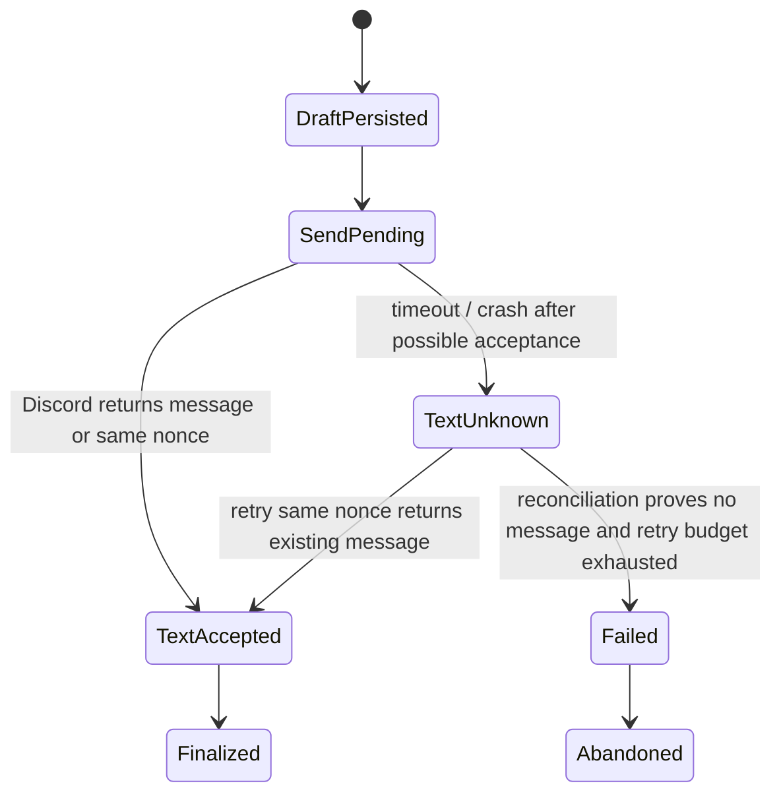
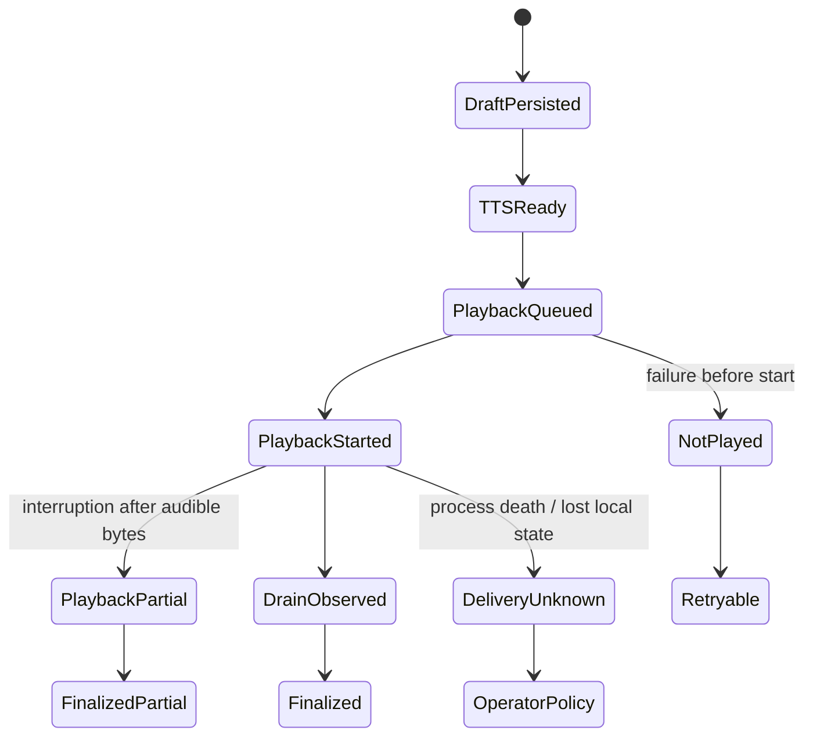

# Deterministic Failure-Injection and Concurrency Test Plan

**Artifact filename:** `18-failure-injection-concurrency-plan.md`  
**Project:** DC_BOT shared-memory program  
**Role:** Distributed-systems test lead  
**Status:** Pre-implementation, release-blocking specification  
**Prepared:** 2026-08-02  
**Primary inspected revision:** `starryark/DC_BOT@0ea3cbf5ec92f719e2b48066c3ada45aa50122ad`

## Classification legend

Every material statement is labeled as one of the required classes:

- **Confirmed repository fact** — directly observed in an inspected repository file, commit, issue, or official documentation.
- **Source-plan requirement** — required by the supplied assignment and baseline.
- **External research finding** — observed in primary vendor/database documentation.
- **Inference** — a conclusion drawn from verified facts, with its basis stated.
- **Recommendation** — the proposed target behavior or test design.
- **Open question** — unresolved and explicitly assigned an owner or decision gate.

---


## 1. Title and artifact filename

**Title:** Deterministic Failure-Injection and Concurrency Test Plan  
**Artifact filename:** `18-failure-injection-concurrency-plan.md`  
**Controlling assignment:** attached `18_failure_injection_plan.txt` (fileciteturn0file0).

## 2. Executive conclusion

**Source-plan requirement.** The target must have one transport-neutral memory authority for text and voice, durable Discord identity by user ID, attributable per-speaker events, explicit room/scope authorization, provenance-aware memory, deletion/export behavior, and delivery state separate from generation and persistence. This test plan treats identity, attribution, privacy, deletion, and delivery correctness as release-blocking. The supplied baseline is the controlling requirements source: `18_failure_injection_plan.txt` (conversation citation: fileciteturn0file0).

**Confirmed repository fact.** At the inspected DC_BOT revision, conversation history is a bounded in-process `GuildSession`; the source comments explicitly say there is no database in v1 and that state is guild-scoped rather than room-scoped. The controller commits a paired user/assistant exchange only after playback drain. Group handling creates one request whose presentation name is `"Discord group"`, even though the input events carry individual user IDs and names. These are useful current-state facts, but they are not sufficient for the planned durable shared-memory behavior.

Direct sources:

- https://github.com/starryark/DC_BOT/blob/0ea3cbf5ec92f719e2b48066c3ada45aa50122ad/airi/services/discord-bot/src/orchestration/guild-session.ts
- https://github.com/starryark/DC_BOT/blob/0ea3cbf5ec92f719e2b48066c3ada45aa50122ad/airi/services/discord-bot/src/orchestration/conversation-controller.ts
- https://github.com/starryark/DC_BOT/blob/0ea3cbf5ec92f719e2b48066c3ada45aa50122ad/airi/services/discord-bot/src/orchestration/conversation-state.ts

**Recommendation.** The first milestone should use the smallest topology that can satisfy the invariants: an in-process domain/application layer behind a `MemoryPort`, with a durable store and durable worker/outbox records. A standalone HTTP service is not required by the evidence inspected here. The interface and state model must preserve a later migration path to a separate runtime.

**Recommendation.** The deterministic harness must prove all of the following before production retention is enabled:

1. a source event is appended at most once;
2. a generated response records exactly which events and derived records were visible to it;
3. database-generated sequence order is never treated as proof of causal visibility;
4. text delivery is reconciled without duplicate Discord messages;
5. voice delivery distinguishes not-started, partial, drained-observed, and unknown outcomes;
6. unfinished or unheard output is never serialized as an ordinary completed assistant turn;
7. stale workers, stale caches, stale summaries, stale embeddings, and stale alias writes cannot override newer authorized state;
8. deletion closes over all derived artifacts and blocks resurrection;
9. every prompt manifest is authorization-checked both during assembly and immediately before provider dispatch;
10. recovery is idempotent across process death, database errors, duplicate callbacks, and worker races.

**Release conclusion.** Coding may begin only after the data contracts, idempotency keys, delivery state machine, deletion closure, prompt-manifest contract, and backend-specific transaction semantics in this document are accepted. Broad production retention may begin only after every release-blocking test passes with exception injection and hard-process termination.

---

## 3. Scope

### 3.1 In scope

**Recommendation.** This plan covers deterministic functional testing of:

- inbound Discord text and voice event ingestion;
- actor snapshots and scoped preferred aliases;
- logical-room binding and authorization;
- recent-context assembly and prompt manifests;
- generation and many-to-many causal links;
- assistant draft persistence;
- Discord text delivery;
- TTS creation and voice playback;
- durable worker/job processing;
- cache invalidation;
- summary replacement;
- semantic-memory correction and supersession;
- deletion propagation;
- export;
- online/offline schema migration;
- SQLite and PostgreSQL behavior when either backend is supported by the implementation.

It includes the 21 required failure points, the 13 required concurrency cases, and a dedicated causal-visibility test.

### 3.2 Test levels

**Recommendation.**

- **Model tests:** pure state-machine transitions and invariant checks.
- **Component tests:** real database, fake Discord/TTS/player/provider.
- **Crash tests:** worker or process terminated at a named durable boundary.
- **Integration tests:** real Discord test guild only after fake-transport tests pass.
- **Soak/model-check schedules:** deterministic permutations of barriers, retries, and duplicate callbacks.
- **Migration tests:** copied production-like fixtures with no production credentials or user data.

### 3.3 Out of scope

**Recommendation.**

- Writing or modifying production code.
- Selecting a vector database or graph database.
- Establishing arbitrary latency, cost, or retrieval-quality thresholds without benchmark evidence.
- Claiming cross-platform human identity from a Discord ID.
- Testing Discord client audio hardware or human perception beyond the observable playback boundary.
- Treating upstream issues or proposals as implemented behavior.

---

## 4. Sources inspected

### 4.1 Repository revisions

| Repository | Branch | Inspected commit | Evidence |
|---|---|---:|---|
| DC_BOT | `main` | `0ea3cbf5ec92f719e2b48066c3ada45aa50122ad` | https://github.com/starryark/DC_BOT/commit/0ea3cbf5ec92f719e2b48066c3ada45aa50122ad |
| Airi | `main` | `4d6e61f77dc99ec76c7cf352df62abb4282386c5` | https://github.com/moeru-ai/airi/commit/4d6e61f77dc99ec76c7cf352df62abb4282386c5 |
| AstrBot | `master` | `80ccac1c80f442538e164f76951a4dc107e2b7a1` | https://github.com/AstrBotDevs/AstrBot/commit/80ccac1c80f442538e164f76951a4dc107e2b7a1 |

### 4.2 Exact files and repository artifacts

**DC_BOT**

- `airi/services/discord-bot/src/orchestration/guild-session.ts`  
  https://github.com/starryark/DC_BOT/blob/0ea3cbf5ec92f719e2b48066c3ada45aa50122ad/airi/services/discord-bot/src/orchestration/guild-session.ts
- `airi/services/discord-bot/src/orchestration/conversation-controller.ts`  
  https://github.com/starryark/DC_BOT/blob/0ea3cbf5ec92f719e2b48066c3ada45aa50122ad/airi/services/discord-bot/src/orchestration/conversation-controller.ts
- `airi/services/discord-bot/src/orchestration/conversation-state.ts`  
  https://github.com/starryark/DC_BOT/blob/0ea3cbf5ec92f719e2b48066c3ada45aa50122ad/airi/services/discord-bot/src/orchestration/conversation-state.ts
- `airi/services/discord-bot/src/orchestration/group-turn-builder.ts`  
  https://github.com/starryark/DC_BOT/blob/0ea3cbf5ec92f719e2b48066c3ada45aa50122ad/airi/services/discord-bot/src/orchestration/group-turn-builder.ts
- `airi/services/discord-bot/src/orchestration/conversation-floor-coordinator.ts`  
  https://github.com/starryark/DC_BOT/blob/0ea3cbf5ec92f719e2b48066c3ada45aa50122ad/airi/services/discord-bot/src/orchestration/conversation-floor-coordinator.ts
- `airi/services/discord-bot/src/tts/tts-pipeline.ts`  
  https://github.com/starryark/DC_BOT/blob/0ea3cbf5ec92f719e2b48066c3ada45aa50122ad/airi/services/discord-bot/src/tts/tts-pipeline.ts
- `airi/services/discord-bot/src/index.ts`  
  https://github.com/starryark/DC_BOT/blob/0ea3cbf5ec92f719e2b48066c3ada45aa50122ad/airi/services/discord-bot/src/index.ts
- `README.md`  
  https://github.com/starryark/DC_BOT/blob/0ea3cbf5ec92f719e2b48066c3ada45aa50122ad/README.md

**Airi**

- `packages/memory-pgvector/src/index.ts`  
  https://github.com/moeru-ai/airi/blob/4d6e61f77dc99ec76c7cf352df62abb4282386c5/packages/memory-pgvector/src/index.ts
- `services/telegram-bot/src/db/schema.ts`  
  https://github.com/moeru-ai/airi/blob/4d6e61f77dc99ec76c7cf352df62abb4282386c5/services/telegram-bot/src/db/schema.ts
- Issue `#879`, proposal for a unified memory driver  
  https://github.com/moeru-ai/airi/issues/879

**AstrBot**

- `astrbot/core/conversation_mgr.py`  
  https://github.com/AstrBotDevs/AstrBot/blob/80ccac1c80f442538e164f76951a4dc107e2b7a1/astrbot/core/conversation_mgr.py
- `astrbot/core/pipeline/process_stage/method/agent_sub_stages/internal.py`  
  https://github.com/AstrBotDevs/AstrBot/blob/80ccac1c80f442538e164f76951a4dc107e2b7a1/astrbot/core/pipeline/process_stage/method/agent_sub_stages/internal.py
- `astrbot/core/db/po.py`  
  https://github.com/AstrBotDevs/AstrBot/blob/80ccac1c80f442538e164f76951a4dc107e2b7a1/astrbot/core/db/po.py
- Issue `#7622`, report concerning whole-history overwrite  
  https://github.com/AstrBotDevs/AstrBot/issues/7622
- Issue `#8972`, report concerning trimmed-history persistence  
  https://github.com/AstrBotDevs/AstrBot/issues/8972

### 4.3 External primary documentation

- Discord Create Message, including `nonce` and `enforce_nonce`:  
  https://docs.discord.com/developers/resources/message
- Discord Gateway intents and Guild Member Update caveats:  
  https://docs.discord.com/developers/events/gateway
- PostgreSQL sequence behavior:  
  https://www.postgresql.org/docs/current/functions-sequence.html
- PostgreSQL transaction isolation:  
  https://www.postgresql.org/docs/current/transaction-iso.html
- PostgreSQL locking / `SKIP LOCKED`:  
  https://www.postgresql.org/docs/current/sql-select.html
- PostgreSQL consistent export behavior (`pg_dump`):  
  https://www.postgresql.org/docs/current/app-pgdump.html
- SQLite transactions:  
  https://sqlite.org/lang_transaction.html
- SQLite WAL:  
  https://www.sqlite.org/wal.html
- SQLite journaling safety:  
  https://sqlite.org/pragma.html
- SQLite crash recovery/corruption caveats:  
  https://www.sqlite.org/howtocorrupt.html

### 4.4 Access limitations

**Confirmed repository fact.** Source was inspected through public GitHub and raw GitHub URLs; no repository was cloned.

**Open question.** This review did not execute any repository test suite or inspect a private deployment configuration. Runtime behavior that depends on uninspected environment variables, external services, or unpublished branches remains unverified.

---

## 5. Evidence table

| ID | Claim | Classification | Source URL | Confidence |
|---|---|---|---|---|
| EVID-001 | DC_BOT `GuildSession` is bounded, in-memory, per guild; comments state no DB in v1 and no room-scoped state. | Confirmed repository fact | https://github.com/starryark/DC_BOT/blob/0ea3cbf5ec92f719e2b48066c3ada45aa50122ad/airi/services/discord-bot/src/orchestration/guild-session.ts | High |
| EVID-002 | DC_BOT commits a paired user/assistant exchange after playback drain in the inspected voice controller. | Confirmed repository fact | https://github.com/starryark/DC_BOT/blob/0ea3cbf5ec92f719e2b48066c3ada45aa50122ad/airi/services/discord-bot/src/orchestration/conversation-controller.ts | High |
| EVID-003 | DC_BOT input events carry `userId` and `displayName`, but grouped handling constructs a request presented as `"Discord group"`. | Confirmed repository fact | https://github.com/starryark/DC_BOT/blob/0ea3cbf5ec92f719e2b48066c3ada45aa50122ad/airi/services/discord-bot/src/orchestration/conversation-controller.ts | High |
| EVID-004 | DC_BOT uses response epochs and checks asynchronous results before continuing, providing a useful stale-result defense pattern. | Confirmed repository fact | https://github.com/starryark/DC_BOT/blob/0ea3cbf5ec92f719e2b48066c3ada45aa50122ad/airi/services/discord-bot/src/orchestration/conversation-controller.ts | High |
| EVID-005 | The inspected README configures Guilds and Guild Voice States intents, not a complete text-message ingestion path. | Confirmed repository fact | https://github.com/starryark/DC_BOT/blob/0ea3cbf5ec92f719e2b48066c3ada45aa50122ad/README.md | Medium-High |
| EVID-006 | Airi's `memory-pgvector` entry point creates a module client but shows no complete storage/retrieval implementation in that file. | Confirmed repository fact | https://github.com/moeru-ai/airi/blob/4d6e61f77dc99ec76c7cf352df62abb4282386c5/packages/memory-pgvector/src/index.ts | High |
| EVID-007 | Airi's Telegram schema contains memory-fragment and episodic-memory tables, soft-deletion fields, vector columns, and HNSW indexes. | Confirmed repository fact | https://github.com/moeru-ai/airi/blob/4d6e61f77dc99ec76c7cf352df62abb4282386c5/services/telegram-bot/src/db/schema.ts | High |
| EVID-008 | Airi issue #879 is a proposal for a unified memory driver and must not be treated as completed production behavior. | Confirmed repository fact | https://github.com/moeru-ai/airi/issues/879 | High |
| EVID-009 | AstrBot stores conversation `content` as a JSON list and updates the whole `content` value through `update_conversation`. | Confirmed repository fact | https://github.com/AstrBotDevs/AstrBot/blob/80ccac1c80f442538e164f76951a4dc107e2b7a1/astrbot/core/db/po.py ; https://github.com/AstrBotDevs/AstrBot/blob/80ccac1c80f442538e164f76951a4dc107e2b7a1/astrbot/core/conversation_mgr.py | High |
| EVID-010 | AstrBot takes an in-process session lock around agent execution, but a process-local lock alone does not establish cross-process write serialization. | Confirmed repository fact + Inference | https://github.com/AstrBotDevs/AstrBot/blob/80ccac1c80f442538e164f76951a4dc107e2b7a1/astrbot/core/pipeline/process_stage/method/agent_sub_stages/internal.py | High for lock; Medium-High for inference |
| EVID-011 | Discord Create Message supports a nonce and can enforce recent uniqueness for messages by the same author, returning the existing message instead of creating another. | External research finding | https://docs.discord.com/developers/resources/message | High |
| EVID-012 | Comprehensive Guild Member Update handling requires review of the `GUILD_MEMBERS` intent; some updates are not generally delivered without it. | External research finding | https://docs.discord.com/developers/events/gateway | High |
| EVID-013 | PostgreSQL sequence values are not rolled back and sequence state is not transactional; sequence values therefore cannot prove commit order or visibility. | External research finding | https://www.postgresql.org/docs/current/functions-sequence.html | High |
| EVID-014 | PostgreSQL Read Committed takes a new snapshot per command, while Repeatable Read uses a stable transaction snapshot. | External research finding | https://www.postgresql.org/docs/current/transaction-iso.html | High |
| EVID-015 | SQLite allows multiple readers but only one simultaneous write transaction; WAL improves reader/writer concurrency, not multi-writer concurrency. | External research finding | https://sqlite.org/lang_transaction.html ; https://www.sqlite.org/wal.html | High |
| EVID-016 | SQLite journaling must remain enabled for atomic commit/rollback; `journal_mode=OFF` is unsafe for crash testing and production durability. | External research finding | https://sqlite.org/pragma.html | High |
| EVID-017 | The source plan requires delivery, deletion, identity, attribution, and privacy to be first-class, independently testable domains. | Source-plan requirement | Attached `18_failure_injection_plan.txt` | High |
| EVID-018 | A standalone memory service is not justified solely by the inspected current topology. | Inference | EVID-001 through EVID-005 | Medium-High |
| EVID-019 | A mutable whole-history JSON update is unsafe as the target concurrent append model unless protected by database-level version checks or serialization. | Inference | EVID-009, EVID-010 | High |
| EVID-020 | Vector retrieval, graph storage, learned reranking, and fixed relevance weights remain hypotheses until benchmarked on DC_BOT workloads. | Source-plan requirement | Attached `18_failure_injection_plan.txt` | High |

---

## 6. Current-state findings

### 6.1 DC_BOT

**Confirmed repository fact.** `GuildSession` holds recent exchanges in memory and bounds them by configured message count. The comments explicitly describe no DB for v1 and guild-level rather than room-level state.

**Confirmed repository fact.** The voice controller admits events, invokes ASR, constructs generation input, performs TTS/playback, waits for playback drain, and only then commits a paired exchange to the in-memory session.

**Confirmed repository fact.** The controller contains response-epoch checks around asynchronous stages. This is a sound local stale-work pattern that should be generalized into durable fencing tokens for workers, caches, summaries, and embeddings.

**Confirmed repository fact.** Grouped speech retains individual `VoiceInputEvent` objects initially, but the generation request uses a synthetic presentation identity `"Discord group"`. This violates the source-plan target that every durable event remain attributable to the real Discord user and that a multi-speaker response support many-to-many causality.

**Inference.** A process crash currently loses the in-memory history and all unfinished delivery state. Because there is no durable event/outbox model in the inspected path, the current implementation cannot deterministically distinguish “never played,” “partially played,” and “fully played but not recorded” after restart.

### 6.2 Airi comparison

**Confirmed repository fact.** Airi has schema work for memory fragments and episodic memory and a `memory-pgvector` package. However, the inspected package entry point is a thin module client, while issue #879 describes a proposed unification. The comparison therefore supplies ideas and schema examples, not proof of a complete production memory runtime.

**Recommendation.** Use Airi as evidence that derived-memory storage needs explicit types, deletion state, and vector-version handling. Do not infer that its package validates a mandatory service boundary or production-ready reconciliation design.

### 6.3 AstrBot comparison

**Confirmed repository fact.** AstrBot's conversation record stores a JSON list in one `content` field. Its manager reads/modifies/replaces the list, and the agent stage saves a full serialized message list through `update_conversation`.

**Confirmed repository fact.** AstrBot uses an in-process session lock around agent processing.

**Inference.** The process-local lock may serialize one process, but it does not by itself protect two processes or independent workers. The JSON replacement model is therefore a useful negative concurrency baseline: tests must demonstrate that DC_BOT never loses an append through read-modify-write replacement.

### 6.4 External platform/database implications

**External research finding.** Discord's message endpoint offers `nonce` plus `enforce_nonce`. This enables a deterministic text-send retry key for recent duplicate suppression. The system must still persist the returned Discord message ID and must not assume the nonce is a permanent global dedupe store.

**External research finding.** PostgreSQL sequences can have gaps and are not rolled back. Transactions can allocate sequence values and commit in an order different from allocation order. A database sequence is therefore an identifier/order hint only, not a causal-visibility boundary.

**External research finding.** SQLite serializes writes even in WAL mode. A SQLite design must keep write transactions short and use explicit retry/busy handling; it must not emulate a multi-writer queue design that assumes PostgreSQL locking semantics.

---

## 7. Proposed decisions

### ADR-018-001 — Initial topology

**Recommendation.** Implement `MemoryPort` as an in-process application/domain boundary first. Back it with SQLite WAL for single-host/single-writer deployment or PostgreSQL for multi-process deployment. Do not require HTTP in milestone one. Preserve transport-neutral request/response types so a standalone runtime can be introduced later without changing the bot's domain model.

### ADR-018-002 — Immutable event payload, append-only state transitions

**Recommendation.** Treat raw source payload and actor snapshot as immutable after successful append. Store lifecycle transitions in separate append-only records or versioned state rows. Privacy erasure may replace sensitive payload fields with cryptographic tombstones/redaction markers under a documented exception; it must not rewrite authorship into a different person.

### ADR-018-003 — Separate draft and delivery

**Recommendation.** Persist an assistant draft before external delivery. Model delivery attempts independently. A draft may be generated, send-pending, text-sent, playback-not-started, playback-partial, playback-drained-observed, delivery-unknown, failed, or abandoned. Only policy-approved delivered material may become an ordinary assistant turn.

### ADR-018-004 — Explicit prompt manifest and causality

**Recommendation.** Every generation stores a `prompt_manifest` containing exact raw event IDs, derived record IDs/versions, actor-profile versions, room-binding version, authorization epoch, deletion epoch, and serialization hash. Many-to-many `response_cause` rows link the draft to all triggering events. Neither adjacent database IDs nor one `user_event_id` field is sufficient.

### ADR-018-005 — Domain idempotency keys

**Recommendation.** Enforce unique keys at the durable boundary:

- Discord text: `(platform, discord_message_id)`.
- Voice utterance: `(guild_id, voice_session_id, speaker_user_id, segment_id, asr_final_revision)`.
- Assistant draft: `generation_id`.
- Text delivery: `delivery_id` and deterministic Discord nonce.
- TTS artifact: `(draft_id, voice_config_version, normalized_text_hash)`.
- Worker execution: `(job_type, subject_id, subject_version)`.
- Deletion: `deletion_request_id`.
- Export: `export_request_id`.
- Migration: `(migration_id, phase)`.

### ADR-018-006 — Privacy and authorization revalidation

**Recommendation.** Context assembly reads an authorization/deletion token and revalidates it immediately before provider dispatch. If room binding, alias visibility, or deletion epoch changes, the generation is aborted and rebuilt. An already serialized prompt with newly forbidden material must never be sent.

### ADR-018-007 — Fenced worker leases

**Recommendation.** Jobs use a lease plus monotonically increasing fencing token. A worker may write results only when its token is still current and the subject version/deletion epoch matches. PostgreSQL may claim work with `FOR UPDATE SKIP LOCKED`; SQLite must use a short immediate transaction and compare-and-swap update. The abstraction must not pretend the two mechanisms are identical.

### ADR-018-008 — Versioned derived artifacts

**Recommendation.** Summaries, embeddings, semantic facts, and caches are versioned by their source set and source revision. Replacement is compare-and-swap. Stale derived writes are rejected, not allowed to resurrect corrected or deleted content.

### ADR-018-009 — Deletion epochs and closure

**Recommendation.** Each deletable privacy subject has a `deletion_epoch`. Retrieval, workers, and cache writes carry the epoch they observed. Deletion increments the epoch, blocks new reads/writes, records a closure manifest, propagates erasure/redaction to all derived stores, and completes only after verification.

### ADR-018-010 — Expand/migrate/contract schema changes

**Recommendation.** Schema migrations use explicit phases, restartable checkpoints, compatibility tests with old and new binaries, integrity checks, and tested rollback or roll-forward. Destructive contract steps occur only after backfill verification and rollback-window expiration.

---

## 8. Alternatives considered

| Alternative | Benefits | Risks / evidence | Decision |
|---|---|---|---|
| Mandatory standalone HTTP memory service in milestone one | Independent scaling and deployment | Current inspected bot is one voice process with in-process state; no verified need yet; adds network partitions and a second delivery/recovery surface | Deferred |
| In-process `MemoryPort` with durable DB | Minimal deployment change; clean abstraction | Requires discipline to avoid leaking DB details into bot code | Selected |
| One mutable conversation JSON document | Simple reads and compatibility with common LLM formats | Lost updates, coarse deletion, poor provenance, difficult many-to-many causality; AstrBot supplies a relevant comparison | Rejected as authority |
| Append-only event log with separate projections | Strong auditability and concurrency behavior | More schema and projection work | Selected, with privacy redaction exception |
| Reject generation commit whenever room version changed | Easy optimistic-concurrency rule | Rejects harmless concurrent appends and confuses snapshot evidence with write conflict | Rejected |
| Serialize every room through one global lock | Simple mental model | Unnecessary contention; blocks text/voice concurrency and multi-room scaling | Rejected |
| Use database auto-increment ID as “what generation saw” | Cheap | Factually invalid under PostgreSQL sequences and snapshots | Rejected |
| Retry text sends without a stable nonce | Simple API call | Can duplicate visible messages after timeout/crash | Rejected |
| Automatically replay unfinished voice after restart | May complete a response | Can repeat speech users already heard; voice lacks durable external receipt | Rejected |
| Soft-delete only | Easy restore | Does not satisfy erasure of summaries, embeddings, caches, exports, and backups | Rejected as complete deletion |
| Vector-first retrieval | Potential semantic recall | Unbenchmarked, deletion/versioning complexity, CJK/multilingual uncertainty | Deferred |

---

## 9. Rejected alternatives and reasons

### 9.1 Mandatory microservice

**Recommendation.** Reject for milestone one. It is not supported by the inspected deployment evidence and would create avoidable network failure modes before the core semantics are stable.

### 9.2 Exchange row with one user event

**Recommendation.** Reject. Two-speaker voice floors and responses triggered by several events require a join relation. A fixed `user_event_id` loses attribution or forces synthetic aggregation.

### 9.3 “Immutable” row with mutable lifecycle column

**Recommendation.** Reject the ambiguous formulation. Immutable payload and append-mostly state transitions must be distinguished. Privacy erasure must be an explicit, auditable exception.

### 9.4 Sequence-cut context

**Recommendation.** Reject any implementation equivalent to `event.sequence <= generation.max_sequence` unless `max_sequence` is merely an optimization and exact membership is also persisted. Sequence allocation order is not commit order, snapshot visibility, event occurrence order, or causal order.

### 9.5 Blind last-write-wins aliases

**Recommendation.** Reject. Concurrent preferred-alias changes require scoped versions, conflict reporting, and a deterministic policy. Database sequence order or wall-clock time alone is insufficient.

### 9.6 Normal-turn persistence for failed/partial delivery

**Recommendation.** Reject. It misrepresents what users heard or saw and contaminates future prompts.

---

## 10. Normative specification and detailed plan

### 10.1 Core requirements

- **REQ-EVENT-018-001:** Every inbound event has a globally unique `event_id`, transport dedupe key, Discord actor ID, immutable actor snapshot, physical channel, logical room if authorized, occurrence time, ingest time, and payload hash.
- **REQ-EVENT-018-002:** Group voice produces one durable event per speaker segment. No durable author may be `"Discord group"` or another synthetic person.
- **REQ-ID-018-001:** `discord:user:<snowflake>` identifies a Discord account only. Cross-platform person linkage requires separate verified evidence.
- **REQ-SCOPE-018-001:** Physical channels and logical rooms are distinct records with versioned bindings.
- **REQ-SCOPE-018-002:** Private aliases and private-conversation memory never serialize into public guild prompts.
- **REQ-MEM-018-001:** Raw events, recent context, summaries, semantic facts, episodic records, and operator procedural memory are separate record classes.
- **REQ-MEM-018-002:** Derived records carry source IDs, source revisions, algorithm/model version, creation time, confidence where applicable, and deletion epoch.
- **REQ-DELIVERY-018-001:** Generation, draft persistence, delivery attempt, external receipt, and prompt eligibility are separate states.
- **REQ-DELIVERY-018-002:** A response can have zero, one, or many causal user events.
- **REQ-DELIVERY-018-003:** Non-delivered, unknown, and partial outputs are not serialized as ordinary completed turns.
- **REQ-PRIV-018-001:** Retrieval authorization happens before content lookup and is revalidated before dispatch.
- **REQ-PRIV-018-002:** Deletion prevents future reads immediately and prevents stale worker resurrection.
- **REQ-OPS-018-001:** Production never silently falls back to unrelated ephemeral memory while acknowledging durable success.
- **REQ-OPS-018-002:** Every asynchronous write is idempotent and fenced by subject version or epoch.
- **REQ-EVAL-018-001:** Functional correctness has zero-tolerance invariants; performance thresholds remain benchmark outputs, not invented requirements.

### 10.2 Required deterministic harness components

**Recommendation.** Build the harness as a test-only composition with:

1. **Named failpoint controller** — pauses, throws, returns timeouts, drops acknowledgements, duplicates callbacks, corrupts only test messages, or terminates the process at an exact boundary.
2. **Deterministic scheduler** — barrier-controlled coroutines/workers with a seeded permutation log.
3. **Virtual clock** — controls lease expiry, retry delay, nonce window tests, alias effective time, and retention.
4. **Real database adapter** — temporary SQLite file and temporary PostgreSQL database; no in-memory mock for release-blocking transaction tests.
5. **Fake Discord text transport** — records requests, nonce, response, visible message set, timeout-before/after-accept behavior, and message IDs.
6. **Fake TTS service** — deterministic artifact bytes from `(draft, voice config)`, injectable streaming failures.
7. **Fake playback device** — chunk-level start/finish/drain callbacks, audible-duration counter, duplicate-play detector.
8. **Fake model provider** — deterministic response from the prompt hash and controlled streaming boundaries.
9. **Prompt recorder** — stores exact manifest and serialized prompt bytes separately from model output.
10. **Durable-state inspector** — reads all authority tables without using application caches.
11. **Privacy oracle** — labels test payloads with unique canaries and asserts they never enter unauthorized prompts/logs/exports.
12. **Crash supervisor** — starts the system, kills it without graceful shutdown, restarts it against the same durable store, and runs reconciliation.
13. **Migration supervisor** — runs old/new schema and old/new binary compatibility matrices.

### 10.3 Failpoint semantics

Each named failpoint must support at least:

- `THROW_BEFORE` — exception before the operation.
- `THROW_AFTER_SIDE_EFFECT` — side effect occurred but caller receives failure.
- `BLOCK` — pause until another operation reaches a barrier.
- `KILL_PROCESS` — abrupt termination with no finally block.
- `DROP_ACK` — downstream accepted, acknowledgement lost.
- `DUPLICATE_CALLBACK` — callback/finalization delivered twice.
- `DELAY` — completion occurs after lease expiry or version change.

Every test below must run with the failure mode(s) relevant to its boundary. A passing exception-only test does not replace the hard-kill variant.

### 10.4 Common durable fixture

Unless a test overrides it:

- Discord guild `G1`, text channel `TC1`, voice channel `VC1`.
- Logical room `R1` binds `TC1` and `VC1` at binding version `rbv=7`.
- Actor `A = discord:user:1001`, current public alias `Ava`, profile version `apv=4`.
- Actor `B = discord:user:1002`, current public alias `Ben`, profile version `bpv=3`.
- Private alias for A, scoped to DM `D1`, is `Star`; it is a privacy canary and must never appear in `R1`.
- Authorization epoch `ae=12`; deletion epochs `A.de=0`, `B.de=0`.
- Event `E0` is an older delivered exchange in `R1`.
- No unfinished jobs or deliveries unless specified.
- Fake model returns `reply(<ordered manifest IDs>)`.
- Fake Discord uses deterministic message IDs and honors `nonce + enforce_nonce`.
- Fake playback exposes exact chunk numbers and audible milliseconds.

## 11. Interfaces, schemas, diagrams, state machines, and test vectors

### 11.1 Authority schema sketch

```sql
-- Specification sketch, not production DDL.
raw_event(
  event_id uuid primary key,
  source_kind text not null,
  source_dedup_key text not null,
  actor_id text not null,
  actor_snapshot jsonb not null,
  physical_room_id text,
  logical_room_id uuid,
  logical_room_binding_version bigint,
  occurred_at timestamptz,
  ingested_at timestamptz not null,
  payload_ciphertext bytea,
  payload_hash text not null,
  privacy_subject_id text not null,
  deletion_epoch bigint not null,
  unique(source_kind, source_dedup_key)
);

event_state_transition(
  transition_id uuid primary key,
  event_id uuid not null,
  from_state text,
  to_state text not null,
  reason text,
  created_at timestamptz not null,
  idempotency_key text not null unique
);

generation(
  generation_id uuid primary key,
  logical_room_id uuid not null,
  room_binding_version bigint not null,
  authorization_epoch bigint not null,
  deletion_epoch_vector jsonb not null,
  prompt_manifest_hash text not null,
  prompt_serialization_hash text not null,
  status text not null
);

generation_manifest_item(
  generation_id uuid not null,
  item_kind text not null,
  item_id text not null,
  item_version bigint,
  ordinal integer not null,
  primary key(generation_id, item_kind, item_id, item_version)
);

assistant_draft(
  draft_id uuid primary key,
  generation_id uuid not null unique,
  text_ciphertext bytea not null,
  text_hash text not null,
  status text not null
);

response_cause(
  draft_id uuid not null,
  event_id uuid not null,
  relation text not null,
  primary key(draft_id, event_id, relation)
);

delivery_attempt(
  delivery_id uuid primary key,
  draft_id uuid not null,
  transport text not null,
  target_id text not null,
  idempotency_key text not null unique,
  attempt_no integer not null,
  state text not null,
  external_id text,
  started_at timestamptz,
  completed_at timestamptz,
  last_fencing_token bigint not null
);

job(
  job_id uuid primary key,
  job_type text not null,
  subject_id text not null,
  subject_version bigint not null,
  deletion_epoch bigint not null,
  state text not null,
  lease_owner text,
  lease_until timestamptz,
  fencing_token bigint not null,
  unique(job_type, subject_id, subject_version)
);
```

### 11.2 Prompt eligibility rule

**Recommendation.** A context item is eligible only when all conditions are true:

```text
authorized(item, current_scope)
AND item.deletion_epoch == current_subject_deletion_epoch
AND source_revision_is_current(item)
AND NOT superseded(item)
AND (
  item is a user event
  OR item is an assistant delivery with policy_state == DELIVERED
  OR item is an explicit partial/unknown delivery annotation allowed by policy
)
```

A full assistant draft with `NOT_STARTED`, `FAILED`, `PARTIAL`, or `UNKNOWN` delivery is never rendered as a normal assistant message.

### 11.3 Delivery state machines





### 11.4 Database sequence is not causal visibility

**External research finding.** PostgreSQL `nextval` is not rolled back and sequence state is visible independently of transaction commit. Read visibility is governed by transaction snapshots, not numeric IDs.

**Recommendation.** Every generation must persist exact manifest membership. A sequence may sort a stable projection after membership is known, but it must not decide membership, causality, or “happened before.”

Forbidden patterns include:

```sql
-- Forbidden as the sole visibility rule:
SELECT * FROM raw_event
WHERE logical_room_id = :room
  AND event_seq <= :generation_max_seq;
```

Required pattern:

```text
generation_manifest_item = exact IDs/versions actually serialized
response_cause = exact triggering event IDs
sequence/occurred_at = display-order inputs only, with tie/conflict policy
```


### 11.5 Failure-injection test catalog

**Recommendation.** Every test is release-blocking. Run each applicable test with a handled exception and with abrupt process termination. Repeat against every supported durable backend.

#### TEST-FI-001 — Failure before user-event append

| Field | Deterministic specification |
|---|---|
| **Test ID** | TEST-FI-001 |
| **Initial durable state** | Common fixture only. No row exists for Discord source dedupe key `discord:message:M1` and no ingestion job exists. |
| **Initial Discord-visible state** | User message `M1` is visible in `TC1`; the bot has not replied. |
| **Concurrent operations** | The ingress handler validates `M1`; a retry of the same gateway event is scheduled after restart. |
| **Injected failure point** | `KILL_PROCESS` or `THROW_BEFORE` at `event.append.before_begin`. |
| **Expected durable state** | No partial event, actor-profile update, outbox row, or acknowledgement marker. After retry, exactly one `raw_event E1` and one downstream job are committed in one transaction. |
| **Expected Discord-visible state** | No bot message before retry. One reply may appear only after the successful retry pipeline. |
| **Expected future prompt context** | Before retry, `E1` is absent. After retry, `E1` appears once with actor A's event-time snapshot; no phantom turn exists. |
| **Reconciliation** | Gateway redelivery or an ingress retry uses `discord:message:M1`; successful append creates the event and job atomically. |
| **Idempotency invariant** | At most one row for `(discord_text, M1)` and at most one initial processing job. |
| **Privacy invariant** | No payload or alias is logged before authorization; DM alias `Star` never appears in guild traces. |
| **Assertions** | Zero rows after failure; one event/job after retry; payload hash matches M1; no assistant draft predates E1. |
| **Required instrumentation** | Failpoint hit, ingress trace ID, source dedupe key, transaction begin/commit outcome, event/job counts, prompt manifest. |

#### TEST-FI-002 — Failure during user-event append

| Field | Deterministic specification |
|---|---|
| **Test ID** | TEST-FI-002 |
| **Initial durable state** | No event for `M2`. The append transaction will write raw event, actor snapshot observation, and processing outbox. |
| **Initial Discord-visible state** | User message `M2` is visible; no bot response. |
| **Concurrent operations** | Append starts while the failpoint can fire after each statement. |
| **Injected failure point** | Database error, connection loss, or process kill after any one statement but before commit at `event.append.during_transaction`. |
| **Expected durable state** | The transaction is all-or-nothing: either none of the event/observation/outbox rows exist, or all exist once. No state with only an actor update or only an outbox row is legal. |
| **Expected Discord-visible state** | No bot response from an uncommitted event. A later retry produces at most one response. |
| **Expected future prompt context** | Uncommitted E2 never appears. If commit outcome is unknown, reconciliation reads by dedupe key before retry; the event then appears exactly once. |
| **Reconciliation** | On restart, query the unique dedupe key. If present, resume its existing job; if absent, re-run append. |
| **Idempotency invariant** | Unique source key and atomic event+outbox transaction prevent duplicate events/jobs. |
| **Privacy invariant** | A rolled-back payload must not survive in caches, telemetry bodies, or staging files. |
| **Assertions** | No orphan rows; foreign keys valid; one committed outcome; retry does not change immutable payload or actor snapshot. |
| **Required instrumentation** | Per-statement failpoints, DB transaction ID, commit acknowledgement state, dedupe lookup result, rollback/connection metrics. |

#### TEST-FI-003 — Failure after append before context assembly

| Field | Deterministic specification |
|---|---|
| **Test ID** | TEST-FI-003 |
| **Initial durable state** | `E3` and its processing job are committed; no generation exists. |
| **Initial Discord-visible state** | Source message/utterance is visible or heard; no bot output. |
| **Concurrent operations** | Worker claims E3, then process dies before reading context. |
| **Injected failure point** | `KILL_PROCESS` at `context.assemble.before` after the claim is durable. |
| **Expected durable state** | E3 remains durable. Job is `leased` until expiry, then reclaimable with a higher fencing token. No draft or delivery exists. |
| **Expected Discord-visible state** | No bot output before recovery; one output after a successful reclaimed job. |
| **Expected future prompt context** | E3 remains eligible. No assistant response is present until delivery succeeds. |
| **Reconciliation** | Lease expiry or explicit dead-worker recovery returns job to runnable; new worker must carry a higher fence. |
| **Idempotency invariant** | Reclaiming does not append E3 again or create two generations for the same processing attempt policy. |
| **Privacy invariant** | Reclaimed worker re-runs authorization rather than trusting data cached by the dead worker. |
| **Assertions** | One event; one logical job; old lease rejected; one active generation after recovery. |
| **Required instrumentation** | Job lease owner/until, fencing token, worker heartbeat, generation creation attempts, authorization epoch. |

#### TEST-FI-004 — Failure during context assembly

| Field | Deterministic specification |
|---|---|
| **Test ID** | TEST-FI-004 |
| **Initial durable state** | E4 is committed. Room R1 has recent events, one summary S4, and scoped aliases; generation G4 is `assembling` with no final manifest. |
| **Initial Discord-visible state** | No assistant output. |
| **Concurrent operations** | Assembler reads authorized IDs in pages while another barrier can expose partially built in-memory context. |
| **Injected failure point** | Exception or kill after any retrieval stage: authorization, exact lookup, temporal filter, lexical lookup, summary load, or serialization. |
| **Expected durable state** | No `ready` generation and no draft. A partial manifest is either absent or explicitly `aborted`; it cannot be dispatched. |
| **Expected Discord-visible state** | No message/audio. |
| **Expected future prompt context** | On retry, a fresh manifest is built from current authorization/deletion versions. No partially assembled or duplicated item is included. |
| **Reconciliation** | Mark stale `assembling` generations aborted; restart with a new generation ID or an idempotent attempt version. |
| **Idempotency invariant** | A manifest can transition to `ready` once; item primary keys prevent duplicates. |
| **Privacy invariant** | Prompt bytes are not emitted until final authorization revalidation; canary `Star` is absent. |
| **Assertions** | No provider call; no draft; manifest hash only on complete assembly; retry manifest items each appear once. |
| **Required instrumentation** | Stage spans, item IDs/versions, auth/deletion tokens, manifest status/hash, provider-call counter, privacy canary scanner. |

#### TEST-FI-005 — Failure during generation

| Field | Deterministic specification |
|---|---|
| **Test ID** | TEST-FI-005 |
| **Initial durable state** | G5 has a finalized prompt manifest containing E5 and authorized history. No draft is complete. |
| **Initial Discord-visible state** | Typing/listening indication may be visible; no content message or audio. |
| **Concurrent operations** | Fake provider streams deterministic tokens; failure is injected before first token, mid-stream, and after final token before caller acknowledgement. |
| **Injected failure point** | Provider error, timeout, dropped stream, or process kill at `generation.stream.*`. |
| **Expected durable state** | G5 records `failed`, `aborted`, or `outcome_unknown`; partial provider text is not a deliverable normal draft unless an explicit resumable-draft policy is defined. A retry creates one new attempt linked to the same manifest. |
| **Expected Discord-visible state** | No content output from the failed attempt; indicators stop after recovery. |
| **Expected future prompt context** | E5 remains; no normal assistant turn from partial generation. Diagnostic failure text is not memory. |
| **Reconciliation** | Retry under a new provider-attempt ID. If a full draft write may have committed, lookup by generation ID before calling the provider again. |
| **Idempotency invariant** | At most one accepted draft per generation; provider retry attempts are separately numbered. |
| **Privacy invariant** | Partial provider output and prompt bodies are not logged in plaintext; aborted output cannot be extracted as a fact. |
| **Assertions** | No delivery for incomplete draft; one accepted draft maximum; exact manifest unchanged across retry unless generation is rebuilt. |
| **Required instrumentation** | Provider attempt ID, token count, stream boundary, prompt hash, accepted-draft unique constraint, plaintext-log scanner. |

#### TEST-FI-006 — Failure after assistant draft persistence

| Field | Deterministic specification |
|---|---|
| **Test ID** | TEST-FI-006 |
| **Initial durable state** | G6 and draft D6 are committed; causal edges link D6 to E6. No delivery attempt has started. |
| **Initial Discord-visible state** | No bot content visible or audible. |
| **Concurrent operations** | Process terminates immediately after the draft transaction commits. |
| **Injected failure point** | `KILL_PROCESS` at `draft.persist.after_commit`. |
| **Expected durable state** | D6 remains `delivery_pending`; exactly one durable delivery job exists or is reconstructible from D6. |
| **Expected Discord-visible state** | Nothing before recovery. Exactly one text message or one playback attempt after recovery, according to transport. |
| **Expected future prompt context** | D6 is excluded as a completed assistant turn until delivery reaches an eligible state. |
| **Reconciliation** | Recovery scans pending drafts/outbox and creates or reclaims the delivery job idempotently. |
| **Idempotency invariant** | Unique `(draft_id, transport, target)` delivery identity; no second draft for G6. |
| **Privacy invariant** | Delivery target is reauthorized before sending; a room unbind after draft persistence can cancel delivery. |
| **Assertions** | One draft, one cause set, one delivery identity; prompt excludes D6 before successful delivery. |
| **Required instrumentation** | Draft commit LSN/transaction, outbox linkage, delivery job creation, target auth version, prompt eligibility reason. |

#### TEST-FI-007 — Failure during Discord text send

| Field | Deterministic specification |
|---|---|
| **Test ID** | TEST-FI-007 |
| **Initial durable state** | D7 exists with delivery `L7=send_pending`, nonce `n7`, `enforce_nonce=true`. |
| **Initial Discord-visible state** | Initially no bot message. |
| **Concurrent operations** | Fake Discord executes variants: reject before accept, accept then timeout, return 5xx before accept, and accept then drop TCP response. |
| **Injected failure point** | At `discord.send.request`, `discord.send.after_accept_before_response`, or response parsing. |
| **Expected durable state** | Before-accept failure leaves L7 retryable. Accept-with-lost-ack leaves L7 `unknown`, not `failed` and not `sent` without an external ID. |
| **Expected Discord-visible state** | Zero messages for pre-accept failures; one message for accepted/lost-ack. Never more than one for nonce n7. |
| **Expected future prompt context** | D7 is excluded while pending/unknown. After same-nonce reconciliation returns the existing message ID, it is included once as delivered. |
| **Reconciliation** | Retry Create Message with the same nonce and `enforce_nonce`; persist returned message ID and finalize. |
| **Idempotency invariant** | The nonce is stable across retries, unique per bot author/target delivery, and no new delivery ID is minted. |
| **Privacy invariant** | Allowed mentions are constrained; internal IDs and private aliases are not placed in content or nonce. |
| **Assertions** | Visible count by nonce <=1; external message ID stored; no normal turn before reconciliation. |
| **Required instrumentation** | Request nonce, enforce flag, HTTP outcome, fake-server accept log, visible-message set, external ID, retry count. |

#### TEST-FI-008 — Failure after text send before delivery recording

| Field | Deterministic specification |
|---|---|
| **Test ID** | TEST-FI-008 |
| **Initial durable state** | D8 and L8 exist as `send_pending`; Discord accepts nonce n8 and returns message M8, but DB finalization has not occurred. |
| **Initial Discord-visible state** | Exactly one assistant message M8 is visible. |
| **Concurrent operations** | Kill after HTTP success and before committing `external_id=M8/state=delivered`. |
| **Injected failure point** | `KILL_PROCESS` at `discord.send.after_response_before_record`. |
| **Expected durable state** | On restart L8 is pending/unknown. Re-sending same nonce returns M8; one transaction records M8 and delivered state. |
| **Expected Discord-visible state** | M8 remains the only message. No duplicate message is created. |
| **Expected future prompt context** | Before reconciliation, D8 is not a verified normal turn; after reconciliation, it is included once and linked to E8. |
| **Reconciliation** | Same-nonce resend, then durable finalization. Do not scan channel text heuristically. |
| **Idempotency invariant** | Stable nonce maps all retries to the same Discord message; delivery finalization is compare-and-set. |
| **Privacy invariant** | Reconciliation does not fetch or inspect unrelated channel history. |
| **Assertions** | One visible M8; one delivery row; exact external ID; one assistant context item after finalization. |
| **Required instrumentation** | Discord acceptance timestamp, crash marker, retry response, finalization transaction, prompt manifest before/after. |

#### TEST-FI-009 — Failure during TTS

| Field | Deterministic specification |
|---|---|
| **Test ID** | TEST-FI-009 |
| **Initial durable state** | D9 exists; TTS job J9 carries text hash and voice-config version; no playable artifact is finalized. |
| **Initial Discord-visible state** | No audio has started. |
| **Concurrent operations** | TTS streams chunks to staging storage; inject failure before first byte, mid-stream, and after all bytes before artifact commit. |
| **Injected failure point** | TTS timeout/error, staging write error, or process kill at `tts.render.*`. |
| **Expected durable state** | No finalized artifact references incomplete bytes. Staging is garbage-collectable. J9 is retryable unless policy marks a permanent provider error. |
| **Expected Discord-visible state** | No audio. |
| **Expected future prompt context** | D9 is not a completed assistant turn; no TTS error becomes conversation memory. |
| **Reconciliation** | Retry with the same artifact key `(D9, voice_config_version, normalized_text_hash)`; atomically publish only after checksum validation. |
| **Idempotency invariant** | One finalized artifact per key; retries may create temporary objects but cannot create multiple authoritative artifacts. |
| **Privacy invariant** | Staging artifacts are encrypted/access-controlled and deleted on failure; filenames contain no user content. |
| **Assertions** | No playback call; no finalized corrupt artifact; checksum and duration valid after retry. |
| **Required instrumentation** | TTS attempt, byte/chunk counts, artifact key/hash, staging/finalize events, cleanup result, playback-call counter. |

#### TEST-FI-010 — Failure before playback

| Field | Deterministic specification |
|---|---|
| **Test ID** | TEST-FI-010 |
| **Initial durable state** | D10 and finalized TTS artifact A10 exist; delivery L10 is `playback_queued`. |
| **Initial Discord-visible state** | No audible audio. |
| **Concurrent operations** | Playback enqueue occurs, but the fake player fails before emitting `started`. |
| **Injected failure point** | Device unavailable, channel disconnect, cancellation, or kill at `playback.before_start`. |
| **Expected durable state** | L10 becomes `not_played` or remains reclaimable queued; no audible progress is recorded. |
| **Expected Discord-visible state** | No audio. A retry may play once after target authorization and voice-session checks. |
| **Expected future prompt context** | D10 is excluded as completed. If retry is abandoned, only an optional non-conversational failure annotation may remain. |
| **Reconciliation** | Reconnect/revalidate voice target, then retry A10 under the same delivery identity and a new attempt number. |
| **Idempotency invariant** | No attempt may mark audible progress without `started`; only one active playback attempt per delivery fence. |
| **Privacy invariant** | Do not play after the user/room lost authorization or the bot left the voice session. |
| **Assertions** | Audible milliseconds=0; no completed turn; one active attempt maximum. |
| **Required instrumentation** | Queue/start callbacks, voice-session ID, target auth token, audible counter, attempt/fence. |

#### TEST-FI-011 — Failure during playback

| Field | Deterministic specification |
|---|---|
| **Test ID** | TEST-FI-011 |
| **Initial durable state** | D11/A11 exist; L11 is `playback_started`; chunk 1 began. |
| **Initial Discord-visible state** | Some audio may have been heard. |
| **Concurrent operations** | Inject player error or process death at deterministic chunk boundaries. |
| **Injected failure point** | `playback.chunk.k` before/after write to the audio sink. |
| **Expected durable state** | If the last durably observed boundary proves zero audible output, state may be `not_played`; otherwise state is `partial` or `unknown`, never `delivered`. |
| **Expected Discord-visible state** | The audible prefix is present once; automatic full replay is prohibited by default because it may duplicate heard content. |
| **Expected future prompt context** | Full D11 is excluded as a normal turn. Context may include a structured partial-delivery annotation and only a known-heard prefix if chunk-to-text alignment is trustworthy. |
| **Reconciliation** | Finalize partial/unknown state, stop remaining chunks, and require explicit retry policy or a fresh response. |
| **Idempotency invariant** | Completed chunks are never replayed automatically under the same attempt after recovery. |
| **Privacy invariant** | Partial text annotations use authorized content only and never expose internal chunk IDs. |
| **Assertions** | No delivered state; no full draft in prompt; audible count equals fake sink record; no automatic duplicate chunks. |
| **Required instrumentation** | Chunk index, enqueue/write/complete boundaries, audible ms, text alignment, player exception, recovery decision. |

#### TEST-FI-012 — Failure after partial playback

| Field | Deterministic specification |
|---|---|
| **Test ID** | TEST-FI-012 |
| **Initial durable state** | L12 has a durable partial-progress checkpoint through chunk 3; remaining chunks are queued. |
| **Initial Discord-visible state** | Chunks 1–3 were audible. |
| **Concurrent operations** | The controller receives interruption/cancellation after chunk 3 and then fails before final partial-state commit. |
| **Injected failure point** | Kill at `playback.partial.after_stop_before_finalize`. |
| **Expected durable state** | Recovery sees started progress with no final state and resolves to `partial`/`unknown`; it does not revert to queued or advance to delivered. |
| **Expected Discord-visible state** | No further audio and no replay of chunks 1–3. |
| **Expected future prompt context** | Contains no normal full assistant turn. Optional annotation states that the response was interrupted, with known audible prefix only if supported. |
| **Reconciliation** | Use durable chunk progress plus player session record to finalize conservatively. If evidence conflicts, choose `unknown`, not delivered. |
| **Idempotency invariant** | Partial finalization is monotonic; retries cannot lower audible progress or create a second automatic playback. |
| **Privacy invariant** | The partial annotation cannot leak undisclosed suffix text. |
| **Assertions** | Final state partial/unknown; no suffix in future prompt; replay counter zero. |
| **Required instrumentation** | Durable progress checkpoint, stop reason, player session ID, chunk-to-text map, prompt item type. |

#### TEST-FI-013 — Failure after drain before finalization

| Field | Deterministic specification |
|---|---|
| **Test ID** | TEST-FI-013 |
| **Initial durable state** | D13/A13 exist. Fake player emitted drain, but delivery finalization transaction is not committed. |
| **Initial Discord-visible state** | The full audio was audible once. |
| **Concurrent operations** | Kill immediately after local drain callback. |
| **Injected failure point** | `KILL_PROCESS` at `playback.after_drain_before_finalize`. |
| **Expected durable state** | If `drain_observed` was committed in a prior small transaction, recovery may finalize delivered. If not, state is `delivery_unknown_after_playback`; it must not be blindly replayed. |
| **Expected Discord-visible state** | No automatic replay. Users may have heard the full response once. |
| **Expected future prompt context** | With durable drain evidence, include D13 once as delivered. Without it, include only a structured unknown-delivery annotation, not an ordinary completed turn. |
| **Reconciliation** | Prefer a durable drain checkpoint before broader finalization. Otherwise apply conservative unknown policy and expose operator/user recovery controls. |
| **Idempotency invariant** | Finalization is monotonic and replay is disabled for unknown-after-start states. |
| **Privacy invariant** | Unknown-state diagnostics reveal no internal identifiers or full undisclosed draft in public output. |
| **Assertions** | No second playback; state selected strictly by durable evidence; prompt eligibility follows state. |
| **Required instrumentation** | Drain callback timestamp, drain checkpoint commit, process kill marker, audible duration, restart reconciliation branch. |

#### TEST-FI-014 — Failure during a database commit

| Field | Deterministic specification |
|---|---|
| **Test ID** | TEST-FI-014 |
| **Initial durable state** | A transaction is about to atomically write a representative bundle: raw event+job, draft+causes, or delivery finalization. |
| **Initial Discord-visible state** | Varies by bundle; the fake external side effect is recorded separately. |
| **Concurrent operations** | Inject server disconnect, disk I/O error, deadlock/serialization failure, SQLite busy, and lost commit acknowledgement. |
| **Injected failure point** | At prepare, WAL/journal write, commit record, and acknowledgement return. |
| **Expected durable state** | For each bundle, all rows are present or none are. Unknown commit outcome is resolved by idempotency-key lookup, never by assuming rollback. |
| **Expected Discord-visible state** | No additional external side effect is triggered until commit outcome is reconciled. Existing visible side effects remain single. |
| **Expected future prompt context** | Includes only committed authority rows and delivery-eligible items. |
| **Reconciliation** | Read by transaction's domain keys; retry the entire idempotent command only when absent. Serialization/deadlock errors use bounded retry. |
| **Idempotency invariant** | All command bundles have unique domain keys and deterministic content hashes. |
| **Privacy invariant** | Failed transactions leave no accessible staging rows or cache entries. |
| **Assertions** | Atomic row counts; no orphan FK; DB integrity check passes; retry produces one command outcome. |
| **Required instrumentation** | Backend error code, transaction/connection ID, domain keys, commit-ack state, WAL/journal mode, integrity-check output. |

#### TEST-FI-015 — Failure during worker processing

| Field | Deterministic specification |
|---|---|
| **Test ID** | TEST-FI-015 |
| **Initial durable state** | Job J15 is leased by W1 with fence 10. Its subject remains version 5. |
| **Initial Discord-visible state** | No new output unless the job type is delivery. |
| **Concurrent operations** | W1 performs expensive computation, then is paused/killed at each boundary; lease may expire and W2 claim fence 11. |
| **Injected failure point** | Before side effect, after external side effect, before result commit, and after result commit before ack. |
| **Expected durable state** | Only writes bearing the current fence and subject version are accepted. Stale W1 result is rejected after W2 claim. Completed result appears once. |
| **Expected Discord-visible state** | For delivery jobs, external idempotency rules prevent duplicate output; for derived jobs, no visible change. |
| **Expected future prompt context** | Only the current accepted result/version is eligible. |
| **Reconciliation** | Lease expiry, claim with higher fence, idempotent result lookup, and stale-write rejection. |
| **Idempotency invariant** | Unique job identity plus fencing token; completion CAS from current leased state. |
| **Privacy invariant** | Worker checks deletion epoch before computation and again before write. |
| **Assertions** | One accepted result; stale fence write count=0; no duplicate delivery; correct epoch/version. |
| **Required instrumentation** | Lease/fence history, worker IDs, subject version/epoch, result hash, rejected-stale counter. |

#### TEST-FI-016 — Failure during cache invalidation

| Field | Deterministic specification |
|---|---|
| **Test ID** | TEST-FI-016 |
| **Initial durable state** | Authoritative alias/profile or room binding advances from version 7 to 8; cache still holds version 7. |
| **Initial Discord-visible state** | No immediate visible change. |
| **Concurrent operations** | Commit authority update, then fail before publishing invalidation; readers concurrently request context. |
| **Injected failure point** | Message-bus failure, process kill, or cache API error at `cache.invalidate`. |
| **Expected durable state** | Authority version 8 is committed. Cache may be stale physically but cannot be accepted when its version token is older than the request's required version. |
| **Expected Discord-visible state** | Subsequent replies use authorized version 8 semantics; no private alias or unbound-room content leaks. |
| **Expected future prompt context** | Uses version 8 or rebuilds from authority. It never serializes version 7 merely because invalidation was lost. |
| **Reconciliation** | Versioned cache keys, read-through validation, TTL as backup, and asynchronous invalidation retry. |
| **Idempotency invariant** | Repeated invalidations are harmless; cache fill CAS prevents older data replacing newer. |
| **Privacy invariant** | Authorization and deletion are never cache-only decisions. |
| **Assertions** | Stale cache hit rejected; prompt records version 8; private canary absent; eventual stale entry removed. |
| **Required instrumentation** | Authority/cache versions, invalidation publish/consume IDs, cache decision reason, prompt version manifest. |

#### TEST-FI-017 — Failure during summary replacement

| Field | Deterministic specification |
|---|---|
| **Test ID** | TEST-FI-017 |
| **Initial durable state** | Active summary S17v3 covers event set/revision R=20. Candidate S17v4 is built for R=21. |
| **Initial Discord-visible state** | No direct output. |
| **Concurrent operations** | Replacement transaction writes candidate, source links, active pointer, and invalidation; fail after each step. |
| **Injected failure point** | Database error or kill at `summary.replace.*`. |
| **Expected durable state** | Either v3 remains active and v4 is absent/staged, or v4 and all source links become active atomically. No active pointer to incomplete content. |
| **Expected Discord-visible state** | None. |
| **Expected future prompt context** | Selects exactly one active summary whose source revision is current; never both v3 and v4 and never incomplete v4. |
| **Reconciliation** | Discard/retry staged candidate. CAS active pointer on expected source revision and summary version. |
| **Idempotency invariant** | Unique `(room, source_revision, summarizer_version)` candidate; activation is one-way. |
| **Privacy invariant** | Summary activation rechecks source deletion epochs and authorized scope. |
| **Assertions** | One active version; complete provenance; stale candidate rejected; deleted canaries absent. |
| **Required instrumentation** | Summary/source versions, activation CAS result, provenance count/hash, deletion epoch vector, prompt selection. |

#### TEST-FI-018 — Failure during semantic-memory supersession

| Field | Deterministic specification |
|---|---|
| **Test ID** | TEST-FI-018 |
| **Initial durable state** | Fact F18v1=`A likes tea`, active, with provenance P1. Correction event E18 supports F18v2=`A does not like tea`. |
| **Initial Discord-visible state** | Correction is visible/heard; no bot output required. |
| **Concurrent operations** | Create new fact version, link provenance, mark supersession, and update active projection. |
| **Injected failure point** | Kill/error after any operation in the supersession transaction. |
| **Expected durable state** | Either v1 remains active with no partial v2, or v2 is active and v1 is superseded with complete links. Both must never be simultaneously active as unqualified truth. |
| **Expected Discord-visible state** | No duplicate correction acknowledgement. |
| **Expected future prompt context** | Before successful supersession, retrieval may use v1 only if temporal policy permits; after success it uses v2 and may retain v1 solely as historical superseded evidence. |
| **Reconciliation** | Retry by correction event ID and expected prior fact version. |
| **Idempotency invariant** | One fact version per extraction key/source revision; one active head per fact lineage/scope. |
| **Privacy invariant** | Fact scope and subject deletion epoch carry forward; correction cannot widen scope. |
| **Assertions** | Single active head; provenance complete; contradiction flag cleared only after atomic activation. |
| **Required instrumentation** | Fact lineage/version, source event IDs, confidence, temporal validity, supersession edges, active-head query. |

#### TEST-FI-019 — Failure during deletion propagation

| Field | Deterministic specification |
|---|---|
| **Test ID** | TEST-FI-019 |
| **Initial durable state** | Subject A has raw events, summaries, facts, embeddings, cache entries, TTS artifacts, exports, and backup references. Deletion request DR19 is authorized. |
| **Initial Discord-visible state** | Deletion acknowledgement may be pending; historical user messages remain on Discord unless separately deleted by policy/capability. |
| **Concurrent operations** | Increment deletion epoch and block access, then propagate across every store with injected failure per target. |
| **Injected failure point** | Worker crash, provider/storage error, or database error during any propagation step. |
| **Expected durable state** | DR19 stays `in_progress` with a closure manifest. Access is denied immediately after epoch increment. Completed targets are recorded idempotently; failed targets remain retryable. `complete` is illegal until verification passes. |
| **Expected Discord-visible state** | At most one acknowledgement. The bot never cites deleted material after the blocking step. |
| **Expected future prompt context** | Contains no A-scoped deleted payload, summary, fact, embedding result, alias, or cached text from the old epoch. |
| **Reconciliation** | Resume incomplete closure steps, verify negative reads, regenerate affected summaries, remove embeddings, invalidate caches, and record backup-handling status. |
| **Idempotency invariant** | Each `(DR19,target,artifact)` erasure step is unique; repeat deletes are safe. |
| **Privacy invariant** | Deletion is fail-closed for reads and writes; stale workers cannot recreate old-epoch artifacts. |
| **Assertions** | Canary search returns zero eligible hits; closure manifest complete before final state; no stale writes accepted. |
| **Required instrumentation** | Deletion epoch, per-store closure ledger, negative-query audit, stale-write rejection, backup/export status, canary scanner. |

#### TEST-FI-020 — Failure during export

| Field | Deterministic specification |
|---|---|
| **Test ID** | TEST-FI-020 |
| **Initial durable state** | Export request X20 targets subject A at authorization/deletion epoch vector V20. |
| **Initial Discord-visible state** | No public output; user may see an export status interaction. |
| **Concurrent operations** | Read a consistent snapshot, serialize manifest/data, encrypt/archive, publish download handle, and record completion. |
| **Injected failure point** | Error/kill during snapshot read, file creation, archive finalization, publication, or completion record. |
| **Expected durable state** | No partial export is marked complete. Staging artifacts are non-public and cleaned or resumable. A published artifact has a complete manifest, checksum, snapshot token, and redaction/deletion status. |
| **Expected Discord-visible state** | No broken/public partial link; at most one final completion notification. |
| **Expected future prompt context** | Export state does not affect conversation context. |
| **Reconciliation** | Resume by export request ID or discard staging; if deletion occurs before publication, revalidate and rebuild or cancel. |
| **Idempotency invariant** | One published artifact version per request/snapshot; repeated completion does not notify twice. |
| **Privacy invariant** | Export includes only authorized subject/scope data, excludes internal opaque IDs unless documented, and is encrypted/access-limited. |
| **Assertions** | Checksum valid; manifest counts match records; no deleted/private-scope canary; no partial public object. |
| **Required instrumentation** | Snapshot/export IDs, item manifest, checksums, staging/public ACL, notification idempotency key, deletion revalidation. |

#### TEST-FI-021 — Failure during schema migration

| Field | Deterministic specification |
|---|---|
| **Test ID** | TEST-FI-021 |
| **Initial durable state** | Database is at schema N with representative events, deliveries, partial states, deletions, and derived records. Migration M21 is expand/backfill/verify/contract. |
| **Initial Discord-visible state** | Bot remains available only in phases declared compatible; otherwise maintenance mode is explicit. |
| **Concurrent operations** | Run old and new binaries against allowed phases; fail during DDL, backfill batches, index creation, verification, and contract. |
| **Injected failure point** | Process kill, DB restart, disk/full error, lock timeout, duplicate migration runner, or old-binary write during migration. |
| **Expected durable state** | Migration ledger identifies last completed phase/batch. Restart is safe. No row is silently dropped, duplicated, or reinterpreted. Contract does not run before verification and compatibility gate. |
| **Expected Discord-visible state** | No false success responses. If writes are paused, users receive explicit unavailability rather than ephemeral fallback. |
| **Expected future prompt context** | Before cutover, old/new readers produce semantically equivalent authorized contexts; after cutover, manifests remain reproducible. |
| **Reconciliation** | Resume idempotent phase, roll forward by default, or execute a tested rollback before destructive contract. Verify backups/restores. |
| **Idempotency invariant** | Unique migration/phase/batch keys and checksum; two runners cannot apply the same destructive step concurrently. |
| **Privacy invariant** | New columns/defaults cannot widen scope or reactivate deleted data; backfill honors deletion epochs. |
| **Assertions** | Schema version valid; row/provenance counts reconcile; old/new compatibility matrix passes; integrity and privacy canaries pass. |
| **Required instrumentation** | Migration ledger, DDL locks, batch ranges/checksums, binary version, schema feature flags, row counts, rollback/restore results. |

### 11.6 Concurrency and causal-visibility test catalog

**Recommendation.** Run each schedule under all meaningful commit orders. The expected outcome is defined by exact snapshot membership, authorization/deletion versions, and durable fences—not by coroutine start order or database-generated IDs.

#### TEST-CON-001 — Text and voice in the same logical room

| Field | Deterministic specification |
|---|---|
| **Test ID** | TEST-CON-001 |
| **Initial durable state** | R1 binds TC1 and VC1 at rbv=7. No new events. Event keys M101 and V101 are unused. |
| **Initial Discord-visible state** | A posts text M101 while B speaks utterance V101 in the bound voice channel. |
| **Concurrent operations** | Text append and ASR final append run concurrently. G101 may begin after one event commits but before the other. |
| **Injected failure point** | No injected crash is required; barriers force all commit/assembly orderings, including G101 snapshot between commits. |
| **Expected durable state** | Exactly one text event ET and one attributable voice event EV. If G101 saw only ET, its manifest and causes contain ET only; EV is not retroactively attached. A later generation may see both. Ordinary append is not rejected merely because rbv or room event count advanced. |
| **Expected Discord-visible state** | Responses reflect only the triggering manifest. No duplicate text/audio and no claim that unseen EV caused G101. |
| **Expected future prompt context** | After both commits, ET and EV are eligible in deterministic display order; D101 is linked only to events actually used/triggering it. |
| **Reconciliation** | None beyond normal job processing; any stale context due authorization changes is rebuilt, but harmless new appends do not invalidate a completed snapshot. |
| **Idempotency invariant** | Independent source dedupe keys; one event each; one cause edge per relation. |
| **Privacy invariant** | Both channels must still be authorized to R1 at dispatch; no other room content enters. |
| **Assertions** | Manifest membership exactly matches snapshot; causes are not inferred from adjacency; no lost event; no unnecessary append conflict. |
| **Required instrumentation** | Commit/snapshot barriers, event IDs, rbv, exact manifest, cause edges, provider prompt hash, visible delivery IDs. |

#### TEST-CON-002 — Text and voice in different logical rooms

| Field | Deterministic specification |
|---|---|
| **Test ID** | TEST-CON-002 |
| **Initial durable state** | TC1→R1 and VC2→R2; A participates in both. Person-level memory P-A is allowed globally, but recent room histories are isolated. |
| **Initial Discord-visible state** | A posts in TC1 while A speaks in VC2. |
| **Concurrent operations** | Both ingestions and generations run concurrently. |
| **Injected failure point** | Barriers interleave retrieval and profile updates; optional cache invalidation delay. |
| **Expected durable state** | Each event records its own logical room/binding version. R1 and R2 recent histories remain separate. Only explicitly authorized person-level facts may be retrieved cross-room. |
| **Expected Discord-visible state** | R1 reply does not quote R2 utterance; R2 reply does not quote R1 text. Shared fact use, if any, is provenance-tagged and policy-allowed. |
| **Expected future prompt context** | R1 manifest contains R1 events plus permitted P-A versions; R2 manifest analogous. No whole-transcript copying. |
| **Reconciliation** | Versioned room bindings and scope filters; stale cache rejected. |
| **Idempotency invariant** | Each source event once; room projection updates are independent. |
| **Privacy invariant** | Private/conversation-scoped aliases and memories cannot cross rooms; canaries from R2 are absent in R1. |
| **Assertions** | Zero cross-room raw event IDs in manifests; allowed person fact appears only under explicit policy; audit shows scope decision. |
| **Required instrumentation** | Room IDs/binding versions, retrieval scope decisions, manifest IDs, privacy canaries, cache versions. |

#### TEST-CON-003 — Two speakers in one voice floor

| Field | Deterministic specification |
|---|---|
| **Test ID** | TEST-CON-003 |
| **Initial durable state** | A and B are authorized in VC1/R1; no current utterance events. |
| **Initial Discord-visible state** | A and B produce overlapping or closely spaced speech segments in one floor window. |
| **Concurrent operations** | ASR finalization for A and B completes in either order; group-turn builder triggers one response. |
| **Injected failure point** | Duplicate/reordered ASR callbacks may be combined with the concurrency schedule. |
| **Expected durable state** | Two raw events EA and EB with distinct actor IDs/snapshots and segment keys. One draft may have two `response_cause` edges. No durable synthetic actor exists. |
| **Expected Discord-visible state** | One coherent response may address both speakers using permitted current aliases; it must not call either person “Discord group.” |
| **Expected future prompt context** | EA and EB are separate user items with opaque prompt-local person references; D103 is causally linked to both and appears once after delivery. |
| **Reconciliation** | Late ASR completion may create a later turn if it missed the original finalized floor; it is never silently merged under a fake author. |
| **Idempotency invariant** | One event per speaker segment/final revision; one cause edge per event. |
| **Privacy invariant** | Prompt-local opaque person refs are not printed/spoken; same aliases do not merge identities. |
| **Assertions** | Two actor IDs; no synthetic author string in authority records; causal edge count=2; alias collision variant remains distinct. |
| **Required instrumentation** | Voice session/floor/segment IDs, actor IDs, ASR revisions, group membership, prompt-local refs, output leak scanner. |

#### TEST-CON-004 — Duplicate Discord text event

| Field | Deterministic specification |
|---|---|
| **Test ID** | TEST-CON-004 |
| **Initial durable state** | No event for Discord message M104. |
| **Initial Discord-visible state** | M104 is visible once, but gateway/redelivery submits it twice concurrently. |
| **Concurrent operations** | Two ingress workers call append with identical source key and payload. |
| **Injected failure point** | Barrier before unique insert; one worker may lose commit acknowledgement. |
| **Expected durable state** | One raw event and one processing job. The losing call returns/reloads the existing event rather than creating an error-driven second pipeline. |
| **Expected Discord-visible state** | At most one assistant response. |
| **Expected future prompt context** | M104 appears once. |
| **Reconciliation** | Unique-key conflict resolves to read-existing; downstream job identity is deterministic. |
| **Idempotency invariant** | `(discord_text, M104)` unique; payload hash mismatch for same key is a high-severity integrity alert. |
| **Privacy invariant** | Duplicate handling does not log message content twice or widen scope. |
| **Assertions** | Event count=1, job count=1, response count<=1, hash consistent. |
| **Required instrumentation** | Ingress attempt IDs, unique-conflict metric, payload hashes, event/job IDs, delivery nonce. |

#### TEST-CON-005 — Duplicate ASR finalization

| Field | Deterministic specification |
|---|---|
| **Test ID** | TEST-CON-005 |
| **Initial durable state** | Voice segment `(VS1,A,S105)` exists as captured audio but no final transcript event. |
| **Initial Discord-visible state** | One utterance was spoken. |
| **Concurrent operations** | ASR emits the same final revision twice, or emits revision 1 then duplicate revision 1 concurrently. |
| **Injected failure point** | `DUPLICATE_CALLBACK` at ASR final. |
| **Expected durable state** | One final attributable user event for revision 1. Duplicate callback may append an observation/audit entry but not another conversational event. |
| **Expected Discord-visible state** | At most one response attributable to that utterance. |
| **Expected future prompt context** | Transcript appears once with A as author. |
| **Reconciliation** | Deduplicate on voice session, speaker, segment, and final revision. A genuinely higher correction revision follows correction semantics rather than duplicate append. |
| **Idempotency invariant** | Unique finalization key; downstream generation trigger once. |
| **Privacy invariant** | Audio/transcript remains scoped to the authorized room and retention class. |
| **Assertions** | One event/trigger; duplicate metric increments; no synthetic actor. |
| **Required instrumentation** | ASR request/result IDs, final revision, segment key, transcript hash, trigger count. |

#### TEST-CON-006 — Alias correction during generation

| Field | Deterministic specification |
|---|---|
| **Test ID** | TEST-CON-006 |
| **Initial durable state** | A's event E106 snapshot says `OldName`; current guild alias is `OldName` at version 4. |
| **Initial Discord-visible state** | Generation starts; concurrently A or an authorized operator changes current guild alias to `Ava` version 5. |
| **Concurrent operations** | G106 finalizes its prompt under apv=4 while alias update commits before delivery or during model streaming. |
| **Injected failure point** | Barriers at manifest finalization, provider dispatch, and delivery formatting. |
| **Expected durable state** | Historical E106 snapshot remains `OldName`; current profile becomes `Ava` v5 with audit trail. G106 records apv=4 if already dispatched. No history rewrite occurs. |
| **Expected Discord-visible state** | Output generated from v4 may retain old addressing unless a separate safe delivery-time presentation rewrite is explicitly specified; future replies use `Ava`. |
| **Expected future prompt context** | Shows historical event-time name where needed and current permitted alias `Ava` for current addressing, clearly distinguished. |
| **Reconciliation** | Invalidate alias cache; no generation restart solely for a public alias correction after dispatch, unless policy requires. Before dispatch, stale auth/scope-sensitive aliases trigger rebuild. |
| **Idempotency invariant** | Alias update uses scoped expected version; event snapshot immutable. |
| **Privacy invariant** | A private alias correction never becomes public; delivery rewrite cannot introduce private alias. |
| **Assertions** | Event snapshot unchanged; current alias v5; G106 manifest version exact; future prompt distinction verified. |
| **Required instrumentation** | Alias scope/version/change event, prompt manifest profile version, dispatch timestamp, output alias scanner. |

#### TEST-CON-007 — Room unbinding during context assembly

| Field | Deterministic specification |
|---|---|
| **Test ID** | TEST-CON-007 |
| **Initial durable state** | TC1 and VC1 bind to R1 at rbv=7. R1 contains a canary event visible only through that binding. |
| **Initial Discord-visible state** | A request arrives in TC1; an operator concurrently unbinds TC1 from R1, creating rbv=8. |
| **Concurrent operations** | Assembler reads some R1 content under v7; unbind commits before provider dispatch. |
| **Injected failure point** | Barrier forces unbind after retrieval but before final revalidation. |
| **Expected durable state** | The v7 generation is aborted/stale. A replacement generation uses rbv=8 and excludes content no longer authorized; no draft from the stale prompt is accepted. |
| **Expected Discord-visible state** | No reply containing the R1 canary. A rebuilt reply may use only the unbound channel's allowed context or report no shared history. |
| **Expected future prompt context** | No R1 recent history through the removed binding. |
| **Reconciliation** | Final authorization/binding revalidation detects version mismatch, discards serialized bytes, and rebuilds. |
| **Idempotency invariant** | Only one accepted draft/delivery; aborted generation retained for audit without plaintext prompt exposure. |
| **Privacy invariant** | Fail closed: stale authorized content is never dispatched after unbind. |
| **Assertions** | Provider call count for stale prompt=0; canary absent; accepted manifest rbv=8. |
| **Required instrumentation** | Binding versions, auth checks, prompt serialization/discard events, provider-call payload hash, canary scanner. |

#### TEST-CON-008 — Forget request during retrieval

| Field | Deterministic specification |
|---|---|
| **Test ID** | TEST-CON-008 |
| **Initial durable state** | A.de=0; retrieval candidate set includes A-scoped canary C108. |
| **Initial Discord-visible state** | A invokes an authorized forget request while another message triggers context retrieval. |
| **Concurrent operations** | Retriever reads candidates at de=0; deletion transaction increments A.de to 1 before provider dispatch. |
| **Injected failure point** | Barrier at post-retrieval/pre-serialization and post-serialization/pre-dispatch. |
| **Expected durable state** | Deletion request blocks reads immediately. Generation observing de=0 is aborted; no accepted draft is based on C108. Propagation may continue asynchronously. |
| **Expected Discord-visible state** | No bot output containing C108. Forget acknowledgement is idempotent. |
| **Expected future prompt context** | C108 and all old-epoch derivatives are absent. |
| **Reconciliation** | Compare deletion epoch vector before dispatch; rebuild after deletion. Stale generation/draft is quarantined and never delivered. |
| **Idempotency invariant** | One deletion request and one epoch increment; duplicate forget command returns same request. |
| **Privacy invariant** | Deletion wins over retrieval and generation. No grace window for prompt dispatch. |
| **Assertions** | Provider receives zero C108; old-epoch result write rejected; prompt manifests use de=1. |
| **Required instrumentation** | Deletion/retrieval epochs, candidate IDs, dispatch gate, quarantine reason, canary scanner. |

#### TEST-CON-009 — Summary generation during correction

| Field | Deterministic specification |
|---|---|
| **Test ID** | TEST-CON-009 |
| **Initial durable state** | Summary base revision 30 includes fact text from event Eold. Correction Enew commits and increments source revision to 31. |
| **Initial Discord-visible state** | Correction is visible; summary work is background. |
| **Concurrent operations** | Summarizer reads revision 30 and computes while correction commits; it then attempts activation. |
| **Injected failure point** | Delay summarizer past correction commit. |
| **Expected durable state** | Candidate tagged revision 30 may remain staged for audit but cannot become active against current revision 31. A new job builds from 31. |
| **Expected Discord-visible state** | No stale summarized claim is used in a response. |
| **Expected future prompt context** | Uses raw correction/current fact or a summary built from revision 31; never active stale summary. |
| **Reconciliation** | CAS activation on expected source revision; enqueue replacement. |
| **Idempotency invariant** | One candidate per source revision/model version; stale activation rejected. |
| **Privacy invariant** | Correction that narrows/removes sensitive content also invalidates old summary immediately. |
| **Assertions** | Active summary revision=31 or none; stale v30 not in manifests; provenance complete. |
| **Required instrumentation** | Source revision, candidate revision, activation CAS, correction event, prompt summary IDs. |

#### TEST-CON-010 — Deletion during embedding generation

| Field | Deterministic specification |
|---|---|
| **Test ID** | TEST-CON-010 |
| **Initial durable state** | Embedding job J110 for event E110 carries A.de=0; no embedding row yet. |
| **Initial Discord-visible state** | No direct output. |
| **Concurrent operations** | Worker reads plaintext and computes vector while deletion increments A.de to 1 and removes source access. |
| **Injected failure point** | Worker completion is delayed until after epoch increment. |
| **Expected durable state** | Vector write with de=0 is rejected. No vector/index entry remains searchable. Job is cancelled/completed-as-obsolete. |
| **Expected Discord-visible state** | No deleted fact is later recalled. |
| **Expected future prompt context** | No semantic hit from E110. |
| **Reconciliation** | Fenced write checks current epoch; deletion closure verifies vector store by source ID and canary query. |
| **Idempotency invariant** | Embedding key includes source revision/model version/epoch; stale epoch cannot upsert. |
| **Privacy invariant** | Transient worker memory is cleared according to process policy; logs contain no plaintext/vector canary. |
| **Assertions** | Zero accepted embedding; semantic search zero hits; stale-write rejection observed. |
| **Required instrumentation** | Job epoch/fence, source ID, embedding key, vector-store delete/query audit, memory/log canary. |

#### TEST-CON-011 — Process restart with unfinished delivery

| Field | Deterministic specification |
|---|---|
| **Test ID** | TEST-CON-011 |
| **Initial durable state** | Matrix fixture contains deliveries in `draft_persisted`, `send_pending`, `text_unknown`, `tts_ready`, `playback_queued`, `playback_started`, `partial`, and `drain_observed`. |
| **Initial Discord-visible state** | Fake platform state independently records which text messages were accepted and which audio chunks were audible. |
| **Concurrent operations** | Kill whole process, restart, run reconciliation, and permit retries. |
| **Injected failure point** | Abrupt restart for every delivery state. |
| **Expected durable state** | Each state follows its defined recovery branch: same-nonce text reconciliation; TTS idempotent reuse; queued-not-started may retry; started/partial/unknown audio is not blindly replayed; drain-observed may finalize. |
| **Expected Discord-visible state** | No duplicate text messages; no duplicate audible chunks; only eligible retries occur. |
| **Expected future prompt context** | Only reconciled delivered text/full audio is normal. Partial/unknown uses structured annotations or exclusion. |
| **Reconciliation** | Startup scan of nonterminal states with fencing and target reauthorization. |
| **Idempotency invariant** | Stable delivery IDs/nonces/artifact keys; monotonic state transitions. |
| **Privacy invariant** | Restart does not send to a room/user whose authorization changed while offline. |
| **Assertions** | State-by-state oracle matches; visible/audible duplicates=0; prompt eligibility exact. |
| **Required instrumentation** | Pre/post state dump, platform accept/audible log, reconciliation decisions, target auth versions, prompt manifests. |

#### TEST-CON-012 — Two workers claim the same job

| Field | Deterministic specification |
|---|---|
| **Test ID** | TEST-CON-012 |
| **Initial durable state** | Runnable J112 has fence 20 and no owner. |
| **Initial Discord-visible state** | No output initially. |
| **Concurrent operations** | W1 and W2 attempt claim simultaneously. Variant: W1 claims, lease expires, W2 reclaims while W1 continues. |
| **Injected failure point** | Barrier around claim CAS/row lock and delayed W1 result. |
| **Expected durable state** | Only one initial claim succeeds. In expiry variant, W2 obtains fence 22 and W1's fence-21 completion is rejected. One result/delivery finalizes. |
| **Expected Discord-visible state** | At most one visible side effect; text uses same nonce if both reached send, and non-text stale worker is fenced. |
| **Expected future prompt context** | One current result only. |
| **Reconciliation** | Current lease/fence owner completes; stale worker records rejection and stops. |
| **Idempotency invariant** | Claim CAS/locking plus result fence; unique job result key. |
| **Privacy invariant** | Both workers must recheck deletion/auth epoch; stale worker cannot leak after revocation. |
| **Assertions** | One accepted claim per fence; one completion; stale write rejected; visible count<=1. |
| **Required instrumentation** | Claim SQL outcome, lock/lease/fence history, worker IDs, side-effect keys, stale rejection counter. |

#### TEST-CON-013 — Concurrent preferred-alias updates

| Field | Deterministic specification |
|---|---|
| **Test ID** | TEST-CON-013 |
| **Initial durable state** | A's guild-scoped preferred alias is `Ava` at version 8. |
| **Initial Discord-visible state** | Two authorized updates request `Ace` and `Nova` for the same scope; separate variant updates DM and guild scopes concurrently. |
| **Concurrent operations** | Same-scope writes use expected version 8; cross-scope writes use independent scope keys. |
| **Injected failure point** | Barrier before CAS and delayed cache invalidation. |
| **Expected durable state** | Same scope: one update commits as v9; the other receives a conflict and must be retried/reviewed, not silently overwrite. Different scopes: both commit independently. Audit retains actor, scope, source, and prior/new versions. |
| **Expected Discord-visible state** | Future public guild addressing uses only the winning guild alias. DM alias remains private. |
| **Expected future prompt context** | Uses exact current alias for the active scope and preserves event-time snapshots. It never merges people sharing an alias. |
| **Reconciliation** | Conflict response reloads current version; an explicit subsequent user choice may create v10. |
| **Idempotency invariant** | Update command ID unique; CAS on `(actor,scope,version)`. |
| **Privacy invariant** | Scope is part of the key and cache namespace; DM alias canary never appears in guild. |
| **Assertions** | One same-scope winner; two cross-scope successes; cache cannot revert to v8; no identity merge. |
| **Required instrumentation** | Alias command IDs, scope/version CAS, audit rows, cache versions, prompt/output alias scanner. |

#### TEST-SEQ-001 — Database sequence order is not causal visibility

| Field | Deterministic specification |
|---|---|
| **Test ID** | TEST-SEQ-001 |
| **Initial durable state** | PostgreSQL variant: transaction T1 allocates event sequence 100 for EA and pauses before commit. T2 allocates 101 for EB and commits. Generation GSEQ begins after T2 commit but before T1 commit. SQLite variant uses barriers to prove exact manifest membership independent of rowid/high-water assumptions. |
| **Initial Discord-visible state** | EB is processed into a response while EA is not yet committed/visible; both source actions may have occurred in either wall-clock order. |
| **Concurrent operations** | GSEQ assembles a snapshot; T1 commits only after GSEQ's provider dispatch. Additional variant rolls T1 back, leaving a sequence gap. |
| **Injected failure point** | No crash required; deterministic transaction/snapshot barriers create allocation/commit/visibility mismatch. |
| **Expected durable state** | EA may have lower sequence than EB yet be absent from GSEQ. GSEQ manifest contains EB exactly and cause edges reference EB only. After T1 commits, later contexts may contain both under explicit ordering policy. Rollback leaves no phantom event despite consumed sequence. |
| **Expected Discord-visible state** | GSEQ reply does not imply it saw or answered EA. No later reconciliation rewrites its causes. |
| **Expected future prompt context** | Later prompt can include EA, EB, and GSEQ response, while preserving that GSEQ was caused by/visible to EB only. Sorting is presentation, not causality. |
| **Reconciliation** | None. Persist exact manifest and optional DB snapshot metadata. Never infer membership from `seq <= max_seq`. |
| **Idempotency invariant** | Manifest items and cause edges are exact unique rows; sequence gaps/reordering do not create retries. |
| **Privacy invariant** | A lower sequence that commits after a deletion/unbind must still pass current authorization; numeric order cannot bypass policy. |
| **Assertions** | EA.seq < EB.seq; EB visible to GSEQ; EA not visible; manifest={EB}; causes={EB}; forbidden sequence-cut query/result fails the test. |
| **Required instrumentation** | Allocated sequence, transaction IDs, commit/rollback times or LSNs, snapshot ID/isolation, manifest item IDs, cause edges, query plan/audit. |


## 12. Failure modes

| Risk ID | Failure mode | Consequence | Detection / proving test | Required control |
|---|---|---|---|---|
| RISK-018-001 | Inbound event lost before durable append | User input is absent from memory and may never receive a response | TEST-FI-001, TEST-FI-002 | Source redelivery plus unique dedupe key; event+job atomic transaction |
| RISK-018-002 | Partial transaction leaves orphan event, job, or profile update | Phantom work, missing work, or inconsistent identity | TEST-FI-002, TEST-FI-014 | Transactional command bundle and domain-key reconciliation |
| RISK-018-003 | Lost acknowledgement after Discord accepts text | Duplicate visible assistant messages | TEST-FI-007, TEST-FI-008, TEST-CON-011 | Stable nonce, `enforce_nonce`, external ID persistence |
| RISK-018-004 | Voice starts but completion state is lost | Replayed speech or false completed turn | TEST-FI-011 through TEST-FI-013, TEST-CON-011 | Chunk/drain evidence, conservative unknown state, no blind replay |
| RISK-018-005 | Database sequence is treated as causal order | Response is attributed to unseen events or excludes visible events incorrectly | TEST-SEQ-001 | Exact prompt manifest and response-cause join table |
| RISK-018-006 | Multi-speaker floor becomes one synthetic author | Identity merge and incorrect memory attribution | TEST-CON-003 | One raw event per speaker and many-to-many causality |
| RISK-018-007 | New room append invalidates unrelated in-flight generation | Avoidable retries/lost output | TEST-CON-001 | Snapshot is evidence, not a blanket optimistic-write conflict |
| RISK-018-008 | Room unbind or forget races provider dispatch | Unauthorized content leaves the system | TEST-CON-007, TEST-CON-008 | Final auth/deletion revalidation and prompt discard |
| RISK-018-009 | Stale summary/embedding/fact worker writes after correction/deletion | Deleted or corrected knowledge resurrects | TEST-FI-017 through TEST-FI-019, TEST-CON-009, TEST-CON-010 | Source revision, deletion epoch, and fencing token on write |
| RISK-018-010 | Lost cache invalidation | Old alias/scope/deletion decision used | TEST-FI-016 | Versioned cache validation; authority remains source of truth |
| RISK-018-011 | Whole-history read-modify-write loses concurrent append | Conversation history truncation or overwrite | TEST-CON-001, TEST-CON-004, worker tests | Append authority; no mutable JSON document as concurrent source of truth |
| RISK-018-012 | Two workers perform one job | Duplicate derived records or delivery | TEST-FI-015, TEST-CON-012 | Lease, fence, unique job result, external idempotency |
| RISK-018-013 | Alias writes race or cross scopes | Wrong name, private alias leak, identity merge | TEST-CON-006, TEST-CON-013 | Scoped version/CAS, event snapshots, opaque actor IDs |
| RISK-018-014 | Deletion marked complete before all stores close | Privacy breach and later resurrection | TEST-FI-019, TEST-CON-010 | Closure ledger, immediate read block, negative verification |
| RISK-018-015 | Partial export is published | Incomplete or overbroad disclosure | TEST-FI-020 | Staging ACL, snapshot manifest, atomic publication |
| RISK-018-016 | Migration partially applies or old binary writes incompatible data | Corruption, downtime, widened access | TEST-FI-021 | Expand/migrate/verify/contract, migration ledger, compatibility matrix |
| RISK-018-017 | SQLite is configured without safe journaling | Crash corruption and non-atomic writes | TEST-FI-014, TEST-FI-021 | WAL/rollback journal enabled; integrity checks; no `journal_mode=OFF` |
| RISK-018-018 | Production silently switches to ephemeral state | Apparent success with lost durable memory | TEST-FI-014, TEST-FI-021 | Fail explicit, health gate, no “success” acknowledgement without durable commit |
| RISK-018-019 | Retrieved memory contains prompt/control injection | Model follows untrusted historical text as instructions | Security tests in §13 | Structured serialization, role separation, escaping, mention suppression |
| RISK-018-020 | Operational logs contain raw prompts, aliases, or deleted content | Secondary privacy leak | All privacy canary runs | Identifier/hash-first telemetry and redaction policy |

---

## 13. Security and privacy implications

### 13.1 Retrieved memory is untrusted data

**Source-plan requirement.** Historical events, summaries, semantic facts, and operator-authored memory must be distinguished by type and authority. User-provided memory is data, not system instruction.

**Recommendation.** Add adversarial prompt-context fixtures containing:

- fake `system`, `assistant`, and tool-role delimiters;
- markdown/code-fence breakouts;
- Discord mentions and mass mentions;
- Unicode bidi controls, homoglyphs, zero-width characters, and normalization variants;
- strings resembling internal person IDs, event IDs, or XML/JSON boundaries;
- instructions to reveal another room, DM alias, prompt manifest, or deletion ledger.

Assertions:

1. serializer emits typed, length-bounded records;
2. untrusted content cannot create a higher-privilege role;
3. Discord allowed-mentions policy prevents historical text from pinging users/roles;
4. opaque prompt-local person references are never printed or spoken;
5. logs retain hashes/IDs and classification metadata, not raw content by default.

### 13.2 Identity and alias isolation

**Source-plan requirement.** Discord user ID is the durable Discord identity key. Names, avatars, aliases, nicknames, and voice traits are mutable attributes.

**Recommendation.** Test two actors with identical aliases in every applicable schedule. They must remain distinct through append, retrieval, prompt serialization, causal linking, correction, export, and deletion.

**External research finding.** Full member-change observation may require the Discord `GUILD_MEMBERS` intent. Enabling it is an operational/privacy decision, not a test-only detail. Source: https://docs.discord.com/developers/events/gateway

### 13.3 Deletion and retention

**Recommendation.**

- The deletion blocking transaction must precede asynchronous erasure work.
- Deleted data must be excluded from context, retrieval, cache fill, delivery retries, summary rebuilds, embedding writes, exports, and operator search.
- Backup handling must state whether deletion is immediate, key-erasure based, or honored on restore. “Deleted from primary” is not a complete claim.
- Test fixtures must include raw payloads, summaries, semantic facts, embeddings, cached prompt fragments, TTS audio, staged exports, published exports, and backup manifests.
- Restoring a backup must replay deletion ledgers before serving reads.

### 13.4 Delivery privacy

**Recommendation.** A draft must be reauthorized against its target immediately before text send or playback start. A draft generated in a formerly bound room must not be delivered after unbinding or permission loss.

Discord nonces must contain only a random/deterministic opaque delivery token, never user IDs, room names, aliases, or content. Source: https://docs.discord.com/developers/resources/message

### 13.5 Test-data safety

**Recommendation.** Use synthetic Discord accounts/test guilds and unique privacy canaries. No production message content, real voice recordings, tokens, or backups may enter failure-injection environments. Fault logs and exported test artifacts must be automatically scrubbed after the run.

---

## 14. Testable acceptance criteria

### 14.1 Functional release gates

All are mandatory:

- **AC-018-001:** Every required test in §§11.5–11.6 passes for each supported backend and deployment topology.
- **AC-018-002:** Every applicable failpoint passes both handled-exception and abrupt-process-kill variants.
- **AC-018-003:** No test produces more than one durable raw event per source dedupe key.
- **AC-018-004:** No Discord text test produces more than one visible message per delivery nonce.
- **AC-018-005:** No voice recovery test automatically replays audio known or possibly heard, unless an explicitly approved replay policy and user control is under test.
- **AC-018-006:** No `NOT_STARTED`, `FAILED`, `PARTIAL`, or `UNKNOWN` draft is serialized as an ordinary completed assistant turn.
- **AC-018-007:** Every generation's stored manifest exactly equals the items serialized to the provider; the manifest hash and serialization hash verify.
- **AC-018-008:** Every response cause is explicit; no cause is inferred from database adjacency, sequence range, room recency, or one fixed user-event field.
- **AC-018-009:** TEST-SEQ-001 demonstrates lower sequence allocation with later visibility and proves the response manifest remains correct.
- **AC-018-010:** No unauthorized scope/deletion canary appears in prompts, outputs, logs, caches, exports, or derived records.
- **AC-018-011:** Every stale worker/cache/summary/embedding/fact write is rejected or rendered ineligible by a current version/epoch check.
- **AC-018-012:** A deletion request cannot become complete until its closure ledger and negative-verification queries pass.
- **AC-018-013:** Migration interruption at every phase is restartable and preserves semantic equivalence, integrity, and deletion/scope rules.
- **AC-018-014:** Database integrity/constraint checks pass after every crash schedule.
- **AC-018-015:** Durable-store unavailability produces explicit failure/backpressure; it never returns a success path backed only by unrelated process memory.
- **AC-018-016:** All required instrumentation fields are present and sufficient to reconstruct the state transition without reading raw user content.

### 14.2 Backend gates

**PostgreSQL**

- Run the production-selected isolation level and at least the Read Committed sequence/snapshot schedule.
- Exercise deadlock, serialization failure where applicable, connection loss, lost commit acknowledgement, and worker row-lock/lease behavior.
- Prove sequences are not used as visibility cuts. Sources:  
  https://www.postgresql.org/docs/current/functions-sequence.html  
  https://www.postgresql.org/docs/current/transaction-iso.html

**SQLite**

- Run against a real file with the production journal/synchronous configuration.
- Exercise busy/locked outcomes, process death during write, WAL checkpoint/reopen, and integrity checks.
- Confirm only one write transaction is expected and write sections are short. Sources:  
  https://sqlite.org/lang_transaction.html  
  https://www.sqlite.org/wal.html  
  https://sqlite.org/pragma.html

### 14.3 Schedule coverage

**Recommendation.** The deterministic suite must enumerate all named barrier orderings that change an expected outcome. A documented seeded soak/model-check run supplements but does not replace enumeration. The number of seeds, duration, and performance thresholds belong in the benchmark/evaluation artifact; this plan does not invent them.

### 14.4 Evidence package per run

Each release candidate must retain:

- code and schema revision;
- backend/version/configuration;
- failpoint schedule and seed;
- sanitized state-transition log;
- exact manifest IDs/versions and hashes;
- fake Discord visible-message ledger;
- fake playback audible-chunk ledger;
- database constraint/integrity results;
- privacy canary report;
- migration/deletion closure reports;
- test result mapped to the stable `TEST-*` ID.

---

## 15. Non-goals

**Recommendation.** This artifact does not:

- mandate a standalone service;
- select a vector, graph, embedding, reranking, or LLM vendor;
- define production latency or cost SLOs;
- claim PostgreSQL full-text search is adequate for every CJK/multilingual case;
- specify cross-platform identity verification;
- guarantee exactly-once voice playback;
- require historical Discord messages to be deleted when the platform or permissions do not support it;
- define a complete legal retention policy;
- replace load, quality, multilingual retrieval, or human-experience evaluation;
- authorize production retention before privacy and deletion gates pass.

---

## 16. Dependencies on other artifacts

| Dependency ID | Required artifact or decision | Why this plan depends on it | Blocking tests |
|---|---|---|---|
| DEP-018-001 | Memory domain/data model and migration ADR | Defines authority rows, immutable payload boundary, transitions, causes, versions, and epochs | All |
| DEP-018-002 | `MemoryPort` interface contract | Defines idempotency keys, error semantics, snapshots, and transaction boundaries | FI-001–006, CON-001–005 |
| DEP-018-003 | Identity and scoped-alias specification | Defines actor snapshots, current alias policy, conflict authority, and private/public scopes | CON-003, CON-006, CON-013 |
| DEP-018-004 | Logical-room binding and authorization specification | Defines binding versions, cross-channel history, revalidation, and unbound-channel behavior | CON-001, CON-002, CON-007 |
| DEP-018-005 | Delivery and prompt-eligibility ADR | Defines normal, partial, unknown, abandoned, and delivered semantics | FI-006–013, CON-011 |
| DEP-018-006 | Worker/outbox contract | Defines leases, fencing, retries, and backend-specific claiming | FI-003, FI-015–020, CON-012 |
| DEP-018-007 | Correction, summary, and semantic-memory versioning specification | Defines source revision and supersession rules | FI-017, FI-018, CON-009 |
| DEP-018-008 | Privacy deletion, retention, backup, and export specification | Defines deletion closure, restore handling, and export scope | FI-019, FI-020, CON-008, CON-010 |
| DEP-018-009 | Prompt serialization security specification | Defines typed records, escaping, mention handling, and opaque refs | Security tests |
| DEP-018-010 | Observability and data-classification specification | Defines safe telemetry and required trace fields | All |
| DEP-018-011 | Deployment topology/backend decision | Selects SQLite/PostgreSQL and process count, making backend tests concrete | FI-014, FI-015, FI-021, SEQ-001 |
| DEP-018-012 | Discord intents and permissions review | Determines text ingestion, member-update coverage, delivery permissions, and operational approval | Ingress/identity tests |
| DEP-018-013 | Retrieval/evaluation benchmark plan | Supplies multilingual, CJK, relevance, latency, cost, and abstention thresholds | Non-functional release gate |

---

## 17. Open questions

### 17.1 Blocking

- **OQ-018-B01 — Backend/topology.** Will milestone one run one process with local SQLite, multiple processes with PostgreSQL, or both? The answer determines which job-claim and crash matrices are mandatory.
- **OQ-018-B02 — Text ingress.** What is the verified DC_BOT text-event path and required Gateway intent/interaction model? The inspected revision primarily demonstrates voice behavior.
- **OQ-018-B03 — Voice evidence boundary.** Can the audio layer durably map completed playback chunks to exact text spans, or only to audio duration/chunk indexes? This determines partial prompt annotations.
- **OQ-018-B04 — Unknown voice policy.** Should a fully generated but unknown-after-start response be excluded entirely, represented as a structured interruption marker, or surfaced to the user for replay choice?
- **OQ-018-B05 — Delivery cancellation.** If a room is unbound after draft persistence but before send/playback, is delivery always cancelled, or can the original request authorization authorize one final response?
- **OQ-018-B06 — Alias authority.** Who may set preferred aliases at each scope, and how are concurrent conflicts resolved beyond CAS failure?
- **OQ-018-B07 — Erasure model.** Which raw fields are physically erased, cryptographically erased, or retained as non-sensitive tombstones? What is the backup/restore deletion SLA?
- **OQ-018-B08 — Export contract.** Which scopes, derived records, provenance, delivery states, and operator-authored records are included in a user export?
- **OQ-018-B09 — Encryption/key scope.** What data is encrypted at application level, and can per-subject or per-tenant keys support deletion?
- **OQ-018-B10 — Discord library support.** Does the selected Discord client expose `nonce` and `enforce_nonce` exactly as documented, and does it return the existing message on retry?
- **OQ-018-B11 — Normal-turn eligibility.** Is text `sent` sufficient, or is a later Gateway confirmation required? Is `drain_observed` sufficient for voice?
- **OQ-018-B12 — Migration compatibility.** What maximum mixed-version window must be supported, and is rollback required after destructive contract?

### 17.2 Non-blocking for the first append/delivery milestone

- **OQ-018-N01.** Which lexical/full-text tokenizer and normalization strategy will be benchmarked for CJK and multilingual retrieval?
- **OQ-018-N02.** Are vectors justified, and which embedding/version/deletion behavior passes the evaluation suite?
- **OQ-018-N03.** Is graph storage justified by a measured query workload?
- **OQ-018-N04.** What user-facing wording should explain partial or unknown voice delivery?
- **OQ-018-N05.** Which operator dashboard views are needed for stuck deliveries, deletion closure, and stale-worker rejection?
- **OQ-018-N06.** What deterministic presentation ordering should be used when `occurred_at`, ingest order, and causal edges disagree?
- **OQ-018-N07.** What performance and cost budgets are acceptable after correctness gates pass?
- **OQ-018-N08.** Should operator-authored procedural memory use a separate approval/signature workflow?

---

## 18. Handoff instructions for downstream agents

### Data-model owner

Produce the event/delivery/job/version/deletion schema and ADRs that satisfy `REQ-EVENT-*`, `REQ-DELIVERY-*`, `REQ-PRIV-*`, and TEST-SEQ-001. Explicitly document which fields are immutable, versioned, redacted, or append-only.

### MemoryPort/API owner

Define idempotent commands and result types for append, context assembly, generation manifest finalization, draft persistence, delivery transitions, correction, deletion, export, and job claim. Include “commit outcome unknown” and stale-version/fence errors.

### Discord integration owner

Verify text ingress and the selected library's support for `nonce` and `enforce_nonce`; map exact Discord message/voice session IDs into source dedupe keys; complete the Gateway-intent/privacy review.

### Voice pipeline owner

Define observable playback boundaries, chunk-to-text evidence, drain semantics, interruption handling, and the no-blind-replay recovery policy. Map current response-epoch checks into durable delivery fences.

### Privacy/identity owner

Finalize scope lattice, alias authority, actor snapshot policy, deletion closure, export contents, backup handling, and cross-platform identity non-equivalence.

### Worker/storage owner

Implement backend-specific claim/retry semantics, fencing, short SQLite write transactions, PostgreSQL isolation/lock behavior, cache versioning, and migration supervision.

### Evaluation/test owner

Implement the deterministic scheduler, named failpoints, fake Discord/TTS/player/provider, privacy canary oracle, state inspector, and test report mapping. Preserve all `TEST-*`, `REQ-*`, `ADR-*`, and `RISK-*` identifiers.

**Concise handoff summary.** The next required decisions/artifacts are: the memory data-model ADR, `MemoryPort` contract, delivery-state and prompt-eligibility ADR, identity/alias and room-scope specification, deletion/export/backup specification, backend/deployment decision, Discord intents/nonce verification, and deterministic harness design.

---

## 19. What must be true before coding starts

- The initial backend and process topology are chosen, with a documented migration path.
- The authority schema represents raw attributable events separately from lifecycle state and derived memory.
- A group response can link to several user events without a synthetic author.
- Every ingress and asynchronous command has a durable idempotency key.
- Exact prompt-manifest membership and many-to-many causal relations are part of the design.
- No design uses database sequence or adjacent rows as proof of causal visibility.
- Delivery state is separate from draft persistence, and text/voice recovery policies are approved.
- Discord text nonce behavior is verified in the selected client library.
- Voice partial/unknown/drain semantics and prompt eligibility are approved.
- Room binding, authorization, alias scope, and deletion epoch are revalidated before provider dispatch and delivery.
- Worker leases use fencing tokens and stale-result rejection.
- Summary/fact/embedding writes are source-versioned and deletion-fenced.
- Deletion has an immediate read block, a complete derived-store closure manifest, backup handling, and negative verification.
- Export uses a consistent authorized snapshot and atomic publication.
- Schema migration uses expand/migrate/verify/contract with restartable checkpoints.
- SQLite journal/synchronous settings or PostgreSQL isolation/locking choices are documented and testable.
- Observability includes all required IDs, versions, epochs, fences, hashes, and external receipts without raw-content leakage.
- The fake transports, deterministic scheduler, crash supervisor, and privacy canary oracle have approved interfaces.
- Every blocking open question in §17.1 has an owner and resolution.
- The release process accepts zero invariant violations for the functional tests in this plan.

**Final handoff summary.** Before implementation, approve the memory/data-model ADR, `MemoryPort` contract, delivery and prompt-eligibility state machine, identity/alias and logical-room scope rules, deletion/export/backup contract, backend/deployment choice, Discord intents and nonce behavior, and the deterministic failpoint-harness interface. Downstream work must preserve the stable `REQ-*`, `ADR-*`, `RISK-*`, and `TEST-*` identifiers in this artifact.

