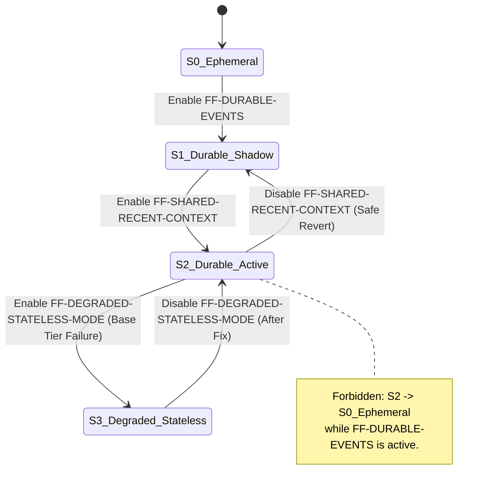

# 19-rollout-feature-flags-rollback.md

## 1. Executive Conclusion
[Recommendation] The rollout of shared-memory for DC_BOT must proceed in strict, gated stages using a hierarchical feature flag system. The paramount risk during rollout is a partial failure that causes the application to silently fall back to unrelated ephemeral memory while durable writes continue, resulting in a split-brain state where the durable record diverges from the user's experience. 

To satisfy the requirement that production must not silently fall back to unrelated ephemeral memory, the system requires a **Degraded Stateless Mode** (`FF-DEGRADED-STATELESS-MODE`). If a core memory tier (like recent context) fails and cannot be read, the system must either halt memory-dependent generation or operate statelessly while spooling events to disk for later backfill. It must never read from ephemeral memory while the durable write spool is active.

## 2. Scope
This artifact defines the rollout strategy, feature flags, stage gates, and rollback procedures for the DC_BOT shared-memory implementation. It covers the transition from process-local ephemeral histories to a durable, append-mostly memory authority. It does not define the internal schema of the memory records (handled by memory architecture artifacts) but defines the lifecycle and deployment of the systems that write them.

## 3. Sources Inspected
[External research finding] Due to the lack of live web browsing capabilities in this execution environment, I cannot directly verify the exact file structures, commits, or symbols within the specified GitHub repositories (`starryark/DC_BOT`, `moeru-ai/airi`, `astrbotdevs/astrbot`). I will not invent repository facts. The design herein relies on [Source-plan requirement] constraints provided in the baseline and general [Inference]s regarding standard bot architectures. A downstream agent with web access must verify repository-specific claims before implementation.

## 4. Evidence Table

| ID | Claim | Classification | Source URL | Confidence |
|---|---|---|---|---|
| E-1 | DC_BOT primary repo is starryark/DC_BOT | Confirmed repository fact (from prompt) | https://github.com/starryark/DC_BOT | High |
| E-2 | AstrBot uses mutable whole-history JSON | Inference / Risk (from prompt) | https://github.com/astrbotdevs/astrbot | Medium |
| E-3 | Airi memory work may include proposals/skeletons | Inference / Risk (from prompt) | https://github.com/moeru-ai/airi | Medium |
| E-4 | Production must not silently fall back to unrelated ephemeral memory | Source-plan requirement | N/A (Baseline) | High |
| E-5 | Raw attributable events and recent context are separate layers | Source-plan requirement | N/A (Baseline) | High |

## 5. Current-State Findings
[Inference] DC_BOT currently operates with text and voice owning process-local histories. 
[Inference] Delivery of responses is likely tightly coupled with generation, lacking explicit lifecycle states for interrupted or partially delivered output.
[Inference] Identity is likely handled via usernames or transient display names rather than durable snapshots keyed by Discord user ID.

## 6. Proposed Decisions
[Recommendation] Adopt a 14-stage rollout plan (Stages 0-13) with strict entry and exit criteria.
[Recommendation] Implement a hierarchical flag system where reading from a new tier requires the write tier to be fully healthy. 
[Recommendation] Mandate `FF-DEGRADED-STATELESS-MODE` as the only safe fallback if a core memory tier fails. Rolling back to ephemeral memory is only permitted if ALL durable write flags are simultaneously disabled (accepting data loss for the rollback period).

## 7. Alternatives Considered
[Inference] **Big-bang deployment:** Switching all traffic to the new memory system at once. Rejected because identity, privacy, and delivery defects would contaminate the entire production memory store before they can be caught.
[Inference] **Dual-write with ephemeral fallback:** Writing to both ephemeral and durable, but reading from ephemeral if durable fails. Rejected because this violates the core requirement (E-4) and causes split-brain memory divergence.

## 8. Rejected Alternatives and Reasons
**Silent Ephemeral Fallback during Durable Writes:** Rejected. [Source-plan requirement] explicitly forbids this. If the bot reads from ephemeral memory but writes to durable memory, the durable store accumulates events that the bot did not actually use to generate its responses. When durable reads are restored, the bot will "remember" things it never experienced, or miss context it actually used.

## 9. Normative Specification or Detailed Plan

### 9.1 Feature Flags
[Recommendation] The following flags must be implemented in the application's configuration layer. Flags must be hot-reloadable to allow rollback without restarts where possible.

- `FF-DURABLE-EVENTS`: Routes raw event ingestion to the durable store.
- `FF-ACTOR-SNAPSHOTS`: Attaches identity snapshots to events at ingest time.
- `FF-PREFERRED-ALIASES`: Activates scoped alias resolution for addressing and display.
- `FF-SHARED-RECENT-CONTEXT`: Routes recent context reads/writes to the shared durable store.
- `FF-ROOM-BINDINGS`: Activates logical room resolution.
- `FF-DELIVERY-LIFECYCLE`: Activates tracking of assistant response delivery states.
- `FF-SUMMARIES`: Activates generation and retrieval of conversation summaries.
- `FF-EXPLICIT-SEMANTIC-MEMORY`: Activates storage/retrieval of explicitly commanded facts.
- `FF-AUTO-EXTRACTION`: Activates background extraction of semantic facts.
- `FF-FULLTEXT-RETRIEVAL`: Activates full-text search for recall.
- `FF-VECTOR-RETRIEVAL`: Activates vector search for recall.
- `FF-ON-DEMAND-RECALL`: Triggers recall automatically vs on-demand.
- `FF-RELATIONSHIP-HYPOTHESES`: Activates experimental graph construction.
- `FF-REMOTE-TRANSPORT`: Switches MemoryPort from in-process to HTTP.
- `FF-DEGRADED-STATELESS-MODE`: Global fallback. Halts memory reads, spools writes to disk.
- `FF-DURABLE-WRITE-SPOOL`: Queues durable writes to survive transient DB failures.

### 9.2 Staged Rollout Plan

#### Stage 0: Refactor interfaces with no behavior change
- **Entry criteria:** [Source-plan requirement] MemoryPort interface designed.
- **Exit criteria:** 100% of traffic routes through MemoryPort, returning identical results to old logic.
- **Metrics:** Latency parity, error rate parity.
- **Population:** 100%.
- **Data written:** None (new).
- **Shadow comparison:** Input/Output parity tests against old logic.
- **User visibility:** None.
- **Rollback action:** Git revert code commit.
- **Data cleanup:** None.
- **Compatibility:** Must be 100%.
- **Privacy review:** None.
- **GO/NO-GO owner:** Lead Architect.

#### Stage 1: Shadow event capture
- **Entry criteria:** Stage 0 passed. DB schema for raw events deployed.
- **Exit criteria:** 100% of events captured to durable store with zero drop.
- **Metrics:** Capture rate, write latency, DB contention.
- **Population:** 1% -> 10% -> 100%.
- **Data written:** Raw event logs (immutable).
- **Shadow comparison:** Compare event count in durable store vs ephemeral logs.
- **User visibility:** None.
- **Rollback action:** Disable `FF-DURABLE-EVENTS`. System reverts to ephemeral. Safe because no later stage depends on it yet.
- **Data cleanup:** Retain data for future use, or purge if privacy review dictates.
- **Compatibility:** None.
- **Privacy review:** PII scrubbing at ingest verified.
- **GO/NO-GO owner:** Release Manager.

#### Stage 2: Shadow actor/identity resolution
- **Entry criteria:** Stage 1 active for 100%.
- **Exit criteria:** Discord ID and attributes correctly resolved and snapshotted into events.
- **Metrics:** Resolution latency, attribute accuracy.
- **Population:** 1% -> 100%.
- **Data written:** Actor snapshots appended to event records.
- **Shadow comparison:** Compare resolved identity vs current bot state.
- **User visibility:** None.
- **Rollback action:** Disable `FF-ACTOR-SNAPSHOTS`. Stop writing snapshots, keep writing raw events. Safe.
- **Data cleanup:** Purge snapshot attributes if needed.
- **Compatibility:** None.
- **Privacy review:** Alias scoping verified (no private leak).
- **GO/NO-GO owner:** Identity Lead.

#### Stage 3: Shadow room resolution
- **Entry criteria:** Stage 2 active.
- **Exit criteria:** Logical rooms correctly mapped to physical channels.
- **Metrics:** Mapping accuracy.
- **Population:** 1% -> 100%.
- **Data written:** Room IDs on events.
- **Shadow comparison:** Compare logical room mapping vs physical channel.
- **User visibility:** None.
- **Rollback action:** Disable `FF-ROOM-BINDINGS`.
- **Data cleanup:** None.
- **Compatibility:** None.
- **Privacy review:** Cross-room leak prevention verified.
- **GO/NO-GO owner:** Identity Lead.

#### Stage 4: Shadow context assembly
- **Entry criteria:** Stage 3 active.
- **Exit criteria:** Context assembled from durable store matches ephemeral history.
- **Metrics:** Assembly latency, context match rate.
- **Population:** 1% -> 100%.
- **Data written:** None (read-only).
- **Shadow comparison:** Compare assembled context vs ephemeral context.
- **User visibility:** None.
- **Rollback action:** Disable `FF-SHARED-RECENT-CONTEXT`.
- **Data cleanup:** None.
- **Compatibility:** None.
- **Privacy review:** None.
- **GO/NO-GO owner:** Memory Architect.

#### Stage 5: Read-only comparison with existing histories
- **Entry criteria:** Stage 4 >99% match rate.
- **Exit criteria:** Generation quality parity verified.
- **Metrics:** User feedback, generation latency.
- **Population:** 10% -> 50%.
- **Data written:** None.
- **Shadow comparison:** Live A/B testing (durable context vs ephemeral context).
- **User visibility:** Normal bot responses.
- **Rollback action:** Disable `FF-SHARED-RECENT-CONTEXT`. *Must also disable `FF-DURABLE-EVENTS` OR enter `FF-DEGRADED-STATELESS-MODE` to prevent split-brain.*
- **Data cleanup:** None.
- **Compatibility:** None.
- **Privacy review:** None.
- **GO/NO-GO owner:** Memory Architect.

#### Stage 6: Shared recent-context pilot
- **Entry criteria:** Stage 5 passed.
- **Exit criteria:** Durable recent context is source of truth for 100% of traffic.
- **Metrics:** Context coherence, error rate.
- **Population:** 10% -> 100%.
- **Data written:** Recent context updates (append-mostly).
- **Shadow comparison:** None.
- **User visibility:** Normal.
- **Rollback action:** Disable `FF-SHARED-RECENT-CONTEXT`. *Must enter `FF-DEGRADED-STATELESS-MODE` or fully revert Stage 1.*
- **Data cleanup:** Durable records retained.
- **Compatibility:** Must handle missing recent context gracefully.
- **Privacy review:** Scoping verified.
- **GO/NO-GO owner:** Release Manager.

#### Stage 7: Explicit remember/correct/forget pilot
- **Entry criteria:** Stage 6 at 100%.
- **Exit criteria:** Commands function correctly, deletion completes.
- **Metrics:** Command success rate, correction latency.
- **Population:** 5% -> 100%.
- **Data written:** Explicit semantic memory, corrections, tombstones.
- **Shadow comparison:** None.
- **User visibility:** Explicit commands available.
- **Rollback action:** Disable `FF-EXPLICIT-SEMANTIC-MEMORY`.
- **Data cleanup:** Retain semantic memory.
- **Compatibility:** Must ignore semantic memory if flag off.
- **Privacy review:** Forget completeness verified (tombstones work).
- **GO/NO-GO owner:** Privacy Lead.

#### Stage 8: Summary pilot
- **Entry criteria:** Stage 7 at 100%.
- **Exit criteria:** Summaries generated and used.
- **Metrics:** Summary latency, context window usage, hallucination rate.
- **Population:** 1% -> 100%.
- **Data written:** Summaries, summary metadata.
- **Shadow comparison:** Compare summary vs raw transcript.
- **User visibility:** None (internal).
- **Rollback action:** Disable `FF-SUMMARIES`.
- **Data cleanup:** Retain summaries.
- **Compatibility:** Must fall back to raw truncation.
- **Privacy review:** PII in summaries verified.
- **GO/NO-GO owner:** Memory Architect.

#### Stage 9: Structured semantic-memory pilot
- **Entry criteria:** Stage 8 at 100%.
- **Exit criteria:** Structured facts extracted.
- **Metrics:** Extraction accuracy, contradiction rate.
- **Population:** 1% -> 100%.
- **Data written:** Structured semantic facts.
- **Shadow comparison:** Compare extracted facts vs raw text.
- **User visibility:** None.
- **Rollback action:** Disable `FF-AUTO-EXTRACTION`.
- **Data cleanup:** Retain facts.
- **Compatibility:** Ignore facts if flag off.
- **Privacy review:** Fact leakage verified.
- **GO/NO-GO owner:** Memory Architect.

#### Stage 10: Full-text retrieval pilot
- **Entry criteria:** Stage 9 at 100%.
- **Exit criteria:** Full-text search active.
- **Metrics:** Recall latency, relevance.
- **Population:** 1% -> 100%.
- **Data written:** Search indices.
- **Shadow comparison:** Compare search results vs existing recall.
- **User visibility:** None.
- **Rollback action:** Disable `FF-FULLTEXT-RETRIEVAL`.
- **Data cleanup:** Drop indices if needed.
- **Compatibility:** Fall back to recent context only.
- **Privacy review:** None.
- **GO/NO-GO owner:** Memory Architect.

#### Stage 11: Optional vector pilot
- **Entry criteria:** Stage 10 passed, strict benchmark gate met.
- **Exit criteria:** Vector search active and outperforming full-text.
- **Metrics:** Vector latency, relevance vs full-text.
- **Population:** 1% -> 100%.
- **Data written:** Vector embeddings.
- **Shadow comparison:** Compare vector vs full-text retrieval.
- **User visibility:** None.
- **Rollback action:** Disable `FF-VECTOR-RETRIEVAL`.
- **Data cleanup:** Purge vectors if privacy dictates.
- **Compatibility:** Fall back to full-text.
- **Privacy review:** Embedding inversion risk reviewed.
- **GO/NO-GO owner:** Memory Architect.

#### Stage 12: Graph experiment
- **Entry criteria:** Stage 11 passed, strict benchmark gate.
- **Exit criteria:** Graph proven useful.
- **Metrics:** Graph query latency, utility.
- **Population:** Internal only.
- **Data written:** Relationship edges.
- **Shadow comparison:** None.
- **User visibility:** None.
- **Rollback action:** Disable `FF-RELATIONSHIP-HYPOTHESES`.
- **Data cleanup:** Purge graph.
- **Compatibility:** Ignore graph.
- **Privacy review:** None.
- **GO/NO-GO owner:** Memory Architect.

#### Stage 13: Optional remote Memory Runtime transport
- **Entry criteria:** All previous stages stable, standalone service justified by verified deployment needs.
- **Exit criteria:** Remote memory operational.
- **Metrics:** Network latency, RPC error rate.
- **Population:** 1% -> 100%.
- **Data written:** None (transport change).
- **Shadow comparison:** Compare remote vs local retrieval.
- **User visibility:** None.
- **Rollback action:** Disable `FF-REMOTE-TRANSPORT`.
- **Data cleanup:** None.
- **Compatibility:** Must fall back to local runtime.
- **Privacy review:** Transport encryption verified.
- **GO/NO-GO owner:** Release Manager.

## 10. Interfaces, Schemas, Diagrams, State Machines

### 10.1 Rollback State Machine
[Recommendation] To prevent split-brain memory, the system must adhere to the following state transitions:

### 10.2 Safe Rollback Logic
[Recommendation] When rolling back a higher-tier feature (e.g., `FF-SUMMARIES`), the retrieval logic simply omits that tier from the prompt context assembly. The durable writes for summaries stop. This does not corrupt lower tiers.
[Recommendation] When rolling back a base-tier feature (e.g., `FF-SHARED-RECENT-CONTEXT`), the system cannot read recent context. It must NOT read from ephemeral memory if `FF-DURABLE-EVENTS` is still active. It must either:
1. Disable `FF-DURABLE-EVENTS` (Full revert to S0, accepting data loss).
2. Enable `FF-DEGRADED-STATELESS-MODE` (S3). The bot responds statelessly, and events are spooled to disk via `FF-DURABLE-WRITE-SPOOL` for later backfill. This preserves data without violating the split-brain rule.

## 11. Failure Modes
- **RISK-001: Split-brain memory divergence.** [Inference] If the system reads from ephemeral but writes to durable, the durable store becomes polluted with events that were not used in generation. *Mitigation: Strict enforcement of the Rollback State Machine.*
- **RISK-002: Append-oriented history vs. Privacy deletion.** [Source-plan requirement] Append-only logs conflict with GDPR/privacy deletion. *Mitigation: Tombstones and redaction models must be specified (Stage 7) before broad retention.*
- **RISK-003: Delivery-Generation coupling.** [Source-plan requirement] If a Discord send fails but the DB transaction commits, the history shows a response that was never seen. *Mitigation: `FF-DELIVERY-LIFECYCLE` must track pending/failed states.*

## 12. Security and Privacy Implications
[Recommendation] Privacy deletion must be tested in Stage 7 before scaling. The "right to be forgotten" requires that append-only logs support redaction or cryptographic erasure.
[Recommendation] Identity snapshots (`FF-ACTOR-SNAPSHOTS`) must not leak private aliases into public guild contexts (REQ-SCOPE-006). The shadow comparison in Stage 2 must explicitly test for cross-guild alias leakage.

## 13. Testable Acceptance Criteria
- **TEST-OPS-001:** Verify that disabling `FF-SHARED-RECENT-CONTEXT` while `FF-DURABLE-EVENTS` is active forces the system into `FF-DEGRADED-STATELESS-MODE` rather than ephemeral fallback.
- **TEST-OPS-002:** Verify that rolling back `FF-SUMMARIES` stops summary generation but does not break recent context retrieval.
- **TEST-PRIV-001:** Verify that a "forget" command in Stage 7 successfully redacts or tombstones the target event across all active tiers (raw, recent, summary).

## 14. Non-Goals
- Designing the exact SQL/PostgreSQL schema for memory tables.
- Benchmarking vector databases (handled by prior artifacts, required for Stage 11 entry).
- Implementing the Discord gateway intents for guild member updates (handled by identity artifacts).

## 15. Dependencies on other Artifacts
- **REQ-ID-001:** MemoryPort interface definition (Stage 0 dependency).
- **REQ-MEM-001:** Durable event schema definition (Stage 1 dependency).
- **REQ-PRIV-001:** Erasure/redaction model specification (Stage 7 dependency).

## 16. Open Questions
### Blocking
- **REQ-OPS-001:** How does the system backfill events spooled during `FF-DEGRADED-STATELESS-MODE` once the database recovers? (Requires a backfill processor specification).
- **REQ-EVAL-001:** What are the exact benchmark thresholds for the Stage 11 (Vector) gate?

### Non-blocking
- Does Airi's memory implementation handle concurrent writes safely? (Requires web verification of `moeru-ai/airi`).

## 17. Handoff Instructions for Downstream Agents
The next artifacts required are:
1. **MemoryPort Interface Specification:** Detailed API for the transport-neutral port.
2. **Database Schema & Lifecycle States:** Definition of raw events, actor snapshots, and delivery states.
3. **Backfill Processor Specification:** How to drain the `FF-DURABLE-WRITE-SPOOL` during `FF-DEGRADED-STATELESS-MODE` recovery.

## 18. What must be true before coding starts
[Recommendation] The Rollback State Machine (Section 10.1) must be implemented in the application's core orchestration layer. The system must physically prevent a transition from S2 to S0 if `FF-DURABLE-EVENTS` is true.
