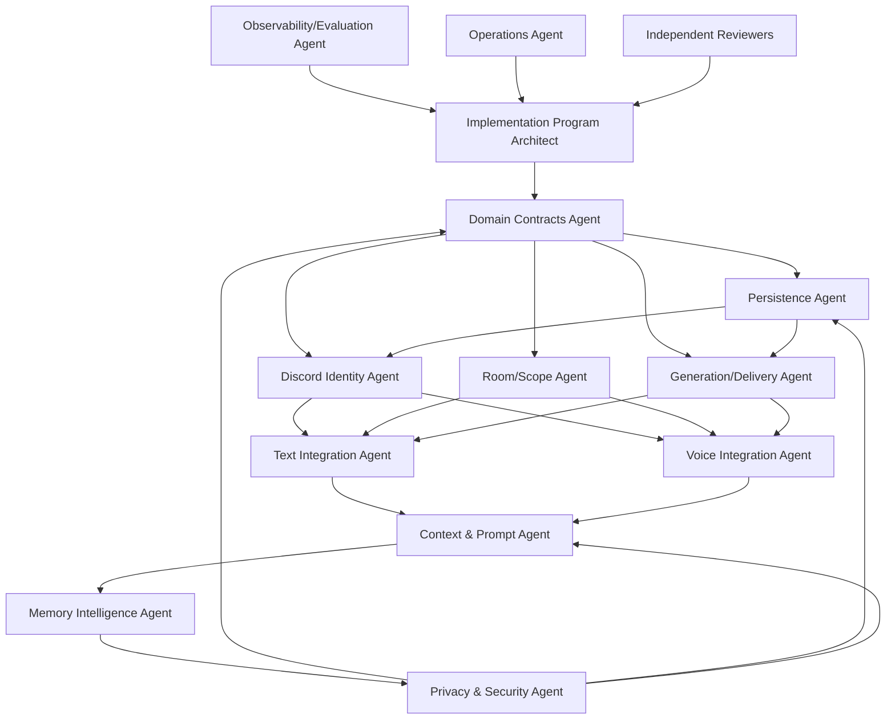
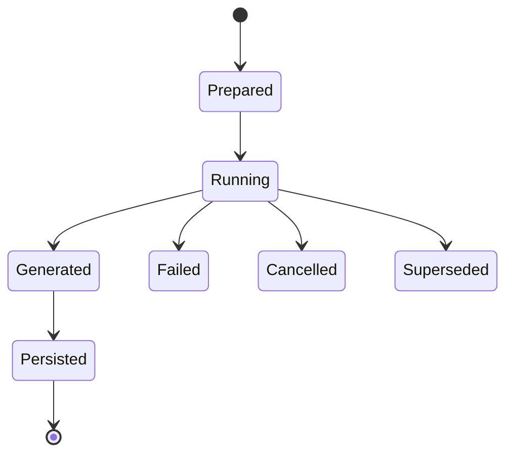
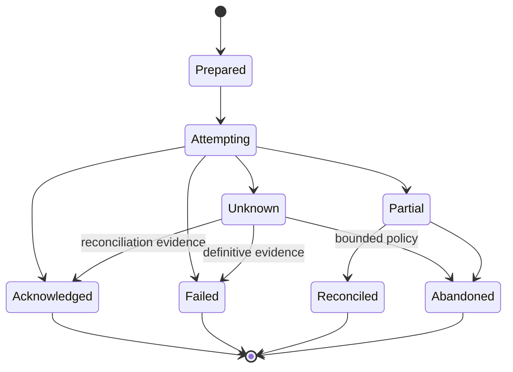

# Implementation Backlog and Multi-Agent Ownership Graph

**Artifact filename:** `21-implementation-backlog.md`  
**Artifact status:** Implementation-planning baseline; coding is not authorized until the gates in this document are satisfied.  
**Evidence cut:** 2026-08-02  
**Primary repository inspected:** DC_BOT `main` at commit `0ea3cbf5ec92f719e2b48066c3ada45aa50122ad`  
**Comparison repositories inspected:** AIRI `main` at `4d6e61f77dc99ec76c7cf352df62abb4282386c5`; AstrBot `master` at `49095d3ba3fca9272a67aa5eeab2f6c0719c5091`

---

## 1. Executive conclusion

**[Recommendation]** Implement the first shared-memory milestone as an **in-process, transport-neutral domain/application layer with a SQLite adapter**, composed into the existing Discord bot service. Keep the contracts independent of Discord, SQLite, and model providers so that a PostgreSQL adapter or standalone Memory Runtime can be added later without changing text or voice semantics.

**[Confirmed repository fact]** DC_BOT currently contains one Discord bot service with shared orchestration and voice code, including normalized input events, a group-turn builder, room abstractions, a conversation controller, and voice playback management. Source: https://github.com/starryark/DC_BOT/tree/0ea3cbf5ec92f719e2b48066c3ada45aa50122ad/airi/services/discord-bot/src.

**[Confirmed repository fact]** The current normalized event contract carries `userId` and one `displayName`; it does not yet carry a complete actor snapshot that separates historical presentation from current addressing. Source: https://github.com/starryark/DC_BOT/blob/0ea3cbf5ec92f719e2b48066c3ada45aa50122ad/airi/services/discord-bot/src/orchestration/events.ts.

**[Confirmed repository fact]** Group voice input preserves original utterances and per-speaker messages, but the current controller selects the first input event as the turn input and passes the synthetic display label `Discord group` into generation/history handling. That is a direct migration target because the durable causal model must retain every triggering event and must not create a synthetic person. Sources: https://github.com/starryark/DC_BOT/blob/0ea3cbf5ec92f719e2b48066c3ada45aa50122ad/airi/services/discord-bot/src/orchestration/group-turn-builder.ts and https://github.com/starryark/DC_BOT/blob/0ea3cbf5ec92f719e2b48066c3ada45aa50122ad/airi/services/discord-bot/src/orchestration/conversation-controller.ts.

**[Confirmed repository fact]** The controller waits for voice playback to drain before committing the current process-local exchange and uses response epochs to reject stale asynchronous results. This is useful lifecycle behavior, but it is not a durable delivery ledger and does not represent partial, failed, unknown, or reconciled delivery states. Source: https://github.com/starryark/DC_BOT/blob/0ea3cbf5ec92f719e2b48066c3ada45aa50122ad/airi/services/discord-bot/src/orchestration/conversation-controller.ts.

**[Confirmed repository fact]** The checked-in `memory-pgvector` package is a 24-line server-module skeleton whose configuration handler is empty; it is not evidence of a complete production memory implementation. Source: https://github.com/starryark/DC_BOT/blob/0ea3cbf5ec92f719e2b48066c3ada45aa50122ad/airi/packages/memory-pgvector/src/index.ts.

**[External comparison finding]** AIRI issue #879 is an open proposal for an Alaya memory layer and describes current memory logic as incomplete/distributed. It must not be treated as implemented upstream behavior. Source: https://github.com/moeru-ai/airi/issues/879.

**[External comparison finding]** AstrBot implemented group message-history persistence and retrieval in a commit spanning database, manager, configuration, documentation, and tests. It is a useful product baseline, not proof that its storage/concurrency choices satisfy this program's attribution, deletion, and delivery requirements. Source: https://github.com/AstrBotDevs/AstrBot/commit/e80e01c77693355cf7ef42a607ea89e9093b9b2b.

The critical sequencing rule is: **domain contracts → persistence → identity propagation → event/delivery model → text and voice integration → context assembly → privacy controls → evaluation baseline**. Text and voice implementers may change adapters only after the shared contract gate, and neither may create local substitutes.

---

## 2. Scope

### 2.1 In scope

This backlog covers:

1. Shared domain contracts and a single MemoryPort.
2. Discord actor snapshots, current presentation, scoped aliases, and safe addressing.
3. Physical Discord locations, logical conversation rooms, bindings, and authorization.
4. Attributable raw events, many-to-many causal relations, generation attempts, output segments, and delivery attempts.
5. SQLite persistence, migrations, idempotency, reconciliation, backups, and restore.
6. Text and voice integration through the same port.
7. Authorization-first context assembly and injection-resistant prompt serialization.
8. Explicit memory commands.
9. Asynchronous summaries and structured semantic/episodic/procedural memory.
10. Lexical/full-text retrieval and an evidence-gated vector experiment.
11. Correction, deletion, export, retention, cache invalidation, and derived-data cleanup.
12. Observability, evaluation, operations, rollback, and a later topology ADR.

### 2.2 Out of scope for this artifact

**[Non-goal]** This artifact does not write or modify production code.

**[Non-goal]** It does not mandate a standalone HTTP service, PostgreSQL, pgvector, learned reranking, or graph storage.

**[Non-goal]** It does not assert that a Discord identity is a verified cross-platform human identity.

**[Non-goal]** It does not define product-facing retention periods, legal bases, or jurisdiction-specific policy; those require owner approval.

**[Non-goal]** It does not copy full text-room transcripts into voice context merely because a person appears in both modalities.

---

## 3. Sources inspected

| Source | Branch / commit | Material inspected | Status |
|---|---|---|---|
| DC_BOT root | `main` / `0ea3cbf5ec92f719e2b48066c3ada45aa50122ad` | Repository layout and Discord service location: https://github.com/starryark/DC_BOT/tree/0ea3cbf5ec92f719e2b48066c3ada45aa50122ad | Confirmed repository fact |
| DC_BOT Discord bot | same | Service tree, configuration/readme, orchestration, voice, telemetry: https://github.com/starryark/DC_BOT/tree/0ea3cbf5ec92f719e2b48066c3ada45aa50122ad/airi/services/discord-bot | Confirmed repository fact |
| DC_BOT normalized events | same | `src/orchestration/events.ts`: https://github.com/starryark/DC_BOT/blob/0ea3cbf5ec92f719e2b48066c3ada45aa50122ad/airi/services/discord-bot/src/orchestration/events.ts | Confirmed repository fact |
| DC_BOT group turns | same | `src/orchestration/group-turn-builder.ts`: https://github.com/starryark/DC_BOT/blob/0ea3cbf5ec92f719e2b48066c3ada45aa50122ad/airi/services/discord-bot/src/orchestration/group-turn-builder.ts | Confirmed repository fact |
| DC_BOT controller | same | `src/orchestration/conversation-controller.ts`: https://github.com/starryark/DC_BOT/blob/0ea3cbf5ec92f719e2b48066c3ada45aa50122ad/airi/services/discord-bot/src/orchestration/conversation-controller.ts | Confirmed repository fact |
| DC_BOT room model | same | `src/orchestration/room.ts`: https://github.com/starryark/DC_BOT/blob/0ea3cbf5ec92f719e2b48066c3ada45aa50122ad/airi/services/discord-bot/src/orchestration/room.ts | Confirmed repository fact |
| DC_BOT voice manager | same | `src/voice/voice-manager.ts`: https://github.com/starryark/DC_BOT/blob/0ea3cbf5ec92f719e2b48066c3ada45aa50122ad/airi/services/discord-bot/src/voice/voice-manager.ts | Confirmed repository fact |
| DC_BOT package workspace | same | `core-agent`, `memory-pgvector`, other packages: https://github.com/starryark/DC_BOT/tree/0ea3cbf5ec92f719e2b48066c3ada45aa50122ad/airi/packages | Confirmed repository fact |
| DC_BOT `memory-pgvector` | same | `src/index.ts`: https://github.com/starryark/DC_BOT/blob/0ea3cbf5ec92f719e2b48066c3ada45aa50122ad/airi/packages/memory-pgvector/src/index.ts | Confirmed repository fact |
| AIRI | `main` / `4d6e61f77dc99ec76c7cf352df62abb4282386c5` | Repository baseline: https://github.com/moeru-ai/airi/tree/4d6e61f77dc99ec76c7cf352df62abb4282386c5 | External comparison |
| AIRI Alaya proposal | open issue | Issue #879: https://github.com/moeru-ai/airi/issues/879 | Proposal, not implemented behavior |
| AIRI roadmap | issue/roadmap | Roadmap context: https://github.com/moeru-ai/airi/issues/42 | Roadmap claim, not release evidence |
| AstrBot | `master` / `49095d3ba3fca9272a67aa5eeab2f6c0719c5091` | Repository baseline: https://github.com/AstrBotDevs/AstrBot/tree/49095d3ba3fca9272a67aa5eeab2f6c0719c5091 | External comparison |
| AstrBot group-history commit | commit `e80e01c77693355cf7ef42a607ea89e9093b9b2b` | Persistence, retrieval, config, docs, tests: https://github.com/AstrBotDevs/AstrBot/commit/e80e01c77693355cf7ef42a607ea89e9093b9b2b | Implemented comparison behavior |

### 3.1 Evidence limitations

**[Open question]** Only the source-plan baseline supplied with this assignment was available as an approved-artifact dependency. The implementation team must attach the final identity, room/scope, event, lifecycle, privacy, retrieval, and evaluation artifacts to the requirement matrix before coding.

**[Open question]** GitHub inspection establishes file contents and repository state, not production deployment topology, traffic, guild count, database volume, operational staffing, or legal retention policy.

---

## 4. Evidence table

| ID | Claim | Classification | Source URL | Confidence |
|---|---|---|---|---|
| EVID-001 | DC_BOT has an `airi/services/discord-bot` service with orchestration and voice subtrees. | Confirmed repository fact | https://github.com/starryark/DC_BOT/tree/0ea3cbf5ec92f719e2b48066c3ada45aa50122ad/airi/services/discord-bot | High |
| EVID-002 | `InputEvent` currently normalizes modalities and carries `userId` plus `displayName`. | Confirmed repository fact | https://github.com/starryark/DC_BOT/blob/0ea3cbf5ec92f719e2b48066c3ada45aa50122ad/airi/services/discord-bot/src/orchestration/events.ts | High |
| EVID-003 | Group turns preserve original utterances and messages per user. | Confirmed repository fact | https://github.com/starryark/DC_BOT/blob/0ea3cbf5ec92f719e2b48066c3ada45aa50122ad/airi/services/discord-bot/src/orchestration/group-turn-builder.ts | High |
| EVID-004 | The current group generation path uses the first source event and `displayName: 'Discord group'`. | Confirmed repository fact | https://github.com/starryark/DC_BOT/blob/0ea3cbf5ec92f719e2b48066c3ada45aa50122ad/airi/services/discord-bot/src/orchestration/conversation-controller.ts | High |
| EVID-005 | Voice history is committed only after playback drain and stale epochs are rejected. | Confirmed repository fact | https://github.com/starryark/DC_BOT/blob/0ea3cbf5ec92f719e2b48066c3ada45aa50122ad/airi/services/discord-bot/src/orchestration/conversation-controller.ts | High |
| EVID-006 | This process-local success commit does not provide durable text/voice delivery reconciliation. | Inference from inspected implementation | https://github.com/starryark/DC_BOT/blob/0ea3cbf5ec92f719e2b48066c3ada45aa50122ad/airi/services/discord-bot/src/orchestration/conversation-controller.ts | High |
| EVID-007 | DC_BOT includes `core-agent` and `memory-pgvector` packages. | Confirmed repository fact | https://github.com/starryark/DC_BOT/tree/0ea3cbf5ec92f719e2b48066c3ada45aa50122ad/airi/packages | High |
| EVID-008 | `memory-pgvector/src/index.ts` is a thin module skeleton with an empty configure handler. | Confirmed repository fact | https://github.com/starryark/DC_BOT/blob/0ea3cbf5ec92f719e2b48066c3ada45aa50122ad/airi/packages/memory-pgvector/src/index.ts | High |
| EVID-009 | AIRI Alaya is represented by an open issue/proposal, not verified completed production code. | External research finding | https://github.com/moeru-ai/airi/issues/879 | High |
| EVID-010 | AstrBot has implemented persisted group message history and retrieval with tests. | External research finding | https://github.com/AstrBotDevs/AstrBot/commit/e80e01c77693355cf7ef42a607ea89e9093b9b2b | High |
| EVID-011 | AstrBot's implementation does not by itself establish safe concurrent-write, causal, delivery, or deletion semantics for DC_BOT. | Inference | https://github.com/AstrBotDevs/AstrBot/commit/e80e01c77693355cf7ef42a607ea89e9093b9b2b | High |
| EVID-012 | A mandatory standalone Memory Runtime is not justified by the inspected repository alone. | Recommendation based on available evidence | https://github.com/starryark/DC_BOT/tree/0ea3cbf5ec92f719e2b48066c3ada45aa50122ad/airi/services/discord-bot | Medium-high |
| EVID-013 | Text and voice must share contracts before adapter work to avoid divergent identity, scope, and lifecycle models. | Source-plan requirement / recommendation | Assignment baseline | High |
| EVID-014 | SQLite is the minimal first adapter if measured load and deployment constraints do not disqualify it. | Recommendation | This plan; requires IMP-208/IMP-803 validation | Medium |
| EVID-015 | Vector retrieval must remain optional until lexical and multilingual benchmarks show a material gap and vectors show net benefit. | Source-plan requirement / recommendation | Assignment baseline | High |

---

## 5. Current-state findings

### 5.1 Shared orchestration exists, but shared durable memory does not

**[Confirmed repository fact]** Voice input, grouping, generation, TTS, and playback are coordinated in the Discord service. The existing event union is already provider/adapter-oriented, which reduces migration risk. Sources: https://github.com/starryark/DC_BOT/blob/0ea3cbf5ec92f719e2b48066c3ada45aa50122ad/airi/services/discord-bot/src/orchestration/events.ts and https://github.com/starryark/DC_BOT/blob/0ea3cbf5ec92f719e2b48066c3ada45aa50122ad/airi/services/discord-bot/src/orchestration/conversation-controller.ts.

**[Inference]** The safest migration is to extend normalization with domain-owned actor/scope/event identifiers, then compose a MemoryPort at the service boundary. Rewriting voice orchestration around a remote service in the first milestone would add failure modes before requirements are proven.

### 5.2 Identity is under-specified

**[Confirmed repository fact]** Current events expose a durable Discord `userId` and a single `displayName`. Source: https://github.com/starryark/DC_BOT/blob/0ea3cbf5ec92f719e2b48066c3ada45aa50122ad/airi/services/discord-bot/src/orchestration/events.ts.

**[Recommendation]** Preserve the existing `userId` as the Discord identity key, replace the single presentation string with an actor snapshot, and resolve current addressing separately. Do not update current identity rows on every event; append event snapshots and update current presentation only when material fields change or a freshness policy requires it.

### 5.3 Group voice attribution is partially preserved, then collapsed

**[Confirmed repository fact]** `buildGroupTurn` preserves original utterances and derives per-user messages. Source: https://github.com/starryark/DC_BOT/blob/0ea3cbf5ec92f719e2b48066c3ada45aa50122ad/airi/services/discord-bot/src/orchestration/group-turn-builder.ts.

**[Confirmed repository fact]** `onConversationGroup` currently passes the first event as `inputEvent` and sets the display name to `Discord group`. Source: https://github.com/starryark/DC_BOT/blob/0ea3cbf5ec92f719e2b48066c3ada45aa50122ad/airi/services/discord-bot/src/orchestration/conversation-controller.ts.

**[Recommendation]** Keep one event per attributable utterance, create one generation attempt, and add causal edges from all triggering events. A synthetic group label may be presentation metadata, never a durable person or sole cause.

### 5.4 Current lifecycle logic is valuable but not durable enough

**[Confirmed repository fact]** Epoch checks prevent superseded asynchronous voice work from mutating local history, and successful history commit occurs after playback drain. Source: https://github.com/starryark/DC_BOT/blob/0ea3cbf5ec92f719e2b48066c3ada45aa50122ad/airi/services/discord-bot/src/orchestration/conversation-controller.ts.

**[Inference]** A database cannot atomically commit with Discord send/playback. Therefore the durable model must record generation, output, delivery attempt, transport evidence, and reconciliation separately. “Playback drained” is useful evidence, but partial chunk completion and process crashes still require explicit states.

### 5.5 Existing memory packages do not settle the architecture

**[Confirmed repository fact]** The checked-in pgvector package is only a minimal server module skeleton. Source: https://github.com/starryark/DC_BOT/blob/0ea3cbf5ec92f719e2b48066c3ada45aa50122ad/airi/packages/memory-pgvector/src/index.ts.

**[External research finding]** AIRI's Alaya issue is a proposal that explicitly seeks a more complete unified layer. Source: https://github.com/moeru-ai/airi/issues/879.

**[Recommendation]** Do not bind the DC_BOT milestone to AIRI proposal completion or treat the package name `memory-pgvector` as an architectural mandate.

### 5.6 AstrBot is a feature baseline, not a data-model template

**[External research finding]** AstrBot's group-history commit touches SQLite persistence, a platform history manager, context wiring, configuration, documentation, and unit tests. Source: https://github.com/AstrBotDevs/AstrBot/commit/e80e01c77693355cf7ef42a607ea89e9093b9b2b.

**[Recommendation]** Borrow its operational lesson—persistence needs configuration, tests, and product integration—but independently specify attribution, concurrent writes, correction, erasure, and delivery correctness.

---

## 6. Proposed decisions

### ADR-001 — One canonical MemoryPort

**Decision:** A single versioned, transport-neutral MemoryPort is the only durable memory authority for Discord text and voice.

**Consequences:** Text and voice adapters may keep ephemeral media/session control state, but not independent durable conversation histories. Adapter outage is surfaced; production does not silently substitute unrelated local history.

### ADR-002 — In-process application layer first

**Decision:** Compose the MemoryPort implementation into the existing Discord service for milestone 1.

**Rationale:** The inspected repository does not demonstrate independent scaling, multi-process sharing, separate trust domains, or deployment constraints that require a remote runtime.

**Migration path:** Contracts and adapter conformance tests remain process-neutral. ADR-009/IMP-806 may later approve extraction.

### ADR-003 — SQLite first, adapter boundary mandatory

**Decision:** Use SQLite with WAL and measured contention settings for the first adapter, subject to IMP-208 and IMP-803.

**Blocked outcome:** If measured concurrency, process topology, or operations constraints fail thresholds, substitute PostgreSQL behind the same port before broad rollout.

### ADR-004 — Append payload, separate lifecycle state

**Decision:** Raw event content is append-oriented. Lifecycle transitions are represented separately as append records or tightly constrained state tables with an audit trail.

**Rationale:** This resolves the contradiction between “immutable raw events” and mutable processing/delivery status.

### ADR-005 — Many-to-many causal graph

**Decision:** Use explicit junction relations from inbound events to generation attempts, from generations to output segments, and from output segments to delivery attempts.

**Rejected shortcut:** A fixed exchange row with one `user_event_id`.

### ADR-006 — Snapshot version is evidence, not an append lock

**Decision:** Persist the room/binding/context-selection versions used for generation. Do not reject a generation commit merely because another event was appended concurrently.

**Exception:** Reject only when an authorization/binding change invalidates the selection or a generation is superseded/cancelled under explicit policy.

### ADR-007 — Context eligibility follows delivery evidence

**Decision:** User events are context-eligible when authorized and accepted. Assistant output is eligible only according to explicit delivery outcome: completed delivery by default; partial delivery may contribute only the delivered segments under a reviewed policy; generated-only, failed, cancelled, or unheard output is excluded.

### ADR-008 — Retrieval baseline before vectors

**Decision:** Authorization → exact structured lookup → temporal filtering → lexical/full-text search is the production baseline. Vectors are an isolated experiment until IMP-607 demonstrates net benefit.

### ADR-009 — Deployment topology deferred to evidence

**Decision:** Revisit standalone runtime after actual concurrency, availability, scaling, ownership, and deployment evidence exists.

### ADR-010 — Privacy is release-blocking

**Decision:** Broad prompt use and production retention cannot begin until correction, forget, export, retention, backup handling, derived deletion, and adversarial leakage tests pass.

---

## 7. Alternatives considered

| Alternative | Benefits | Costs / risks | Outcome |
|---|---|---|---|
| Standalone HTTP Memory Runtime immediately | Process isolation; potential multi-client reuse | New network failure modes, auth, deployment, latency, versioning, on-call burden before need is proven | Deferred by ADR-002/009 |
| Put all contracts directly in Discord service | Fastest local edit | Couples domain to Discord; encourages text/voice divergence; harder future extraction | Rejected |
| Put contracts in existing `core-agent` | Reuses package | Broad package ownership/upstream drift; may mix runtime and persistence concerns | Viable fallback if repository owner rejects a new package; requires same boundary rules |
| New `memory-domain` package plus `memory-sqlite` adapter | Clear ownership and dependency direction | Two new packages and workspace wiring | Recommended |
| PostgreSQL first | Better multi-process concurrency and operations at scale | Higher deployment burden; not justified by current evidence | Conditional fallback after benchmarks |
| Mutable whole-conversation JSON | Simple reads and compression | Concurrent-write conflicts, coarse deletion/correction, weak causality | Rejected |
| Append-only everything with no erasure | Auditability | Conflicts with privacy deletion | Rejected; use payload erasure/redaction plus audit-safe tombstones |
| Update current alias/name rows on every event | Simple freshness | Write amplification and contention | Rejected; event snapshot plus change/freshness policy |
| One exchange per user event | Simple schema | Fails group voice and multi-event triggers | Rejected |
| Treat generated output as history before delivery | Easy context continuity | Hallucinates unheard/failed responses into conversation | Rejected |
| Copy text transcript into voice room | Easy cross-modal continuity | Scope leakage, prompt bloat, wrong room semantics | Rejected |
| Vector-first retrieval | Semantic matching | Cost, privacy/deletion burden, opaque ranking, unproven CJK benefit | Rejected for baseline |
| Graph database first | Expressive relations | Operational complexity without benchmark need | Rejected |
| Verified cross-platform human IDs inferred from Discord | Cross-platform continuity | False identity linkage | Rejected |

---

## 8. Rejected alternatives and reasons

1. **Mandatory microservice:** No verified deployment requirement supports it yet.
2. **Synthetic `Discord group` durable author:** It destroys attributable identity.
3. **Single `user_event_id` exchange schema:** It cannot express many-speaker or many-trigger generations.
4. **Room-version compare-and-swap on every generation commit:** It would reject valid work simply because unrelated events arrived.
5. **Exactly-once Discord delivery claim:** The database and Discord transport do not share a transaction.
6. **Silent ephemeral fallback:** It creates false durability and split-brain context.
7. **Private alias as global preferred name:** It leaks private information.
8. **Prompt concatenation of retrieved text:** It allows data to become instructions.
9. **Blocking summary/extraction in voice path:** It threatens real-time latency.
10. **Generic “PostgreSQL/SQLite FTS supports CJK” assertion:** It is not an evaluation result.
11. **Treating AIRI roadmap/issue content as completed code:** It confuses proposal with implementation.
12. **Copying AstrBot's storage model without concurrency/privacy analysis:** Feature existence is not correctness evidence.

---

## 9. Normative requirement catalog

| Requirement ID | Normative statement |
|---|---|
| REQ-ID-001 | Discord user ID is the durable Discord identity key; presentation fields and voice characteristics are attributes. |
| REQ-ID-002 | Every persisted inbound event carries a Discord actor snapshot with the best available presentation fields and source/time metadata. |
| REQ-ID-003 | Historical event presentation is immutable evidence; current addressing resolves separately through active, authorized presentation data. |
| REQ-ID-004 | Aliases are scoped, collision-safe, and resolved to prompt-local opaque person references that are never rendered to users. |
| REQ-SCOPE-001 | Physical Discord locations and logical conversation rooms are distinct and linked only by explicit, versioned bindings. |
| REQ-SCOPE-002 | DM, guild, channel, logical-room, person, and character scopes are authorization boundaries; private data cannot flow into public scopes. |
| REQ-EVENT-001 | Raw event payloads are append-oriented and attributable; lifecycle changes are separate append records or explicit state tables. |
| REQ-EVENT-002 | Generation causality is many-to-many between inbound events, generation attempts, output segments, and delivery attempts. |
| REQ-EVENT-003 | Group voice preserves one durable user event per speaker/utterance; no synthetic person is the durable author. |
| REQ-DELIVERY-001 | Generation, persistence, and Discord text/voice delivery are distinct operations with explicit crash windows. |
| REQ-DELIVERY-002 | Interrupted, failed, unheard, partially delivered, and completed output have distinct lifecycle states and context eligibility. |
| REQ-DELIVERY-003 | A room snapshot/version records generation evidence but ordinary concurrent appends do not invalidate otherwise valid commits. |
| REQ-MEM-001 | Text and voice use one transport-neutral MemoryPort; production cannot silently fall back to unrelated process-local history. |
| REQ-MEM-002 | Raw events, recent context, summaries, semantic memories, episodic memories, and procedural memory remain distinct layers. |
| REQ-MEM-003 | Durable facts carry provenance, confidence, validity intervals, correction, and supersession; assistant speculation is not user truth. |
| REQ-RETRIEVAL-001 | Retrieval applies authorization, exact structured lookup, temporal filtering, and lexical search before optional semantic methods. |
| REQ-RETRIEVAL-002 | Vector retrieval, learned reranking, or graph storage requires benchmark evidence and a reversible rollout. |
| REQ-RETRIEVAL-003 | Summarization, extraction, embedding, graph work, and contradiction reconciliation stay outside the voice-critical path. |
| REQ-PRIV-001 | Private aliases, internal IDs, unauthorized memories, and prompt-local opaque references never leak in public output. |
| REQ-PRIV-002 | Forget, correction, export, retention, backup handling, cache invalidation, summary regeneration, and derived-data deletion are specified and tested. |
| REQ-PRIV-003 | Retrieved memory is untrusted data and is serialized against delimiter, role, mention, Unicode, and internal-ID injection. |
| REQ-OPS-001 | Schema migrations, gateway intents, feature flags, backup/restore, capacity, and deployment topology have explicit operational owners. |
| REQ-OPS-002 | Delivery reconciliation, idempotency, audit events, health signals, and failure alerts are observable. |
| REQ-OPS-003 | A standalone Memory Runtime is adopted only when verified topology, scaling, isolation, or deployment constraints justify it. |
| REQ-EVAL-001 | Release evaluation covers identity continuity, attribution, temporal updates, abstention, privacy leakage, deletion, concurrency, delivery recovery, multilingual retrieval, cost, and latency. |
| REQ-EVAL-002 | Thresholds and retrieval weights are versioned hypotheses backed by reproducible datasets rather than undocumented constants. |

### 9.1 Normative dependency direction

```text
Discord text adapter ─┐
                      ├──> MemoryPort (memory-domain) ───> memory-sqlite
Discord voice adapter ┘              │
                                     ├──> authorization policy
                                     ├──> context selection contract
                                     └──> lifecycle/causal contracts

Async workers ───────────────────────> MemoryPort
Evaluation harness ─────────────────> MemoryPort + read-only evidence interfaces
```

Rules:

- `memory-domain` imports no Discord, SQLite, provider, or transport package.
- `memory-sqlite` imports `memory-domain`; the reverse dependency is forbidden.
- Text and voice adapters import `memory-domain` and the service composition facade, never repository classes.
- Context, privacy, and workers call the authorized MemoryPort facade.
- Optional vector code is isolated behind a retrieval-candidate interface and is disabled by default.
- Contract changes require domain owner plus both text and voice reviewers.

---

## 10. Multi-agent ownership graph

### 10.1 Role graph



### 10.2 File ownership boundaries

| Boundary | Primary owner | Allowed contributors | Mandatory reviewers | Prohibited behavior |
|---|---|---|---|---|
| `airi/packages/memory-domain/**` | Domain Contracts Agent | Privacy, lifecycle, context agents | Text lead, voice lead, persistence lead | Adapter-specific types or shadow contracts |
| `airi/packages/memory-sqlite/**` | Persistence Agent | Privacy deletion and retrieval specialists | Domain and operations leads | Discord imports; policy bypass |
| `services/discord-bot/src/memory/**` | Integration facade owner | Text, voice, identity, lifecycle agents by subpath | Domain and privacy leads | Direct alternate durable store |
| Existing identity/event normalization files | Discord Identity Agent | Text/voice adapter owners | Domain, privacy | Name-keyed identity |
| `orchestration/conversation-controller.ts` | Voice orchestration maintainer during migration | Lifecycle and voice agents through coordinated PRs | Voice, lifecycle, domain | Parallel uncoordinated edits |
| `orchestration/group-turn-builder.ts` | Generation/Delivery Agent | Context/voice agents | Domain, prompt-security | Synthetic durable author |
| Text responder/command files | Text Integration Agent | Command/privacy agents | Domain, privacy | Local memory schema |
| `voice/**` | Voice Integration Agent | Lifecycle/observability agents | Voice maintainer, lifecycle | Memory semantics embedded in playback code |
| Prompt compiler/serializer integration | Context & Prompt Agent | Security, retrieval agents | Privacy/security | Raw retrieved-string concatenation |
| Evaluation datasets/scorers | Evaluation Agent | All workstream leads | Independent reviewer | Tuning on hidden test labels |
| Runbooks/config/rollout | Operations Agent | Persistence, privacy, release agents | Repository owner | Undocumented fallback or irreversible rollout |

### 10.3 Contract-change protocol

1. Open a contract-change proposal with affected requirement IDs and migration impact.
2. Domain owner publishes a compatibility diff and updated conformance fixtures.
3. Text, voice, persistence, privacy, and context owners review before merge.
4. Adapter branches rebase on the same contract commit.
5. CI rejects duplicate exported type names and direct persistence imports.
6. Breaking changes increment the port contract version and include a staged migration.

---

## 11. Merge order, integration gates, and checkpoints

### 11.1 Required merge order

| Order | Merge train | Required tasks | Gate |
|---:|---|---|---|
| 0 | Program controls | IMP-001–003 | Entry gate |
| 1 | Shared domain contracts | IMP-101–108 | G1 Domain |
| 2 | Persistence adapter | IMP-201–208 | G2 Persistence |
| 3 | Identity/scope propagation | IMP-301–305 | G3 Identity |
| 4 | Events, causality, generation/delivery | IMP-401–406 | G4 Event/Delivery |
| 5 | Text and voice adapters | IMP-501–504 | G5 Text/Voice |
| 6 | Context, prompt, commands, memory/retrieval | IMP-601–608; IMP-607 may be defer/reject | G6 Context |
| 7 | Privacy controls | IMP-701–704 | G7 Privacy |
| 8 | Observability, evaluation, operations, release | IMP-801–807 | G8 Evaluation/Release |

### 11.2 Integration gates

#### G1 — Domain layer

Pass conditions:

- One MemoryPort contract and one domain package.
- Identity, scope, event, causality, delivery, and memory-layer types approved.
- No Discord/database imports in domain.
- Text, voice, persistence, privacy reviewers approve.
- Conformance fixtures cover multi-speaker causality and partial delivery.

Rollback checkpoint: no production behavior exists; revert package/contract commit.

#### G2 — Persistence

Pass conditions:

- Clean migration to latest schema.
- Adapter conformance suite passes.
- Concurrent append and idempotency tests pass.
- Backup/restore and deletion-ledger replay are demonstrated.
- No prompt reads or production writes enabled.

Rollback checkpoint: disable write flag; restore pre-migration database snapshot; retain migration evidence.

#### G3 — Identity propagation

Pass conditions:

- All text/voice ingress uses the same snapshot builder.
- Same names never merge; rename history is preserved.
- Alias visibility and room binding matrix passes.
- Gateway intent decision is approved.
- Authorization is applied before repository query.

Rollback checkpoint: disable identity shadow writes; no prompt use has begun.

#### G4 — Event/delivery model

Pass conditions:

- Every admitted event receives a durable ID.
- Group generation has edges to all triggering events.
- Text and voice delivery fault-injection suites pass.
- Unknown delivery states reconcile or alert.
- Concurrent append does not invalidate generation solely due to room version.

Rollback checkpoint: disable durable event/delivery writes together; preserve database for diagnosis; legacy behavior remains explicit and visible only during this pre-prompt-use stage.

#### G5 — Text and voice integration

Pass conditions:

- Both adapters use the same contract version and authorized facade.
- No direct repository import and no independent durable history.
- Cross-modal authorized continuity tests pass.
- Database failure produces a visible degraded state and no false success.
- Voice latency delta remains inside the provisional measured budget.

Rollback checkpoint: disable prompt reads first, then new writes; restore the pre-integration path only if it is labeled degraded/ephemeral and approved for the canary—not silently.

#### G6 — Context assembly

Pass conditions:

- Authorization occurs before ranking.
- Selection manifest is reproducible.
- Prompt serializer passes adversarial tests.
- Summaries/extraction are asynchronous.
- Lexical baseline has language-sliced measurements.
- Vector task has an explicit accept/defer/reject ADR and is not required for release.

Rollback checkpoint: disable prompt-use while continuing safe shadow writes; invalidate generated caches/derived data as required.

#### G7 — Privacy controls

Pass conditions:

- Correction, forget, export, retention, backup handling, cache/summary/FTS/vector cleanup pass.
- Restore-and-redelete drill succeeds.
- Private alias and cross-scope leakage tests have zero critical failures.
- Deletion completeness report enumerates every storage class.

Rollback checkpoint: stop prompt reads and broad writes immediately on privacy failure; retain minimum audit/tombstone evidence under approved policy; execute incident runbook.

#### G8 — Evaluation baseline

Pass conditions:

- Functional, multilingual, concurrency, delivery recovery, cost, and latency reports are reproducible.
- Thresholds are approved and versioned.
- Operations and rollback drills pass.
- No blocking open question or unowned high risk remains.
- Privacy and lifecycle leads sign off.

Rollback checkpoint: canary flag off; prompt reads off before writes; reconcile outstanding deliveries/jobs; preserve evidence for postmortem.

### 11.3 Integration checkpoints

- **IC-01 Contract fixture day:** text, voice, persistence consume the same generated fixtures.
- **IC-02 SQLite adapter demo:** append/read/correct/delete through MemoryPort only.
- **IC-03 Identity replay:** replay text and voice fixtures for renames, duplicate aliases, DM/guild scopes.
- **IC-04 Causal/delivery fault day:** process kills at every DB/Discord boundary.
- **IC-05 Cross-modal internal guild:** authorized continuity with selection traces.
- **IC-06 Prompt red-team:** injection and leakage corpus across text and spoken output.
- **IC-07 Privacy restore drill:** restore old backup, replay deletion ledger, verify all derived stores.
- **IC-08 Release rehearsal:** deploy, canary, degrade, rollback, and reconcile.

### 11.4 Test checkpoints

| Checkpoint | Minimum suites |
|---|---|
| TC-01 | Domain compile-time tests and JSON fixtures |
| TC-02 | SQLite migration, constraints, repository conformance |
| TC-03 | Identity/alias/scope authorization matrix |
| TC-04 | Causal cardinality and lifecycle transition/property tests |
| TC-05 | Text/voice adapter E2E and failure-injection |
| TC-06 | Prompt injection and output-redaction |
| TC-07 | Deletion/export/retention/backup completeness |
| TC-08 | Functional, multilingual, latency, cost, concurrency, recovery |

### 11.5 Rollout stages

| Stage | Behavior |
|---|---|
| R0 | Documentation, contracts, tests only |
| R1 | Code merged but runtime disabled |
| R2 | Shadow writes/selection; no memory changes model prompts |
| R3 | Internal guild/operator opt-in; narrow canary |
| R4 | Production canary with stop conditions |
| R5 | Broader rollout after G8 and post-canary review |

---

## 12. Detailed coding backlog

### IMP-001 — Freeze evidence baseline and ADR registry

- **Epic / workstream:** E0 Program Control
- **Requirement IDs:** REQ-OPS-001, REQ-OPS-003
- **Owning agent role:** Implementation Program Architect
- **Files likely affected:** New: `docs/memory/adr/`, `docs/memory/evidence/`, `docs/memory/implementation-status.md`.
- **Preconditions:** Approved source-plan artifacts are available or explicitly marked unavailable.
- **Inputs:** This backlog; repository SHA; prior ADRs/specifications.
- **Outputs:** Versioned evidence index, contradiction log, ADR template, requirement-to-task matrix.
- **Tests:** Docs link check; every repository fact has a permalink; every recommendation has an ADR or task.
- **Risk:** RISK-001 stale evidence or undocumented assumption.
- **Complexity:** S
- **Parallelization safety:** Safe; first task and continuously maintained.
- **Merge-conflict risk:** Low.
- **Required reviewers:** Domain lead, privacy lead, repository maintainer.
- **Completion evidence:** Merged evidence index names DC_BOT SHA and comparison SHAs; no unresolved fact is labeled confirmed.
- **Rollout stage:** R0 documentation only.

### IMP-002 — Create feature-flag and rollback envelope

- **Epic / workstream:** E0 Program Control
- **Requirement IDs:** REQ-MEM-001, REQ-OPS-001, REQ-OPS-002
- **Owning agent role:** Operations Agent
- **Files likely affected:** Likely: `airi/services/discord-bot/src/config.ts`; new `src/memory/feature-flags.ts`, `docs/runbooks/memory-rollout.md`.
- **Preconditions:** IMP-001.
- **Inputs:** Rollout stages R0-R5 and failure policy.
- **Outputs:** Flags for write, read, prompt-use, commands, summaries, structured memory, FTS, vectors; fail-closed status surface.
- **Tests:** Configuration matrix; invalid combinations rejected; simulated adapter outage cannot masquerade as successful memory.
- **Risk:** RISK-002 silent fallback or split behavior.
- **Complexity:** M
- **Parallelization safety:** Safe with domain work if it does not define domain types.
- **Merge-conflict risk:** Medium in `config.ts`.
- **Required reviewers:** Operations lead, domain lead, text and voice leads.
- **Completion evidence:** Flag matrix and rollback command sequence exercised in a test environment.
- **Rollout stage:** R0-R1.

### IMP-003 — Enforce ownership and contract import boundaries

- **Epic / workstream:** E0 Program Control
- **Requirement IDs:** REQ-MEM-001, REQ-OPS-001
- **Owning agent role:** Build/CI Agent
- **Files likely affected:** Workspace lint/build config; new CODEOWNERS entries; package boundary rules.
- **Preconditions:** Target package paths approved.
- **Inputs:** Ownership table in this document.
- **Outputs:** CI rule: text/voice adapters import contracts but cannot define shadow copies; required reviewers by path.
- **Tests:** Intentional duplicate contract and forbidden import fail CI.
- **Risk:** RISK-003 incompatible contracts invented in parallel.
- **Complexity:** M
- **Parallelization safety:** Safe after package naming decision.
- **Merge-conflict risk:** Medium in root CI and ownership files.
- **Required reviewers:** Repository maintainer, domain lead.
- **Completion evidence:** Red CI fixture demonstrates enforcement; CODEOWNERS requires domain reviewer.
- **Rollout stage:** R0-R1.

### IMP-101 — Define canonical IDs and MemoryPort

- **Epic / workstream:** E1 Shared Domain
- **Requirement IDs:** REQ-ID-001, REQ-MEM-001, REQ-OPS-003
- **Owning agent role:** Domain Contracts Agent
- **Files likely affected:** New package recommended: `airi/packages/memory-domain/src/{ids,port,errors}.ts`; package metadata and tests.
- **Preconditions:** IMP-001; package-location ADR accepted.
- **Inputs:** Source-plan requirements and existing normalized `InputEvent` shape.
- **Outputs:** Branded IDs, typed scope keys, append/query/correct/delete/export port methods, capability/version negotiation.
- **Tests:** Compile-time contract tests; adapter conformance fixture; serialization round trip.
- **Risk:** RISK-004 contract churn blocks all integrators.
- **Complexity:** L
- **Parallelization safety:** Not parallel with other contract-defining tasks; may parallelize test harness.
- **Merge-conflict risk:** High because all workstreams depend on it.
- **Required reviewers:** Text lead, voice lead, persistence lead, privacy lead.
- **Completion evidence:** One exported contract package; no Discord or database imports; conformance suite passes.
- **Rollout stage:** R1 disabled.

### IMP-102 — Model actor snapshots and current presentation

- **Epic / workstream:** E1 Shared Domain
- **Requirement IDs:** REQ-ID-001, REQ-ID-002, REQ-ID-003
- **Owning agent role:** Domain Contracts Agent
- **Files likely affected:** New `memory-domain/src/identity.ts`, contract tests.
- **Preconditions:** IMP-101 ID primitives.
- **Inputs:** Discord user/member presentation fields and historical/current distinction.
- **Outputs:** `ActorSnapshot`, `PersonIdentity`, `CurrentPresentation`, source and observed-at semantics.
- **Tests:** Renames preserve old snapshots; missing guild member data is representable; same name/different IDs never merge.
- **Risk:** RISK-005 identity merge or historical rewrite.
- **Complexity:** M
- **Parallelization safety:** Safe with room model after ID primitives stabilize.
- **Merge-conflict risk:** Medium in package exports.
- **Required reviewers:** Discord identity lead, privacy lead.
- **Completion evidence:** Golden JSON fixtures for rename, nickname removal, duplicate names, bot/system actors.
- **Rollout stage:** R1 disabled.

### IMP-103 — Model scoped aliases and addressing

- **Epic / workstream:** E1 Shared Domain
- **Requirement IDs:** REQ-ID-004, REQ-PRIV-001, REQ-SCOPE-002
- **Owning agent role:** Domain Contracts Agent
- **Files likely affected:** New `memory-domain/src/aliases.ts`, `addressing.ts`, tests.
- **Preconditions:** IMP-101, IMP-102.
- **Inputs:** Candidate scopes: platform, character-global, guild, logical room, private conversation.
- **Outputs:** Alias records, precedence rules, visibility predicates, collision result types, opaque prompt person reference.
- **Tests:** Private alias excluded in guild; duplicate alias yields ambiguity; opaque refs cannot serialize to output.
- **Risk:** RISK-006 private alias leakage or misaddressing.
- **Complexity:** L
- **Parallelization safety:** Parallel with event contract after identity types freeze.
- **Merge-conflict risk:** Medium.
- **Required reviewers:** Privacy lead, context/prompt lead, Discord identity lead.
- **Completion evidence:** Table-driven precedence and collision suite passes.
- **Rollout stage:** R1 disabled.

### IMP-104 — Model physical locations, logical rooms, and bindings

- **Epic / workstream:** E1 Shared Domain
- **Requirement IDs:** REQ-SCOPE-001, REQ-SCOPE-002
- **Owning agent role:** Domain Contracts Agent
- **Files likely affected:** New `memory-domain/src/rooms.ts`, tests; compatibility mapping from existing `orchestration/room-id.ts`.
- **Preconditions:** IMP-101.
- **Inputs:** Guild/channel/thread/DM/voice identifiers; character and logical-room scopes.
- **Outputs:** `PhysicalLocation`, `LogicalRoom`, versioned binding, unbound-channel behavior.
- **Tests:** No implicit cross-channel history; explicit binding crosses configured channels; DM never binds to guild room.
- **Risk:** RISK-007 scope bleed.
- **Complexity:** L
- **Parallelization safety:** Safe with identity model.
- **Merge-conflict risk:** Medium.
- **Required reviewers:** Privacy lead, text lead, voice lead.
- **Completion evidence:** Scope matrix tests cover DM, guild text, thread, voice, unbound channel.
- **Rollout stage:** R1 disabled.

### IMP-105 — Define authorization decision contracts

- **Epic / workstream:** E1 Shared Domain
- **Requirement IDs:** REQ-SCOPE-002, REQ-RETRIEVAL-001, REQ-PRIV-001
- **Owning agent role:** Privacy & Security Agent
- **Files likely affected:** New `memory-domain/src/authorization.ts`, policy test vectors.
- **Preconditions:** IMP-102 through IMP-104.
- **Inputs:** Actor, requester, character, physical location, logical room, memory layer, operation.
- **Outputs:** Deny-by-default policy interface and explainable decision codes for write/read/retrieve/export/delete.
- **Tests:** Cross-guild, DM-to-guild, private-alias, unbound-channel, operator-procedural cases.
- **Risk:** RISK-008 unauthorized recall.
- **Complexity:** L
- **Parallelization safety:** Can parallelize with event contract using frozen scope types.
- **Merge-conflict risk:** Low outside shared exports.
- **Required reviewers:** Domain lead, privacy reviewer, Discord maintainer.
- **Completion evidence:** Authorization matrix is executable and all deny cases are asserted.
- **Rollout stage:** R1 disabled.

### IMP-106 — Define attributable events and causal relations

- **Epic / workstream:** E1 Shared Domain
- **Requirement IDs:** REQ-EVENT-001, REQ-EVENT-002, REQ-EVENT-003
- **Owning agent role:** Domain Contracts Agent
- **Files likely affected:** New `memory-domain/src/{events,causality}.ts`, tests.
- **Preconditions:** IMP-102, IMP-104.
- **Inputs:** Current `InputEvent`; group voice utterances; text mentions/commands.
- **Outputs:** Immutable event payload envelope, append-state events, many-to-many causal edge types, idempotency keys.
- **Tests:** Two-speaker response links to both events; retries deduplicate; payload is never overwritten by lifecycle transition.
- **Risk:** RISK-009 synthetic attribution or one-event exchange assumption.
- **Complexity:** XL
- **Parallelization safety:** Not safe to parallelize competing event schemas.
- **Merge-conflict risk:** High.
- **Required reviewers:** Persistence lead, lifecycle lead, text and voice leads.
- **Completion evidence:** Contract fixtures model one-to-many, many-to-one, cancellation, and partial delivery.
- **Rollout stage:** R1 disabled.

### IMP-107 — Specify generation and delivery lifecycle state machines

- **Epic / workstream:** E1 Shared Domain
- **Requirement IDs:** REQ-DELIVERY-001, REQ-DELIVERY-002, REQ-DELIVERY-003
- **Owning agent role:** Generation/Delivery Agent
- **Files likely affected:** New `memory-domain/src/{generation,delivery}.ts`, transition table and tests.
- **Preconditions:** IMP-106.
- **Inputs:** Existing epoch/cancellation behavior and Discord text/voice delivery realities.
- **Outputs:** Generation attempt, output segment, delivery attempt, state transitions, context-eligibility rule, snapshot evidence.
- **Tests:** Crash before send, after send/before ack record, partial audio, interruption, retry, supersession, concurrent append.
- **Risk:** RISK-010 treating generated or unheard output as completed conversation.
- **Complexity:** XL
- **Parallelization safety:** State-machine design must be serialized; test generation can parallelize.
- **Merge-conflict risk:** High.
- **Required reviewers:** Voice lead, text lead, persistence lead, operations lead.
- **Completion evidence:** Illegal transitions rejected; concurrent room append does not reject valid generation commit solely by version mismatch.
- **Rollout stage:** R1 disabled.

### IMP-108 — Define memory layers, provenance, and correction semantics

- **Epic / workstream:** E1 Shared Domain
- **Requirement IDs:** REQ-MEM-002, REQ-MEM-003, REQ-PRIV-002
- **Owning agent role:** Memory Semantics Agent
- **Files likely affected:** New `memory-domain/src/{memory-records,provenance,corrections}.ts`, tests.
- **Preconditions:** IMP-101, IMP-106.
- **Inputs:** Raw/recent/summary/semantic/episodic/procedural distinctions.
- **Outputs:** Layer-specific records; provenance edges; confidence; valid/recorded time; correction/supersession/tombstone semantics.
- **Tests:** Assistant speculation cannot become asserted user fact; correction supersedes without losing provenance; procedural memory requires operator author.
- **Risk:** RISK-011 false facts become durable truth.
- **Complexity:** XL
- **Parallelization safety:** Can begin after event IDs; coordinate with privacy.
- **Merge-conflict risk:** Medium.
- **Required reviewers:** Privacy lead, retrieval lead, domain lead.
- **Completion evidence:** Truth-maintenance test vectors pass and provenance is mandatory at type/schema boundary.
- **Rollout stage:** R1 disabled.

### IMP-201 — Design SQLite schema and forward-only migrations

- **Epic / workstream:** E2 Persistence
- **Requirement IDs:** REQ-EVENT-001, REQ-MEM-002, REQ-OPS-001
- **Owning agent role:** Persistence Agent
- **Files likely affected:** New `airi/packages/memory-sqlite/src/schema/**`, `migrations/**`, `migration-runner.ts`.
- **Preconditions:** Gate G1 passed.
- **Inputs:** Approved domain contracts and state machines.
- **Outputs:** Normalized tables for identities, snapshots, aliases, rooms/bindings, events, causal edges, generations, segments, deliveries, memories, provenance, jobs, deletion ledger.
- **Tests:** Empty-to-latest migration; downgrade rehearsal via restore, not destructive reverse SQL; constraints and foreign keys.
- **Risk:** RISK-012 schema encodes rejected one-exchange assumption.
- **Complexity:** XL
- **Parallelization safety:** Schema owner is single writer; migration tests can parallelize.
- **Merge-conflict risk:** High.
- **Required reviewers:** Domain lead, privacy lead, operations DBA reviewer.
- **Completion evidence:** ERD, migration checksum, schema conformance, and restore artifact.
- **Rollout stage:** R1 disabled.

### IMP-202 — Implement identity and alias repositories

- **Epic / workstream:** E2 Persistence
- **Requirement IDs:** REQ-ID-001, REQ-ID-002, REQ-ID-003, REQ-ID-004
- **Owning agent role:** Persistence Agent
- **Files likely affected:** New `memory-sqlite/src/repositories/{identity,alias}.ts` and tests.
- **Preconditions:** IMP-201 identity tables.
- **Inputs:** Actor snapshot/current presentation/alias contracts.
- **Outputs:** Append snapshot; throttled current-record update; scoped alias queries; ambiguity-preserving resolution.
- **Tests:** Write-amplification test; rename history; duplicate alias; idempotent observation.
- **Risk:** RISK-013 updating identity record on every event or merging names.
- **Complexity:** L
- **Parallelization safety:** Safe with room repository on separate files.
- **Merge-conflict risk:** Medium in transaction utilities.
- **Required reviewers:** Discord identity lead, privacy lead.
- **Completion evidence:** Repository conformance suite and write-count benchmark.
- **Rollout stage:** R1 disabled.

### IMP-203 — Implement room, binding, and authorization data repositories

- **Epic / workstream:** E2 Persistence
- **Requirement IDs:** REQ-SCOPE-001, REQ-SCOPE-002, REQ-RETRIEVAL-001
- **Owning agent role:** Persistence Agent
- **Files likely affected:** New `memory-sqlite/src/repositories/{rooms,bindings,policy-data}.ts`.
- **Preconditions:** IMP-201 room tables; IMP-105 policy contract.
- **Inputs:** Physical/logical room and binding models.
- **Outputs:** Versioned binding CRUD, exact scope lookup, unbound behavior, policy-supporting queries.
- **Tests:** Binding history; conflicting update; DM isolation; deleted binding invalidates cache.
- **Risk:** RISK-014 accidental cross-room retrieval.
- **Complexity:** L
- **Parallelization safety:** Safe with IMP-202.
- **Merge-conflict risk:** Low.
- **Required reviewers:** Privacy lead, room-domain owner.
- **Completion evidence:** Scope matrix passes against real SQLite adapter.
- **Rollout stage:** R1 disabled.

### IMP-204 — Implement event and causal graph repositories

- **Epic / workstream:** E2 Persistence
- **Requirement IDs:** REQ-EVENT-001, REQ-EVENT-002, REQ-EVENT-003
- **Owning agent role:** Persistence Agent
- **Files likely affected:** New `memory-sqlite/src/repositories/{events,causal-edges}.ts`.
- **Preconditions:** IMP-201; IMP-106 finalized.
- **Inputs:** Event envelopes, causal edge contract, idempotency keys.
- **Outputs:** Append events, append state records, many-to-many edge persistence, attributable ordered reads.
- **Tests:** Concurrent appends; duplicate retry; two speakers/one generation; deletion redaction preserves graph integrity.
- **Risk:** RISK-015 lost or duplicated events.
- **Complexity:** XL
- **Parallelization safety:** Not safe with alternate event persistence work.
- **Merge-conflict risk:** Medium.
- **Required reviewers:** Domain lead, lifecycle lead, privacy lead.
- **Completion evidence:** Concurrency and causal-cardinality suite passes.
- **Rollout stage:** R1 disabled.

### IMP-205 — Implement generation, output, and delivery repositories

- **Epic / workstream:** E2 Persistence
- **Requirement IDs:** REQ-DELIVERY-001, REQ-DELIVERY-002, REQ-DELIVERY-003
- **Owning agent role:** Persistence Agent
- **Files likely affected:** New `memory-sqlite/src/repositories/{generations,outputs,deliveries}.ts`.
- **Preconditions:** IMP-201; IMP-107.
- **Inputs:** State transitions, output segments, transport receipts.
- **Outputs:** Compare-and-transition operations, append delivery attempts, context-eligibility query.
- **Tests:** Illegal transition; partial voice; text send unknown outcome; retry; concurrent room append.
- **Risk:** RISK-016 false completed turns or duplicate delivery.
- **Complexity:** XL
- **Parallelization safety:** Coordinate tightly with lifecycle agent.
- **Merge-conflict risk:** Medium.
- **Required reviewers:** Lifecycle lead, text lead, voice lead.
- **Completion evidence:** State-machine repository conformance passes under fault injection.
- **Rollout stage:** R1 disabled.

### IMP-206 — Implement layered memory and provenance repositories

- **Epic / workstream:** E2 Persistence
- **Requirement IDs:** REQ-MEM-002, REQ-MEM-003, REQ-PRIV-002
- **Owning agent role:** Persistence Agent
- **Files likely affected:** New `memory-sqlite/src/repositories/{summaries,memories,provenance,corrections}.ts`.
- **Preconditions:** IMP-201; IMP-108.
- **Inputs:** Layered memory contracts.
- **Outputs:** Temporal/provenance-aware CRUD, supersession graph, procedural author restrictions.
- **Tests:** As-of-time query; correction chain; provenance completeness; invalid confidence rejected.
- **Risk:** RISK-017 stale or unsupported facts retrieved.
- **Complexity:** XL
- **Parallelization safety:** Safe after tables freeze; separate from event repository.
- **Merge-conflict risk:** Medium.
- **Required reviewers:** Memory semantics lead, privacy lead, retrieval lead.
- **Completion evidence:** Temporal and provenance test suite passes.
- **Rollout stage:** R1 disabled.

### IMP-207 — Implement unit-of-work, idempotency, and reconciliation queue

- **Epic / workstream:** E2 Persistence
- **Requirement IDs:** REQ-DELIVERY-001, REQ-OPS-002, REQ-MEM-001
- **Owning agent role:** Persistence Agent
- **Files likely affected:** New `memory-sqlite/src/{unit-of-work,idempotency,reconciliation-queue}.ts`.
- **Preconditions:** IMP-204, IMP-205.
- **Inputs:** Crash-window matrix and adapter transaction boundaries.
- **Outputs:** Atomic DB-only commits, durable reconciliation jobs, leases, retry backoff, poison-job quarantine.
- **Tests:** Process kill at each checkpoint; duplicate consumer; lease expiry; no lost durable job.
- **Risk:** RISK-018 assumption of database/Discord atomicity.
- **Complexity:** XL
- **Parallelization safety:** Not safe to duplicate queue semantics.
- **Merge-conflict risk:** Medium.
- **Required reviewers:** Lifecycle lead, operations lead.
- **Completion evidence:** Deterministic crash-injection suite and reconciliation trace.
- **Rollout stage:** R1 disabled.

### IMP-208 — Validate concurrency, backup, and schema compatibility

- **Epic / workstream:** E2 Persistence
- **Requirement IDs:** REQ-PRIV-002, REQ-OPS-001, REQ-EVAL-001
- **Owning agent role:** Persistence Test Agent
- **Files likely affected:** New adapter integration tests, load harness, backup/restore fixtures.
- **Preconditions:** IMP-201 through IMP-207.
- **Inputs:** SQLite adapter and representative workloads.
- **Outputs:** Concurrency report, WAL/busy-timeout settings recommendation, backup/restore procedure, migration compatibility report.
- **Tests:** Multi-room writers; same-room appends; read during write; restore then delete; abrupt termination.
- **Risk:** RISK-019 SQLite contention or incomplete restore.
- **Complexity:** L
- **Parallelization safety:** Safe once adapter API stabilizes.
- **Merge-conflict risk:** Low.
- **Required reviewers:** Persistence lead, operations lead, evaluation lead.
- **Completion evidence:** Published benchmark with hardware/config and pass/fail thresholds.
- **Rollout stage:** R1-R2.

### IMP-301 — Capture Discord actor snapshots at every ingress

- **Epic / workstream:** E3 Identity Propagation
- **Requirement IDs:** REQ-ID-001, REQ-ID-002, REQ-ID-003
- **Owning agent role:** Discord Identity Agent
- **Files likely affected:** Likely modify `src/orchestration/events.ts`, mention/command adapters, `src/voice/types.ts`, `src/voice/voice-manager.ts`; new `src/memory/discord-actor-snapshot.ts`.
- **Preconditions:** Gates G1-G2.
- **Inputs:** Discord user/member/message/voice state data and snapshot contract.
- **Outputs:** One snapshot builder used by text and voice; explicit missing/permission-limited fields.
- **Tests:** User/global name/guild nickname combinations; DMs; partial member cache; bot users.
- **Risk:** RISK-020 text and voice capture different identities.
- **Complexity:** L
- **Parallelization safety:** One owner; adapter-specific call sites may parallelize after builder lands.
- **Merge-conflict risk:** High in `events.ts` and voice call sites.
- **Required reviewers:** Domain lead, text lead, voice lead, privacy lead.
- **Completion evidence:** Cross-modality fixture for same user produces same durable identity and different historical snapshots when appropriate.
- **Rollout stage:** R2 shadow write.

### IMP-302 — Implement alias resolution and safe addressing

- **Epic / workstream:** E3 Identity Propagation
- **Requirement IDs:** REQ-ID-004, REQ-PRIV-001
- **Owning agent role:** Discord Identity Agent
- **Files likely affected:** New `src/memory/alias-service.ts`, command hooks, tests.
- **Preconditions:** IMP-202, IMP-301.
- **Inputs:** Current presentation, scoped aliases, requester/output context.
- **Outputs:** Deterministic authorized alias choice, ambiguity response, prompt-local opaque map.
- **Tests:** Private alias in DM not used in guild; same alias/two users; alias revocation; Unicode confusables.
- **Risk:** RISK-021 privacy leak or wrong-person address.
- **Complexity:** L
- **Parallelization safety:** Safe with room resolver after shared policy functions freeze.
- **Merge-conflict risk:** Low.
- **Required reviewers:** Privacy lead, context/prompt lead.
- **Completion evidence:** Addressing matrix and red-team cases pass.
- **Rollout stage:** R2 shadow; R3 opt-in.

### IMP-303 — Implement physical-to-logical room resolver

- **Epic / workstream:** E3 Identity Propagation
- **Requirement IDs:** REQ-SCOPE-001, REQ-SCOPE-002
- **Owning agent role:** Room/Scope Agent
- **Files likely affected:** Likely adapt `src/orchestration/room-id.ts`, `room.ts`; new `src/memory/room-resolver.ts`.
- **Preconditions:** IMP-203.
- **Inputs:** Discord context, character ID, binding configuration.
- **Outputs:** Resolved scope object with authorization inputs and binding version.
- **Tests:** Text/voice same configured logical room; different channels remain separate without binding; DM isolation.
- **Risk:** RISK-022 implicit room joining.
- **Complexity:** L
- **Parallelization safety:** Safe with alias service.
- **Merge-conflict risk:** Medium in existing room files.
- **Required reviewers:** Domain lead, privacy lead, text and voice leads.
- **Completion evidence:** Room resolution golden cases and binding-version trace.
- **Rollout stage:** R2 shadow.

### IMP-304 — Enforce authorization before all memory operations

- **Epic / workstream:** E3 Identity Propagation
- **Requirement IDs:** REQ-SCOPE-002, REQ-RETRIEVAL-001, REQ-PRIV-001
- **Owning agent role:** Privacy & Security Agent
- **Files likely affected:** New `src/memory/authorization-service.ts`; integrate at MemoryPort facade.
- **Preconditions:** IMP-105, IMP-203, IMP-303.
- **Inputs:** Requester, resolved scope, operation, memory layer.
- **Outputs:** Single deny-by-default facade; structured audit reason; no adapter bypass.
- **Tests:** Attempt direct repository access from service code fails boundary lint; negative authorization suite.
- **Risk:** RISK-023 authorization applied after retrieval.
- **Complexity:** L
- **Parallelization safety:** Not safe to duplicate policy in adapters.
- **Merge-conflict risk:** Medium at composition root.
- **Required reviewers:** Domain lead, security reviewer, persistence lead.
- **Completion evidence:** All public MemoryPort methods require authorization context and emit decision code.
- **Rollout stage:** R2 shadow.

### IMP-305 — Review Discord gateway intents and member-update operations

- **Epic / workstream:** E3 Identity Propagation
- **Requirement IDs:** REQ-ID-003, REQ-OPS-001
- **Owning agent role:** Discord Operations Agent
- **Files likely affected:** Discord app configuration docs, `services/discord-bot/README.md`, deployment checklist; code only if event handlers approved.
- **Preconditions:** IMP-301 design identifies required fields.
- **Inputs:** Actual bot scale, intents, member cache behavior, privacy policy.
- **Outputs:** Intent decision record; whether member-update events are required or lazy refresh is sufficient; least-privilege setup.
- **Tests:** Staging bot under intended intents; rename/nickname freshness without unauthorized intent assumptions.
- **Risk:** RISK-024 privileged intent dependency or stale current name.
- **Complexity:** M
- **Parallelization safety:** Safe with integration work; decision must precede broad rollout.
- **Merge-conflict risk:** Low.
- **Required reviewers:** Repository owner, Discord operator, privacy lead.
- **Completion evidence:** Approved operational checklist and observed behavior log.
- **Rollout stage:** R2-R3.

### IMP-401 — Normalize and persist inbound text/voice events

- **Epic / workstream:** E4 Event and Delivery
- **Requirement IDs:** REQ-EVENT-001, REQ-EVENT-003, REQ-MEM-001
- **Owning agent role:** Generation/Delivery Agent
- **Files likely affected:** Likely `src/orchestration/events.ts`; new `src/memory/inbound-event-recorder.ts`; text and voice ingress call sites.
- **Preconditions:** G3; IMP-204.
- **Inputs:** Normalized input plus actor snapshot and room scope.
- **Outputs:** Durable event before generation admission, with idempotency key and modality metadata.
- **Tests:** Text retry, voice utterance retry, ASR failure, filtered transcript policy, process crash after append.
- **Risk:** RISK-025 input used but not attributable or durable.
- **Complexity:** XL
- **Parallelization safety:** Shared recorder first; text/voice call sites can then parallelize.
- **Merge-conflict risk:** High.
- **Required reviewers:** Text lead, voice lead, persistence lead, privacy lead.
- **Completion evidence:** Every admitted event has durable ID; rejected/filtered events have explicit policy and no fabricated user content.
- **Rollout stage:** R2 shadow write.

### IMP-402 — Persist multi-speaker aggregation and causal edges

- **Epic / workstream:** E4 Event and Delivery
- **Requirement IDs:** REQ-EVENT-002, REQ-EVENT-003
- **Owning agent role:** Generation/Delivery Agent
- **Files likely affected:** Likely adapt `src/orchestration/group-turn-builder.ts`, `conversation-controller.ts`; new causal mapper.
- **Preconditions:** IMP-401, IMP-204.
- **Inputs:** Ordered attributable voice events and group-window decision.
- **Outputs:** Generation request references all triggering event IDs; prompt grouping does not create synthetic durable author.
- **Tests:** Two and three speakers; adjacent fragments same speaker; overlapping speech; one-at-a-time rejection.
- **Risk:** RISK-026 first-event-only causality or `Discord group` person record.
- **Complexity:** L
- **Parallelization safety:** Coordinate with voice integration; one owner for causal mapping.
- **Merge-conflict risk:** High in controller/group builder.
- **Required reviewers:** Domain lead, voice lead, context lead.
- **Completion evidence:** Database graph shows all source event edges and no synthetic identity row.
- **Rollout stage:** R2 shadow.

### IMP-403 — Record generation attempts and room snapshot evidence

- **Epic / workstream:** E4 Event and Delivery
- **Requirement IDs:** REQ-DELIVERY-003, REQ-EVENT-002
- **Owning agent role:** Generation/Delivery Agent
- **Files likely affected:** New `src/memory/generation-service.ts`; likely controller integration.
- **Preconditions:** IMP-205, IMP-401/402.
- **Inputs:** Causal event IDs, context selection manifest, room/binding versions, model request metadata.
- **Outputs:** Generation attempt persisted before provider call; completion/failure/cancel states; selected-context manifest hash.
- **Tests:** Concurrent append during generation remains valid; superseded epoch cannot commit output; provider failure.
- **Risk:** RISK-027 misuse of optimistic version as global append lock.
- **Complexity:** XL
- **Parallelization safety:** Not safe to duplicate generation ownership.
- **Merge-conflict risk:** High in controller.
- **Required reviewers:** Persistence lead, context lead, voice and text leads.
- **Completion evidence:** Concurrency test proves append does not force rejection; snapshot reproduces what generation saw.
- **Rollout stage:** R2 shadow.

### IMP-404 — Implement Discord text delivery lifecycle adapter

- **Epic / workstream:** E4 Event and Delivery
- **Requirement IDs:** REQ-DELIVERY-001, REQ-DELIVERY-002, REQ-OPS-002
- **Owning agent role:** Text Integration Agent
- **Files likely affected:** Likely mention responder/output modules; new `src/memory/text-delivery-recorder.ts`.
- **Preconditions:** IMP-205, IMP-403.
- **Inputs:** Output segment and Discord send operation/receipt/error.
- **Outputs:** Prepared/attempted/acknowledged/failed/unknown states, message ID capture, retry policy.
- **Tests:** Send success; API error; timeout with unknown outcome; crash after send before receipt persistence; reconciliation lookup.
- **Risk:** RISK-028 duplicate message or generated-only history.
- **Complexity:** L
- **Parallelization safety:** Safe with voice adapter after shared lifecycle lands.
- **Merge-conflict risk:** Medium in text response path.
- **Required reviewers:** Lifecycle lead, operations lead, privacy lead.
- **Completion evidence:** Fault-injection trace for every text crash window.
- **Rollout stage:** R2 shadow, R3 canary.

### IMP-405 — Implement voice segment and playback lifecycle adapter

- **Epic / workstream:** E4 Event and Delivery
- **Requirement IDs:** REQ-DELIVERY-001, REQ-DELIVERY-002, REQ-OPS-002
- **Owning agent role:** Voice Integration Agent
- **Files likely affected:** Likely `src/voice/voice-manager.ts`, playback/types, `conversation-controller.ts`; new `voice-delivery-recorder.ts`.
- **Preconditions:** IMP-205, IMP-403.
- **Inputs:** Generated speech chunks, synthesis result, queue/start/end/cancel events.
- **Outputs:** Per-segment synthesized/queued/started/completed/interrupted/failed states and aggregate response outcome.
- **Tests:** TTS chunk skipped; barge-in; disconnect; process kill; partial playback; stale epoch.
- **Risk:** RISK-029 partial/unheard output treated as completed.
- **Complexity:** XL
- **Parallelization safety:** Safe with text adapter but not with competing voice-manager edits.
- **Merge-conflict risk:** High.
- **Required reviewers:** Lifecycle lead, voice maintainer, operations lead.
- **Completion evidence:** Playback timeline correlates every segment; context eligibility excludes unheard/failed segments.
- **Rollout stage:** R2 shadow, R3 canary.

### IMP-406 — Implement delivery reconciliation worker

- **Epic / workstream:** E4 Event and Delivery
- **Requirement IDs:** REQ-DELIVERY-001, REQ-DELIVERY-002, REQ-OPS-002
- **Owning agent role:** Operations Agent
- **Files likely affected:** New `src/memory/reconciliation-worker.ts`, job metrics, runbook.
- **Preconditions:** IMP-207, IMP-404, IMP-405.
- **Inputs:** Unknown/incomplete delivery attempts and transport-specific evidence.
- **Outputs:** Retry, resolve, abandon, or operator-review outcomes with bounded policy.
- **Tests:** Lease crash; duplicate worker; text unknown receipt; voice process restart; poison job.
- **Risk:** RISK-030 endless retries or duplicate external effects.
- **Complexity:** L
- **Parallelization safety:** Safe after lifecycle adapters define evidence hooks.
- **Merge-conflict risk:** Low.
- **Required reviewers:** Lifecycle lead, text and voice leads, operations reviewer.
- **Completion evidence:** All seeded unknown states converge or alert within policy.
- **Rollout stage:** R2-R3.

### IMP-501 — Route text context and persistence through MemoryPort

- **Epic / workstream:** E5 Text and Voice Integration
- **Requirement IDs:** REQ-MEM-001, REQ-ID-002, REQ-SCOPE-002
- **Owning agent role:** Text Integration Agent
- **Files likely affected:** Likely text mention/command handlers, `src/services.ts`, `src/memory/text-memory-adapter.ts`.
- **Preconditions:** G4.
- **Inputs:** Text event, resolved actor/room/auth, MemoryPort.
- **Outputs:** Text reads and writes exclusively through shared port behind flags.
- **Tests:** DM, guild mention, thread, same user rename, adapter unavailable, no local-history write.
- **Risk:** RISK-031 text-only shadow contract or fallback.
- **Complexity:** L
- **Parallelization safety:** Safe with voice integration after contracts frozen.
- **Merge-conflict risk:** Medium at composition root.
- **Required reviewers:** Domain lead, privacy lead, lifecycle lead.
- **Completion evidence:** Boundary test shows no text path imports persistence implementation directly.
- **Rollout stage:** R2 shadow; R3 text canary.

### IMP-502 — Route voice context and persistence through MemoryPort

- **Epic / workstream:** E5 Text and Voice Integration
- **Requirement IDs:** REQ-MEM-001, REQ-EVENT-003, REQ-DELIVERY-002
- **Owning agent role:** Voice Integration Agent
- **Files likely affected:** Likely `conversation-controller.ts`, `guild-session.ts`, `room.ts`, voice bridge; new `voice-memory-adapter.ts`.
- **Preconditions:** G4.
- **Inputs:** Per-speaker voice events, logical room, shared MemoryPort.
- **Outputs:** Voice no longer owns unrelated durable history; real-time session state remains local but durable conversation state uses port.
- **Tests:** Single speaker, group, interruption, reconnect, same person after text, adapter unavailable.
- **Risk:** RISK-032 voice process history diverges from text.
- **Complexity:** XL
- **Parallelization safety:** Safe with text integration but controller edits are single-owner.
- **Merge-conflict risk:** High.
- **Required reviewers:** Domain lead, text lead, lifecycle lead, performance reviewer.
- **Completion evidence:** Voice-critical latency remains within approved budget; no durable write bypass.
- **Rollout stage:** R2 shadow; R3 voice canary.

### IMP-503 — Verify scoped cross-modal continuity

- **Epic / workstream:** E5 Text and Voice Integration
- **Requirement IDs:** REQ-MEM-001, REQ-SCOPE-001, REQ-SCOPE-002
- **Owning agent role:** Integration Test Agent
- **Files likely affected:** New end-to-end fixtures under Discord bot tests/evals.
- **Preconditions:** IMP-501, IMP-502.
- **Inputs:** Text and voice adapters with shared test database.
- **Outputs:** Cross-modal test matrix showing person-level continuity without transcript flooding across rooms.
- **Tests:** Text fact recalled in authorized voice scope; unrelated channel transcript excluded; private DM fact excluded from guild voice.
- **Risk:** RISK-033 either no continuity or excessive cross-room copying.
- **Complexity:** L
- **Parallelization safety:** Safe after integrations expose harness.
- **Merge-conflict risk:** Low.
- **Required reviewers:** Text lead, voice lead, privacy lead, evaluation lead.
- **Completion evidence:** E2E traces include selected-context manifest and authorization decisions.
- **Rollout stage:** R3 internal guild.

### IMP-504 — Remove or fail closed on legacy durable histories

- **Epic / workstream:** E5 Text and Voice Integration
- **Requirement IDs:** REQ-MEM-001, REQ-OPS-002
- **Owning agent role:** Implementation Program Architect
- **Files likely affected:** Likely legacy history wiring in `guild-session.ts`, `room.ts`, controller; startup health checks.
- **Preconditions:** IMP-501 through IMP-503; rollback flags proven.
- **Inputs:** Inventory of all process-local history writes and reads.
- **Outputs:** Legacy path removed or explicitly compatibility-only; startup/readiness reports memory degraded and blocks prompt-use if required.
- **Tests:** Injected DB failure; code search for forbidden legacy writes; restart continuity.
- **Risk:** RISK-034 silent ephemeral fallback.
- **Complexity:** L
- **Parallelization safety:** Not safe before both adapters pass.
- **Merge-conflict risk:** High in integration files.
- **Required reviewers:** Repository maintainer, domain lead, operations lead.
- **Completion evidence:** Failure drill shows clear degraded status and no false successful write metric.
- **Rollout stage:** R3-R4.

### IMP-601 — Implement authorization-first context assembler

- **Epic / workstream:** E6 Context and Retrieval
- **Requirement IDs:** REQ-RETRIEVAL-001, REQ-MEM-002, REQ-SCOPE-002
- **Owning agent role:** Context & Prompt Agent
- **Files likely affected:** New `memory-domain` query spec; `src/memory/context-assembler.ts`; tests.
- **Preconditions:** G5; IMP-304; repositories available.
- **Inputs:** Requester/scope, current events, token/latency budget, memory-layer policy.
- **Outputs:** Ordered selection: authorized recent events, exact facts, temporally valid records, lexical results, summaries; selection manifest.
- **Tests:** Unauthorized candidate never reaches ranker; as-of-time; budget truncation; abstention.
- **Risk:** RISK-035 retrieval before authorization or opaque ranking.
- **Complexity:** XL
- **Parallelization safety:** Assembler and serializer separate after selection model freezes.
- **Merge-conflict risk:** Medium.
- **Required reviewers:** Privacy lead, retrieval lead, text and voice leads.
- **Completion evidence:** Every selected item has authorization and provenance trace.
- **Rollout stage:** R3 shadow selection; R4 prompt-use.

### IMP-602 — Implement injection-resistant prompt serialization

- **Epic / workstream:** E6 Context and Retrieval
- **Requirement IDs:** REQ-PRIV-003, REQ-PRIV-001
- **Owning agent role:** Context & Prompt Agent
- **Files likely affected:** New `src/memory/prompt-serializer.ts`; adapt prompt compiler and group builder.
- **Preconditions:** IMP-601 selection model; opaque person refs.
- **Inputs:** Typed context items and actor map.
- **Outputs:** Role-safe structured serialization, escaping/normalization, mention neutralization, output redaction of internal refs.
- **Tests:** Delimiter injection; fake roles; `@everyone`; bidi/zero-width Unicode; JSON/bracket names; internal-ID echo attempts.
- **Risk:** RISK-036 retrieved content becomes instructions or leaks identifiers.
- **Complexity:** XL
- **Parallelization safety:** Can parallelize red-team fixtures.
- **Merge-conflict risk:** High in prompt compilation.
- **Required reviewers:** Security reviewer, prompt compiler owner, privacy lead.
- **Completion evidence:** Adversarial corpus passes; serializer never concatenates untrusted content into control instructions.
- **Rollout stage:** R3 shadow; R4 prompt-use.

### IMP-603 — Implement explicit memory commands

- **Epic / workstream:** E6 Context and Retrieval
- **Requirement IDs:** REQ-MEM-003, REQ-PRIV-002, REQ-SCOPE-002
- **Owning agent role:** Text Integration Agent
- **Files likely affected:** New command handlers for remember/forget/correct/show/export scope; command docs.
- **Preconditions:** IMP-304; correction/delete/export services present or feature-gated.
- **Inputs:** Authorized command actor, explicit content, target scope.
- **Outputs:** Auditable commands with confirmations, ambiguity handling, and no implicit cross-scope mutation.
- **Tests:** Remember self fact; correct fact; forget scope; permission denial; duplicate alias ambiguity.
- **Risk:** RISK-037 destructive or overbroad command.
- **Complexity:** L
- **Parallelization safety:** Command parsing can parallelize with backend services behind mocks.
- **Merge-conflict risk:** Medium in command registry.
- **Required reviewers:** Privacy lead, UX reviewer, domain lead.
- **Completion evidence:** Command transcript fixtures and audit entries.
- **Rollout stage:** R3 operator-only; R4 user opt-in.

### IMP-604 — Implement asynchronous summary pipeline

- **Epic / workstream:** E6 Context and Retrieval
- **Requirement IDs:** REQ-MEM-002, REQ-RETRIEVAL-003, REQ-PRIV-002
- **Owning agent role:** Memory Intelligence Agent
- **Files likely affected:** New job handler, summary policy, summary repository adapter, regeneration hooks.
- **Preconditions:** IMP-206, IMP-207, IMP-601.
- **Inputs:** Authorized event ranges and completion eligibility.
- **Outputs:** Versioned summaries with source-event coverage, model/prompt version, stale flag, regeneration path.
- **Tests:** Voice path does not await summarizer; corrected/deleted source marks summary stale; retry idempotency.
- **Risk:** RISK-038 summary blocks voice or survives deletion incorrectly.
- **Complexity:** L
- **Parallelization safety:** Safe with FTS after job infrastructure.
- **Merge-conflict risk:** Low.
- **Required reviewers:** Privacy lead, operations lead, context lead.
- **Completion evidence:** Latency trace proves asynchronous execution; lineage test passes.
- **Rollout stage:** R3 shadow; R4 retrieval.

### IMP-605 — Implement structured semantic, episodic, and procedural memory

- **Epic / workstream:** E6 Context and Retrieval
- **Requirement IDs:** REQ-MEM-002, REQ-MEM-003, REQ-RETRIEVAL-003
- **Owning agent role:** Memory Intelligence Agent
- **Files likely affected:** New extraction/reconciliation jobs and policy modules.
- **Preconditions:** IMP-108, IMP-206, IMP-604 infrastructure.
- **Inputs:** Eligible attributable events and operator-authored procedures.
- **Outputs:** Candidate extraction, validation/abstention, provenance, confidence, validity, contradiction queue; procedural author enforcement.
- **Tests:** Assistant statement not promoted as user fact; uncertain extraction abstains; contradiction creates review/supersession workflow.
- **Risk:** RISK-039 model-generated false memory.
- **Complexity:** XL
- **Parallelization safety:** Extraction and reconciliation may parallelize only after record contract freezes.
- **Merge-conflict risk:** Medium.
- **Required reviewers:** Memory semantics lead, privacy lead, evaluation lead.
- **Completion evidence:** Labeled extraction benchmark and provenance audit pass.
- **Rollout stage:** R3 shadow only; R4 limited read.

### IMP-606 — Implement lexical/full-text retrieval with multilingual measurement

- **Epic / workstream:** E6 Context and Retrieval
- **Requirement IDs:** REQ-RETRIEVAL-001, REQ-EVAL-001, REQ-EVAL-002
- **Owning agent role:** Retrieval Agent
- **Files likely affected:** New SQLite FTS migration/indexer/query module and benchmark fixtures.
- **Preconditions:** IMP-201, IMP-601 query contract.
- **Inputs:** Authorized textual records, language metadata, lexical benchmark.
- **Outputs:** FTS5 baseline with explicit tokenizer/config; deterministic rank features exposed for evaluation.
- **Tests:** English, Japanese, Simplified/Traditional Chinese, mixed-script, names, recency filter, deletion from index.
- **Risk:** RISK-040 generic FTS claim hides CJK failure.
- **Complexity:** XL
- **Parallelization safety:** Indexing and benchmark corpus can parallelize.
- **Merge-conflict risk:** Medium in migrations.
- **Required reviewers:** Persistence lead, multilingual evaluator, privacy lead.
- **Completion evidence:** Per-language recall/precision and latency report; unsupported languages documented.
- **Rollout stage:** R3 shadow; R4 if thresholds pass.

### IMP-607 — Run optional vector retrieval benchmark spike

- **Epic / workstream:** E6 Context and Retrieval
- **Requirement IDs:** REQ-RETRIEVAL-002, REQ-EVAL-002, REQ-OPS-003
- **Owning agent role:** Retrieval Research Agent
- **Files likely affected:** Isolated experiment package or adapter; do not modify production read path by default.
- **Preconditions:** Stable lexical baseline IMP-606 and labeled evaluation set.
- **Inputs:** Same authorized corpus/queries as lexical baseline.
- **Outputs:** Ablation comparing lexical, vector, hybrid, cost/latency/privacy/deletion burden; ADR accept/defer/reject.
- **Tests:** No authorization bypass; derived vector deletion; cold/warm latency; multilingual slices.
- **Risk:** RISK-041 premature vector infrastructure or vendor-claim adoption.
- **Complexity:** L
- **Parallelization safety:** Safe and non-blocking if isolated.
- **Merge-conflict risk:** Low.
- **Required reviewers:** Evaluation lead, privacy lead, operations lead.
- **Completion evidence:** Reproducible report shows statistically meaningful gain or records rejection.
- **Rollout stage:** R3 experiment; never blocks G6.

### IMP-608 — Implement cache invalidation and derived-data regeneration

- **Epic / workstream:** E6 Context and Retrieval
- **Requirement IDs:** REQ-PRIV-002, REQ-OPS-002
- **Owning agent role:** Memory Intelligence Agent
- **Files likely affected:** New invalidation service and job types; cache adapters.
- **Preconditions:** IMP-604 through IMP-607 data dependencies known.
- **Inputs:** Correction, deletion, binding change, alias change, retention event.
- **Outputs:** Dependency-driven invalidation for summaries, FTS, optional vectors, context caches.
- **Tests:** Delete/correct source then query immediately and after worker; stale cache cannot leak content.
- **Risk:** RISK-042 derived memory survives source mutation.
- **Complexity:** L
- **Parallelization safety:** Coordinate with privacy deletion task.
- **Merge-conflict risk:** Medium in job registry.
- **Required reviewers:** Privacy lead, persistence lead, operations lead.
- **Completion evidence:** End-to-end invalidation trace with bounded convergence time.
- **Rollout stage:** R3-R4.

### IMP-701 — Implement correction and supersession workflow

- **Epic / workstream:** E7 Privacy Controls
- **Requirement IDs:** REQ-MEM-003, REQ-PRIV-002
- **Owning agent role:** Privacy & Security Agent
- **Files likely affected:** New `src/memory/correction-service.ts`; command/API integration.
- **Preconditions:** IMP-206, IMP-608.
- **Inputs:** Authorized correction request and target provenance.
- **Outputs:** Append correction/supersession, temporal close, audit record, invalidation jobs.
- **Tests:** Correct current fact; historical event remains evidentiary; unauthorized correction denied; repeated correction.
- **Risk:** RISK-043 destructive overwrite or stale retrieval.
- **Complexity:** L
- **Parallelization safety:** Safe with export service.
- **Merge-conflict risk:** Low.
- **Required reviewers:** Memory semantics lead, retrieval lead.
- **Completion evidence:** As-of and current queries return expected versions; lineage intact.
- **Rollout stage:** R3 operator; R4 user.

### IMP-702 — Implement scoped forget and deletion cascade

- **Epic / workstream:** E7 Privacy Controls
- **Requirement IDs:** REQ-PRIV-002, REQ-SCOPE-002
- **Owning agent role:** Privacy & Security Agent
- **Files likely affected:** New deletion planner/executor, deletion ledger, repository hooks, backup policy hooks.
- **Preconditions:** IMP-201/206/608; deletion semantics ADR.
- **Inputs:** Subject/scope selector, requester authorization, legal/operational policy.
- **Outputs:** Plan-preview-confirm-execute flow; payload erasure/redaction; derived deletion; graph-safe tombstones; completion report.
- **Tests:** Person in one guild vs all authorized scopes; raw payload redaction; FTS/vector/summary/cache deletion; retry after crash.
- **Risk:** RISK-044 incomplete deletion or over-deletion.
- **Complexity:** XL
- **Parallelization safety:** Single owner for semantics; adapter hooks can parallelize after plan contract.
- **Merge-conflict risk:** High across repositories.
- **Required reviewers:** Privacy lead, persistence lead, legal/policy owner, operations lead.
- **Completion evidence:** Deletion completeness manifest reconciles every data class and backup handling.
- **Rollout stage:** R3 internal; release-blocking for R4.

### IMP-703 — Implement export, retention, and backup handling

- **Epic / workstream:** E7 Privacy Controls
- **Requirement IDs:** REQ-PRIV-002, REQ-OPS-001
- **Owning agent role:** Privacy & Security Agent
- **Files likely affected:** New export service, retention worker, backup/restore runbook and metadata.
- **Preconditions:** IMP-702 data inventory.
- **Inputs:** Authorized subject/scope and retention policy.
- **Outputs:** Machine-readable export with provenance; retention expiration jobs; backup deletion/expiry statement and restore re-deletion procedure.
- **Tests:** Export isolation; deleted material absent; retention at boundary; restore old backup then replay deletion ledger.
- **Risk:** RISK-045 backup resurrects deleted data or export leaks others.
- **Complexity:** XL
- **Parallelization safety:** Export and operations runbook can parallelize.
- **Merge-conflict risk:** Medium.
- **Required reviewers:** Privacy lead, operations lead, security reviewer.
- **Completion evidence:** Restore-and-redelete drill; export schema validation.
- **Rollout stage:** R3-R4 release blocker.

### IMP-704 — Run privacy and prompt-security adversarial suite

- **Epic / workstream:** E7 Privacy Controls
- **Requirement IDs:** REQ-PRIV-001, REQ-PRIV-002, REQ-PRIV-003, REQ-EVAL-001
- **Owning agent role:** Security Evaluation Agent
- **Files likely affected:** New adversarial corpus, E2E tests, leakage scanner.
- **Preconditions:** IMP-602, IMP-701 through IMP-703.
- **Inputs:** Threat model and all output surfaces.
- **Outputs:** Leakage report for aliases, internal IDs, cross-scope data, deleted data, prompt injection, mentions, Unicode.
- **Tests:** Automated seeded attacks plus manual review; text and spoken output.
- **Risk:** RISK-046 privacy regression reaches production.
- **Complexity:** L
- **Parallelization safety:** Safe after fixtures and surfaces stabilize.
- **Merge-conflict risk:** Low.
- **Required reviewers:** Independent security reviewer, privacy lead, voice/text leads.
- **Completion evidence:** Zero critical leakage cases; accepted residual risks documented.
- **Rollout stage:** R3-R4 release blocker.

### IMP-801 — Add memory, authorization, and delivery observability

- **Epic / workstream:** E8 Observability and Release
- **Requirement IDs:** REQ-OPS-002, REQ-PRIV-001
- **Owning agent role:** Observability Agent
- **Files likely affected:** Likely `src/telemetry.ts`; new metric/event definitions and dashboards.
- **Preconditions:** Domain decision codes and lifecycle states frozen.
- **Inputs:** State transitions, authorization decisions, latency spans, reconciliation jobs.
- **Outputs:** Structured logs/metrics/traces with IDs hashed or access-controlled; SLO and alert candidates.
- **Tests:** No raw private content in telemetry; trace joins causal IDs; unknown delivery and deletion failure alerts.
- **Risk:** RISK-047 invisible failure or telemetry privacy leak.
- **Complexity:** L
- **Parallelization safety:** Instrumentation can follow each feature branch but schema owner is single.
- **Merge-conflict risk:** Medium in telemetry file.
- **Required reviewers:** Privacy lead, operations lead, evaluation lead.
- **Completion evidence:** Dashboard screenshots/query examples and log-redaction tests.
- **Rollout stage:** R2-R4.

### IMP-802 — Build functional memory evaluation baseline

- **Epic / workstream:** E8 Observability and Release
- **Requirement IDs:** REQ-EVAL-001, REQ-EVAL-002
- **Owning agent role:** Evaluation Agent
- **Files likely affected:** New `evals/memory/` datasets, runner, scoring, reports.
- **Preconditions:** G6; privacy-safe synthetic/labeled corpus.
- **Inputs:** Requirement catalog and acceptance scenarios.
- **Outputs:** Versioned tests for identity continuity, attribution, updates, abstention, privacy, deletion, concurrency, delivery recovery.
- **Tests:** Evaluator self-tests; deterministic seeds; manual spot check.
- **Risk:** RISK-048 optimizing anecdotes instead of measured behavior.
- **Complexity:** XL
- **Parallelization safety:** Dataset authoring can parallelize with system implementation; freeze before threshold selection.
- **Merge-conflict risk:** Low.
- **Required reviewers:** Domain, privacy, text, voice, retrieval leads.
- **Completion evidence:** Baseline report on legacy and new path with confidence intervals where applicable.
- **Rollout stage:** R2 baseline; R4 gate.

### IMP-803 — Benchmark latency, cost, concurrency, and recovery

- **Epic / workstream:** E8 Observability and Release
- **Requirement IDs:** REQ-EVAL-001, REQ-EVAL-002, REQ-OPS-002
- **Owning agent role:** Performance Evaluation Agent
- **Files likely affected:** Load/fault harness, benchmark configuration, report.
- **Preconditions:** IMP-501/502 and lifecycle adapters runnable.
- **Inputs:** Representative text/voice workloads, hardware, provider stubs and controlled live samples.
- **Outputs:** p50/p95/p99 DB/context overhead; voice critical-path delta; throughput; cost; crash recovery.
- **Tests:** Cold/warm; single/multi-room; writer contention; provider timeout; worker backlog.
- **Risk:** RISK-049 arbitrary latency target or hidden queueing.
- **Complexity:** L
- **Parallelization safety:** Safe with multilingual evaluation.
- **Merge-conflict risk:** Low.
- **Required reviewers:** Voice performance owner, persistence lead, operations lead.
- **Completion evidence:** Reproducible command and raw result artifact; thresholds proposed only after baseline.
- **Rollout stage:** R3-R4 gate.

### IMP-804 — Benchmark multilingual and CJK retrieval

- **Epic / workstream:** E8 Observability and Release
- **Requirement IDs:** REQ-EVAL-001, REQ-RETRIEVAL-001, REQ-RETRIEVAL-002
- **Owning agent role:** Multilingual Evaluation Agent
- **Files likely affected:** Language-sliced queries/judgments, tokenizer notes, report.
- **Preconditions:** IMP-606; optional IMP-607.
- **Inputs:** English/Japanese/Chinese/mixed-script corpus and relevance labels.
- **Outputs:** Per-language recall, precision, MRR/nDCG where appropriate, latency, error taxonomy.
- **Tests:** Names, aliases, inflections, no-space scripts, code-switching, temporal constraints.
- **Risk:** RISK-050 English aggregate conceals CJK failure.
- **Complexity:** L
- **Parallelization safety:** Safe with performance evaluation.
- **Merge-conflict risk:** Low.
- **Required reviewers:** Native-language reviewers, retrieval lead.
- **Completion evidence:** Language-sliced report and explicit go/no-go for each supported locale.
- **Rollout stage:** R3-R4 gate.

### IMP-805 — Write operations, migration, backup, and incident runbooks

- **Epic / workstream:** E8 Observability and Release
- **Requirement IDs:** REQ-OPS-001, REQ-OPS-002, REQ-PRIV-002
- **Owning agent role:** Operations Agent
- **Files likely affected:** New `docs/runbooks/memory-{deploy,rollback,backup,restore,deletion,incident}.md`.
- **Preconditions:** Persistence and privacy procedures proven.
- **Inputs:** Flags, migrations, SLOs, alerts, reconciliation, deletion ledger.
- **Outputs:** Stepwise deploy/rollback, read-disable/write-disable order, restore, capacity, corruption, queue backlog and privacy incident playbooks.
- **Tests:** Tabletop and hands-on drills; commands validated in staging.
- **Risk:** RISK-051 rollback loses writes or re-enables leaked data.
- **Complexity:** L
- **Parallelization safety:** Draft early; finalize after drills.
- **Merge-conflict risk:** Low.
- **Required reviewers:** Repository owner, privacy lead, persistence lead.
- **Completion evidence:** Signed drill record with observed recovery point/time.
- **Rollout stage:** R3-R4 gate.

### IMP-806 — Decide in-process versus standalone Memory Runtime

- **Epic / workstream:** E8 Observability and Release
- **Requirement IDs:** REQ-OPS-003, REQ-EVAL-001
- **Owning agent role:** Architecture Review Board
- **Files likely affected:** New `ADR-009-memory-deployment-topology.md`; no code unless decision changes.
- **Preconditions:** IMP-803 operational data and deployment inventory.
- **Inputs:** Process topology, scaling, fault isolation, language/runtime boundaries, ownership, latency, security, operations burden.
- **Outputs:** Keep in-process, extract later, or build runtime; explicit triggers and migration path.
- **Tests:** Decision checklist is evidence-backed; prototype only if a disputed constraint requires it.
- **Risk:** RISK-052 microservice by assumption or in-process beyond proven limits.
- **Complexity:** M
- **Parallelization safety:** Non-blocking until evidence exists.
- **Merge-conflict risk:** None.
- **Required reviewers:** Repository owner, operations, security, domain, performance leads.
- **Completion evidence:** Approved ADR cites measured constraints and rejects unsupported claims.
- **Rollout stage:** R4 decision; extraction is a separate program if chosen.

### IMP-807 — Run production-readiness review and staged release

- **Epic / workstream:** E8 Observability and Release
- **Requirement IDs:** REQ-EVAL-001, REQ-OPS-001, REQ-OPS-002, REQ-PRIV-002
- **Owning agent role:** Release Manager
- **Files likely affected:** Release checklist, compatibility notes, dashboard links, rollback record.
- **Preconditions:** Gate G8 evidence complete; no blocking questions.
- **Inputs:** All gate reports, risk register, thresholds, runbooks.
- **Outputs:** R4 canary plan then R5 broad rollout, owners/on-call, stop conditions, post-release review.
- **Tests:** Canary synthetic probes; deletion/export smoke; text/voice continuity; rollback rehearsal.
- **Risk:** RISK-053 broad rollout before correctness/privacy evidence.
- **Complexity:** L
- **Parallelization safety:** Final serial task.
- **Merge-conflict risk:** Low.
- **Required reviewers:** Repository owner plus all workstream leads; privacy and lifecycle approvals mandatory.
- **Completion evidence:** Signed go/no-go; canary metrics within thresholds; rollback checkpoint remains usable.
- **Rollout stage:** R4-R5.

---

## 13. Interfaces, schemas, diagrams, state machines, and test vectors

### 13.1 MemoryPort interface sketch

```ts
// Specification pseudocode; not production code.
interface MemoryPort {
  readonly contractVersion: string;

  appendInboundEvent(
    auth: AuthorizationContext,
    event: InboundEventEnvelope,
    idempotencyKey: string,
  ): Promise<AppendResult>;

  observeActor(
    auth: AuthorizationContext,
    snapshot: ActorSnapshot,
    policy: ObservationPolicy,
  ): Promise<IdentityObservationResult>;

  resolveRoom(
    auth: AuthorizationContext,
    physical: PhysicalLocation,
    characterId: CharacterId,
  ): Promise<ResolvedRoom>;

  beginGeneration(
    auth: AuthorizationContext,
    request: GenerationAttemptDraft,
  ): Promise<GenerationAttempt>;

  appendCausalEdges(
    auth: AuthorizationContext,
    edges: readonly CausalEdge[],
  ): Promise<void>;

  appendOutputSegment(
    auth: AuthorizationContext,
    segment: OutputSegmentDraft,
  ): Promise<OutputSegment>;

  transitionDelivery(
    auth: AuthorizationContext,
    transition: DeliveryTransition,
  ): Promise<DeliveryAttempt>;

  assembleContext(
    auth: AuthorizationContext,
    query: ContextQuery,
  ): Promise<ContextSelection>;

  correctMemory(
    auth: AuthorizationContext,
    command: CorrectionCommand,
  ): Promise<CorrectionResult>;

  planDeletion(
    auth: AuthorizationContext,
    selector: DeletionSelector,
  ): Promise<DeletionPlan>;

  executeDeletion(
    auth: AuthorizationContext,
    planId: DeletionPlanId,
    confirmation: DeletionConfirmation,
  ): Promise<DeletionReport>;

  exportSubject(
    auth: AuthorizationContext,
    selector: ExportSelector,
  ): AsyncIterable<ExportRecord>;

  health(): Promise<MemoryHealth>;
}
```

### 13.2 Core schema sketch

```text
person_identity
  person_id PK
  platform
  platform_user_id
  created_at
  UNIQUE(platform, platform_user_id)

actor_snapshot
  snapshot_id PK
  person_id FK
  source_event_id FK nullable until event transaction
  username/global_name/guild_nickname/avatar_ref
  observed_at
  payload_version

current_presentation
  person_id + scope_key PK
  selected fields
  source_snapshot_id
  updated_at
  freshness_policy_version

alias
  alias_id PK
  person_id FK
  scope_type + scope_id
  alias_text_normalized
  alias_text_display
  visibility
  valid_from/valid_to
  created_by
  UNIQUE(scope_type, scope_id, alias_id)   -- not alias text

physical_location
logical_room
room_binding(binding_id, physical_id, logical_room_id, character_id,
             valid_from, valid_to, version)

inbound_event
  event_id PK
  modality
  person_id FK
  actor_snapshot_id FK
  physical_location_id
  logical_room_id nullable
  occurred_at
  recorded_at
  immutable_payload_or_redacted_marker
  idempotency_key UNIQUE

event_state_append
  state_event_id PK
  event_id FK
  state
  reason
  recorded_at

generation_attempt
  generation_id PK
  status
  room_binding_version
  context_manifest_hash
  provider/model/prompt_version
  started_at/completed_at

generation_cause
  generation_id FK
  inbound_event_id FK
  relation
  PRIMARY KEY(generation_id, inbound_event_id, relation)

output_segment
  segment_id PK
  generation_id FK
  ordinal
  modality
  text_payload_or_redacted_marker
  status

delivery_attempt
  delivery_id PK
  segment_id FK
  transport
  destination
  attempt_no
  status
  transport_receipt
  started_at/finished_at

delivery_transition_append
reconciliation_job

summary
semantic_memory
episodic_memory
procedural_memory
provenance_edge
memory_correction
deletion_ledger
derived_artifact_registry
```

### 13.3 Generation and delivery state machines





Normative rules:

- A generation may have zero or many output segments.
- Each segment may have multiple delivery attempts.
- “Generated” is not “delivered.”
- A cancelled/superseded generation cannot become context-eligible.
- Text acknowledgement should use the Discord message ID when available.
- Voice completion is recorded per played segment; disconnect/interruption closes remaining segments distinctly.
- State transitions are idempotent and monotonic except through explicit reconciliation transitions.

### 13.4 Context selection pipeline

```text
1. Resolve requester, actor, character, physical location, logical room.
2. Authorize operation and candidate scopes.
3. Load current turn and recent attributable events.
4. Exact structured lookups for explicit entities/facts.
5. Apply valid-time and recorded-time filters.
6. Run lexical search inside authorized partitions.
7. Optionally run vector candidate retrieval only when enabled and authorized.
8. Merge/rank with versioned features and budgets.
9. Select summaries/memories with provenance and confidence.
10. Serialize typed untrusted data through the safe serializer.
11. Persist selection manifest and snapshot evidence.
```

### 13.5 Prompt serialization rules

- Control instructions and data use separate typed channels/sections.
- User-controlled names and memory text are quoted/escaped as data.
- Role labels inside data never create provider roles.
- Mentions are neutralized unless explicitly permitted.
- Unicode normalization and bidi/zero-width diagnostics occur before rendering.
- Prompt-local person references are non-semantic random/opaque tokens.
- Internal database IDs, scope keys, and opaque tokens are stripped from model-visible output where possible and always from user output.
- Retrieved procedural memory has an explicit trusted-operator provenance class; user memory never becomes procedure merely by wording.

### 13.6 Test vectors

| TEST ID | Scenario | Expected result |
|---|---|---|
| TEST-ID-001 | Two Discord IDs both named “Alex” | Two identities; alias lookup is ambiguous; no merge |
| TEST-ID-002 | User nickname changes after old voice event | Old event displays old snapshot in audit; current address uses new permitted name |
| TEST-ID-003 | Private DM alias used later in guild | Alias excluded from guild addressing and prompts |
| TEST-EVENT-001 | Two users speak within group window | Two inbound events; one generation; two causal edges |
| TEST-EVENT-002 | Same speaker has adjacent fragments | Separate raw events retained; prompt grouping may merge presentation fragments |
| TEST-DELIVERY-001 | Text send succeeds, process dies before receipt persistence | State becomes unknown; reconciliation resolves without blind duplicate |
| TEST-DELIVERY-002 | Three voice chunks, second interrupted | First completed; second partial/interrupted; third not attempted; only allowed delivered content eligible |
| TEST-DELIVERY-003 | New event appended while generation runs | Generation commit remains valid unless superseded or authorization/binding invalidated |
| TEST-MEM-001 | Assistant speculates user likes jazz | No durable asserted user fact without qualifying provenance/policy |
| TEST-MEM-002 | User corrects city from A to B | A is superseded; current query returns B; as-of query can explain A |
| TEST-PRIV-001 | Forget user in one guild | Authorized scoped data and derived artifacts removed; other permitted scopes unchanged |
| TEST-PRIV-002 | Restore backup predating deletion | Deletion ledger replay removes restored content before serving reads |
| TEST-PROMPT-001 | Memory contains fake `system:` and delimiters | Rendered as inert data; no role injection |
| TEST-PROMPT-002 | Name contains `@everyone`, newline, bidi controls | Mention neutralized; structure preserved; diagnostic recorded |
| TEST-RETRIEVAL-001 | Japanese/Chinese query without spaces | Measured result reported by language; no unsupported generic success claim |
| TEST-OPS-001 | Memory adapter unavailable | Health is degraded; write not reported successful; no silent unrelated fallback |

---

## 14. Failure modes

| Risk ID | Failure mode | Detection | Containment / recovery | Blocking? |
|---|---|---|---|---|
| RISK-001 | Repository fact drifts | Evidence-link/commit review | Rebaseline before coding | Yes at entry |
| RISK-002 | Silent local fallback | Health and injected outage tests | Fail closed or explicitly degraded mode | Yes |
| RISK-003 | Text/voice contract divergence | CI boundary and conformance fixtures | Block merge | Yes |
| RISK-004 | Contract churn | Compatibility diff | Version port; staged migration | Yes for dependent merge |
| RISK-005 | Same-name identity merge | Duplicate-name tests | Durable platform ID only | Yes |
| RISK-006 | Private alias leak | Scope red-team | Deny and incident response | Yes |
| RISK-007 | Cross-room context leak | Selection manifest audit | Disable reads; invalidate cache | Yes |
| RISK-008 | Authorization after retrieval | Trace assertion | Central authorized facade | Yes |
| RISK-009 | Synthetic or lost attribution | Causal graph invariant | Reject invalid generation record | Yes |
| RISK-010 | Unheard output in history | Lifecycle/context eligibility tests | Exclude; reconcile | Yes |
| RISK-011 | False durable fact | Provenance/extraction benchmark | Abstain, correct, supersede | Yes |
| RISK-012 | Wrong schema cardinality | Migration/domain conformance | Stop migration; restore | Yes |
| RISK-013 | Identity write amplification | write-count telemetry | Material-change/freshness policy | No, unless contention |
| RISK-014 | Binding error | binding version and auth trace | Disable binding/read | Yes |
| RISK-015 | Duplicate/lost events | idempotency/concurrency metrics | replay/reconcile | Yes |
| RISK-016 | Duplicate/unknown delivery | unknown-state queue | bounded reconciliation | Yes |
| RISK-017 | Stale temporal result | as-of tests | invalidate/rebuild | Yes |
| RISK-018 | Assumed atomic Discord send | crash-window suite | explicit unknown states | Yes |
| RISK-019 | SQLite contention | p95/p99 and busy errors | tune, shard process, or switch adapter | Conditional |
| RISK-020 | Modality-specific snapshots | cross-modal fixture | shared builder | Yes |
| RISK-021 | Wrong-person addressing | ambiguity telemetry | abstain/ask user | Yes |
| RISK-022 | Implicit room merge | room matrix | unbound default isolation | Yes |
| RISK-023 | Policy bypass | import lint and audit gaps | block merge | Yes |
| RISK-024 | Privileged intent surprise | staging intent test | lazy fetch/reduced feature | Before rollout |
| RISK-025 | Input not durable before use | trace invariant | stop prompt-use | Yes |
| RISK-026 | First-event-only causality | graph test | migration repair | Yes |
| RISK-027 | Over-strict snapshot CAS | concurrency test | use evidence semantics | Yes |
| RISK-028 | Duplicate text response | receipt reconciliation | operator review/dedupe policy | Yes |
| RISK-029 | Partial voice misclassified | segment timeline | exclude undelivered segment | Yes |
| RISK-030 | Reconciliation storm | queue depth/retry metrics | quarantine/backoff | Yes |
| RISK-031 | Text bypass | boundary test | block merge | Yes |
| RISK-032 | Voice bypass | boundary test | block merge | Yes |
| RISK-033 | Cross-modal overreach | context manifest | scope policy correction | Yes |
| RISK-034 | False durable success | outage drill | fail closed | Yes |
| RISK-035 | Opaque unauthorized ranking | candidate trace | authorize first | Yes |
| RISK-036 | Prompt injection | adversarial corpus | disable prompt-use | Yes |
| RISK-037 | Overbroad command | preview/confirmation | abort/recover via correction | Yes |
| RISK-038 | Summary on critical path | latency spans | async queue | Yes for voice |
| RISK-039 | Model false memory | labeled benchmark | shadow/abstain | Yes |
| RISK-040 | CJK retrieval failure | language slices | limit support/change tokenizer | Conditional |
| RISK-041 | Vector burden without gain | ablation | reject/defer | No |
| RISK-042 | Derived data survives deletion | completeness manifest | invalidate/rebuild | Yes |
| RISK-043 | Destructive correction | lineage tests | append correction | Yes |
| RISK-044 | Incomplete/over-deletion | plan and reconciliation | halt rollout/incident | Yes |
| RISK-045 | Backup resurrection/export leak | restore/export drill | re-delete and incident | Yes |
| RISK-046 | Privacy regression | red-team suite | stop reads/writes | Yes |
| RISK-047 | Telemetry leak | log scanner | redact/rotate/delete | Yes |
| RISK-048 | Weak evaluation | evaluator review | rebuild dataset | Yes |
| RISK-049 | Arbitrary latency target | baseline report | approve measured threshold | Yes |
| RISK-050 | Aggregate hides locale failure | per-language report | locale-specific gate | Yes |
| RISK-051 | Unsafe rollback | rehearsal | do not release | Yes |
| RISK-052 | Wrong topology | ADR review | retain migration path | No initially |
| RISK-053 | Premature broad rollout | signed gate | stop canary | Yes |

---

## 15. Security and privacy implications

1. **Identity minimization:** Store Discord user ID as the durable platform key. Do not infer legal identity or cross-platform equivalence.
2. **Presentation separation:** Event snapshots preserve what was observed; current presentation is a mutable convenience view with provenance.
3. **Alias confidentiality:** Visibility is part of the alias record and authorization query, not a UI-only convention.
4. **Scope-first retrieval:** Unauthorized data must not become a candidate, embedding input, rank feature, log field, or prompt fragment.
5. **Prompt/data separation:** All retrieved content is untrusted, including summaries and operator-entered text unless provenance explicitly grants procedural trust.
6. **Deletion inventory:** Raw payloads, snapshots, aliases, summaries, FTS rows, vectors, caches, exports, logs, backups, and evaluation captures must be inventoried.
7. **Audit minimization:** Keep state and deletion audit evidence without retaining erased content; use tombstones/hashes only under approved policy.
8. **Telemetry hygiene:** Prefer opaque correlation IDs and aggregate metrics. Raw message text and aliases must not be default log fields.
9. **Gateway intents:** Additional member-update behavior may require privileged intents and operational/privacy review; do not assume availability.
10. **Voice sensitivity:** Voice characteristics remain attributes and must not become biometric identity verification.
11. **Procedural memory:** Only explicitly authorized operator sources may create instructions; model-generated or user-retrieved data cannot silently become procedure.
12. **Exports:** Exports are scoped to the requester/authorized subject and include provenance without exposing other participants' private content.
13. **Backups:** A restore is not complete until deletion-ledger replay and derived-index cleanup finish.
14. **Incident priority:** Cross-scope leakage, private alias leakage, incomplete deletion, and false delivery completion are release-stopping incidents.

---

## 16. Testable acceptance criteria

### Domain and ownership

- **AC-001:** Exactly one exported MemoryPort contract is used by both text and voice.
- **AC-002:** CI fails when an adapter defines a duplicate durable identity/event/delivery contract.
- **AC-003:** Domain package has zero Discord, SQLite, HTTP, or model-provider imports.

### Identity and scope

- **AC-010:** Same alias/display name across two Discord IDs never merges identities.
- **AC-011:** Historical presentation remains attached to old events after rename.
- **AC-012:** Private aliases are absent from guild context/output.
- **AC-013:** Unbound channels do not share recent history by default.
- **AC-014:** Every retrieval trace includes an authorization decision before candidates.

### Events and delivery

- **AC-020:** Every admitted text/voice input has a durable attributable event ID.
- **AC-021:** A group response can reference N triggering events without a synthetic author.
- **AC-022:** New room appends during generation do not alone invalidate commit.
- **AC-023:** Generated-only, failed, cancelled, and unheard output is excluded from normal completed-turn context.
- **AC-024:** Every seeded crash window resolves to acknowledged, failed, partial, abandoned, or operator-review state—never falsely completed.

### Persistence

- **AC-030:** Empty-to-current migration, backup, restore, and deletion-ledger replay pass.
- **AC-031:** Concurrent append/idempotent retry tests have no lost or duplicate logical event.
- **AC-032:** Adapter outage cannot return a successful durable write response.
- **AC-033:** SQLite concurrency and latency stay within thresholds approved after measurement; otherwise PostgreSQL decision is triggered.

### Context and memory

- **AC-040:** Selected context items include scope, provenance, temporal validity, and selection reason.
- **AC-041:** Prompt-security corpus produces no role/delimiter/mention/internal-ID escape.
- **AC-042:** Summary/extraction/embedding work adds no synchronous voice-critical dependency.
- **AC-043:** Assistant speculation is not promoted to asserted user fact in the labeled benchmark.
- **AC-044:** Lexical retrieval reports per-language results; vector retrieval is disabled unless its ADR is accepted.

### Privacy

- **AC-050:** Forget removes or redacts every in-scope primary and derived artifact in the completeness manifest.
- **AC-051:** Restore of a pre-deletion backup followed by ledger replay does not serve deleted data.
- **AC-052:** Export contains only authorized subject/scope data.
- **AC-053:** Zero critical private-alias, cross-guild, DM-to-guild, deleted-data, or internal-ID leaks in adversarial tests.

### Evaluation and operations

- **AC-060:** Evaluation runner, datasets, configuration, and raw outputs are versioned and reproducible.
- **AC-061:** Identity, attribution, temporal update, abstention, privacy, deletion, concurrency, delivery recovery, multilingual, cost, and latency dimensions all have results.
- **AC-062:** Deploy and rollback drills complete with no silent fallback and no unreconciled external effects beyond documented policy.
- **AC-063:** Every high risk has an owner, detection signal, containment, and gate disposition.
- **AC-064:** Production canary has explicit stop conditions and mandatory privacy/lifecycle approval.

---

## 17. Non-goals

- Cross-platform human identity verification.
- Universal memory sharing across characters or guilds.
- Automatic inference of private aliases from voice.
- A graph database, vector database, or learned reranker in milestone 1.
- Exactly-once external delivery claims.
- Synchronous summarization/extraction in the Discord response path.
- Retaining all raw content indefinitely.
- Replacing existing ASR/TTS/LLM providers.
- Rewriting the full Discord orchestration architecture.
- Treating every Discord member update as a required write.
- Making current display names part of durable identity keys.
- Using arbitrary retrieval weights or latency targets without evaluation.

---

## 18. Dependencies on other artifacts

The implementation program must link the approved versions of:

1. Identity and alias specification.
2. Physical/logical room and authorization specification.
3. Event and causal model.
4. Generation/delivery lifecycle and reconciliation state machine.
5. Persistence schema and migration ADR.
6. Context selection and prompt serialization specification.
7. Memory-layer/provenance/correction specification.
8. Privacy deletion/export/retention/backup specification.
9. Evaluation plan and labeled datasets.
10. Operations/deployment topology inventory.

**[Blocking rule]** If an artifact is missing, the corresponding domain task may refine it as a specification, but adapter coding cannot begin until the gate records the decision.

---

## 19. Open questions

### 19.1 Blocking

1. **BQ-001:** Which approved artifacts and exact versions are authoritative for identity, scope, lifecycle, privacy, and evaluation?
2. **BQ-002:** Is a new `memory-domain` package acceptable, or must contracts live in `core-agent`? The boundary rules are mandatory either way.
3. **BQ-003:** What is the initial persistence process topology: one Discord process, multiple workers, or multiple bot replicas sharing state?
4. **BQ-004:** What data-retention and backup-expiry policy is approved for raw text, transcripts, voice-derived text, summaries, and structured memories?
5. **BQ-005:** What user/operator interface authorizes remember, correct, forget, export, and scope selection?
6. **BQ-006:** Which delivery outcomes make partial voice output eligible for future context, if any?
7. **BQ-007:** Are message/transcript payloads allowed in operational backups and telemetry captures, and under what access controls?
8. **BQ-008:** Which Discord gateway intents are approved and available in production?
9. **BQ-009:** What locales are release-supported, and what per-locale retrieval thresholds are acceptable?
10. **BQ-010:** What canary guild/account and incident/on-call owners are available?

### 19.2 Non-blocking

1. **NQ-001:** Whether PostgreSQL becomes the second adapter after measured SQLite limits.
2. **NQ-002:** Whether vectors improve multilingual semantic recall enough to justify their lifecycle burden.
3. **NQ-003:** Whether a standalone runtime is later justified by multi-process sharing or isolation.
4. **NQ-004:** Whether graph-derived navigation adds value beyond relational causal/provenance edges.
5. **NQ-005:** Whether current presentation is refreshed lazily, by member events, or by a bounded hybrid policy.
6. **NQ-006:** Whether user-visible memory inspection needs a richer UI beyond Discord commands.
7. **NQ-007:** Whether delivered partial audio should be reconstructed as text context or summarized as a delivery artifact.
8. **NQ-008:** Whether FTS tokenization requires language-specific indexes or an external lexical engine.

---

## 20. Handoff instructions for downstream agents

### Domain Contracts Agent

- Start with IMP-101.
- Publish contracts and fixtures before any adapter PR.
- Treat text, voice, persistence, and privacy reviews as mandatory.
- Do not import Discord or storage types.

### Persistence Agent

- Do not design schema before G1.
- Preserve many-to-many causality and separate lifecycle state.
- Include deletion/restore semantics in the initial schema, not as a later patch.
- Publish adapter conformance and crash-injection evidence.

### Text Integration Agent

- Do not define identity, room, event, delivery, or memory record types.
- Integrate only through the authorized MemoryPort facade.
- Record text delivery receipts and unknown outcomes.
- Participate in contract review before coding.

### Voice Integration Agent

- Preserve one event per attributable utterance.
- Remove synthetic durable group authorship.
- Keep summary/extraction/embedding outside the critical path.
- Record playback at segment granularity and preserve epoch cancellation semantics.

### Context & Prompt Agent

- Authorize before retrieval/ranking.
- Serialize all memory as untrusted data.
- Produce selection manifests and redaction tests.
- Do not make vectors a baseline dependency.

### Privacy & Security Agent

- Own authorization, alias visibility, correction, deletion, export, retention, backup replay, and leakage gates.
- Block rollout on incomplete derived-data deletion or scope leaks.

### Evaluation and Operations Agents

- Establish baselines before setting thresholds.
- Keep language-sliced results.
- Exercise every crash and rollback checkpoint.
- Produce the evidence required for ADR-009 and release sign-off.

---

## 21. What must be true before coding starts

1. The primary repository commit and all approved artifact versions are recorded.
2. ADR-001 through ADR-008 are accepted or explicitly replaced.
3. The domain package location and ownership boundaries are approved.
4. The MemoryPort, identity, room/scope, event/causal, delivery, and memory-layer contracts have named owners.
5. Text and voice leads agree not to create local substitutes.
6. Privacy owners approve alias visibility, authorization boundaries, and deletion model.
7. The persistence topology and first adapter decision are documented.
8. CI/CODEOWNERS enforcement is ready.
9. Feature flags and fail-closed behavior are specified.
10. A test database, staging Discord application/guild, and fault-injection harness are available.
11. Gateway intent availability is known or tracked as a blocking operational decision.
12. Evaluation dataset ownership and privacy handling are approved.
13. Rollback and backup/restore paths exist before durable production writes.
14. Every blocking open question has an owner and due decision gate.
15. No task begins from a roadmap, issue, or package name as though it were verified implementation.

---

## Concise handoff summary

Next required artifacts/decisions:

- Approve **ADR-001 through ADR-008** and the recommended `memory-domain` / `memory-sqlite` ownership split.
- Attach the authoritative identity, scope, lifecycle, privacy, retrieval, and evaluation specifications to **IMP-001**.
- Resolve blocking questions **BQ-001 through BQ-010**.
- Begin only **IMP-001–003**, then **IMP-101–108**.
- Do not authorize text or voice adapter coding until **G1 Domain** passes; do not authorize prompt use or broad retention until **G7 Privacy** and **G8 Evaluation/Release** pass.
